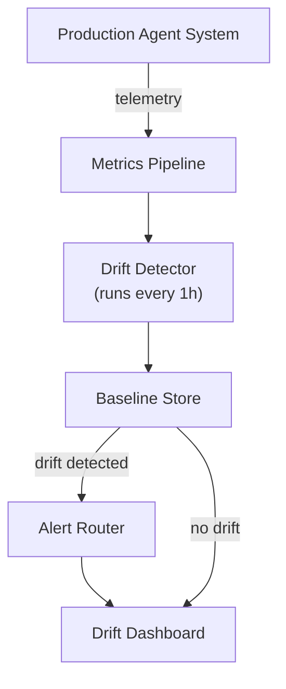
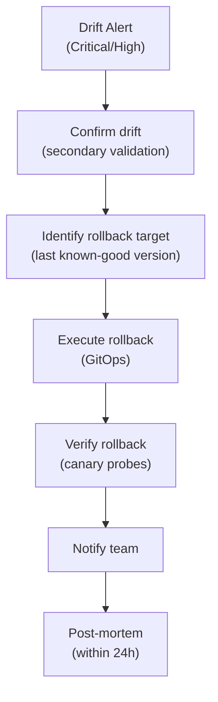

# Drift Detection for Multi-Agent AI Systems

Behavioral drift is the most common source of production quality degradation that traditional monitoring misses. This guide defines how to detect, classify, measure, and respond to drift across all dimensions of a multi-agent AI system — from prompt drift through model drift to MCP contract drift and agent-to-agent (A2A) capability drift.

In traditional software, drift is configuration that has diverged from desired state; GitOps detects this. In AI systems, drift is multidimensional and stochastic. Prompts can drift as users find workarounds, models drift when providers update weights between versions, plans drift when the planner makes systematically different choices over time, tool selection drifts when embedding models or routing logic changes, data drifts when the retrieval corpus changes semantically, and agents drift when the MCP contract or A2A capability changes. A system can be green on all infrastructure metrics while silently producing different and wrong outputs.

---

## 1. Complete Drift Classification

| Drift Type | What Changes | Detection Method | Severity |
|-----------|-------------|-----------------|---------|
| **Prompt drift** | System prompt or user prompt templates diverge from baseline | Hash comparison; semantic similarity | High |
| **Planning drift** | Planner consistently chooses different decomposition strategies | Plan structure comparison; step-count distribution | High |
| **Reasoning drift** | Agent reasoning quality or style changes | LLM-judge scoring over time; inter-rater agreement | Medium |
| **Tool selection drift** | Agent selects different tools for same query class | Tool call frequency distribution; routing accuracy | High |
| **Routing drift** | Router misclassifies query types differently over time | Routing accuracy; manual sample audit | High |
| **Policy drift** | Policy engine enforces rules differently than intended | Policy decision audit; rule coverage tests | Critical |
| **Behavior drift** | Observable agent behavior changes without code change | Behavior fingerprint comparison; output classifier | High |
| **Coordination drift** | Multi-agent handoffs, escalations, delegation patterns change | Graph topology metrics; handoff rate | Medium |
| **Model drift** | LLM provider changes model behavior (weights, RLHF, safety tuning) | Eval suite regression; semantic output comparison | High |
| **Embedding drift** | Embedding model changes similarity scores | ANN query result distribution; neighbor stability | Critical |
| **Memory drift** | Long-term memory accumulates incorrect facts | Fact verification audit; belief consistency check | High |
| **Knowledge drift** | RAG corpus becomes stale or biased | Retrieval accuracy; source freshness metrics | Medium |
| **Agent capability drift** | Agent's actual capabilities diverge from its registered capability manifest | Capability probe tests; skill regression | High |
| **MCP contract drift** | MCP server's tool schema, behavior, or output format changes | Contract tests; schema hash comparison | Critical |
| **A2A capability drift** | Remote agent's published capabilities (agent card) diverge from actual behavior | A2A probe tests; skill regression | Critical |

---

## 2. Drift Detection Methods

### 2.1 Statistical Drift Detection

Apply statistical tests to agent output distributions over time. **Population Stability Index (PSI)** measures how much a distribution has shifted:

```
PSI = Σ (actual% - expected%) × ln(actual% / expected%)

PSI < 0.1  → Stable (no significant drift)
PSI 0.1–0.2 → Monitor (mild drift — investigate)
PSI > 0.2  → Alert (significant drift — action required)
```

Apply PSI to tool call frequency distribution (by tool, by day), output length distribution, classification confidence score distribution, response latency distribution, and routing decision distribution.

**Kolmogorov-Smirnov (KS) test** tests whether two samples are drawn from the same distribution. Use it for continuous metrics: quality scores, similarity scores, cost-per-task.

**Jensen-Shannon Divergence** measures distribution divergence symmetrically. Use it for comparing embedding space distributions before and after model updates.

### 2.2 Behavioral Fingerprinting

Create a behavioral fingerprint — a vector of stable behavioral metrics — and compare it to the baseline. A snapshot of stable behavioral metrics includes tool selection distribution (tool_name: call_frequency), average plan depth, average replanning rate, escalation rate (HITL escalations per 100 tasks), average output token count, routing accuracy (percentage correctly classified queries), judge pass rate (percentage responses passing judge), average retrieval score (mean top-k similarity), policy deny rate (percentage requests denied by policy), and error distribution (error_class: frequency).

Compute the cosine distance between current fingerprint and baseline fingerprint. Distance &gt; 0.15 indicates a drift alert.

### 2.3 Semantic Drift Detection

For prompt and output quality drift, use semantic similarity. Baseline: sample 100 representative outputs from week W0. Current: sample 100 outputs from week Wn for same input distribution.

```
Semantic drift score = 1 - cosine_similarity(
    embed(baseline_outputs),
    embed(current_outputs)
)

Score > 0.05 → semantic drift alert
```

The embedding model used to measure semantic drift must be stable (pinned version). If the embedding model changes, recalibrate the baseline before comparing.

### 2.4 Contract Tests (MCP and A2A Drift)

For tool and agent contract drift, automated contract tests run continuously. Compare live MCP tool schema against expected (pinned) schema via schema hash comparison. Behavioral contract tests send a standard test call to each registered MCP tool. Validate: output schema matches expected type, required fields present, output within expected value ranges. Alert on: type change, field addition or removal, behavioral change.

---

## 3. Per-Drift-Type Detection and Response

### 3.1 Prompt Drift

**Detection:** Hash the deployed system prompt on every agent startup; compare to the prompt registry. Alert if deployed hash ≠ registry hash for the current version. Track prompt semantic similarity over time (even minor wording changes can cause significant behavior changes).

**Response:** Hash mismatch indicates a block deployment; require change management review. Semantic drift in output triggers prompt audit; roll back to last known-good version. Alert to: Platform team and AI governance team.

**GitOps integration:** System prompts are stored in Git. The CI pipeline validates the hash match between Git and the deployment. Unauthorized prompt changes are impossible without a merge.

### 3.2 Model Drift

**Detection:** Send a fixed set of "canary prompts" to the model daily; compare responses to baseline using semantic similarity and judge score. Run the full eval suite after any deployment or detected version change. Monitor token count distribution, vocabulary richness, and refusal rate; sudden shifts indicate model update.

**Warning signs:** Refusal rate increases (safety tuning updated), output length distribution shifts (temperature or sampling changed), specific tool call patterns disappear (the model learned new strategies).

**Response:** Pin the model version explicitly (e.g., `claude-opus-4-8-20261001` not `claude-opus-4-8`). On drift detection: notify team; run eval suite immediately. If quality regression is confirmed: escalate to vendor; roll back to pinned previous version if possible.

### 3.3 Embedding Drift

**Detection — ANN Neighbor Stability:** Embed a fixed probe set of 100 queries using the current embedding model. For each probe, retrieve the top-5 nearest neighbors. Compare the neighbor set to the baseline top-5 for the same queries.

```
Neighbor overlap score = |current_top5 ∩ baseline_top5| / 5

Score < 0.8 → embedding drift alert (significant neighborhood change)
```

**Detection — Retrieval Accuracy:** Maintain a golden set of (query, expected_source) pairs. Run golden set retrieval daily; measure recall@5 against expected sources. Alert if recall@5 drops &gt; 5 percentage points from baseline.

**Response:** Pin the embedding model version (same version for indexing and querying). On embedding model update: re-index the entire corpus before switching queries to the new model. Never mix index vectors (old embedding model) with query vectors (new embedding model) — results will be nonsensical.

### 3.4 Memory Drift

**Detection:** Scan memory entries for semantic contradictions (two entries that make opposite claims). Assign a time-decay weight to memory entries; entries not accessed or confirmed in 30 days are flagged for review. Sample 10 memory entries per week; verify against authoritative source. For a set of test queries, compare agent responses with and without memory; large divergence in factual claims indicates memory contamination.

**Response:** Set TTL on memory entries based on content type (facts: 30 days; user preferences: 90 days; enterprise policies: until explicitly updated). When a contradiction is detected, quarantine both entries; surface for human review. Conduct monthly sample audit by domain expert.

### 3.5 MCP Contract Drift

**Detection — Schema Hash Monitoring:** Every 24 hours (or on MCP server deployment), query the MCP server for its tool list. Hash the complete tool list schema. Compare to pinned schema hash in the contract registry. If hash changed: alert and block agent from upgrading to new MCP server version without review.

**Detection — Behavioral Contract Tests:** Send a standard test call to each registered MCP tool. Validate: output schema matches expected type, required fields present, output within expected value ranges. Alert on: type change, field addition or removal, behavioral change.

**Response:** Schema change requires versioning the MCP contract; require migration review before agents adopt new version. Silent behavioral change (schema same, behavior different) is severity CRITICAL (vendor communication and rollback). Alert to: Platform team, consuming agent teams, and MCP server team.

### 3.6 A2A Capability Drift

**Detection:** Compare the remote agent's published `agent_card.json` to its actual behavior using probes. Send standard skill test requests to registered remote agents daily; validate responses match expected skill outputs. Monitor structural characteristics of A2A responses over time; significant changes indicate behavior change.

**Response:** Capability drift confirmed: alert remote agent owner; isolate agent from production workflows until resolved. Agent card updated without notification: treat as a breaking change; require re-review and agent version bump. Alert to: Platform team, agent registry team, and remote org contact.

---

## 4. Drift Response Playbook

### 4.1 Severity Classification

| Severity | Definition | Response Time | Actions |
|---------|-----------|--------------|---------|
| **Critical** | Drift causing policy violations, safety failures, or data integrity issues | Immediate (&lt; 15 min) | Alert on-call; suspend affected agents; escalate to CISO/CTO if security-related |
| **High** | Quality regression &gt; 10%, routing accuracy &lt; 90%, contract schema change | &lt; 2 hours | Alert platform team; run eval suite; consider rollback |
| **Medium** | Quality regression 5–10%, behavioral fingerprint distance 0.1–0.2 | &lt; 24 hours | Investigate; run targeted eval; no immediate rollback needed |
| **Low** | Minor behavioral fingerprint shift, non-material quality change | Next sprint | Investigate cause; update baseline if change is intentional |

### 4.2 Rollback Decision Matrix

| Scenario | Recommended Action |
|---------|------------------|
| Model drift: quality improved | Update baseline; no rollback |
| Model drift: quality degraded | Pin previous version; contact vendor; do not upgrade until resolved |
| Embedding drift: re-indexed | No rollback; validate retrieval accuracy |
| Embedding drift: not re-indexed | Rollback embedding model immediately; schedule re-index |
| Prompt change: intentional, quality improved | Update baseline |
| Prompt change: unintentional | Roll back to last approved version; treat as unauthorized change |
| MCP schema change: additive only | Test; if backward-compatible, no rollback |
| MCP schema change: breaking | Rollback agent to version compatible with old schema; coordinate migration |
| A2A capability drift | Isolate remote agent; do not rollback local system; coordinate with remote org |

---

## 5. Drift Detection Infrastructure

### 5.1 Required Components



### 5.2 Baseline Management

| Baseline Type | Update Trigger | Who Approves |
|--------------|---------------|-------------|
| Behavioral fingerprint | After every intentional model/prompt update | AI Platform Team + Quality Owner |
| Embedding neighbor stability | After every embedding model update and re-index | Platform Team |
| Eval suite scores | After every model upgrade cycle | AI Governance Team |
| Routing accuracy | After classifier retraining | Platform Team |
| MCP contract hash | After every MCP server release | Consuming team and MCP team |

Baselines must be updated **as part of the deployment process**, not reactively after drift is detected. Reactive baseline updates mask genuine drift.

### 5.3 Drift Detection Schedule

| Check | Frequency | Trigger Also |
|-------|-----------|-------------|
| Behavioral fingerprint comparison | Daily | On any agent deployment |
| Model canary probe | Daily | On model version change event |
| Embedding neighbor stability | Daily | On embedding model update event |
| MCP contract schema hash | On MCP server deployment | Every 24h |
| A2A capability probe | Every 6 hours | On A2A agent card update event |
| Eval suite regression | On any model/prompt deployment | Weekly full run |
| Memory audit | Weekly sample | On memory anomaly alert |
| Routing accuracy | Hourly | Always (low cost metric) |

---

## 6. Automatic Rollback Architecture

For Critical and High drift, automatic rollback reduces mean time to recovery:



**Warning:** Automatic rollback requires that code, prompt, model-pin, and policy bundle are versioned together and rolled back atomically. Partial rollbacks (code only, or prompt only) are a common cause of post-rollback incidents.

---

## Related

- [Agent Reliability Engineering](../path-to-file) — chaos engineering experiments (including controlled drift injection)
- [End-to-End Traceability Guide](pathname:///archon/architecture/end-to-end-traceability-guide) — the telemetry data that drift detection consumes
- [Agentic AI Reliability, Observability and Governance](../path-to-file) — metrics and dashboard architecture
- [Agentic AI Security and Guardrails](../path-to-file) — policy drift is a security event
- [MCP Enterprise Security, Governance and Operations](../../protocols/path-to-file) — MCP contract management
- [A2A Enterprise Security and Governance Guide](../path-to-file) — A2A capability verification
- [Enterprise Asset Management 2026](../../agentic-systems/path-to-file) — prompt registry, model registry, version management

## Sources

