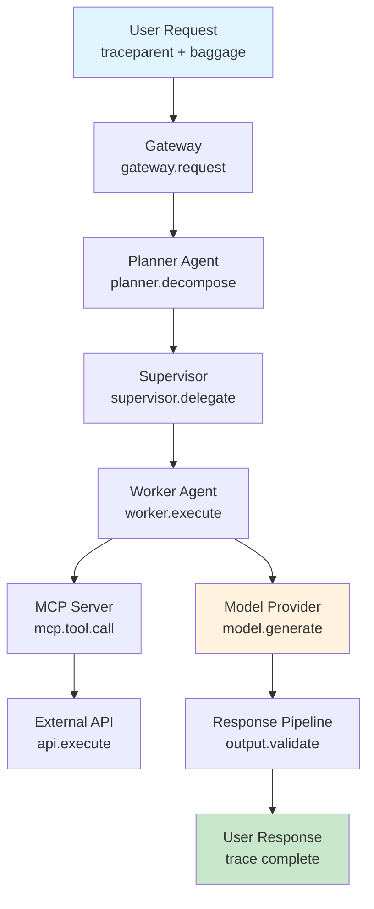
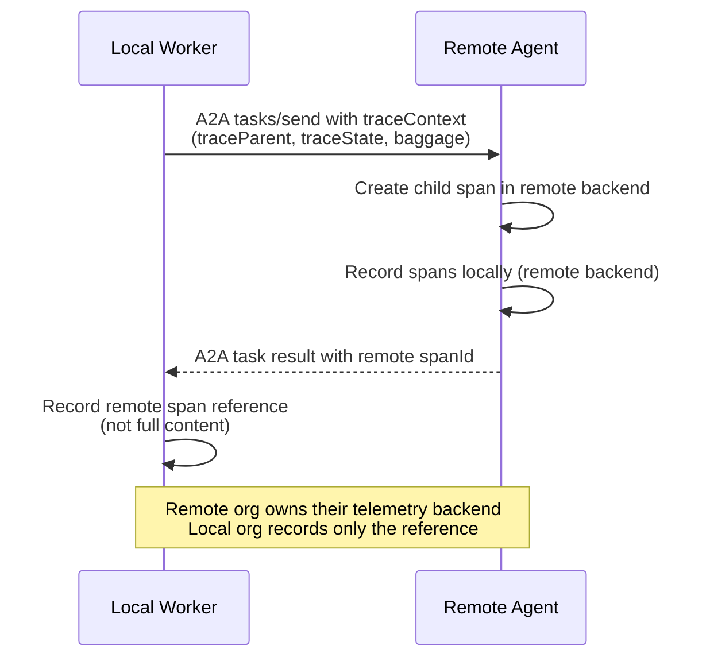
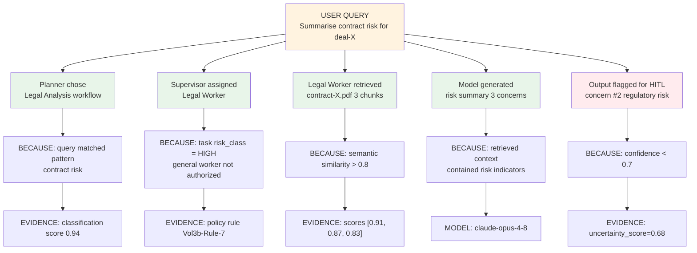
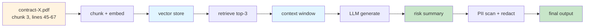
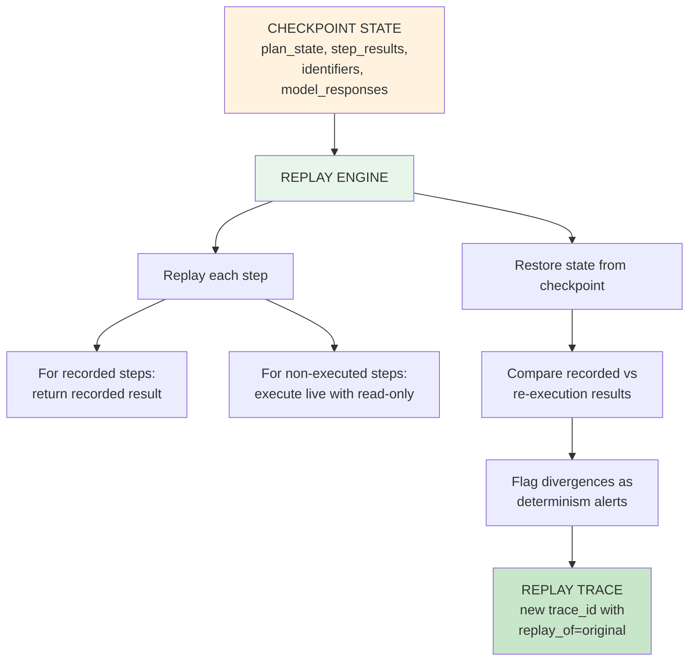

# End-to-End Traceability for Multi-Agent Systems

**Audience:** Platform engineers, AI architects, and SREs building observable multi-agent systems.

**Purpose:** Defines how a single trace context propagates from the user's request through every agent, tool, model call, and data access—surviving process boundaries, network hops, asynchronous queues, and cross-organization agent calls. Covers correlation IDs, distributed tracing, OTel baggage propagation, causal graphs, lineage, provenance, compliance audit trails, and execution replay.

**Scope:** Trace propagation mechanics. For observability dashboards and signal inventory, see [Agentic AI Reliability, Observability &amp; Governance §6–8](./pathname:///archon/architecture/49-agentic-ai-reliability-observability-governance). For governance decisions within the trace, see [Governance Propagation Chain](./pathname:///archon/architecture/governance-propagation-chain).

---

## 1. Why Traceability Is Harder in Agentic Systems

Traditional distributed tracing assumes: a request enters, flows through a DAG of services, and returns a response. The trace is linear or tree-shaped with predictable spans.

Agentic systems break this model:

| Challenge | Why it's hard |
| --- | --- |
| **Asynchronous agent invocation** | Tool calls may queue; the trace is paused and resumed—a different process/thread/node picks it up |
| **Dynamic plan generation** | The span tree is not known at trace start; the planner creates new spans mid-trace |
| **Cross-organization A2A calls** | Remote organizations have different telemetry backends; trace context must survive the protocol boundary |
| **Long-running sessions** | A conversation spanning hours has thousands of spans; standard tracing systems time out or truncate |
| **Non-determinism** | Two identical inputs produce different execution paths; replay requires capturing the LLM's response, not just the inputs |
| **Memory and retrieval** | A RAG retrieval or memory read is not a code call; it's a semantic query whose result shapes the entire trace |
| **Multi-modal evidence** | Compliance requires evidence beyond spans: the prompt sent, the response received, the policy decision, the retrieval context |

---

## 2. Identifier Taxonomy

A complete trace in a multi-agent system requires multiple correlated identifiers:

| Identifier | Scope | Lifetime | Example |
| --- | --- | --- | --- |
| **Trace ID** | End-to-end request | Request lifecycle | W3C `traceparent`: `00-4bf92f3...` |
| **Span ID** | Single operation | Operation lifetime | W3C `traceparent` parent-id |
| **Conversation ID** | Multi-turn session | Session lifetime | `conv-8821-abc123` |
| **Execution ID** | Single agent invocation | Invocation lifetime | `exec-9f3a-2026...` |
| **Task ID** | A2A or planner task | Task lifetime | A2A `task.id` |
| **Workflow ID** | Durable workflow run | Workflow lifetime | Temporal `workflowId` |
| **User Request ID** | User-facing request | Request lifetime | `req-alice-20260714-001` |
| **Plan ID** | A planner-generated plan | Plan lifetime | `plan-0821-research` |
| **Checkpoint ID** | A saved execution state | Checkpoint lifetime | `ckpt-t4-step7` |
| **Replay ID** | A replay execution | Replay lifetime | `replay-ckpt-t4-step7-001` |

**All identifiers must propagate together** via W3C trace context + OTel baggage. A span without a Conversation ID or Execution ID cannot be correlated to its parent context.

---

## 3. Trace Propagation Path

### 3.1 The Complete Propagation Chain

The canonical per-request trace propagation from user to response, with complete span hierarchy:



### 3.2 OTel Baggage Propagation

W3C Baggage carries cross-cutting context that all downstream services need. In multi-agent systems, baggage carries the identifiers that link spans across process boundaries:

```
Baggage: conv_id=conv-8821,
         req_id=req-alice-20260714-001,
         user_id=u-alice,
         plan_id=plan-0821-research,
         session_id=sess-xyz,
         workflow_id=wf-temporal-8821,
         risk_class=standard
```

**Propagation methods by transport:**

| Transport | Method |
| --- | --- |
| HTTP/gRPC | `traceparent`, `tracestate`, `baggage` headers |
| A2A protocol | `task.metadata.traceContext` field |
| MCP protocol | `_meta.progressToken` + custom trace headers |
| Message queue (SQS/Kafka/Pub/Sub) | Message attributes / headers (not body) |
| Async callback | Stored alongside task state; restored on callback |
| Durable workflow (Temporal) | Workflow memo or search attributes |

### 3.3 Cross-Organization Trace Propagation (A2A)

When a task crosses an organizational boundary via A2A, the trace context must survive while respecting the remote organization's telemetry sovereignty:



**Key principle:** The remote organization's spans are in their telemetry backend, not yours. Your local trace records a **reference** to the remote span (remote span ID). For cross-org audit compliance, the remote org must provide their span export on request (SLA-governed).

---

## 4. Causal Graphs and Lineage

### 4.1 Causal Graph

A causal graph captures *why* each decision was made, not just *what* happened. It is the debugging artifact for multi-agent systems.



**Causal graph storage format:** Each causation event is a structured log entry linked to the parent span by `span_id` + `parent_span_id`:

```json
{
  "span_id": "1a2b3c4d",
  "parent_span_id": "9f8e7d6c",
  "trace_id": "4bf92f35...",
  "event_type": "causal_decision",
  "decision": "supervisor.assign.legal_worker",
  "because": "task.risk_class == HIGH AND policy.Vol3b-Rule-7",
  "evidence": {"policy_id": "Vol3b-Rule-7", "risk_class": "HIGH"},
  "timestamp": "2026-07-14T10:23:45.123Z"
}
```

### 4.2 Data Lineage

Data lineage tracks how information flows from source to output:



For compliance (GDPR, financial regulations), the lineage record must answer:
- What source data informed this output?
- Was the source data authorized for this use?
- If the source data is deleted/corrected, which outputs are affected?

**Lineage record schema:**

```json
{
  "output_id": "response-8821-001",
  "lineage": [
    {
      "source_id": "doc-contract-X",
      "source_type": "pdf",
      "chunk_ids": ["chunk-45-67", "chunk-120-145"],
      "access_authorized_by": "user-alice",
      "access_policy": "read:legal-docs",
      "retrieval_span_id": "span-retrieval-001"
    }
  ],
  "transformation_spans": ["span-llm-001", "span-guardrail-001"],
  "output_classification": "INTERNAL",
  "retention_policy": "7-years",
  "deletion_cascade": true
}
```

---

## 5. Compliance Traceability

### 5.1 Audit Evidence Package

For regulated industries, each agentic action must produce an audit evidence package sufficient for regulatory examination:

| Evidence Component | What It Contains | Required For |
| --- | --- | --- |
| **Authorization proof** | Token, policy decision, principal identity | All regulated actions |
| **Input record** | Prompt sent (or hash), context provided, tool parameters | Financial, Healthcare |
| **Model record** | Model ID, version, provider, tokens, finish_reason | EU AI Act Art. 13 |
| **Retrieval record** | Sources retrieved, similarity scores, access authorization | DORA, GDPR |
| **Decision record** | Causal graph entry: why this decision was made | Model Risk (SR 11-7) |
| **Output record** | Response (or hash), classification, guardrail outcomes | All regulated |
| **Human review record** | HITL decision, approver identity, timestamp, rationale | High-risk AI Act |

### 5.2 Trace Retention Requirements

| Regulation | Retention Period | What Must Be Retained |
| --- | --- | --- |
| EU AI Act (High-risk) | Lifetime of the AI system + 10 years | Full audit log, model versions, risk assessments |
| GDPR | Duration of data processing | Personal data processing records |
| DORA (Financial) | 5 years minimum | ICT incident records, audit trails |
| SEC Rule 17a-4 | 3–7 years | Records of AI-assisted trading decisions |
| HIPAA | 6 years | PHI access logs, AI-assisted clinical decisions |
| SOX | 7 years | Financial reporting AI assistance records |

**Architecture implication:** Raw telemetry (short-lived; 30-90 days in hot storage) must feed a long-term compliance archive (cold storage; retention-policy-driven).

---

## 6. Execution Replay

### 6.1 Why Replay Matters

Replay serves four enterprise purposes:

| Purpose | Scenario |
| --- | --- |
| **Debugging** | Reproduce a production failure that cannot be reproduced in staging |
| **Audit** | Demonstrate to a regulator exactly what the agent did and why |
| **Testing** | Use production traces as regression test cases (recorded-replay test harness) |
| **Recovery** | Resume an interrupted long-running workflow from a checkpoint |

### 6.2 Replay Safety Requirements

Replay is dangerous if the replayed execution causes real-world side effects:

| Requirement | Implementation |
| --- | --- |
| **Read-only replay mode** | Tool calls in replay mode return recorded responses; no real API calls |
| **Idempotency keys** | All mutating operations carry idempotency keys; replay reuses same key to detect real-world state |
| **Replay flag propagation** | `X-Replay-Mode: true` header propagated to all downstream services |
| **Exactly-once semantics** | Replay framework tracks which steps have been executed; skips already-complete steps |
| **Deterministic model calls** | In replay, LLM calls return the recorded response (not a new model call); temperature=0 for re-execution |

### 6.3 Replay Architecture



### 6.4 Replay Types

| Type | What It Does | When to Use |
| --- | --- | --- |
| **Full replay** | Re-executes the entire trace from start | Debugging complete failures |
| **Partial replay** | Re-executes from a specific checkpoint step | Debugging failures at a specific step |
| **Branch replay** | From a checkpoint, executes a modified plan branch | Testing alternative plan paths |
| **Deterministic replay** | Re-executes with recorded model responses (no new LLM calls) | Audit and regression testing |
| **Live partial replay** | From checkpoint, uses new LLM calls for unexecuted steps | Resuming interrupted workflows |
| **Comparison replay** | Runs two plans in parallel from same checkpoint; compares outputs | A/B testing of plan changes |

### 6.5 Temporal Workflow Replay

For Temporal-based workflows, replay is built into the engine:

```python
# Temporal activities must be deterministic within a workflow run
# Non-deterministic calls (LLM, time, random) must be wrapped as activities

@activity.defn
async def call_model(prompt: str, model_id: str) -> ModelResponse:
    # This activity is replayed with the recorded result during replay
    response = await model_client.generate(prompt, model=model_id)
    return response

@workflow.defn
class ResearchWorkflow:
    @workflow.run
    async def run(self, task: ResearchTask) -> ResearchResult:
        # Workflow code is replayed deterministically
        # Activity results are returned from history during replay
        result = await workflow.execute_activity(
            call_model,
            args=[task.prompt, task.model],
            start_to_close_timeout=timedelta(minutes=5),
        )
        return result
```

---

## 7. Trace Implementation Reference

### 7.1 OTel Span Naming Conventions (GenAI)

Following the [OpenTelemetry GenAI Semantic Conventions](https://opentelemetry.io/docs/specs/semconv/gen-ai/):

| Span Name | Operation | Required Attributes |
| --- | --- | --- |
| `gen_ai.chat` | LLM completion | `gen_ai.system`, `gen_ai.model`, `gen_ai.usage.input_tokens`, `gen_ai.usage.output_tokens` |
| `gen_ai.tool.call` | Tool invocation | `gen_ai.tool.name`, `gen_ai.tool.call.id` |
| `gen_ai.agent.invoke` | Agent invocation | `gen_ai.agent.name`, `gen_ai.agent.id` |
| `gen_ai.retrieval` | RAG retrieval | `gen_ai.retrieval.source`, `gen_ai.retrieval.query_hash` |
| `mcp.tool.call` | MCP tool call | `mcp.server.name`, `mcp.tool.name`, `mcp.server.version` |
| `a2a.task.send` | A2A task dispatch | `a2a.agent.id`, `a2a.task.id`, `a2a.skill.id` |

### 7.2 Baggage Key Standards

Standardize baggage keys across your platform to enable cross-service correlation:

```
conv_id          → Conversation ID (user session)
req_id           → User request ID
user_id          → Authenticated user identity
plan_id          → Current plan ID
task_id          → Current task ID (A2A)
workflow_id      → Durable workflow run ID
checkpoint_id    → Last checkpoint ID (for recovery)
replay_id        → If this is a replay, the ID of the replay run
replay_of        → If this is a replay, the original trace ID
risk_class       → Task risk classification (standard/elevated/high)
tenant_id        → Multi-tenant identifier
```

### 7.3 Minimum Required Spans per Operation

For compliance-grade observability, every production agent must emit at minimum:

```
Per agent invocation:
  - span: gen_ai.agent.invoke
  - events: agent.start, agent.plan_created, agent.complete / agent.failed
  - attributes: agent_id, conversation_id, task_id, user_id, model_id

Per LLM call:
  - span: gen_ai.chat
  - events: llm.prompt.sent, llm.response.received
  - attributes: model, input_tokens, output_tokens, finish_reason, cost_usd

Per tool call:
  - span: gen_ai.tool.call or mcp.tool.call
  - events: tool.called, tool.returned
  - attributes: tool_name, call_id, input_hash, output_class, latency_ms

Per retrieval:
  - span: gen_ai.retrieval
  - events: retrieval.query, retrieval.results
  - attributes: source, query_hash, result_count, top_score, latency_ms
```

---

## 8. Provenance in Regulated Outputs

### 8.1 Citation and Grounding Provenance

For any AI output that makes factual claims, the provenance record must link each claim to its source:

```json
{
  "output_fragment": "The contract expires on 2026-12-31",
  "provenance": {
    "source_id": "doc-contract-X",
    "chunk_id": "chunk-page-3-para-2",
    "source_text": "This Agreement shall terminate on December 31, 2026",
    "similarity_score": 0.96,
    "grounding_confidence": "high"
  }
}
```

### 8.2 Hallucination Boundary Markers

Where the model generates content NOT grounded in retrieved sources:

```json
{
  "output_fragment": "Standard market practice suggests...",
  "provenance": {
    "source_id": null,
    "grounding_confidence": "model_knowledge",
    "hallucination_risk": "medium",
    "requires_human_verification": true
  }
}
```

---

## 9. Trace Infrastructure

### 9.1 Storage Tiers

| Tier | Content | Hot Storage | Warm Storage | Cold Storage |
| --- | --- | --- | --- | --- |
| **Real-time** | Spans, metrics, logs | 72 hours | — | — |
| **Operational** | Span trees, dashboards | 7 days | 30 days | — |
| **Causal graphs** | Decision graphs | 7 days | 90 days | 1 year |
| **Compliance archive** | Full audit packages | 90 days | 1 year | Regulation-mandated |
| **Replay store** | Checkpoints + model responses | 7 days | 30 days | On-demand |

### 9.2 Platform Recommendations

| Function | AWS | Azure | GCP | Open-source |
| --- | --- | --- | --- | --- |
| Trace collection | X-Ray, ADOT | Azure Monitor | Cloud Trace | Jaeger, Tempo |
| Long-term archive | S3 + Athena | ADLS + Synapse | GCS + BigQuery | ClickHouse |
| Policy decision log | CloudWatch Logs | Log Analytics | Cloud Logging | OpenSearch |
| Compliance export | S3 (WORM) | ADLS (immutable) | GCS (locked) | MinIO (WORM) |

---

## Further Reading

- [Agentic AI Reliability, Observability &amp; Governance](./pathname:///archon/architecture/49-agentic-ai-reliability-observability-governance) — signal inventory, dashboard architecture
- [Governance Propagation Chain](./pathname:///archon/architecture/governance-propagation-chain) — policy decisions within the trace
- [Drift Detection Guide](./pathname:///archon/architecture/drift-detection-guide) — using trace data for drift detection
- [Agent Reliability Engineering](./pathname:///archon/architecture/agent-reliability-engineering) — chaos engineering; trace-driven fault injection
- [Kill Switch Architecture](./pathname:///archon/architecture/kill-switch-architecture) — emergency shutdown traceability
- [AI Observability](./pathname:///archon/trust/ai-security-governance/16-ai-observability) — deep-mind series
- [EU Banking AI Agent Evaluation Framework](./pathname:///archon/operations/eu-banking-ai-agent-evaluation-framework) — regulated industry traceability requirements
