# Enterprise AI Architecture Patterns

**Audience:** Architects and senior engineers designing production AI systems.

**Purpose:** Canonical reference for 15 enterprise AI patterns. Each pattern includes: what problem it solves, architecture diagram, key components, implementation guidance, evaluation approach, best practices, and antipatterns.

**Related sections:** [Agent SDK code examples](../../coding-tools/claude/claude-agent-sdk-production.md) | [MCP integration](../../coding-tools/claude/mcp-deep-guide.md) | [Governance controls](enterprise-ai-governance-compliance.md)

---

## Pattern Catalog Overview

| # | Pattern | Problem | Complexity |
| --- | --------- | --------- | ------------ |
| 1 | [RAG](#1-retrieval-augmented-generation-rag) | Knowledge grounding, factual accuracy | Medium |
| 2 | [Agentic RAG](#2-agentic-rag) | Dynamic retrieval decisions | High |
| 3 | [Multi-Agent Orchestration](#3-multi-agent-orchestration) | Parallel sub-tasks, specialisation | High |
| 4 | [Parallel Fan-Out](#4-parallel-fan-out) | Throughput, map-reduce AI workloads | Medium |
| 5 | [AI Gateway](#5-ai-gateway-pattern) | Centralised AI control plane | Medium |
| 6 | [Semantic Caching](#6-semantic-caching) | Cost reduction for similar queries | Medium |
| 7 | [LLM-as-Judge](#7-llm-as-judge-evaluation) | AI output quality evaluation | Medium |
| 8 | [Human-in-the-Loop (HITL)](#8-human-in-the-loop-hitl-gates) | High-stakes action approval | Low |
| 9 | [Guardrail Pipeline](#9-guardrail-pipeline) | Safety, compliance, content control | Medium |
| 10 | [Explainability Pipeline](#10-explainability-pipeline) | Audit trails, compliance, transparency | Medium |
| 11 | [Cost Optimisation Routing](#11-cost-optimisation-routing) | Token cost reduction | Medium |
| 12 | [Stress Testing](#12-stress-testing-pattern) | Performance validation | Medium |
| 13 | [Evaluation Harness](#13-evaluation-harness) | Regression and A/B testing | High |
| 14 | [Blue-Green AI Deployment](#14-blue-green-ai-deployment) | Safe model/prompt rollout | Medium |
| 15 | [CALM Context Management](#15-calm-context-management) | Enterprise-scale context strategy | High |

---

## 1. Retrieval-Augmented Generation (RAG)

### Problem

Foundation models have a knowledge cutoff and no access to your enterprise data. Without grounding, they hallucinate or refuse to answer. Fine-tuning is expensive and quickly stale. RAG provides current, authoritative knowledge without retraining.

### Architecture

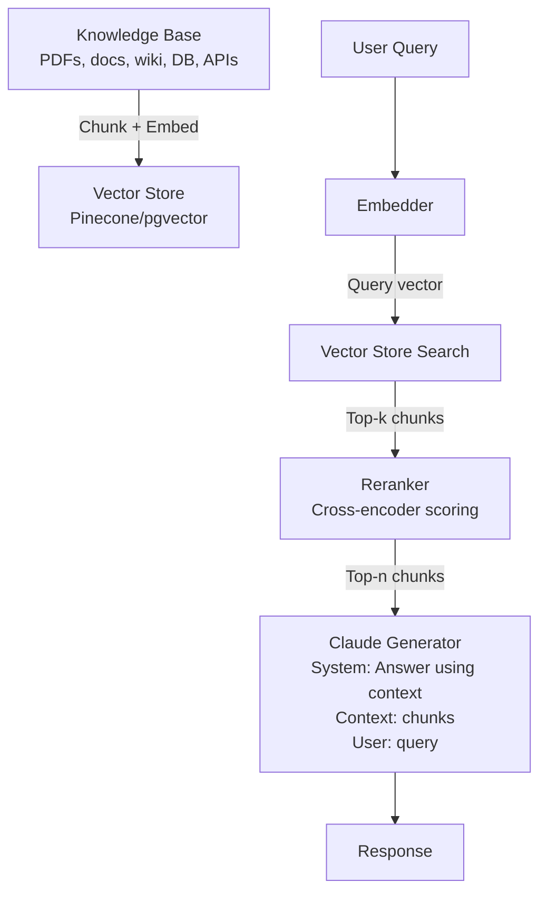

RAG (Retrieval-Augmented Generation) showing offline indexing pipeline (knowledge base chunking and embedding into vector store) and online retrieval pipeline (query embedding, similarity search, reranking, generation).

### Key Components

| Component | Role | Technology options |
| ----------- | ------ | -------------------- |
| **Chunker** | Split documents into retrieval units | LangChain, LlamaIndex, custom |
| **Embedder** | Convert text to vectors | text-embedding-3-large, Cohere Embed, Voyage |
| **Vector store** | ANN search over embeddings | Pinecone, pgvector, Weaviate, Qdrant |
| **Reranker** | Cross-encoder re-scoring of top-k | Cohere Rerank, BGE Reranker, Voyage |
| **Generator** | Synthesise answer from retrieved context | Claude Sonnet 5 / Fable 5 |

### Naive RAG → Advanced RAG

**Naive RAG:** Fixed chunk size → embed → retrieve top-k → generate. Works for structured, homogeneous corpora. Fails for:

- Long, complex documents (context loss at chunk boundaries)
- Questions requiring multi-hop reasoning
- Mixed content types (tables, code, prose)

**Advanced RAG techniques:**

=== "HyDE"

    **Hypothetical Document Embeddings:** Generate a hypothetical answer to the query, embed the hypothetical answer, retrieve against that embedding. Bridges the query–document embedding gap.

    ```python
    # Generate hypothetical document
    hypothetical = claude.messages.create(
        model="claude-haiku-4-5",
        messages=[{"role": "user", "content": f"Write a short paragraph that would answer: {query}"}]
    ).content[0].text

    # Embed and retrieve against hypothetical
    hyp_vector = embedder.embed(hypothetical)
    chunks = vector_store.search(hyp_vector, top_k=10)
    ```

=== "Parent-Child Chunking"

    **Parent-child chunking:** Index small child chunks for precision retrieval; when a child chunk is retrieved, return its full parent chunk to the generator for complete context.

    ```
    Document → Split into parent chunks (512–2048 tokens)
             → Each parent split into child chunks (128–256 tokens)
             → Index child chunks in vector store
             → On retrieval: return parent chunk to generator
    ```

=== "Hybrid Search"

    **Hybrid search:** Combine BM25 (keyword) and vector (semantic) search. Use Reciprocal Rank Fusion (RRF) to merge results.

    ```python
    bm25_results = bm25_index.search(query, top_k=20)
    vector_results = vector_store.search(query_vector, top_k=20)
    merged = reciprocal_rank_fusion([bm25_results, vector_results], top_k=10)
    ```

=== "Metadata Filtering"

    **Metadata filtering:** Restrict vector search to chunks matching structured filters (date range, source, category, security classification).

    ```python
    chunks = vector_store.search(
        vector=query_vector,
        top_k=10,
        filter={
            "source": "internal-wiki",
            "date": {"$gte": "2025-01-01"},
            "access_level": {"$lte": user_clearance_level}
        }
    )
    ```

### Evaluation

| Metric | What it measures | Tool |
| -------- | ----------------- | ------ |
| **Retrieval precision@k** | Are retrieved chunks relevant? | RAGAS, manual |
| **Retrieval recall** | Are all relevant chunks retrieved? | RAGAS |
| **Answer faithfulness** | Does answer stay within retrieved context? | RAGAS, LLM-as-judge |
| **Context relevance** | Is retrieved context relevant to the question? | RAGAS |
| **Answer correctness** | Is the answer factually correct? | Human eval, LLM-as-judge with reference |

### Best Practices

- Use a reranker after vector search — precision jumps 15–30% with minimal latency cost
- Chunk at semantic boundaries (paragraph, section) not fixed character counts
- Store chunk metadata (source URL, date, author) for filtering and citation
- Test with adversarial queries — questions that should return "I don't know"
- Monitor retrieval quality in production — track when no relevant chunks are found

### Antipatterns

- **Too-small chunks:** 128-token chunks lose context; model can't answer from fragments
- **No reranker:** Top-k cosine similarity is noisy; reranking is nearly always worth it
- **Retrieval without citation:** Users can't verify answers; hallucinations are undetectable
- **Single embedding model forever:** Models improve; plan for periodic re-embedding
- **No "not in context" handling:** If relevant chunks aren't found, the model should say so

---

## 2. Agentic RAG

### Problem

Standard RAG uses a fixed retrieval strategy for every query. Some queries need no retrieval (the model knows the answer). Others need multiple retrieval rounds (multi-hop reasoning). Agentic RAG lets the model decide when and what to retrieve.

### Architecture

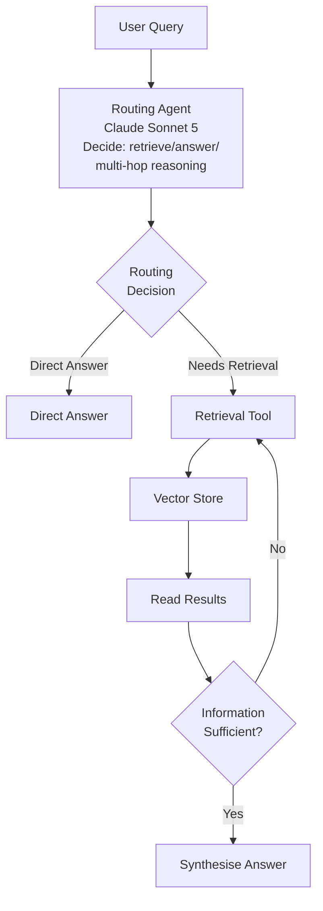

Agentic RAG where the model decides whether and when to retrieve, supporting multi-hop reasoning and dynamic retrieval decisions.

### Key Components

**Router / Planner:** Decides the retrieval strategy. Should be a capable model (Sonnet 5 or Fable 5) — this decision is where quality matters most.

**Retrieval tool:** Exposed as a tool call. The agent invokes it with a query string; the tool returns top chunks.

**Self-reflection:** After reading retrieved chunks, the agent assesses whether the information is sufficient to answer, then either answers or retrieves more.

### Implementation Pattern

```python
tools = [
    {
        "name": "search_knowledge_base",
        "description": "Search the internal knowledge base for relevant information",
        "input_schema": {
            "type": "object",
            "properties": {
                "query": {"type": "string", "description": "Search query"},
                "filter_source": {"type": "string", "description": "Optional source filter"}
            },
            "required": ["query"]
        }
    }
]

# Agentic loop: model decides when to retrieve
response = claude.messages.create(
    model="claude-sonnet-5",
    max_tokens=2048,
    tools=tools,
    messages=[{"role": "user", "content": user_query}]
)

# Handle tool_use stop_reason
while response.stop_reason == "tool_use":
    tool_results = process_tool_calls(response.content)
    response = claude.messages.create(
        model="claude-sonnet-5",
        max_tokens=2048,
        tools=tools,
        messages=messages + [{"role": "assistant", "content": response.content}]
                           + [{"role": "user", "content": tool_results}]
    )
```

### Multi-Source Retrieval

Agentic RAG can query multiple sources in parallel:

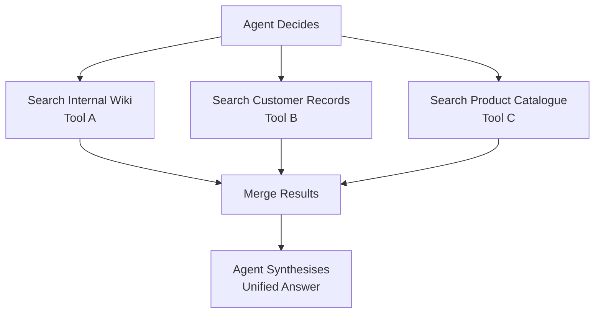

### Antipatterns

- **Unbounded retrieval loops:** Implement a max-retrieval-steps limit (e.g., 5) to prevent infinite loops
- **Retrieval without budget tracking:** Each retrieval adds tokens and cost; track and cap
- **Single retrieval tool for all sources:** Different sources have different schemas; specialise tools

---

## 3. Multi-Agent Orchestration

### Problem

Some tasks are too large for a single agent's context window, benefit from parallelism across specialised agents, or require different model capabilities for different sub-tasks.

### Architecture

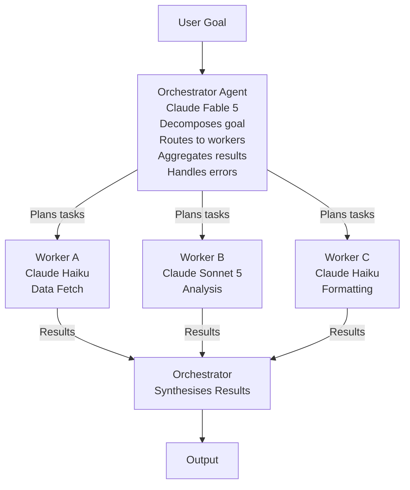

Multi-agent orchestration with specialized workers for different capabilities (data fetch, analysis, formatting) coordinated by a Fable 5 orchestrator that decomposes goals and aggregates results.

### Task Decomposition Strategies

**Sequential decomposition:** Tasks must happen in order (A → B → C). Use when each step depends on prior output.

**Parallel decomposition:** Tasks are independent. Run all concurrently. Use when sub-tasks do not share state.

**Hierarchical decomposition:** Orchestrator spawns sub-orchestrators, each with their own workers. Use for very complex tasks requiring 3+ levels of planning.

**Dynamic decomposition:** Orchestrator decides task breakdown at runtime based on input. Use when task structure is not known in advance (agentic research, open-ended coding).

### Result Aggregation

| Pattern | When to use |
| --------- | ------------- |
| **Merge all results** | Sub-tasks produce complementary outputs (sections of a report) |
| **Vote/consensus** | Run same task N times; take majority answer (increases reliability, 3× cost) |
| **Best-of-N** | Run N times; judge selects best output (LLM-as-judge or rule-based) |
| **Critique-revise** | Worker generates; critic evaluates; worker revises |

### Error Handling in Agent Chains

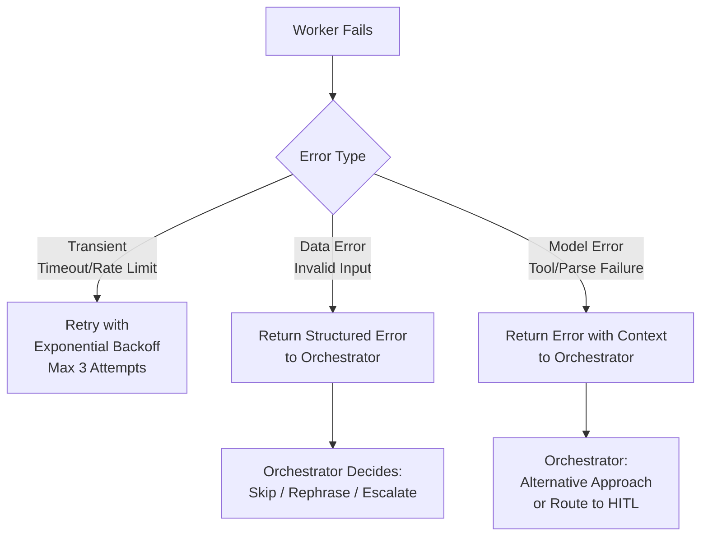

**Key principle:** Workers return structured results including error states. The orchestrator, not the worker, decides how to handle failure.

### Best Practices

- Orchestrator model should be the most capable (Fable 5 or Sonnet 5) — it holds the plan
- Workers can be cheaper (Haiku) for well-defined sub-tasks
- Pass minimal context to each worker — not the full orchestrator context
- Implement a total task timeout (not just per-step timeout)
- Log the full agent trace (orchestrator plan + worker calls + results)
- Design worker output schemas first; orchestrator aggregation logic follows from output structure

---

## 4. Parallel Fan-Out

### Problem

A large batch of independent AI tasks needs to complete in acceptable time. Sequential processing is too slow; a map-reduce approach is needed.

### Architecture

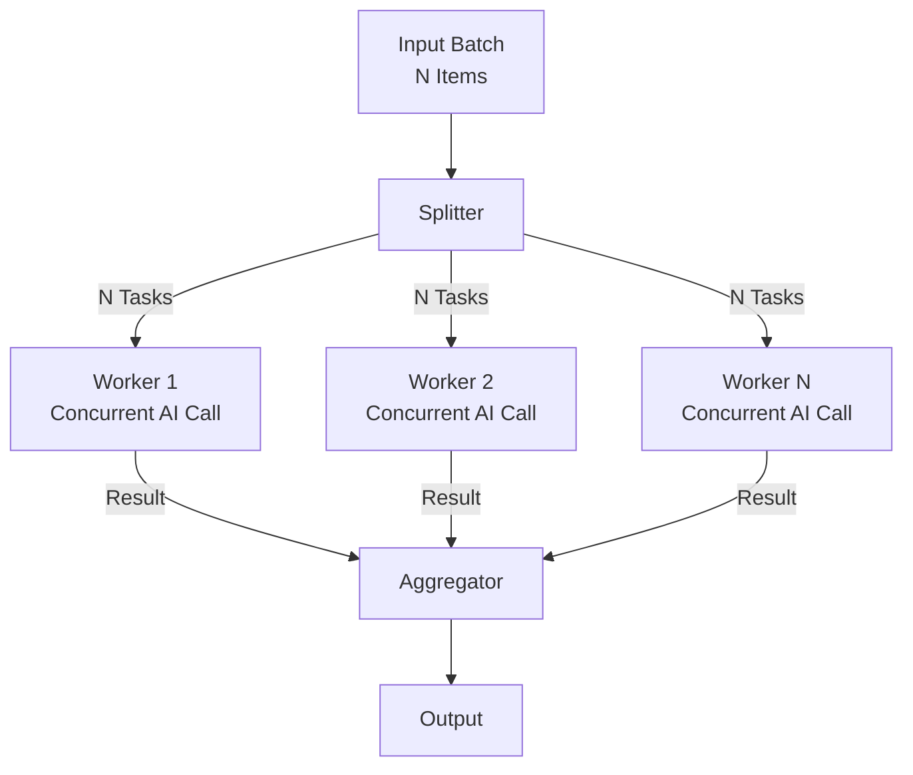

Parallel fan-out pattern for processing large batches of independent AI tasks concurrently, then aggregating results.

### Implementation

```python
import asyncio
from anthropic import AsyncAnthropic

client = AsyncAnthropic()
semaphore = asyncio.Semaphore(10)  # Max 10 concurrent requests

async def process_item(item):
    async with semaphore:
        try:
            response = await client.messages.create(
                model="claude-haiku-4-5",
                max_tokens=512,
                messages=[{"role": "user", "content": build_prompt(item)}]
            )
            return {"id": item["id"], "result": response.content[0].text, "status": "success"}
        except Exception as e:
            return {"id": item["id"], "error": str(e), "status": "failed"}

async def fan_out(items):
    tasks = [process_item(item) for item in items]
    results = await asyncio.gather(*tasks, return_exceptions=False)
    successes = [r for r in results if r["status"] == "success"]
    failures = [r for r in results if r["status"] == "failed"]
    return successes, failures
```

### Concurrency Limits and Rate Limit Management

**Rate limit types:**

- **Requests per minute (RPM):** Number of API calls per minute
- **Tokens per minute (TPM):** Total tokens (input + output) per minute
- **Tokens per day (TPD):** Some tiers have daily limits

**Safe concurrency formula:**

```
Max concurrent = min(
    your_RPM_limit / average_call_duration_seconds,
    your_TPM_limit / average_tokens_per_call / 60
)
```

Start at 10, measure 429 rate, adjust upward until 429s exceed 0.5%.

**Exponential backoff pattern:**

```python
import random, time

def with_retry(fn, max_retries=5):
    for attempt in range(max_retries):
        try:
            return fn()
        except RateLimitError:
            wait = (2 ** attempt) + random.uniform(0, 1)
            time.sleep(wait)
    raise Exception("Max retries exceeded")
```

### Result Validation After Fan-Out

Not all AI outputs are valid. Validate before aggregation:

```python
def validate_result(result):
    if not result.get("result"):
        return False, "empty_output"
    if len(result["result"]) < 10:
        return False, "too_short"
    if not is_valid_json(result["result"]):  # if expecting JSON
        return False, "invalid_format"
    return True, None
```

Failed validations: retry once with rephrased prompt; if still fails, route to manual queue.

---

## 5. AI Gateway Pattern

### Problem

Multiple teams, services, and applications each implement their own AI integration — with no unified auth, no centralised cost tracking, no rate limiting, and no ability to swap models. The AI Gateway centralises all AI traffic through a single control plane.

### Architecture

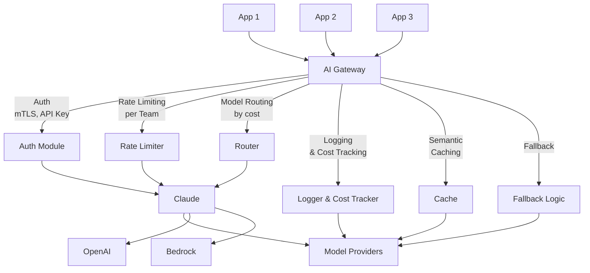

Centralized AI Gateway providing unified authentication, rate limiting, model routing, semantic caching, and fallback logic across multiple applications and model providers.

### Gateway Capabilities

| Capability | Business value |
| ----------- | --------------- |
| **Unified authentication** | One API key per team; gateway holds provider keys |
| **Rate limiting per team** | Prevent one team from consuming all capacity |
| **Cost tracking** | Token usage attributed per team, product, environment |
| **Model routing** | Route by complexity, cost threshold, or A/B test |
| **Semantic caching** | Reduce duplicate calls; cut costs 20–40% |
| **Fallback logic** | Provider A fails → Provider B automatically |
| **Request logging** | Centralised audit log for all AI calls |
| **Prompt injection detection** | WAF-style rules on all inbound prompts |

### Implementation Options

**Kong AI Gateway:** Open-source plugin ecosystem. AI proxy plugin for Claude, OpenAI, Cohere. Rate limiting, caching, logging plugins available. See [Kong AI Gateway Guide](../../cloud-platforms/ai-gateway/kong-ai-gateway-guide.md).

**AWS API Gateway + Lambda:** Serverless AI gateway for AWS-native shops. Lambda handles routing and auth; API Gateway handles TLS and rate limiting.

**Custom (FastAPI/Express):** Full control. Higher maintenance burden. Appropriate when you need capabilities not available in off-the-shelf gateways.

### Request Routing by Model Capability and Cost

```python
def route_request(request):
    complexity_score = classify_complexity(request.prompt)

    if complexity_score < 0.3:
        return "claude-haiku-4-5"      # ~$0.001 per call
    elif complexity_score < 0.7:
        return "claude-sonnet-5"       # ~$0.030 per call
    else:
        return "claude-fable-5"        # ~$0.200+ per call
```

---

## 6. Semantic Caching

### Problem

Many AI applications receive near-identical queries repeatedly (FAQ bots, search assistants, document Q&A). Calling the model for every query is wasteful when a cached response would serve equally well.

### Architecture

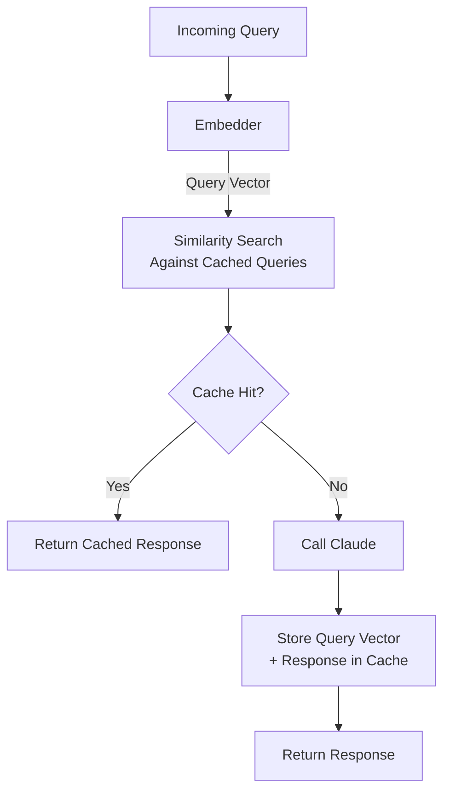

Semantic caching matches incoming queries to cached queries via similarity search, reducing API calls and costs for repeated or similar queries.

### Similarity Threshold Configuration

The threshold determines how similar a query must be to a cached query to count as a cache hit.

| Threshold | Effect |
|-----------|--------|
| 0.95+ | Very conservative — only near-identical queries hit cache |
| 0.90–0.94 | Standard setting for factual Q&A |
| 0.85–0.89 | Aggressive — risk of returning wrong cached answer |

**Recommendation:** Start at 0.92. Evaluate cache hit quality manually (sample 20 cache hits/day). Adjust threshold based on false-positive rate.

**Never cache:** Queries involving personal data, real-time information, or user-specific context.

### TTL Strategy

| Content type | Recommended TTL |
| ------------- | ----------------- |
| Product FAQ | 24 hours |
| Policy documents | 1 week |
| Breaking news / market data | Do not cache |
| Code documentation | 1 week |
| User-specific queries | Do not cache |

### Cost Impact Analysis

Typical semantic cache impact for a high-traffic Q&A system:

```
Without cache: 100,000 queries/day × $0.030 avg = $3,000/day
Cache hit rate: 40%
With cache:    60,000 API calls/day × $0.030 = $1,800/day
               + 40,000 vector lookups × $0.0001 = $4/day
Net saving: $1,196/day — ~40% cost reduction
```

---

## 7. LLM-as-Judge Evaluation

### Problem

Evaluating AI output quality at scale is expensive if done by humans and impossible to do manually for every output. Using a capable AI model to judge another model's output provides scalable quality measurement.

### Architecture

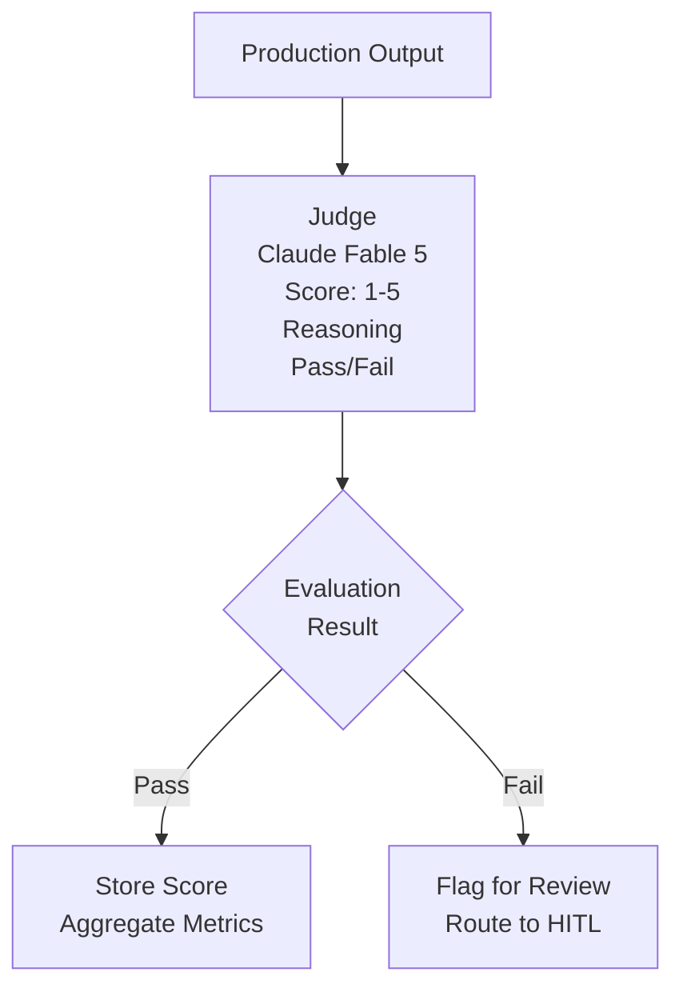

LLM-as-Judge evaluation pipeline scoring production AI outputs with sampled human validation to detect quality regressions at scale.

### Avoiding Judge Bias

LLM judges exhibit biases:

- **Position bias:** Prefers the first option when comparing two responses
- **Verbosity bias:** Prefers longer, more elaborate responses regardless of accuracy
- **Self-preference bias:** Claude tends to prefer Claude-generated text

**Mitigations:**

- **Blind evaluation:** Remove model name from input; judge doesn't know which model generated the output
- **Swap positions:** If comparing A vs B, run twice with positions swapped; count only agreements
- **Reference anchor:** Provide a human-written reference answer; score against it, not just A vs B
- **Chain-of-thought scoring:** Require the judge to reason before scoring (reduces snap judgements)
- **Ensemble judges:** Use multiple judge models; take average score

### Calibration Against Human Judgements

```
Phase 1: Collect 100–200 human-scored examples
Phase 2: Run LLM judge on same examples
Phase 3: Compute agreement rate (Cohen's kappa or Pearson r)
Phase 4: If agreement < 0.7 kappa, adjust judge prompt
Phase 5: Re-calibrate quarterly or after judge model update
```

Target agreement: > 0.75 kappa for subjective quality tasks; > 0.90 for factual correctness.

### Evaluation Harness Implementation

See [Evaluation Harness Pattern](#13-evaluation-harness) for the full harness implementation.

---

## 8. Human-in-the-Loop (HITL) Gates

### Problem

AI agents make mistakes. For high-stakes, irreversible, or regulated actions, the cost of an unreviewed AI error exceeds the benefit of full automation.

### When to Insert HITL

| Trigger | Example |
| --------- | --------- |
| **High-stakes action** | Send mass email, delete records, execute financial transaction |
| **Low confidence output** | Model's self-assessed confidence &lt; 0.75 |
| **Sensitive domain** | Medical, legal, financial advice to end users |
| **Novel scenario** | Input type not seen in training data; low retrieval relevance |
| **Irreversible action** | Any action that cannot be undone (publish, submit, deploy) |
| **Regulatory requirement** | Actions in regulated processes requiring documented human approval |

### Implementation Patterns

=== "Approval Queue"

    Async approval queue for high-volume flows:

    ```mermaid
    flowchart TD
        A["Agent Proposes Action"] --> B["Write to<br/>Approval Queue"]
        B --> C["Notify Reviewer<br/>Slack/Email"]
        C --> D{Reviewer<br/>Approves/Rejects?}
        D -->|Timeout SLA<br/>4 hours| E["Auto-Escalate<br/>to Manager Queue"]
        D -->|Approved| F["Execute Action"]
        D -->|Rejected| G["Discard"]
    ```

    Asynchronous approval queue enabling human review of high-stakes agent actions with SLA-based escalation.

=== "Inline Confirmation"

    Synchronous confirmation for interactive tools:

    ```
    Agent: "I'm about to send the following email to 5,000 customers:
    [email preview]
    Shall I proceed? (yes/no)"

    User: "yes"

    Agent: [sends email]
    ```

=== "Confidence Gate"

    Automatic HITL trigger based on model-assessed confidence:

    ```python
    response = claude.messages.create(
        model="claude-sonnet-5",
        system="""After your answer, output a JSON object:
    {"confidence": 0.0-1.0, "reasoning": "why you are/aren't confident"}""",
        messages=[...]
    )

    confidence = extract_confidence(response)
    if confidence < HITL_THRESHOLD:  # e.g., 0.75
        route_to_human_queue(task, response, confidence)
    else:
        execute_action(response)
    ```

### Escalation Policies

Define escalation tiers before build:

```
Tier 1 (auto): Confidence > 0.90, known action type → execute
Tier 2 (peer review): Confidence 0.75–0.90 → route to team queue
Tier 3 (senior review): Confidence < 0.75 or high-stakes domain → route to senior reviewer
Tier 4 (no-AI): Edge cases; human handles entirely without AI assistance
```

---

## 9. Guardrail Pipeline

### Problem

Raw model output can contain: harmful content, PII, off-topic responses, competitor mentions, regulatory violations, prompt leaks. A guardrail pipeline validates both inputs and outputs before they reach users or downstream systems.

### Architecture

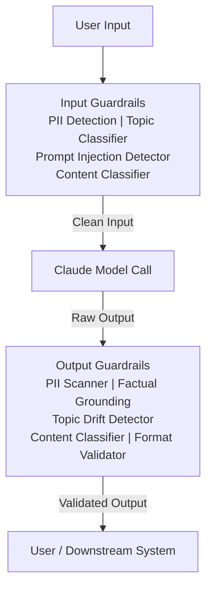

Layered guardrail pipeline protecting both inputs (PII, prompt injection, off-topic) and outputs (PII redaction, factual grounding, topic drift, harmful content, format compliance).

### Layered Defense

**Layer 1 — System prompt guardrails:** Instruct the model on what NOT to do. First line of defence; zero added latency.

**Layer 2 — Input/output classifiers:** Lightweight models (Haiku or small fine-tuned classifiers) that check content before and after the main call. Add 50–200ms latency.

**Layer 3 — Post-processing rules:** Deterministic checks (regex, schema validation). Zero AI cost; add &lt; 10ms latency.

**Layer 4 — AI-based output review:** Full LLM evaluation of output quality and safety. Use for high-stakes domains; adds 500–1,500ms.

### Content Classifiers

| Classifier | What it detects | Implementation |
| ----------- | ---------------- | ---------------- |
| **PII** | Names, emails, SSN, credit cards | Microsoft Presidio, AWS Comprehend |
| **Toxicity** | Hate speech, harassment, violence | Perspective API, custom model |
| **Topic drift** | Off-topic or out-of-scope responses | Claude Haiku classifier |
| **Prompt leak** | System prompt content in output | String matching + semantic similarity |
| **Competitor mention** | Brand mentions in restricted contexts | Keyword list + semantic |
| **Regulatory terms** | Unauthorised financial/medical advice | Keyword + context classifier |

### Fallback Behaviors

When a guardrail triggers:

```python
FALLBACK_RESPONSES = {
    "off_topic": "I can only help with [scope]. For other questions, please contact [team].",
    "pii_detected_in_input": "Please remove personal information before submitting.",
    "harmful_content": "I'm unable to assist with that request.",
    "low_confidence": "I'm not confident in my answer. Please verify with [source].",
    "model_error": "I encountered an error. Please try again or contact support."
}
```

---

## 10. Explainability Pipeline

### Problem

Regulated industries (finance, healthcare, HR) require explanations for AI-assisted decisions. Auditors need to trace how conclusions were reached. End users may have a right to explanation (GDPR Article 22).

### Architecture

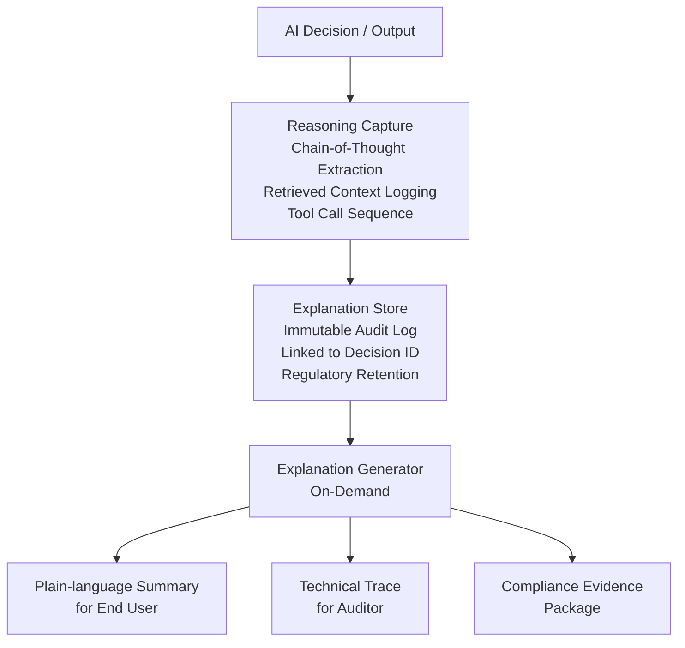

Explainability pipeline capturing reasoning chains, storing audit trails, and generating on-demand explanations for users, auditors, and compliance.

### Capturing Chain-of-Thought for Audits

```python
response = claude.messages.create(
    model="claude-fable-5",
    thinking={"type": "adaptive"},  # fixed budget_tokens is rejected on Fable 5 / Opus 4.8 / Sonnet 5
    messages=[...]
)

# Thinking blocks carry summarized reasoning on Fable 5 (raw chain of
# thought is never returned); depth is controlled via output_config.effort
reasoning = [block for block in response.content if block.type == "thinking"]
answer = [block for block in response.content if block.type == "text"]

# Store separately
audit_log.store({
    "decision_id": decision_id,
    "reasoning_trace": reasoning,
    "answer": answer,
    "retrieved_context": retrieved_chunks,
    "tool_calls": tool_call_log,
    "timestamp": datetime.utcnow().isoformat(),
    "model": "claude-fable-5",
    "user_id": user_id_hash  # Not raw PII
})
```

### Compliance Audit Trail

| Element | Retention | Access |
| --------- | ----------- | -------- |
| Decision ID and timestamp | Per regulation (5–7 years in finance) | Compliance, legal |
| Model version and parameters | Same as decision | Compliance |
| Retrieved context (anonymised) | Same as decision | Compliance |
| Reasoning trace (thinking blocks) | Same as decision | Compliance, audit |
| Human override record | Same as decision | Compliance, audit |

---

## 11. Cost Optimisation Routing

### Problem

Not all tasks need the same model. Using Fable 5 for everything is 10–50× more expensive than using Haiku for simple tasks. A routing layer assigns each task to the cheapest model that can handle it.

### Architecture

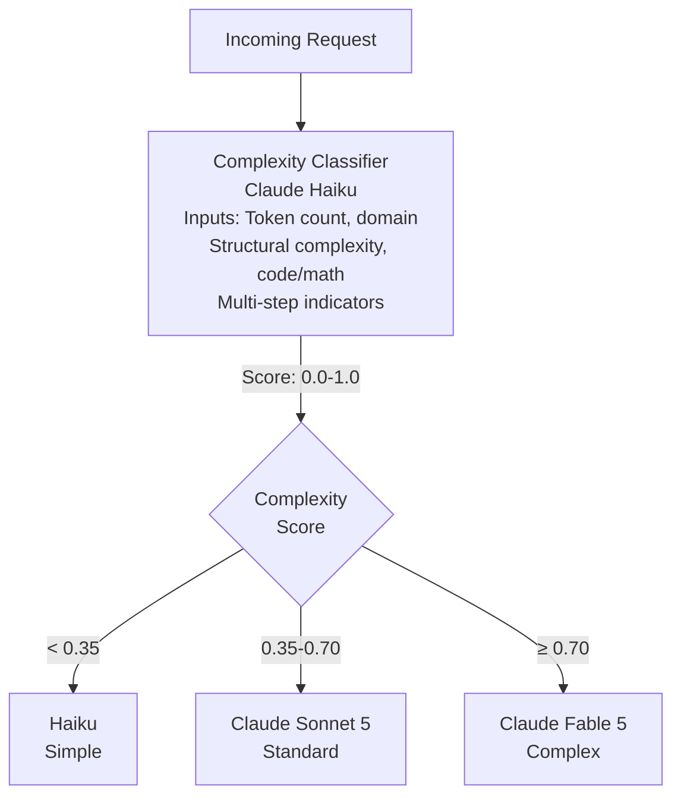

Cost optimization routing assigning requests to the cheapest model capable of handling the complexity, reducing inference costs by 60-80%.

### Complexity Scoring Features

```python
def score_complexity(request):
    features = {
        "token_count": len(tokenize(request.prompt)),
        "has_code": int(contains_code(request.prompt)),
        "has_math": int(contains_math(request.prompt)),
        "multi_step_indicators": count_multi_step_words(request.prompt),
        "domain": encode_domain(request.domain),
        "context_items": len(request.context or [])
    }
    return classifier.predict_proba(features)[1]  # Probability of "complex"
```

### Quality Threshold Fallback

Route requests where cheap model output fails quality check to the next tier:

```python
result = call_haiku(request)
quality_score = judge_quality(request, result)

if quality_score < QUALITY_THRESHOLD:  # e.g., 0.75
    result = call_sonnet5(request)
    quality_score = judge_quality(request, result)
    if quality_score < QUALITY_THRESHOLD:
        result = call_fable5(request)

return result
```

**Cost impact:** Routing ~70% of traffic to Haiku and only 5% to Fable 5 reduces total model costs by 60–80% vs Sonnet 5 for everything.

---

## 12. Stress Testing Pattern

### Problem

AI endpoints have different performance profiles than conventional APIs. Model latency is high (0.5–10s), variable, and affected by token count. Concurrency limits and rate limits behave differently under load. You need to validate performance before launch.

### Load Testing Strategy

**Phase 1 — Baseline:** Single user, measure P50/P95/P99 latency for each request type.

**Phase 2 — Ramp test:** Gradually increase concurrency (1 → 5 → 10 → 25 → 50 users). Identify the concurrency level where latency degrades sharply or 429s begin.

**Phase 3 — Sustained load:** Run at 80% of identified limit for 30 minutes. Measure stability, error rate, cost per minute.

**Phase 4 — Spike test:** Instant jump to 2× expected peak. Measure time to degrade, time to recover.

**Phase 5 — Soak test:** Run at expected load for 8 hours. Identify slow memory leaks, token budget drift, log accumulation issues.

### Timeout and Retry Configuration

| Timeout type | Recommended value | Rationale |
| ------------- | ------------------- | ----------- |
| Connect timeout | 5s | Network issue — fail fast |
| Read timeout per token | 300ms | Flag stalled streams |
| Total request timeout | 120s for Fable 5, 60s for Sonnet | Covers P99 of complex calls |
| Retry wait base | 1s (exponential with jitter) | Rate limit recovery |
| Max retries | 3 | Balance recovery vs latency |

### Graceful Degradation Under Load

Design explicit degraded modes:

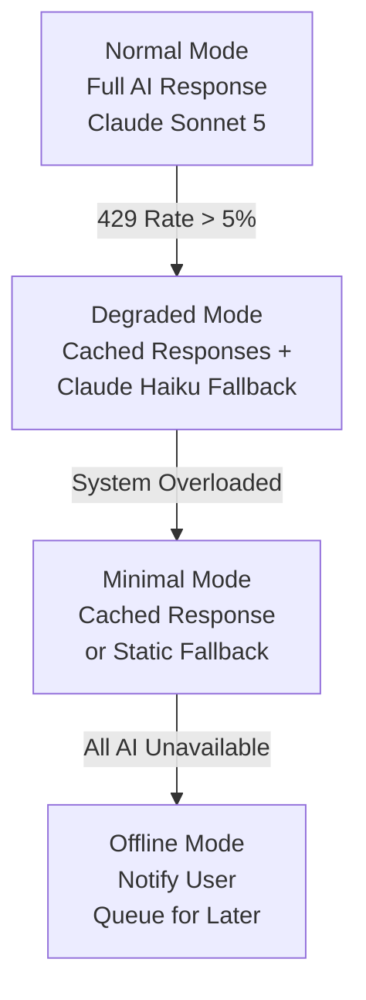

---

## 13. Evaluation Harness

### Problem

AI systems degrade silently. A new model version, a prompt change, or a RAG config change can regress quality without triggering any alerting. An evaluation harness provides automated regression testing and A/B testing infrastructure.

### Architecture

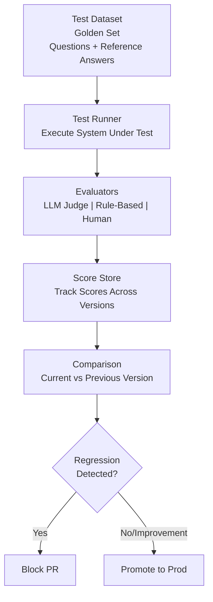

Automated evaluation harness with test dataset, multi-method evaluation, scoring tracking, and version comparison to block regressions and gate deployments.

### Test Dataset Management

**Dataset requirements:**

- 200–500 representative examples for meaningful statistics
- Coverage across all task types the system handles
- Adversarial examples (edge cases, ambiguous queries, injection attempts)
- Known-hard examples (cases the system previously got wrong)
- Distribution matched to production traffic (not just easy cases)

**Dataset versioning:** Version test datasets like code. Track which version was used for each evaluation run. Never silently mutate the dataset.

### Regression Testing

```python
def run_regression(system_version, dataset):
    results = []
    for example in dataset:
        response = call_system(system_version, example.query)
        score = judge_response(example.query, response, example.reference)
        results.append({"example_id": example.id, "score": score, "response": response})

    aggregate = {
        "version": system_version,
        "timestamp": datetime.utcnow(),
        "mean_score": statistics.mean(r["score"] for r in results),
        "pass_rate": sum(1 for r in results if r["score"] >= PASS_THRESHOLD) / len(results),
        "regression_cases": [r for r in results if r["score"] < previous_score[r["example_id"]]]
    }
    return aggregate

# Block deployment if regression_cases > 0 or mean_score < baseline - TOLERANCE
```

### A/B Testing Infrastructure

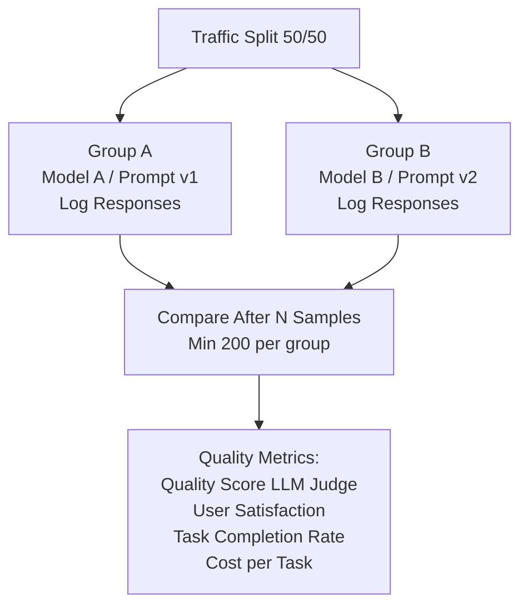

### Business Metric Alignment

Technical quality metrics (faithfulness, precision) must align to business metrics:

| Technical metric | Business metric |
| ----------------- | ----------------- |
| Answer faithfulness | Reduction in human follow-up queries |
| Retrieval precision | Time to resolve customer issue |
| Task completion rate | Support ticket deflection rate |
| Latency P95 | User session abandonment rate |
| Cost per call | AI cost as % of revenue per customer |

Measure both. Optimise for business metrics; use technical metrics to diagnose.

---

## 14. Blue-Green AI Deployment

### Problem

Changing models or system prompts in production is risky. A bad change can silently degrade quality or break output schemas. Blue-green AI deployment allows gradual rollout with rollback capability.

### Architecture

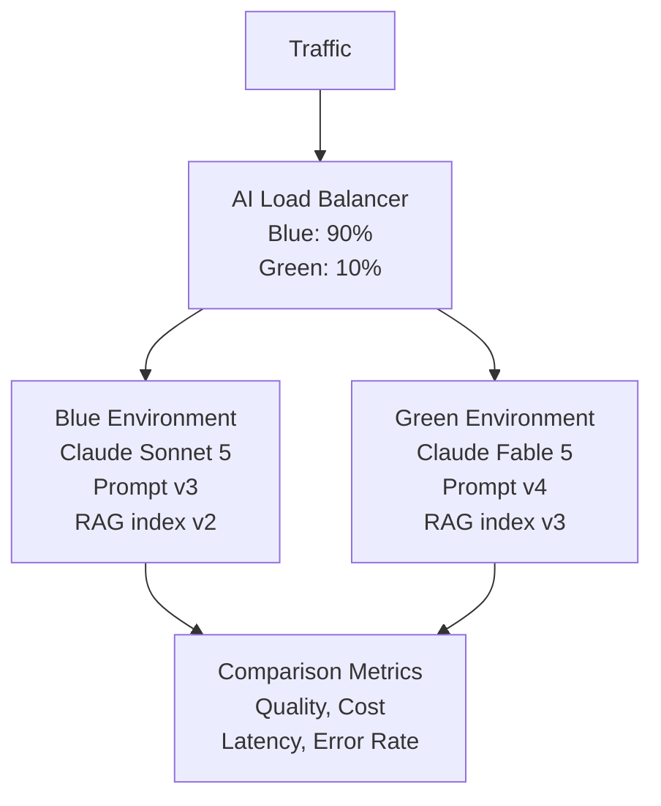

Blue-green AI deployment enabling safe model/prompt rollouts with traffic splitting, canary testing, and gradual migration with rollback capability.

### Traffic Split for Gradual Rollout

| Day | Green traffic | Condition to proceed |
| ----- | -------------- | --------------------- |
| 1 | 1% | No errors; quality ≥ blue |
| 2–3 | 5% | P95 latency ≤ blue × 1.1 |
| 4–7 | 25% | Quality score ≥ blue; cost ≤ blue × 1.2 |
| 8–14 | 50% | No regression in business metrics |
| 15 | 100% | Blue decommissioned |

### Rollback Trigger Conditions

| Condition | Rollback trigger level |
| ----------- | ---------------------- |
| Quality score drop > 10% | Immediate: route 100% to blue |
| Error rate > 2% | Immediate |
| P95 latency > blue × 1.5 | Immediate |
| Cost per call > blue × 1.3 | Investigate; manual rollback decision |
| Business metric regression | Manual rollback decision |

---

## 15. CALM Context Management

### Problem

Enterprise AI systems handle long conversations, multi-session continuity, complex document analysis, and multi-turn workflows. Without a structured context strategy, models receive either too little context (poor answers) or too much (expensive, loses-in-the-middle degradation).

### The CALM Framework

**C — Conversation context:** The active context window contents. Managed by controlling what history to include.

**A — Augmentation:** RAG-retrieved context. Injected at inference time. Always prefer retrieved-on-demand over stuffed-in-advance.

**L — Long-term memory:** Persisted external memory. Retrieved selectively based on relevance to current turn.

**M — Multi-turn management:** Strategies for extending effective context across many turns.

### Context Compression Strategies

| Strategy | Approach | When to use |
| ---------- | ---------- | ------------- |
| **Sliding window** | Keep last N turns; discard older | Simple conversations |
| **Summarisation** | Summarise older turns; keep recent verbatim | Long conversations |
| **Selective retention** | Keep only turns with task-relevant facts | Structured workflows |
| **Entity extraction** | Extract key entities/decisions; discard raw turns | Research workflows |

```python
def compress_history(turns, max_tokens=4000):
    recent = turns[-5:]  # Always keep last 5 turns verbatim
    older = turns[:-5]

    if token_count(older) > 0:
        summary = claude.messages.create(
            model="claude-haiku-4-5",
            messages=[{
                "role": "user",
                "content": f"Summarise these conversation turns in <500 tokens, "
                           f"preserving key facts and decisions:\n\n{format_turns(older)}"
            }]
        ).content[0].text
        return [{"role": "system", "content": f"Earlier context: {summary}"}] + recent

    return recent
```

### Long-Term Memory Implementation

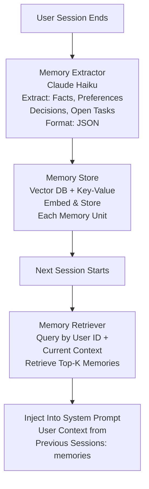

Long-term memory implementation enabling continuity across sessions through extraction, storage, and retrieval of user preferences and decisions.

---

## 16. Pattern Selection Guide

### Decision Tree

| Problem | Solution |
|---------|----------|
| Need enterprise knowledge access without retraining? | Use RAG (#1) or Agentic RAG (#2) if retrieval needs to be model-decided |
| Task requires multiple independent sub-tasks? | Use Parallel Fan-Out (#4) if independent; Use Multi-Agent Orchestration (#3) if coordinated |
| Need to control AI traffic across multiple teams? | Use AI Gateway (#5) |
| High repeat queries driving up cost? | Use Semantic Caching (#6) |
| Need to measure AI output quality at scale? | Use LLM-as-Judge (#7) + Evaluation Harness (#13) |
| AI taking high-stakes actions? | Use HITL Gates (#8) |
| Need safety and compliance filtering? | Use Guardrail Pipeline (#9) |
| Regulated domain needing audit trail? | Use Explainability Pipeline (#10) |
| AI spend is too high? | Use Cost Optimisation Routing (#11) + Semantic Caching (#6) |
| Deploying a new model or prompt? | Use Blue-Green Deployment (#14) + Evaluation Harness (#13) |
| Long conversations or multi-session continuity? | Use CALM Context Management (#15) |
| Validating AI system performance? | Use Stress Testing (#12) + Evaluation Harness (#13) |

---

## 17. Combining Patterns

Common pattern compositions in production enterprise systems:

**Enterprise Q&A System:**
RAG (#1) + Guardrail Pipeline (#9) + Semantic Caching (#6) + AI Gateway (#5) + LLM-as-Judge (#7)

**Multi-Agent Research Platform:**
Multi-Agent Orchestration (#3) + Agentic RAG (#2) + HITL Gates (#8) + Explainability Pipeline (#10) + Evaluation Harness (#13)

**High-Volume Document Processing:**
Parallel Fan-Out (#4) + Cost Optimisation Routing (#11) + Guardrail Pipeline (#9) + Evaluation Harness (#13)

**Regulated Financial AI Advisor:**
Guardrail Pipeline (#9) + HITL Gates (#8) + Explainability Pipeline (#10) + LLM-as-Judge (#7) + Evaluation Harness (#13) + Blue-Green Deployment (#14)

**Developer Productivity Platform (Copilot-style):**
AI Gateway (#5) + Cost Optimisation Routing (#11) + Semantic Caching (#6) + Stress Testing (#12)

---

## Further Reading

- [Agentic AI Reliability, Observability & Governance](43-agentic-ai-reliability-observability-governance.md)
- [AI Harness Architecture & Orchestration](pathname:///archon/architecture/ai-harness-architecture-orchestration)
- [Multi-Agent Topology Patterns](pathname:///archon/architecture/multi-agent-topology-patterns)

---

## Related

- [LLM-as-Judge Evaluation](43-agentic-ai-reliability-observability-governance.md)
- [Guardrail Architecture](pathname:///archon/trust/agentic-ai-security-guardrails)

---

## Sources

- RAGAS: Automated Evaluation Framework for Retrieval-Augmented Generation Systems (Zetian et al.)
- OpenAI Agents SDK documentation
- Anthropic Agent Engineering guides
- Kong API Gateway documentation
- Semantic Caching research (Anthropic 2024)
