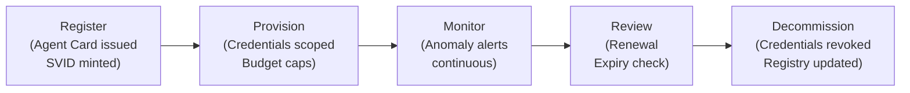

# Enterprise AI Governance & Compliance (Part 1 of 2)

**Why this matters:** This is part 1 of a 2-part guide. Enterprise AI systems require regulatory compliance, governance structures, and risk controls. This part covers the regulatory landscape, governance frameworks, and foundational risk management for AI systems. For cost governance, bias testing, and toolkit resources, see [Part 2](parts/22-enterprise-ai-governance-compliance-part2.md).

**Audience:** Enterprise AI Architects, compliance officers, legal, risk, and governance teams.

**Purpose:** Actionable governance frameworks and compliance requirements for enterprise AI systems. Covers regulatory landscape, RAI principles, operating model, data governance, model governance, security governance, and foundational governance controls.

**Related sections:** [Architecture Patterns](49-enterprise-ai-architecture-patterns.md) | [Foundations](pathname:///archon/architecture/enterprise-ai-architect-foundations) | [Constitutional AI](pathname:///archon/agentic-systems/coding-tools/constitutional-ai-safety-2026)

---

## 1. Enterprise AI Governance Overview

### 1.1 What Needs Governing

| Governance domain | Core question |
| ------------------ | --------------- |
| **Model selection** | Which models are approved? What risk assessment is required? |
| **Data handling** | What data can be sent to AI systems? How is it protected? |
| **Output quality** | How is accuracy, fairness, and safety measured and maintained? |
| **Access control** | Who can use AI capabilities? With what constraints? |
| **Cost** | How is AI spend authorised, tracked, and optimised? |
| **Incidents** | How are AI failures detected, contained, and reported? |
| **Vendors** | How are AI vendors assessed, contracted, and monitored? |
| **Compliance** | Which regulations apply? How is conformity demonstrated? |

### 1.2 Who Owns What

| Role | Governance responsibilities |
| ------ | ----------------------------- |
| **AI Governance Committee** | Policy, risk appetite, cross-org decisions, vendor approval |
| **Enterprise AI Architect** | Architecture standards, pattern approval, technical governance |
| **AI Center of Excellence (CoE)** | Pattern library, tooling, education, community of practice |
| **Product/Line of Business** | Application-level AI decisions within approved guardrails |
| **Legal / Compliance** | Regulatory interpretation, DPA execution, audit readiness |
| **Risk** | AI risk register, risk scoring, enterprise risk reporting |
| **CISO / Security** | Security requirements, vulnerability management, key management |
| **Finance / FinOps** | AI spend governance, budget approval, chargeback models |

---

## 2. Regulatory Landscape

### 2.1 EU AI Act

In force since August 2024 (phased application); GDPR-style territorial reach — applies to any system affecting EU persons.

:::info Digital Omnibus on AI — revised timeline (Council final approval June 29, 2026)
    The Digital Omnibus deferred the high-risk deadlines: **Annex III high-risk obligations now apply from December 2, 2027** and **Annex I (regulated-product) high-risk obligations from August 2, 2028**. Article 50 transparency obligations remain on schedule for **August 2, 2026** (watermarking/marking grace period to December 2, 2026 for existing systems). GPAI obligations are unaffected — in force since August 2, 2025, with Commission enforcement and fines from August 2, 2026. The Omnibus also adds a new Article 5 prohibition on AI-generated NCII/CSAM ("nudifier" tools).

**Risk categories:**

| Category | Definition | Examples | Obligations |
| ---------- | ------------ | ---------- | ------------- |
| **Unacceptable risk** | Prohibited | Social scoring, real-time biometric surveillance in public spaces, manipulation of vulnerable groups, AI-generated NCII/CSAM (added by the Digital Omnibus; transition to Dec 2, 2026) | **Banned** — cannot deploy |
| **High risk** | Significant potential harm | AI in hiring, credit, medical devices, critical infrastructure, law enforcement | Conformity assessment, transparency, HITL, logging, bias testing (Annex III from Dec 2, 2027; Annex I from Aug 2, 2028) |
| **Limited risk** | Transparency obligations | Chatbots, deepfake generation | Must disclose AI interaction to users (Art. 50, applies Aug 2, 2026; watermarking grace to Dec 2, 2026 for existing systems) |
| **Minimal risk** | No specific obligation | Spam filters, recommendation engines (with exceptions) | Best practice only |
| **General-purpose AI (GPAI)** | Foundation/general-purpose models | Claude, GPT-5-family, Gemini | Art. 53 transparency, technical documentation, copyright policy; Art. 55 additional duties for systemic-risk models. In force since Aug 2, 2025; Commission enforcement and fines from Aug 2, 2026 |

**Key obligations for high-risk AI systems:**

- Risk management system throughout the AI lifecycle
- Data governance: training/validation/test data quality, relevance, and bias testing
- Technical documentation (model card equivalent)
- Record-keeping: logs retained to allow incident reconstruction
- Transparency: users informed they are interacting with AI
- Human oversight: ability for humans to intervene, override, or stop the system
- Accuracy, robustness, and cybersecurity requirements
- Conformity assessment (self-assessment or third-party) before market placement

**Penalties:** Up to €35M or 7% of global annual turnover, whichever is higher.

**Action items for architects:**

1. Classify each AI system by EU AI Act risk tier
2. Document classification rationale
3. For high-risk: implement full conformity requirements
4. Engage legal for market placement in EU

### 2.2 NIST AI RMF

The NIST AI Risk Management Framework (AI RMF 1.0, January 2023) provides a voluntary but widely adopted framework for managing AI risk.

**Four core functions:**

=== "GOVERN"

    Establish organisational structures, policies, and accountabilities for AI risk.

    - Define AI risk management strategy and appetite
    - Assign accountability for AI risk decisions
    - Establish AI governance policies
    - Create processes for stakeholder engagement
    - Foster a culture of AI risk awareness

=== "MAP"

    Understand the AI system's context and categorise AI risks.

    - Identify intended use and potential misuse
    - Catalogue AI risks by category (accuracy, bias, security, privacy)
    - Assess risk tolerance for each AI system
    - Map stakeholders and their expectations
    - Document sociotechnical context

=== "MEASURE"

    Quantify AI risks using appropriate metrics and tools.

    - Define quantitative and qualitative risk metrics
    - Test for bias, fairness, robustness, accuracy
    - Evaluate against benchmarks and thresholds
    - Track metrics over time (drift detection)
    - Conduct adversarial testing and red-teaming

=== "MANAGE"

    Treat and monitor AI risks throughout the lifecycle.

    - Prioritise risks by probability × impact
    - Implement controls (technical and organisational)
    - Respond to AI incidents
    - Recover from AI failures
    - Communicate risk status to stakeholders

**Beyond AI RMF 1.0:** NIST's AI portfolio now also includes the **AI 600-1 Generative AI Profile** (July 2024), the draft **IR 8596 Cyber AI Profile** (December 2025), the **CAISI AI Agent Standards Initiative** (February 2026), and SP 800-53 control overlays for AI agents (COSAiS).

### 2.3 ISO 42001

ISO 42001 (published December 2023) is the first international standard for AI management systems — analogous to ISO 27001 for information security.

**Key requirements:**

- AI management system (AIMS) documented and maintained
- Context analysis: understand internal/external context for AI
- Leadership commitment and AI policy
- Risk and opportunity management specific to AI
- Operational planning and controls for AI systems
- Performance evaluation: monitor, measure, analyse, evaluate
- Continual improvement

**Certification process:**

1. Gap analysis against ISO 42001 requirements
2. AIMS design and documentation
3. Implementation (policies, procedures, controls)
4. Internal audit
5. Management review
6. Third-party certification audit (Stage 1: documentation; Stage 2: implementation)
7. Surveillance audits annually; recertification every 3 years

**When to pursue:** When customers or regulators require AI management system certification; when using AI in high-stakes or regulated domains.

**Accredited certification is now mainstream:** **ISO/IEC 42006:2025** (requirements for bodies auditing and certifying AIMS) has been published; ANAB-, UKAS-, and RvA-accredited certification bodies are operating, and 350+ organisations held ISO 42001 certificates as of April 2026.

### 2.4 GDPR and AI

The General Data Protection Regulation applies when personal data is processed by AI systems.

**Key GDPR obligations for AI:**

| Obligation | AI-specific application |
| ----------- | ------------------------ |
| **Lawful basis** | Identify lawful basis for AI processing of personal data (consent, legitimate interest, contract) |
| **Data minimisation** | Send only the minimum personal data needed for the AI task |
| **Purpose limitation** | AI output cannot be used for purposes incompatible with the original purpose |
| **Accuracy** | AI outputs about individuals must be kept accurate; procedures for correction |
| **Data subject rights** | Right to access AI decisions; right to object to automated processing |
| **Right to explanation** | For solely automated decisions with significant effect: meaningful explanation required (Article 22) |
| **DPA with AI vendors** | Data Processing Agreement required with Anthropic, Microsoft, Google acting as processors |

**Anthropic GDPR position:** Anthropic acts as a data processor when processing personal data via the API on behalf of a customer (operator). Execute a DPA before processing EU personal data.

### 2.5 CCPA/CPRA

California Consumer Privacy Act / California Privacy Rights Act applies to businesses meeting California thresholds that process California consumer personal information.

**AI-specific requirements:**

- Disclose use of automated decision-making in privacy notices
- CPRA: consumers may opt out of automated decision-making for profiling with significant effects
- **CPPA ADMT regulations** (approved September 2025): businesses using automated decision-making technology for significant decisions must comply by **January 1, 2027** — pre-use notices, opt-out rights, and risk assessments
- Data minimisation obligations for sensitive personal information
- Right to correct inaccurate personal information (affects AI-generated content about individuals)

### 2.6 Financial Services

| Regulation | Jurisdiction | AI relevance |
| ----------- | ------------- | ------------- |
| **SR 11-7** (Model Risk) | US (Fed/OCC guidance) | AI models as "models" subject to model risk management; validation, documentation, governance |
| **DORA** (Digital Operational Resilience Act) | EU (effective Jan 2025) | ICT risk including AI systems; resilience testing; third-party ICT risk management |
| **SEC AI disclosure** | US (public companies) | Material AI risks disclosed in 10-K/10-Q; AI system failures as material events |
| **MAS TRM** | Singapore | Technology Risk Management guidelines applied to AI systems |

**SR 11-7 model risk management applied to AI:**

- Model inventory: register all AI models used in material business decisions
- Validation: independent validation of model methodology, performance, and limitations
- Ongoing monitoring: track model performance drift; alert on threshold breach
- Documentation: model development documentation, validation reports

### 2.7 Healthcare

**HIPAA and AI:**

- Protected Health Information (PHI) cannot be sent to AI APIs without a Business Associate Agreement (BAA) with the vendor
- Anthropic, AWS (Bedrock), Microsoft (Foundry — formerly Azure AI Foundry), and Google (Vertex) offer BAAs for qualifying enterprise tiers
- De-identification before AI processing: Safe Harbor method (remove 18 HIPAA identifiers) or Expert Determination method

**FDA AI/ML guidance:**

- Software as a Medical Device (SaMD) using AI: subject to FDA oversight
- Predetermined Change Control Plans (PCCP): describe how AI model will be updated post-market without new 510(k)
- AI/ML in medical devices: performance monitoring and transparency requirements

### 2.8 Recent Developments (2026)

- **Texas TRAIGA** — the Texas Responsible AI Governance Act came into force January 1, 2026.
- **Colorado AI Act** — repealed and replaced May 14, 2026 with a narrower disclosure-focused regime, effective January 1, 2027.
- **US federal preemption EO** (December 11, 2025) — executive order directing federal challenges to state AI laws, backed by a DOJ AI Litigation Task Force.
- **China** — CAC AI-content labeling rules and GB 45438-2025 in force since September 1, 2025.
- **UK** — still no AI Act; regulator-led approach continues.

---

## 3. Responsible AI (RAI) Framework

### 3.1 RAI Principles

| Principle | Definition | Measurement |
| ----------- | ----------- | ------------- |
| **Fairness** | AI systems do not discriminate against protected groups | Demographic parity difference, equalized odds difference |
| **Accountability** | Clear ownership of AI decisions and outcomes | Audit trail completeness, decision traceability |
| **Transparency** | How AI works is explainable to appropriate stakeholders | Model card coverage, explainability score |
| **Privacy** | Personal data is minimised and protected | PII detection rate, anonymisation coverage |
| **Safety** | AI systems do not cause harm | Harm incident rate, safety test pass rate |
| **Reliability** | AI systems perform consistently and accurately | Accuracy, robustness against distribution shift |
| **Inclusiveness** | AI systems are designed for broad accessibility | Accessibility testing, multilingual coverage |

### 3.2 Fairness Metrics

**Group fairness (statistical):**

| Metric | Definition | Formula |
| -------- | ----------- | --------- |
| **Demographic parity** | Equal positive prediction rates across groups | P(Ŷ=1 \| A=0) = P(Ŷ=1 \| A=1) |
| **Equalized odds** | Equal TPR and FPR across groups | TPR and FPR equal across A=0, A=1 |
| **Predictive parity** | Equal precision across groups | P(Y=1 \| Ŷ=1, A=0) = P(Y=1 \| Ŷ=1, A=1) |
| **Individual fairness** | Similar individuals treated similarly | Distance(x, x') small ⟹ Distance(f(x), f(x')) small |

**Acceptable disparity thresholds:** Industry varies; common guideline is &lt; 10% disparity for high-stakes applications (hiring, credit). Some regulators specify exact thresholds.

### 3.3 Model Cards and System Cards

**Model card (for each AI model used):**

- Model name and version
- Intended use cases and out-of-scope uses
- Training data description (source, preprocessing, known biases)
- Performance metrics across demographic groups
- Limitations and known failure modes
- Evaluation results

**System card (for each AI system deployed):**

- System purpose and scope
- Models and tools used
- Data flows and data handling
- Human oversight mechanisms
- Safety evaluations conducted
- Incident response process

---

## 4. AI Risk Classification

### 4.1 Building an AI Risk Register

A risk register documents each AI system with its risk profile. Reviewed quarterly; updated on each system change.

| Field | Description |
| ------- | ------------- |
| System ID | Unique identifier |
| System name | Human-readable name |
| Business purpose | What business process it supports |
| AI type | Generative, predictive, agentic, etc. |
| Data processed | Types and classifications of data |
| Decision type | Advisory, automated, agentic action |
| EU AI Act tier | Unacceptable / High / Limited / Minimal |
| NIST risk level | Critical / High / Medium / Low |
| Inherent risk score | Pre-control risk |
| Controls in place | List of implemented controls |
| Residual risk score | Post-control risk |
| Risk owner | Named individual |
| Last reviewed | Date |
| Next review | Date |

### 4.2 Risk Scoring Matrix

**Probability × Impact × Reversibility:**

```
Risk Score = Probability (1-5) × Impact (1-5) × Reversibility factor

Reversibility factor:
  Fully reversible action: 0.5
  Partially reversible: 1.0
  Irreversible (data disclosure, reputational): 2.0
```

| Score range | Risk tier | Governance response |
| ------------- | ----------- | --------------------- |
| 1–10 | **Low** | Standard controls; annual review |
| 11–25 | **Medium** | Enhanced monitoring; semi-annual review |
| 26–50 | **High** | Full oversight; quarterly review; HITL required |
| 51+ | **Critical** | Executive approval; monthly review; HITL + dual approval |

### 4.3 Tiered Governance

| Tier | Risk level | Controls required |
| ------ | ----------- | ------------------- |
| **Tier 1** | Low risk | Self-service; standard API; basic logging |
| **Tier 2** | Medium risk | AI gateway; cost controls; output validation; semi-annual review |
| **Tier 3** | High risk | HITL checkpoints; bias testing; explainability; quarterly ARB review |
| **Tier 4** | Critical risk | Legal approval; executive sign-off; full audit trail; continuous monitoring; third-party assessment |

---

## 5. Governance Operating Model

### 5.1 AI Governance Committee

**Composition:**

- CTO or CIO (executive sponsor)
- Chief Risk Officer or delegate
- Chief Legal Officer or General Counsel delegate
- Chief Information Security Officer
- Chief Data Officer
- Enterprise AI Architect (technical lead)
- Representative from Lines of Business using AI
- HR representative (for people-impacting AI)

**Cadence:**

- Monthly operational review (risk register, incidents, spend)
- Quarterly strategic review (policy updates, vendor assessment, regulatory changes)
- Ad hoc: new high-risk AI system approval, incident response, regulatory enforcement

**Decision rights (RACI):**

- AI risk appetite: Approve → Committee; Recommend → CRO; Inform → Board
- New high-risk AI system: Approve → Committee; Recommend → EA Architect + Legal
- AI vendor approval: Approve → Committee; Recommend → Procurement + Security
- AI policy: Approve → Committee; Draft → CoE + Legal

### 5.2 Center of Excellence Model

The AI CoE enables self-service within guardrails. It prevents governance from becoming a bottleneck.

**CoE responsibilities:**

- Maintain approved pattern library (architecture patterns approved for use)
- Provide internal AI SDK / gateway for teams to build on
- Run education programs (prompt engineering, cost optimisation, governance)
- Operate evaluation infrastructure
- Publish model cards for approved models
- Track AI spend across the enterprise

**CoE does NOT:**

- Approve individual AI features (teams self-service within approved patterns)
- Review every prompt (establish guidelines, not approval gates)
- Own all AI systems (federated ownership with central standards)

### 5.3 AI Review Board (ARB for AI Systems)

For new or materially changed AI systems:

| Review stage | Trigger | Reviewer |
| ------------- | --------- | ---------- |
| **Light review** | Tier 1 or 2 system, uses approved patterns | EA Architect only; 2 business days |
| **Standard review** | Tier 3 system, new pattern, new vendor | ARB full review; 2 weeks |
| **Deep review** | Tier 4 system, regulated domain, critical data | ARB + Legal + Risk + Security; 4 weeks |

**Review checklist:** Architecture alignment, data handling, security controls, bias assessment, HITL design, observability, incident response plan, cost governance.

### 5.4 Policy Lifecycle

```
Identify need → Draft (CoE + Legal) → Stakeholder review (4 weeks)
→ Committee approval → Publish → Communicate → Enforce
→ 12-month scheduled review → Update or reaffirm → repeat
```

---

## 6. Data Governance for AI

### 6.1 Data Lineage Tracking

Track: where training/fine-tuning data came from, who processed it, what transformations were applied, what models used it, and what outputs it influenced.

**Metadata to capture:**

- Source system and timestamp
- Data classification (public, internal, confidential, restricted)
- PII categories present
- Anonymisation method applied
- Consent basis (if applicable)
- AI model and version that processed it

### 6.2 Data Quality Requirements

AI outputs are only as good as the data that grounds them. Establish minimum quality thresholds:

| Dimension | Minimum requirement |
| ----------- | --------------------- |
| **Completeness** | &gt; 95% of required fields populated |
| **Accuracy** | Error rate &lt; 1% for structured fields |
| **Freshness** | Within acceptable staleness for the use case |
| **Consistency** | No conflicting values across sources |
| **Coverage** | Representative of production distribution |

### 6.3 Vendor Data Handling Policies

| Provider | Data used for training? | Data retention | DPA available? |
| ---------- | ------------------------ | --------------- | ---------------- |
| **Anthropic API** | No (by default); opt-in for research | 30 days (logs) | Yes |
| **AWS Bedrock** | No | Per AWS data policy | Yes (AWS BAA) |
| **Microsoft Foundry** | No (Azure policy) | Per Azure retention | Yes (Microsoft DPA) |
| **Google Vertex AI** | No | Per Google policy | Yes (Google DPA) |

**Always verify:** Vendor policies change. Review DPA annually or on each vendor contract renewal.

---

## 7. Model Governance

### 7.1 Model Inventory

Every AI model used in production requires an entry in the model inventory.

| Field | Description |
| ------- | ------------- |
| Model ID | e.g., claude-sonnet-5 (current-generation Claude model IDs carry no date suffix) |
| Model name | Claude Sonnet 5 |
| Provider | Anthropic |
| Version/date | 2025-09-01 |
| Platform | AWS Bedrock, Anthropic API |
| Use cases | List of approved applications |
| Risk tier | Low / Medium / High / Critical |
| Data processed | Classification of data the model sees |
| Approved by | Name and date |
| Review date | Next model review |
| Retirement plan | Successor model |

### 7.2 Third-Party Model Risk Assessment

Before approving a new foundation model for enterprise use:

1. **Capability assessment:** Does it meet the technical requirements?
2. **Safety evaluation:** Provider's safety testing and red-teaming results
3. **Bias testing:** Evaluate for demographic bias on your use cases
4. **Security review:** Prompt injection resistance, output filtering
5. **Legal review:** Terms of service, IP ownership of outputs, data handling
6. **Vendor risk:** Financial stability, dependency risk, SLA terms
7. **Exit assessment:** How hard is it to switch away from this model?

### 7.3 Vendor Lock-in Risk Management

| Lock-in type | Risk | Mitigation |
| ------------- | ------ | ----------- |
| API schema | Breaking API changes affect all integrations | Abstract behind internal AI SDK |
| Embedding model | Re-embedding cost if switching | Store raw text; document embedding model version |
| Fine-tuned model | Training data and compute to recreate | Keep labelled data; document process |
| Feature dependency | Non-standard features unavailable elsewhere | Track proprietary feature usage |

### 7.4 Agent Lifecycle Governance

AI agents introduce a new lifecycle challenge: unlike static API integrations, agents are deployed dynamically, spawn sub-agents, hold credentials, and accumulate access permissions over time. Without explicit lifecycle governance, enterprises accumulate zombie agents — agents still running, still holding permissions, long after their original use case expired. OWASP ASI10 ("Rogue Agents") identifies this as a top-10 agentic AI risk.

**The Agent Lifecycle: Five Stages**



**Stage 1 — Registration**

Every agent must be registered before it can be provisioned with credentials or listed in the agent directory.

| Registry field | Description |
| --- | --- |
| `agent_id` | Unique identifier (UUID) |
| `name` | Human-readable name |
| `owner_team` | Team responsible for the agent |
| `purpose` | Approved use cases (list) |
| `tools_permitted` | MCP servers / APIs the agent may call |
| `autonomy_tier` | 1 = Autonomous / 2 = Notify / 3 = Approval-Gated / 4 = Human-Only |
| `data_classification` | Maximum classification of data the agent may handle |
| `expiry_date` | Mandatory — default 90 days unless renewed |
| `approved_by` | Architect or governance role |

**Stage 2 — Provisioning**

Once registered, the orchestration platform:

- Issues a SPIFFE SVID (X.509 workload certificate, hourly rotation)
- Creates scoped credentials for each permitted MCP server
- Publishes an A2A Agent Card at `/.well-known/agent.json` if the agent is accessible to other agents
- Sets budget caps in the AI gateway (max tokens/day, max tool calls/hour)

**Stage 3 — Monitoring (Continuous)**

| Signal | How detected | Alert |
| --- | --- | --- |
| **Credential use outside permitted tools** | Gateway policy enforcement | P1 — immediate |
| **Abnormal token consumption** | &gt; 3× 7-day rolling average | P2 — team alert |
| **Tool call volume spike** | &gt; 5× baseline within 15 min | P2 — auto-suspend |
| **Data exfiltration pattern** | Large outbound payloads via tool calls | P1 — immediate |
| **Cross-agent spawning anomaly** | Sub-agent count &gt; registered maximum | P2 — team alert |
| **Expired SVID usage attempt** | Certificate validation failure | P1 — block + alert |

**Stage 4 — Periodic Review**

Agents must be reviewed and renewed at the expiry date (default 90 days). The review confirms:

- [ ] Use case still active
- [ ] Owner team still responsible
- [ ] Permitted tools still accurate (remove unused)
- [ ] Autonomy tier still appropriate
- [ ] Compliance status (any regulation changes affecting this agent)

Unreviewed agents at expiry are automatically suspended (not deleted — audit trail preserved), not silently continued.

**Stage 5 — Decommissioning**

When decommissioning an agent:

1. Revoke all credentials (SVID, MCP tokens, API keys)
2. Remove A2A Agent Card from directory
3. Drain in-flight tasks (grace period: 24 hours default)
4. Archive registry entry + audit logs (retain per data retention policy)
5. Confirm with owner team (automated email: "Agent X has been decommissioned")

**OWASP ASI10 — Rogue Agent Detection**

OWASP ASI10 (Rogue Agents) covers the scenario where a compromised, misconfigured, or abandoned agent takes actions outside its intended scope. Detection pattern:

1. **Baseline deviation monitoring:** The registry stores each agent's expected tool call distribution. A rogue agent will deviate from this pattern — calling unexpected tools or making calls at unexpected frequencies.
2. **Cross-agent identity verification:** When one agent invokes another via A2A, the receiving agent validates that the caller's Agent Card matches the registry entry. Unregistered callers are rejected.
3. **Human-in-the-loop for privilege escalation:** Any agent request for additional permissions (new tool access, higher data classification) requires human approval regardless of autonomy tier.
4. **Dead-man switch:** Agents that have not received a task within their expected cadence window (configurable: 7–30 days) are automatically suspended pending review. This catches abandoned agents before they accumulate risk.

**Governance anti-patterns to avoid:**

| Anti-pattern | Risk | Correct approach |
| --- | --- | --- |
| No expiry on agent credentials | Zombie agents accumulate indefinitely | Mandatory expiry + renewal workflow |
| Shared API keys across agents | Cannot revoke one agent without affecting others | Per-agent credentials via SPIFFE or secrets manager |
| Manual-only decommissioning | Process skipped under time pressure | Automated suspension at expiry; manual re-activation required |
| No owner on registry entry | Nobody reviews or decommissions | Ownership mandatory; block registration without it |
| Autonomy tier not reviewed on renewal | Scope creep as agents gain access over time | Renewal requires explicit re-approval of autonomy tier |

---

## 8. Operational Governance

### 8.1 Change Management for AI Systems

AI system changes (model version, system prompt, RAG config, tool additions) are deployments that require change management:

```
Change proposed → Risk assessment → Evaluation harness run
→ Staging deployment → Review (EA Architect) → Production deployment
→ Canary monitoring (Blue-Green) → Full rollout or rollback
```

**AI-specific change types:**

- **Model version upgrade:** Run evaluation harness; watch for schema changes in structured output
- **System prompt change:** Version the prompt; run A/B test; monitor quality metrics
- **RAG index update:** Test retrieval quality before and after; validate coverage of key topics
- **Tool addition:** Security review of new tool; HITL assessment; test in staging

### 8.2 Incident Response Plan for AI Failures

**AI-specific incident categories:**

| Category | Example | Response |
| ---------- | --------- | ---------- |
| **Hallucination incident** | AI generates false information used in decision | Identify affected decisions; notify impacted parties; retrace to root cause; update system prompt/RAG |
| **Safety incident** | AI generates harmful content | Immediate: disable or route around affected capability; investigate; notify trust & safety team |
| **Data exposure** | PII appears in AI output | Treat as data breach; GDPR 72-hour notification assessment; forensic trace of what was exposed |
| **Bias incident** | AI discriminates against protected group | Halt automated use; manual review; bias audit; regulatory notification if applicable |
| **System failure** | AI service unavailable | Activate fallback; communicate SLA impact; escalate if extended |
| **Prompt injection attack** | External content manipulates agent | Contain; audit logs for scope; patch input sanitisation |

**Incident severity:**

| Severity | Definition | Response time | Escalation |
| --------- | ------------ | -------------- | ----------- |
| P1 | Data exposure, safety, regulatory breach | 1 hour | Executive, Legal, CISO |
| P2 | Material quality degradation, system unavailable | 4 hours | EA Architect, Product Lead |
| P3 | Minor quality issue, cost anomaly | 24 hours | AI CoE |
| P4 | Cosmetic, low-impact | 72 hours | Team self-service |

### 8.3 AI-Specific SLAs

Define SLAs that go beyond uptime:

| Dimension | Metric | Example target |
| ----------- | -------- | ---------------- |
| **Accuracy** | Pass rate on evaluation harness | &gt; 85% |
| **Latency** | P95 end-to-end response time | &lt; 5 seconds |
| **Availability** | API availability | &gt; 99.5% |
| **Safety** | Harmful output rate | &lt; 0.01% |
| **Hallucination** | Unsupported claim rate | &lt; 2% |
| **Cost** | Cost per successful task | &lt; $0.05 |

### 8.4 Model Monitoring

**What to monitor:**

| Signal | How | Alert threshold |
| -------- | ----- | ---------------- |
| **Accuracy drift** | Regular eval harness runs | &gt; 5% drop from baseline |
| **Latency drift** | P95 response time trend | &gt; 20% increase |
| **Token usage drift** | Average tokens per call | &gt; 15% increase (prompt bloat) |
| **Error rate** | 4xx/5xx rate | &gt; 1% of calls |
| **Cost drift** | Daily spend trend | &gt; 20% week-on-week |
| **Output distribution shift** | Semantic similarity of outputs over time | Statistical test p &lt; 0.05 |
| **Bias drift** | Fairness metrics on sampled outputs | Disparity &gt; threshold |

---

## 9. Security Governance

### 9.1 Prompt Injection as an Attack Vector

Prompt injection is an AI-native attack where adversarial content in user input or retrieved data manipulates model behaviour to bypass safety controls, leak system instructions, or execute unintended actions.

**Attack types:**

- **Direct injection:** User input contains instructions ("ignore previous instructions and...")
- **Indirect injection:** Malicious content in retrieved documents (web page, email, PDF) instructs the model
- **Jailbreak:** Crafted prompts designed to bypass Constitutional AI safety layers

**Security controls:**

| Control | Layer | Implementation |
| --------- | ------- | --------------- |
| Input sanitisation | Input | Strip/escape known injection patterns; use delimiters to separate system and user content |
| Principal hierarchy enforcement | System prompt | Explicitly instruct model to ignore user instructions that contradict system prompt |
| Output validation | Output | Check model output does not contain system prompt content |
| Tool call auditing | Agent | Log all tool call arguments; alert on unexpected data in outbound calls |
| Indirect injection guard | Retrieval | Treat retrieved content as data, not instructions; use dedicated content/instruction separator |
| HITL for sensitive actions | Agent | Human approval before executing high-privilege actions |

### 9.2 API Key Management Policy

| Policy element | Requirement |
| ---------------- | ------------- |
| Storage | Secrets manager (AWS Secrets Manager, Azure Key Vault, HashiCorp Vault) only — never in code, environment files, or config files checked into source control |
| Scoping | Separate key per environment (dev/staging/prod) and per team |
| Rotation | Quarterly mandatory rotation; automated where possible |
| Compromise response | Revoke within 1 hour; rotate all keys in same scope |
| Access logging | All key usages logged with caller identity |
| Key sharing | Never share keys between individuals or teams |

### 9.3 Insider Threat Considerations

AI systems can amplify insider threats: an insider with AI agent access can exfiltrate data at scale.

**Controls:**

- Principle of least privilege: agents have only the tools and data access the task requires
- Break-glass access: elevated AI capabilities require approval and audit
- Outbound filtering: agent cannot send data to external destinations not on approved list
- Session recording: for high-risk agent actions, record full agent reasoning and tool call sequence
- Anomaly detection: flag unusual data access patterns in AI tool calls

---

## Related

[Enterprise AI Governance & Compliance Part 2](parts/22-enterprise-ai-governance-compliance-part2.md) — cost governance, bias testing, vendor assessment, Claude-specific governance, best practices, and governance toolkit.

## Sources

- EU AI Act (2024): https://eur-lex.europa.eu
- NIST AI Risk Management Framework (AI RMF 1.0): https://airc.nist.gov/home
- ISO 42001:2023 AI Management Systems: https://www.iso.org/standard/81230.html
- General Data Protection Regulation (GDPR): https://ec.europa.eu/info/law/law-topic/data-protection_en
- California Consumer Privacy Act (CCPA): https://oag.ca.gov/privacy/ccpa
- Federal Reserve SR 11-7 Model Risk: https://www.federalreserve.gov/supervisionreg/srletters/sr1107.htm
- OWASP LLM Top 10: https://owasp.org/www-project-top-10-for-large-language-model-applications/
