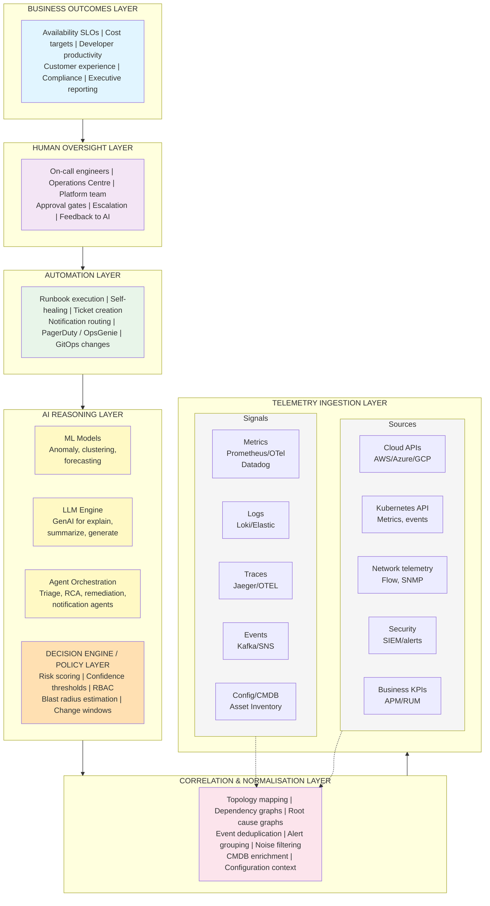
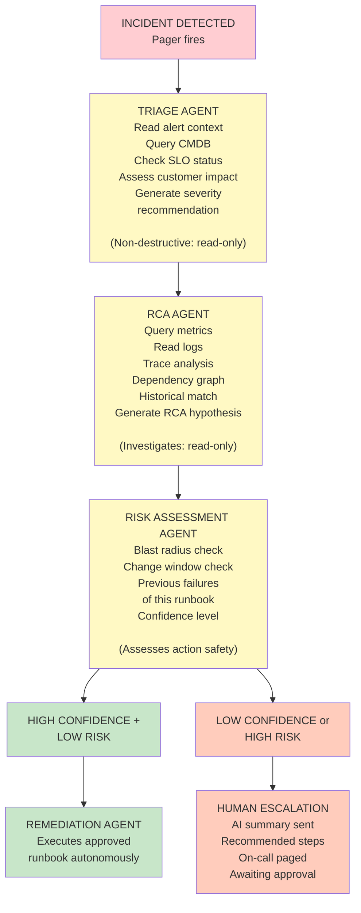
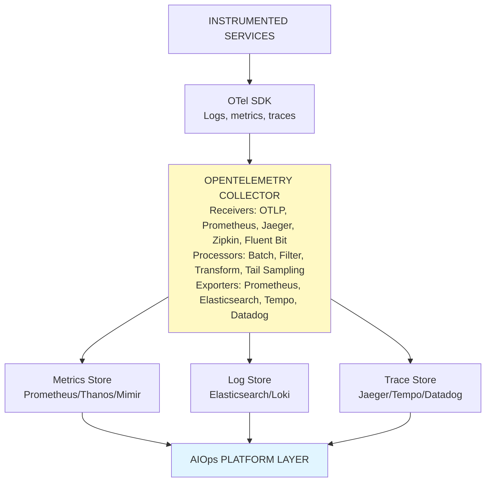

# Enterprise AIOps Guide — AI-Driven IT Operations (Part 1 of 2)

**Audience:** CIOs, Heads of Infrastructure, Platform Engineering teams, SREs, Cloud Operations, Enterprise Architects, AI Architects, DevSecOps leaders, and Operations Centre teams (NOC/SOC).

**Purpose:** This is Part 1 of 2. Comprehensive, enterprise-grade guide on AIOps — how organisations use AI to modernise IT operations, improve reliability, reduce operational costs, accelerate incident resolution, and enable autonomous operations. Part 1 covers foundational concepts, architecture, core capabilities, GenAI in operations, and agentic patterns.

**Why this matters:** Modern enterprises operate millions of telemetry signals per second. Traditional monitoring cannot scale. AIOps closes this gap, delivering 40–80% reduction in alert noise and MTTR, enabling faster incident resolution and autonomous operations within governance guardrails.

---

## Executive Summary for CIOs

Modern enterprises operate millions of telemetry signals per second across cloud, Kubernetes, applications, networks, and security systems. Traditional monitoring — static thresholds, manual correlation, on-call engineers — cannot scale to this environment.

AIOps applies machine learning, generative AI, and agentic automation to close this gap. The business case is compelling: organisations that have implemented mature AIOps report:

- **60–80% reduction in alert noise** (fewer pages, better signal-to-noise ratio)
- **40–60% reduction in MTTR** (faster incident resolution through AI-assisted RCA)
- **30–50% reduction in cloud waste** (AI-driven cost optimisation)
- **25–40% reduction in on-call burden** (automated runbook execution, fewer false positive pages)
- **2–4× improvement in change success rate** (AI-assisted change risk analysis)

AIOps is not a product category — it is an architecture discipline. No single vendor provides complete AIOps. Organisations must compose it from observability platforms, AI engines, automation frameworks, and ITSM integration.

The adoption path is incremental: start with noise reduction and AI-assisted triage (ROI in 90 days), then progress to AI-generated runbooks and automated remediation (6–18 months), and eventually to fully governed autonomous operations (24–36 months).

---

## 1. Evolution of IT Operations

### 1.1 The Progression from Reactive to Autonomous

```mermaid
graph TB
    A["1990s: Reactive Operations<br/>Trigger: Users called<br/>Limitation: Too slow; damage done"]
    B["2000s: Monitoring<br/>Nagios, Zabbix<br/>Trigger: Threshold alerts<br/>Limitation: Alert fatigue"]
    C["2005-2010: Event Management<br/>Moogsoft, Netcool<br/>Trigger: Multi-source events<br/>Limitation: Manual correlation"]
    D["2008-2015: Centralised Logging<br/>Splunk, ELK<br/>Trigger: Aggregated logs<br/>Limitation: Reactive only"]
    E["2010-2018: APM<br/>New Relic, Dynatrace<br/>Trigger: Code-level tracing<br/>Limitation: No infra context"]
    F["2016-2022: Observability<br/>Datadog, Grafana<br/>Trigger: Correlated signals<br/>Limitation: Requires experts"]
    G["2015-present: SRE<br/>Site Reliability<br/>Trigger: Error budgets, SLOs<br/>Limitation: People-intensive"]
    H["2019-present: AIOps<br/>ML-driven correlation<br/>Trigger: AI-assisted triage<br/>Limitation: Governance needed"]
    I["2024-present: Agentic AIOps<br/>AI agents investigate and act<br/>Trigger: Autonomous response<br/>Limitation: Framework maturity"]
    J["2026+: Autonomous Operations<br/>Self-healing infrastructure<br/>Trigger: Human exception only<br/>Limitation: Governance complexity"]
    
    A --> B --> C --> D --> E --> F --> G --> H --> I --> J
    
    style A fill:#fee
    style B fill:#fdd
    style C fill:#fcc
    style D fill:#fbb
    style E fill:#faa
    style F fill:#f99
    style G fill:#f88
    style H fill:#f77
    style I fill:#f66
    style J fill:#f55
```



**Evolution diagram:** IT operations evolved from reactive user-reported issues (1990s) through static threshold monitoring (2000s), event correlation (2005–2010), centralised logging (2008–2015), application performance monitoring (2010–2018), observability (2016–2022), SRE practices (2015–present), and ML-driven AIOps (2019–present). Agentic AIOps (2024–present) enables autonomous agent-driven incident response. By 2026+, aspirational autonomous operations with human oversight is the frontier.

### 1.2 Business and Technical Drivers

**Scale problem:** A modern enterprise application on Kubernetes generates 10,000–1,000,000 telemetry events per second. Human-speed monitoring cannot process this.

**Complexity problem:** A microservices application with 200 services has ~20,000 possible dependency paths. Root cause analysis across this graph is intractable without AI.

**Talent problem:** Skilled SREs are scarce and expensive. Organisations cannot hire their way out of operational complexity.

**Cost problem:** Cloud environments are elastic — capacity waste is invisible without ML-driven anomaly detection on cost telemetry.

**Availability expectation:** Consumer expectations for 99.99% availability (&lt;53 minutes downtime/year) require automated detection and response that operates faster than human on-call cycles.

---

## 2. What is AIOps?

### 2.1 Definitions

**Traditional AIOps (ML-driven):** Application of machine learning to IT operational data (metrics, logs, events) to automate detection, correlation, and prioritisation. Examples: anomaly detection, log clustering, alert deduplication.

**GenAI-powered Operations:** Use of Large Language Models to explain incidents, generate runbooks, summarise events, create postmortems, and assist engineers through natural language interfaces. Examples: ChatOps assistants, log explanation, incident summary.

**Agentic AIOps:** Autonomous AI agents that investigate, reason, and execute remediation steps without continuous human direction. Examples: incident triage agent, Kubernetes debugging agent, cost optimization agent.

**Autonomous Operations (NoOps):** Fully self-managing infrastructure where AI handles all operational decisions within defined guardrails. Aspirational state; not currently recommended for mission-critical systems without mature governance.

### 2.2 AIOps vs Adjacent Concepts

| Concept | Purpose | Difference from AIOps |
| --- | --- | --- |
| **Monitoring** | Alert when something exceeds a threshold | Static; no intelligence; high false-positive rate |
| **Observability** | Collect and query telemetry (metrics, logs, traces) | Data collection and querying; AIOps adds intelligence on top |
| **ITSM** | Manage IT service lifecycle (incidents, problems, changes) | Process and ticketing; AIOps provides intelligence that feeds ITSM |
| **Event Management** | Aggregate and de-duplicate events from monitoring | Mechanical aggregation; AIOps adds ML correlation and causality |
| **SOAR** | Security Orchestration, Automation, and Response | Security-specific automation; AIOps is broader (IT Ops + security) |
| **Runbook Automation** | Execute defined scripts in response to events | Deterministic script execution; AIOps adds intelligence about when and how |
| **Platform Engineering** | Self-service developer platform for infrastructure | Provisioning and developer experience; AIOps is runtime operational intelligence |
| **SRE** | Reliability engineering discipline and practices | Human-driven engineering practice; AIOps provides AI capabilities for SRE teams |

---

## 3. Enterprise AIOps Reference Architecture

### 3.1 Layered Architecture



**Layered AIOps architecture:** From bottom (telemetry ingestion) to top (business outcomes). AI reasoning layer includes ML models, LLM engines, agent orchestration, and decision/policy layer for risk scoring and confidence thresholds.

### 3.2 Data Flow

```
1. COLLECTION
   Agents, exporters, sidecars, and cloud APIs push or pull telemetry
   → OpenTelemetry Collector as the universal normalisation layer
   → Destination: time-series DB (Prometheus/Thanos), log store (Elasticsearch/Loki),
     trace store (Jaeger/Tempo), event bus (Kafka)

2. NORMALISATION
   Enrich events with topology context (CMDB, K8s labels, cloud tags)
   Tag with environment, service, team, SLO, criticality
   Deduplicate correlated events (same issue, multiple alerts)

3. CORRELATION
   Dependency graph traversal to find probable root cause
   ML clustering: group similar anomalies into a single incident
   Temporal correlation: events within the causal time window of an outage

4. AI REASONING
   ML models: is this a real anomaly? (anomaly detection, threshold calibration)
   LLM: explain this incident in plain English (log explanation, RCA summary)
   Agents: investigate, reproduce, and propose remediation

5. DECISION ENGINE
   Score confidence of AI assessment
   Apply risk policy (blast radius, change window, criticality)
   Route: auto-remediate (high confidence, low risk) | recommend (medium) | alert (uncertain)

6. AUTOMATION
   High-confidence, low-risk: auto-execute remediation runbook
   Medium-confidence: create ticket + recommendation in ITSM; notify on-call
   Low-confidence: alert on-call with AI summary; human handles

7. FEEDBACK LOOP
   Human accepts / rejects AI recommendation → trains future model
   Incident outcome recorded → improves RCA accuracy
   Auto-remediation success/failure → improves runbook selection
```

### 3.3 Deployment Models

| Model | Infrastructure | When to Use | Trade-off |
| --- | --- | --- | --- |
| **Cloud-native SaaS** | Vendor manages all infrastructure | Most enterprises; fastest time to value | Data egress; vendor dependency |
| **Hybrid** | AIOps platform on-premise; cloud for some workloads | Mixed estate; regulated data | Operational complexity |
| **Multi-cloud** | Deploy AIOps across AWS + Azure + GCP | Multi-cloud estates | Highest complexity; full coverage |
| **Air-gapped** | Fully isolated network; no cloud connectivity | Government; defence; critical infrastructure | OSS-only; no cloud AI services |
| **Regulated** | Data residency constraints; no telemetry leaving jurisdiction | EU (GDPR), healthcare (HIPAA), banking | Regional deployment; privacy-preserving ML |

---

## 4. Core AIOps Capabilities

### 4.1 Event Correlation and Alert Deduplication

**Problem:** 10,000 monitoring alerts for one 10-minute outage — an engineer cannot tell which alert is the root cause.

**AI approach:** Graph-based correlation uses the service dependency map to cluster alerts that share a common dependency. ML clustering (DBSCAN) groups alerts with similar fingerprints into a single grouped event.

**Result:** 60–90% reduction in alert volume presented to on-call engineers.

**Implementation prerequisite:** Service dependency map must be accurate and current (CMDB or dynamic topology discovery).

### 4.2 Root Cause Analysis (RCA)

**Problem:** Identifying root cause in a distributed system is detective work — tracing symptoms through layers of dependencies to find the originating failure.

**AI approach:**

1. **Graph traversal:** Walk the dependency graph backward from symptoms to probable cause
2. **Causal inference:** ML identifies the signal that changed before all downstream symptoms
3. **Historical pattern matching:** "Last time these 3 alerts co-occurred, the root cause was X"
4. **LLM explanation:** LLM reads the correlation graph and writes a plain-English RCA hypothesis

**Output:** "Probable root cause: Redis cache cluster in us-east-1b experienced OOM (Out of Memory) at 14:23:07. This caused 47 downstream services to timeout. Confidence: 87%."

### 4.3 Anomaly Detection

**Problem:** Static thresholds (CPU &gt;80%) generate noise because the right threshold varies by time of day, day of week, and service load pattern.

**AI approach:**

- **Time-series forecasting:** Build a predicted-value range for each metric using historical patterns. Alert only when actual deviates significantly from predicted.
- **Seasonal decomposition:** Separate trend, seasonality, and residual noise to isolate real anomalies.
- **Multivariate anomaly detection:** Alert only when multiple correlated metrics deviate together (higher precision than single-metric alerts).

**Result:** False positive reduction 40–70% vs. static thresholds.

### 4.4 Intelligent Alert Routing

Route alerts to the right team with the right context:

```
INCOMING ALERT
    │
    ▼
[Service Tag] → identify owning team from service registry
[Severity Score] → LLM assesses customer impact
[Context Enrichment] → attach recent deploys, capacity events, SLO status
[Route Decision]:
  - P0/Customer-impacting → PagerDuty (immediate page) + War Room channel
  - P1/Service-degraded → PagerDuty (5-minute delayed page if unacknowledged)
  - P2/Warning → Slack thread + JIRA ticket
  - P3/Informational → Logged; no notification
```

### 4.5 Incident Prediction

**Leading indicators approach:** Train ML on historical incident data to identify signals that typically appear 5–30 minutes before incidents:

- Gradual memory creep
- Increasing error rate below SLO threshold
- Latency percentiles widening (p99 diverging from p50)
- Connection pool saturation trending upward
- Disk I/O latency increasing steadily

**Output:** "Probability of P1 incident for checkout-service in next 30 minutes: 73%. Leading indicator: database connection pool at 87% capacity and growing 2%/minute."

### 4.6 Capacity Forecasting

**ML approach:** Time-series forecasting (Prophet, LSTM, or gradient boosting) on resource utilisation metrics to predict when capacity thresholds will be reached.

**Output:** "API gateway will reach 90% CPU capacity in 14 days at current growth rate. Recommended action: scale out by 30% or optimise the top-3 CPU-consuming endpoints."

### 4.7 Performance Optimisation

AI identifies performance optimisation opportunities from telemetry:

- Slow database query identification from query trace data
- Cache hit rate analysis and TTL recommendation
- Network bottleneck identification from flow logs
- Application thread pool sizing recommendations

### 4.8 Cloud Cost Optimisation

AI analyses cloud spend and identifies waste:

- Underutilised reserved instances (RI coverage analysis)
- Right-sizing recommendations (oversized EC2/VM instances)
- Idle resource detection (unattached storage, unused load balancers)
- Anomalous spend patterns (sudden cost spikes)

### 4.9 Configuration Drift Detection

Detect when infrastructure drifts from its defined configuration:

- IaC drift: running state vs. Terraform/CDK definition
- Security posture drift: security group rules changed outside IaC
- Kubernetes configuration drift: pod spec changed from deployed manifest

**AI value-add:** Correlate drift events with incident timeline to identify configuration changes as probable root cause.

---

## 5. GenAI in IT Operations

### 5.1 Incident Summarisation

When an incident occurs, the on-call engineer receives:

- 47 alerts
- 3 pages in a runbook
- 1 partially relevant previous postmortem
- A live Kubernetes dashboard

GenAI synthesises this into a 3-sentence summary:

&gt; "The checkout service is returning 503 errors at 34% error rate since 14:23 UTC. Root cause is likely the Redis cache cluster in us-east-1b (OOM condition flagged at 14:22). Similar incident in March 2026 was resolved by restarting the redis-cache-0 pod and increasing memory limit from 2Gi to 4Gi."

**Implementation:** RAG pipeline connecting LLM to observability data, runbook store, and historical incident records.

### 5.2 Log Explanation

Raw logs are often cryptic. GenAI translates them to plain English:

**Input log:**

```
WARN [db-pool] HikariPool-1 - Connection is not available, request timed out after 30003ms
WARN [db-pool] HikariPool-1 - Pool stats (total=10, active=10, idle=0, waiting=47)
ERROR [checkout] Transaction failed: could not acquire connection from pool
```

**GenAI output:**
&gt; "The database connection pool is exhausted — all 10 connections are in use and 47 requests are waiting. This suggests either a database latency spike (connections taking longer to complete) or a connection leak (connections not being returned to the pool). Check: (1) database query duration P99 over the last 10 minutes, (2) whether long-running transactions are holding connections."

### 5.3 Runbook Generation

Given an incident pattern, GenAI generates a step-by-step runbook:

**Input:** Service type (Redis cache), incident pattern (OOM), infrastructure (Kubernetes, AWS ElastiCache)

**GenAI output:**

```markdown
# Runbook: Redis OOM — Kubernetes (auto-generated)

## Immediate triage (0–5 minutes)
1. Verify: `kubectl logs redis-cache-0 -n production | grep OOM`
2. Check: `kubectl top pod -n production -l app=redis-cache`
3. Check client request rate: [link to Redis dashboard]

## Containment (5–15 minutes)
4. If pod OOM-killed: `kubectl delete pod redis-cache-0 -n production` (graceful restart)
5. Clear cache if restart doesn't resolve: `redis-cli FLUSHDB` (caution: performance impact)

## Root cause
6. Review memory growth rate over last 2 hours on dashboard
7. Check for recent client-side change that increased key TTL or value size

## Resolution
8. If structural: update memory limit in Helm values + PR for IaC
9. If traffic spike: evaluate eviction policy (maxmemory-policy allkeys-lru)
```

**Critical note:** AI-generated runbooks must be reviewed by an SRE before use in production. Mark as "AI Draft — Not Approved" until reviewed.

### 5.4 Post-Incident Reports (PIRs)

GenAI drafts the postmortem from structured incident data:

**Input:** Incident timeline from ITSM, alert history, remediation steps taken, business impact data.

**GenAI draft output:** Full postmortem with timeline, impact, root cause, contributing factors, action items, and 5-whys analysis.

**Engineer effort:** Review and edit the draft (30–60 minutes) vs. write from scratch (2–4 hours). Quality improves with feedback on generated drafts.

### 5.5 GenAI Limitations in Operations

| Limitation | Risk | Mitigation |
| --- | --- | --- |
| **Hallucination** | LLM invents a root cause that sounds plausible but is wrong | Always show confidence score; require human validation before action |
| **Stale knowledge** | LLM doesn't know about infrastructure changes made after training | RAG from live CMDB and recent runbooks; note "last updated" in context |
| **Overconfidence** | LLM asserts false certainty | Tune prompts to express uncertainty; calibrate confidence scoring |
| **Sensitive data in logs** | Log lines may contain PII, secrets, or credentials | PII scrubbing pipeline before LLM analysis |
| **Context window limits** | Large log files exceed context window | Chunking + summarisation pipeline before LLM |

---

## 6. Agentic AIOps

### 6.1 The Agent Architecture for Operations

AI agents for operations extend beyond single LLM queries — they plan, investigate, and act across multiple tools and systems.



**Agentic incident response flow:** Triage agent assesses severity (read-only). RCA agent investigates probable root cause (read-only). Risk assessment agent evaluates action safety. High-confidence, low-risk incidents → automated remediation. Low-confidence or high-risk → human escalation with AI analysis.

### 6.2 Specialised Agent Roles

| Agent | Purpose | Tools Available | Autonomy Level |
| --- | --- | --- | --- |
| **Incident Triage Agent** | Assess severity, customer impact, initial context | CMDB, alert history, SLO dashboard | Full autonomy (read-only) |
| **Root Cause Analysis Agent** | Investigate probable root cause | Metrics query, log search, trace explorer, dependency graph | Full autonomy (read-only) |
| **Runbook Execution Agent** | Execute approved remediation steps | Kubernetes API, restart scripts, cache flush, configuration apply | Conditional autonomy (policy-gated) |
| **Change Risk Agent** | Assess risk of a proposed change | Change history, deployment frequency, blast radius calculator | Full autonomy (read-only) |
| **Capacity Planning Agent** | Forecast resource needs | Metrics forecasting, cost APIs, scaling APIs | Full autonomy (read-only) |
| **Cloud Optimisation Agent** | Identify and act on cost waste | Cloud billing APIs, right-sizing recommendations | Conditional autonomy (spend thresholds) |
| **Security Coordination Agent** | Triage security events, correlate with IT events | SIEM, vulnerability scanner, IAM logs | Read-only; human required for action |
| **Knowledge Agent** | Retrieve relevant runbooks, postmortems, documentation | Runbook store, incident history, wiki | Full autonomy |
| **On-call Assistant** | Assist on-call engineers during incidents | All read-only tools + Slack/Teams | Human-directed only |
| **Executive Reporting Agent** | Generate executive-friendly incident summaries | Incident data, business impact data | Full autonomy |

### 6.3 Human Oversight and Approval Workflows

```
AUTONOMY LEVELS
─────────────────────────────────────────────────────────────────

LEVEL 0 (Full Human Control):
  AI observes and analyses. Humans make all decisions and take all actions.
  When to use: Regulated environments, novel incident patterns, sensitive systems.

LEVEL 1 (AI Recommends, Human Approves):
  AI generates a recommended action. Human reviews and clicks "Approve" or "Reject".
  Response time: Human must respond within 5 minutes or action expires.
  When to use: Standard remediation in production; most P1 incidents.

LEVEL 2 (AI Acts, Human Can Interrupt):
  AI executes pre-approved playbooks autonomously. Human receives notification.
  Human can interrupt via "Stop" button in ops console at any time.
  When to use: Well-understood incident types with low blast radius.

LEVEL 3 (Full AI Autonomy within Guardrails):
  AI detects and remediates without human involvement.
  Guardrails: defined action set, blast radius limit, change window, rollback required.
  When to use: Known-good remediation patterns with validated safety record.

─────────────────────────────────────────────────────────────────
IMPORTANT: Start at Level 0-1. Graduate to Level 2-3 only after:
  - Minimum 50 human-validated incidents of the same type
  - 95%+ recommendation acceptance rate
  - Automated rollback verified to work
  - Blast radius bounded and documented
```

---

## 7. Enterprise Use Cases

### 7.1 Use Case Prioritisation Matrix

| Use Case | Business Value | Implementation Complexity | Recommended Priority |
| --- | --- | --- | --- |
| Alert noise reduction | High | Low | Start here (Week 1–4) |
| AI-assisted incident triage | High | Low | Early (Week 4–8) |
| Automated postmortem drafting | Medium | Low | Early (Month 2) |
| Log explanation (GenAI) | Medium | Low | Early (Month 2) |
| Root cause AI hypothesis | High | Medium | Month 3–4 |
| Kubernetes auto-remediation | High | Medium | Month 4–6 |
| Cloud cost optimisation | High | Medium | Month 3–6 |
| Runbook auto-generation | Medium | Medium | Month 4–6 |
| Incident prediction | High | High | Month 6–12 |
| Capacity forecasting | Medium | Medium | Month 4–8 |
| Autonomous remediation | High | Very High | Month 12–24 |

### 7.2 Major Incident Management

**Scenario:** P0 — Checkout service unavailable; £2M/hour revenue impact.

**AIOps workflow:**

1. **T+0s:** Anomaly detection fires; 47 alerts → correlated into 1 incident by ML
2. **T+30s:** Triage agent assesses: P0, 100% error rate, £2.1M/hour impact
3. **T+45s:** RCA agent identifies: Redis OOM in us-east-1b; 87% confidence
4. **T+60s:** GenAI drafts incident summary + recommended runbook
5. **T+90s:** On-call paged with full context (summary, RCA, recommendation)
6. **T+3m:** On-call engineer reviews → approves runbook execution
7. **T+5m:** Runbook agent restarts Redis pod; increases memory limit
8. **T+7m:** Error rate returns to baseline; incident auto-resolved
9. **T+8m:** Executive reporting agent sends CEO/CTO briefing
10. **T+30m:** Postmortem agent drafts full PIR for engineer review

**Without AIOps:** Steps 1–6 would take 20–40 minutes. MTTR = 45+ minutes.
**With AIOps:** MTTR = 7–12 minutes.

### 7.3 Kubernetes Troubleshooting

**Scenario:** Pod crash-looping in production; developer can't determine cause.

**AIOps workflow:**

1. Kubernetes event agent detects `CrashLoopBackOff` on 3 pods
2. Log analysis agent reads last 100 lines of pod logs before each crash
3. GenAI identifies: `OOMKilled` — container exceeded memory limit of 512Mi
4. Container resource advisor suggests: `memory limit: 768Mi` based on observed peak usage
5. Creates JIRA ticket with analysis + PR suggestion for Helm values change
6. On-call receives Slack message with analysis (no page required for low-risk fix)

### 7.4 Cloud Cost Optimization

**Scenario:** Cloud spend 40% over budget for the month.

**AIOps workflow:**

1. Cost anomaly agent detects spend spike vs. baseline forecast
2. FinOps agent analyses by service tag: identifies 3 services with highest over-spend
3. Right-sizing agent: 17 EC2 instances at m5.xlarge running at avg 12% CPU → suggests m5.large (50% cost reduction for those instances)
4. Idle resource agent: 12 EBS volumes unattached to any instance → £3,200/month in waste
5. Reserved instance advisor: 8 on-demand instances running 730 hours/month → RI purchase saves £8,400/month
6. Creates Jira tickets for each recommendation; routes to responsible team
7. Total monthly saving potential: £23,600 (43% of overspend)

### 7.5 Failed Deployment Response

**Scenario:** Deployment pipeline completes; error rate immediately rises on new version.

**AIOps workflow:**

1. Deployment event received from CI/CD pipeline
2. Canary monitoring agent activates: compares error rate between old and new pods
3. At 5% canary, error rate is 8% (vs. 0.1% baseline) → signals failure
4. Deployment risk agent: confidence 96% that this release caused the regression
5. Auto-rollback triggered (Level 2 autonomy — no human required for rollback)
6. Deployment agent creates: GitHub issue linking to error traces and failing test coverage
7. Developer notified with root cause analysis and suggested fix

### 7.6 Certificate Expiration Management

**Scenario:** Prevent SSL certificate expiry outages (a common and avoidable incident type).

**AIOps workflow:**

1. Certificate inventory agent scans all endpoints and internal services daily
2. Forecasting agent flags certificates expiring within 30/14/7 days
3. Automated renewal: ACM (AWS), DigiCert API, or ACME protocol renewal triggered at 30-day mark
4. Escalation: if renewal fails, alert on-call at 14-day mark with manual instructions
5. Audit: certificate inventory report to security team monthly

---

## 8. Observability and AIOps

### 8.1 Observability as the AIOps Foundation

AIOps is only as good as its data foundation. Without comprehensive observability, AI has nothing to reason about.

```
OBSERVABILITY QUALITY → AIOPS QUALITY

Poor observability:          Rich observability:
Few metrics              →   Metrics: 1M+ time series
Partial logs             →   Logs: structured, all services
No tracing               →   Distributed traces: every request
Stale CMDB               →   Real-time topology: auto-discovered

→ AIOps: low accuracy,       → AIOps: high accuracy,
   high false positives,        low false positives,
   delayed detection            predictive capability
```

### 8.2 OpenTelemetry as the Universal Telemetry Layer

OpenTelemetry (OTel) is the vendor-neutral standard for telemetry collection. Implement it before selecting your AIOps platform — it prevents vendor lock-in at the data layer.



**OpenTelemetry architecture:** Instrumented services emit logs, metrics, and traces via OTel SDK. OpenTelemetry Collector (receivers, processors, exporters) normalises and routes telemetry to metrics store, log store, and trace store. AIOps platform layer consumes unified telemetry.

### 8.3 SLOs and Error Budgets as AIOps Signals

SLOs provide the business-meaningful signal that AIOps prioritisation is based on:

```
SLO CONFIGURATION:
  checkout-service availability SLO = 99.9% (30-day window)
  Error budget = 0.1% × 30 days × 24 hours × 60 min = 43.2 minutes

AIOps uses SLO burn rate as the primary severity signal:

  Burn rate &gt; 14.4× (100% budget in 1 hour) → CRITICAL; immediate action
  Burn rate &gt; 6× (100% budget in ~5 hours) → HIGH; urgent investigation
  Burn rate &gt; 1× (on track to exhaust budget) → MEDIUM; monitor closely
  Burn rate &lt; 1× → LOW; no action needed
```

### 8.4 Distributed Tracing for RCA

Distributed traces connect the dots across microservices:

```
User request → [API Gateway (3ms)] → [Checkout Service (47ms)] →
    [Product Service (5ms)] → [Cart Service (412ms)] ← SLOW
                                        │
                             [Redis Cache (401ms)] ← ROOT CAUSE
```

AIOps traces analysis identifies slow spans automatically and attributes root cause to the deepest slow dependency.

### 8.5 Real User Monitoring (RUM) as Business Signal

RUM measures actual user experience — the ultimate AIOps signal:

- Core Web Vitals (LCP, FID, CLS) correlated with infrastructure events
- Checkout funnel abandonment rate correlated with API error rate
- Geographic performance variation correlated with CDN / edge health

When RUM signals a user experience problem, AIOps can correlate it with infrastructure events in the same time window to identify the technical root cause.

---

## Related

- [Agentic AI Reliability, Observability & Governance](43-agentic-ai-reliability-observability-governance.md)
- [Enterprise AI Architecture Patterns](49-enterprise-ai-architecture-patterns.md)
- [Enterprise AI Governance & Compliance](../51-enterprise-ai-governance-compliance.md)
- [Agent Interoperability & Orchestration](../40-agent-interoperability-orchestration.md)

## Sources

