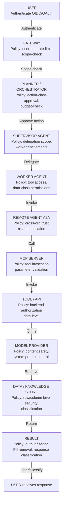
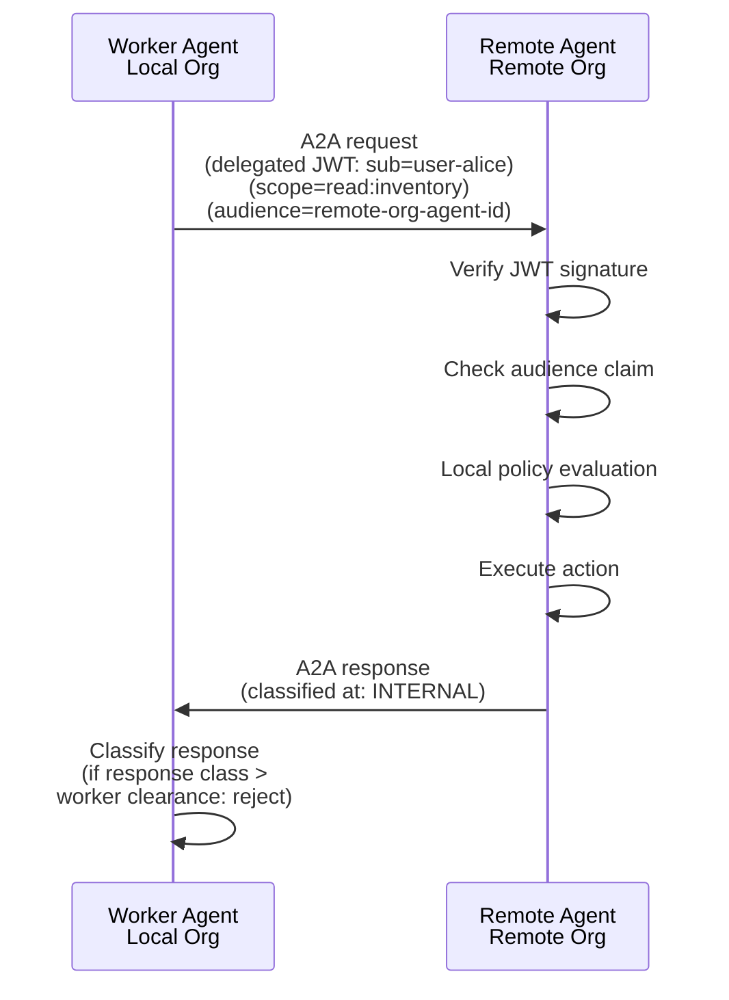
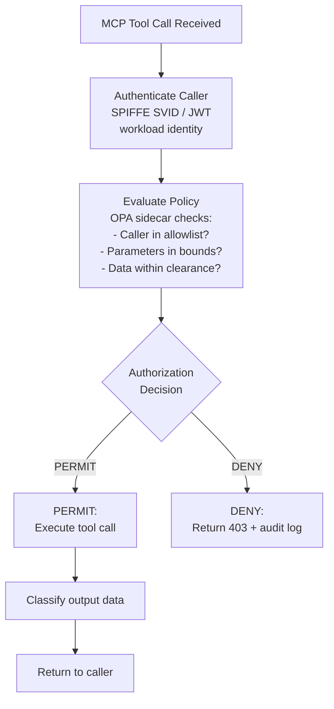
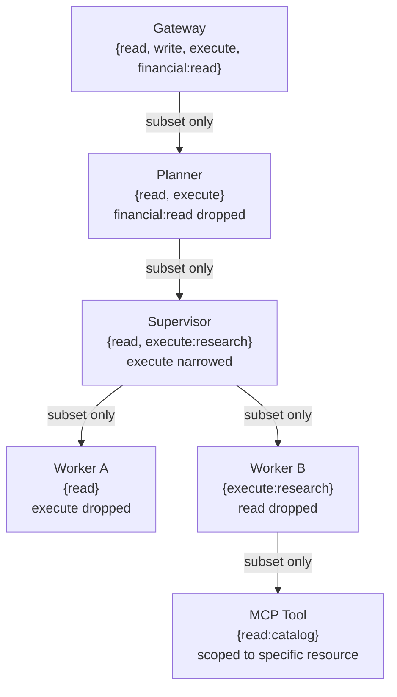
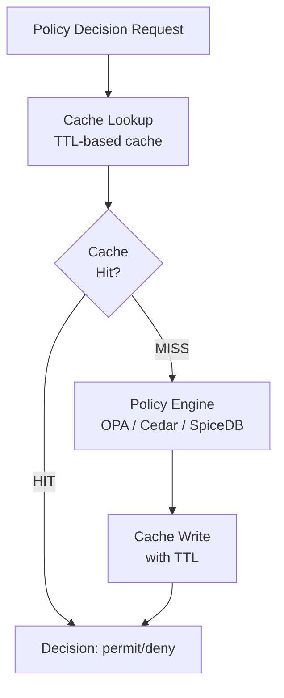
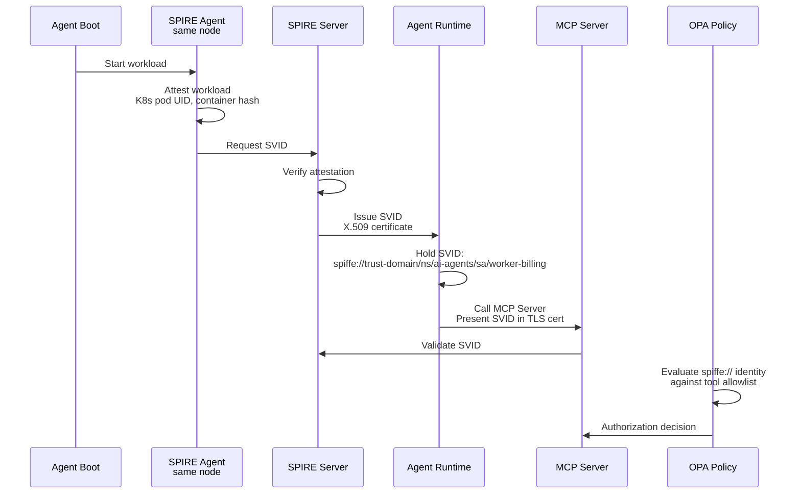
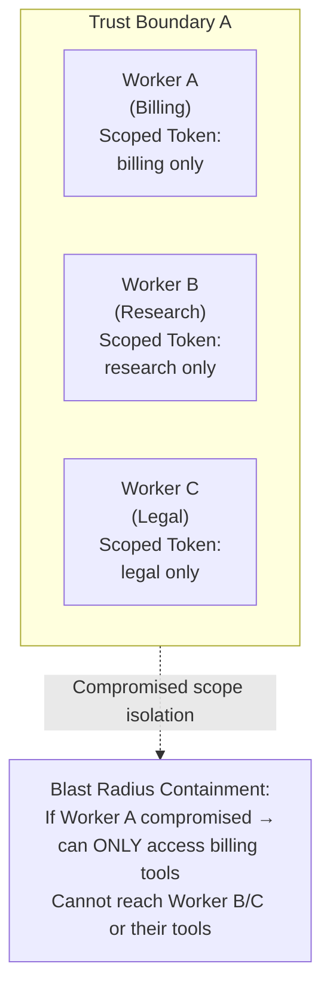
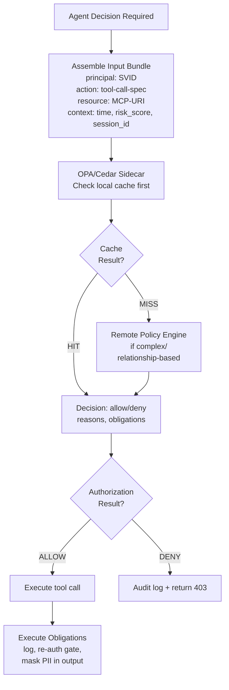

# Governance Propagation Chain

**Audience:** AI architects, security architects, and platform engineers responsible for enforcing policy across multi-agent systems.

**Purpose:** Defines how authorization policy propagates from user intent through every layer of a multi-agent system to the model, tool, and data. Covers policy inheritance, intersection, delegation, conflict resolution, ABAC/RBAC/ReBAC, Cedar, OPA, and Zero Trust across agent boundaries.

**Scope:** Runtime propagation mechanics. For policy content (what policies exist), see [Policy & Authorization Series](pathname:///archon/trust/ai-security-governance/policy-authorization-series-overview). For identity mechanics (how agents authenticate), see [Auth & Identity](pathname:///archon/protocols/auth-identity-flows). For multi-agent topology (who calls whom), see [Multi-Agent Topology Patterns](pathname:///archon/architecture/multi-agent-topology-patterns).

---

## 1. The Governance Chain

Every action taken by any agent must be traceable back to an authorised human intent. The governance chain is the complete path from user to action, with a policy evaluation point at every transition.

Governance Chain: User Authorization to Result Delivery



No layer is exempt. Zero Trust applies: every transition is authenticated, every action is authorized, every decision is logged. Authorization propagates downstream with strict restriction at each boundary (no layer grants permissions beyond what it received).

---

## 2. Policy Layers and Responsibilities

### 2.1 Layer 1: Gateway (Entry Point)

The Gateway is the first and broadest policy enforcement point. It enforces:

- **Authentication**: validates user identity (JWT/OIDC token, API key, session)
- **Authorization-at-entry**: checks user role, subscription tier, IP allowlist, geographic restriction
- **Rate limiting**: per-user, per-tenant, per-model-class token budgets
- **Scope restriction**: user's requested scope vs. what their identity permits (`openid email agent:read` vs. `agent:execute:privileged`)
- **Tenant isolation**: multi-tenant routing; user's context never crosses to another tenant

**Technology:** Kong AI Gateway, AWS AI Gateway, Azure API Management, custom NGINX/Envoy with OPA sidecar.

**Policy language:** OPA Rego rules against the decoded JWT claims.

```
# OPA example: gateway entry policy
package gateway.authz

default allow = false

allow {
  input.method == "POST"
  input.path == "/api/v1/agent/execute"
  token.claims.subscription_tier in {"professional", "enterprise"}
  not token.claims.suspended
}

token := {"claims": claims} {
  [_, payload, _] := io.jwt.decode(input.token)
  claims := payload
}
```

### 2.2 Layer 2: Planner / Orchestrator

The Planner creates an action plan. Before executing, it evaluates:

- **Action-class policy**: is the planned action class (read / write / execute / communicate / financial) permitted for this user in this context?
- **Budget check**: does the plan fit within the user's remaining token, cost, and time budget?
- **Plan approval gate**: does the plan complexity / risk score require HITL approval before execution?
- **Scope expansion detection**: does the plan request permissions beyond what the user originally authorized? → Re-consent or reject

**Policy language:** Cedar (structured action-class authorization) or OPA.

```cedar
// Cedar example: planner action-class policy
permit (
  principal == User::"u-alice",
  action == Action::"plan:execute:financial",
  resource == Workspace::"ws-acme"
)
when {
  principal.subscription_tier == "enterprise" &&
  principal.mfa_verified == true &&
  context.risk_score < 0.3
};
```

### 2.3 Layer 3: Supervisor Agent

The Supervisor delegates work to worker agents. It enforces:

- **Delegation scope**: workers receive a **subset** of the supervisor's authorization — never the full supervisor scope
- **Worker entitlement mapping**: `worker-role → allowed-tools + allowed-data-classes`
- **Time-bounded delegation**: worker tokens expire; they cannot be reused after the task
- **Re-attestation**: before each worker call, supervisor re-evaluates whether the delegation is still valid (context may have changed mid-plan)

**Delegation token design:**

```json
{
  "iss": "supervisor-agent/s-9f3a",
  "sub": "worker-agent/w-billing",
  "parent_task": "t-8821-research",
  "allowed_tools": ["billing_lookup", "account_read"],
  "forbidden_tools": ["account_write", "funds_transfer"],
  "data_classes": ["PII-L1", "financial-read"],
  "not_after": "2026-07-14T15:30:00Z",
  "parent_user": "u-alice",
  "parent_scope": ["agent:execute:research"]
}
```

### 2.4 Layer 4: Worker Agent

The Worker executes assigned sub-tasks. It enforces:

- **Tool access control**: only calls tools listed in its delegation token
- **Data-class awareness**: will not pass data classified above its permitted level to tools
- **No lateral movement**: cannot call peer workers or acquire tokens for other workers
- **Local policy evaluation**: before every tool call, evaluates whether the specific tool call (including parameters) is within scope

### 2.5 Layer 5: Remote Agent (A2A)

When a worker calls a remote agent (cross-organization or cross-system via A2A):

- **Re-authentication**: the remote agent receives a new token issued by the local authorization server, representing the original user's delegated identity — not the worker's internal token
- **Scope reduction**: cross-org scope is always a strict subset of the local scope (re-scoping at org boundary)
- **Trust verification**: remote agent's identity is verified via SPIFFE/SPIRE or A2A agent card + signature
- **Return-path policy**: the remote agent's response is classified before being returned to the worker; the worker cannot receive data at a classification level above its delegation

Cross-Organization A2A Authorization Flow



Cross-org A2A calls reissue delegated tokens at the org boundary, re-authenticate the remote agent, and validate response classification levels before return to the caller.

### 2.6 Layer 6: MCP Server

The MCP Server enforces tool-level authorization:

- **Tool-level access control**: checks whether the calling agent (identified by its workload identity) is permitted to call this specific tool
- **Parameter validation**: validates tool call parameters against schema; rejects calls with parameters that could cause policy violations (e.g., SQL injection, path traversal, excessive scope)
- **Resource access control**: within the tool, applies resource-level authorization (which rows, which files, which API endpoints)
- **Output classification**: classifies tool output data before returning to calling agent

**MCP authorization middleware pattern:**

MCP Tool Authorization Evaluation Flow



MCP tool invocation enforces caller identity verification, policy evaluation against caller permissions and data clearance, execution conditional on authorization decision, and output classification before return.

### 2.7 Layer 7: Model Provider

The Model Provider (Claude, GPT-4o, Gemini, Titan, etc.) enforces:

- **System prompt controls**: the system prompt contains the agent's authorized instruction set; the model will not execute instructions that contradict it (constitutional safety)
- **Content safety filters**: model-level output filtering for harmful content (applied independently of the calling agent's guardrails — defense in depth)
- **Data egress controls**: enterprise agreements may restrict what data categories can be sent to the model API

**Architecture note:** Model providers are the last policy layer before generation. They are not the primary enforcement point — they are a defense-in-depth backstop. Primary enforcement must happen earlier in the chain.

### 2.8 Layer 8: Data / Knowledge Store

The data layer enforces:

- **Row-level security (RLS)**: query results filtered to rows the calling agent's identity is permitted to see
- **Column-level security (CLS)**: sensitive columns masked or excluded based on agent data-class clearance
- **Classification labels**: data returned is labeled with its classification for downstream filtering
- **Audit logging**: every data access logged with caller identity, query, result count (not full results), timestamp

---

## 3. Policy Inheritance Model

When authorization propagates down the chain, it follows a **strictly additive restriction** model:

> **Each layer may only restrict permissions. No layer may grant permissions that do not already exist at the layer above.**

**Permission set narrowing from Gateway down to MCP Tool — each arrow is a strict subset.**



**Violation of inheritance**: if any layer attempts to grant permissions above its own delegation level, the attempt must be rejected with an authorization error and logged as a security event.

---

## 4. Policy Types

### 4.1 RBAC (Role-Based Access Control)

Assign permissions to roles; assign roles to agents.

```
Role: "billing-agent"
  → permissions: [billing:read, account:read]
  → forbids:     [billing:write, funds:transfer]

Role: "research-worker"  
  → permissions: [web:search, document:read, vector:query]
  → forbids:     [data:write, email:send]
```

Best for: well-defined agent roles with stable permission sets. Most enterprise systems start here.

### 4.2 ABAC (Attribute-Based Access Control)

Permissions computed from attributes of the principal, resource, action, and environment.

```
permit(principal, action, resource) where:
  principal.department == resource.owner_department AND
  action.risk_class < principal.max_risk_class AND
  environment.time_of_day within business_hours
```

Best for: dynamic contexts where role alone is insufficient (data classification, time-of-day restrictions, risk-based access).

### 4.3 ReBAC (Relationship-Based Access Control)

Permissions derived from graph relationships between entities.

```
User U can access Document D if:
  U is_member_of Team T
  AND T has_access_to Project P
  AND Document D belongs_to Project P
  AND D.classification <= T.clearance_level
```

Best for: enterprise knowledge graphs, document management, social/organizational graphs. Implemented by: Google Zanzibar (SpiceDB, Permify, Ory Keto).

### 4.4 Policy Language Comparison

| Attribute | Cedar | OPA (Rego) | Zanzibar/SpiceDB |
|-----------|-------|-----------|-----------------|
| **Model** | ABAC/RBAC structured | General-purpose Rego | ReBAC graph |
| **Performance** | Sub-millisecond (compiled) | Milliseconds (interpreted) | Graph traversal |
| **Readability** | High (human-readable) | Medium (Rego learning curve) | Medium |
| **AWS native** | Yes (Verified Permissions) | Plugin | External |
| **Best for** | Action-class authorization | Complex rule logic | Graph relationships |
| **Verification** | Formal verification support | Testing (opa test) | Consistency checks |

**Recommendation for multi-agent systems:**
- Cedar for agent-action-resource authorization (fast, readable, formally verifiable)
- OPA for complex gateway policies (flexible, language-agnostic)
- SpiceDB for organizational relationship checks (team membership, data ownership graphs)

---

## 5. Policy Conflict Resolution

When multiple policies apply to the same action, conflicts must be resolved deterministically.

### 5.1 Resolution Order

```
1. Explicit DENY always wins (deny overrides permit)
2. Most specific policy wins (worker-specific overrides role-based)
3. Lowest-permission wins (if ambiguous, choose the more restrictive)
4. Explicit documentation of conflict = mandatory audit log entry
```

### 5.2 Conflict Scenarios

| Scenario | Resolution |
|---------|-----------|
| Planner permits action X; Worker's delegation forbids action X | DENY (delegation restriction wins) |
| Gateway permits scope A; MCP tool allows scope B (B ⊃ A) | DENY scope B; permit only scope A |
| Policy Engine says permit; Constitutional AI filter says deny | DENY (safety layer wins) |
| Two applicable Cedar policies disagree | DENY (explicit deny overrides; if neither explicit, deny by default) |

---

## 6. Delegated Authorization

### 6.1 On-Behalf-Of (OBO) Flows

A key challenge in multi-agent systems: worker agents must act on behalf of the original human user, not on behalf of themselves.

**On-Behalf-Of token delegation preserving the original user's identity.**

```mermaid
sequenceDiagram
    participant Alice as User Alice (u-alice)
    participant Platform as Agent Platform (client)
    participant AuthServer as Authorization Server
    participant Worker as Worker Agent
    participant API as Backend API

    Alice->>Platform: authorizes
    Platform->>AuthServer: requests token (subject: u-alice, scope: agent:execute:research, audience: worker-agent-pool)
    AuthServer-->>Platform: issues delegated token
    Platform->>Worker: delegated token
    Worker->>API: calls API (Authorization: Bearer &lt;delegated-token&gt;, subject still = u-alice)
    API-->>Worker: sees u-alice requested data, applies u-alice's permissions
```

The delegated token **preserves the original user's identity** through the chain. Backend systems apply the user's permissions, not the agent's permissions. This is the OAuth 2.0 Token Exchange (RFC 8693) / OBO flow.

### 6.2 Agent-as-Principal vs. Agent-as-Delegate

| Mode | Agent Identity in Downstream | When to Use |
|------|----------------------------|------------|
| **Agent-as-Principal** | Backend sees agent identity | System-level automation with no human delegation (batch jobs, scheduled workflows) |
| **Agent-as-Delegate** | Backend sees user identity (OBO) | User-initiated tasks where user's data permissions should apply |
| **Dual-principal** | Backend sees both (agent + user) | Audit requires both; user permissions apply but agent identity is logged |

---

## 7. Policy Caching

### 7.1 Caching Rules

Policy decisions are expensive (network calls to OPA, Cedar, Zanzibar). Caching reduces latency but introduces staleness risk.

| Policy Type | Cache Duration | Cache Invalidation Trigger |
|-------------|---------------|--------------------------|
| RBAC role lookup | 5 minutes | Role assignment change |
| ABAC attribute | 60 seconds | Attribute change event |
| ReBAC relationship | 30 seconds | Relationship graph update |
| Deny list | 0 (never cache) | N/A — always real-time |
| Emergency policy override | 0 (never cache) | N/A — always real-time |

### 7.2 Cache Architecture

Policy Decision Cache with TTL Fallthrough



Cached policy decisions reduce latency but introduce staleness risk. Critical rule: emergency deny paths (kill switch, suspension, compromised agent) must always bypass cache and hit the policy engine in real time for immediate effect.

---

## 8. Zero Trust Application to Multi-Agent Systems

### 8.1 Zero Trust Principles Applied

| Zero Trust Principle | Multi-Agent Implementation |
|---------------------|--------------------------|
| **Never trust, always verify** | Every agent-to-agent call requires authentication + authorization, even within the same system |
| **Least privilege** | Delegation tokens scope-constrained to minimum required permissions |
| **Assume breach** | Containment blast radius: a compromised worker cannot affect other workers or escalate |
| **Verify explicitly** | Authorization evaluated on every request (no ambient authority from previous calls) |
| **Use strong identity** | SPIFFE/SPIRE workload identity for agents; no long-lived shared credentials |

### 8.2 Agent Identity with SPIFFE/SPIRE

SPIFFE Workload Identity Attestation



SPIRE issues short-lived SVID certificates based on workload attestation. Agents present SVIDs in TLS client certificates, and MCP servers validate identity against policy engine.

### 8.3 Blast Radius Containment

Zero Trust contains the blast radius of a compromised agent:

Scoped Worker Isolation Within Trust Boundary



When a worker agent is compromised, its blast radius is limited to the scope defined in its delegation token—it cannot escalate to access other workers' resources or permissions.

---

## 9. Policy Evaluation Architecture

### 9.1 Inline vs. Sidecar vs. Centralized

| Mode | Latency | Availability | Use Case |
|------|---------|-------------|---------|
| **Inline** (policy in-process) | ~0ms | High (no network) | Simple RBAC; not for complex policies |
| **Sidecar** (OPA/Cedar per agent) | ~1–5ms | Medium | Standard enterprise choice |
| **Centralized** (shared policy service) | ~5–20ms | Network-dependent | Complex policies requiring consistency |
| **Hybrid** (cache-backed sidecar) | ~1ms cached, ~5ms miss | High | Recommended for production |

### 9.2 Production-Grade Policy Evaluation Flow

Agent Authorization Decision and Obligation Execution



Production authorization evaluates input bundles (principal, action, resource, context) through a cache-backed sidecar policy engine, issues decisions with obligations, and routes to execution or denial with audit logging.

---

## 10. Governance Propagation Checklist

For each production multi-agent system, verify:

- [ ] Every agent has a unique workload identity (SPIFFE SVID or equivalent)
- [ ] Every agent-to-agent call is authenticated (no ambient authority)
- [ ] Delegation tokens are always narrower than the delegating agent's scope
- [ ] Policy is evaluated at: Gateway, Planner, Supervisor, every MCP tool call, and the data layer
- [ ] Deny list checks are never cached; always real-time
- [ ] Emergency policy overrides (kill switch) propagate in &lt; 30 seconds to all active agents
- [ ] Authorization decisions include audit metadata: `{decision, policy_id, principal, action, resource, timestamp}`
- [ ] Cross-org (A2A) calls always re-authenticate; the remote org issues its own scoped token
- [ ] Policy conflicts are logged as security events (not silently resolved)
- [ ] HITL approval is required for any action that grants permissions not present at the Gateway layer
- [ ] Policy bundles are versioned and change-managed (policy updates are breaking changes)
- [ ] Relationship graph (ReBAC) has a staleness SLA &lt; 60 seconds

---

## Further Reading

- [Policy & Authorization Series Vol 0–5b](pathname:///archon/trust/ai-security-governance/policy-authorization-series-overview) — policy content and AWS/Entra implementation
- [Auth & Identity Hub](pathname:///archon/protocols/auth-identity-flows) — OIDC, OAuth, OBO flows, Entra, SPIFFE
- [Agentic AI Security & Identity](pathname:///archon/trust/agentic-ai-security-identity) — SPIFFE/SPIRE, OWASP ASI01–ASI10
- [Multi-Agent Topology Patterns](pathname:///archon/architecture/multi-agent-topology-patterns) — who calls whom (topology)
- [End-to-End Traceability Guide](46-end-to-end-traceability-guide.md) — how authorization decisions are traced
- [Kill Switch Architecture](56-kill-switch-architecture.md) — emergency policy override propagation
- [DeepMind AI Control Series](pathname:///archon/trust/ai-security-governance/ai-authorization) — authorization in depth

## Related

- [Agentic AI Reliability, Observability & Governance Lifecycle](43-agentic-ai-reliability-observability-governance.md) — the operational lifecycle this governance chain propagates through.
- [Kill Switch Architecture for Multi-Agent AI Systems](56-kill-switch-architecture.md) — the terminal governance control this chain must be able to trigger.

