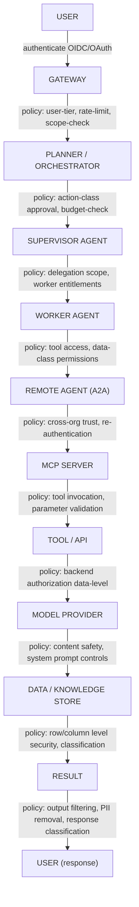
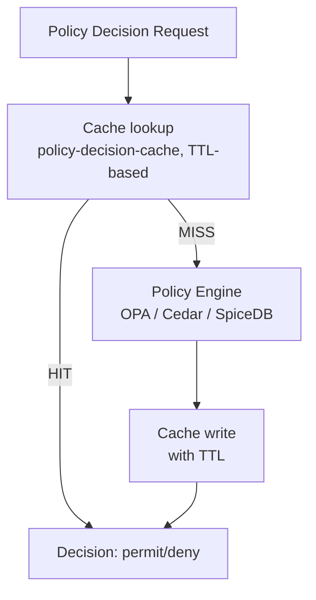
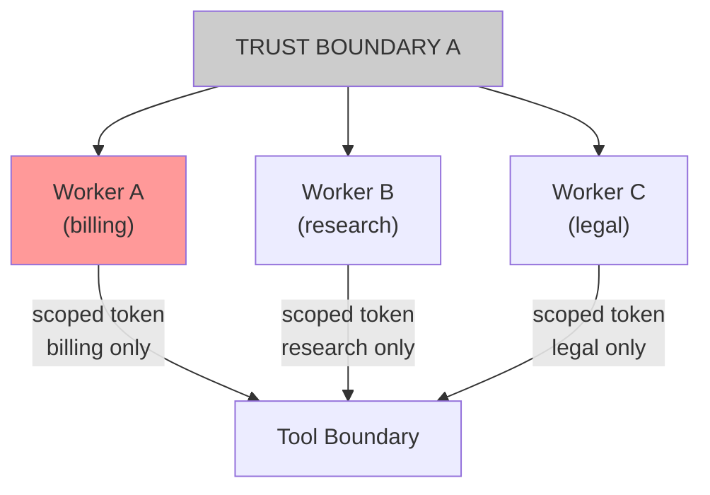
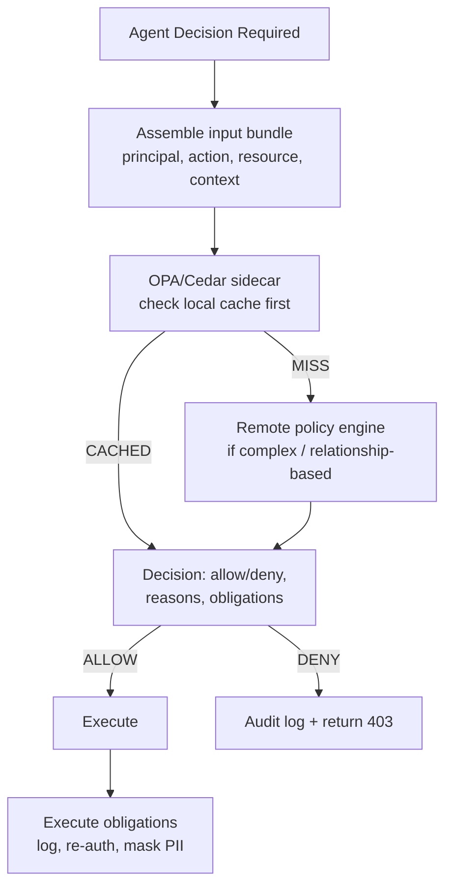

# Governance Propagation Chain for Multi-Agent Systems

Every action taken by any agent must be traceable back to an authorized human intent. This guide defines how authorization policy propagates from user intent through every layer of a multi-agent system to the model, tool, and data. It covers policy inheritance, intersection, delegation, conflict resolution, ABAC/RBAC/ReBAC, Cedar, OPA, and Zero Trust across agent boundaries.

---

## 1. The Governance Chain



**No layer is exempt.** Zero Trust applies: every transition is authenticated, every action is authorized, every decision is logged.

---

## 2. Policy Layers and Responsibilities

### 2.1 Gateway (Entry Point)

The Gateway is the first and broadest policy enforcement point. It enforces authentication (validates user identity via JWT/OIDC token, API key, session), authorization-at-entry (checks user role, subscription tier, IP allowlist, geographic restriction), rate limiting (per-user, per-tenant, per-model-class token budgets), scope restriction (user's requested scope vs. what their identity permits), and tenant isolation (multi-tenant routing; user's context never crosses to another tenant).

Technology: Kong AI Gateway, AWS AI Gateway, Azure API Management, custom NGINX/Envoy with OPA sidecar.

### 2.2 Planner / Orchestrator

The Planner creates an action plan. Before executing, it evaluates action-class policy (is the planned action class — read, write, execute, communicate, financial — permitted for this user in this context?), budget check (does the plan fit within the user's remaining token, cost, and time budget?), plan approval gate (does the plan complexity or risk score require HITL approval before execution?), and scope expansion detection (does the plan request permissions beyond what the user originally authorized?).

Policy language: Cedar (structured action-class authorization) or OPA.

### 2.3 Supervisor Agent

The Supervisor delegates work to worker agents. It enforces delegation scope (workers receive a **subset** of the supervisor's authorization — never the full supervisor scope), worker entitlement mapping (`worker-role → allowed-tools + allowed-data-classes`), time-bounded delegation (worker tokens expire; they cannot be reused after the task), and re-attestation (before each worker call, supervisor re-evaluates whether the delegation is still valid since context may have changed mid-plan).

### 2.4 Worker Agent

The Worker executes assigned sub-tasks. It enforces tool access control (only calls tools listed in its delegation token), data-class awareness (will not pass data classified above its permitted level to tools), no lateral movement (cannot call peer workers or acquire tokens for other workers), and local policy evaluation (before every tool call, evaluates whether the specific tool call including parameters is within scope).

### 2.5 Remote Agent (A2A)

When a worker calls a remote agent (cross-organization or cross-system via A2A), the following apply:

- **Re-authentication:** the remote agent receives a new token issued by the local authorization server, representing the original user's delegated identity — not the worker's internal token
- **Scope reduction:** cross-org scope is always a strict subset of the local scope (re-scoping at org boundary)
- **Trust verification:** remote agent's identity is verified via SPIFFE/SPIRE or A2A agent card and signature
- **Return-path policy:** the remote agent's response is classified before being returned to the worker; the worker cannot receive data at a classification level above its delegation

### 2.6 MCP Server

The MCP Server enforces tool-level authorization: checks whether the calling agent (identified by its workload identity) is permitted to call this specific tool, validates tool call parameters against schema to reject calls with parameters that could cause policy violations (e.g., SQL injection, path traversal, excessive scope), applies resource-level authorization within the tool (which rows, which files, which API endpoints), and classifies tool output data before returning to calling agent.

### 2.7 Model Provider

The Model Provider (Claude, GPT-4o, Gemini, Titan, etc.) enforces system prompt controls (the system prompt contains the agent's authorized instruction set; the model will not execute instructions that contradict it via constitutional safety), content safety filters (model-level output filtering for harmful content — applied independently of the calling agent's guardrails for defense in depth), and data egress controls (enterprise agreements may restrict what data categories can be sent to the model API).

Model providers are the last policy layer before generation. They are not the primary enforcement point — they are a defense-in-depth backstop. Primary enforcement must happen earlier in the chain.

### 2.8 Data / Knowledge Store

The data layer enforces row-level security (RLS): query results filtered to rows the calling agent's identity is permitted to see, column-level security (CLS): sensitive columns masked or excluded based on agent data-class clearance, classification labels: data returned is labeled with its classification for downstream filtering, and audit logging: every data access logged with caller identity, query, result count (not full results), timestamp.

---

## 3. Policy Inheritance Model

When authorization propagates down the chain, it follows a **strictly additive restriction** model:

> **Each layer may only restrict permissions. No layer may grant permissions that do not already exist at the layer above.**

```
Layer      Permissions (example)
──────     ─────────────────────────────────────────────
Gateway    {read, write, execute, financial:read}
              ↓ (subset only)
Planner    {read, execute}         ← financial:read dropped
              ↓ (subset only)
Supervisor {read, execute:research}  ← execute narrowed
              ↓ (subset only)
Worker A   {read}                  ← execute dropped
Worker B   {execute:research}      ← read dropped
              ↓ (subset only)
MCP Tool   {read:catalog}          ← scoped to specific resource
```

If any layer attempts to grant permissions above its own delegation level, the attempt must be rejected with an authorization error and logged as a security event.

---

## 4. Policy Types

### 4.1 RBAC (Role-Based Access Control)

Assign permissions to roles; assign roles to agents. Best for: well-defined agent roles with stable permission sets. Most enterprise systems start here.

### 4.2 ABAC (Attribute-Based Access Control)

Permissions computed from attributes of the principal, resource, action, and environment. Best for: dynamic contexts where role alone is insufficient (data classification, time-of-day restrictions, risk-based access).

### 4.3 ReBAC (Relationship-Based Access Control)

Permissions derived from graph relationships between entities. Best for: enterprise knowledge graphs, document management, social or organizational graphs. Implemented by: Google Zanzibar (SpiceDB, Permify, Ory Keto).

### 4.4 Policy Language Comparison

| Attribute | Cedar | OPA (Rego) | Zanzibar/SpiceDB |
|-----------|-------|-----------|-----------------|
| **Model** | ABAC/RBAC structured | General-purpose Rego | ReBAC graph |
| **Performance** | Sub-millisecond (compiled) | Milliseconds (interpreted) | Graph traversal |
| **Readability** | High (human-readable) | Medium (Rego learning curve) | Medium |
| **AWS native** | Yes (Verified Permissions) | Plugin | External |
| **Best for** | Action-class authorization | Complex rule logic | Graph relationships |

**Recommendation for multi-agent systems:**
- Cedar for agent-action-resource authorization (fast, readable, formally verifiable)
- OPA for complex gateway policies (flexible, language-agnostic)
- SpiceDB for organizational relationship checks (team membership, data ownership graphs)

---

## 5. Policy Conflict Resolution

When multiple policies apply to the same action, conflicts must be resolved deterministically.

### 5.1 Resolution Order

```
1. Explicit DENY always wins (deny overrides permit)
2. Most specific policy wins (worker-specific overrides role-based)
3. Lowest-permission wins (if ambiguous, choose the more restrictive)
4. Explicit documentation of conflict = mandatory audit log entry
```

### 5.2 Conflict Scenarios

| Scenario | Resolution |
|---------|-----------|
| Planner permits action X; Worker's delegation forbids action X | DENY (delegation restriction wins) |
| Gateway permits scope A; MCP tool allows scope B (B ⊃ A) | DENY scope B; permit only scope A |
| Policy Engine says permit; Constitutional AI filter says deny | DENY (safety layer wins) |
| Two applicable Cedar policies disagree | DENY (explicit deny overrides; if neither explicit, deny by default) |

---

## 6. Delegated Authorization

### 6.1 On-Behalf-Of (OBO) Flows

A key challenge in multi-agent systems: worker agents must act on behalf of the original human user, not on behalf of themselves. The delegated token **preserves the original user's identity** through the chain. Backend systems apply the user's permissions, not the agent's permissions. This is the OAuth 2.0 Token Exchange (RFC 8693) / OBO flow.

### 6.2 Agent-as-Principal vs. Agent-as-Delegate

| Mode | Agent Identity in Downstream | When to Use |
|------|----------------------------|------------|
| **Agent-as-Principal** | Backend sees agent identity | System-level automation with no human delegation (batch jobs, scheduled workflows) |
| **Agent-as-Delegate** | Backend sees user identity (OBO) | User-initiated tasks where user's data permissions should apply |
| **Dual-principal** | Backend sees both (agent and user) | Audit requires both; user permissions apply but agent identity is logged |

---

## 7. Policy Caching

### 7.1 Caching Rules

Policy decisions are expensive (network calls to OPA, Cedar, Zanzibar). Caching reduces latency but introduces staleness risk.

| Policy Type | Cache Duration | Cache Invalidation Trigger |
|-------------|---------------|--------------------------|
| RBAC role lookup | 5 minutes | Role assignment change |
| ABAC attribute | 60 seconds | Attribute change event |
| ReBAC relationship | 30 seconds | Relationship graph update |
| Deny list | 0 (never cache) | N/A — always real-time |
| Emergency policy override | 0 (never cache) | N/A — always real-time |

### 7.2 Cache Architecture



**Critical rule:** The emergency deny path (kill switch, suspension, compromised agent) must always bypass cache and hit the policy engine in real time.

---

## 8. Zero Trust Application to Multi-Agent Systems

### 8.1 Zero Trust Principles Applied

| Zero Trust Principle | Multi-Agent Implementation |
|---------------------|--------------------------|
| **Never trust, always verify** | Every agent-to-agent call requires authentication and authorization, even within the same system |
| **Least privilege** | Delegation tokens scope-constrained to minimum required permissions |
| **Assume breach** | Containment blast radius: a compromised worker cannot affect other workers or escalate |
| **Verify explicitly** | Authorization evaluated on every request (no ambient authority from previous calls) |
| **Use strong identity** | SPIFFE/SPIRE workload identity for agents; no long-lived shared credentials |

### 8.2 Agent Identity with SPIFFE/SPIRE

When an agent calls an MCP Server, it presents an SVID in a TLS client certificate. The MCP Server validates the SVID against the SPIRE trust bundle. OPA policy evaluates the `spiffe://...` identity against the tool allowlist.

### 8.3 Blast Radius Containment

Zero Trust contains the blast radius of a compromised agent:



Worker A compromised can only access billing. Cannot reach Worker B, Worker C, or their tools.

---

## 9. Policy Evaluation Architecture

### 9.1 Inline vs. Sidecar vs. Centralized

| Mode | Latency | Availability | Use Case |
|------|---------|-------------|---------|
| **Inline** (policy in-process) | ~0ms | High (no network) | Simple RBAC; not for complex policies |
| **Sidecar** (OPA/Cedar per agent) | ~1–5ms | Medium | Standard enterprise choice |
| **Centralized** (shared policy service) | ~5–20ms | Network-dependent | Complex policies requiring consistency |
| **Hybrid** (cache-backed sidecar) | ~1ms cached, ~5ms miss | High | Recommended for production |

### 9.2 Production-Grade Policy Evaluation Flow



---

## 10. Governance Propagation Checklist

For each production multi-agent system, verify:

- [ ] Every agent has a unique workload identity (SPIFFE SVID or equivalent)
- [ ] Every agent-to-agent call is authenticated (no ambient authority)
- [ ] Delegation tokens are always narrower than the delegating agent's scope
- [ ] Policy is evaluated at: Gateway, Planner, Supervisor, every MCP tool call, and the data layer
- [ ] Deny list checks are never cached; always real-time
- [ ] Emergency policy overrides (kill switch) propagate in &lt; 30 seconds to all active agents
- [ ] Authorization decisions include audit metadata: `{decision, policy_id, principal, action, resource, timestamp}`
- [ ] Cross-org (A2A) calls always re-authenticate; the remote org issues its own scoped token
- [ ] Policy conflicts are logged as security events (not silently resolved)
- [ ] HITL approval is required for any action that grants permissions not present at the Gateway layer
- [ ] Policy bundles are versioned and change-managed (policy updates are breaking changes)
- [ ] Relationship graph (ReBAC) has a staleness SLA &lt; 60 seconds

---

## Related

- [Policy and Authorization Series](pathname:///archon/trust/ai-security-governance/policy-authorization-series-overview) — policy content and AWS/Entra implementation
- [Auth and Identity Hub](pathname:///archon/protocols/auth-identity-flows) — OIDC, OAuth, OBO flows, Entra, SPIFFE
- [Agentic AI Security and Identity](pathname:///archon/trust/agentic-ai-security-identity) — SPIFFE/SPIRE, OWASP ASI01–ASI10
- [Multi-Agent Topology Patterns](pathname:///archon/architecture/multi-agent-topology-patterns) — who calls whom (topology)
- [End-to-End Traceability Guide](pathname:///archon/architecture/end-to-end-traceability-guide) — how authorization decisions are traced
- [Kill Switch Architecture](56-kill-switch-architecture.md) — emergency policy override propagation
- [DeepMind AI Authorization](pathname:///archon/trust/ai-security-governance/ai-authorization) — authorization in depth

## Sources

