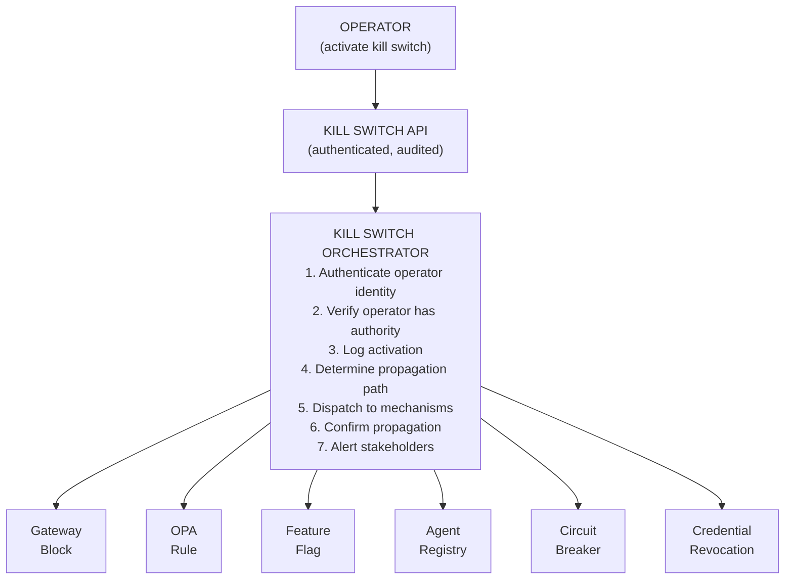
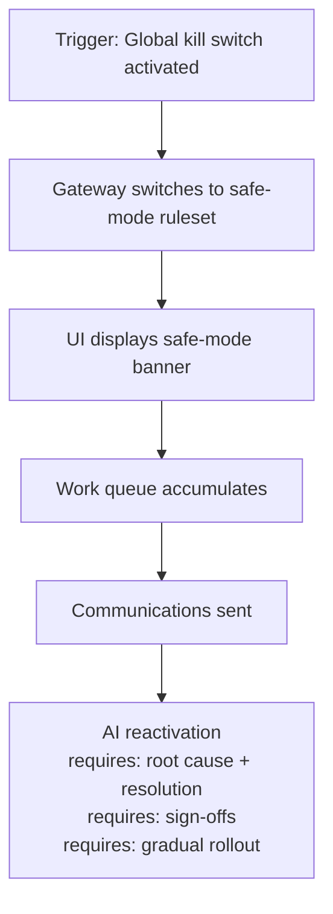
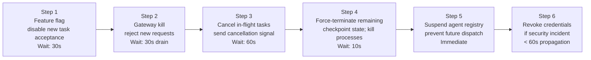
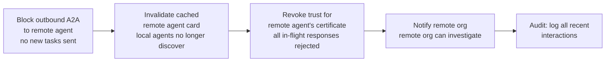
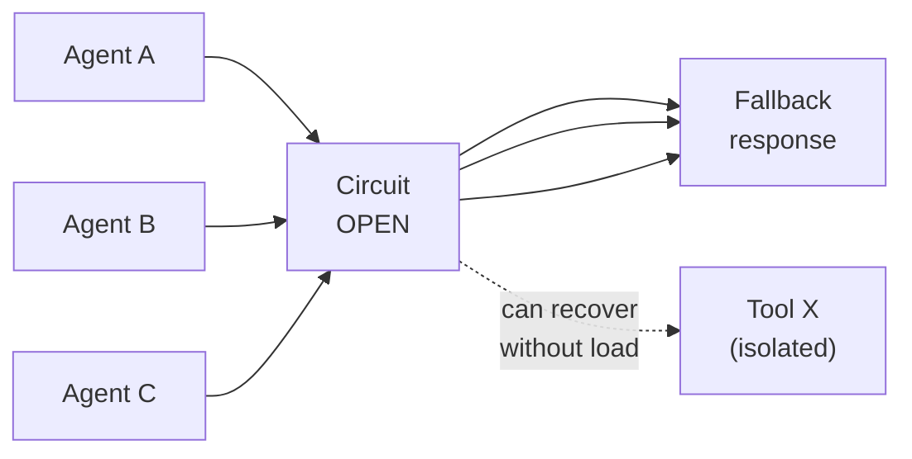

# Kill Switch Architecture for Multi-Agent AI Systems

Kill switches are not an afterthought — they are a fundamental trust mechanism. Regulators, enterprise risk teams, and users must have confidence that **any agent can be stopped immediately**, regardless of what it is doing, without requiring a code deployment or infrastructure change. The EU AI Act Article 9 (risk management) requires high-risk AI systems to include "appropriate human oversight measures" including the ability to halt the system.

This guide defines the complete kill switch architecture for enterprise multi-agent AI systems — covering global, scoped, and progressive shutdown mechanisms; safe mode; circuit isolation; feature flags; emergency policy override; and the governance model for who can activate each level.

---

## 1. Kill Switch Taxonomy

### 1.1 Scope Levels

| Level | Scope | Propagation Time Target | Who Can Activate |
|-------|-------|------------------------|-----------------|
| **Global kill** | All AI agents in the enterprise | &lt; 30 seconds | CISO, CTO, On-call incident commander |
| **Platform kill** | All agents on a specific platform/region | &lt; 30 seconds | Platform Team Lead, On-call SRE |
| **Tenant kill** | All agents for a specific tenant/customer | &lt; 60 seconds | Tenant Admin, Platform Team |
| **Agent kill** | A specific named agent | &lt; 30 seconds | Platform Team, On-call SRE |
| **Tool kill** | A specific tool/MCP server across all agents | &lt; 30 seconds | Platform Team, Tool Owner |
| **Workflow kill** | A specific workflow run | &lt; 30 seconds | Platform Team, Workflow Owner |
| **Model kill** | All calls to a specific model provider or model ID | &lt; 60 seconds | Platform Team Lead |
| **Memory disable** | Disable long-term memory read/write for specified agents | &lt; 60 seconds | Platform Team, AI Governance |
| **Retrieval disable** | Disable RAG retrieval for specified agents | &lt; 60 seconds | Platform Team, AI Governance |
| **Remote agent isolation** | Block all A2A calls to/from a specific remote agent | &lt; 30 seconds | Security Team, Platform Team |

### 1.2 Mechanism Types

| Mechanism | How It Works | Propagation Speed | Use Case |
|----------|-------------|------------------|---------|
| **Feature flag** (real-time) | Centralized flag service; agents poll every 5s or use long-poll | 5–30 seconds | Planned disablement; graduated rollout |
| **Policy override** | Emergency deny rule pushed to all OPA/Cedar instances | &lt; 30 seconds | Security incident; unauthorized behavior |
| **Gateway block** | Gateway rejects all requests for the target scope | &lt; 5 seconds | Immediate containment; easiest to activate |
| **Circuit breaker open** | Circuit breaker forced-open programmatically | &lt; 5 seconds | Provider failure; quality failure |
| **Capability suspension** | Agent registry marks agent as suspended; all calls refused | &lt; 30 seconds | Agent misbehavior; compliance hold |
| **Credential revocation** | Agent's workload certificate / token revoked | &lt; 60 seconds (OCSP/CRL propagation) | Compromised agent identity |
| **Process termination** | Kill the agent process directly | Immediate | Last resort; may leave state inconsistent |

---

## 2. Kill Switch Architecture

### 2.1 Control Plane



### 2.2 Feature Flag Kill Switch

Feature flags provide the most controllable kill switch — graduated, reversible, audited. Kill Switch Flag Store contains:

- Global: `ai.agents.enabled = false`
- Platform: `ai.platform.us-east-1.enabled = false`
- Agent: `ai.agent.billing-agent.enabled = false`
- Tool: `ai.tool.funds-transfer.enabled = false`
- Model: `ai.model.claude-opus.enabled = false`
- Tenant: `ai.tenant.acme-corp.enabled = false`

Agents must poll kill switch flags at intervals &lt;= 5 seconds (real-time). Long-running agents must check the kill switch flag at every step boundary, not just at invocation start.

### 2.3 Gateway-Level Kill Switch

The gateway is the fastest and most reliable kill switch for inbound traffic. All new requests to a suspended agent are rejected immediately with HTTP 503. In-flight requests are completed (drain period) or killed (hard stop) depending on incident type.

**Drain vs. hard stop choice:**
- **Drain** (allow in-flight requests to complete): use for non-security incidents where graceful completion is preferred
- **Hard stop** (kill in-flight immediately): use for security incidents (prompt injection, data exfiltration in progress)

### 2.4 Policy Override Kill Switch

For scenarios where the agent bypassed the gateway (internal calls, scheduled tasks), an emergency policy rule (OPA / Cedar) provides another layer. This rule takes precedence over all permit rules and must be propagated to all OPA instances in &lt; 30 seconds.

### 2.5 Capability Suspension in Agent Registry

Suspending an agent in the central registry prevents new dispatches. All components that dispatch work to agents (Planner, Supervisor, A2A gateway) must check agent registry status before dispatching. A suspended agent receives no new tasks.

---

## 3. Safe Mode

Safe mode is a degraded operating state that maintains basic functionality while disabling AI-powered features. It is activated when AI systems must be suspended but the underlying service must remain available.

```
NORMAL MODE                    SAFE MODE
────────────────────────────────────────────────
Agent answers questions         Fallback to knowledge base search
Agent routes to specialist      Fixed routing rules (no ML)
Agent drafts emails             Email drafting disabled
Agent processes claims          Claims queued for human review
Agent monitors for anomalies    Rule-based alerting only
Agent interprets contracts      Contract review routed to legal team
```

### Safe Mode Activation Playbook



---

## 4. Progressive Shutdown

Progressive shutdown reduces blast radius by stopping in a controlled sequence.



For **security incidents** (compromised agent, active data exfiltration), skip Steps 1–4 and go directly to Steps 5–6 and gateway hard block.

---

## 5. Remote Agent Isolation (A2A)

When a remote agent (connected via A2A) is suspected of malicious behavior or has been compromised:



---

## 6. Circuit Isolation

Circuit isolation prevents a failing component from cascading failures to other components.

Normal state: Agent A, B, C call Tool X (circuit: CLOSED).

Tool X starts failing (&gt; 50% error rate): Circuit isolation activates.



After 60 seconds, a half-open probe sends a single call to test recovery.

### Isolation Scope Matrix

| Failing Component | What Gets Isolated | Fallback |
|------------------|-------------------|---------|
| Model provider (Claude) | All calls to that provider | Fallback to alternate provider |
| Vector store | All RAG retrieval | Direct context (no retrieval) |
| MCP server | That server's tools | Disable tools; agent works without them |
| Policy engine | Policy enforcement | Default-deny until engine recovers |
| Memory service | Long-term memory access | Session memory only |
| Remote agent | That A2A connection | Local agent handles task (degraded quality) |

---

## 7. Emergency Policy Override

During a security incident, the normal policy evaluation may need to be bypassed for an emergency override.

### 7.1 Emergency Deny Override

Supersedes all existing permit policies for the duration of the incident. Auto-expiry is mandatory: Emergency overrides must auto-expire. Indefinite emergency overrides become permanent policy by default, which is a governance failure. Default TTL: 2 hours; renewal requires explicit re-authorization.

### 7.2 Human Approval Override

For actions that were previously automated, require human approval for the duration of the incident. Under emergency conditions, high-risk actions are routed to HITL queue, and critical actions require CISO sign-off. Automated financial actions are suspended; queued for treasury team review.

---

## 8. Governance Model

### 8.1 Authority Matrix

| Kill Switch Level | Minimum Authority | CISO Must Approve? | Time Limit |
|------------------|------------------|-------------------|-----------|
| Global kill | CISO or CTO | Yes (or is activating) | 2 hours; review required |
| Platform kill | Platform Team Lead | No (notify within 15 min) | 4 hours |
| Tenant kill | Tenant Admin or Platform Team | No (notify within 30 min) | 8 hours |
| Agent kill | On-call SRE | No (notify within 30 min) | 24 hours |
| Tool kill | Tool Owner or On-call SRE | No | 24 hours |
| Model kill | Platform Team Lead | No (notify within 1 hour) | 8 hours |
| Memory disable | Platform Team or AI Governance | No | 24 hours |
| Remote agent isolation | Security Team or On-call SRE | If cross-org: yes | 24 hours |

### 8.2 Audit Requirements

Every kill switch activation must produce a mandatory audit record. The record includes: event_type, event_id, timestamp, scope, target, level, activated_by (identity, authentication_method, ip_address), reason, incident_id, propagation_confirmed_at, propagation_time_seconds, sla_met, notifications_sent, auto_expires_at.

### 8.3 Reactivation Protocol

Reactivation requires explicit process, not just removing the kill switch:

1. Root cause documented (incident ticket)
2. Mitigation implemented (code fix, policy update, or containment measure)
3. Testing completed (eval suite passing; chaos test of the specific failure scenario)
4. Sign-off obtained
5. Canary reactivation: 5% of traffic → monitor for 30 min
6. Full reactivation if canary passes
7. Post-mortem completed within 24 hours of reactivation

---

## 9. Kill Switch Testing

Kill switches that are never tested will fail when needed. Test on a quarterly schedule:

| Test | What It Validates | How Often |
|------|------------------|-----------|
| **Feature flag propagation** | Flag change propagates to all agents in &lt; 30s | Monthly |
| **Gateway block** | New requests blocked within 5s; in-flight drained within 60s | Monthly |
| **Policy override** | Emergency deny propagates to all OPA instances in &lt; 30s | Quarterly |
| **Agent registry suspension** | Suspended agent receives no new dispatches | Monthly |
| **Safe mode switchover** | Safe mode activates within 60s of activation | Quarterly |
| **Progressive shutdown** | Full progressive shutdown completes in &lt; 5 minutes | Quarterly |
| **Remote agent isolation** | A2A calls to isolated remote agent fail in &lt; 30s | Quarterly |
| **Reactivation process** | Reactivation flow can be completed in &lt; 2 hours from approval | Quarterly |

Test results are logged and reviewed by AI Governance. Tests are not optional — untested kill switches are not kill switches.

---

## 10. Kill Switch Runbook

### 10.1 Security Incident (Compromised Agent)

```
TRIGGER: Agent exhibiting anomalous behavior (prompt injection, data exfiltration)

T+0:00  On-call SRE detects anomaly via AI SOC alert
T+0:02  Confirm: is this a genuine compromise? (check causal trace)
T+0:05  Activate agent kill switch (gateway hard block + policy override)
T+0:06  Confirm kill switch propagation (< 30s SLA)
T+0:07  Notify CISO + Platform Lead
T+0:10  Preserve forensic state (snapshot agent state, recent trace data)
T+0:15  Identify blast radius (what data accessed? what actions taken?)
T+0:30  Notify affected tenants/users if data accessed
T+1:00  Incident Review begins (root cause)
T+4:00  Mitigation implemented
T+4:30  CISO reviews reactivation request
T+5:00  Canary reactivation (5% traffic)
T+5:30  Full reactivation (if canary clean)
T+24h   Post-mortem published
```

### 10.2 Quality Degradation (Agent Producing Wrong Outputs)

```
TRIGGER: Judge pass rate drops below 70% (automated alert)

T+0:00  Alert fires on AI SOC dashboard
T+0:05  On-call SRE investigates (is it agent? model? prompt?)
T+0:10  Activate agent kill switch (feature flag first; gradual)
T+0:15  Notify Platform Lead + AI Governance
T+0:30  Root cause investigation begins
T+1:00  Mitigation: fix identified (prompt rollback? model pin? code fix?)
T+2:00  Fix deployed to canary
T+2:30  Canary eval suite passes
T+3:00  Canary reactivation (5% → 20% → 100% over 30 min)
T+4:00  Platform Lead signs off on full reactivation
T+24h   Post-mortem published
```

---

## Related

- [Agentic AI Reliability, Observability and Governance](43-agentic-ai-reliability-observability-governance.md) — circuit breaker and kill switch patterns
- [Agent Reliability Engineering](42-agent-reliability-engineering.md) — chaos testing kill switches; incident runbooks
- [Governance Propagation Chain](55-governance-propagation-chain.md) — emergency policy override architecture
- [End-to-End Traceability Guide](pathname:///archon/architecture/end-to-end-traceability-guide) — forensic investigation after kill switch activation
- [Drift Detection Guide](45-drift-detection-guide.md) — detecting quality degradation that triggers kill switches
- [AIDR: AI Detection and Response](pathname:///archon/trust/ai-security-governance/aidr-ai-detection-response-complete-guide) — SOC response when kill switch is triggered
- [AI SOC](pathname:///archon/trust/ai-security-governance/ai-soc) — AI security operations
- [AI TRiSM Complete Guide](pathname:///archon/trust/ai-security-governance/ai-trism-complete-guide) — trust, risk, and security management

## Sources

