# Multi-Agent Topology Patterns

**Audience:** AI architects, platform engineers, and senior engineers designing multi-agent systems.

**Purpose:** Canonical taxonomy of 16 multi-agent topology patterns. For each pattern: what problem it solves, architecture diagram, lifecycle, state management, communication model, governance requirements, failure modes, enterprise suitability score, and anti-patterns to avoid.

**Scope:** Topology — how agents are arranged and how they coordinate. For protocol specifics, see [MCP Deep Research](pathname:///archon/protocols/mcp-deep-research-2026) and [A2A Security & Governance](pathname:///archon/trust/a2a-security-governance). For runtime reliability (retries, circuit breakers, checkpointing), see [Agentic AI Reliability, Observability & Governance](pathname:///archon/architecture/agentic-ai-reliability-observability-governance). For agent selection (when to use which), see [Workflow Orchestration Decision Matrix](pathname:///archon/architecture/workflow-orchestration-decision-matrix). For agent tooling patterns, see [Agent-as-Tool Composition](pathname:///archon/architecture/agent-as-tool-composition).

---

## Pattern Catalog

| # | Pattern | Core Idea | Enterprise Suitability |
|---|---------|-----------|----------------------|
| 1 | [Supervisor-Worker](#1-supervisor-worker) | Single supervisor delegates to specialist workers | ★★★★★ |
| 2 | [Router](#2-router) | Classifier routes tasks to specialized agents | ★★★★★ |
| 3 | [Planner-Executor](#3-planner-executor) | Planner decomposes goals; executors run steps | ★★★★☆ |
| 4 | [Manager-Worker Pool](#4-manager-worker-pool) | Manager allocates work units to dynamic worker pool | ★★★★☆ |
| 5 | [Blackboard](#5-blackboard) | Shared state board; agents post and consume knowledge | ★★★☆☆ |
| 6 | [Pipeline / Chain](#6-pipeline--chain) | Linear sequence; each agent transforms and passes | ★★★★★ |
| 7 | [Parallel Fan-Out](#7-parallel-fan-out) | Coordinator fans tasks out; aggregates results | ★★★★★ |
| 8 | [Mesh](#8-mesh) | Agents discover and call each other as peers | ★★★☆☆ |
| 9 | [Swarm](#9-swarm) | Emergent behaviour from many simple agents, no central coordinator | ★★☆☆☆ |
| 10 | [Committee / Ensemble](#10-committee--ensemble) | Multiple agents produce outputs; aggregator decides | ★★★★☆ |
| 11 | [Debate / Adversarial](#11-debate--adversarial) | Agents argue opposing positions; arbiter decides | ★★★☆☆ |
| 12 | [Voting / Consensus](#12-voting--consensus) | Multiple agents vote; majority or quorum wins | ★★★☆☆ |
| 13 | [Recursive / Self-Spawning](#13-recursive--self-spawning) | Agent spawns sub-agents for sub-problems | ★★★☆☆ |
| 14 | [Reflection](#14-reflection) | Agent critiques its own output in a self-correction loop | ★★★★☆ |
| 15 | [Judge / Critic](#15-judge--critic) | Separate judge agent scores another agent's output | ★★★★★ |
| 16 | [Human-in-the-Loop (HITL) Hybrid](#16-human-in-the-loop-hitl-hybrid) | Human approval gate embedded in agent workflow | ★★★★★ |

---

## 1. Supervisor-Worker

### Problem

A complex task has multiple parallel or sequential sub-tasks requiring specialist agents. No single agent can handle the full breadth. A coordinating intelligence must delegate, monitor, and synthesise.

### Architecture

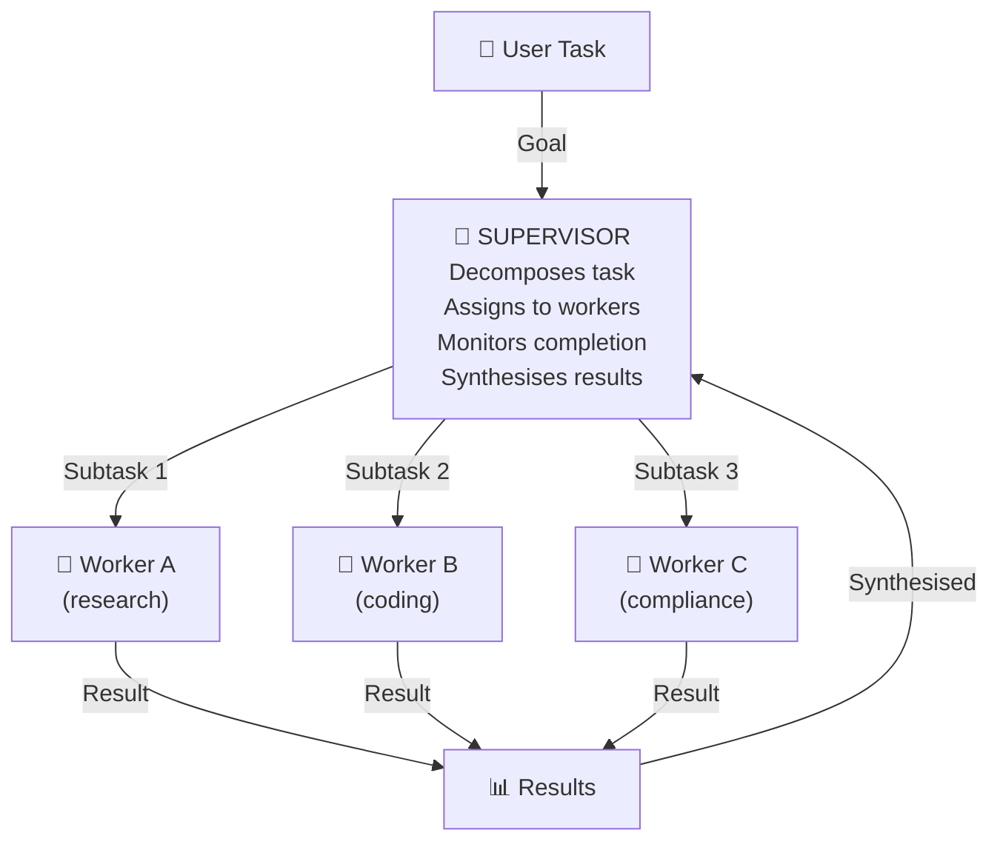

Supervisor-Worker topology: a supervisor decomposes complex tasks into specialist sub-tasks and coordinates their execution.

### Lifecycle

1. Supervisor receives goal; invokes planning model to decompose into sub-tasks
2. Each sub-task is dispatched to the matching worker (via tool call or A2A task)
3. Supervisor tracks completion state per worker (success / fail / timeout)
4. On all-complete: supervisor synthesises; on partial failure: retry / escalate / degrade
5. Final response returned to user

### State Management

- Supervisor owns task-plan state (sub-task list, assignment map, completion status)
- Workers are typically stateless; supervisor holds the envelope
- Use a durable workflow engine (Temporal, Step Functions) for plans exceeding a single context window

### Communication

- Supervisor → Worker: tool call (same process) or A2A `tasks/send` (remote agent)
- Worker → Supervisor: tool return or A2A task update
- No worker-to-worker direct communication (all mediated by supervisor)

### Governance

- Supervisor inherits the user's authorization context; re-attests before each worker call
- Worker tokens are scoped to their specialisation (no cross-worker privilege)
- Supervisor logs every delegation, assignment, and result for audit trail
- Policy Engine evaluated at supervisor layer before any delegated action

### Failure Modes

| Failure | Behaviour | Resolution |
|---------|-----------|------------|
| Worker timeout | Supervisor marks sub-task failed; retries up to budget | If budget exhausted: graceful degradation (omit sub-task) or HITL |
| Supervisor crash | Plan state lost if not durable | Checkpoint plan state after each assignment |
| Worker hallucination cascades | Supervisor accepts bad sub-output as fact | Verification gate: supervisor validates worker output schema/grounding |
| Worker exceeds scope | Worker calls tools outside its charter | Scoped tool registry per worker role |
| Supervisor context overflow | Plan state + all worker results overflow context | Summarise completed sub-tasks; store verbatim in memory service |

### Enterprise Suitability ★★★★★

Best pattern for most enterprise use cases. Clear governance hierarchy, predictable delegation, auditability. Used by: financial research agents (researcher/analyst/compliance workers), customer-service orchestration (triage/billing/technical workers), code review agents (security/style/test workers).

### Anti-Patterns

- **Fat supervisor**: supervisor writes code, calls APIs directly, synthesises, and presents — doing 5 jobs leads to context overload and unauditable decisions
- **Implicit worker trust**: supervisor assumes worker output is correct without verification; one hallucinating worker corrupts the whole synthesis
- **Unscoped worker tokens**: workers receive the user's full token set rather than narrow role-scoped credentials

---

## 2. Router

### Problem

A single entry point receives diverse task types. Routing to the correct specialist agent improves quality and reduces cost versus sending all queries to a general-purpose agent.

### Architecture

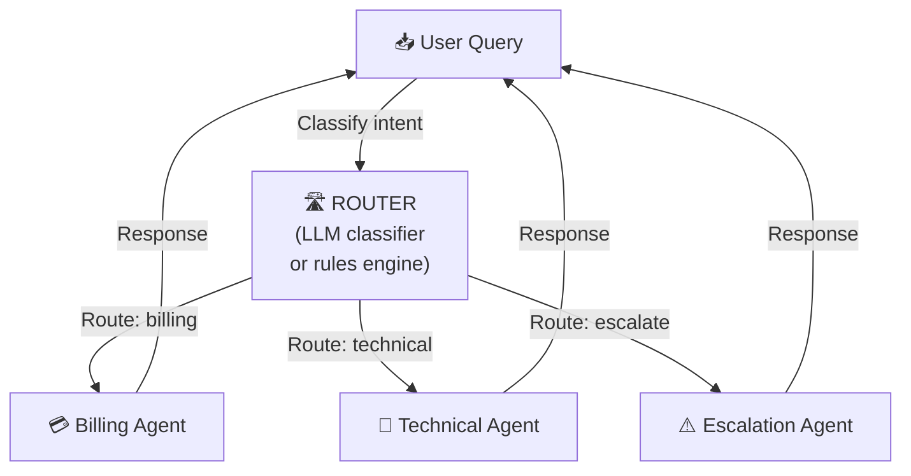

Router topology: a single entry point classifies incoming queries and routes to specialized agents.

### Lifecycle

1. Router receives query; classifies intent (via model, embeddings, or rule engine)
2. Confidence score computed; low-confidence triggers fallback to general agent or HITL
3. Selected agent receives full context and produces response
4. Response returned; router optionally validates response type matches route

### State Management

- Router is stateless; agents may be stateful or stateless
- Route decisions logged for drift detection (routing accuracy tracked over time)

### Communication

- Router → Agent: direct invocation or MCP tool call
- No agent-to-agent communication; all paths through router
- Router maintains a **routing registry** (agent capabilities, confidence thresholds)

### Governance

- Router is the first policy enforcement point: can deny routing to sensitive agents based on user tier/role
- Route selection logged with classification confidence for explainability
- Routing rules versioned and change-managed (router drift is a critical failure mode)

### Failure Modes

| Failure | Behaviour | Resolution |
|---------|-----------|------------|
| Misclassification | Wrong agent handles query | Feedback loop; human corrections update classifier training |
| Agent unavailable | Router has no live target | Fallback route; queue if recoverable |
| Routing loop | Agent re-routes back through router | Loop detection: max 2 re-routes; then escalate |
| Routing drift | Classifier degrades over time | Automated accuracy monitoring; alert at &lt;90% |

### Enterprise Suitability ★★★★★

Ideal for: customer service (triage), multi-domain chatbots, API gateways in front of agent pools. The simplest multi-agent topology to govern and audit.

### Anti-Patterns

- **Mega-general agent as fallback**: the fallback handles everything the router can't classify — over time the fallback becomes the only agent used
- **Silent misroute**: router routes with no explanation; impossible to debug or improve

---

## 3. Planner-Executor

### Problem

A complex goal requires dynamic decomposition into a plan, where each step's execution informs subsequent steps. The plan itself may evolve as new information arrives.

### Architecture

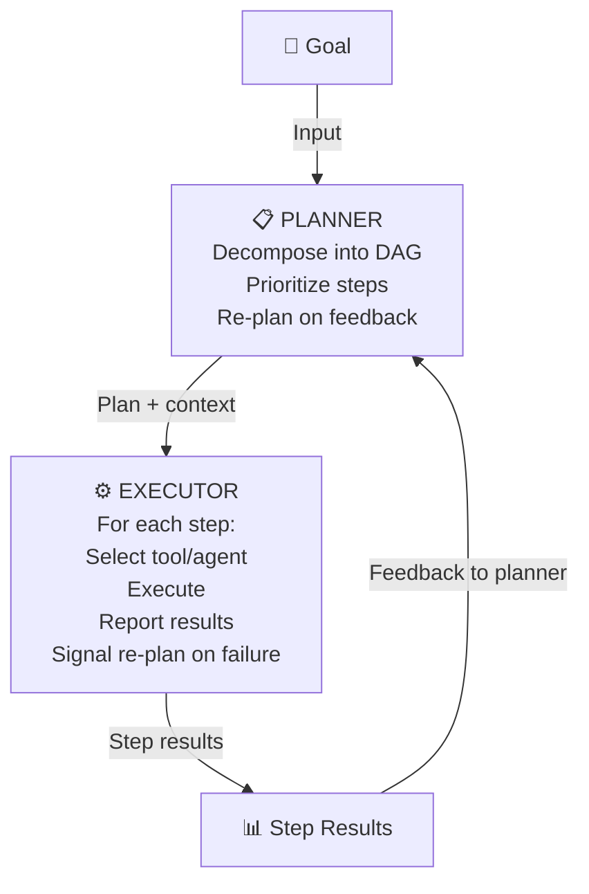

Planner-Executor topology: a planner decomposes goals into a DAG of steps; executor runs them with feedback-driven re-planning.

### State Management

- Plan state (DAG) is the critical shared state; must survive planner restarts
- Executor maintains step-execution state (current step, results, failures)
- Use durable execution (Temporal workflows, LangGraph with checkpointer) — without this, a crash loses the plan

### Communication

- Planner → Executor: plan document (JSON DAG) with step specifications
- Executor → Planner: step result + status; failure reports trigger re-plan
- Re-plan is a new invocation of the planner model with updated context

### Governance

- Plan approval gate for high-risk plans (HITL before first executor step)
- Planner decisions logged: "chose to decompose into X steps because Y" (explainability)
- Executor cannot proceed to next step without planner acknowledgement (step-gate option)
- Budget limits on plan depth (max steps) and plan changes (max re-plans)

### Failure Modes

| Failure | Behaviour | Resolution |
|---------|-----------|------------|
| Infinite re-plan loop | Failure → re-plan → fail → re-plan | Max re-plan budget (3–5); then HITL |
| Scope creep | Re-planner adds new steps beyond original goal | Plan scope validator before any re-plan acceptance |
| Stale plan | Plan created with outdated context | Context refresh before each executor step |
| Planner hallucination | Plan contains invalid steps | Syntactic plan validation; step dry-run before execution |

### Enterprise Suitability ★★★★☆

Excellent for: autonomous research assistants, document-processing workflows, software development agents. Requires durable execution infrastructure; not suitable for simple request-response.

---

## 4. Manager-Worker Pool

### Problem

Large volumes of uniform tasks need processing at scale. A manager allocates work units from a queue to a pool of interchangeable workers, handling backpressure and worker failure.

### Architecture

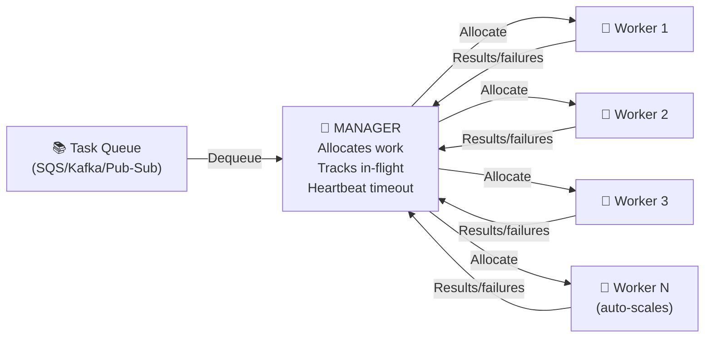

Manager-Worker Pool topology: a manager allocates uniform work units to a pool of interchangeable workers.

### Key Differences from Supervisor-Worker

- Workers are **fungible** (any worker can handle any work unit); supervisors have specialist workers
- Scale is the primary concern (10s–1000s of concurrent workers)
- Work units are pre-enumerated in a queue; supervisor patterns have dynamic task creation

### State Management

- Work queue is the authoritative state (hosted on SQS, Kafka, Pub/Sub, Temporal task queue)
- Manager tracks in-flight assignments; heartbeat-based timeouts detect dead workers
- Workers are stateless; no cross-worker state sharing

### Governance

- Manager enforces per-tenant work quotas (fairness, isolation)
- Each work unit carries authorization context from originating user
- Dead-letter queue for failed work units (audit trail + retry governance)

### Enterprise Suitability ★★★★☆

Best for: document ingestion pipelines, batch evaluation runs, large-scale data extraction. Requires queue infrastructure; overkill for small task volumes.

---

## 5. Blackboard

### Problem

Multiple specialist agents contribute partial knowledge towards a solution that no single agent can compute alone. Agents read and write to a shared knowledge structure asynchronously.

### Architecture

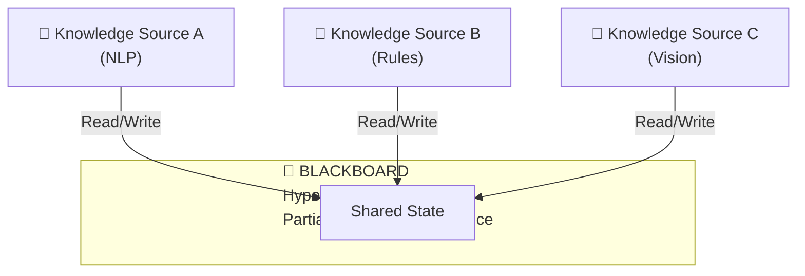

Blackboard topology: multiple knowledge sources read and write to a shared state, building up a solution incrementally.

### When to Use

- Medical diagnosis (imaging KS + lab KS + symptom KS + history KS → shared hypothesis board)
- Fraud detection (rule KS + behaviour KS + network KS → shared risk board)
- Complex document analysis (structure KS + content KS + entity KS → shared knowledge graph)

### State Management

- Blackboard is the critical shared state; typically a vector store + structured DB hybrid
- Optimistic concurrency or versioned writes to handle simultaneous KS writes
- Control component monitors blackboard state and decides which KS to activate next

### Governance

- Write permissions scoped per knowledge source (KS-A cannot overwrite KS-B contributions)
- Blackboard change log for audit trail
- Quorum requirement before hypothesis is "accepted" (at least N KS must agree)

### Failure Modes

- **Write conflicts**: two KS post contradictory evidence → conflict resolution protocol required
- **Stale reads**: KS reads outdated state → versioned reads with staleness window
- **Runaway hypothesis space**: blackboard fills with low-quality hypotheses → pruning agent or confidence threshold

### Enterprise Suitability ★★★☆☆

Specialized use cases (scientific research, intelligence analysis, medical). Operationally complex; avoid for standard enterprise use cases where Supervisor-Worker or Pipeline suffices.

---

## 6. Pipeline / Chain

### Problem

A task requires sequential transformation stages, where each stage's output becomes the next stage's input. Stage dependencies are linear and well-defined.

### Architecture

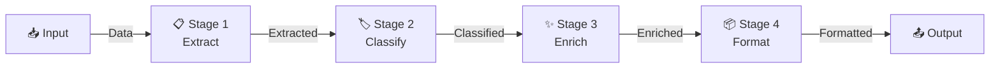

Pipeline/Chain topology: sequential transformation stages with linear dependencies.

### State Management

- Each stage receives the previous stage's output as its full context
- Pipeline controller tracks which stage is in progress
- Idempotency: each stage must be safe to retry without side effects

### Governance

- Policy checks at stage boundaries (not just at input): each stage is a policy enforcement point
- Output schema validation between stages: stage N+1 refuses malformed input from stage N
- Pipeline configuration versioned (adding/removing stages is a breaking change)

### Enterprise Suitability ★★★★★

Excellent fit for: document processing, ETL with AI enrichment, content moderation (extract → classify → flag → route), structured data generation. Easiest topology to test, debug, and govern.

---

## 7. Parallel Fan-Out

### Problem

A task can be decomposed into independent sub-tasks that can execute concurrently. Sequential execution is too slow; parallel execution dramatically reduces end-to-end latency.

### Architecture

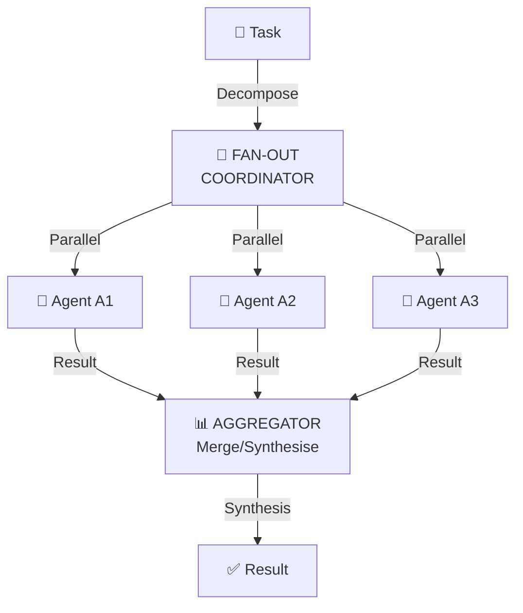

Parallel Fan-Out topology: coordinator fans tasks out to concurrent agents and aggregates results.

### Key Controls

- **Retry budget coordination**: each sub-agent has an independent retry budget, but the coordinator enforces a global retry cap to prevent fan-out storm (10× amplification risk)
- **Partial failure handling**: decide upfront — fail-all, best-effort, or minimum-N-of-M
- **Result deduplication**: parallel agents may retrieve the same content; dedup before synthesis

### Enterprise Suitability ★★★★★

Excellent for: multi-source research, parallel document comparison, multi-region query, A/B evaluation. Must be paired with retry-budget coordination.

---

## 8. Mesh

### Problem

Agents have peer-to-peer relationships and may discover and call each other directly without a central coordinator. Flexibility is the primary goal.

### Architecture

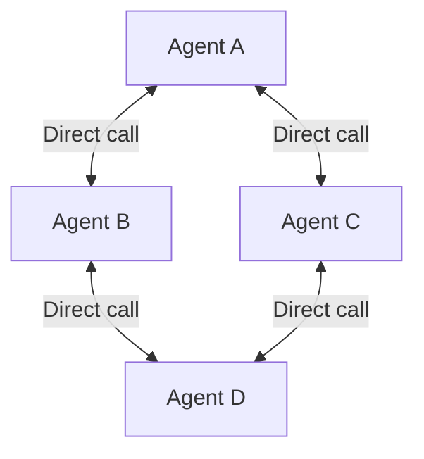

Mesh topology: agents communicate peer-to-peer without a central coordinator.

### Governance Challenges

- No single policy enforcement point: every agent-to-agent edge is a trust boundary
- Authorization must be evaluated at every call (SPIFFE workload identity + OPA/Cedar at each edge)
- Audit trail requires distributed tracing across all edges (W3C trace context mandatory)
- Cycles are possible: agent A calls B which calls A — loop detection required at each agent

### When to Use (sparingly)

- Only when the coordination graph cannot be known at design time (dynamic agent discovery)
- Internal micro-service mesh where agents are well-governed microservices with strong identity

### Enterprise Suitability ★★★☆☆

High operational complexity; avoid for most enterprise use cases. If you need flexibility, use a Router or Supervisor instead. Mesh is appropriate only when the number of agents is large, identity is strong (SPIFFE), and telemetry is complete.

---

## 9. Swarm

### Problem

A large number of simple agents collectively solve a problem through local interactions and emergent behavior. No central coordinator; behavior emerges from the aggregate.

### Architecture

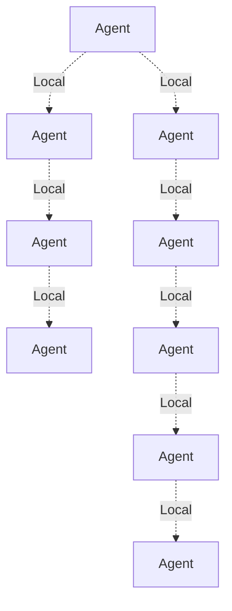

Swarm topology: many simple agents interact locally; emergent behavior arises from the aggregate.

### Enterprise Suitability ★★☆☆☆

Currently a research topology. Difficult to govern, audit, or explain. Emergent behavior means no single audit trail, no clear policy enforcement point. Not recommended for production enterprise systems in 2026. Monitor for maturity; may become viable as agent identity and distributed tracing standards mature.

---

## 10. Committee / Ensemble

### Problem

A single agent's output may be unreliable for high-stakes decisions. Multiple independent agents produce outputs; an aggregator picks or synthesises the best.

### Architecture

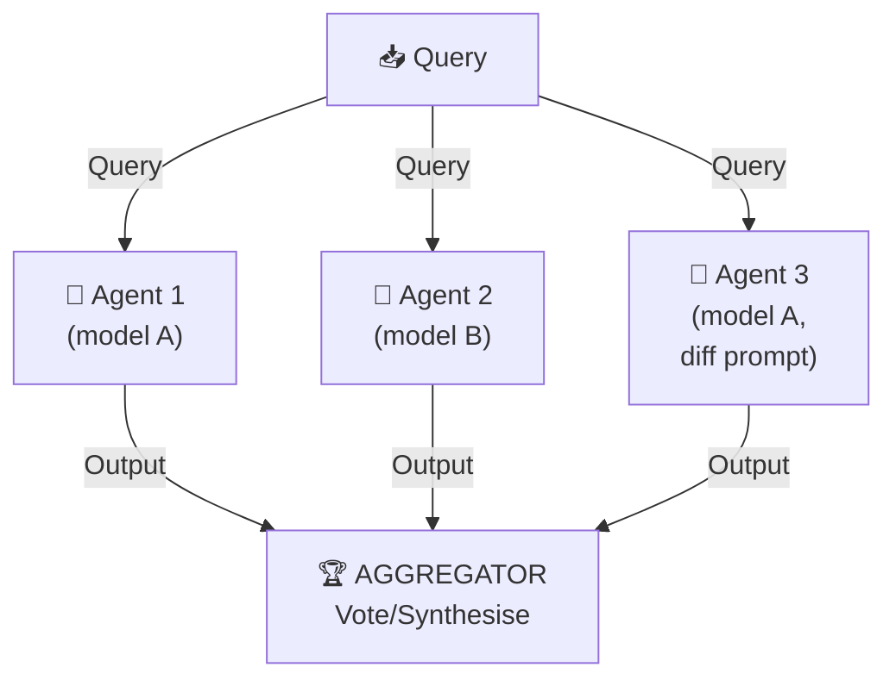

Committee/Ensemble topology: multiple independent agents produce outputs; aggregator selects or synthesizes the best.

### Aggregation Strategies

- **Majority vote**: for classification tasks (most common answer wins)
- **Best-of-N**: judge model scores each output; highest wins
- **Synthesis**: aggregator LLM combines insights from all committee members
- **Minimum-N agreement**: output only accepted if N of M agents agree (quorum)

### Enterprise Suitability ★★★★☆

Strong for: high-stakes decisions (medical, legal, financial underwriting), output quality improvement, hallucination reduction. Higher cost (N× model calls). Cost/quality tradeoff must be justified.

---

## 11. Debate / Adversarial

### Problem

A decision benefits from structured examination of opposing viewpoints. Two or more agents argue opposing positions; an arbiter decides.

### Architecture

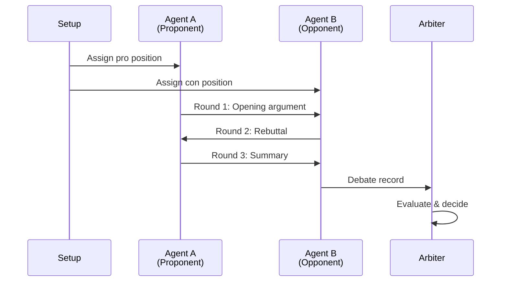

Debate/Adversarial topology: agents argue opposing positions; arbiter evaluates and decides.

### When to Use

- Policy decisions with legitimate tradeoffs (security vs. usability)
- Research synthesis where competing hypotheses exist
- Legal document review (plaintiff/defendant framing)
- Risk assessment (bull/bear case analysis)

### Enterprise Suitability ★★★☆☆

Valuable for high-stakes structured decisions. High cost (multiple rounds, multiple agents). Not appropriate for routine tasks.

---

## 12. Voting / Consensus

### Problem

Multiple agents must reach agreement before an action is taken. No single agent has sufficient authority; collective decision provides confidence.

### Architecture

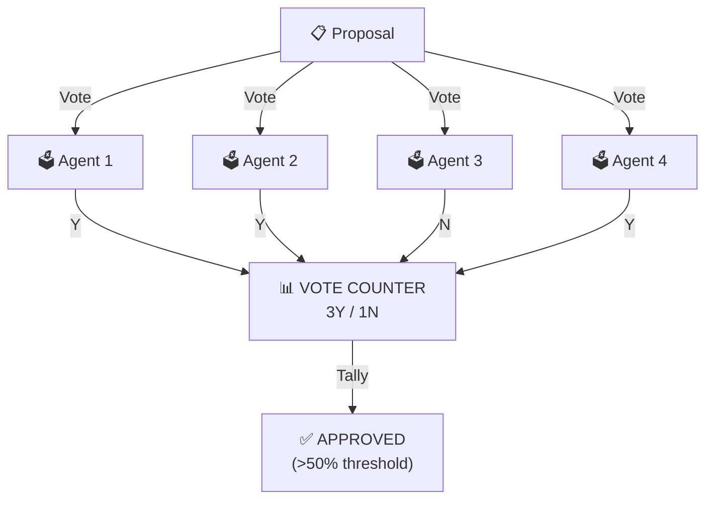

Voting/Consensus topology: multiple agents vote; decision emerges from collective agreement.

### Consensus Protocols

| Protocol | Threshold | Use Case |
|----------|-----------|----------|
| Simple majority | &gt;50% | Recommendations |
| Supermajority | &gt;66% | Significant actions |
| Unanimous | 100% | Irreversible actions |
| Quorum (N of M) | N specified | Fault-tolerant decisions |

### Enterprise Suitability ★★★☆☆

Valuable for: multi-agent autonomous action approval, policy change validation, anomaly classification requiring consensus. Adds latency; use only where collective confidence justifies cost.

---

## 13. Recursive / Self-Spawning

### Problem

A problem decomposes recursively into sub-problems of the same type. An agent solves the root problem by spawning child agents to solve sub-problems.

### Architecture

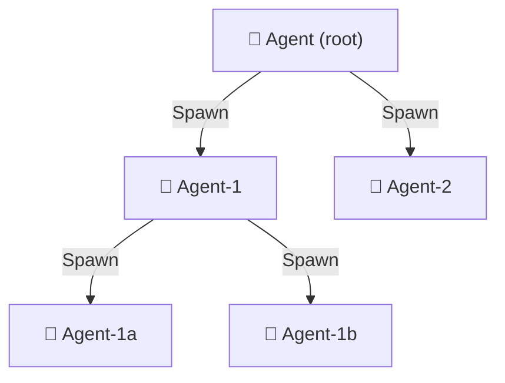

Recursive/Self-Spawning topology: agent spawns child agents to solve sub-problems recursively.

### Governance Controls (Critical)

- **Max depth limit**: hard ceiling on recursion depth (default: 4 levels) — without this, a recursive agent can exhaust compute budgets in minutes
- **Token budget inheritance**: each child receives a fraction of the parent's remaining budget
- **Cycle detection**: agent ID + task hash checked against ancestor stack to prevent recursion loops
- **Spawn authorization**: child agents inherit parent's authorization scope; cannot escalate privileges

### Enterprise Suitability ★★★☆☆

Use for: code analysis (file → function → expression), hierarchical document analysis, divide-and-conquer problem solving. Requires strict depth and budget limits. Dangerous without them.

---

## 14. Reflection

### Problem

A single agent's first output has quality issues. A self-critique loop improves output quality before delivery.

### Architecture

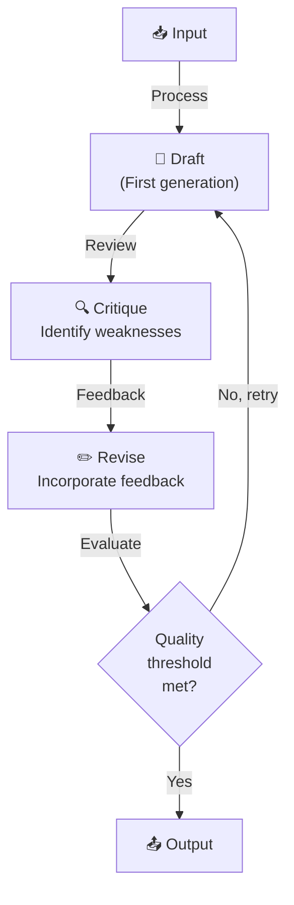

Reflection topology: agent critiques and revises its own output in a self-correction loop.

### Controls

- **Max reflection rounds**: 2–3 rounds (diminishing returns after; risk of overthinking)
- **Quality gate**: stop when evaluation score exceeds threshold
- **Divergence detection**: if revision score &lt; draft score, use draft (reflection made it worse)

### Enterprise Suitability ★★★★☆

High-value for: long-form writing, code generation, analysis reports. Low cost relative to Committee (reuses same model). Standard in production code and document agents.

---

## 15. Judge / Critic

### Problem

Agent output quality must be evaluated before delivery. A separate judge model provides an independent quality assessment.

### Architecture

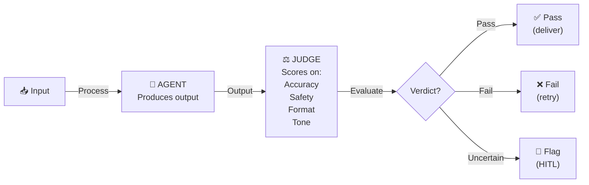

Judge/Critic topology: separate judge evaluates agent output before delivery.

### Judge Design Principles

- Judge must be **independent** of the producing agent (different model, different prompt, no shared context beyond the output being judged)
- Judge produces a **structured verdict**: `{pass: bool, score: float, issues: [string], evidence: [string]}`
- Judge is **calibrated**: regular human-judge agreement checks (monthly minimum)
- Judge is **specific**: general quality judges catch less than task-specific judges (code judge vs. report judge)

### Enterprise Suitability ★★★★★

The Judge/Critic pattern is the most important quality gate in production agentic systems. Every production agent that delivers consequential outputs should have a judge. LLM-as-Judge is now the standard evaluation mechanism for agentic AI in enterprise deployments (2026).

---

## 16. Human-in-the-Loop (HITL) Hybrid

### Problem

Certain agent decisions are too high-risk, irreversible, or require regulatory compliance for full automation. A human must approve before the agent proceeds.

### Architecture

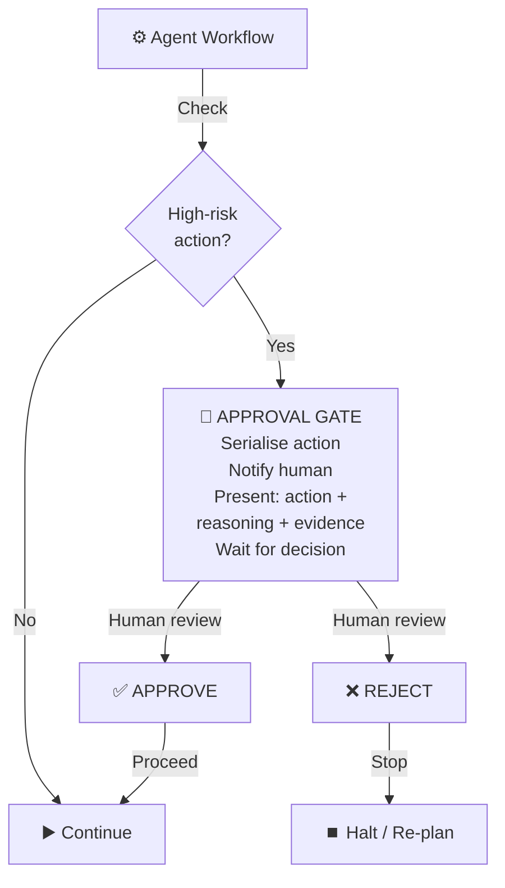

Human-in-the-Loop (HITL) topology: human approval gate guards high-risk agent actions.

### HITL Tier Model

| Tier | Decision Type | Latency Tolerance | Examples |
|------|--------------|-------------------|---------|
| **HOTL** (Human-on-the-loop) | Automated; human monitors | Real-time | Most agentic actions |
| **HITL** (Human-in-the-loop) | Human approves before execution | Minutes–hours | Funds movement, policy change |
| **HOOL** (Human-out-of-the-loop) | Never automated; human always decides | N/A | Irreversible legal actions |

### Governance

- Approval queue must be durable (survives restarts; SLA-driven escalation)
- Time-bounded: if no human response in T hours, auto-escalate or auto-deny
- Approver identity logged; approver cannot be the same entity that initiated the action (dual-control)
- Evidence package: agent must present rationale, alternatives considered, risk assessment

### Enterprise Suitability ★★★★★

Mandatory for regulated industries. The HITL gate pattern is the risk management mechanism that makes high-autonomy agents acceptable in enterprise risk frameworks. See [HITL/HOTL/HOOL Interview Questions](pathname:///archon/career/interview-ea-hitl-hotl-hool) for governance framing.

---

## Pattern Composition Guide

Real systems combine patterns. Most common compositions:

| Composition | Description | When to Use |
|------------|-------------|-------------|
| **Router → Supervisor-Worker** | Router classifies; each specialist is a supervisor with its own workers | Large enterprise agent platforms |
| **Planner → Parallel Fan-Out → Aggregator** | Planner decomposes; executors run in parallel; aggregator synthesises | Research and analysis workflows |
| **Pipeline → Judge at each stage** | Pipeline with quality gates between stages | Regulated document processing |
| **Supervisor-Worker + HITL gate** | Supervisor pauses at high-risk worker outputs for human approval | Financial services agents |
| **Reflection → Judge** | Self-critique followed by independent evaluation | High-quality content generation |
| **Committee + Voting** | Committee produces candidates; voting selects winner | High-stakes recommendation systems |

---

## Failure Mode Cross-Reference

| Failure Type | Affected Patterns | Mitigation |
|-------------|------------------|-----------|
| Cascade hallucination | Supervisor-Worker, Pipeline, Planner-Executor | Verification gates between agents |
| Infinite loop / recursion | Recursive, Reflection, Planner-Executor (re-plan) | Max depth / max rounds limits |
| Retry storm | Parallel Fan-Out, Manager-Worker Pool | Centralized retry budget coordinator |
| Context overflow | Planner-Executor, Supervisor (large plan) | Durable workflow + summarization |
| Policy bypass | Mesh, Swarm | Policy evaluation at every agent boundary |
| Audit gap | Mesh, Swarm | W3C trace context mandatory; OTel spans at every call |

---

## Further Reading

- [Agentic AI Reliability, Observability & Governance](pathname:///archon/architecture/agentic-ai-reliability-observability-governance) — retry/circuit breaker/checkpoint patterns for any topology
- [Workflow Orchestration Decision Matrix](pathname:///archon/architecture/workflow-orchestration-decision-matrix) — when to use agent vs. workflow vs. tool
- [Agent-as-Tool Composition Patterns](pathname:///archon/architecture/agent-as-tool-composition) — how to wrap topologies as tools
- [Governance Propagation Chain](pathname:///archon/architecture/governance-propagation-chain) — policy propagation through multi-agent hierarchies
- [MCP Deep Research](pathname:///archon/protocols/mcp-deep-research-2026) — tool protocol used across most patterns
- [A2A Enterprise Security & Governance](pathname:///archon/trust/a2a-security-governance) — remote agent communication protocol
- [HITL/HOTL/HOOL Interview Questions](pathname:///archon/career/interview-ea-hitl-hotl-hool) — governance framing

## Related

- [MCP & A2A Protocol Deep Dive](58-mcp-a2a-protocol-deep-dive.md) — the interop protocols these topologies communicate over.
- [Agentic AI Landing Zone: Multi-Agent Reference Architectures](28-agentic-ai-landing-zone-multiagent.md) — a landing-zone-level implementation of these topology patterns.
- [AI Harness Architecture & Multi-Agent Orchestration](44-ai-harness-architecture-orchestration.md) — the orchestration harness these topologies run inside.

