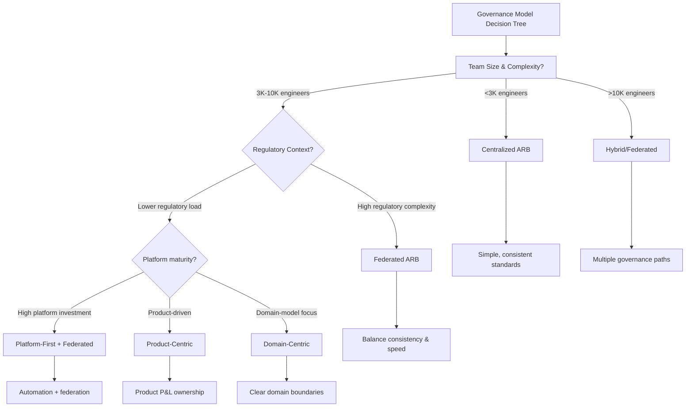
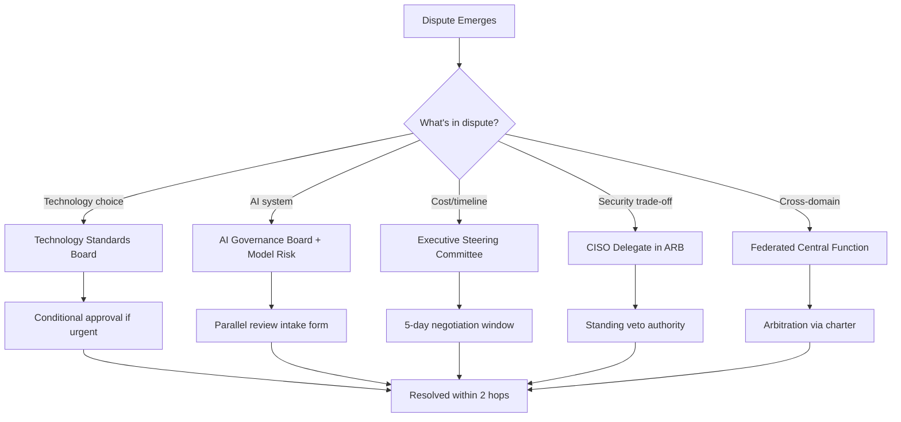

# Enterprise Governance Ecosystem &amp; Operating Models

How the Architecture Review Board fits into the wider enterprise governance landscape — overlaps, escalation paths, decision rights, and the operating models that make federated architecture governance actually work, with a banking/financial-services lens throughout.

**Companion volumes:** Economics &amp; Decision Science · Knowledge &amp; Capability Mapping · Artifact Catalog &amp; Quality Attributes · Review Questions &amp; Scorecards · Banking Industry Deep-Dive · AI-Native ARB &amp; Case Studies · Implementation Accelerator Kit

---

## Part A — The Enterprise Governance Ecosystem

A common failure mode for newly-formed or newly-led Architecture Review Boards (ARBs) is to design the board in isolation — as if it were the only governance body that touches technology decisions. In any bank or financial institution of meaningful size, the ARB is one node in a dense mesh of councils, committees, and boards, each with its own charter, cadence, and (often informally negotiated) jurisdiction. A Principal Enterprise Architect who doesn't understand this mesh will either (a) have the ARB's decisions overridden or duplicated elsewhere, or (b) become a bottleneck because everything gets routed through the ARB by default, out of organizational confusion rather than design.

This part maps sixteen governance bodies commonly found in regulated financial institutions, their typical responsibilities, where they overlap with the ARB, where conflicts emerge in practice, and how mature organizations resolve them.

### 1.1 The Sixteen-Body Governance Map

**How to use this map:** Treat the table below as a starting hypothesis to validate against your own organization's charters, not a universal template. Bodies are frequently merged, renamed, or split differently bank to bank — e.g., some institutions fold the Cyber Security Council into the Risk Committee structure; others run it as a fully independent line to the CISO. What matters is that every decision type has exactly one accountable home, even if multiple bodies are consulted.

| **Body** | **Core Mandate** | **Typical Cadence &amp; Membership** | **Relationship to ARB** |
|---|---|---|---|
| **Executive Steering Committee** | Strategic technology investment portfolio; cross-business prioritization; budget allocation at program level | Monthly/quarterly; CEO-1 and CEO-2 layer, business unit heads, CIO, CFO | ARB feeds it architecture risk and major investment trade-offs as inputs; ESC does not make architecture decisions itself |
| **CIO Council** | IT operating model, shared services, technology budget governance across divisions | Monthly; divisional CIOs, CTO, CDO | Owns technology org structure; ARB operates within the operating model the CIO Council sets |
| **CTO Council** | Technology direction, platform strategy, engineering standards at the executive level | Monthly; CTO, Chief Architect, Platform leads, Head of Engineering | Frequently the direct escalation path for ARB decisions that are contested or strategically significant; in many banks the Chief Architect chairing the ARB reports into this council |
| **Technology Standards Board** | Approves and retires technology standards (languages, frameworks, approved vendor lists, deprecation schedules) | Monthly; principal engineers, architects, security reps | Significant overlap — ARB approves architectures that use standards; Standards Board approves the standards themselves. Conflict arises when ARB approves a design using a technology not yet on the standard list |
| **AI Governance Board** | Enterprise-wide AI risk, model approval gates, responsible-AI policy, regulatory alignment (EU AI Act, NIST AI RMF) | Monthly/bi-weekly given pace of AI adoption; CDO, Chief Risk Officer, Chief Architect, Legal, Model Risk lead | Heaviest overlap of any body with the ARB in 2025-2026. AI-enabled solution architectures increasingly require both AI Governance Board sign-off (risk/compliance) and ARB sign-off (architecture fitness) — see 1.3 for resolution pattern |
| **Cyber Security Council** | Security policy, threat landscape response, security architecture standards, incident governance | Monthly; CISO, security architects, SOC leads | Security architecture review is frequently a sub-gate within the ARB process rather than a separate approval; the Council sets policy, ARB enforces it at the design level |
| **Risk Committee** | Enterprise risk appetite, operational risk, technology risk reporting to the Board of Directors | Quarterly to the Board; monthly at management level | Consumes ARB risk register and exception log as an input; in regulated banks, certain ARB-flagged risks (e.g., concentration risk in a single cloud region) must be formally reported up to this committee |
| **Data Governance Council** | Data ownership, data quality standards, master data management, data classification policy | Monthly; Chief Data Officer, data stewards, privacy office | Overlaps on data architecture reviews — a new data product or pipeline often needs both ARB (architecture fitness) and Data Governance Council (data policy compliance) sign-off |
| **Cloud Center of Excellence (CCoE)** | Cloud landing zones, FinOps tooling, cloud security guardrails, multi-cloud/hybrid strategy | Bi-weekly; cloud architects, platform engineers, FinOps lead | Operational/tactical body that the ARB relies on as the executing authority for cloud-related architecture decisions; CCoE often pre-screens cloud designs before they reach ARB |
| **Platform Engineering Council** | Internal developer platform roadmap, golden paths, paved-road tooling, platform SLAs | Bi-weekly; platform engineering leads, SRE leads | Increasingly absorbs "how" decisions that used to go through ARB (e.g., deployment pipeline design) — mature banks shift the ARB's role toward "what" and "why," leaving platform-level "how" to this council |
| **FinOps Council** | Cloud cost governance, chargeback/showback models, unit economics of technology | Monthly; finance business partners, cloud architects, FinOps practitioners | Supplies cost data the ARB should use in trade-off decisions (see Volume 2); in mature institutions, no architecture exceeding a cost threshold clears ARB without a FinOps Council cost review attached |
| **Architecture Community of Practice (CoP)** | Peer learning, pattern-sharing, informal mentoring across the architecture practice; not a decision-making body | Weekly/bi-weekly informal sessions; open to all architects | Feeder mechanism — patterns refined in the CoP often graduate into the formal pattern catalog the ARB references; CoP has no approval authority, which is the most common point of confusion for junior architects |
| **Innovation Council** | Emerging technology evaluation, proof-of-concept funding, horizon scanning (quantum, AI agents, etc.) | Quarterly; innovation lab leads, business sponsors, select architects | Operates intentionally outside standard ARB gates for time-boxed experiments; the handoff point — when a PoC graduates to a funded program — is exactly where it must re-enter ARB governance, and this handoff is the most commonly mismanaged transition in the entire ecosystem |
| **Change Advisory Board (CAB)** | Production change risk management, release scheduling, change freeze windows | Weekly; change managers, ops leads, service owners | Downstream of ARB in the lifecycle — ARB approves the architecture; CAB approves the deployment of changes built on that architecture. Confusing these two creates the classic "architecture was approved months ago, why is CAB blocking it" escalation |
| **Model Risk Committee** | Quantitative model validation, model risk management per SR 11-7 (US) / equivalent regulatory regimes, model inventory | Monthly; Model Risk Management (MRM) function, quants, validators | For any architecture embedding a quantitative or AI/ML model (credit scoring, fraud detection, trading algorithms), Model Risk Committee approval of the model is a prerequisite to, or parallel track with, ARB approval of the surrounding architecture |
| **Responsible AI Council** | AI ethics, fairness testing, explainability standards, bias audits — narrower and more technical than the AI Governance Board's policy mandate | Monthly; data scientists, ethicists, legal/compliance, select architects | Often a technical working group that feeds findings up to the AI Governance Board; ARB consumes its fairness/explainability sign-off as one input gate for AI-enabled architectures |

### 1.2 Where Responsibilities Genuinely Overlap

Four overlap zones account for the large majority of governance friction in regulated financial institutions. Each is detailed below with the practical resolution pattern used by mature programs.

**Overlap Zone 1 — ARB vs. Technology Standards Board**

The ARB approves *specific architectures*; the Standards Board approves *the building blocks those architectures are made from*. The friction case: an architect proposes a sound design using a technology not yet on the approved list (a new event-streaming platform, for instance). The ARB cannot approve the design outright without either (a) the Standards Board fast-tracking an exception, or (b) the ARB approving conditionally pending standards ratification.

**Resolution Pattern:** Mature banks give the ARB chair a standing "conditional approval with standards exception" authority for a single use, time-boxed to 90 days, automatically triggering a Standards Board agenda item. This prevents the ARB from becoming a de facto standards-setting body through repeated one-off exceptions — a common anti-pattern (see 1.4).

**Overlap Zone 2 — ARB vs. AI Governance Board vs. Responsible AI Council vs. Model Risk Committee**

This is the most consequential overlap in the current environment. A single AI-enabled lending decision system, for example, may need: Model Risk Committee sign-off on the model itself, Responsible AI Council sign-off on fairness/explainability testing, AI Governance Board sign-off on regulatory and risk-appetite alignment, and ARB sign-off on the surrounding solution architecture (data pipelines, integration, deployment topology, observability).

| **Question** | **Owning Body** |
|---|---|
| Is the model statistically sound and validated? | Model Risk Committee |
| Is the model fair, explainable, and bias-tested? | Responsible AI Council |
| Does this use case fit within enterprise AI risk appetite and regulatory posture? | AI Governance Board |
| Is the surrounding architecture (data flow, security, resilience, integration) sound? | ARB |

**Resolution Pattern:** Leading banks run a single combined "AI Solution Review" intake form that routes findings to all four bodies in parallel rather than sequentially, with a joint sign-off matrix. Sequential routing (ARB then AI Governance Board then Model Risk) routinely adds 8-14 weeks to time-to-production; parallel routing with a shared intake typically cuts this to 3-5 weeks. See Volume 7 for the AI-Native ARB operating pattern that formalizes this.

**Overlap Zone 3 — ARB vs. Data Governance Council**

A new data product, pipeline, or integration touches both architecture fitness (ARB) and data policy compliance — classification, lineage, retention, privacy (Data Governance Council). In practice, the friction is sequencing: which approval gates first?

**Resolution Pattern:** Data classification and lineage requirements should be established *before* architecture design begins (shift-left), making Data Governance Council input a design constraint the ARB validates against, not a parallel approval gate. Banks that get this wrong end up redesigning approved architectures after the Data Governance Council flags an issue post-ARB-approval — a costly rework loop.

**Overlap Zone 4 — ARB vs. CAB vs. Platform Engineering Council**

This is a lifecycle-sequencing overlap rather than a jurisdictional one. ARB approves the target architecture; Platform Engineering Council governs the paved-road implementation patterns used to build it; CAB governs the actual production deployment. The common failure: ARB approval is treated as a one-time gate, but the implementation drifts from the approved architecture by the time it reaches CAB, and CAB has no architecture context to detect the drift.

**Where this breaks in practice:** CAB members are rarely architects and are not equipped to assess architectural drift — they assess deployment risk, not design fidelity. Without a fitness-function or architecture-conformance check wired into the CI/CD pipeline (see Volume 3, Architecture Knowledge Management, and Volume 7, Continuous Architecture Validation), drift goes undetected until an incident or audit surfaces it.

### 1.3 Escalation Paths

A clean escalation model answers one question precisely: when two bodies disagree, who breaks the tie, and within what timeframe? The table below reflects a composite of escalation models observed across large regulated banks.

| **Dispute Type** | **First-Line Resolution** | **Escalation If Unresolved** |
|---|---|---|
| ARB vs. business sponsor on cost/timeline trade-off | ARB chair and sponsor's delivery lead negotiate, time-boxed to 5 business days | Executive Steering Committee adjudicates as a portfolio prioritization decision |
| ARB vs. Technology Standards Board on exception requests | Conditional approval mechanism (see 1.2) | CTO Council, if the exception recurs 3+ times signaling a standards gap |
| ARB vs. AI Governance Board on risk tolerance for an AI use case | Joint review session within the combined AI Solution Review process | Chief Risk Officer has final call where regulatory exposure is material; CTO has final call where the dispute is purely architectural |
| ARB vs. Security Council on a security-architecture trade-off | CISO delegate embedded in ARB has standing veto on security-critical items, exercised at point of review | Risk Committee, only if the veto itself is contested as disproportionate |
| Architect vs. ARB on a rejected proposal | Architect may request reconsideration with new evidence at next ARB session | Chief Architect review, then CTO Council if still contested |
| Cross-divisional architecture disputes (shared platform decisions) | Federated ARB model's central architecture function arbitrates (see Part B) | CIO Council, since this is fundamentally an operating-model and resourcing question |

**Design Principle:** Every escalation path should resolve within two hops. If a dispute regularly takes three or more escalation steps to resolve, that's a signal the underlying charter or decision-rights model (RACI) is ambiguous, not that the people involved are being unreasonable. Fix the charter, not the people.

### 1.4 Common Anti-Patterns in the Governance Mesh

**The Shadow Standards Board**

The ARB repeatedly grants one-off technology exceptions without routing them through the Technology Standards Board, effectively becoming an unofficial standards-setting body through accumulated precedent. Symptom: architects start citing "ARB approved X for project Y" as justification for using X elsewhere, without any actual standard existing.

**Governance Theater via Parallel Approval**

Bodies are added to a review chain ("just to be safe") without genuine decision authority, creating sign-off ceremonies that add weeks of latency without changing outcomes. A useful test: if a body's "no" has never once been observed to block a decision in the last 12 months, it is not a governance gate — it is a notification list, and should be re-scoped as such.

**The Innovation Council Black Hole**

Proofs of concept funded and governed by the Innovation Council quietly graduate into production-adjacent systems without ever passing through ARB, because no one owns the handoff trigger. This is how shadow IT and unsupported production dependencies are born in well-governed enterprises — not through rebellion, but through an undefined transition point.

**Risk Committee as Rubber Stamp**

Technology risk items are reported to the Risk Committee in a format (raw architecture risk register entries) that non-technical board-level members cannot meaningfully evaluate, so approval becomes pro forma rather than substantive oversight — which is itself a regulatory exposure in supervised institutions.

### 1.5 Decision Ownership Matrix (Condensed RACI)

A fuller RACI template appears in the Implementation Accelerator Kit. The condensed version below illustrates the pattern for the five decision types that generate the most cross-body friction.

| **Decision** | **Accountable** | **Responsible** | **Consulted** | **Informed** |
|---|---|---|---|---|
| Approve target-state architecture for a new platform | ARB Chair / Chief Architect | Solution Architect | Security Council, Data Governance, FinOps | CTO Council, Business Sponsor |
| Approve AI use case for production | AI Governance Board Chair | AI Solution Architect, Data Scientist | Model Risk Committee, Responsible AI Council, ARB | Risk Committee, Executive Steering Committee |
| Approve new technology standard / vendor | Technology Standards Board Chair | Principal Engineer sponsoring the standard | CCoE, Security Council, ARB | CTO Council, Architecture CoP |
| Approve cloud landing zone change | CCoE Lead | Cloud Platform Architect | Security Council, FinOps Council | ARB, Platform Engineering Council |
| Approve production deployment of an ARB-approved architecture | CAB Chair | Release Manager | Platform Engineering Council, Service Owner | ARB (for drift visibility) |

---

## Part B — Enterprise Architecture Operating Models

The same ARB charter produces wildly different outcomes depending on the operating model it sits inside. A Principal Enterprise Architect should be able to diagnose which model an organization is actually running (as opposed to which model is on the org chart) and recognize the early symptoms when a model is being outgrown. Ten operating models are covered below, each assessed on the same dimensions: advantages, disadvantages, appropriate organization size, when to adopt, how it scales, and its characteristic anti-pattern.

### 2.1 Centralized ARB

A single ARB, typically chaired by the Chief Architect, reviews all architecturally significant decisions across the enterprise. All architects report into a central architecture function regardless of which business line they support.

| **Dimension** | **Detail** |
|---|---|
| **Advantages** | Maximum consistency of standards; single source of truth for architecture decisions; easiest model to audit and report on for regulators; strong leverage for enterprise-wide technical debt reduction initiatives |
| **Disadvantages** | Becomes a bottleneck past a certain transaction volume; central architects lose contextual depth in any one business domain; perceived as slow and disconnected from delivery teams; single point of organizational failure if the central function is under-resourced |
| **Organization size** | Best suited to banks with under ~3,000 engineers, or larger banks in an early governance maturity phase establishing baseline standards |
| **When appropriate** | Post-merger integration phases requiring forced standardization; regulatory remediation programs; early-stage cloud migration where guardrails must be non-negotiable |
| **Scaling model** | Does not scale well by headcount alone — typically transitions to a federated model once review queue depth exceeds 2-3 weeks consistently |
| **Anti-pattern** | "Ivory tower architecture" — central architects design in the abstract without delivery accountability, producing architectures that are theoretically sound but operationally unworkable |

### 2.2 Federated ARB

A central architecture function sets enterprise-wide standards and arbitrates cross-domain decisions, while domain-level or business-unit ARBs handle decisions local to their scope, escalating only when a decision crosses domain boundaries or breaches enterprise standards.

| **Dimension** | **Detail** |
|---|---|
| **Advantages** | Balances consistency with contextual speed; domain ARBs retain deep business knowledge; central function focuses on genuinely cross-cutting concerns (shared platforms, enterprise risk); scales with organizational growth |
| **Disadvantages** | Requires mature charter discipline to prevent domain ARBs from drifting into inconsistent standards; risk of "federation in name only" where central function still bottlenecks everything; higher governance overhead (more boards, more meetings) than centralized |
| **Organization size** | The dominant model for large banks (5,000+ engineers, multiple lines of business: retail, commercial, markets, wealth) |
| **When appropriate** | Once a centralized model's review queue becomes the binding constraint on delivery velocity, or when business units have genuinely divergent regulatory/technical contexts (e.g., capital markets vs. retail banking) |
| **Scaling model** | Scales well horizontally — new business units stand up their own domain ARB against the central charter template; central function headcount grows sub-linearly relative to engineering headcount |
| **Anti-pattern** | "Federation drift" — domain ARBs quietly diverge from enterprise standards over 18-24 months with no mechanism forcing reconciliation, discovered only at audit or major incident time |

### 2.3 Embedded Architects

Architects sit permanently within product or delivery teams rather than a separate architecture function; a lightweight central guild coordinates standards but holds no formal approval authority.

| **Dimension** | **Detail** |
|---|---|
| **Advantages** | Architecture decisions made with full delivery context; fastest model for time-to-decision; architects build deep product expertise; aligns naturally with product-centric and platform engineering cultures |
| **Disadvantages** | Enterprise-wide consistency is hard to maintain without strong tooling (fitness functions, architecture-as-code); weakest model for regulatory audit trails unless deliberately instrumented; architect career paths can feel isolating without a strong community of practice |
| **Organization size** | Common in digitally-native challenger banks and the more autonomous tech-forward divisions of larger banks (e.g., a digital-only retail arm) |
| **When appropriate** | High-velocity product domains where the cost of governance latency exceeds the cost of inconsistency; organizations with strong platform engineering maturity providing guardrails through paved roads rather than review gates |
| **Scaling model** | Scales with product team count, but requires increasing investment in automated governance (Policy-as-Code, architecture fitness functions) to remain auditable as it scales |
| **Anti-pattern** | "Governance by absence" — no one is actually checking architectural decisions against enterprise risk appetite, and this is only discovered when a regulator asks for an audit trail that does not exist |

### 2.4 Architecture Guild

A voluntary community of architects across the organization that shares patterns, runs informal peer review, and influences through reputation rather than authority. Usually layered on top of one of the other models rather than standing alone.

| **Dimension** | **Detail** |
|---|---|
| **Advantages** | Builds genuine practitioner buy-in (vs. compliance-driven adherence); excellent vehicle for organic pattern-catalog growth; low cost to run; strengthens architect retention through community and craft development |
| **Disadvantages** | Has no enforcement authority — cannot be a substitute for formal governance in a regulated context; attendance and influence are voluntary and can wane without active sponsorship |
| **Organization size** | Valuable at any size with more than ~15 architects; below that, informal peer review happens naturally without needing a formal guild structure |
| **When appropriate** | As a complement to Centralized or Federated ARB models — never as the sole governance mechanism in a regulated bank |
| **Scaling model** | Scales well via chapter/sub-guild structures by domain (data architecture guild, security architecture guild, etc.) as the architect population grows |
| **Anti-pattern** | Mistaking the Guild for a governance body — a regulator or auditor asking "where was this decision formally approved" will not accept "it was discussed in the architecture guild" as an answer |

### 2.5 Platform-First Governance

Governance is enforced primarily through what the platform allows (paved roads, golden paths, guardrails baked into the platform itself) rather than through human review boards. The platform engineering team effectively encodes architecture standards into the tooling.

| **Dimension** | **Detail** |
|---|---|
| **Advantages** | Governance that scales without proportional headcount growth; standards are enforced consistently and automatically rather than relying on review diligence; excellent developer experience when done well — compliance becomes the path of least resistance |
| **Disadvantages** | Requires significant upfront platform engineering investment; struggles with novel architectures that don't fit existing golden paths; risk of the platform becoming a rigid constraint that pushes teams toward workarounds outside the platform's visibility |
| **Organization size** | Requires sufficient scale to justify dedicated platform engineering investment — typically 1,000+ engineers, or smaller cloud-native banks with strong initial platform investment |
| **When appropriate** | Organizations with high architectural homogeneity (e.g., predominantly Kubernetes-based microservices) where most use cases fit well-trodden patterns |
| **Scaling model** | Scales exceptionally well once mature, since governance cost per additional team approaches zero; the constraint shifts from review capacity to platform team capacity to build new golden paths |
| **Anti-pattern** | "Golden path tunnel vision" — legitimate architectural innovation gets discouraged because anything outside the paved road faces disproportionate friction, even when the deviation is well-justified |

### 2.6 Product-Centric Governance

Architecture decisions are organized and reviewed around products (a mortgage origination platform, a payments product) rather than technology layers or organizational units, with product architects accountable for the full lifecycle.

| **Dimension** | **Detail** |
|---|---|
| **Advantages** | Strong alignment between architecture decisions and business/customer outcomes; clear accountability for product-level technical debt; natural fit with product-operating-model organizations now common in digital banking |
| **Disadvantages** | Cross-product architecture concerns (shared customer data model, shared payments rails) can fall through the cracks without a strong enterprise architecture counterbalance; risk of product silos re-emerging at the technology layer |
| **Organization size** | Banks that have adopted a genuine product operating model (persistent product teams, product P&amp;L ownership) rather than project-based delivery |
| **When appropriate** | When the bank has already made the broader organizational shift to product operating model; introducing product-centric governance ahead of that broader shift tends to fail |
| **Scaling model** | Scales with product portfolio growth; requires an enterprise architecture layer (often federated-model-style) to handle cross-product concerns as the product count grows |
| **Anti-pattern** | Duplicate platform capability built independently by multiple products because no one owns cross-product architecture — a frequent and expensive failure mode in banks mid-transition to product operating models |

### 2.7 Domain-Centric Governance

Aligned to Domain-Driven Design bounded contexts (e.g., Customer, Account, Payments, Risk) rather than products or org units; each domain has architecture ownership and a domain-level review function.

| **Dimension** | **Detail** |
|---|---|
| **Advantages** | Strong conceptual clarity around data ownership and system boundaries; reduces integration complexity by enforcing clean domain interfaces; pairs naturally with event-driven and microservices architectures |
| **Disadvantages** | Defining correct domain boundaries is genuinely hard and gets it wrong often in early iterations, with expensive re-boundary exercises later; can fragment governance if domains are too numerous or granular |
| **Organization size** | Mid-to-large banks with mature engineering practices and existing investment in domain modeling |
| **When appropriate** | Core banking modernization and platform decomposition programs where untangling a monolith requires clear domain boundaries as the organizing principle |
| **Scaling model** | Scales well once domain boundaries stabilize; early instability (boundaries shifting every few months) makes governance feel arbitrary and erodes trust in the model |
| **Anti-pattern** | "Domain boundary churn" — re-litigating bounded context definitions repeatedly without ever stabilizing, which prevents any governance model layered on top from gaining legitimacy |

### 2.8 Business Capability Governance

Architecture review and investment decisions are organized around the enterprise business capability model rather than technology or org structure — e.g., "Loan Origination" or "Customer Onboarding" as the unit of governance.

| **Dimension** | **Detail** |
|---|---|
| **Advantages** | Directly traceable to business value and strategy; excellent for capability-based investment prioritization and identifying capability redundancy across the application portfolio; resonates strongly with business stakeholders who don't think in technology terms |
| **Disadvantages** | Requires a mature, well-maintained capability model to be effective — a stale or overly abstract capability map makes this model meaningless; capabilities don't map cleanly to delivery teams, creating governance-to-execution friction |
| **Organization size** | Large, diversified financial institutions with complex application portfolios (typically the product of M&amp;A activity) where capability redundancy is a major cost driver |
| **When appropriate** | Post-merger application rationalization programs; enterprise architecture maturity assessments; multi-year platform consolidation initiatives |
| **Scaling model** | Scales with capability model maturity rather than headcount — the binding constraint is capability map quality and currency, not organizational size |
| **Anti-pattern** | Capability maps that are built once for a consulting engagement and never updated, becoming governance theater dressed up as strategic rigor |

### 2.9 AI-First Governance

An emerging model (2024-2026) where AI risk and capability considerations are the primary organizing lens for architecture governance, with traditional architecture review treated as a subset of AI-aware review rather than the reverse.

| **Dimension** | **Detail** |
|---|---|
| **Advantages** | Front-loads AI risk, fairness, and explainability concerns rather than retrofitting them; well-suited to organizations where AI is becoming a default component of new architecture rather than an exception; aligns naturally with emerging regulatory regimes (EU AI Act, evolving US frameworks) |
| **Disadvantages** | Risk of over-indexing on AI concerns at the expense of foundational architecture quality (resilience, security, data integrity) which remain necessary regardless of AI content; still an immature model with few long-track-record case studies in banking specifically |
| **Organization size** | Most visible currently in digitally native or AI-forward divisions of larger banks rather than as an enterprise-wide model |
| **When appropriate** | Organizations where the majority of new architecturally-significant initiatives have a material AI/ML component — increasingly common but not yet universal in 2026 |
| **Scaling model** | Scaling pattern still emerging; early evidence suggests it works best layered onto a Federated model rather than replacing foundational architecture governance |
| **Anti-pattern** | Treating every architecture decision through an AI lens even when AI is incidental, adding governance overhead to initiatives that don't warrant it |

### 2.10 Hybrid Governance

In practice, almost every large bank runs a hybrid: a federated ARB skeleton, with platform-first guardrails handling routine decisions automatically, embedded architects for high-velocity digital product teams, and a central function retaining authority over enterprise-wide and AI-significant decisions.

| **Dimension** | **Detail** |
|---|---|
| **Advantages** | Matches governance intensity to decision risk rather than applying one-size-fits-all process; the realistic end-state for most large, complex financial institutions |
| **Disadvantages** | Genuinely complex to design and communicate — architects and delivery teams can struggle to know which governance path applies to their specific situation without clear routing logic |
| **Organization size** | Large, complex banks (10,000+ engineers, multiple regulatory jurisdictions, diverse business lines) |
| **When appropriate** | Mature governance organizations that have already run, and outgrown, a purer single model — hybrid is rarely a good starting point; it is an evolution |
| **Scaling model** | Scales well precisely because different parts of the model scale through different mechanisms (automation for routine, federation for domain, central for enterprise-critical) |
| **Anti-pattern** | "Complexity without clarity" — a hybrid model with no clear routing logic becomes worse than any single pure model, because no one can predict which gate applies to their initiative, so they default to asking the central architecture function for everything, recreating the centralized bottleneck inside a model designed to avoid it |

### 2.11 Selecting and Evolving the Right Model

**A practical diagnostic sequence:**

1. **Measure review queue depth and cycle time.** If architecture decisions routinely wait more than 2-3 weeks for review, a centralized model is under strain.

2. **Audit standards drift.** If domain or product teams have meaningfully diverged from enterprise standards without anyone noticing for 12+ months, federation has decayed into fragmentation.

3. **Check decision traceability.** If you cannot produce an audit trail for "why was this architecture approved" within an hour of an auditor asking, your model — whatever it's called — is not actually functioning as governance.

4. **Assess platform leverage.** If more than 60% of architecture review time is spent on decisions that are structurally similar to ones already approved, that volume should be moved to Platform-First guardrails, freeing the ARB for genuinely novel decisions.

Operating model transitions in banking are rarely announced as such — they happen by accretion (a new council gets added, a guild gets formalized) or by crisis (an audit finding forces centralization). A Principal Enterprise Architect's highest-leverage move is often not designing the "ideal" model from scratch, but correctly diagnosing which model the organization is already drifting toward and steering that drift deliberately rather than letting it happen by accident.

---

## Governance Model Selection Matrix

---

## Escalation Path Decision Flow

---

**Part A Summary:** The ARB cannot operate in isolation. Understanding the mesh of 16+ governance bodies, their overlaps, escalation paths, and anti-patterns is essential for a Principal Enterprise Architect. **Part B Summary:** Operating models are not one-size-fits-all — the same charter produces wildly different outcomes depending on organizational size, maturity, and business context. Diagnosis (queue depth, drift, traceability, platform leverage) should precede model selection.

## Related

- [Architecture Economics & Decision Science](61-volume2-economics-decision-science.md) — Volume 2 of this series.
- [Enterprise Review Questions & Scorecards](64-volume5-review-questions-scorecards.md) — how this operating model is assessed in practice.

