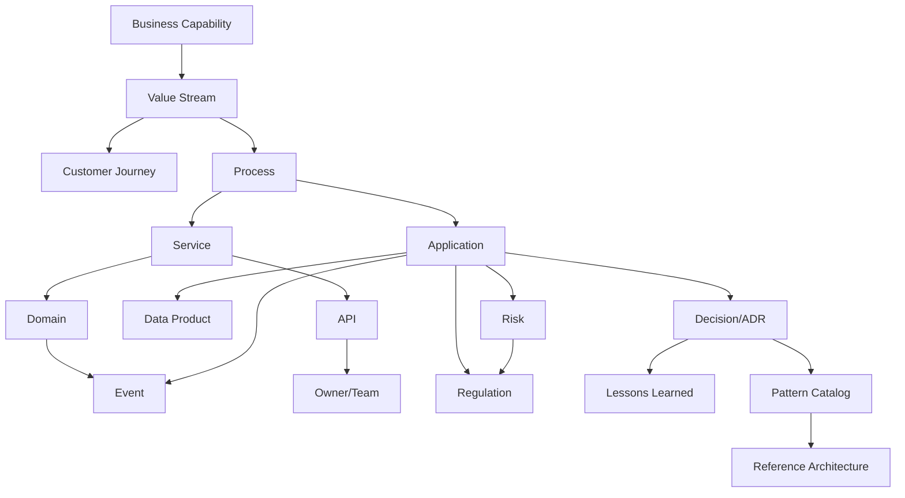

# Architecture Knowledge Management &amp; Capability Mapping

Why most enterprises fail at architecture knowledge management — and how knowledge graphs, enterprise RAG, and living documentation fix it. Plus the business capability traceability matrix that connects strategy to infrastructure.

**Companion volume:** Enterprise Architecture Review Board Handbook · Banking &amp; Financial Services Edition

---

## Part A — Architecture Knowledge Management

Ask any architect at a large bank where the authoritative answer to "why was this system built this way" lives, and the honest answer is usually: "it depends who you ask, and the person who actually knows left the company three years ago." Architecture knowledge management is the discipline most enterprises pay lip service to and most consistently fail at in practice — not for lack of tooling, but for lack of a sustained operating discipline around capturing, organizing, and retrieving architectural knowledge as a living asset rather than a documentation exercise performed once and abandoned.

### 5.1 Why This Fails — The Root Causes

| **Root Cause** | **Manifestation** |
|---|---|
| Documentation as a compliance checkbox | Architecture documents are produced to satisfy a governance gate, then never updated, becoming actively misleading within 6-12 months |
| No single source of truth | The same architecture is described differently in Confluence, a PowerPoint from the original approval, the actual code, and institutional memory — with no reconciliation mechanism |
| Tribal knowledge concentration | Critical architectural rationale lives only in the heads of a small number of long-tenured architects, creating severe key-person risk that materializes precisely when that person leaves |
| Write-only knowledge stores | Wikis and document repositories that are easy to add to but hard to search or navigate become write-only — content goes in, nothing useful comes back out |
| No knowledge lifecycle | No defined process for reviewing, updating, or retiring architectural knowledge as systems evolve, so the knowledge base accumulates stale and contradictory content indefinitely |

### 5.2 Architecture Knowledge Graphs

A knowledge graph models architecture entities (systems, capabilities, data domains, APIs, decisions, risks, owners) and the relationships between them as a queryable graph rather than a collection of disconnected documents. This is the structural foundation that makes the rest of this section's tools (semantic search, enterprise RAG, AI-assisted search) actually effective — without a well-modeled graph underneath, those tools are searching unstructured noise.

**Minimum viable schema for a banking architecture knowledge graph**

Core node types: **System**, **Capability**, **DataDomain**, **API**, **Decision (ADR)**, **Risk**, **Owner/Team**, **Regulation**, **QualityAttribute**. Core relationship types: **implements** (System→Capability), **depends_on** (System→System), **owns** (Team→System), **governed_by** (System→Regulation), **decided_by** (Decision→System), **exposes** (System→API), **satisfies** (System→QualityAttribute). This schema directly supports queries that are nearly impossible with document-based knowledge management — e.g., "show me every system that would be affected if we changed our customer data retention policy," which becomes a simple graph traversal rather than a multi-week manual investigation.

### 5.3 Semantic Search &amp; Enterprise RAG

Keyword search fails on architecture knowledge because the same concept is described with wildly inconsistent terminology across documents written by different teams over different years ("customer master," "party data," "client golden record" may all refer to the same underlying concept). Semantic search, using embedding-based similarity rather than exact term matching, substantially closes this gap.

Enterprise RAG (Retrieval-Augmented Generation) layers a generative AI interface on top of semantic search, allowing architects to ask natural-language questions against the knowledge corpus and receive synthesized answers with citations back to source documents, rather than a list of documents to manually review. For banking-specific RAG implementations, particular care is needed around:

- **Access control propagation** — the RAG system must respect the same document-level access controls as the underlying source systems; a common and serious failure mode is a RAG system that surfaces content from documents the querying user shouldn't have access to

- **Source freshness and conflict resolution** — when the corpus contains contradictory information (an outdated document and its replacement), the RAG system needs an explicit strategy for which to trust, not a silent average of both

- **Hallucination risk in a governance context** — an AI system confidently synthesizing an answer that sounds authoritative but is subtly wrong is a more dangerous failure mode in architecture governance than an obviously broken keyword search, because it's more likely to be trusted without verification

### 5.4 Lessons Learned &amp; Architecture Memory

Distinct from pattern catalogs (5.5): lessons learned capture the negative space — what was tried and didn't work, and why, which is precisely the information least likely to be written down voluntarily (no one writes a confident document about their own failed initiative) and most valuable to a Principal Architect facing a similar decision years later.

**A practical capture mechanism**

Mature banking architecture practices run a lightweight, blameless post-implementation review for any architecturally significant initiative (not just failures — successes too), structured around: what we expected to happen, what actually happened, what we'd do differently, and what pattern or anti-pattern this confirms or contradicts in the existing catalog. The discipline of running this consistently, even when uncomfortable, is what separates organizations with genuine architecture memory from those that repeat the same expensive mistakes every 3-4 years as institutional memory turns over.

### 5.5 Architecture Pattern Catalog &amp; Reference Architectures

A curated, actively maintained set of proven architectural solutions to recurring problems, distinct from a reference architecture (which describes a target end-state for a specific domain) and from an anti-pattern catalog (which captures what to avoid). The discipline that keeps a pattern catalog alive rather than becoming another write-only wiki is usage tracking — instrumenting which patterns are actually being referenced and applied, and actively retiring or flagging patterns that haven't been used or validated in 18+ months.

A curated starter set of patterns and reference architectures most relevant to banking environments, with full detail in Volume 8's accelerator kit:

| **Pattern** | **Typical Banking Application** |
|---|---|
| Event-driven core banking integration | Decoupling product systems from the core ledger via event streams rather than synchronous point-to-point calls |
| Saga pattern for distributed transactions | Multi-step payment processing across services without a global distributed transaction |
| Strangler fig for legacy modernization | Incrementally replacing mainframe-era core banking capability without a high-risk big-bang cutover |
| API gateway with backend-for-frontend (BFF) | Channel-specific API composition for mobile/web/partner channels from shared core services |
| CQRS for regulatory reporting | Separating high-volume transactional write paths from complex regulatory read/reporting queries |
| Zero-trust segmentation | Network and identity architecture for payment processing environments under PCI-DSS-equivalent scope |
| Model gateway / AI router | Abstraction layer routing requests across multiple LLM providers/models for cost, resilience, and vendor-risk diversification |

### 5.6 Knowledge Lifecycle

Every piece of architectural knowledge should have an explicit lifecycle state, the same discipline applied to code or infrastructure: **Draft → Active → Under Review → Deprecated → Retired**, with defined triggers for transitioning between states (e.g., a system entering its decommissioning phase should automatically trigger a review of all associated documentation, patterns, and decisions referencing it).

### 5.7 AI-Assisted Search &amp; the Architecture Copilot

The natural evolution of 5.3's enterprise RAG capability into an interactive assistant embedded in an architect's daily workflow — able to answer questions, draft initial ADRs from a description of a decision, flag potential conflicts with existing standards or inflight decisions elsewhere in the organization, and surface relevant prior art before an architect starts designing from scratch. The fuller autonomous-agent evolution of this capability should be preceded by this foundational, human-in-the-loop assistant pattern.

### 5.8 Living Architecture Documentation

The capstone discipline tying this section together: documentation that is generated from, or continuously validated against, the actual running system — architecture-as-code, automatically generated dependency diagrams from service mesh telemetry, fitness-function results embedded directly in architecture documents — rather than hand-maintained documents that drift from reality the moment they're published. This is the only durable solution to the staleness problem identified in 5.1; manual documentation discipline alone, however well-intentioned, reliably degrades over time.

---

## Part B — Enterprise Capability Mapping

Business capability mapping is the discipline that lets a Principal Architect have a coherent conversation with a Chief Operating Officer or business unit head — neither of whom thinks in terms of microservices or data domains, but both of whom understand "Loan Origination" or "Customer Onboarding" as units of business value. This part builds a layered traceability model connecting business capabilities down through value streams, processes, applications, and ultimately AI agents and infrastructure.

### 6.1 The Layered Model

Twelve traceable layers, each with a distinct purpose, together forming the backbone of governance-by-capability discussed in Volume 1 (Section 2.8):

| **Layer** | **Definition** | **Banking Example** |
|---|---|---|
| **Business Capability** | What the business does, independent of how — stable over time even as implementation changes | Loan Origination, Fraud Detection, Regulatory Reporting |
| **Value Stream** | The end-to-end flow of value delivery from trigger to customer/stakeholder outcome | "Customer applies for a mortgage" → "Customer receives funded loan" |
| **Customer Journey** | The experience-layer view of a value stream from the customer's perspective, including channels and touchpoints | Mobile app application → document upload → status tracking → approval notification |
| **Process** | The operational steps (manual or automated) that execute a value stream | Credit check → underwriting decision → documentation generation → funds disbursement |
| **Application** | Deployed software systems that support one or more processes | Loan Origination System (LOS), document management platform |
| **Service** | Discrete, addressable units of functionality, often but not always mapped to microservices | Credit scoring service, document verification service |
| **Domain** | A bounded context grouping related data and capability ownership (see Volume 1, Section 2.7) | Customer domain, Lending domain, Payments domain |
| **Event** | Significant state changes that other parts of the architecture react to | LoanApproved, PaymentSettled, CustomerKYCStatusChanged |
| **Data Product** | Curated, owned, discoverable data assets exposed for reuse beyond their originating system | Customer 360 data product, Transaction history data product |
| **AI Product** | Packaged AI/ML capability exposed for reuse, distinct from a one-off model | Fraud risk scoring AI product, Document extraction AI product |
| **Agent** | Autonomous or semi-autonomous AI systems that take actions, not just generate outputs | Customer service triage agent, architecture review agent |
| **Platform / Infrastructure** | The underlying compute, storage, network, and shared platform services everything above runs on | Cloud landing zone, Kubernetes platform, event streaming backbone |

### 6.2 Building the Traceability Matrix

The practical output of this model is a traceability matrix — typically implemented as a set of relationships in the architecture knowledge graph from Part A, rather than a static spreadsheet, given the scale and rate of change in a large bank's portfolio. The matrix should support bidirectional traversal:

**Top-down query example**

"Which applications support the Loan Origination capability?" → traverses Capability → Value Stream → Process → Application, surfacing every system involved end-to-end, including ones a given team might not realize are in scope.

**Bottom-up query example**

"If we decommission this legacy mainframe service, which business capabilities are affected, and what's their criticality?" → traverses Service → Process → Value Stream → Capability, surfacing business impact that a pure technical dependency analysis would miss — this is precisely the query that prevents the kind of decommissioning incident that makes headlines.

### 6.3 Capability Redundancy Analysis

One of the highest-value applications of a mature capability map in banking specifically: most large banks, particularly those grown through M&amp;A, carry significant redundant capability — multiple systems independently implementing "Customer Onboarding" or "Payment Processing" across different business lines or legacy acquisitions. The capability map makes this redundancy visible and quantifiable rather than anecdotal.

| **Redundancy Signal** | **What It Suggests** |
|---|---|
| 3+ applications independently implementing the same capability with no shared service layer | Strong consolidation candidate — likely significant duplicate run-cost and inconsistent customer experience across business lines |
| A capability with no clearly mapped owning application | Either a genuine capability gap, or — more often in practice — undocumented shadow implementation that needs discovery |
| A capability implemented entirely manually (no application mapped) | Automation/digitization opportunity, and a candidate for the architecture economics cost-of-delay analysis in Volume 2 |

### 6.4 Maintaining Currency

The capability map anti-pattern flagged in Volume 1 (Section 2.8) — built once for a consulting engagement, never updated — is avoided through the same knowledge lifecycle discipline from Part A applied specifically to capability-layer artifacts. Practical mechanisms that sustain currency rather than relying on manual diligence:

- Tying capability-to-application mappings to the architecture review process itself — any ARB-reviewed initiative is required to confirm or update its capability mapping as part of the review intake, making currency a byproduct of normal governance activity rather than a separate maintenance burden

- Periodic (semi-annual is a reasonable cadence) capability-owner attestation, where each named business capability owner confirms the mapped applications and processes are still accurate

- Automated drift detection where feasible — comparing the declared capability map against actual observed system dependencies and traffic patterns, flagging discrepancies for human review rather than trusting the map blindly

**A note on ambition versus value**

The single most common failure mode in capability mapping initiatives is attempting to map the entire enterprise to full depth (all twelve layers, fully detailed) before delivering any value, turning the initiative into a multi-year documentation project that loses executive sponsorship before completion. The more durable pattern is depth-first on the highest-value capability domains (typically those with known redundancy, known regulatory scrutiny, or known strategic investment), proving value, and expanding breadth incrementally from there.

---

## Knowledge Graph for Enterprise Architecture

---

**Part A Summary:** Knowledge graphs, RAG systems, pattern catalogs, and living documentation transform architecture knowledge from static documents into queryable, continuously validated assets. **Part B Summary:** Capability mapping connects business strategy to infrastructure through twelve traceable layers, enabling both top-down capability-to-application queries and bottom-up impact analysis, with particular value in identifying redundancy and automation opportunities in large, M&amp;A-grown banks.
