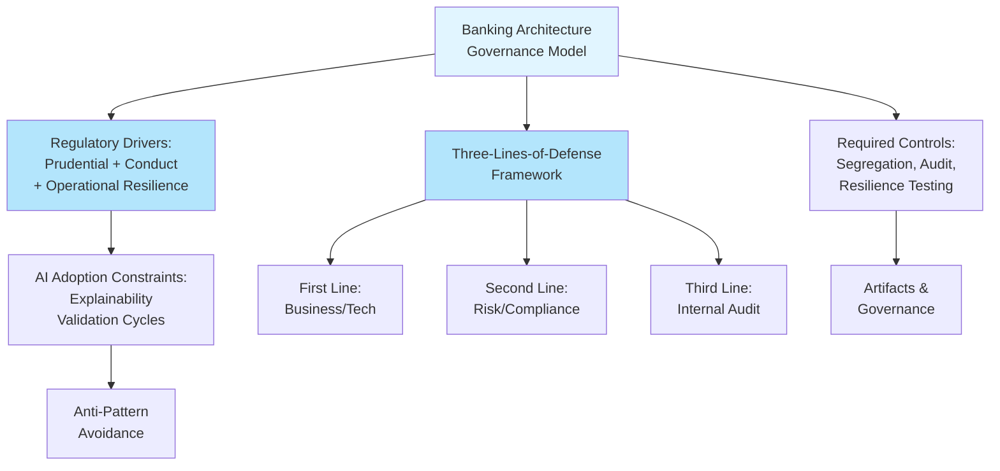

Banking &amp; Financial Services Architecture Governance Deep-Dive — Regulatory drivers, governance structures, required architecture controls, and industry-specific anti-patterns for banking with comparative notes against insurance and other regulated industries.

Enterprise Architecture Review Board Handbook · Banking &amp; Financial Services Edition

# Banking — The Primary Lens

Banking carries the heaviest, most prescriptive regulatory architecture footprint of any industry covered in this handbook, which is why this volume treats it as the primary deep-dive rather than one entry in a flat industry list. Three forces converge in banking architecture governance: prudential safety-and-soundness regulation, conduct/consumer-protection regulation, and increasingly operational resilience and technology-specific regulation that didn't exist in its current form a decade ago.

## Regulatory Drivers

| Regulatory Area | What It Requires of Architecture |
|---|---|
| Operational Resilience (e.g., DORA in the EU, equivalent regimes in UK/US) | Demonstrable ability to maintain critical business services within defined impact tolerances during disruption; mandates resilience testing (not just planning), third-party/critical-ICT-provider oversight, and incident reporting within tight timeframes — directly shaping architecture decisions around redundancy, failover design, and vendor concentration |
| Model Risk Management (e.g., SR 11-7-style regimes) | Formal validation, documentation, and ongoing monitoring requirements for any quantitative model used in decision-making — directly shapes the architecture around model deployment, versioning, and monitoring infrastructure |
| Data Privacy (GDPR and equivalents) | Data minimization, purpose limitation, subject access/deletion rights — architecturally, this means data lineage must be traceable enough to fulfill a deletion request across all copies, including backups and downstream systems |
| Payment Card &amp; Payments Security (PCI-DSS and equivalents) | Network segmentation, encryption, and access control requirements for cardholder/payment data that directly constrain network architecture and data flow design |
| Anti-Money-Laundering / KYC | Requires robust identity verification, transaction monitoring, and audit trail architecture — typically a major driver of event-streaming and real-time data architecture investment |
| Fair Lending / Consumer Protection | Drives explainability requirements for credit decisioning architecture — adverse action notice obligations constrain which model architectures are viable for certain use cases |
| Emerging AI-Specific Regulation (EU AI Act, evolving frameworks elsewhere) | Risk-tiered obligations for AI systems, with high-risk classifications (which capture much of consumer banking AI — credit scoring, fraud detection) carrying specific architecture, documentation, and human-oversight requirements |

### A Note on Currency

Banking technology regulation is genuinely fast-moving, and specific obligations vary materially by jurisdiction and by the bank's regulatory classification (systemically important institutions typically face materially higher bars). Treat the regulatory mappings throughout this handbook as a structural starting framework to validate with your institution's compliance and legal functions, not as a substitute for current regulatory guidance — this is an area where moderate depth, broad coverage reference material should never be the final word.

## Typical Governance Structures in Banking

Banking ARBs differ from those in less-regulated industries primarily in the degree of formal documentation and audit-trail rigor expected, and in the density of the surrounding governance mesh. A few structural patterns specific to banking:

- **Three-lines-of-defense alignment** — banking ARBs typically operate explicitly within the first line (business/technology function) while expecting independent review from the second line (risk/compliance functions, including the Model Risk Committee and AI Governance Board) and periodic assurance from the third line (Internal Audit). This three-lines framing is largely absent from architecture governance in other industries and is worth understanding explicitly, since it shapes how ARB decisions are positioned relative to independent risk oversight.

- **Board-level technology risk reporting** — material architecture risks identified at ARB level frequently have a defined escalation path all the way to board-level Risk Committee reporting, a level of escalation rarely seen in less-regulated industries' architecture governance.

- **Regulatory examination readiness as a standing concern** — banking ARBs typically maintain documentation not just for internal use but with the explicit expectation that a regulatory examiner may request it with limited notice, which shapes documentation rigor more heavily than in most other industries.

## Required Architecture Controls

| Control Area | Typical Banking Requirement |
|---|---|
| Segregation of duties | Architecture must prevent a single individual or system component from having unchecked end-to-end control over sensitive transactions (e.g., payment initiation and approval must be architecturally separated) |
| Immutable audit logging | Tamper-evident logging for transaction-affecting actions, often with specific retention periods mandated by regulation |
| Dual control for critical changes | Production changes to critical systems typically require architectural support for maker-checker patterns, not just process-level enforcement |
| Resilience testing infrastructure | Architecture must support realistic failover/recovery testing without disrupting production — chaos engineering and similar practices are increasingly expected, not optional |
| Data residency enforcement | For multi-jurisdiction banks, architecture must enforce (not just document) that specific data classes remain within required geographic/jurisdictional boundaries |

## AI Adoption Constraints Specific to Banking

Banking AI adoption moves more cautiously than in less-regulated industries, for reasons a Principal Architect should be able to articulate clearly to business stakeholders pushing for faster AI deployment:

- **Explainability is often a hard regulatory requirement, not a nice-to-have** — this rules out certain high-performance-but-opaque model architectures for customer-facing credit and similar decisions, regardless of accuracy gains

- **Model risk validation cycles add lead time** — a new model typically cannot move to production at the same pace as a pure software change, because Model Risk Committee validation is a genuine, often multi-week to multi-month, gate

- **Vendor AI services raise data residency and model-training-data concerns** — using a third-party AI API for processing customer data raises questions about where that data is processed and whether it's used for model training by the vendor, both of which need explicit contractual and architectural resolution

- **Agentic AI (autonomous action-taking) faces the highest scrutiny** — an AI agent that can initiate a transaction or modify a customer record carries materially higher governance weight than one that only generates recommendations for human review, and banking ARBs increasingly draw this distinction explicitly in their review tiers

## Banking-Specific Domain Review Artifacts

Beyond the general artifact catalog, banking ARBs typically require these domain-specific artifacts:

| Artifact | Purpose |
|---|---|
| Regulatory Impact Assessment | Explicit assessment of which regulations are triggered by the initiative, beyond the general Compliance Matrix |
| Operational Resilience Impact Tolerance Statement | Defines the maximum tolerable disruption for the business service this architecture supports, mapped to resilience testing requirements |
| Model Documentation Package | For any AI/ML component, the formal documentation package required by Model Risk Management — methodology, validation results, monitoring plan, known limitations |
| Third-Party Risk Assessment | For vendor-dependent architecture, the formal critical-vendor risk assessment required under operational resilience regimes |

## Banking Industry Anti-Patterns

### Compliance-as-Afterthought Architecture

Designing the architecture first and attempting to retrofit compliance controls afterward, rather than treating regulatory requirements as first-class design constraints from the outset. This consistently produces more expensive, more fragile compliance bolt-ons than designs that incorporated requirements from the start.

### Shadow AI in Customer-Facing Decisioning

Business teams adopting AI tools (often consumer-grade AI products) for customer-facing decisions without going through AI Governance Board or Model Risk Committee review, because the tool was procured outside the normal technology procurement process. A serious and increasingly common finding in banking technology risk assessments.

### The Perpetual Exception

A legacy system granted a "temporary" architecture exception during a modernization program that becomes permanent because the modernization program is deprioritized, leaving a system operating outside current standards indefinitely with no active remediation plan.

### Vendor Concentration Blindness

Multiple independent architecture decisions, each individually reasonable, that collectively create unrecognized concentration risk in a single cloud provider or vendor — invisible at the individual-decision level and only visible at the portfolio level, which is precisely why this requires deliberate cross-initiative tracking rather than relying on individual ARB reviews to catch it.

## Comparative Notes — Other Regulated Industries

For Principal Architects who move between industries, or who need to benchmark banking practice against adjacent regulated sectors, brief comparative notes:

| Industry | Key Difference from Banking |
|---|---|
| Insurance | Shares model risk and consumer protection concerns closely with banking, but actuarial model governance follows a distinct (though analogous) validation discipline; claims-processing AI carries similar explainability pressure to credit decisioning |
| Healthcare | Patient safety and clinical-decision-support AI carry an even higher explainability and human-oversight bar than banking credit decisions; data privacy regimes (health information specifically) are often stricter than general financial data privacy rules |
| Government | Procurement and vendor-selection governance is typically far more formal and legally constrained than in banking; security clearance and sovereignty requirements often dominate over the cost/economics considerations central to banking architecture decisions |
| Defense | Security classification drives nearly every architecture decision; air-gapped and sovereign-cloud requirements are common in ways rare in commercial banking outside specific high-security functions |
| Telecommunications | Network architecture and uptime requirements are comparably stringent to banking payments infrastructure, but consumer financial regulation (fair lending, model risk) has no direct telecom equivalent |
| Pharmaceutical | Validation and documentation rigor (GxP-equivalent regimes) for any system affecting drug development or manufacturing is comparably strict to banking model risk management, but applied to a different domain |

### The Transferable Principle Across All Regulated Industries

Whatever the specific regulation, the architectural pattern is consistent: treat regulatory requirements as design inputs gathered during the Quality Attribute Workshop stage, not as a compliance review bolted on after design is complete. Every anti-pattern traces back to a violation of this single principle.

Banking Architecture Governance Model — Banking-specific regulatory drivers, governance structures, and control requirements shape every architectural decision, with particular constraints on AI adoption and a transferable principle of treating regulatory requirements as first-class design inputs.
