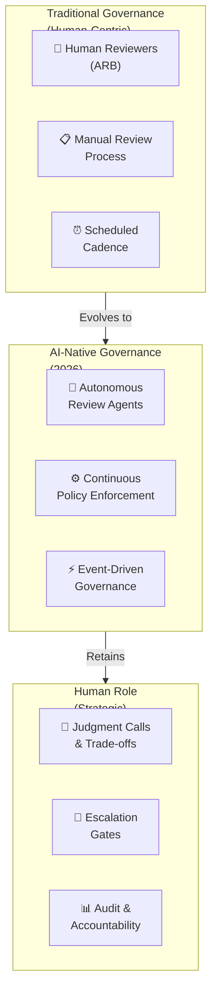

# AI-Native ARB & Enterprise Case Studies

From AI-assisted review to autonomous governance agents, continuous architecture validation, and self-healing governance — plus structured case studies from global banks, hyperscalers, and AI-first organizations.

Enterprise Architecture Review Board Handbook · Banking & Financial Services Edition

## Part A — The AI-Native Architecture Review Board

Everything in Volumes 1-6 describes governance as fundamentally a human deliberation process, assisted by tools. This part describes the next evolution genuinely underway in leading organizations as of 2026: governance where AI agents perform substantial portions of the review and enforcement work continuously, with humans retained for judgment calls, escalations, and accountability — not as a replacement for human governance, but as a structural shift in where human attention is spent.



AI-native governance: evolution from human-deliberation processes to AI-assisted continuous validation, with humans focused on judgment calls and accountability.

### A Grounding Caveat Before This Section

This is the most speculative and fastest-moving part of the entire handbook. Some patterns described here (architecture fitness functions, AI-assisted ADR drafting) are in solid production use today. Others (fully autonomous review agents with minimal human oversight) remain emerging practice with limited long-track-record evidence in regulated banking specifically, given the regulatory caution toward agentic AI noted in Volume 6, Section 11.4. Treat the more advanced patterns in this section as a credible direction to plan toward, not a current-state checklist to implement wholesale.

### 13.1 Autonomous Architecture Review Agents

An autonomous review agent performs an initial, automated pass over an architecture submission against the artifact catalog (Volume 4) and scorecards (Volume 5) — checking completeness, flagging deviations from reference architectures, crossreferencing the knowledge graph (Volume 3) for redundancy or conflict with in-flight initiatives — before a human reviewer ever sees the submission. The realistic, currently-achievable scope is triage and first-pass screening, surfacing what needs human judgment rather than rendering final approval decisions for anything architecturally significant.

| Review Task | Appropriate for Autonomous Agent? |
|---|---|
| Artifact completeness checking | Yes — fully automatable today |
| Reference architecture conformance scanning | Yes, with human review of flagged deviations |
| Capability redundancy detection | Yes, as a flag for human investigation, not an automatic rejection |
| Security/vulnerability scanning | Yes — already standard practice independent of AI-native governance specifically |
| Quality attribute trade-off judgment | Assisted, not autonomous — genuine trade-off calls remain human-judgment territory |
| Final approval for high-risk/novel architecture | No — human accountability remains essential, particularly given banking's regulatory posture (Volume 6) |

### 13.2 Architecture Graph Reasoning & Knowledge-Graph-Backed Reviews

Building on the knowledge graph foundation from Volume 3, AI agents can reason over the graph to answer questions a human reviewer would otherwise need hours of manual investigation to answer — "does this proposed architecture create a circular dependency with an in-flight initiative in another business unit," or "has this exact integration pattern failed before, and what was the root cause." This is the single highest-leverage near-term application of AI to architecture governance, because it operationalizes the lessons-learned and pattern-catalog disciplines from Volume 3 at a speed and consistency no human reviewer could match manually.

### 13.3 Continuous Architecture Validation &amp; Runtime Policy Enforcement

Extends the fitness function concept (Volume 2, Section 4.4) from periodic checks into always-on validation: policy-as-code rules continuously evaluated against the running production architecture, not just at deployment time. This directly closes the architecture-drift gap identified across multiple volumes (Volume 1's CAB overlap zone; Volume 3's living documentation discipline).

#### A Representative Policy-as-Code Pattern

```
policy: no-direct-database-access-cross-domain
description: >
  Services in one bounded-context domain must not directly query 
  another domain's database; cross-domain reads must go through 
  the owning domain's published API or event stream.
enforcement: continuous
scope: production + pre-production
action_on_violation: alert architecture-graph + page domain owner
severity: high
```

This is illustrative of the pattern, not a literal implementation — actual policy-as-code syntax depends on the specific enforcement tooling adopted.

### 13.4 Event-Driven Governance

Rather than governance triggered by a scheduled ARB meeting cadence, significant architecture-relevant events (a new service deployment, a dependency change, a data classification change) trigger automatic governance checks at the moment they occur. This shifts governance from a calendar-driven batch process to a continuous, event-driven one — directly addressing the "ARB review queue depth" diagnostic from Volume 1, Section 2.11, since routine, low-risk changes can be governed in near-real-time rather than queued for the next scheduled session.

### 13.5 Digital Twin of Enterprise Architecture

A continuously synchronized, queryable model of the entire enterprise architecture — effectively the knowledge graph (Volume 3) kept in near-real-time sync with actual running systems via telemetry, rather than manually updated. This enables simulation-based governance questions previously impractical to answer: "if we decommission this system, simulate the downstream impact" or "if this dependency fails, what's the actual blast radius based on current traffic patterns, not the documented-but-possibly-stale dependency map."

### 13.6 Self-Healing Architecture Governance

The most advanced pattern covered: governance systems that don't just detect drift or violations but can automatically remediate certain classes of issue — for example, automatically reverting a configuration change that violates a hard policy gate, or automatically opening a remediation ticket with a pre-populated fix for a known pattern of violation. This should be scoped very deliberately to low-risk, well-understood violation classes; self-healing applied to genuinely novel or high-stakes situations risks the system "fixing" something in a way that creates a worse problem than the one it solved, with no human in the loop to catch it.

### 13.7 Agent Swarms for Specialized Reviews

Rather than one general-purpose review agent, specialized agents handle different review domains in parallel — a security-focused agent, a cost-focused agent, a data-governance-focused agent — each reasoning within its domain expertise and surfacing findings to a coordinating layer (which may itself be an agent, with human oversight) that synthesizes a combined view for human reviewers. This pattern directly mirrors, and could eventually help operationalize, the multi-body parallel review pattern recommended for AI Solution Reviews in Volume 1, Section 1.2 (Overlap Zone 2).

### 13.8 AI-Generated Artifacts

| Artifact | Current Maturity for AI Generation |
|---|---|
| AI-generated ADRs | Reasonably mature — an agent with access to the decision context, options considered, and relevant prior ADRs can draft a strong first version for human refinement and sign-off |
| AI-generated executive summaries | Mature — summarizing a complex architecture review into a business-stakeholder-readable summary is a well-suited task for current AI capability, with human review for accuracy and tone |
| AI-generated remediation plans | Emerging — viable for well-understood, previously-seen issue classes; less reliable for genuinely novel architectural problems where the remediation requires real engineering judgment |

### 13.9 AI Confidence Scoring &amp; Human Override Mechanisms

Any AI-assisted or AI-autonomous governance component should expose a calibrated confidence score alongside its output, and — critically — that confidence score should be empirically validated against actual outcomes over time, not just self-reported by the model (this connects directly to the Trustworthiness quality attribute in Volume 4, Section 8.2). Human override must be a first-class, low-friction capability, not a buried escape hatch — if overriding an AI governance recommendation requires more effort than accepting it, reviewers will rubber-stamp AI output even when their judgment disagrees, which defeats the purpose of retaining human oversight at all.

### 13.10 Governance Audit Trails for AI-Native Governance

A meta-requirement across everything in this section: every AI-assisted or AI-autonomous governance action needs its own audit trail — what the AI agent recommended, what confidence it expressed, what a human did with that recommendation (accepted, modified, overrode), and why. In a banking context specifically (Volume 6), this audit trail is not optional polish; it is likely to become the artifact a regulator examines first when assessing whether AI-native governance itself is being responsibly operated, given the increasing regulatory attention to AI governance generally.

## Part B — Enterprise Case Studies

### A Note on How to Read These Case Studies

These are composite, illustrative case studies built from publicly observable patterns across the banking and technology industry, structured to teach the governance dynamics covered in Volumes 1-7 — they are not verbatim accounts of specific named institutions' internal decisions, since that level of internal detail is not publicly available for most real organizations. Use them as worked examples of the patterns, not as factual claims about any specific named company's internal governance history. Where a specific real, publicly-documented event is referenced, it is noted as such.

### 14.1 Global Bank — Federated ARB Adopted Post-Merger

| Dimension | Detail |
|---|---|
| **Business context** | A large bank formed through merger of two mid-size institutions, each with its own legacy core banking platform and architecture governance practice |
| **Organization structure** | Initially ran a Centralized ARB to force standardization during integration; transitioned to Federated (Volume 1, Section 2.2) after 18 months once the review queue became the binding constraint on integration delivery velocity |
| **Architecture challenges** | Two parallel core banking platforms, duplicate customer data models, inconsistent security architecture standards inherited from each legacy entity |
| **Review process** | Centralized phase required all architecturally significant decisions through a single ARB; Federated phase delegated business-unit-local decisions to domain ARBs, retaining only cross-platform and enterprise-standard decisions centrally |
| **Decisions made** | Standardized on one core banking platform over a 3-year migration; established a single enterprise customer data model with both legacy systems migrating toward it incrementally rather than a big-bang cutover (strangler fig pattern, Volume 3 Section 5.5) |
| **Outcomes** | Successfully consolidated within the planned timeline, though the Centralized phase created significant integration-team frustration that contributed to early attrition of integration architects |
| **Lessons learned** | Centralized governance is the right starting choice for forced post-merger standardization, but the transition trigger to Federated should be planned and communicated upfront rather than reactively decided once frustration peaks |
| **What should be replicated** | Explicit, time-boxed commitment to transition from Centralized to Federated, with the transition criteria defined before the Centralized phase even begins |
| **What should be avoided** | Allowing the Centralized phase to run indefinitely without a defined exit trigger, which is what generates the architect attrition risk |

### 14.2 Hyperscaler — Platform-First Governance at Massive Scale

| Dimension | Detail |
|---|---|
| **Business context** | A cloud hyperscaler with thousands of internal engineering teams building on shared internal platforms |
| **Organization structure** | Platform-First governance (Volume 1, Section 2.5) — the overwhelming majority of architecture decisions are made by what the internal platform allows by default, with human review reserved for genuinely novel patterns |
| **Architecture challenges** | Review-board-based governance at this scale would be structurally impossible — the volume of architecturally-relevant decisions vastly exceeds any plausible human review capacity |
| **Review process** | Automated fitness functions (Volume 2, Section 4.4) and continuous policy enforcement (Volume 7, Section 13.3) handle the large majority of governance; a much smaller central architecture function focuses exclusively on platform evolution and genuinely cross-cutting strategic decisions |
| **Decisions made** | Heavy, sustained investment in internal developer platform tooling as a governance mechanism in itself, treating "make the right way the easy way" as the primary governance lever rather than review gates |
| **Outcomes** | Achieves governance at a scale that would be unachievable through review-board mechanisms alone, at the cost of very high platform engineering investment as a precondition |
| **Lessons learned** | Platform-First governance is not simply "skip governance" — it requires arguably more architectural rigor than review-board models, just expressed as platform capability rather than review checklists |
| **What should be replicated** | Treating golden-path adherence as a measurable, tracked metric rather than an assumed outcome of having built the golden path |
| **What should be avoided** | Assuming this model transfers directly to organizations without comparable platform engineering investment capacity — most banks are not positioned to fund platform engineering at hyperscaler intensity, and attempting to copy the governance model without the underlying investment produces the "golden path tunnel vision" anti-pattern (Volume 1, Section 2.5) without the offsetting benefits |

### 14.3 Digital-Native Challenger Bank — Embedded Architects at Speed

| Dimension | Detail |
|---|---|
| **Business context** | A digital-only challenger bank competing on speed of feature delivery against incumbent banks with heavier governance overhead |
| **Organization structure** | Embedded Architects model (Volume 1, Section 2.3) with a lightweight architecture guild for pattern-sharing but no formal central approval gate for most decisions |
| **Architecture challenges** | Maintaining regulatory audit-readiness (Volume 6) without the documentation rigor that a heavier governance model would naturally produce as a byproduct |
| **Review process** | Deliberately instrumented architecture-as-code and automated ADR generation from version control history specifically to compensate for the audit-trail gap inherent in a low-ceremony model |
| **Decisions made** | Invested early in automated compliance evidence generation rather than manual documentation discipline, recognizing that embedded teams would not reliably maintain manual documentation under delivery pressure |
| **Outcomes** | Achieved materially faster feature delivery than incumbent competitors while passing regulatory examinations, though this required sustained, deliberate tooling investment that is easy to underestimate at the outset |
| **Lessons learned** | Low-ceremony governance models are viable in regulated banking, but only with proportionally higher investment in automated evidence generation — the audit-readiness requirement does not go away just because the review process is lighter |
| **What should be replicated** | Front-loading the automated compliance tooling investment before scaling the embedded model, rather than treating it as a retrofit |
| **What should be avoided** | Adopting a low-ceremony model purely for delivery speed without the matching tooling investment, which creates exactly the audit-trail gap regulators are most likely to flag |

### 14.4 Fortune 100 Enterprise — Business Capability Governance Post-Acquisitions

| Dimension | Detail |
|---|---|
| **Business context** | A large diversified financial services enterprise grown through over a decade of acquisitions, carrying significant application portfolio redundancy |
| **Organization structure** | Adopted Business Capability Governance (Volume 1, Section 2.8) specifically to address capability redundancy across acquired entities, layered on top of an existing Federated ARB |
| **Architecture challenges** | Dozens of overlapping systems independently implementing similar capabilities (e.g., multiple "customer onboarding" implementations across acquired business lines) |
| **Review process** | Built a capability map (Volume 3, Part B) as the foundational artifact, then required any new investment request to demonstrate it had checked for capability overlap before approval |
| **Decisions made** | Prioritized consolidation investment by capability redundancy severity and cost-of-maintaining-duplication, using the architecture economics framework from Volume 2 |
| **Outcomes** | Identified material cost-reduction opportunity through consolidation, though the multi-year consolidation programs this enabled required sustained executive sponsorship that outlasted multiple reorganizations to actually deliver |
| **Lessons learned** | The capability map's value is realized only when paired with governance teeth (mandatory overlap-checking before new investment approval) — a capability map without that enforcement mechanism becomes the "built once, never updated" anti-pattern flagged in Volume 1, Section 2.8 |
| **What should be replicated** | Tying capability map currency directly to the ARB intake process (Volume 3, Section 6.4) rather than treating it as a separate maintenance exercise |
| **What should be avoided** | Attempting to map the full enterprise to full depth before starting consolidation work — the depth-first, highest-value-domain-first approach (Volume 3, Section 6.4) delivered value faster and sustained sponsorship better |

### 14.5 AI-First Startup Acquired by a Bank — AI Governance Board Integration

| Dimension | Detail |
|---|---|
| **Business context** | A bank acquiring a smaller AI-native fintech to accelerate its own AI capability, needing to integrate the acquired team's fast-moving AI development practice into the bank's regulated governance environment |
| **Organization structure** | The acquired team initially operated something close to AI-First Governance (Volume 1, Section 2.9); integration required layering the bank's AI Governance Board, Model Risk Committee, and Responsible AI Council structures on top without destroying the team's delivery velocity |
| **Architecture challenges** | The acquired team's existing AI models and architectures had not been built with explainability or fairness-testing requirements in mind, requiring retrofit work the team had not anticipated |
| **Review process** | A phased integration: existing production models were grandfathered with a remediation timeline rather than required to pass full review immediately, while new development was required to meet full governance requirements from day one of integration |
| **Decisions made** | Established a dedicated "AI Solution Review" combined intake (Volume 1, Section 1.2) specifically to prevent the acquired team's velocity from being destroyed by sequential routing through four separate governance bodies |
| **Outcomes** | Successfully retained the majority of the acquired team's engineering talent through the integration, which is a commonly-cited failure mode in fintech acquisitions where heavy-handed governance imposition drives rapid attrition of the acquired talent the acquisition was meant to retain |
| **Lessons learned** | Grandfathering existing systems with a clear, honestly-resourced remediation timeline is more effective than demanding immediate full compliance, both for talent retention and for actually getting the remediation done properly rather than rushed |
| **What should be replicated** | Building the combined AI Solution Review intake before the acquisition closes, so the acquired team experiences the bank's governance model as a single coherent process from day one rather than four uncoordinated review bodies |
| **What should be avoided** | Treating governance integration as a checkbox compliance exercise disconnected from talent retention strategy — the two are inseparable in practice for any acquisition-driven integration |
