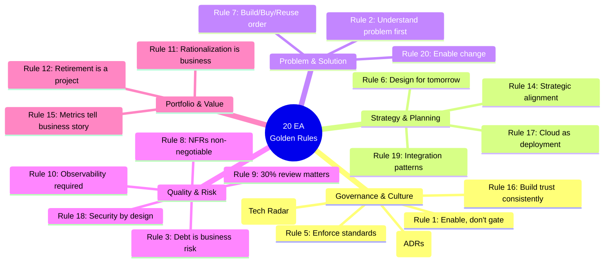

# Best Practices & Jargon Guide

**Pitch to Retire — Terminology, Standards &amp; Golden Rules**

The definitive reference guide for EA practitioners, business stakeholders, and delivery teams. Part 1 covers the 20 EA Golden Rules. Part 2 is an A–Z jargon buster of 60+ enterprise architecture terms, acronyms, and frameworks used across the full capability lifecycle.

---

## Part 1 — The 20 EA Golden Rules

These twenty principles represent the distilled best practices of enterprise architecture across strategy, governance, delivery, and portfolio management. They are applicable across all seven lifecycle stages.

The 20 Golden Rules organized by lifecycle theme: governance, strategy, problem-solving, quality, and portfolio management.

### 1. Architecture Is an Enabling Function, Not a Gatekeeper

The EA exists to accelerate value delivery, not to slow it down. Every governance process must add more value than the friction it creates. If your ARB is seen as a bureaucratic blocker, the architecture function has failed.

**Do:**
- Make governance fast, transparent, and outcome-focused
- Publish architecture principles and standards so teams can self-serve
- Measure EA value by business outcomes, not documents produced

**Don't:**
- Don't make the ARB a committee that exists to say no
- Don't add process steps unless they prevent a real, recurring failure

### 2. Never Approve a Solution Before Understanding the Problem

The most expensive architectural mistakes begin when a sponsor arrives with a pre-chosen solution and EA rubber-stamps it. The pitch stage exists to validate the problem, not to confirm the sponsor's preferred answer.

**Do:**
- Always start with a problem statement signed off by the sponsor
- Challenge solution assumptions respectfully and with data
- Run the build/buy/reuse assessment before any technology is selected

**Don't:**
- Don't let relationship pressure bypass the intake assessment
- Don't let urgency substitute for understanding

### 3. Technical Debt Is a Business Risk — Treat It as One

Technical debt is not a technical problem. It is a business liability that compounds over time, reducing agility, increasing risk, and raising operating costs. The EA must make debt visible to business leaders in business language.

**Do:**
- Maintain a technical debt register with business impact scores
- Present debt as risk-adjusted cost in every portfolio review
- Set a debt reduction target as a formal KPI (e.g. 10% per quarter)

**Don't:**
- Don't allow 'we'll fix it later' without a named owner and date
- Don't bury debt in technical jargon — quantify it in dollars and risk

### 4. Every Architecture Decision Must Have a Record

Architecture Decision Records (ADRs) are the institutional memory of the organisation's technology choices. Without them, the same debates happen repeatedly and institutional knowledge walks out the door with departing staff.

**Do:**
- Write ADRs in plain language: context, options, decision, consequences
- Publish ADRs in a shared, searchable repository accessible to all engineers
- Review ADRs at each annual rationalisation cycle — some will need updating

**Don't:**
- Don't allow verbal ARB decisions — all decisions must be written
- Don't write ADRs that describe what was built — write why

### 5. Standards Must Be Enforced, Not Just Published

A technology standard that is not enforced is a wish list. Governance without teeth creates the illusion of control while architectural sprawl continues unchecked. Enforcement must be automated wherever possible.

**Do:**
- Implement architecture fitness functions in delivery pipelines
- Include standards compliance in the pre-production sign-off gate
- Track and report the architecture adoption rate as a KPI

**Don't:**
- Don't publish standards and hope teams read them
- Don't grant exceptions without a named owner and resolution date

### 6. Design for the Organisation You Are Becoming, Not the One You Are

The architecture must support the organisation's strategic trajectory, not just its current state. A three-to-five year architecture roadmap grounded in strategic themes prevents constant reactive rebuilding.

**Do:**
- Maintain a 1/3/5 year architecture roadmap aligned to corporate strategy
- Review and recalibrate roadmaps quarterly, not just annually
- Map all major initiatives to at least one strategic theme

**Don't:**
- Don't design for today's volume if the strategy calls for 10x growth
- Don't let the roadmap become a wish list with no prioritisation

### 7. Build/Buy/Reuse — In That Order of Scrutiny

Before committing to a build or a buy, the EA must genuinely explore reuse. The most sustainable architectures are built on a lean portfolio of well-used platforms, not a collection of specialist point solutions.

**Do:**
- Check the existing portfolio before every intake assessment
- Challenge vendor selections with a reuse analysis
- Track and reduce the number of duplicate capabilities in the portfolio

**Don't:**
- Don't allow different parts of the business to solve the same problem independently
- Don't buy a new tool when an existing one, properly configured, would suffice

### 8. Non-Functional Requirements Are Not Optional

NFRs define the quality of the system, not just its features. An application that works but fails under load, cannot be recovered in an incident, or leaks data is a liability, not an asset. NFRs must be defined before design, not discovered after launch.

**Do:**
- Define availability, RTO, RPO, performance, and scalability at design time
- Make NFR testing mandatory for every pre-production gate
- Tier NFRs by system criticality (Tier 1/2/3 requirements differ)

**Don't:**
- Don't treat NFRs as 'nice to haves' to be addressed post-launch
- Don't allow delivery teams to set their own NFRs without EA validation

### 9. The 30% Review Is Your Most Cost-Effective Governance Investment

A structural architectural mistake caught at 30% of delivery costs a fraction of what it costs to fix at 90% or in production. The 30% architecture review is not a status update — it is a diagnostic intervention.

**Do:**
- Schedule the 30% review as a mandatory delivery milestone
- Focus on structural decisions: system boundaries, integration patterns, data ownership
- Document findings as formal exceptions requiring resolution before 70% gate

**Don't:**
- Don't cancel the 30% review due to delivery pressure
- Don't allow it to become a PowerPoint presentation — review actual implementation

### 10. Observability Is Architecture, Not an Afterthought

A system you cannot see is a system you cannot manage. Logging, monitoring, alerting, and distributed tracing must be designed in from the start and validated before any system enters production.

**Do:**
- Include observability requirements in the SAD as a mandatory NFR
- Validate the observability stack in the pre-production compliance sign-off
- Define SLO dashboards for every Tier-1 system

**Don't:**
- Don't allow a system to go live without a working monitoring dashboard
- Don't leave observability to the operations team to figure out post-launch

### 11. Application Rationalisation Is a Business Conversation, Not a Technical One

Business owners must be active participants in rationalisation decisions. The EA provides the technical health score; the business provides the value score. Neither can make a rationalisation decision alone.

**Do:**
- Run joint scoring workshops with business owners annually
- Use usage data, integration counts, and revenue attribution to anchor value discussions
- Present rationalisation recommendations in business language, not technical

**Don't:**
- Don't make rationalisation decisions without business buy-in
- Don't let technical health scores dominate — a healthy system with no business value is still waste

### 12. Retirement Is a Project — Resource and Govern It as One

Decommissioning a system is as complex as deploying a new one. Dependency resolution, data migration, contract termination, and access removal all require dedicated effort. Unmanaged retirements create orphaned integrations, data breaches, and zombie cost.

**Do:**
- Give every retirement a project code, a project manager, and a timeline
- Mandate 90-day notice periods to all dependent teams
- Make access removal the final mandatory step in every decommission runbook

**Don't:**
- Don't assume switching off a system is simply a matter of turning it off
- Don't allow a retirement to start without a complete dependency map

### 13. Use Your Technology Radar to Prevent Sprawl

The Technology Radar (Adopt / Trial / Hold / Retire) is the EA's most powerful tool for controlling technology sprawl. Every technology in the estate should have a published position, reviewed annually.

**Do:**
- Publish and socialise the Technology Radar organisation-wide
- Reject any ARB submission proposing a technology on the 'Hold' or 'Retire' list
- Review and publish an updated radar at least annually

**Don't:**
- Don't let teams adopt new technologies without ARB awareness
- Don't allow the radar to become stale — an outdated radar is worse than none

### 14. Strategic Alignment Is the EA's North Star

Every architecture decision, every investment recommendation, and every rationalisation choice must be traceable to at least one strategic theme. An EA who cannot articulate the strategic rationale for a decision is operating as a technical function, not a strategic one.

**Do:**
- Map every initiative to a strategic theme at intake
- Report strategic alignment % as a headline EA KPI
- Challenge any initiative that cannot be mapped to a strategic objective

**Don't:**
- Don't approve initiatives that have no strategic justification
- Don't let operational pressure drive architecture decisions that contradict strategy

### 15. EA Metrics Must Tell a Business Story

Activity metrics (reviews completed, documents produced) do not demonstrate value. Business outcome metrics (TCO reduced, time to market improved, risk incidents prevented) do. The EA must measure and communicate in the language of business.

**Do:**
- Maintain a dual dashboard: EA activity metrics + business outcome metrics
- Present EA value in terms of cost saved, risk reduced, and speed improved
- Tie EA KPIs to the corporate OKR cycle

**Don't:**
- Don't report architecture review counts as a measure of impact
- Don't allow the EA function to become invisible by failing to communicate value

### 16. Stakeholder Trust Is Built Through Consistency, Not Perfection

Business leaders do not trust EA because it produces perfect architectures — they trust it because it is consistent, transparent, and delivers what it promises. Reliability over time is the foundation of strategic influence.

**Do:**
- Meet every governance commitment and communicate early when you cannot
- Publish architecture principles and stick to them consistently
- Follow up on every ARB condition with the owner — do not let them drift

**Don't:**
- Don't make governance exceptions under business pressure without documenting the risk
- Don't change architectural positions without communicating the reasoning

### 17. Cloud Is a Deployment Model, Not a Strategy

Cloud adoption must be governed by the same architectural rigour as any other technology decision. 'Move to cloud' is not a strategy. The EA must define a Cloud Adoption Framework that covers placement policy, cost governance, security posture, and operating model.

**Do:**
- Define and publish a cloud placement policy (public/private/hybrid criteria)
- Implement FinOps governance to prevent cloud cost sprawl
- Validate cloud architecture against the Well-Architected Framework for every design

**Don't:**
- Don't allow teams to provision cloud resources outside of approved patterns
- Don't mistake cloud migration for modernisation — a legacy app on cloud is still legacy

### 18. Security Architecture Is Non-Negotiable

Security is not a feature to be added later. The EA must ensure that every design incorporates security-by-design principles: zero trust posture, least privilege access, encryption at rest and in transit, and comprehensive audit logging.

**Do:**
- Make security architecture review mandatory at the Design gate
- Require penetration testing or DAST scanning before every production gate
- Track open security architecture findings by severity as a portfolio KPI

**Don't:**
- Don't allow 'we'll add security hardening post-launch'
- Don't treat security as the CISO's problem — it is a shared EA responsibility

### 19. Integration Patterns Are the Connective Tissue of the Enterprise

Poorly governed integration is the root cause of most enterprise architectural crises. Point-to-point integrations create fragile, unmaintainable webs. The EA must enforce approved integration patterns (API-first, event-driven, canonical data model) as non-negotiable standards.

**Do:**
- Publish and enforce an enterprise integration pattern catalogue
- Mandate API-first design for all new integrations
- Maintain an integration dependency register and review it quarterly

**Don't:**
- Don't allow point-to-point integrations between production systems
- Don't allow integrations to be built without API contracts reviewed by EA

### 20. Great EAs Enable Change — They Do Not Resist It

The most common failure mode of enterprise architecture functions is becoming the department of 'no'. EA must continuously evolve its standards, patterns, and frameworks to embrace new paradigms — AI, platform engineering, composable architecture — before they arrive uninvited through the back door.

**Do:**
- Maintain a formal EA innovation backlog reviewed quarterly
- Pilot new paradigms through controlled trials on low-risk initiatives
- Invite emerging technology perspectives into the Technology Radar process

**Don't:**
- Don't dismiss new approaches without structured evaluation
- Don't allow the EA function to become a museum of past decisions

---

## Part 2 — EA Jargon Buster (A–Z)

A reference glossary of 60+ terms, acronyms, and frameworks used in Enterprise Architecture practice. Each entry includes a plain-language definition and an 'in practice' note showing how the term is used in real EA conversations.

### Governance &amp; Process

**ADR — Architecture Decision Record**

A short document capturing the context, options considered, decision made, and consequences of a significant architectural choice. ADRs create an auditable trail of architectural reasoning.

*In practice: "The ADR for the API gateway selection explains why we chose Kong over AWS API Gateway — pull it up before we revisit that decision."*

**ARB — Architecture Review Board**

A governance body that reviews and approves architecture proposals, sets standards, and manages architectural risk across the enterprise. The ARB is the EA's primary decision-making forum.

*In practice: "This proposal needs to go to the ARB before we commit budget — it touches three Tier-1 systems."*

**AIA — Architecture Intake Assessment**

The output document of the Pitch stage. A structured 1–2 page assessment covering the business problem, landscape findings, build/buy/reuse recommendation, and initial risk flags.

*In practice: "The AIA shows two existing systems could satisfy this need — let's validate that with the business owner before writing a business case."*

**AFC — Architecture Fitness Function**

An automated test or metric that objectively assesses whether an architecture characteristic (e.g. coupling, security posture) conforms to defined standards. Borrowed from evolutionary architecture practice.

*In practice: "We have an AFC in the CI pipeline that fails the build if any service exceeds the approved response time threshold."*

**SAD — Solution Architecture Document**

The primary design artefact produced during the Design stage. Covers functional requirements, non-functional requirements, integration architecture, data flows, and security design.

*In practice: "The SAD for this integration needs a sequence diagram — the ARB won't approve without seeing the message flow."*

**CoE — Centre of Excellence**

A team of subject matter experts who define, maintain, and promote best practices in a specific domain (e.g. Data CoE, Cloud CoE, Integration CoE). CoEs feed into EA standards.

*In practice: "The Cloud CoE owns the Well-Architected review process — loop them in before the Design gate."*

### Architecture Frameworks

**TOGAF — The Open Group Architecture Framework**

The most widely adopted enterprise architecture framework. Provides the Architecture Development Method (ADM) — a cycle of phases from architecture vision through implementation governance.

*In practice: "Our EA lifecycle is TOGAF-inspired, but we've simplified the ADM to fit our delivery cadence."*

**ArchiMat — Architecture Modelling Language**

An open standard visual notation for enterprise architecture diagrams. Covers business, application, and technology layers with standardised symbols and relationships.

*In practice: "Use ArchiMate notation for the context diagram — it needs to be consistent with our EA repository."*

**C4 Model — Context, Container, Component, Code Model**

A lightweight, developer-friendly notation for software architecture diagrams with four levels of abstraction: System Context, Containers, Components, and Code.

*In practice: "A C4 Level 1 context diagram is mandatory in every SAD — it shows external actors and system boundaries."*

**ITIL — IT Infrastructure Library**

A framework of best practices for IT service management (ITSM). Relevant to EA in the Operate stage — particularly incident management, change management, and service design.

*In practice: "The decommission plan needs to follow the ITIL change management process — raise an RFC before you switch anything off."*

**Zachman — Zachman Framework**

A 6x6 matrix framework for organising architectural artefacts by stakeholder perspective (What, How, Where, Who, When, Why) and abstraction level. Useful for classifying EA documentation.

*In practice: "The Zachman framework helps us ensure we've addressed every dimension of the architecture, not just the technical view."*

**SAFe — Scaled Agile Framework**

A framework for applying agile and lean principles at enterprise scale. The EA function must align architecture governance with SAFe's PI Planning and ART cadences in SAFe organisations.

*In practice: "Our EA governance checkpoints are now embedded in the SAFe PI Planning events rather than separate review meetings."*

### Technology Strategy

**Tech Radar — Technology Radar**

A framework (popularised by ThoughtWorks) that classifies technologies into four rings: Adopt (recommended), Trial (experiment cautiously), Hold (pause new adoption), Retire (decommission existing use).

*In practice: "Check the tech radar before proposing any new technology in an ARB submission — if it's on 'Hold', you'll need a compelling case."*

### Risk &amp; Compliance

### Measurement &amp; Value

**MTTR / MTTF — Mean Time to Recover / Mean Time to Failure**

MTTR: average time to restore a failed system. MTTF: average time between system failures. Both are operational reliability KPIs tracked in the Operate stage.

*In practice: "The payments platform MTTR is 47 minutes — we need to get that below 30 minutes to meet the new SLA commitment."*

**Maturity Model — Architecture Capability Maturity Model**

A framework that assesses the capability maturity of an architecture function or business domain across levels from Initial (ad hoc) to Optimising (continuously improving).

*In practice: "The rationalisation assessment put the customer data domain at maturity Level 2 — our roadmap targets Level 3 by next year."*

### Delivery &amp; Agility

### Portfolio Management

**App Rat — Application Rationalisation**

The process of evaluating every system in the portfolio on business value and technical health to determine its lifecycle disposition: Retain, Invest, Migrate, Consolidate, or Retire.

*In practice: "The annual app rat exercise identified 14 candidates for retirement — that's £2.4M in run cost we can eliminate."*

**Zombie System**

A production system that is no longer actively used but continues to draw operating cost because no one has formally retired it. A symptom of weak portfolio governance.

*In practice: "That reporting system hasn't had a login in 18 months but we're still paying £40k a year in hosting — it's a zombie, let's start the retirement process."*

## Related

- [Enterprise Architecture Glossary & Cheat Sheet](69-ea-glossary-cheatsheet.md) — the companion glossary for the jargon covered here.

