# ENTERPRISE ARCHITECTURE Glossary & Cheat Sheet

Distinguished Architect / CTO / Chief AI Architect Edition

**300+ Terms · Regulation Quick Reference · PQC Migration Guide · AI Security Threat Map · Identity Patterns · Interview Frameworks · DORA Compliance Checklist · EU AI Act Tier Guide · Distinguished vs. Principal Signals**

Companion to: Volume 1 (EA Foundations) · Volume 2 (Delta: Emerging Topics) · Volume 3 (CTO & AI)

Targeting: Microsoft · Google · JPMorgan · Goldman Sachs · Barclays · HSBC · Visa · ServiceNow

## Document Coverage Map

```mermaid
graph TB
    GA["GLOSSARY<br/>300+ Terms<br/>A-Z Coverage"]
    
    GA --> SEC["Security &<br/>Cryptography<br/>AES-256, ECDSA,<br/>PQC, ML-KEM,<br/>ML-DSA"]
    GA --> ID["Identity &<br/>Access<br/>OIDC, SAML,<br/>FIDO2, PKI,<br/>mTLS"]
    GA --> CLOUD["Cloud &<br/>Platforms<br/>K8s, IaC,<br/>Service Mesh,<br/>API Gateway"]
    GA --> FRAME["Frameworks &<br/>Governance<br/>TOGAF, Team Topo,<br/>ARB, DORA"]
    GA --> REG["Regulations<br/>GDPR, EU AI Act,<br/>DORA, SR 11-7,<br/>PCI-DSS"]
    GA --> AI["AI & ML<br/>LLM, RAG,<br/>Prompt Injection,<br/>Model Risk"]
    
    CS["CHEAT SHEETS"]
    CS1["1: Regulatory<br/>Quick Reference"]
    CS2["2: PQC<br/>Migration Guide"]
    CS3["3: DORA<br/>Compliance"]
    CS4["4: EU AI Act<br/>Risk Tiers"]
    CS5["5: Cloud<br/>Architecture"]
    CS6["6: AI Security<br/>Threat Map"]
    CS7["7: Identity &<br/>Access Patterns"]
    CS8["8: Interview<br/>Frameworks"]
    CS9["9: Distinguished<br/>Architect Signals"]
    
    CS --> CS1 & CS2 & CS3 & CS4 & CS5 & CS6 & CS7 & CS8 & CS9
    
    style GA fill:#e1f5ff
    style CS fill:#f3e5f5
    style SEC fill:#fff3e0
    style ID fill:#f3e5f5
    style CLOUD fill:#e8f5e9
    style FRAME fill:#fce4ec
    style REG fill:#ffe0b2
    style AI fill:#f1f8e9
```

**Diagram 1: Content Architecture** — This glossary is organized as a master reference covering security, identity, cloud platforms, frameworks, regulations, and AI/ML domains. Nine companion cheat sheets distil complex topics into quick-reference tables for architects.

## TABLE OF CONTENTS

- **Glossary (A–Z)** — 300+ terms covering AI, Security, Identity, Cloud, EA Frameworks, Regulations, Protocols
- **Cheat Sheet 1** — Regulatory Quick Reference (DORA, EU AI Act, SR 11-7, GDPR, PCI-DSS, BCBS 239, NIS2, CSRD)
- **Cheat Sheet 2** — Post-Quantum Cryptography Migration Guide (Current standards, vulnerable algorithms, migration targets, NIST FIPS status)
- **Cheat Sheet 3** — DORA Compliance Checklist (All DORA requirements with architecture controls and evidence required)
- **Cheat Sheet 4** — EU AI Act Tier Guide (Risk categories, key obligations, penalties, architecture implications)
- **Cheat Sheet 5** — Cloud Architecture Patterns (8 essential patterns with components and when-to-use guidance)
- **Cheat Sheet 6** — AI Security Threat Map (11 AI-specific threats with attack vectors, defences, and detection signals)
- **Cheat Sheet 7** — Identity & Access Patterns (8 identity patterns with standards, use cases, and token structures)
- **Cheat Sheet 8** — Interview Frameworks (9 essential frameworks with structure and common pitfalls)
- **Cheat Sheet 9** — Distinguished Architect Signals (10 behaviour dimensions: Principal vs. Distinguished comparison)

---

## GLOSSARY

Key terms used across all four volumes. **Color coding:** Security · Risk · Architecture/Platform · Identity/Protocol · Governance/Framework · Operations/SRE · AI/ML · Financial/Cloud

### A

**ABAC** — Attribute-Based Access Control. Authorisation policy where access decisions are based on attributes of the user, resource, and environment rather than predefined roles.

**ADR** — Architecture Decision Record. A short document capturing an architecture decision, its context, the options considered, and the rationale for the choice made.

**AES-256** — Advanced Encryption Standard with 256-bit key. Symmetric block cipher — quantum-resistant. Preferred encryption standard for data at rest.

**AIOps** — Artificial Intelligence for IT Operations. Using ML to automate IT operations tasks: anomaly detection, root cause analysis, and autonomous remediation.

**API Economy** — Business model where APIs are treated as products that enable third-party development, monetisation, and ecosystem creation.

**API Gateway** — Entry point for all API traffic that enforces: authentication, authorisation, rate limiting, routing, transformation, and observability.

**ARB** — Architecture Review Board. Governance body that reviews and approves significant architecture decisions and proposals.

**Async API** — AsyncAPI specification. Open standard for defining event-driven, message-based APIs — the OpenAPI equivalent for asynchronous systems.

### B

**BCBS 239** — Basel Committee Banking Supervision Principle 239. Regulation governing risk data aggregation and risk reporting capabilities for systemically important banks.

**BIAN** — Banking Industry Architecture Network. Framework of standardised banking service domains and service operations for financial services interoperability.

**Blast Radius** — The maximum scope of damage from a security incident or system failure. Architectural goal: minimise blast radius through isolation, segmentation, and least privilege.

**BCP** — Business Continuity Plan. Plan ensuring critical business functions can continue during and after a disaster.

**Build vs. Buy** — Architecture decision framework: should a capability be built in-house (differentiation, control) or purchased (speed, commodity)?

### C

**C2PA** — Coalition for Content Provenance and Authenticity. Standard for cryptographically signing AI-generated content to verify its origin.

**CAIO** — Chief AI Officer. Executive responsible for enterprise AI strategy, governance, and deployment.

**CIAM** — Customer Identity and Access Management. Identity platform managing external customer identities, authentication, and consent.

**Circuit Breaker** — Design pattern that prevents cascading failures by stopping calls to a failing dependency after a failure threshold is exceeded.

**CloudEvents** — CNCF specification standardising the structure of events generated by cloud services — enables portability across event brokers.

**CMDB** — Configuration Management Database. Repository of all IT assets (hardware, software, services) and their relationships.

**Conway's Law** — Observation by Melvin Conway: organisations design systems that mirror their own communication structure. Architectural implication: the org chart determines the architecture.

**CRQC** — Cryptographically Relevant Quantum Computer. A quantum computer powerful enough to break current public-key cryptography (RSA, ECDSA). Estimated arrival: 2028-2031.

**CSRD** — Corporate Sustainability Reporting Directive. EU directive mandating large companies report on environmental, social, and governance factors including technology carbon emissions (from 2025).

**CVE** — Common Vulnerabilities and Exposures. Standardised list of publicly known software vulnerabilities. CVSS score 0-10 quantifies severity.

**CycloneDX** — OWASP SBOM standard. Machine-readable format for Software Bill of Materials — widely adopted alongside SPDX.

### D

**Data Mesh** — Architectural pattern where data ownership and quality responsibility is distributed to domain teams, with a central data platform providing self-service infrastructure.

**DAST** — Dynamic Application Security Testing. Security testing method that tests a running application from outside, simulating real attacks.

**DR** — Disaster Recovery. Processes and technologies for restoring IT systems and data after a major failure or disaster.

**DORA (DevOps)** — DevOps Research and Assessment. Research programme identifying four key metrics of software delivery performance: Deployment Frequency, Lead Time, MTTR, Change Failure Rate.

**DORA (EU)** — EU Digital Operational Resilience Act. Regulation mandating operational resilience for EU financial institutions: ICT risk management, third-party risk, incident reporting, resilience testing. In force 2025.

**DP-SGD** — Differentially Private Stochastic Gradient Descent. Training algorithm that adds calibrated noise to gradients to prevent training data memorisation and limit data poisoning impact.

**DTO** — Digital Twin of the Organisation. A live, computable model of the enterprise — systems, capabilities, costs, risks, dependencies — enabling real-time scenario analysis.

### E

**ECDSA** — Elliptic Curve Digital Signature Algorithm. Current standard for digital signatures — quantum-vulnerable. To be replaced by ML-DSA (CRYSTALS-Dilithium) under NIST PQC standards.

**EDA** — Event-Driven Architecture. Architecture pattern where services communicate via events rather than direct calls — enables loose coupling and real-time processing.

**EU AI Act** — EU Artificial Intelligence Act. World's first comprehensive AI regulation. Classifies AI by risk tier (unacceptable, high, limited, minimal). High-risk (Annex III) enforcement: December 2027 (deferred from Aug 2026 by the Digital Omnibus); Art. 50 transparency from August 2026.

**Event Mesh** — Distributed event routing infrastructure connecting multiple event brokers across clouds and regions. Enables global event delivery.

### F

**FIDO2** — Fast Identity Online 2. Authentication standard enabling passwordless login using public-key cryptography. Basis for passkeys.

**FinOps** — Cloud Financial Operations. Practice of optimising cloud costs through engineering, finance, and business alignment. Extended to AI FinOps for LLM token cost governance.

**Fitness Function** — Automated test that measures an architecture characteristic (e.g., coupling, latency, security posture). Used to govern architectural drift.

### G

**GDPR** — General Data Protection Regulation. EU data protection law governing personal data processing. Article 22: rights against solely automated decisions. Article 17: right to erasure.

**GPAI** — General Purpose AI. EU AI Act category for AI models trained at large scale capable of performing many tasks (e.g., GPT-4, Claude). Subject to specific transparency obligations.

**GraphQL** — Query language for APIs that allows clients to request exactly the data they need. Alternative to REST for complex data graphs.

### H

**HITL** — Human-in-the-Loop. Governance pattern where human review or approval is required at specified points in an AI decision process.

**HNDL** — Harvest Now Decrypt Later. Attack strategy where adversaries archive currently encrypted data to decrypt later using a quantum computer. Creates urgency for PQC migration for long-lived sensitive data.

**HSM** — Hardware Security Module. Dedicated hardware device for secure key generation, storage, and cryptographic operations. Required for high-assurance key management.

### I

**IaC** — Infrastructure as Code. Managing infrastructure through machine-readable configuration files (Terraform, Pulumi, Bicep) rather than manual processes.

**IDP (Identity)** — Identity Provider. Service that authenticates users and issues tokens (Entra ID, Okta, PingIdentity).

**IDP (Platform)** — Internal Developer Platform. Self-service portal enabling developers to provision, deploy, and manage services without platform team tickets (Backstage, Port).

**ISO/IEC 27090** — International standard providing guidance on AI cybersecurity including prompt injection, adversarial attacks, and privilege escalation through tool chains. Finalised March 2026.

**ISO 20022** — International standard for financial messaging. XML-based successor to SWIFT MT formats for payment and securities messaging.

### J

**JWT** — JSON Web Token. Compact, URL-safe token format for representing claims between parties. Used for API authentication and authorisation.

**JIT** — Just-in-Time. Access provisioning model where permissions are granted only when needed for a specific task and automatically revoked afterwards.

### K

**KMS** — Key Management Service. Cloud service for creating, managing, and controlling cryptographic keys (AWS KMS, Azure Key Vault, Google Cloud KMS).

**KPIs** — Key Performance Indicators. Measurable values used to track progress toward strategic objectives.

**LLM** — Large Language Model. AI model trained on vast text corpora capable of natural language understanding and generation (GPT-4, Claude, Gemini).

**LLM Gateway** — Centralised entry point for all LLM API calls that enforces: authentication, PII scrubbing, injection detection, model routing, caching, cost attribution, and audit logging.

### M

**MACH** — Microservices, API-first, Cloud-native, Headless. Architecture philosophy emphasising composable, independently deployable technology components.

**mTLS** — Mutual TLS. TLS where both client and server present certificates — authenticates both parties. Required for service mesh and zero trust network security.

**ML-DSA** — Module Lattice Digital Signature Algorithm (CRYSTALS-Dilithium). NIST-standardised post-quantum signature algorithm replacing RSA and ECDSA.

**ML-KEM** — Module Lattice Key Encapsulation Mechanism (CRYSTALS-Kyber). NIST-standardised post-quantum key exchange algorithm replacing ECDH and RSA-KEM.

**MTTR** — Mean Time to Recovery. Average time from a failure being detected to service being restored. Key DORA/SRE metric.

**MVA** — Minimum Viable Architecture. The smallest architectural foundation that supports current needs while enabling future evolution without requiring wholesale redesign.

### N

**NHI** — Non-Human Identity. Identities for machines, services, AI agents, and automated processes — as opposed to human user identities.

**NIST PQC** — NIST Post-Quantum Cryptography Standardisation. Programme that selected ML-KEM, ML-DSA, and SLH-DSA as quantum-resistant cryptographic standards. Algorithms published August 2024.

**NPV** — Net Present Value. Financial metric calculating the present value of future cash flows minus the initial investment. Positive NPV = value-creating investment.

### O

**OIDC** — OpenID Connect. Authentication layer on top of OAuth 2.0. Standard protocol for federated identity — widely used for enterprise SSO.

**OPA** — Open Policy Agent. CNCF policy engine for unified policy enforcement across the stack (infrastructure, Kubernetes, APIs, application). Policy written in Rego language.

**OBO** — On-Behalf-Of. OAuth2 flow (RFC 8693) where a service exchanges a user's token for a new token to call downstream services while maintaining user identity.

### P

**PAM** — Privileged Access Management. Security controls for managing, monitoring, and controlling access to privileged accounts and sensitive systems (CyberArk, BeyondTrust).

**PBC** — Packaged Business Capability. Self-contained, independently deployable business capability exposed via APIs — building block of composable architecture.

**PCI-DSS** — Payment Card Industry Data Security Standard. Security standard mandating controls for organisations handling cardholder data.

**PII** — Personally Identifiable Information. Any data that can identify a specific individual. Subject to GDPR and data protection regulations.

**PKI** — Public Key Infrastructure. Framework of policies, hardware, software, and procedures for managing digital certificates and public-key encryption.

**PQC** — Post-Quantum Cryptography. Cryptographic algorithms designed to be secure against both classical and quantum computers.

**PSD2** — Payment Services Directive 2. EU directive mandating open banking, strong customer authentication, and third-party access to payment accounts.

### R

**RAG** — Retrieval-Augmented Generation. AI pattern combining LLM generation with retrieval from a knowledge base — grounds model responses in specific, current information.

**RBAC** — Role-Based Access Control. Access control model where permissions are assigned to roles, and users are assigned to roles.

**RFC 8693** — OAuth 2.0 Token Exchange. Standard protocol for exchanging one OAuth token for another — used for delegated access in multi-hop agent chains.

**RTO** — Recovery Time Objective. Maximum acceptable time a system can be unavailable after a failure.

**RPO** — Recovery Point Objective. Maximum acceptable amount of data loss measured in time — how far back can a system recover to?

### S

**SAML** — Security Assertion Markup Language. XML-based standard for exchanging authentication and authorisation data between identity providers and service providers.

**SAST** — Static Application Security Testing. Analysing source code for security vulnerabilities without executing the program.

**SBB** — Solution Building Block. TOGAF term for a specific product, tool, or technology used to implement an Architecture Building Block.

**SBOM** — Software Bill of Materials. Machine-readable inventory of all software components and dependencies in an application — required for supply chain security.

**SCA** — Software Composition Analysis. Automated scanning of open-source dependencies for known vulnerabilities and licence compliance issues.

**SHAP** — SHapley Additive exPlanations. Model interpretability technique that assigns each feature an importance value for a particular prediction — standard explainability method for ML models.

**SLI** — Service Level Indicator. Specific metric used to measure service performance (e.g., request latency P99).

**SLO** — Service Level Objective. Target value for an SLI over a time window — the internal agreement about acceptable service quality.

**SRE** — Site Reliability Engineering. Discipline applying software engineering to IT operations. Key concepts: SLOs, error budgets, toil reduction, blameless post-mortems.

**SR 11-7** — US Federal Reserve Supervisory Guidance 11-7. Defines model risk management requirements for US banking organisations — requires model validation, governance, and ongoing monitoring.

**SVID** — SPIFFE Verifiable Identity Document. Cryptographic identity document issued by SPIRE to workloads. Can be X.509 certificate or JWT.

**SWIFT** — Society for Worldwide Interbank Financial Telecommunication. Messaging network for international financial transactions.

**SPIFFE** — Secure Production Identity Framework For Everyone. Open standard for workload identity in distributed systems.

**SPIRE** — SPIFFE Runtime Environment. Reference implementation of the SPIFFE standard — issues and manages SVIDs for workloads.

### T

**TLPT** — Threat-Led Penetration Testing. DORA-mandated red team exercise where external specialists simulate real-world cyber attacks against critical functions. Required every 3 years for significant EU financial institutions.

**TOGAF** — The Open Group Architecture Framework. Enterprise architecture methodology covering: Architecture Development Method (ADM), content framework, and reference models.

**TVP** — Thinnest Viable Platform. Platform engineering principle: only centralise capabilities that are genuinely better centralised. Avoid empire-building.

**Team Topologies** — Organisational design framework by Matthew Skelton and Manuel Pais. Defines four team types: Stream-aligned, Platform, Enabling, Complicated-subsystem.

### V

**vLLM** — Open-source LLM inference engine optimised for high throughput and low latency using PagedAttention. Common choice for self-hosted LLM serving.

**VMSS** — Virtual Machine Scale Set (Azure) / Auto Scaling Group (AWS). Cloud infrastructure that automatically scales compute capacity based on demand.

### W

**WAF** — Web Application Firewall. Security control filtering HTTP/HTTPS traffic to protect against common attacks (OWASP Top 10).

**WORM** — Write Once Read Many. Storage that prevents modification or deletion of data after writing — required for regulatory audit trail immutability.

**W3C Trace Context** — W3C standard for distributed tracing — defines HTTP headers for passing trace context across service boundaries.

### Z

**Zero Trust** — Security model: 'never trust, always verify.' No implicit trust based on network location. Every request authenticated, authorised, and encrypted. Reference: NIST SP 800-207.

**Zachman Framework** — Enterprise architecture framework organising architectural artefacts across two dimensions: stakeholder perspectives and abstraction levels.

**ZTA** — Zero Trust Architecture. Implementation of Zero Trust principles through a combination of identity, device, network, and data controls.

---

## CHEAT SHEET 1: REGULATORY QUICK REFERENCE

| **Regulation** | **Jurisdiction** | **Scope** | **Key Architecture Obligations** | **Penalties** |
|---|---|---|---|---|
| **DORA** | EU/EEA | Financial institutions: banks, insurers, investment firms | ICT risk mgmt, third-party risk register, resilience testing (TLPT every 3yr), incident reporting (4-hr initial), concentration risk | Supervisory measures, capital add-ons |
| **EU AI Act** | EU/EEA | All AI systems used or placed on market in EU | High-risk AI: conformity assessment, Annex IV technical docs, human oversight, GPAI transparency, post-market monitoring | €30M or 6% global turnover (higher) |
| **SR 11-7** | USA (Fed) | US banking organisations (Fed-regulated) | Model inventory, independent validation, ongoing monitoring, board governance, conceptual soundness documentation | Regulatory findings, formal agreements, capital implications |
| **GDPR** | EU/EEA | All processors of EU personal data | Art.22: no solely automated decisions w/ significant effect without human review; Art.17: right to erasure; Art.25: privacy by design | €20M or 4% global turnover (higher) |
| **PCI-DSS v4.0** | Global (card schemes) | Card payment processors and merchants | Network segmentation, encryption in transit and at rest, access control, audit logging, penetration testing annually | Fines, card processing suspension |
| **BCBS 239** | Global (BCBS members) | Global systemically important banks | Risk data aggregation, accuracy, completeness, timeliness, adaptability of risk reporting | Pillar 2 capital requirements, supervisory measures |
| **NIS2** | EU/EEA | Essential and important entities incl. financial | Cybersecurity risk management, incident reporting, supply chain security, encryption | €10M or 2% global turnover |
| **CSRD** | EU/EEA | Large EU companies (phased from 2025) | Technology carbon reporting (Scope 1/2/3), sustainability due diligence, double materiality assessment | Public reporting obligation, auditor sign-off |

---

## CHEAT SHEET 2: POST-QUANTUM CRYPTOGRAPHY MIGRATION GUIDE

**HNDL Risk:** Adversaries are archiving encrypted data TODAY to decrypt when CRQCs arrive (est. 2028-2031). Long-lived sensitive data (10+ yr retention) must be protected **now**. NIST mandate: migrate to PQC standards by 2035; financial services regulators expect earlier.

| **Algorithm Type** | **Replaces** | **NIST Status** | **Use Case** |
|---|---|---|---|
| **ML-KEM (Kyber)** — Key Encapsulation | ECDH, RSA-KE | FIPS 203 — Final | TLS key exchange, encrypted messaging |
| **ML-DSA (Dilithium)** — Digital Signature | ECDSA, RSA | FIPS 204 — Final | JWT signing, certificate signing, code signing |
| **SLH-DSA (SPHINCS+)** — Digital Signature | ECDSA, RSA | FIPS 205 — Final | Backup signature scheme (hash-based, no lattice) |
| **AES-256** — Symmetric Encryption | AES-128 | Already quantum-safe | Data at rest, data in transit (symmetric) |
| **SHA-3** — Hash Function | SHA-256 | Already quantum-safe | Hashing, HMAC, integrity checking |
| **RSA-2048** — Key Exchange / Sig | — | QUANTUM-VULNERABLE — migrate | Legacy: TLS, certificate signing, JWT RS256 |
| **ECDSA P-256** — Digital Signature | — | QUANTUM-VULNERABLE — migrate | Legacy: JWT ES256, TLS, SSH, code signing |
| **X25519 (ECDH)** — Key Exchange | — | QUANTUM-VULNERABLE — migrate | Legacy: TLS 1.3 key exchange |

### Migration Sequence

| **Priority** | **Asset Type** | **Migration Approach** |
|---|---|---|
| **1st** | TLS certificates for internet-facing services | Hybrid ML-KEM + X25519 — deploy in browsers/CDN first |
| **2nd** | JWT signing keys | Switch token service to ML-DSA — update all resource servers to verify |
| **3rd** | PKI root and intermediate CAs | Re-issue on next planned renewal cycle with hybrid certificates |
| **4th** | SWIFT/interbank messaging | Coordinate with counterparties — cannot migrate unilaterally |
| **5th** | HSMs and key material | Verify HSM vendor PQC support — upgrade hardware if required |
| **6th** | SSH keys and code signing | Migrate DevOps infrastructure credentials |
| **7th** | Legacy data at rest (archival) | Re-encrypt high-value long-term archives with AES-256 + new key |

---

## CHEAT SHEET 3: DORA COMPLIANCE ARCHITECTURE CHECKLIST

| **DORA Requirement** | **Article** | **Architecture Control** | **Evidence Required** |
|---|---|---|---|
| **ICT Risk Management Framework** | Art. 6 | IT risk register, risk appetite statement, board-approved ICT risk policy | Risk register with annual review evidence |
| **Critical Function Identification** | Art. 6 | CIF mapping to ICT systems, services, and third parties | CIF register with dependency mapping |
| **ICT Asset Register** | Art. 8 | CMDB or asset inventory linked to CIF mapping | Current-day asset inventory |
| **ICT Third-Party Risk Register** | Art. 28 | Register of all ICT third-party providers, tiered by criticality | Third-party register, contracts with required clauses |
| **Concentration Risk Assessment** | Art. 29 | Identify providers where critical function dependency >threshold | Concentration risk assessment, mitigation plans |
| **Incident Classification & Reporting** | Art. 18-19 | Incident triage tool, reporting workflow, 4-hr initial notification | Incident classification criteria, reporting SLAs |
| **Resilience Testing Programme** | Art. 24-25 | Annual testing calendar, test results, remediation tracker | Test plans, test results, remediation closure evidence |
| **TLPT (Threat-Led Pen Testing)** | Art. 26 | 3-year TLPT cycle with approved external red team | TLPT report, regulator notification, remediation plan |
| **Exit Plans for Tier 1 Vendors** | Art. 28 | Documented, tested exit plan per Tier 1 ICT vendor | Exit plan documents, annual test records |

---

## CHEAT SHEET 4: EU AI ACT — RISK TIER GUIDE

| **Risk Category** | **Definition** | **Examples** | **Key Obligations** |
|---|---|---|---|
| **Unacceptable Risk** | Prohibited AI practices | Social scoring, real-time biometric in public spaces, subliminal manipulation | BANNED — cannot deploy in EU |
| **High Risk (Annex III)** | Significant impact on fundamental rights or safety | Credit assessment, fraud detection, HR screening, biometric ID, critical infrastructure | Conformity assessment, Annex IV technical docs, HITL, post-market monitoring, EU DB registration |
| **Limited Risk** | Transparency obligations only | Chatbots, deepfakes, AI-generated content | Disclose AI nature to users, machine-readable labelling of AI content |
| **Minimal Risk** | No specific obligations | Spam filters, AI in games, recommendation systems | Voluntary codes of practice encouraged |
| **GPAI (General Purpose)** | Foundation models + derived systems | GPT-4, Claude, Gemini and apps built on them | Transparency, copyright compliance, technical docs; systemic risk models: adversarial testing, incident reporting |

### High-Risk AI (Annex III) — Key Architecture Obligations

| **Obligation** | **Article** | **Architecture Implementation** |
|---|---|---|
| **Risk management system** | Art. 9 | Risk register, risk assessment per model version, ongoing monitoring |
| **Data governance** | Art. 10 | Training data documentation, bias assessment, data quality metrics |
| **Technical documentation (Annex IV)** | Art. 11 | Model card: purpose, architecture, training data, performance, limitations |
| **Record-keeping** | Art. 12 | Immutable audit logs of all decisions, model version linkage, 10-year retention |
| **Transparency to users** | Art. 13 | Disclosure that AI is being used, explanation of AI logic on request |
| **Human oversight** | Art. 14 | HITL capability, human override, reviewer training records |
| **Accuracy, robustness, cybersecurity** | Art. 15 | Adversarial testing, input validation, injection defences |
| **Conformity assessment** | Art. 43 | Self-assessment (most) or third-party (biometrics, critical infra) |
| **EU database registration** | Art. 51 | Register high-risk AI systems in EU AI systems database before deployment |

---

## CHEAT SHEET 5: CLOUD ARCHITECTURE PATTERNS

| **Pattern** | **Problem Solved** | **Key Components** | **When to Use** |
|---|---|---|---|
| **Landing Zone** | Governed multi-account cloud foundation | Management account, SCPs, logging accounts, network hub | All enterprise cloud deployments |
| **Hub-and-Spoke Network** | Centralised network services | Transit Gateway/Hub VNet, spoke VPCs, shared services | Multi-account, shared egress, centralized inspection |
| **Service Mesh** | East-west traffic security & observability | Istio/Linkerd sidecars, mTLS, traffic management | Microservices requiring mutual auth and observability |
| **Cell-Based Architecture** | Blast radius reduction at scale | Independent cells with load balancer, no shared state | High-scale systems requiring predictable failure isolation |
| **Strangler Fig** | Incremental legacy migration | API facade, route rules, parallel systems | Migrating from monolith without big bang rewrite |
| **Sidecar** | Cross-cutting concerns without code changes | Service + sidecar container, shared namespace | Logging, mTLS, secret injection in containerised systems |
| **CQRS** | Read/write separation for scale | Command model, query model, event store | High-read workloads, event-sourced systems |
| **Saga** | Distributed transactions | Choreography or orchestration, compensating transactions | Multi-service transactions requiring eventual consistency |

---

## CHEAT SHEET 6: AI SECURITY THREAT MAP

| **Threat** | **Attack Vector** | **Architectural Defence** | **Detection Signal** |
|---|---|---|---|
| **Prompt Injection (Direct)** | User input contains instructions overriding system prompt | Instruction hierarchy, input classifier, privilege separation | Output classifier detects instruction leakage |
| **Prompt Injection (Indirect)** | Malicious content in processed documents/web pages/emails | Zero-trust treatment of external content, RAG chunk signing | Agent attempts unexpected tool calls |
| **Data Poisoning** | Corrupted training data alters model behaviour | Provenance chain, canary records, differential privacy | Canary query wrong answers, fairness drift |
| **RAG Corpus Poisoning** | Malicious documents injected into knowledge base | Authenticated ingestion, corpus signing, source tiering | Canary queries, consistency checks vs baseline |
| **Model Extraction** | Systematic API querying to replicate model weights | Rate limiting, query pattern monitoring, output perturbation | High query volume, systematic input patterns |
| **Model Theft** | Exfiltration of model weights from storage | Encrypted registry, HSM key protection, DLP, access audit | Anomalous model registry access |
| **Agent Abuse** | External attacker hijacks agent to access enterprise systems | SPIFFE identity, tool permission model, sandbox, blast radius limits | Anomalous tool call patterns, scope violations |
| **Tool Exploitation** | Agent manipulated to call tools outside intended scope | Tool registry, JIT grants, OPA enforcement | Tool call rejected by policy engine |
| **Membership Inference** | Querying model to determine if specific data was in training set | Differential privacy in training | Statistical analysis of output confidence patterns |
| **Supply Chain Attack** | Compromised open-source dependency or model weights | SBOM, SCA scanning, model signing, container signing | CVE alerts, integrity check failures |

---

## CHEAT SHEET 7: IDENTITY & ACCESS PATTERNS

| **Pattern** | **Standard** | **Use Case** | **Key Claims/Tokens** |
|---|---|---|---|
| **Human AuthN** | OIDC/SAML | Workforce login to applications SSO | id_token: sub, email, groups; access_token: scope |
| **Machine-to-Machine** | OAuth2 Credentials | Service-to-service API calls | access_token: client_id, scope, aud |
| **Delegated User** | RFC 8693 Token Exchange | Agent acting on behalf of user Context Exchange | sub=user, act={sub=agent}, scope=narrowed |
| **Workload Identity** | SPIFFE/SPIRE | Agent and service authentication | X.509 SVID: spiffe://domain/agent/type/id |
| **Just-in-Time Access** | PAM + Vault | Privileged session access | Time-limited credential, session recording |
| **Federated Identity** | SAML/OIDC Federation | Cross-org or cross-cloud trust Federation | Assertion from trusted IdP, local token issued |
| **Passkey/FIDO2** | WebAuthn | Passwordless user authentication | Credential ID, authenticator assertion |
| **Managed Identity** | Azure MI / AWS Cloud | workload identity IAM Role | Cloud-native credential, auto-rotated |

---

## CHEAT SHEET 8: INTERVIEW ANSWER FRAMEWORKS

| **Framework** | **When to Use** | **Structure** |
|---|---|---|
| **TOGAF ADM** | EA methodology questions | Preliminary→A (Vision)→B/C/D (Architecture)→E-H (Transition)→Requirements Mgmt |
| **Zachman Framework** | Explaining EA to non-architects | Who/What/Where/When/Why/How × Owner/Designer/Builder/Subcontractor |
| **Team Topologies** | Org design questions | Stream-aligned, Platform, Enabling, Complicated-subsystem teams + interaction modes |
| **Horizon Planning** | Strategy/investment questions | H1 (optimise core), H2 (expand), H3 (transform) with investment ratios |
| **Risk Tiering** | Governance/AI questions | Tier 1 (highest risk, most control)→Tier 4 (lowest risk, self-service) |
| **DORA Metrics** | Engineering performance questions | Deployment Frequency, Lead Time, MTTR, Change Failure Rate |
| **Crawl-Walk-Run** | Transformation/maturity questions | Crawl (foundation, quick wins), Walk (standardise), Run (optimise, automate) |
| **C4 Model** | Architecture diagrams | Context→Container→Component→Code diagrams |
| **OKRs** | Goal-setting/leadership questions | Objectives (qualitative) + Key Results (measurable, time-bound) |

### Common Pitfalls

- **TOGAF**: Getting lost in phases — focus on business value, not process
- **Zachman**: Too abstract — pair with concrete examples
- **Team Topologies**: Implementing as naming convention only — must change how teams interact
- **Horizon Planning**: Underinvesting in H1 — core must be stable before transform
- **Risk Tiering**: Binary thinking — must be proportionate, not all-or-nothing
- **DORA**: Optimising metrics rather than the outcomes they represent
- **Crawl-Walk-Run**: Staying in Crawl — must have aggressive Walk/Run timeline
- **C4 Model**: Skipping Context — always start with business context, not technical components
- **OKRs**: KRs that are activities not outcomes: 'run 3 workshops' vs '40% faster deployment'

---

## CHEAT SHEET 9: DISTINGUISHED ARCHITECT SIGNALS

These are the behaviours that separate Distinguished from Principal in senior architecture interviews. Practice each one deliberately — they are learnable.

| **Interview Behaviour** | **Principal** | **Distinguished** |
|---|---|---|
| **Answering questions** | Answers the question asked. Technically complete. | Reframes the question to surface underlying concern. Answers both. |
| **Technical depth** | Deep in 2-3 areas. Surface-level elsewhere. | Deep across multiple domains. Explicitly acknowledges knowledge boundaries. |
| **Business connection** | Can explain business impact when asked. | Leads with business impact. Translates every technical decision to financial/strategic terms. |
| **Ambiguity handling** | Asks clarifying questions before answering. | Makes assumptions explicit, answers with them, then asks if the assumption holds. |
| **Tradeoff articulation** | Describes tradeoffs when discussing options. | Articulates tradeoffs before being asked. Explains which tradeoff they would make and why. |
| **Regulatory awareness** | Aware of relevant regulations. Mentions them. | Integrates regulatory requirements into architecture as first-class constraints. Knows specific articles/sections. |
| **Organisational awareness** | Technical solution is technically sound. | Anticipates organisational and political impediments. Designs for adoption, not just correctness. |
| **Whiteboard** | Draws accurate technical diagrams. | Draws diagrams that tell a story. Labels for the audience in the room, not for themselves. |
| **Follow-up challenges** | Defends original answer. May concede under pressure. | Updates view when presented with new information. Holds position when pushback is not evidence-based. |
| **Executive communication** | Can summarise in 5 minutes. | Has a 30-second version ready. Leads with the conclusion. Follows with evidence only if asked. |

---

## QUICK-FIRE INTERVIEW TIPS

| **Tip** | **Description** |
|---|---|
| **Always reframe** | Before answering, ask: 'What is the interviewer really testing?' Architecture questions test judgement, not knowledge. |
| **Lead with the conclusion** | State your answer in the first sentence. Then justify. Never build to a conclusion — executives don't wait. |
| **Name the tradeoff before they ask** | Say 'The tradeoff here is...' before the interviewer has to prompt. Shows architectural thinking. |
| **Use numbers** | 'A typical deployment takes 4-6 weeks' is better than 'it takes a while.' Numbers signal operational experience. |
| **Admit knowledge boundaries** | 'I haven't worked with X directly but my approach would be...' is stronger than bluffing. Distinguish certainty levels. |
| **Connect to the business** | Every technical choice must connect to a business outcome. If you can't articulate the connection, reconsider the choice. |
| **Whiteboard discipline** | Start with a title. Label all boxes. Show data flow direction. Write the key decision/question the diagram answers. |
| **Follow-up challenge test** | When challenged, ask yourself: is this new information or just pressure? Update your view only for the former. |
| **Executive summary habit** | End every answer with a one-sentence summary: 'In short: [conclusion in plain business terms].' |
| **Regulatory integration** | In financial services: proactively mention the relevant regulation. Don't wait to be asked. It signals domain depth. |

---

## EA INTERVIEW HANDBOOK — COMPLETE SERIES

| **Volume** | **Title** | **Contents** |
|---|---|---|
| Volume 1 | EA Foundations | EA frameworks, security, identity, data, cloud, AI platform, banking scenarios (39 questions) |
| Volume 2 | Delta Edition | PQC, EU AI Act, AI FinOps, DORA, composable architecture, sustainable EA (26 questions) |
| Volume 3 | CTO & AI | CTO Round, AI Security, AI Identity, AI Governance, scorecards, whiteboards (21 questions) |
| **This Document** | **Glossary & Cheat Sheet** | **300+ terms, 9 cheat sheets, regulation guide, interview tips** |

**Targeting:** Microsoft · Google · Amazon · JPMorgan · Goldman Sachs · Morgan Stanley · Barclays · HSBC · Visa · ServiceNow · SAP
