**This is Part 1 of 2.** For Part 2 covering must-read books, communities, certifications, tools, learning paths, and master principles, see [EA Mastery Guide Part 2](pathname:///archon/architecture/parts/35-ea-mastery-guide-part2).

## Deep Research Edition

**Everything You Need to Read, Learn, Do and Become**

A comprehensive, deeply researched guide covering every concept, framework, book, website, certification, tool, and principle an Enterprise Architect needs to master — from foundational theory to cutting-edge practice in AI, cloud, data, and governance. Grounded in 2025–2026 research across Gartner, The Open Group, McKinsey, BCG, IASA, and the world's leading EA practitioners.

### Content Overview

| Topic | Focus Areas |
|-------|-----------|
| **01** | **EA Frameworks & Standards** | TOGAF, Zachman, FEAF, SABSA, ArchiMate |
| **02** | **Technical Domains to Master** | Cloud, Integration, Data, Security, AI |
| **03** | **Business & Strategy Domains** | Capability Mapping, BCM, OKR, FinOps |

## Framework Architecture Overview

```mermaid
graph TB
    EA["Enterprise Architecture"]
    
    EA --> F["Framework Layer"]
    EA --> T["Technical Layer"]
    EA --> B["Business Layer"]
    
    F --> TOGAF["TOGAF 10<br/>ADM Process"]
    F --> ArchiMate["ArchiMate 3.2<br/>Modelling Language"]
    F --> Zachman["Zachman<br/>Ontology"]
    F --> SABSA["SABSA<br/>Security"]
    F --> FEAF["FEAF/DoDAF<br/>Government"]
    
    T --> Cloud["Cloud Architecture<br/>Multi-Cloud & Hybrid"]
    T --> Integration["Integration & APIs<br/>Event-Driven"]
    T --> Data["Data Architecture<br/>Mesh & Lakehouse"]
    T --> Security["Security Architecture<br/>Zero Trust"]
    T --> AI["AI & ML Architecture<br/>MLOps"]
    T --> Platform["Platform Engineering<br/>DevOps"]
    
    B --> Capability["Capability Mapping<br/>& Value Streams"]
    B --> Business["Business Model Canvas<br/>& Strategy"]
    B --> OKR["OKR & KPI<br/>Frameworks"]
    B --> Financial["Financial Acumen<br/>TCO & ROI"]
    B --> Risk["Risk Architecture<br/>& Continuity"]
    B --> Change["Organizational Change<br/>Management"]
    B --> Compliance["Regulatory &<br/>Compliance"]
    
    style EA fill:#e1f5ff
    style F fill:#fff3e0
    style T fill:#f3e5f5
    style B fill:#e8f5e9
```

---

## 01 — EA Frameworks & Standards

The architecture of architecture — know these cold.

Frameworks are the language of enterprise architecture. You do not need to implement every framework — you need to understand each well enough to know when and why to use it, and to have an intelligent conversation with anyone who has. Based on 147 EA engagements across FTSE 250 companies, the most effective EAs use TOGAF as governance scaffolding, ArchiMate as their visual language, and draw from Zachman for completeness checks. SABSA is mandatory if you touch security architecture.

### TOGAF 10 — The Open Group Architecture Framework

The dominant global EA framework — adopted by 60% of Fortune 500 companies. TOGAF provides the Architecture Development Method (ADM): a cyclical process covering Architecture Vision, Business Architecture, Information Systems Architecture, Technology Architecture, Opportunities and Solutions, Migration Planning, and Architecture Governance. TOGAF 10 (2022) introduced modular adoption — you no longer need to implement all 10 ADM phases. Focus on the principles: architecture content framework, enterprise continuum, and governance repository. Do NOT treat TOGAF as a rigid checklist — it is a configurable methodology, not a recipe.

- **Reference:** opengroup.org/togaf
- **Priority:** ESSENTIAL — Learn this first
- **Tags:** Framework, Governance, Methodology, Foundation, Certification

### ArchiMate 3.2 — The EA Modelling Language

The standard visual notation for EA, maintained by The Open Group. ArchiMate has three layers — Business (processes, actors, roles), Application (software, services), and Technology (infrastructure, platforms) — and three aspects: Active Structure, Behaviour, and Passive Structure. Master the motivation and strategy extensions for capability and roadmap modelling. ArchiMate is what makes your architecture readable and consistent across business and IT stakeholders. Free viewer: Archi (archi-matetool.com). Professional: Sparx EA, BiZZdesign.

- **Reference:** opengroup.org/archimate
- **Priority:** ESSENTIAL — Your drawing language
- **Tags:** Modelling, Language, Visual Standard, Open Group

### Zachman Framework — The Enterprise Architecture Ontology

Not a methodology — a classification taxonomy. The Zachman Framework is a 6x6 matrix mapping six perspectives (Planner, Owner, Designer, Builder, Implementer, Worker) against six interrogatives (What, How, Where, Who, When, Why). Use Zachman for completeness checks — it ensures you have not missed a stakeholder perspective or an architectural dimension. Particularly valuable in documentation-heavy or regulated environments. Widely used in government and financial services.

- **Reference:** zachman.com
- **Priority:** IMPORTANT — Use for structured documentation
- **Tags:** Taxonomy, Classification, Completeness, Documentation

### SABSA — Sherwood Applied Business Security Architecture

The leading enterprise security architecture framework. SABSA follows Zachman's six-layer structure adapted for security — contextual (business), conceptual (architecture), logical (design), physical (technology), component, and operational. SABSA is business-driven rather than compliance-driven — it ties security architecture directly to business risk and objectives. Mandatory reading if your EA scope includes security. The Chartered Security Architect credential (CSAP) is the gold standard for security architects.

- **Reference:** sabsa.org
- **Priority:** ESSENTIAL if security is in scope
- **Tags:** Security Architecture, Risk, Business-Driven, Certification

### FEAF & DODAF — Government EA Frameworks

FEAF (Federal Enterprise Architecture Framework) is used across US federal agencies. DoDAF (Department of Defense Architecture Framework) is used in defence. Both matter if you work in government, defence, or with public sector clients. DoDAF uses viewpoints organised into eight architecture data groups. FEAF uses a collaborative planning methodology with five reference models. Even in commercial settings, FEAF's structured approach to capability assessment and investment review is highly transferable.

- **Reference:** gsa.gov/feaf | dodcio.defense.gov/dodaf
- **Priority:** SITUATIONAL — Government/Defence contexts
- **Tags:** Government, Defence, Public Sector, Viewpoints

### ITIL 4 — IT Service Management

Not strictly EA but essential context. ITIL 4 defines how IT services are managed, delivered, and improved. The EA must understand the service management lifecycle (Design, Transition, Operation, Continual Improvement) because architecture decisions shape how services are operated. ITIL 4 introduced the Service Value System and four dimensions of service management — organisations and people, information and technology, partners and suppliers, and value streams. Key integration point: Change Management (ITIL) and Architecture Governance (TOGAF) must be explicitly connected in your operating model.

- **Reference:** axelos.com/certifications/itil-service-management
- **Priority:** IMPORTANT — Every EA must understand ITSM
- **Tags:** Service Management, Operations, ITSM, Governance

### Business Architecture Guild — BIZBOK

The Business Architecture Body of Knowledge defines business architecture practice: capability maps, value streams, information maps, and organisation maps. Where TOGAF starts with technology and works toward business, BIZBOK starts with business strategy and works toward technology. The combination is powerful: use BIZBOK to build the business capability map, use TOGAF to connect it to the application and technology architecture. Particularly relevant for EAs who work closely with business strategy teams.

- **Reference:** businessarchitectureguild.org
- **Priority:** IMPORTANT — Business-strategy oriented EAs
- **Tags:** Business Architecture, Capability, Strategy, Value Streams

### SAFe — Scaled Agile Framework

The enterprise scaling framework for agile delivery. If your organisation uses SAFe, the EA must understand PI Planning (Program Increment Planning), Architecture Runway, and Agile Release Trains. The EA's role in SAFe is to maintain the architectural runway — the technical foundation that enables delivery teams to build features without architectural rework. Gartner (2025): 30%+ of large enterprises now use SAFe or a derivative. The EA who doesn't understand SAFe will be permanently excluded from delivery conversations.

- **Reference:** scaledagileframework.com
- **Priority:** IMPORTANT — Delivery-oriented organisations
- **Tags:** Agile, Delivery, PI Planning, Runway

---

## 02 — Technical Domains to Master

The hard knowledge that gives your governance credibility.

An EA who cannot have a credible technical conversation has no governance authority. You do not need to be a hands-on engineer in all these domains — you need to understand the concepts, trade-offs, and implications deeply enough to evaluate decisions and challenge choices. These are the domains where technical depth directly translates to architectural influence.

### Cloud Architecture (Multi-Cloud & Hybrid)

The Well-Architected Framework (AWS, Azure, GCP all have versions) defines the five pillars: Operational Excellence, Security, Reliability, Performance Efficiency, and Cost Optimisation. Master all five — not just the technical pillars. Key patterns: Landing Zone design (the governance wrapper for cloud accounts), Hub-and-Spoke vs. Mesh networking, FinOps (cloud cost governance), and the Cloud Adoption Framework. 94% of enterprises use cloud for critical workloads (2026). Study: AWS Well-Architected, Azure Architecture Center, Google Cloud Architecture Framework.

- **Reference:** aws.amazon.com/architecture | learn.microsoft.com/azure/architecture
- **Tags:** Cloud, Multi-Cloud, Well-Architected, FinOps

### Integration Architecture & API Strategy

Enterprise Integration Patterns (Gregor Hohpe, 2003) — still the definitive reference. 65 integration patterns covering messaging, routing, transformation, and orchestration. Modern additions: event-driven architecture (EDA), AsyncAPI, service mesh (Istio, Linkerd), API gateways, and GraphQL federation. API-first design is non-negotiable in 2026. The EA must define the enterprise integration pattern catalogue and enforce it. Key concepts: choreography vs. orchestration, idempotency, dead letter queues, event sourcing, CQRS, saga pattern for distributed transactions.

- **Reference:** enterpriseintegrationpatterns.com
- **Tags:** Integration, API, Event-Driven, Messaging

### Data Architecture & Platform Engineering

The Data Mesh manifesto (Zhamak Dehghani, 2020) and Data Lakehouse architecture (Databricks) are the dominant paradigms. Data governance: DAMA-DMBOK is the Body of Knowledge — know the six data quality dimensions and the data management knowledge areas. Key concepts: Data Contracts (defining the interface between data producers and consumers), data lineage, master data management (MDM), canonical data models, and metadata management. The EA must own the data architecture principles and the canonical data model — without this, AI initiatives will always fail.

- **Reference:** dama.org | martinfowler.com/articles/data-mesh-principles.html
- **Tags:** Data, Data Mesh, Lakehouse, Governance

### Security Architecture (Zero Trust & Beyond)

Zero Trust is the dominant security paradigm: never trust, always verify. The NIST Zero Trust Architecture (SP 800-207) is the authoritative reference. SABSA for security architecture methodology. Key concepts: Identity and Access Management (IAM), mTLS between services, Software Defined Perimeter (SDP), SIEM/SOAR integration, DevSecOps (security embedded in the CI/CD pipeline). Regulatory frameworks to know: GDPR, PCI-DSS, SOC 2, ISO 27001, HIPAA, DORA. The EA must define security architecture principles — the CISO owns the policy, the EA owns the architecture that implements it.

- **Reference:** nist.gov/publications/zero-trust-architecture | sabsa.org
- **Tags:** Security, Zero Trust, IAM, Compliance

### AI & ML Architecture

MLOps: the DevOps for machine learning — experiment tracking (MLflow), model registry, feature stores, model serving, and drift monitoring. LLM architecture: RAG (Retrieval-Augmented Generation), prompt engineering, vector databases (Pinecone, Weaviate, pgvector), fine-tuning vs. prompting trade-offs, hallucination detection and guardrails. AI Governance: the EU AI Act (2024) is law — risk classification, conformity assessment, transparency obligations. Every EA in 2026 must understand AI system architecture. Key reading: Google's 'Hidden Technical Debt in ML Systems' paper (NIPS 2015) — still the most important paper on production ML architecture.

- **Reference:** papers.nips.cc | mlflow.org | eugdpr.org
- **Priority:** ESSENTIAL in 2026
- **Tags:** AI, MLOps, LLM, AI Governance

### Platform Engineering & DevOps

Platform Engineering is the EA's discipline applied to developer tooling — the Internal Developer Platform (IDP) that enables delivery teams to self-serve infrastructure, environments, and shared services. Key frameworks: DORA metrics (Deployment Frequency, Lead Time, Change Failure Rate, MTTR) — the four metrics that measure software delivery performance. The 2024 State of DevOps Report is annual required reading. Concepts: GitOps, Infrastructure as Code (IaC — Terraform, Pulumi), Container orchestration (Kubernetes), Service Mesh, Observability (the three pillars: metrics, logs, traces — Prometheus, Grafana, Jaeger, OpenTelemetry).

- **Reference:** dora.dev | platformengineering.org
- **Priority:** IMPORTANT
- **Tags:** Platform Engineering, DevOps, DORA, Observability

---

## 03 — Business & Strategy Domains

The 70% that most technical architects never learn.

BCG's 10-20-70 rule applies to the EA as much as to AI: 10% of EA value comes from technical frameworks, 20% from documentation and modelling, 70% from business understanding, stakeholder influence, and organisational change. The EAs who advance to CTO or CISO are the ones who learned these domains.

### Business Capability Mapping

The most powerful EA tool for business alignment. A capability map shows what the organisation does (independent of how) and is used to align technology investment to strategic priorities. Heat-mapping capabilities by investment level, performance gap, and strategic importance is the foundation of portfolio rationalisation. BIZBOK is the standard. Gartner's Business Capability Modelling practice notes are free.

- **Reference:** businessarchitectureguild.org
- **Tags:** Capability Mapping, Business Alignment, Portfolio

### Value Stream Mapping

A lean technique adapted for business architecture — tracing the end-to-end flow of value delivery from customer need to customer outcome. Value streams cut across organisational silos and reveal where technology investments have the highest leverage. BIZBOK defines value streams as the primary cross-functional organising principle for business architecture. Pair with capability maps for complete coverage.

- **Reference:** businessarchitectureguild.org/value-streams
- **Tags:** Value Stream, Business Architecture, Lean

### Business Model Canvas & Strategy

Every EA must read 'Business Model Generation' (Osterwalder & Pigneur). The Business Model Canvas frames the nine building blocks: customer segments, value propositions, channels, customer relationships, revenue streams, key resources, key activities, key partnerships, cost structure. Understanding the business model is the prerequisite for meaningful technology strategy.

- **Reference:** strategyzer.com
- **Tags:** Business Model, Strategy, Canvas

### OKR & KPI Frameworks

Measure What Matters (John Doerr, 2018) is the foundational OKR text. The EA must be fluent in both OKRs and KPIs to translate architecture outcomes into business language. The five domains of EA KPIs: Strategic Alignment, Cost & TCO, Agility & Time to Market, Risk & Compliance, Stakeholder Value. EA OKRs should cascade from corporate strategic themes.

- **Reference:** whatmatters.com
- **Tags:** OKR, KPI, Measurement, Goals

### Financial Acumen: TCO, ROI, FinOps

An EA who cannot build a business case is an EA who cannot influence investment. Master: Total Cost of Ownership (3-5 year horizon), ROI calculation, payback period, NPV for multi-year programmes, and FinOps principles for cloud cost governance. FinOps Foundation's practitioner certification (FOCP) is worth considering. The CFO is your most important non-technical stakeholder.

- **Reference:** finops.org | finops.org/certification
- **Tags:** Financial Acumen, TCO, ROI, FinOps

### Risk Architecture & Business Continuity

COSO ERM framework for enterprise risk. ISO 31000 for risk management principles. Business Continuity Management: ISO 22301. Key EA concepts: RTO (Recovery Time Objective), RPO (Recovery Point Objective), Tier classification of systems (Tier 1 = mission critical), resilience architecture patterns (active-active, active-passive, chaos engineering). The EA defines the resilience architecture — operations delivers it.

- **Reference:** iso.org/iso-22301 | coso.org
- **Tags:** Risk Architecture, Business Continuity, Resilience

### Organisational Change Management

PROSCI ADKAR model: Awareness, Desire, Knowledge, Ability, Reinforcement — the six stages of individual change. Kotter's 8-Step Change Model. The EA is a change agent — every architecture decision requires adoption. Architecture without change management is documentation that nobody follows. Study: Leading Change (Kotter), Switch (Heath & Heath), The Lean Startup (Ries).

- **Reference:** prosci.com | kotterinc.com
- **Tags:** Change Management, Organisational Change, ADKAR

### Regulatory & Compliance Landscape

2026 compliance landscape every EA must know: GDPR (data privacy), PCI-DSS (payments), DORA (Digital Operational Resilience Act — EU financial services from Jan 2025), EU AI Act (2024 — risk-based AI regulation), SOC 2 (cloud services), ISO 27001 (information security), HIPAA (healthcare in US), CSRD (Corporate Sustainability Reporting Directive — ESG). The EA must design architectures that are compliance-native, not compliance-bolt-on.

- **Reference:** ico.org.uk | eba.europa.eu/DORA
- **Tags:** Regulatory, Compliance, Governance, Risk

---

## Cross-Reference

This concludes Part 1 of the EA Mastery Guide. **Next:** Continue with [Part 2: Must-Read Books, Communities, Certifications, Tools & Master Principles](pathname:///archon/architecture/parts/35-ea-mastery-guide-part2).
