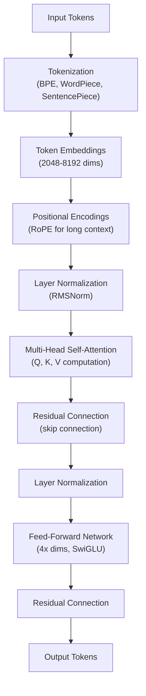

# Enterprise AI Architect Bible (Part 1 of 2)

The definitive MAANG-targeted preparation guide for senior technologists with 20+ years of experience in Data Science, Data Engineering, and Solution Architecture.

Edition April 2026. Latest & Greatest. Target roles: Staff or Principal AI Architect at MAANG. Duration: 24-Week Structured Program. Prerequisite: 20+ Years DS/DE/SA Experience. Salary Target: $280K–$450K+ Total Compensation.

This document covers LLM Architecture, Agentic Systems, MCP & A2A Protocols, RAG & Knowledge Graphs, and foundational concepts. See [Part 2](#related) for LLMOps, AI Safety & Governance, System Design Playbook, and Career Strategy.

## Table of Contents

### Part 1 (This Document)

- The Enterprise AI Architect Role in 2026
- LLM Architecture Mastery
- Agentic Systems Design
- RAG & Enterprise Knowledge Systems

### Part 2 (Companion Document)

- LLMOps & Production AI Engineering
- AI Safety, Governance & Ethics
- MAANG System Design Playbook
- Portfolio, Certifications & Career Strategy

---

## The Enterprise AI Architect Role in 2026

The Enterprise AI Architect is the most consequential technical role created by the AI revolution. This section defines the role, quantifies the market, and maps exactly how your 20 years of experience become a structural advantage at MAANG-tier companies.

### Market Landscape

The enterprise AI architect role emerged at the intersection of three converging forces: the maturation of large language models into production-grade infrastructure, the explosion of agentic AI systems requiring new architectural disciplines, and the urgent enterprise need to govern, scale, and operate AI at billion-user scale. Demand has outstripped supply at every level of seniority.

**Market Signal.** Gartner projects that 40% of enterprise applications will include task-specific AI agents by end of 2026, up from less than 5% in 2025. AI-enhanced enterprise architect positions have seen 67% demand growth, with new salary ranges of $250,000–$350,000—a 40% premium for AI skills. Staff and Principal-level roles at MAANG routinely clear $400K+ total compensation.

Key market dynamics driving hiring:

- Every MAANG company is simultaneously a model developer, a platform provider, and an enterprise AI consumer—creating demand for architects who understand all three layers.
- The MCP (Model Context Protocol) and A2A (Agent-to-Agent) protocols, now governed by the Linux Foundation with co-founders including Anthropic, Google, Microsoft, AWS, and OpenAI, have standardized agentic integration—creating a new category of 'protocol architects.'
- Regulatory pressure (EU AI Act, NIST AI RMF) is creating mandatory governance roles at enterprise scale. Every large company needs an architect who can translate compliance requirements into system design.
- The shift from single LLM wrappers to multi-agent systems has created a skills gap. Most ML engineers lack the distributed systems background to architect reliable agentic workflows—your background fills this gap.

### Role Definition & Responsibilities

The Enterprise AI Architect operates at the intersection of technical depth and business strategy. Unlike a pure ML Engineer who focuses on model training, or a Data Engineer who builds pipelines, the AI Architect owns the end-to-end design of AI systems—from data ingestion through model serving to governance and observability.

| Responsibility Domain | Concrete Deliverables | Your Edge |
|---|---|---|
| AI System Architecture | Reference architectures, ADRs, system diagrams | 20 years of SA experience |
| Agentic Design | Multi-agent orchestration blueprints, MCP/A2A patterns | Distributed systems thinking |
| Data Architecture | Feature stores, lakehouse design, RAG pipelines | DE background = native skill |
| MLOps / LLMOps | CI/CD for models, observability, rollback strategies | Platform engineering depth |
| AI Governance | Risk frameworks, bias audits, regulatory compliance | Enterprise SA exposure |
| Technical Strategy | Build vs buy decisions, vendor evaluation, roadmaps | C-suite communication |
| Team Leadership | Mentoring, arch reviews, cross-functional alignment | 20 years of leadership |

### MAANG vs Traditional Enterprise Architects

MAANG AI Architects operate under conditions that are categorically different from enterprise IT shops: 10–100x the scale, 10x the velocity, and 10x the ambiguity. Understanding these differences is critical for interview preparation.

| Dimension | Traditional Enterprise | MAANG |
|---|---|---|
| Scale | Thousands of users | Hundreds of millions to billions |
| Velocity | Quarterly releases | Daily or hourly model updates |
| Ambiguity | Defined requirements | Research + product, constantly shifting |
| Infrastructure | Vendor solutions (Azure, AWS off-shelf) | Custom silicon (TPUs, Trainium), custom infra |
| Team Size | Small arch team | Hundreds of ML engineers reporting to arch vision |
| Cost Pressure | Budget cycles | Real-time FinOps, cost-per-inference optimization |
| Safety | Security review | Constitutional AI, red teaming, alignment research |
| Eval Culture | QA testing | Rigorous eval-driven development, LLM-as-judge |

### Total Compensation at MAANG

Understanding the compensation structure is important for targeting the right level and negotiating effectively. MAANG compensation is dominated by equity (RSUs), which can be 2–4x base salary at senior levels.

| Level | Title Examples | Base Salary | Annual RSU | Bonus | Total Comp |
|---|---|---|---|---|---|
| L5/E5 | Senior AI Architect | $180K–$220K | $100K–$200K | $30K–$50K | $310K–$470K |
| L6/E6 | Staff AI Architect | $230K–$280K | $200K–$400K | $50K–$80K | $480K–$760K |
| L7/E7 | Principal AI Architect | $290K–$350K | $400K–$800K | $80K+ | $770K–$1.2M+ |

**Negotiation Note.** RSU refreshes are granted annually based on performance. At L6+, a single strong performance review can add $100K+ to your effective annual comp. Always negotiate both the initial grant and the refresh schedule. The 4-year cliff structure means year-1 retention is the critical inflection point.

### Your Unfair Advantage

Most candidates competing for Enterprise AI Architect roles come from one of three backgrounds: (1) pure ML/research backgrounds with weak systems design, (2) software engineers who learned ML, or (3) cloud architects who added AI as an afterthought. Your combination of all three disciplines over 20 years is genuinely rare.

- **Data Engineering background.** You can design the RAG pipelines, streaming architectures, and lakehouse schemas that most ML engineers struggle with. This maps directly to MAANG's need for production-grade AI data infrastructure.
- **Data Science background.** You understand model behavior, statistical validity, bias patterns, and evaluation rigor—exactly what's needed to govern AI systems responsibly. You won't be fooled by vanity metrics.
- **Solution Architecture background.** System design at scale is your native language. Decomposing a complex system, reasoning about failure modes, and communicating tradeoffs to executives is a daily habit for you—it's a panic-inducing interview exercise for most ML engineers.
- **20 years of distributed systems intuition.** You've seen Hadoop die, Spark mature, and Kafka become foundational. You understand why things fail at scale. AI agents are distributed systems with LLMs as components—your mental models transfer directly.

**Strategic Framing.** In every MAANG interview, frame your experience as "I've been building production data systems at scale for 20 years—AI is the new runtime, not a new discipline." This reframes the conversation from "catching up on AI" to "applying deep systems expertise to AI."

---

## LLM Architecture Mastery

MAANG interviews at architect level probe deeply on LLM internals. You don't need to implement backpropagation from scratch, but you must reason fluently about attention mechanisms, inference constraints, model selection tradeoffs, and the rapidly evolving landscape of model families. This section gives you the depth needed to hold your own in any technical discussion.

### Transformer Architecture Deep Dive

The transformer architecture, introduced in "Attention Is All You Need" (2017), remains the foundation of every major LLM in production today. Understanding it at depth is non-negotiable for an AI Architect—it informs every performance, cost, and capability decision.

#### Core Components



**Transformer Architecture Block Flow.** Each transformer layer alternates attention (global token interaction) and feed-forward (per-token transformation), with residual connections enabling deep training and layer normalization stabilizing computation.

- **Token Embeddings.** Input text is tokenized (BPE, WordPiece, SentencePiece) and mapped to dense vectors in high-dimensional space (typically 2048–8192 dimensions for large models). The embedding layer is the interface between discrete language and continuous computation.
- **Positional Encodings.** Transformers have no inherent notion of sequence order. Positional encodings inject this. Modern models use RoPE (Rotary Position Embeddings) which encode relative positions and generalize better to long contexts than absolute sinusoidal encodings.
- **Multi-Head Self-Attention.** The core innovation. Each token attends to every other token, weighted by learned similarity. Multiple heads allow the model to attend to different aspects simultaneously—syntactic, semantic, coreference, etc.
- **Feed-Forward Networks (FFN).** After attention, each token passes through a position-wise FFN (typically 4x the model dimension). Modern models use SwiGLU activation, which outperforms ReLU for LLM training.
- **Layer Normalization.** Applied before (Pre-LN) or after (Post-LN) attention blocks. Pre-LN training is more stable. Most modern models (LLaMA, Mistral, Claude) use RMSNorm, a computationally cheaper variant.
- **Residual Connections.** Skip connections allow gradients to flow directly, enabling training of very deep (80–120+ layer) models without vanishing gradients.

#### Attention Mechanism—How It Works

Attention computes a weighted sum of Values (V), where weights are determined by the similarity between Queries (Q) and Keys (K). The scaling by sqrt(d_k) prevents softmax saturation in high-dimensional spaces:

```
Attention(Q, K, V) = softmax(QK^T / sqrt(d_k)) * V
```

### KV Cache—The Key to Inference Efficiency

The KV Cache is one of the most practically important concepts for production LLM deployment. Understanding it deeply will come up in system design interviews when discussing inference latency and GPU memory budgeting.

- During autoregressive generation, each new token attends to all previous tokens. Without caching, this requires recomputing K and V for all previous tokens at every step—O(n²) computation.
- The KV Cache stores computed K and V tensors for all previous tokens, reducing generation to O(n) per step. This is why inference is much faster than training for the same model.
- **Memory Cost.** KV cache size = 2 × num_layers × num_heads × head_dim × seq_len × bytes_per_param. For a 70B model at fp16 with 32K context, this is ~100GB. This is why long-context inference is GPU-memory-bound.
- **GQA (Grouped Query Attention).** Used in LLaMA 3, Mistral. Multiple query heads share a single KV head, reducing KV cache memory by 4–8x without significant quality loss—critical for production deployment.
- **PagedAttention (vLLM).** Manages KV cache in paged blocks like OS virtual memory, enabling high batch throughput by eliminating KV cache fragmentation.

**Interview Trap.** When asked "why is long-context inference so expensive?" most candidates say "because the model is bigger." The correct answer is that KV cache memory scales linearly with context length and batch size simultaneously, creating a memory wall that constrains throughput. This distinction shows systems-level thinking.

### Inference Optimization Techniques

As an architect, you're responsible for the inference infrastructure decisions that determine cost, latency, and throughput. Know these techniques deeply enough to specify requirements and evaluate vendor claims.

| Technique | What It Does | When to Use | Tradeoff |
|---|---|---|---|
| Speculative Decoding | Small draft model proposes tokens; large model verifies in parallel | Latency-critical, single-user | Requires draft model + verification logic |
| Flash Attention | Recomputes attention in tiles to avoid materializing full attention matrix | Always—near-universal now | Requires custom CUDA kernels |
| Quantization (INT8) | Reduces weights from FP16 to INT8 | Cost reduction, fits larger models | ~1–3% quality loss |
| Quantization (INT4/GPTQ) | 4-bit quantization with calibration | Edge deployment, RAM-constrained | 3–5% quality loss, slower |
| Continuous Batching | Process multiple requests concurrently, swap dynamically | High-throughput serving | Complex scheduling logic |
| Tensor Parallelism | Splits model across multiple GPUs horizontally | Models > single GPU VRAM | High inter-GPU bandwidth needed |
| Pipeline Parallelism | Splits model layers across GPUs vertically | Very large models (100B+) | Pipeline bubble inefficiency |

### Model Families: Architect's Comparison Guide

Model selection is a core architectural decision. Each frontier model has distinct capability profiles, context windows, pricing, and deployment constraints. Know these well enough to justify your choices in a design review.

| Model Family | Context Window | Strengths | Best For | Deployment |
|---|---|---|---|---|
| GPT-4o / GPT-5 | 128K (4o), 1M (5) | Reasoning, tool use, multimodal, broad knowledge | General enterprise, coding agents | API only (OpenAI) |
| Claude Opus/Sonnet 4.6 | 200K | Safety, long-doc analysis, careful reasoning, computer use | Legal, compliance, sensitive data | API / AWS Bedrock |
| Gemini Ultra 2.0 | 1M–2M | Multimodal native, long context, Google ecosystem | Video/audio analysis, GCP workloads | Vertex AI / API |
| LLaMA 3 (70B/405B) | 128K | Open weights, customizable, strong coding | Fine-tuning, on-premise, sovereign AI | Self-hosted / SageMaker |
| Mistral Large | 128K | Efficient, strong multilingual, MoE variants | European data residency, cost-sensitive | API / self-hosted |
| Qwen 2.5 / 3 | 1M | Code, math, multilingual, efficient | Asian market, coding heavy workloads | Self-hosted / API |

### Multimodal Architectures

Every major model release in 2026 is multimodal. Pure-text models no longer ship as flagship products. Architects must understand how modalities are integrated and what this means for system design.

- **Vision Encoders.** Images are processed by a vision encoder (ViT-based) into patch embeddings, which are projected into the LLM's token space. GPT-4V, Claude, and Gemini all use variants of this approach.
- **Audio Transformers.** Audio is converted to spectrograms or discrete audio tokens (EnCodec, SoundStream) before being fed into a cross-modal attention layer. This enables real-time voice interaction.
- **Video Understanding.** Video is temporally sampled into frames, encoded with a vision encoder, and processed with temporal attention. Long video (1M token context) is an active research frontier.
- **Cross-Modal Attention.** Some architectures use separate encoders per modality with cross-attention fusion; others project all modalities into a unified token space. Unified token space (Gemini's approach) tends to enable richer cross-modal reasoning.
- **Architectural Implication.** Multimodal inputs dramatically increase token counts (1 image = ~500–2000 tokens depending on resolution). This affects context window budgeting, KV cache sizing, and cost modeling.

### Context Window Engineering

Context window management is an architectural skill that separates senior architects from junior practitioners. At billion-user scale, token efficiency directly translates to infrastructure cost.

- **Context Budget Planning.** Allocate your context window deliberately: system prompt (5–15%), few-shot examples (10–20%), retrieved context (30–50%), conversation history (10–20%), and headroom for output (10–15%).
- **Lost in the Middle Problem.** LLMs reliably attend to the beginning and end of their context window, but often miss information in the middle. For RAG, place the most critical retrieved chunks at the start or end of the context.
- **Context Compression.** Techniques like LLMLingua compress long contexts by removing semantically redundant tokens. Can reduce context size by 4–20x with minimal quality loss—critical for cost optimization.
- **Retrieval vs Long Context.** A 1M-token context sounds like it replaces RAG, but it's 100–1000x more expensive per query than targeted retrieval. For enterprise scale, hybrid approaches (retrieve, then extend) dominate.
- **Sliding Window Attention.** Models like Mistral use sliding window attention where tokens only attend to a local window, enabling infinite-context inference with bounded compute per step.

---

## Agentic Systems Design

Agentic AI is the defining architectural challenge of 2026. The shift from single LLM inference to multi-agent orchestration requires a fundamentally different design vocabulary. This section gives you the complete blueprint: patterns, protocols, frameworks, memory architectures, and the production engineering discipline to make them reliable at scale.

### Why Agentic Architecture Is Different

A single LLM call is stateless, deterministic (at temp=0), and has bounded latency. An agentic system is stateful, non-deterministic, potentially unbounded in execution time, and exhibits emergent behaviors not present in any individual component. This requires thinking borrowed from distributed systems, workflow engines, and control theory—all domains in your background.

**Key Insight.** Agentic systems are distributed systems where the computation units are LLM calls. Every lesson you've learned about distributed systems—idempotency, retry logic, circuit breakers, observability, state management—applies directly to agentic architecture.

### Core Agentic Patterns

#### ReAct (Reasoning + Acting)

The most fundamental agentic pattern. The agent alternates between Thought (internal reasoning), Action (tool call or output), and Observation (tool result). This creates a transparent, debuggable loop where reasoning steps are visible. Used as the default pattern in LangChain agents and most production systems.

- Strength: Transparent, debuggable reasoning chain
- Weakness: Sequential—each thought-act-observe cycle adds latency
- Best for: General-purpose agents where reasoning transparency is required
- Production note: Limit max iterations to prevent infinite loops; use timeout budgets

#### Reflection / Self-Critique

After generating an output, the agent evaluates its own response against a rubric or critique prompt, then revises. Can be single-agent (self-critique) or multi-agent (critic agent + generator agent). Research shows 20–40% quality improvement on complex tasks.

- Strength: Dramatically improves output quality for complex reasoning tasks
- Weakness: 2x minimum latency and cost per interaction
- Best for: Code generation, document analysis, multi-step reasoning
- Production note: Use LLM-as-judge for automated quality gates before returning to user

#### Plan-and-Execute

A capable frontier model creates a step-by-step plan; cheaper/faster models execute each step. The planner is called once; executors run in parallel or sequence. This can reduce costs by 80–90% compared to using frontier models throughout.

- Strength: Massive cost reduction; parallelizable execution steps
- Weakness: Plan quality determines everything—GIGO applies at the plan level
- Best for: Complex multi-step tasks with predictable subtask structure
- Production note: Include a validator step to verify plan feasibility before execution

#### Multi-Agent Collaboration

Specialized agents (researcher, coder, analyst, reviewer) coordinate via an orchestrator. Each agent is fine-tuned or prompted for its domain. The orchestrator routes tasks, manages state, and resolves conflicts. This mirrors how human expert teams operate.

- Strength: Each agent can be optimized independently; natural fault isolation
- Weakness: Inter-agent communication overhead; state consistency challenges
- Best for: Complex enterprise workflows, code review pipelines, research synthesis
- Production note: Define clear agent contracts (inputs/outputs/SLAs) before building

#### Human-in-the-Loop (HITL)

The system pauses at defined decision points and waits for human approval before proceeding. Critical for high-stakes actions (deleting data, sending emails, making purchases). LangGraph's checkpointing makes this first-class.

- Strength: Safety for irreversible or high-stakes actions
- Weakness: Breaks real-time execution; requires async architecture
- Best for: Financial transactions, legal document generation, customer communications
- Production note: Design HITL as async with timeout and escalation logic

### MCP: Model Context Protocol Deep Dive

MCP (Model Context Protocol) is the standardized protocol for connecting AI agents to external tools, data sources, and services. Governed by the Linux Foundation (co-founded by Anthropic, Google, Microsoft, AWS, OpenAI, and Block), MCP has become the default for vertical agent-to-tool integration in production systems.

#### MCP Architecture

- **MCP Server.** A lightweight process that exposes Tools (functions agents can call), Resources (data sources like files, databases, APIs), and Prompts (reusable prompt templates). Servers implement the MCP specification.
- **MCP Client.** The agent or LLM application that connects to MCP servers. Clients discover available tools via the server's capability manifest and invoke them through standardized JSON-RPC calls.
- **Transport Layer.** MCP v2.1 supports stdio (local), SSE (Server-Sent Events for remote), and WebSocket transports. Production deployments typically use SSE or WebSocket over authenticated HTTPS.
- **Tool Discovery.** Agents dynamically discover available tools via "Agent Cards"—structured manifests describing tool names, parameters, return types, and usage descriptions. This eliminates hardcoded tool lists.
- **Security Model.** MCP includes OAuth 2.0 scoped permissions, tool-level authorization, and audit logging. Enterprise deployments must implement permission gating to prevent privilege escalation.

#### MCP Security Threats to Know

- **Prompt Injection via Tool Results.** A malicious tool response contains instructions that override the agent's system prompt. Mitigate with output sanitization and sandboxed tool execution.
- **Tool Impersonation.** A rogue MCP server registers with the same name as a legitimate tool. Mitigate with cryptographic tool signing and server allowlisting.
- **Permission Escalation.** An agent granted read access uses a tool chain to achieve write access. Mitigate with capability-based security and minimal-privilege tool grants.
- **Data Exfiltration.** An agent with access to sensitive data uses MCP tools to exfiltrate it. Mitigate with egress controls and data classification-aware tool policies.

### A2A: Agent-to-Agent Protocol Deep Dive

A2A (Agent-to-Agent Protocol), developed by Google and now Linux Foundation-governed, handles the horizontal dimension: how agents from different frameworks, vendors, and organizations communicate and delegate tasks to each other. If MCP is the USB-C standard for agent-to-tool connections, A2A is the TCP/IP standard for agent-to-agent connections.

- **Task Interface.** A2A defines a standardized task schema: task_id, input payload, expected output schema, SLA constraints, and authorization scope. Any A2A-compliant agent can accept and fulfill tasks.
- **Agent Discovery.** Agents publish capability manifests to a registry. Orchestrators query the registry to find available agents, their capabilities, and their health status—analogous to Kubernetes service discovery.
- **Cross-Framework Interop.** An A2A orchestrator can invoke a LangGraph agent, a CrewAI agent, and an ADK agent in the same workflow. This is the critical enterprise value—vendor lock-in at the agent level is eliminated.
- **Async Task Execution.** A2A natively supports async task patterns: fire-and-forget, polling, and callback notification. Critical for long-running agent tasks (minutes to hours).

**2026 Standard.** Any production agentic system you design in 2026 needs both MCP (vertical: agent-to-tools) and A2A (horizontal: agent-to-agent). The layered model is now industry consensus, co-signed by every major AI platform provider. Interviewers will expect you to know this.

### Memory Architecture for Agents

Long-running agents require memory to maintain context across sessions, learn from past interactions, and accumulate domain knowledge. Memory architecture is one of the most underspecified areas in agent design—getting it right separates production systems from demos.

| Memory Type | Storage | Scope | Use Cases | Implementation |
|---|---|---|---|---|
| Sensory / In-Context | LLM context window | Single interaction | Current task state, recent tool results | Context management, prompt templating |
| Short-Term / Session | Redis, in-memory store | Single session / conversation | Conversation history, task progress | Session store with TTL |
| Episodic / Long-Term | Vector database | Cross-session, user-specific | Past interactions, user preferences | Embedding + similarity search |
| Semantic / Knowledge | Knowledge graph, vector DB | Global / system-wide | Domain facts, learned procedures | RAG pipeline, graph queries |
| Procedural | Prompt templates, fine-tuned weights | Global / system-wide | How-to knowledge, workflow templates | Few-shot examples, fine-tuning |

### Multi-Agent Framework Selection Guide

Framework selection is a 12–24 month architectural commitment. The wrong choice creates massive migration costs. Here is the decision framework based on actual production use cases in 2026:

| Framework | Best For | Key Differentiator | Avoid If |
|---|---|---|---|
| LangGraph | Regulated industries, complex branching, HITL, audit trails | Graph-based state machine; deterministic control flow; checkpointing | You need simple linear workflows; overhead is too high |
| CrewAI | Rapid prototyping, role-based collaboration | Fastest to first working agent; intuitive crew abstraction | You need fine-grained control over agent communication |
| OpenAI SDK | Handoff-based multi-agent, OpenAI-centric stacks | Cleanest handoff model; native function calling | You need cross-vendor agent interop |
| Google ADK | GCP-native, multimodal, A2A interop | Native A2A; Vertex AI integration; multimodal capabilities | You're not on GCP; heavy Google dependency is a risk |
| Anthropic SDK | Safety-critical apps, computer use, MCP-first | Constitutional AI built in; computer use; MCP native | You need non-Claude models; lighter orchestration |
| AutoGen | Research, quality-sensitive offline tasks, multi-agent debate | Multi-agent debate pattern; strong for complex reasoning | High-volume real-time use; cost is prohibitive at scale |
| Temporal + LLM | Durable long-running workflows, crash recovery | Workflow durability; human approval gates; exactly-once semantics | Simple agent tasks; operational complexity is too high |

### Cost Architecture for Multi-Agent Systems

Agentic systems can make thousands of LLM calls per user task. Without deliberate cost architecture, a complex agent can cost $10–50 per user session—economically unsustainable at scale. Cost engineering is an architectural discipline, not an afterthought.

- **Heterogeneous Model Routing.** Use frontier models (GPT-5, Claude Opus) only for orchestration, planning, and complex reasoning. Use mid-tier (GPT-4o-mini, Sonnet) for standard tasks. Use SLMs (Phi-3, Llama 3 8B) for high-frequency simple tasks. This can reduce costs by 90%.
- **Plan-and-Execute Cost Pattern.** One frontier call to plan, N cheap calls to execute. Effective when task structure is predictable. Measure with cost-per-task, not cost-per-call.
- **Strategic Caching.** Cache common tool call results, frequently retrieved knowledge chunks, and partial agent state. Semantic caching (GPTCache, Redis with embedding similarity) can reduce LLM calls by 30–60% in repetitive workloads.
- **Token Budgeting.** Set hard context limits per agent call. Use context compression before hitting the limit. Track tokens consumed vs tokens in budget as a first-class metric.
- **FinOps Dashboard.** Track cost-per-task, cost-per-user-session, cost-per-outcome by agent type and model tier. Attribute costs to product features, not just to infrastructure line items.

---

## RAG & Enterprise Knowledge Systems

Retrieval-Augmented Generation is the bridge between LLM capabilities and enterprise data. Your data engineering background makes this your strongest domain—RAG systems are essentially sophisticated data pipelines with an LLM at the end. This section covers production-grade RAG architecture from embedding strategy through evaluation frameworks.

### RAG Architecture Fundamentals

Basic RAG (retrieve relevant documents, inject into prompt, generate response) is table stakes. Production RAG at MAANG scale requires advanced retrieval, reranking, evaluation, and continuous improvement pipelines. Here is the full architecture:

#### Indexing Pipeline

- **Document Loading.** Ingest from structured (databases, APIs) and unstructured (PDFs, HTML, Word) sources. Use LlamaParse or Unstructured.io for complex document parsing. Handle multimodal content (tables, images) explicitly.
- **Chunking Strategy.** This is the most impactful architectural decision in RAG. Options: fixed-size (simple, misses semantic boundaries), recursive character splitting (better boundary detection), semantic chunking (splits on embedding similarity changes—best for heterogeneous documents), and proposition-based chunking (split into atomic factual claims—best recall but expensive).
- **Metadata Enrichment.** Add document source, section hierarchy, creation date, entity mentions, and document type as metadata. This enables hybrid filtering (semantic search + metadata filter) and dramatically improves retrieval precision.
- **Embedding.** Generate dense vector representations. Use domain-specific models when available (legal, medical, code). Always evaluate on your actual data—text-embedding-3-large is not always better than a smaller specialized model.

#### Retrieval Pipeline

- **Dense Retrieval (ANN).** Approximate Nearest Neighbor search in vector space using HNSW (most common), IVFFlat, or ScaNN. Returns semantically similar chunks even without keyword overlap.
- **Sparse Retrieval (BM25).** Classic keyword-based retrieval with TF-IDF weighting. Extremely fast and reliable for exact keyword matches. Misses semantic relationships.
- **Hybrid Search.** Combine dense and sparse retrieval scores (RRF—Reciprocal Rank Fusion is most robust). Hybrid consistently outperforms either alone by 10–20% on heterogeneous enterprise datasets.
- **Reranking.** Use a cross-encoder reranker (Cohere Rerank, BGE-Reranker) to re-score the top-k candidates from initial retrieval. Cross-encoders compare query+document jointly (vs bi-encoder separation), dramatically improving precision at the cost of higher latency. Apply to top 20–50 results, return top 5–10.
- **Query Expansion.** Generate multiple phrasings of the user query (HyDE—Hypothetical Document Embeddings, or multi-query) before retrieval. Reduces retrieval miss rate by 15–30% for ambiguous queries.

### Vector Database Selection

| Database | Architecture | Scale | Strengths | Best For |
|---|---|---|---|---|
| Pinecone | Managed cloud | Billions | Easiest ops, real-time upserts, good filtering | Startups, teams without infra expertise |
| Weaviate | OSS + managed | Billions | Hybrid search native, GraphQL API, modules ecosystem | Hybrid search, semantic search + BM25 |
| Qdrant | OSS + managed | Hundreds of millions | Fastest filtering, Rust-based performance, rich payloads | High-filter-rate workloads, cost-sensitive |
| pgvector | PostgreSQL extension | Tens of millions | Already have Postgres, ACID compliance, SQL joins | Existing Postgres infra, smaller scale |
| Milvus | OSS distributed | Billions | Most scalable OSS, GPU-accelerated ANN, enterprise features | Large-scale self-hosted deployments |
| Vertex AI Vector Search | GCP managed | Billions | Native GCP integration, managed, low-latency | GCP workloads, Google AI stack |

### Knowledge Graphs for LLM Grounding

Amazon's Knowledge Graph team is re-inventing knowledge graphs for the LLM era—a signal that pure vector retrieval is insufficient for complex factual grounding. Knowledge graphs provide structured, relationship-aware knowledge that complements vector search.

- **GraphRAG Pattern.** Microsoft's GraphRAG builds a knowledge graph from documents, then enables LLMs to traverse graph relationships during retrieval. Superior for "how does X relate to Y across the dataset" questions.
- **Entity-Centric Retrieval.** Extract named entities from the query, traverse the knowledge graph to find related entities and facts, then use these as grounding context. More precise than pure semantic search for factual questions.
- **Hybrid Graph + Vector.** Use vector search for semantic similarity, knowledge graph for structured facts and relationships. Combine at the fusion layer. Amazon AKG uses this pattern for product knowledge grounding.
- **Graph Databases.** Neo4j (most mature, Cypher query language), Amazon Neptune (managed, SPARQL/Gremlin), TigerGraph (high-performance, GSQL). For LLM integration, Neo4j has the richest ecosystem (LangChain integration, vector indexes within graph).

### RAG Evaluation Frameworks

You cannot improve what you cannot measure. RAG evaluation is notoriously challenging because the ground truth (the 'right' answer) is often subjective or unavailable. Production RAG requires a multi-layered eval strategy.

| Metric | What It Measures | Method | Target |
|---|---|---|---|
| Faithfulness | Does the answer stick to retrieved context (no hallucination)? | LLM-as-judge compares answer to source chunks | > 0.90 |
| Answer Relevance | Does the answer address the question? | LLM-as-judge on question-answer pair | > 0.85 |
| Context Precision | Are retrieved chunks actually relevant to the question? | LLM-as-judge or human labels on retrieved chunks | > 0.80 |
| Context Recall | Did retrieval find all relevant information? | Requires ground-truth reference answer | > 0.75 |
| Answer Correctness | Is the answer factually correct? | Ground-truth comparison (expensive, use sampling) | > 0.80 |
| Latency P95 | End-to-end response time at 95th percentile | Infrastructure instrumentation | &lt; 3s for chat |
| Cost per Query | Total LLM + retrieval cost | Token tracking + vector DB billing | Define per use case |

**RAGAS Framework.** RAGAS (Retrieval Augmented Generation Assessment) is the de facto open-source RAG evaluation framework. It implements faithfulness, answer relevance, context precision, and context recall using LLM-as-judge, eliminating the need for expensive human evaluation on every change. Integrate RAGAS into your CI/CD pipeline as a regression gate.

### Context Engineering

Context engineering is the discipline of deliberately crafting the context window content to maximize model performance. It has emerged as a first-class architectural concern in 2026, particularly for agentic systems.

- **System Prompt Architecture.** Structure system prompts with explicit sections: Role definition, Capabilities, Constraints, Output format requirements, Examples. Version control system prompts like code—they are a critical production artifact.
- **Injecting Design Constraints.** For coding agents, inject architectural guidelines, security constraints, and design patterns into the agent's working context. This produces code that fits your system rather than generic solutions.
- **Few-Shot Example Selection.** Dynamically select few-shot examples based on the current query using semantic similarity to an example bank. Dynamic few-shot selection outperforms fixed examples by 15–25% on diverse query distributions.
- **Structured Output Schemas.** Always specify JSON or structured output schemas. This reduces token consumption (the model knows exactly what to produce), eliminates parsing errors, and enables downstream tool calls without additional LLM calls.
- **Context Compression.** Before adding long documents to context, compress them using extractive summarization or LLMLingua. Target 50–80% compression with &lt; 5% information loss for non-critical passages.

---

## Next: Part 2 of 2

The companion document covers:

- **LLMOps & Production AI Engineering.** Fine-tuning, model serving, CI/CD for models and prompts, observability, GPU infrastructure design.
- **AI Safety, Governance & Ethics.** Safety architectures, agentic-specific risks, bias detection, regulatory landscape, enterprise governance frameworks.
- **MAANG System Design Playbook.** Design framework, 10 canonical problems, behavioral & leadership questions by company.
- **Portfolio, Certifications & Career Strategy.** 5-project portfolio roadmap, certification sequencing, interview processes, offer negotiation, 30–60–90 day plan.

See [Part 2: LLMOps, Safety & Career Strategy](pathname:///archon/architecture/parts/24-enterprise-ai-architect-bible-2026-part2).

---

**Document Status:** This is Part 1 of a 2-part enterprise reference architecture. Part 1 focuses on foundational concepts (LLMs, Agentic Systems, RAG). Last updated: July 2026. For the complete 2026 AI Architect Bible, see the companion Part 2 document.
