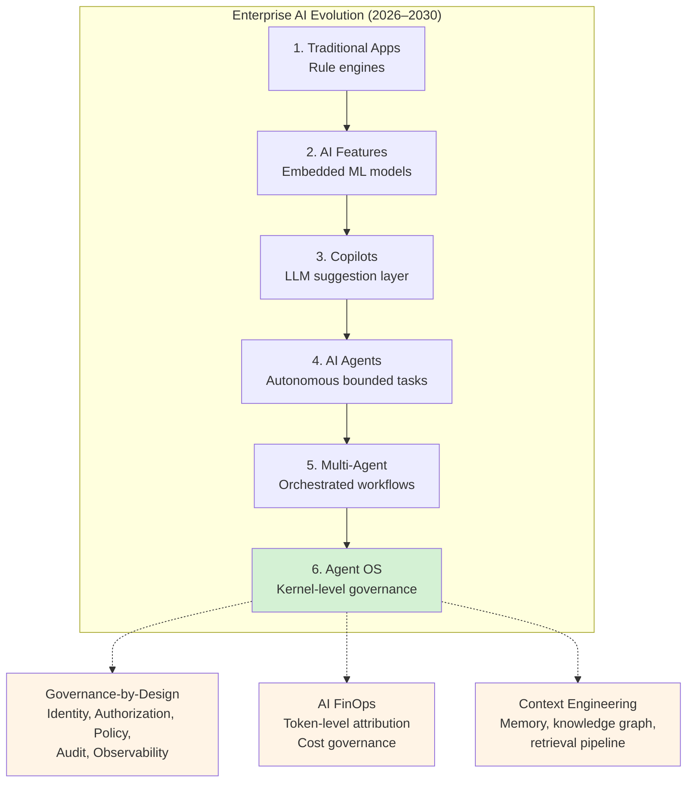

# Enterprise Agentic AI Architecture Playbook 2026

How enterprises will build secure, governable, scalable, multi-cloud AI Agent platforms between 2026 and 2030.

| **THEMES** | **VERSION** | **HORIZON** | **AUDIENCE** |
|---|---|---|---|
| **12 Research Domains** | **v1.0 · June 2026** | **2026–2030** | **Principal AI Architects** |

## Executive Summary

Enterprise Agentic AI – Key Findings &amp; Context

The enterprise AI landscape is undergoing its most consequential architectural transition since the move to cloud. Between 2026 and 2030, organizations will not simply deploy AI models – they will build AI Agent Platforms: structured, governed, multi-cloud execution environments where autonomous agents act on behalf of users and systems, coordinate across organizational boundaries, and operate under explicit identity, security, and cost controls. This playbook synthesizes research across 12 strategic themes – from AI maturity evolution to the emerging Agent Operating System – to provide Principal AI Architects with the frameworks, patterns, and tool stacks needed to lead this transition.

**Enterprise Agentic AI: Key Statistics (2026)**

- 40% of enterprise apps will have task-specific agents by end 2026 (Gartner)
- 82% of IT leaders: prompt engineering alone is insufficient at scale (DataHub)
- $4.88M average breach cost for enterprises with extensive AI deployments (IBM)
- 98% of FinOps practices now manage AI spend (State of FinOps 2026)
- 89% of multi-agent deployments converge to single agent in production (Gartner 2026)
- $600B Big-5 hyperscaler combined capex in 2026 (Inference Inflection Point)

**Key Strategic Findings:**

- **The 'Inference Inflection Point' has arrived:** running AI costs now exceed training costs for the first time, driving a $600B+ global capex cycle.
- **Context Engineering has replaced Prompt Engineering** as the defining discipline – 95% of data teams plan context engineering investment in 2026.
- **Agent Identity is the new enterprise perimeter:** agents must have bounded, delegated identities using OAuth 2.1 OBO flows and JIT token issuance.
- **The Agent Operating System (EAOS)** is the logical endpoint of enterprise AI maturity – providing scheduler, memory manager, identity manager, policy engine, and observability plane as infrastructure services.
- **AI FinOps is now non-negotiable:** IDC warns G1000 orgs face 30% underestimated AI infrastructure cost rises by 2027 without token-level FinOps governance.

## Part I: AI Evolution Maturity Model

### Theme 1 – Evolution of Enterprise AI Architecture

Enterprise AI has evolved through six distinct generations. Understanding where an organisation sits on this maturity ladder determines which architectural investments are most urgent. The critical insight from 2026 production deployments: Gartner projects 40% of enterprise applications will integrate task-specific agents by end-2026, up from less than 5% in 2025.

| **Stage** | **Architecture Pattern** | **Control Model** | **Key Capability** | **Failure Mode** |
|---|---|---|---|---|
| **1 · Traditional Apps** | Deterministic pipelines, rule engines | Full determinism | Predictable CRUD workflows | No adaptivity |
| **2 · AI Features** | ML models embedded in apps (classifiers, recommenders) | Model + guardrails | Pattern recognition at scale | Drift, retraining debt |
| **3 · Copilots** | LLMs as suggestion layer; human confirms all actions | Human-in-the-loop | Natural language interfaces | Hallucination, over-reliance |
| **4 · AI Agents** | LLM + tools + memory; acts autonomously on bounded tasks | Policy + sandboxing | Task completion without step-by-step guidance | Unsteerable agent drift |
| **5 · Multi-Agent Systems** | Orchestrator + specialist agents; parallel/hierarchical coordination | Orchestration governance | Complex cross-domain workflows | Cascading failures, cost explosion |
| **6 · Agent OS (EAOS)** | Kernel-level resource management: scheduler, memory, identity, policy | OS-level enforcement | Autonomous enterprise operations | Still emerging – standardisation gap |

**2026 Production Reality:**

- McKinsey/QuantumBlack found that banks building agentic SDLC platforms wrap each agent in deterministic Argo CD workflow steps – prescriptive output templates at each stage enable direct agent-to-agent handoffs without human review.
- The 'multi-agent hype' peaked mid-2025. Gartner's 2026 AI Ops report: 89% of multi-agent deployments converged to a single agent with more tools by the time they reached production. Modular design beats swarm design.
- Stage 6 (EAOS) is the architectural endpoint – but few organisations will reach it before 2028. The 2026 priority: building Stage 4–5 capabilities with Stage-6 governance foundations.

### Theme 02 – Context Engineering

**Replacing Prompt Engineering**

Context Engineering is the discipline of designing dynamic systems that provide the right information, tools, permissions, and state to an LLM – at the right time – to enable accurate and reliable agentic behaviour. It treats the model's input not as a static prompt string, but as a multi-layered, dynamically assembled environment. Gartner's 2026 framing: context engineering gives AI systems 'the situational awareness needed to act with relevance and precision.' DataHub's 2026 State of Context Management: 82% of IT leaders agree prompt engineering alone is no longer sufficient; 95% plan context engineering investment in 2026.

#### Context Engineering vs Prompt Engineering

| **Prompt Engineering** | Static instruction design at message level (2022–2024). Optimises what you ask the model. Democratises AI but fails at scale – hallucinations from no grounding. |
|---|---|
| **RAG** | Retrieval-Augmented Generation: pull relevant chunks from vector store at query time. One technique within context engineering. Reduces hallucination 70–90% vs raw LLMs but insufficient alone (DataHub 2026: 77% of IT leaders agree RAG alone is insufficient). |
| **Memory Systems** | Persistent state across sessions – semantic, episodic, working, long-term. Solves the 'goldfish problem' (agent forgets between turns). MemGPT OS-like hierarchy with dedicated read/write; MemOS 72% lower token usage. |
| **Context Engineering** | System-level discipline (2025+): memory management, tool orchestration, token budget allocation, context compression, state persistence. RAG + memory + permissions + user state + tool definitions – all dynamically assembled per task. |
| **Knowledge Graph Grounding** | Semantic layer: entities, relationships, provenance. GraphRAG: documents→knowledge graph. Every claim traceable to source node. 62–91% accuracy improvement on multi-hop queries. Audit trails built into graph structure. |
| **Harness Engineering** | 2026+ system-level design: tools, memory, constraints, feedback loops. Nested disciplines: Prompt→Context→Harness. Enterprise harness = governed context pipeline. |

#### Memory Architecture for Enterprise Agents

**Store Governance:**

- **Working Memory:** active session context; current task state; tool call. What NEVER to store: credentials, PII beyond session, raw tool history within turn outputs (distil first)
- **Episodic Memory:** past session summaries; interaction history. Memory expiry: time-based (TTL), event-based (task completion), versioned conversation logs capacity-based (compression)
- **Semantic Memory:** facts, domain knowledge, org policies stored as. Memory security: encryption at rest + in transit; access scoped to embeddings/knowledge graph agent identity; audit trail per read
- **Long-Term Memory:** user preferences, org-specific patterns. Cross-agent memory: MemOS multi-agent sharing; 35% token MemBank forgetting-curve schedule savings; shared organisational knowledge graph

**Key Tools:** LangChain MemGPT, Pinecone, Neo4j, Weaviate, Chroma, Redis, GraphRAG, MemOS

### Theme 03 – Agent Architecture Patterns

**Orchestration · Coordination · Execution**

Six production-proven orchestration patterns have emerged for multi-agent systems in 2026. The choice of pattern depends on task decomposability, latency requirements, and failure tolerance. All patterns share a common production requirement: explicit state management, not implicit prompt chaining.

| **Pattern** | **Structure** | **Best For** | **Failure Mode** | **Framework** |
|---|---|---|---|---|
| **Sequential Chain** | Planner→Researcher→Executor→Reviewer; linear dependency | KYC, regulated multi-step workflows | Single-point cascade; no parallelism | LangGraph, Argo CD |
| **Parallel Fan-Out** | Orchestrator spawns N parallel agents; aggregates outputs | Independent data gathering, analysis | Aggregation conflicts; cost explosion | LangGraph parallel, AWS Bedrock |
| **Supervisor/Worker** | Managing agent owns goal; worker agents execute tasks | Complex business process automation | Supervisor hallucinating sub-agents | AutoGen, CrewAI, OpenAI Agents SDK |
| **Hierarchical Delegation** | Planner decomposes goal; specialist agents; monitor/synthesise | End-to-end enterprise workflows | Depth limit; context propagation loss | Semantic Kernel, Google ADK |
| **Consensus/Debate** | Multiple agents propose; judge agent selects/synthesises | High-stakes decisions; hallucination reduction | Cost multiplication; latency | AutoGen Group Chat, DeepMind Co-Scientist |
| **Human-in-the-Loop** | Agent pauses at policy-defined checkpoints for human approval | Irreversible actions; regulated industries | Latency; approval fatigue | LangGraph HITL, Bedrock HITL checkpoints |

### Theme 04 – Identity &amp; Authorization

**OAuth 2.1 · OBO · JIT · SPIFFE**

Agent identity is the new enterprise security perimeter. The fundamental question: how does an AI agent act on behalf of a user without inheriting their full permissions? The 2026 answer: On-Behalf-Of (OBO) delegation with JIT token issuance, scope reduction via RFC 8693 token exchange, and SPIFFE/SVID for machine-to-machine workload identity. Standard OAuth tokens give agents too much privilege – a human token carries broad context that is dangerous for autonomous agents operating at machine speed.

| **Actor** | **Strategy / Implementation** | **Key Tools** |
|---|---|---|
| **OAuth 2.1 + PKCE** | User-delegated flows for agents acting on behalf of authenticated users. PKCE prevents token interception without client secrets. Refresh token rotation: new token on every refresh, old invalidated immediately. | OAuth 2.1, PKCE, Azure Entra ID |
| **OBO Flow (On-Behalf-Of)** | Agent receives user token, exchanges it for a narrowly-scoped task token via Azure AD OBO / AWS STS AssumeRole. Every action attributable to the originating user in audit logs. Limits blast radius of agent compromise. | Azure Entra ID OBO, AWS STS AssumeRoleWithWebIdentity |
| **RFC 8693 Token Exchange** | Scope reduction for multi-tool workflows: agent holds base token, exchanges for short-lived (minutes), audience-restricted ephemeral token before calling high-privilege API. Preserves least privilege as authority propagates. | IETF RFC 8693, AWS STS, OIDC Federation |
| **JIT Authorization** | Just-in-time: policy check at the moment of each tool call – not pre-authorized at setup. Evaluates user identity + agent scope + requested action. When new scope needed, runtime pauses and returns granular consent URL (MCP URL Elicitation SEP). | MCP URL Elicitation, Arcade.dev, Aembit IAM |
| **SPIFFE/SVID** | Machine-to-machine: X.509 SVID certificates for workload identity. Sub-agents receive narrowed tokens derived from parent session authority – not copies of full credential set. Prevents privilege escalation through agent hierarchy. | SPIFFE, SPIRE, HashiCorp Vault |
| **CAEP / Continuous Auth** | Real-time access revocation: static token lifetimes leave exposure between issuance and expiry. Continuous Access Evaluation Protocol signals immediate revocation when risk signal fires (location change, anomalous tool call volume). | CAEP, Azure AD CAEP, Maverics |

**Anti-patterns:**

- Single API key routing: shared, highly-privileged service account for all agents. Eliminates per-user attribution. Expands blast radius to entire org on compromise.
- Blanket consent at onboarding: violates least privilege. Implement just-in-time scope expansion with cryptographic consent capture and context-preserved task resumption.
- 2026 IETF concern – Delegation chain splicing: a compromised intermediary presents a valid subject token + valid actor token from different contexts. STS validates each independently and issues a properly-signed token asserting a chain that never occurred. Mitigate with context binding.

### Theme 05 – Enterprise Agent Governance

**Governance-by-Design · Not Governance-by-Policy**

The 2026 governance imperative: governance must be embedded in the architecture, not bolted on as policy. Every agent action must be traceable, explainable, and aligned with business goals through comprehensive lifecycle management. Governance agents – specialised monitors – continuously inspect other AI systems for policy violations, bias, drift, and anomalous behaviour.

| **Data Access Policies** | Attribute-based access control (ABAC) at the retrieval layer. GraphRAG encodes provenance in edges – every claim traceable to authoritative source. Row-level security passed through as agent context. Data never leaves its security boundary. |
|---|---|
| **Tool Access Policies** | Tool allowlisting per agent identity. No agent calls tools outside its declared scope. MCP tool schema validation before execution. Semantic tool selection reduces unauthorized tool calls 86.4% (AWS 2026 benchmark). |
| **Model Usage Policies** | LLM gateway (LiteLLM / Portkey / Kong AI Gateway) enforces: model allowlist per team, token budget per virtual key, rate limits with structured error on exhaustion. No agent bypasses gateway to call model APIs directly. |
| **Human Approval Requirements** | Policy-defined HITL checkpoints for: irreversible actions, financial thresholds, PII access, external communications, bulk updates, permission changes. LangGraph HITL as interrupt primitive. Approval request includes: action, context, agent trace ID. |
| **Audit Requirements** | Every agent action: user identity, agent identity, tool invoked, parameters/intent, outcome, trace context, token cost. Exported via OpenTelemetry to SIEM. EU AI Act (Regulation 2024/1689): high-risk AI systems require full explainability and audit trail. |
| **Governance Agents** | Specialised monitor agents continuously inspect other agents for: policy violations, output bias, context drift, anomalous tool call patterns, cost spikes. Alert + auto-quarantine on threshold breach. |

#### Governance Layer Responsibility Matrix

| **Layer** | **Responsibility** | **Mechanism** | **Tool** |
|---|---|---|---|
| **Identity** | Who is acting | OAuth 2.1 OBO / SPIFFE SVID | Entra ID / AWS STS / SPIRE |
| **Authorization** | What they can do | ABAC + JIT scope expansion | OPA / Cedar / AWS IAM |
| **Policy** | Allowed actions + guardrails | Runtime policy engine per tool call | Guardrails AI / Bedrock Guardrails |
| **Audit** | Evidence of what happened | Immutable trace log + SIEM export | OpenTelemetry / Datadog / Splunk |
| **Observability** | Visibility into why | Trace + span + cost + eval | Langfuse / Arize Phoenix / LangSmith |
| **Governance Agents** | Continuous compliance monitoring | Monitor agents with alert/quarantine | Custom + Confident AI evals |

### Theme 06 – Agent Security

**Threat Model Library · Defence-in-Depth**

Prompt injection is to agentic AI what SQL injection was to early web applications – a fundamental flaw from mixing untrusted data with trusted instructions. The threat landscape in 2026 is defined by persistence, autonomy, and scale. IBM's 2025 Cost of Data Breach Report: enterprises with extensive AI deployments faced breach costs averaging $4.88M. Google Security Blog: 32% relative increase in malicious indirect prompt injection content between November 2025 and February 2026.

| **Threat** | **Attack Vector** | **Impact** | **Mitigation** |
|---|---|---|---|
| **Prompt Injection** | Malicious instructions in external content (emails, docs, web) redirect agent behaviour | Unauthorized actions, data exfiltration, malware execution with agent privileges | Input sanitisation, context boundary enforcement, output validation, HITL for irreversible actions |
| **Memory Poisoning** | Adversary implants false instructions in agent long-term memory via support tickets or data sources | Persistent corruption; agent 'recalls' malicious instruction in future sessions days/weeks later | Memory write access control, anomaly detection on memory writes, periodic memory audits, TTL enforcement |
| **Tool Poisoning** | Hidden instructions in tool metadata (MCP tool descriptions) that agent reads but user cannot see | Agent executes attacker instructions while appearing compliant; 200K vulnerable MCP instances disclosed 2026 | Tool allowlisting, schema validation, signed tool manifests, MCP server provenance verification |
| **Agent Escalation** | Compromised sub-agent inserts instructions into output consumed by higher-privilege agent | Privilege escalation through agent hierarchy; financial agent executes unintended trades | SPIFFE-bound token narrowing for sub-agents, output validation, blast radius limits |
| **Data Exfiltration** | RAG poisoning + social engineering extracts data from private channels via disguised tool calls | Sensitive business data leaked; Slack AI 2024 real-world exploit demonstrated | OBO execution scoped to user permissions, output filtering, tool call intent validation, DLP integration |
| **Supply Chain Attacks** | Malicious code in model files, OSS packages, or training datasets executes on model load | Backdoors survive fine-tuning; DeepSeek-R1 backdoor found via contaminated GitHub repos | Model provenance verification, training data lineage, signed model artefacts, sandboxed model loading |

### Theme 07 – Multi-Cloud Agent Platform

**Azure · AWS · GCP · SaaS Federation**

Enterprise agent platforms span multiple clouds and SaaS by necessity. The 2026 reference architecture requires: federated identity propagation across cloud boundaries, policy enforcement at every tool/API boundary, unified observability regardless of execution location, and model-agnostic orchestration that prevents vendor lock-in.

**Azure / Microsoft**

- Azure AI Foundry: 12,000+ models; multi-model routing; fine-tuning + eval in one platform
- Azure Entra ID: OBO delegation; CAEP real-time revocation; B2B federation
- MXC Containers (Build 2026): OS-level agent governance; Windows as containment layer
- Semantic Kernel: multi-cloud orchestration with pluggable memory and planner
- Microsoft Discovery: enterprise agentic R&amp;D platform (BHP, Syensqo, GSK in production)

**AWS / Amazon**

- AWS Bedrock: managed agents with IAM boundaries; Guardrails for content policy
- AWS STS: AssumeRoleWithWebIdentity for cross-cloud OIDC federation
- Strands Agents: open-source framework with native GraphRAG + AgentCore
- AWS AgentCore: self-correction + hard rule enforcement; neurosymbolic guardrails
- Amazon AGI Labs: portable reasoning; perception agent harness with verification

**Trust Establishment:** OIDC federation across Azure Entra ID↔AWS IAM↔GCP Workload Identity Federation. SPIFFE/SPIRE as cross-cloud workload identity layer. Short-lived tokens only – no standing cross-cloud credentials.

**Identity Propagation:** OBO chain: User→Entra ID→Agent Identity→AWS STS AssumeRole (narrowed scope)→Tool API. Every hop narrows scope. RFC 8693 token exchange preserves least privilege across provider boundaries.

**Data Access Control:** Data never crosses cloud boundary unencrypted. Retrieval layer enforces row-level security passing through user identity. Policy enforcement at API gateway level regardless of agent location.

**Policy Enforcement:** OPA/Cedar policies deployed as sidecars to every agent executor. Same policy code deployed across Azure (APIM), AWS (API Gateway), GCP (Apigee). LiteLLM/Portkey as model-agnostic gateway with provider failover.

**Unified Observability:** OpenTelemetry as the standard: all agent spans, tool calls, and token costs exported to centralised platform (Datadog / Grafana) regardless of cloud provider. Trace IDs propagated across cloud hops.

**Model Routing:** LiteLLM / OpenRouter / Portkey: abstract provider APIs; route to cheapest/fastest model per task; automatic failover; semantic caching across providers. Prevents model vendor lock-in.

### Theme 08 – Agent Memory Systems

**Short-Term · Long-Term · Organisational · Cross-Agent**

Memory is the foundation of agent reliability. Without it, every agent session starts from zero – relearning how the business works, where data lives, what rules to follow (the 'goldfish problem'). The 2026 enterprise memory architecture must address four distinct memory tiers, governance of what gets stored, security of stored context, and expiry/compression strategies to control cost.

| **Memory Type** | **Scope** | **Storage** | **Governance** | **Key Tools** |
|---|---|---|---|---|
| **Working Memory** | Active session; current task state; tool call chain within single turn | In-memory (Redis / in-process) | Cleared on session end; never persisted raw | Redis, LangGraph State |
| **Episodic Memory** | Past sessions; interaction history; versioned conversation summaries | Vector DB + structured store (Postgres) | TTL-based expiry; user-deletable; access scoped to originating user | Pinecone, Weaviate, MemGPT |
| **Semantic Memory** | Domain knowledge; org policies; product/entity facts; embedded company knowledge | Knowledge Graph + Vector Index | Version-controlled; source-attributed; read-only for agents; write by authorised human | Neo4j, Chroma, GraphRAG |
| **Long-Term / User** | Persistent user preferences; communication style; personal context | Encrypted KV store | Explicit user consent; GDPR-deletable; no cross-user access | MemOS, custom encrypted store |
| **Organisational** | Shared team knowledge; cross-project learnings; institutional memory | Shared semantic store with RBAC | Team-scoped ABAC; no cross-team bleed; admin-governed write | MemOS Cloud, OneLake |
| **Cross-Agent** | Shared context between coordinating agents in same workflow | LangGraph shared state / message bus | Workflow-scoped; cleared on workflow completion | LangGraph State, Kafka |

**Key Insights:**

- MemOS 2026: 35% token savings, 72% lower token usage vs naive approaches; hybrid retrieval (FTS5 + vector); skill evolution; multi-agent memory sharing.
- Microsoft OneLake (Build 2026): unified data estate solves the agent context re-learning problem – every new agent shares the same business context layer without starting from zero.
- Memory compression: LLMLingua and similar techniques reduce prompt tokens 20x on verbose content. Extractive summarisation of RAG chunks before injection preserves semantics at 95% cost reduction.

### Theme 09 – Agent Observability

**Monitoring → Observability → Agent Observability**

The shift from traditional monitoring to agent observability is fundamental. It is not enough to know that an API call returned. Enterprise agents require answers to: Why did the agent take that action? What context was supplied? Which tool was used and with what parameters? Why did cost spike?

| **Tool** | **Approach** | **Strengths** | **Best For** |
|---|---|---|---|
| **Langfuse** | Open-source (MIT); self-hosted on Postgres+ClickHouse; OpenTelemetry-native | Full data ownership; data-residency compliance; $0 platform cost; framework-agnostic | Teams with data-residency requirements or OSS preference |
| **Arize Phoenix** | OpenTelemetry-native; ML-grade evaluation primitives; drift detection | Eval rigor; embeddings analysis; enterprise ML telemetry maturity | Eval-heavy teams; regulated industries |
| **LangSmith** | Native LangChain/LangGraph integration; annotation queues; LangGraph Studio | Tightest LangGraph integration; visual graph debugging | LangGraph-native teams |
| **Laminar** | Apache 2.0; OpenTelemetry-native; built for long-running agents; session replay | Long-running agent debugging; browser agent session replay; SQL over traces | Complex agent debugging; 30+ minute agent workflows |
| **Helicone** | Proxy-based; instant multi-provider cost tracking; no code changes | Fastest time-to-value; per-request cost breakdown; multi-provider | Teams needing immediate cost visibility |
| **Datadog LLM Obs.** | Enterprise APM extended to AI; LLM spans alongside existing cloud costs | Unified cloud + AI observability; existing enterprise Datadog customers | Teams already on Datadog APM |

### Theme 10 – AI Economics &amp; FinOps

**Token Costs · ROI · Budget Governance**

IDC's FutureScape 2026 warns G1000 organisations face a 30% rise in underestimated AI infrastructure costs by 2027. The State of FinOps 2026 report: 98% of FinOps practices now manage AI spend, up from 63% a year ago. The challenge: token-based inference, fragmented vendor bills, and hidden costs of data, guardrails, and human review outpace traditional IT budgeting.

**Cost Optimization**

- Attribution at call level: every LLM API call carries metadata (feature, team, business process)
- Cost-per-output metrics: cost per resolved ticket / accepted code suggestion / summarised page
- Virtual key governance: per-team token budgets and rate limits enforced at gateway (LiteLLM/Portkey)
- Model rightsizing: route simple tasks to cheaper models; reserve frontier models for reasoning tasks
- Semantic caching: identical/near-identical prompts served from cache; 60–80% cost reduction on repeat queries

**Governance**

- LLMLingua compression: 20x reduction on verbose prompts; 95% input cost reduction in customer service
- Context compression: summarise RAG chunks before injection; store only distilled memory, not raw outputs
- Kill switch governance: per-agent, per-team, per-product cost ceiling with automatic suspension on breach
- FinOps team composition: Finance + Platform Engineering + Data Science + Procurement + Risk as one function
- IDC finding: G1000 orgs face 30% AI infrastructure cost underestimation without token-level FinOps

### Theme 11 – Agent Reliability Engineering

**Correctness · Consistency · Safety · Evals**

Enterprise agent reliability engineering addresses five dimensions: correctness (right answer), consistency (same answer on same input), latency (within SLA), cost (within budget), and safety (no harmful or policy-violating actions). Production reliability is earned through disciplined evaluation infrastructure, not model capability alone.

| **Correctness** | Execution-based evaluation: agent-generated code/actions run in sandboxed containers (Modal, E2B) against real test suites. SWE-bench: 500 tasks in 7 minutes via Modal. Text output: faithfulness + relevance + groundedness scored with Arize Phoenix or Confident AI (50+ research-backed metrics). |
|---|---|
| **Consistency** | Deterministic state machines (LangGraph) over prompt pipelines. Explicit state schema + reducers prevent state conflicts (LangChain 2026: 60%+ of production incidents tied to state management). Input invariance testing: same intent, varied phrasing→same outcome. |
| **Latency** | Async execution for non-critical paths. Semantic caching for repeat queries. Model routing: fast/cheap model for simple tasks, reasoning model for complex. Temporal for long-running jobs – sub-node durable checkpointing prevents restart-from-scratch on crash. |
| **Cost Safety** | Hard token budget limits enforced at gateway layer. Per-agent cost ceilings with automatic suspension. Dead-agent detection (LangChain 2026: cost spike alert on &gt;3x baseline token usage). Callback chains instrumented for cost attribution per step. |
| **Safety + Alignment** | Neurosymbolic guardrails: hard business rules that LLMs cannot bypass through prompt manipulation. Multi-agent critic pipeline: second agent validates output before user delivery. Bedrock/Azure guardrails for content policy. HITL for irreversible or high-value actions. |
| **Evals Infrastructure** | LLM-as-a-Judge with diversity enforcement (generator≠judge model family). Regression test suites gating deployments. Prod trace→test case pipeline: failures in production auto-generate regression tests. Eval-driven development: eval score gates CI/CD pipeline. |

### Theme 12 – Future Architecture 2026–2030

**Agent Operating System · EAOS**

The logical endpoint of enterprise AI maturity is the Enterprise Agent Operating System (EAOS): an abstraction layer that manages agent resources – scheduling, memory, identity, security, policy, observability, and cost – the way a traditional OS manages compute resources. Gartner: 40% of enterprise applications will integrate task-specific agents by end-2026, up from &lt;5% in 2025. The question is no longer whether to deploy agents, but whether to build the kernel before the first incident.

| **EAOS Component** | **Responsibility** | **2026 Implementation** | **2028–2030 Target** |
|---|---|---|---|
| **Agent Scheduler** | Priority queuing; resource allocation; concurrent agent management; preemption | LangGraph + Temporal; manual priority config | Autonomous priority inference from business value signals |
| **Memory Manager** | Working/episodic/semantic/long-term lifecycle; compression; cross-agent sharing | MemOS + custom vector stores; manual TTL config | Adaptive memory with automatic relevance scoring and expiry |
| **Identity Manager** | Agent identity lifecycle; JIT token issuance; OBO delegation; cross-cloud federation | Entra ID + AWS STS + SPIFFE; manual scope definition | Policy-driven dynamic scope inference; zero-trust by default |
| **Security Manager** | Prompt injection defence; tool poisoning detection; memory poisoning prevention | OPA/Cedar + Guardrails AI + input sanitisation | Real-time adversarial detection; honeypot tool responses |
| **Policy Engine** | Runtime enforcement of data/tool/model/approval policies per action | Bedrock Guardrails + Azure AI Governance + OPA | Unified policy-as-code across all clouds; continuous compliance |
| **Observability Plane** | Full trace + span + cost + eval across all agents, all clouds | OpenTelemetry + Langfuse/Arize + Datadog | Predictive anomaly detection; auto-remediation suggestions |
| **Cost Plane** | Token budgets; model routing; caching; FinOps attribution; kill switch | LiteLLM + Portkey + virtual key governance | AI-driven cost optimisation; autonomous model rightsizing |

**Key Implementations:**

- AIOS (agiresearch/AIOS, COLM 2025): first published EAOS kernel – isolates LLM resources into kernel services: scheduling, context management, memory management, storage management, access control. Accepted as foundational reference architecture.
- MemOS (MemTensor, March 2026): self-evolving memory OS with 35% token savings; Redis Streams scheduling; MCP upgrade; skill evolution. Positioned as the memory manager layer of a future EAOS.
- Requesty Agent OS pattern: model routing + failover + caching + observability as shared infrastructure. 'The practical question: write your own scheduler and memory manager, or build on a shared layer?'
- 2028–2030 prediction: Applications will not disappear but will become agent-addressable APIs. The OS-level agent platform becomes the dominant enterprise software layer – replacing workflow orchestration (BPM), integration middleware (ESB), and traditional application servers.

## Open Source Ecosystem Reference

**Frameworks · Protocols · Observability · Security · FinOps**

### Agent Frameworks

| **LangGraph 1.0** | Production state machines; 90M monthly downloads; JP Morgan, BlackRock, Uber in production; HITL as interrupt primitive; LangGraph Studio visual debugger |
|---|---|
| **AutoGen (Microsoft)** | Group chat multi-agent coordination; consensus/debate patterns; strong for high-stakes decision workflows needing multiple perspectives |
| **Semantic Kernel** | Multi-cloud orchestration (Azure/AWS/GCP); pluggable memory + planner; enterprise .NET + Python; Semantic Kernel Memory for organisational context |
| **CrewAI** | Role-based multi-agent; fast prototyping; used at 10%+ Fortune 500 (CopilotKit survey); best for teams new to multi-agent patterns |
| **OpenAI Agents SDK** | Handoff patterns; tool registration; Python-first; tightest GPT-4o/5 integration; good for OpenAI-primary deployments |
| **Google ADK** | Hierarchical delegation; Gemini-native; strong for GCP + DeepMind research deployments; event-driven agent patterns |

### Protocols &amp; Standards

| **MCP (Model Context Protocol)** | Universal agent↔tools standard; 10,000+ servers; 97M monthly SDK downloads; now supports interactive UI component returns; MCP URL Elicitation SEP for JIT consent |
|---|---|
| **A2A (Agent-to-Agent)** | Google-proposed standard for agent-to-agent communication and capability discovery; runtime agent mesh; standardising inter-agent trust |
| **SPIFFE/SVID** | X.509-based workload identity for machine-to-machine auth; cross-cloud identity without standing credentials; sub-agent scope narrowing |
| **OpenAPI / GraphQL** | Tool schema definition standards; MCP wraps OpenAPI-defined APIs; GraphQL for graph-traversal knowledge queries |
| **OAuth 2.1 + RFC 8693** | User delegation (OBO) + scope reduction (token exchange); IETF draft for agent-specific auth extensions; PKCE + DPoP for security hardening |

### Observability

| **Langfuse (MIT)** | Self-hosted on Postgres+ClickHouse; framework-agnostic; $59+/seat cloud; full data ownership; OpenTelemetry-native tracing |
|---|---|
| **Arize Phoenix** | OpenTelemetry-native; ML-grade eval primitives; drift detection; embeddings analysis; open-source with Arize cloud enterprise tier |
| **Laminar (Apache 2.0)** | Built for long-running agents; browser session replay; SQL over traces; rollout debugger; agent-first trace model |
| **Helicone** | Proxy-based; no code changes; instant multi-provider cost tracking; fastest time-to-value |
| **OpenTelemetry** | Universal telemetry standard; instrument once, switch backends; OTLP to any sink; semantic conventions for LLM spans |

### Cost Governance / FinOps

| **LiteLLM** | OpenAI-compatible gateway; 100+ provider support; virtual key budgets; rate limits; semantic caching; audit logs |
|---|---|
| **Portkey** | LLM gateway + observability; automatic failover; per-request cost injection; enterprise support |
| **OpenRouter** | Multi-model routing; 200+ models; model comparison; fallback chains; token cost aggregation |
| **Kong AI Gateway** | API gateway extended for AI; token-based rate limiting; semantic caching (Redis); prompt guardrails; existing Kong customers |
| **Vantage** | Dedicated FinOps with MCP server; agents can query their own cost data and surface anomalies; multi-cloud + AI spend unification |

### Security

| **OPA (Open Policy Agent)** | Policy-as-code (Rego); sidecar enforcement at every tool boundary; multi-cloud policy unification; CNCF graduated |
|---|---|
| **Cedar (AWS)** | Amazon's policy language; fine-grained ABAC; formally verified; high-performance evaluation; native to Bedrock |
| **Guardrails AI** | PII detection + redaction; content policy; injection detection; Python-native; pluggable validator library |
| **SPIFFE / SPIRE** | Workload identity; SVID certificate issuance; cross-cloud mutual TLS; sub-agent identity narrowing |
| **Atlan Context Governance** | Context-layer governance; metadata lineage; provenance tracking; reduces attack surface by governing what agents can see |

## Principal AI Architect Deliverables

**8 Deliverables · Implementation Roadmap 2026–2030**

### D1: Enterprise Agent Platform Reference Architecture (Q3 2026)

Four-layer platform: Data (OneLake/GraphRAG), Intelligence (LLM gateway + model registry), Execution (LangGraph/Temporal state machines), Governance (OPA/Cedar + Bedrock/Azure guardrails). Multi-cloud with OIDC federation.

### D2: Agent Governance Framework (Q3 2026)

Governance-by-design blueprint: identity layer (OAuth 2.1 OBO), authorization layer (ABAC + JIT), policy layer (OPA/Cedar), audit layer (OpenTelemetry→SIEM), observability layer (Langfuse/Arize), governance agent design.

### D3: Agent Security Reference Model (Q4 2026)

Threat model library (6 threat classes), defence-in-depth controls per threat, tool allowlist + schema validation patterns, memory poisoning prevention, MCP server provenance verification, supply chain security checklist.

### D4: Identity Propagation Blueprint (Q4 2026)

Trust boundary diagrams: User→Entra ID/Cognito→Agent Identity→OBO Token→Tool API. RFC 8693 scope reduction patterns. SPIFFE/SPIRE workload identity for sub-agents. JIT consent patterns with MCP URL Elicitation.

### D5: Multi-Cloud Agent Operating Model (Q1 2027)

OIDC federation topology (Azure↔AWS↔GCP). Policy-as-code deployment (OPA sidecar) per cloud. Unified OpenTelemetry observability. Model-agnostic gateway (LiteLLM) with per-cloud failover. Cross-cloud memory architecture.

### D6: Agent Economics and FinOps Framework (Q1 2027)

Token-level attribution standard. Cost-per-output metrics per use case. Virtual key governance model. Model rightsizing decision tree. LLMLingua compression ROI calculator. Kill switch governance procedures. CFO-CIO compact template.

### D7: Enterprise Agent Operating System (EAOS) Architecture (Q3 2027)

EAOS kernel components: scheduler, memory manager, identity manager, security manager, policy engine, observability plane, cost plane. Integration with AIOS (agiresearch) and MemOS. Migration path from Stage 4–5 to Stage 6.

### D8: Principal AI Architect Playbook (2026–2030) (Ongoing)

This document. Synthesis of all 12 research themes. Decision frameworks for each architectural choice. Technology radar by category. Quarterly update cadence. Executive presentation templates for CTO/CISO/CFO audiences.

## Architect's Closing Synthesis

### What Every Principal AI Architect Must Do Now

The window to establish architectural foundations before agent proliferation outpaces governance is closing. Organisations that invest in the five foundational decisions below in 2026 will have compounding architectural advantage by 2028. Those that delay will be retrofitting governance onto agent systems that were never designed for it – at dramatically higher cost and risk.

**Identity First**

Establish agent identity infrastructure (OAuth 2.1 OBO + JIT + SPIFFE) before the first production agent. Retrofitting identity onto agents with standing credentials is an incident waiting to happen.

**Context as Infrastructure**

Treat context engineering as a first-class engineering discipline. Build the knowledge graph, memory architecture, and retrieval pipeline before optimising prompts. Context pipelines outlast any individual model.

**State Machine Architecture**

Commit to deterministic state machine patterns (LangGraph/Temporal) for all new agentic workloads. Do not build on linear chain architectures. Single well-designed agent + excellent tools beats five agentic swarms.

**FinOps from Day Zero**

Instrument every LLM call with team/feature/process metadata from the first token. Virtual key governance and cost-per-output metrics cannot be retrofitted. The AI bill is already the fastest-growing IT line item.

**Governance by Design**

Deploy OPA/Cedar policy sidecars, tool allowlists, and HITL checkpoints as infrastructure – not policies. Governance-by-policy means agents will encounter the absence of governance on their first unsupervised run.

---

This playbook synthesises research from Microsoft Build 2026, Google I/O 2026, AWS re:Invent 2025, AI Engineer World's Fair 2026, AAAI 2026, IETF OAuth WG, NIST CAISI, McKinsey QuantumBlack, IDC, Gartner, and practitioner community sources across LangChain, Arize, DataHub, Zylos Research, and primary lab publications. Version 1.0 – June 2026. Scheduled for quarterly updates.

## Related

- [Enterprise Agentic AI Outlook 2026–2030](33-enterprise-agentic-ai-outlook-2026-2030.md) — the longer-term outlook this playbook implements toward.
- [Agentic AI Landing Zone Architecture](22-agentic-ai-landing-zone-architecture.md) — the reference architecture this playbook operationalizes.

