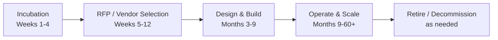

**Audience:** Enterprise Architects, Solution Architects, Security Architects, RAI/Governance Leads, Data Architects, Platform/MLOps Architects, Distinguished/Principal Architects, Delivery Leaders  
**Purpose:** Comprehensive catalog of deliverables expected from each architect role at every lifecycle stage — from incubation through retirement — illustrated across three use cases: Banking Loan Underwriting, Healthcare Prior Authorization, and Government Citizen Benefits.  
**Related:** AI-First to AI-Native Journey · AI Governance Operating Model · Constitutional AI Engineering · Enterprise AI Governance & Compliance

:::info Part 1 of 3
This is the first part of a three-part guide. Continue with [Part 2](pathname:///archon/architecture/parts/28-ai-solution-lifecycle-deliverables-part2) (Security, RAI/Governance, Solution, Distinguished, Data & Platform Architect Deep-Dives) and [Part 3](pathname:///archon/architecture/parts/29-ai-solution-lifecycle-deliverables-part3) (Use Case Walk-throughs & Architect's Checklist).
:::

:::info Current as of July 2026
This catalog aligns with EU AI Act (High-Risk AI system lifecycle requirements, Art. 9–17), ISO 42001:2023, and enterprise architecture frameworks (TOGAF 10, Zachman). Deliverable names match the TOGAF Architecture Development Method (ADM) where applicable.

---

## 1. Lifecycle Stages

The AI solution lifecycle spans five key stages: Incubation (Weeks 1–4), RFP / Vendor Selection (Weeks 5–12), Design & Build (Months 3–9), Operate & Scale (Months 9–60+), and Retire / Decommission (as needed). Each stage has distinct governance deliverables and decision gates.

---

## 2. Roles and Audiences

The following seven architect roles participate across the lifecycle, each with distinct responsibilities:

**Enterprise Architect (EA):** Strategic alignment, cross-domain architecture, Architecture Review Board (ARB) gatekeeper. Audience: C-suite, Board, Programme Steering.

**Security Architect (SA):** Threat model, security architecture, guardrails. Audience: CISO, Risk Committee, Compliance.

**RAI / Governance Lead:** AI constitution, fairness, ethics, responsible AI compliance. Audience: RAIO, Board, Regulators, Audit.

**Solution Architect:** Functional design, technical integration, delivery. Audience: Product Owner, Dev Teams, Operations.

**Distinguished / Principal Architect:** Technical vision, architecture decision records, design authority. Audience: CTO, Architecture Board, Dev Leadership.

**Data Architect:** Data contracts, lineage, residency, governance. Audience: CDO, Data Governance, Regulators.

**Platform / MLOps Architect:** AI platform, CI/CD for models, evaluation gates, cost governance. Audience: Platform Engineering, FinOps, Site Reliability.

---

## 3. Master Deliverables Matrix

The following matrix shows key deliverables mapped to owner, stage, and status:

| Deliverable | Owner | Stage 1 | Stage 2 | Stage 3 | Stage 4 | Stage 5 |
| --- | --- | --- | --- | --- | --- | --- |
| AI Strategy Brief | EA | ✅ Create | — | — | 📋 Review | — |
| AI Opportunity Assessment | EA | ✅ Create | — | — | 📋 Review | — |
| AI Safety Level Classification | EA + RAI | ✅ Create | 📋 Update | 📋 Confirm | 📋 Monitor | 📋 Final |
| ARB Submission | EA | Draft | — | ✅ Submit | 📋 Post-deploy | 📋 Decommission |
| Architecture Decision Records | DA / Principal | — | ✅ Create | ✅ Maintain | 📋 Review | 📋 Final |
| AI Reference Architecture | EA + DA | Concept | — | ✅ Final | — | — |
| Threat Model | SA | Preliminary | ✅ Full | ✅ Updated | 📋 Annual refresh | 📋 Close |
| Security RFP Requirements | SA | — | ✅ Create | — | — | — |
| Security Architecture Doc | SA | — | — | ✅ Create | 📋 Review | 📋 Close |
| AI Impact Assessment | RAI | ✅ Preliminary | ✅ Full | ✅ Final | 📋 Annual | ✅ Retirement |
| AI Constitution | RAI | — | RAI criteria | ✅ Create | 📋 Monitor | ✅ Archive |
| Model Card | RAI + MLOps | — | — | ✅ Create | 📋 Maintain | ✅ Archive |
| Fairness Evaluation Report | RAI | — | — | ✅ Pre-deploy | 📋 Monthly | ✅ Final |
| Bias Monitoring Playbook | RAI | — | — | ✅ Create | 📋 Execute | 📋 Close |
| RAI Ethics Audit Report | RAI | — | — | — | 📋 Annual | ✅ Final |
| Feasibility Study | Solution Arch | ✅ Create | — | — | — | — |
| Vendor Comparison | Solution Arch | — | ✅ Create | — | — | — |
| Solution Design Document | Solution Arch | — | — | ✅ Create | 📋 Review | — |
| Production Runbook | Solution Arch | — | — | ✅ Create | 📋 Maintain | 📋 Close |
| Data Landscape Assessment | Data Arch | ✅ Create | — | — | — | — |
| Data Contract + Lineage | Data Arch | — | RFP reqs | ✅ Create | 📋 Maintain | 📋 Archive |
| Data Residency Audit | Data Arch | — | — | ✅ Create | 📋 Annual | ✅ Final |
| Data Deletion / Purge Plan | Data Arch | — | — | — | — | ✅ Create & Execute |
| AI Landing Zone Design | MLOps | — | — | ✅ Create | 📋 Maintain | — |
| CI/CD for Models | MLOps | — | — | ✅ Create | 📋 Maintain | 📋 Decommission |
| Eval Gate Framework | MLOps | — | — | ✅ Create | 📋 Maintain | 📋 Archive |
| Model Drift Pipeline | MLOps | — | — | ✅ Create | 📋 Operate | 📋 Decommission |
| Cost Governance Model | MLOps + EA | — | — | ✅ Create | 📋 Monthly | 📋 Final |
| Decommission Plan | EA + All | — | — | — | Plan | ✅ Execute |

---

## 4. Role Deep-Dives

### 4.1 Enterprise Architect

**Incubation:** The Enterprise Architect creates the AI Strategy Brief, a one to two page executive summary answering why the initiative matters, how it aligns with organizational strategy, expected value, and key risks. An AI Opportunity Assessment follows, providing structured feasibility evaluation. Audience: CEO, Chief AI Officer, Programme Steering Committee.

**RFP / Vendor Selection:** The Enterprise Architect defines RFP Architecture Evaluation Criteria, scoring vendor AI platforms against enterprise standards. Key criteria include sovereign AI capability (can it run on sovereign infrastructure? Is it air-gappable?), constitutional / guardrail support (native policy engine? Model Context Protocol support?), model governance (registry, versioning, audit?), integration maturity (enterprise patterns, API standards), security certifications (ISO 27001, SOC 2, EU certification?), and pricing / FinOps (cost transparency, scaling model).

**Design & Build:** The Enterprise Architect owns the Reference Architecture — a full architecture diagram with annotated layers covering governance, orchestration, model, data, and infrastructure. This document must pass Architecture Review Board (ARB) review. An ARB Submission follows: standard ARB package including architecture overview, decision log, risk register, dependency map, responsible AI alignment, and regulatory compliance statement. Audience: Architecture Review Board, RAIO, Chief Risk Officer.

**Operate & Scale:** The Enterprise Architect conducts a Post-Implementation Review at 90 days after launch, comparing actual versus expected performance, incidents, governance findings, and recommendations. An AI System Performance Dashboard provides quarterly review: model performance, fairness metrics, cost, and incidents.

**Retire / Decommission:** The Enterprise Architect validates the Decommission Architecture Review, ensuring retirement is safe: data deletion plan confirmed, dependencies mapped, regulatory retention met, knowledge transferred.

## Related

- [APEX EA Part 1: Team Structure, RACI & Operating Model](09-apex-ea-team-structure-raci.md) — the team structure these role-based deliverables map onto.
- [Enterprise AI Architect — Foundations](48-enterprise-ai-architect-foundations.md) — the architect role this deliverables matrix is built around.

