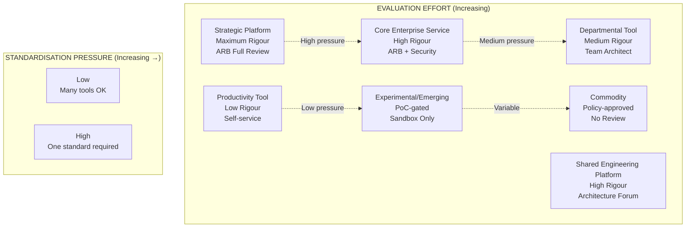
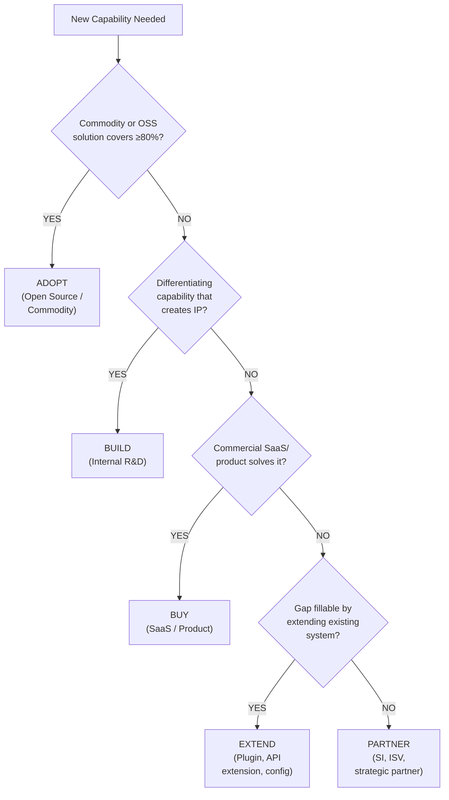
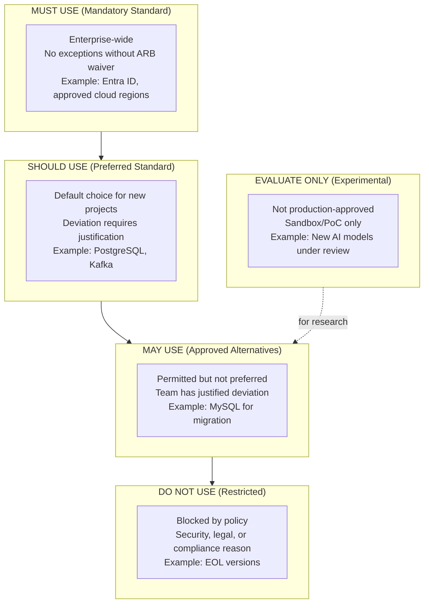
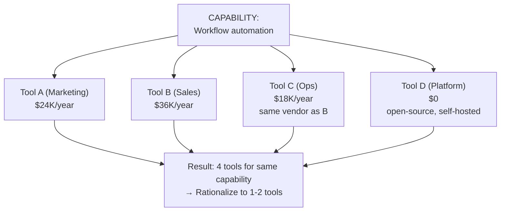
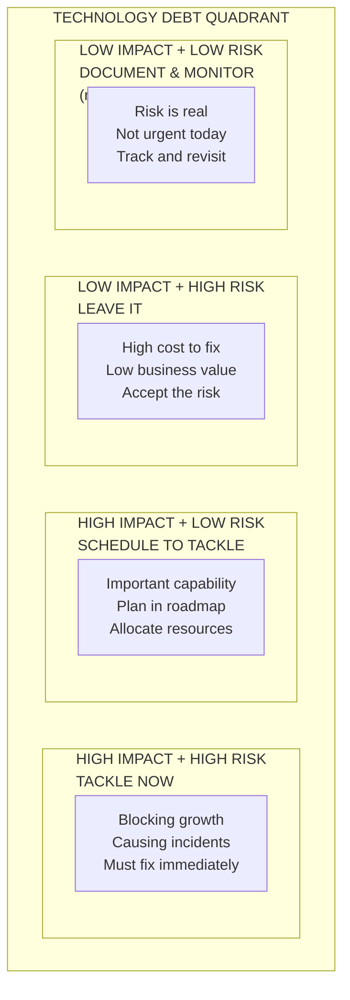

# Enterprise Technology Selection & Decision Framework (Part 1 of 2)

**Audience:** Enterprise architects, architecture review boards (ARBs), platform engineering leads, CTO/CIO advisors, technology procurement teams, and engineering leadership.

**Purpose:** A vendor-neutral, repeatable framework for evaluating, comparing, selecting, governing, and retiring technologies across the enterprise AI, cloud, platform engineering, security, data, DevOps, and application landscape.

**Scope (Part 1 of 2):** Decision philosophy, classification taxonomy, evaluation criteria, scoring methodologies, buy/build/partner framework, lifecycle management, PoC standards, and risk assessment. See Part 2 for vendor evaluation, TCO modelling, ARB process, ADR templates, anti-patterns, and reference models.

**Related:** [Architectural Review Board](pathname:///archon/architecture/00-wiki-governance) | [Technology Investment Fundamentals](pathname:///archon/architecture/00-wiki-governance) | [AI Solution Lifecycle](pathname:///archon/architecture/00-wiki-governance) | [Multi-Model AI Strategy](pathname:///archon/architecture/00-wiki-governance)

---

## Table of Contents

1. [Technology Decision Philosophy](#1-technology-decision-philosophy)
2. [Technology Classification Framework](#2-technology-classification-framework)
3. [Enterprise Decision Criteria](#3-enterprise-decision-criteria)
4. [Weighted Decision Matrix Methods](#4-weighted-decision-matrix-methods)
5. [Buy vs Build vs Extend vs Partner](#5-buy-vs-build-vs-extend-vs-partner)
6. [Architecture Fitness Assessment](#6-architecture-fitness-assessment)
7. [Technology Lifecycle Management](#7-technology-lifecycle-management)
8. [Proof of Concept Framework](#8-proof-of-concept-framework)
9. [Enterprise Standards and Exceptions](#9-enterprise-standards-and-exceptions)
10. [Technology Rationalization](#10-technology-rationalization)

---

## 1. Technology Decision Philosophy

### 1.1 Core Principles

Enterprise technology selection should be governed by a set of explicit principles that prevent arbitrary, politically driven, or fad-driven decisions.

| Principle | Description | Anti-pattern it prevents |
| --- | --- | --- |
| **Business-first** | Technology is selected to solve a business problem, not because it is new or interesting | Technology-first architecture |
| **Capability-driven** | Select for the capability required, not the feature list offered | Feature checklist bias |
| **Strategic alignment** | Technology must fit or accelerate the enterprise's 3–5 year strategy | Tactical decisions that contradict strategy |
| **Platform thinking** | Prefer one platform that solves a class of problems over many tools that each solve one problem | Tool sprawl |
| **Standardisation over optimisation** | Enterprise-wide standards beat team-level best-of-breed | Local optimisation / global dysfunction |
| **Total cost awareness** | Evaluate TCO over 3–5 years, not acquisition cost alone | Licence-first procurement |
| **Simplicity bias** | A simpler solution that covers 90% of use cases beats a complex one that covers 100% | Accidental complexity |
| **Maintainability first** | Code/platform you can maintain in 5 years beats the best solution you cannot sustain | Operational debt |
| **Technology optionality** | Preserve the ability to switch or extend without rewriting everything | Premature lock-in |
| **Evidence over advocacy** | Decisions are backed by benchmarks, references, and PoCs — not vendor decks | Marketing influence |

### 1.2 Strategic Platform vs Best-of-Breed

The eternal tension in enterprise technology:

| Dimension | Strategic Platform | Best-of-Breed |
| --- | --- | --- |
| **Integration overhead** | Low (same vendor/ecosystem) | High (every tool is a separate integration) |
| **Operational complexity** | Low (one team, one contract, one upgrade cycle) | High (multiple vendors, multiple upgrade cycles) |
| **Capability ceiling** | Limited by platform roadmap | High (pick the best at each layer) |
| **Vendor dependency** | High | Distributed |
| **Total support cost** | Lower | Higher |
| **Innovation speed** | Slower (wait for platform roadmap) | Faster (adopt best new tool immediately) |
| **Migration cost when wrong** | Very high | Lower per tool (but compounding) |

**Recommendation:** Default to strategic platform. Deviate only when a specific best-of-breed capability is (a) measurably better, (b) cannot be solved by the platform, and (c) the integration cost is justified by the gain.

### 1.3 The Technology Optionality Principle

Build systems so you can change the underlying technology without rewriting business logic:

```
WRONG (zero optionality):
Application code → Vendor-specific SDK calls → Vendor APIs

RIGHT (technology optionality):
Application code → Internal abstraction → Adapters → Vendor APIs
                                         ↓
                                   Swap adapter = swap vendor
```

Optionality has a cost (abstraction overhead). Pay it only for decisions where switching is likely within 3 years or where the downside of lock-in is severe.

---

## 2. Technology Classification Framework

### 2.1 Technology Taxonomy

Different categories of technology warrant different levels of evaluation rigour.

| Category | Definition | Example | Evaluation Rigour |
| --- | --- | --- | --- |
| **Strategic Platform** | Foundational enterprise capability; affects every team; multi-year commitment | Cloud platform, identity provider, AI platform | Maximum — ARB full review |
| **Core Enterprise Service** | Shared service consumed by most teams; standardised | ITSM, CMDB, log aggregation, secrets management | High — ARB review + security |
| **Shared Engineering Platform** | Developer platform used across engineering | CI/CD, artifact registry, IaC tooling, API gateway | High — Architecture forum |
| **Departmental Tool** | Used by one department or team; limited blast radius | Team-specific analytics, departmental workflow tool | Medium — Team architect review |
| **Productivity Tool** | Individual productivity; minimal integration | IDE extensions, documentation tools | Low — Self-service with guardrails |
| **Experimental Technology** | Unproven; active research phase; not production | New AI model family, novel database paradigm | Sandboxed PoC only |
| **Emerging Technology** | Proven in industry but not yet in enterprise | Post-quantum cryptography, confidential computing | Technology radar assessment |
| **Commodity Technology** | Undifferentiated; widely adopted; low risk | S3-compatible storage, Markdown, HTTP | Approve by policy; no review |
| **Differentiating Capability** | Provides competitive advantage; proprietary logic | Proprietary AI model fine-tunes, custom DSP | Build, protect; evaluate build-vs-buy carefully |

### 2.2 Evaluation Rigour by Category



**Technology Category Evaluation Matrix.** Strategic platforms require maximum rigour where organizational standardization is critical; commodity technologies require policy approval only. Each category maps to distinct governance gates.


---

## 3. Enterprise Decision Criteria

### 3.1 The Evaluation Dimensions

Every technology decision should be assessed across five dimensions. Weight each dimension based on organisation context (see [Section 4](#4-weighted-decision-matrix-methods)).

#### Business Dimension

| Criterion | Description | How to Measure |
| --- | --- | --- |
| **Strategic alignment** | Does this advance our 3-year strategy? | Map to strategic objectives (1–5 scale) |
| **Business value** | What problem does it solve? What is the value of that solution? | Quantified benefit: revenue, cost, risk, speed |
| **Time to value** | How quickly will we realise benefit after investment? | Weeks from start to first production value |
| **User adoption likelihood** | Will our users actually use this? | Similar tool adoption history; user research |
| **Customer impact** | Does it improve outcomes for end customers? | NPS, support ticket reduction, feature parity |
| **Competitive advantage** | Does it differentiate us from competitors? | Market analysis; competitor adoption state |

#### Technical Dimension

| Criterion | Description | How to Measure |
| --- | --- | --- |
| **Architecture fit** | Does it fit our reference architecture? | Architecture fitness assessment (Section 6) |
| **Scalability** | Does it handle 10×–100× current load? | Load test results; vendor published limits |
| **Reliability** | What is the vendor SLA? What is our actual measured uptime? | SLA + historical uptime data |
| **Extensibility** | Can we customise or extend without forking? | Plugin/API/SDK maturity |
| **API maturity** | Is the API stable, versioned, and well-documented? | API changelog history; version policy |
| **Integration capability** | How difficult is it to integrate with existing systems? | Number of native integrations; webhook/event support |
| **Performance** | Does it meet our latency and throughput requirements? | Benchmark on representative workloads |
| **Interoperability** | Does it use open standards? | Standards compliance (OpenAPI, OAuth2, OTEL, etc.) |
| **Standards compliance** | Certifications and compliance (ISO, SOC 2, FIPS) | Current certification list from vendor |

#### Operational Dimension

| Criterion | Description | How to Measure |
| --- | --- | --- |
| **Operational complexity** | How hard is it to operate day-to-day? | Hours/week of platform team effort |
| **Automation support** | Can infrastructure and config be automated? | IaC support; GitOps compatibility |
| **Upgrade model** | How painful are version upgrades? | Upgrade frequency; breaking change history |
| **Supportability** | Do we have internal expertise to support it? | Skill survey; external support availability |
| **Monitoring** | Does it emit standard telemetry (metrics, logs, traces)? | OTEL compatibility; built-in dashboards |
| **Documentation quality** | Is the documentation sufficient for our team? | Read and rate: completeness, accuracy, examples |
| **Skill availability** | How easy is it to hire or train for this technology? | LinkedIn job market; certification availability |

#### Financial Dimension

| Criterion | Description | How to Measure |
| --- | --- | --- |
| **Total cost of ownership** | Full 3–5 year cost (see Section 13) | TCO model output |
| **Licensing model** | Predictable vs unpredictable? Per-seat, per-use, enterprise? | Model the cost at 2× and 5× scale |
| **Infrastructure costs** | Compute, storage, networking requirements | Cloud cost estimate at target scale |
| **Implementation costs** | Professional services, internal engineering time | Scope + rate × duration |
| **Training investment** | Cost to skill up the team | Courses, certifications, time-to-competency |
| **Exit costs** | Cost to migrate away if the decision is wrong | Data migration, re-implementation, retraining |

#### Security and Compliance Dimension

| Criterion | Description | How to Measure |
| --- | --- | --- |
| **Security posture** | Is the vendor's security posture strong? | Security assessment, pen test results, CVE history |
| **Identity integration** | Integrates with enterprise IdP (Entra ID, Okta, etc.)? | SAML, OIDC, SCIM support |
| **Compliance certifications** | SOC 2 Type II, ISO 27001, HIPAA, PCI-DSS, FedRAMP? | Vendor compliance documentation |
| **Auditability** | Does it produce audit-quality logs? | Log completeness; SIEM integration |
| **Data residency** | Where does data reside? Can it be restricted to a region? | Regional deployment options |
| **Encryption** | Data encrypted at rest and in transit? Encryption key management? | Encryption documentation; BYOK support |
| **Secrets management** | How are API keys and secrets managed? | Vault integration; no plaintext secrets |

#### Organisational Dimension

| Criterion | Description | How to Measure |
| --- | --- | --- |
| **Existing skills** | Do we have people who know this today? | Skill inventory |
| **Learning curve** | How long to productive competency? | Median time to first production contribution |
| **Internal champions** | Are there internal advocates for this technology? | Team survey |
| **Community adoption** | Is this widely adopted in our industry? | CNCF adopters, Thoughtworks Radar, Stack Overflow survey |
| **Change management impact** | How disruptive is the adoption? | Teams affected; workflow change depth |

---

## 4. Weighted Decision Matrix Methods

### 4.1 Choosing the Right Method

| Method | Best For | Complexity | Output |
| --- | --- | --- | --- |
| **Weighted scoring matrix** | Most enterprise decisions; structured comparison of 2–5 options | Low-Medium | Numeric score per option |
| **MoSCoW prioritisation** | Feature or requirement prioritisation before evaluation | Low | Must/Should/Could/Won't classification |
| **Pairwise comparison (AHP)** | Many options with unclear relative weight; when team disagrees on priorities | High | Prioritised weight set |
| **Kepner-Tregoe** | High-stakes decisions with serious downside risk; decisions with many must-have criteria | Medium-High | Go/No-go per option, then weighted scoring |
| **Decision tree** | Sequential decisions with dependencies; binary/branching decisions | Medium | Conditional recommendation tree |
| **Utility scoring** | Decisions involving uncertainty and probability | High | Expected utility per option |

### 4.2 Weighted Scoring Matrix — The Default Method

Use for most technology decisions involving 2–5 competing options.

**Step 1: Define criteria and weights**

Weights should reflect what matters most for THIS decision in THIS organisation at THIS time. Weights should sum to 100.

| Criterion Group | Weight (example) | Notes |
| --- | --- | --- |
| Business value | 25 | Higher for strategic platforms |
| Technical fit | 25 | Higher for infrastructure decisions |
| Security & compliance | 20 | Higher for regulated industries |
| Total cost of ownership | 15 | Higher for budget-constrained orgs |
| Operational complexity | 10 | Higher if ops team is small |
| Vendor risk | 5 | Higher for single-source dependencies |

**Step 2: Score each option on each criterion (1–5 scale)**

| Criterion | Weight | Option A | Option B | Option C |
| --- | --- | --- | --- | --- |
| Strategic alignment | 10 | 4 (40) | 3 (30) | 5 (50) |
| Business value | 15 | 5 (75) | 4 (60) | 3 (45) |
| Architecture fit | 15 | 4 (60) | 5 (75) | 3 (45) |
| Security posture | 10 | 5 (50) | 4 (40) | 3 (30) |
| TCO (5yr) | 15 | 3 (45) | 4 (60) | 5 (75) |
| Operational complexity | 10 | 4 (40) | 3 (30) | 4 (40) |
| Skill availability | 10 | 5 (50) | 3 (30) | 2 (20) |
| Vendor stability | 15 | 4 (60) | 5 (75) | 2 (30) |
| **TOTAL** | **100** | **420** | **400** | **335** |

**Step 3: Sensitivity analysis**

Vary weights by ±10% for the top three criteria. If the ranking changes, the decision is sensitive to those weights — have an explicit conversation about them with stakeholders.

**Step 4: Must-have gate**

Before the matrix, define hard requirements (must-haves). Any option failing a must-have is eliminated regardless of score.

Common must-haves: SOC 2 Type II, data residency in EU, no per-seat > $X, native SSO.

### 4.3 Pairwise Comparison (for Setting Weights)

When stakeholders disagree on weights, use pairwise comparison to derive consensus weights through the Analytic Hierarchy Process:

```
Compare each criterion pair:
- Business value vs Technical fit: Business value moderately more important → 3
- Business value vs Security: About equal → 1
- Technical fit vs Security: Technical fit slightly more → 2
... (compare all pairs)

Normalise the pairwise matrix to derive consistent weights.
```

Tools: AHP-OS (open-source), Super Decisions, Excel AHP template.

### 4.4 Kepner-Tregoe (for High-Stakes Decisions)

Used when the cost of a wrong decision is very high. Process:

1. **Define objectives:** MUSTS (non-negotiable) and WANTS (scored)
2. **Screen options against MUSTS:** Eliminate any option that fails any MUST
3. **Score remaining options against WANTS**
4. **Assess adverse consequences:** For each viable option, what could go wrong?
5. **Make balanced choice:** Best WANTS score with lowest adverse consequence risk

---

## 5. Buy vs Build vs Extend vs Partner

### 5.1 Decision Tree

<!-- TODO(diagram): ASCII decision tree showing evaluation flow from "NEW CAPABILITY NEEDED" through ADOPT, BUILD, BUY, EXTEND, PARTNER outcomes. -->



### 5.2 Options Compared

| Dimension | Buy (SaaS/Product) | Build | Extend | Open Source | Partner |
| --- | --- | --- | --- | --- | --- |
| **Time to value** | Fast | Slow | Medium | Medium | Medium |
| **Initial cost** | Medium | High (engineering) | Low-Medium | Low | Variable |
| **Long-term cost** | Predictable (licence) | Low (maintenance) | Low | Low | High (ongoing) |
| **Flexibility** | Low (vendor roadmap) | Maximum | Medium | High | Vendor-dependent |
| **IP ownership** | None | Full | Partial | None (contribution) | Shared |
| **Vendor risk** | High | None | Medium | Community risk | Partner risk |
| **Maintenance burden** | Low | High | Medium | Medium | Low |
| **Customisation ceiling** | Hard limit | None | Moderate | Full (fork) | Moderate |
| **Skill requirement** | User skills | Engineering depth | Integration skills | OSS skills | Partner management |

### 5.3 When to Build

Build only when:

- The capability is a core differentiator and constitutes IP
- No commercial or open-source alternative achieves ≥70% fit
- You have the engineering capacity AND intend to maintain it long-term
- The build cost over 3 years is less than the buy + integration cost

**Anti-pattern:** Building because the team thinks it will be fun or believes they can do better than the market. That is almost never true for commodity capabilities.

### 5.4 When Open Source Is the Right Answer

Open source is frequently the best answer for infrastructure and platform components:

| Use case | Why OSS wins |
| --- | --- |
| Container orchestration | Kubernetes is the standard; no commercial alternative matches ecosystem |
| Observability pipeline | OpenTelemetry; vendor-neutral; avoids telemetry lock-in |
| Self-hosted AI models | Data control; no per-token cost; compliance for sensitive data |
| Developer tooling | Community-maintained; broad plugin ecosystem |
| Integration middleware | Apache Kafka, Flink; more extensible than commercial alternatives |

**OSS risk factors to evaluate:** Project health (commit velocity, number of maintainers), foundation backing (CNCF, Apache, Linux Foundation), commercial support availability, security CVE response time.

---

## 6. Architecture Fitness Assessment

### 6.1 Beyond Feature Comparison

Feature checklists compare what a technology can do. Architecture fitness assesses whether it fits how your enterprise operates. A technology that scores 9/10 on features but 3/10 on fitness will cost 10× more to integrate and operate.

### 6.2 Fitness Dimensions

| Dimension | Assessment Question | Evidence Needed |
| --- | --- | --- |
| **EA alignment** | Does it fit our target architecture (cloud-native, event-driven, API-first)? | Architecture diagram of integration |
| **Cloud strategy fit** | Compatible with our cloud platform strategy (AWS / Azure / GCP)? | Deployment options; managed service availability |
| **Data architecture fit** | How does it handle data flows, schemas, lineage? | Data flow diagram; schema compatibility |
| **Security architecture fit** | Integrates with our security controls (IdP, SIEM, secrets vault, WAF)? | Security integration diagram |
| **Platform engineering fit** | Deployable via our IaC and CI/CD pipelines? | Terraform provider; Helm chart; GitOps support |
| **Integration architecture** | Uses our integration patterns (event bus, API, CDC)? | Integration connector inventory |
| **Event-driven compatibility** | Can it publish and consume events? | Kafka / Event Bridge / SNS connector |
| **API-first readiness** | Does it expose everything via API? Or is the GUI the only interface? | API coverage matrix |
| **Automation readiness** | Can it be fully automated? Or does it require manual steps? | CLI/API completeness |
| **AI readiness** | Can AI agents interact with it via APIs or MCP? | API coverage; MCP connector availability |
| **Observability standard** | Does it emit OpenTelemetry-compatible telemetry? | OTel native; OTEL contrib; custom |

### 6.3 Fitness Scoring

For each dimension: 1 = blocking (cannot integrate without major rework) / 3 = partial fit (workarounds needed) / 5 = native fit (works with existing patterns).

Sum scores. Products below 60% of maximum require architectural exception approval.

### 6.4 Integration Complexity Estimate

Before committing, estimate the integration work:

```
INTEGRATION COMPLEXITY MODEL

Simple (1–3 weeks):
  - REST API available; authentication via API key or OAuth2
  - Standard data format (JSON/YAML)
  - No custom network configuration needed

Medium (1–2 months):
  - Custom authentication (SAML, complex OAuth2 flows)
  - Requires middleware (API gateway config, event bus wiring)
  - Schema mapping required
  - 1–3 custom integrations to existing systems

Complex (3–6 months):
  - On-premise deployment; network peering required
  - Custom network topology (VPN, private link)
  - Migration of existing data
  - Multiple system integrations with complex event flows
  - Custom security controls needed

Strategic (6–18 months):
  - Platform-level adoption affecting multiple teams
  - Data migration at scale
  - Organisational change management required
  - Multiple dependent system changes
```

---

## 7. Technology Lifecycle Management

### 7.1 Lifecycle Stages

```
EVALUATE → PILOT → LIMITED ADOPTION → ENTERPRISE STANDARD → MAINTENANCE → SUNSET → RETIRED
```

| Stage | Description | Who Can Use | Entry Criteria | Exit Criteria |
| --- | --- | --- | --- | --- |
| **Evaluate** | Research, PoC, market assessment | Platform team, selected engineers | Technology identified as candidate | PoC complete; decision to advance or reject |
| **Pilot** | Production pilot with limited scope | 1–2 volunteer teams | PoC success; ARB approval to pilot | Pilot success criteria met; wider adoption recommended |
| **Limited Adoption** | Available to all teams; not yet mandatory | Any team (opt-in) | Pilot success; ARB approval; runbook published | Sufficient adoption; operational maturity demonstrated |
| **Enterprise Standard** | Preferred solution for this category; new projects use this | All teams | ARB standard designation; training available | Better alternative emerges; technology shows critical weakness |
| **Maintenance** | Existing use maintained; no new adoption recommended | Existing users only | Standard replaced by better solution | All dependent systems migrated |
| **Sunset** | Scheduled retirement; no new integrations | Existing users only | Retirement date set; migration path available | 90-day notice sent to all consumers |
| **Retired** | Fully decommissioned | No one | All migrations complete | Removed from registry; historical record retained |

### 7.2 Technology Radar (Adopt / Trial / Assess / Hold)

Inspired by the Thoughtworks Technology Radar format:

| Zone | Meaning | Action |
| --- | --- | --- |
| **Adopt** | We use this in production; proven value; recommended as default | Use it for new projects; invest in skills |
| **Trial** | Worth pursuing; explore with intent to adopt; controlled risk | Use on a project; gather data; re-assess in 6 months |
| **Assess** | Worth knowing about; not yet ready to trial | Sandbox exploration; monitor; reassess in 12 months |
| **Hold** | Proceed with caution; do not start new use; existing use only | No new projects; plan migration for existing use |

Conduct radar updates quarterly. Publish to all engineering teams.

### 7.3 Deprecation Checklist

When retiring a technology:

- [ ] Identify all teams using the technology (from service registry / CMDB)
- [ ] Communicate 6-month advance notice via architecture forum and team leads
- [ ] Publish migration guide to successor technology
- [ ] Offer migration support (platform team office hours, migration scripts)
- [ ] Set hard retirement date (minimum 90 days after notification)
- [ ] Update registry status to Sunset then Retired
- [ ] Automate blocking of new deployments after sunset date
- [ ] Retain audit records per retention policy

---

## 8. Proof of Concept Framework

### 8.1 The PoC Problem

PoCs that succeed on technical dimensions are often promoted to production without proper validation. This creates two failure modes:

1. **Technical PoC ≠ production system:** PoC code becomes production code with all its shortcuts
2. **PoC ≠ enterprise context:** PoC runs in ideal conditions; production has different data, scale, and operational constraints

The PoC framework prevents both by requiring explicit validation gates before promotion.

### 8.2 PoC Scope Definition

Before starting a PoC, document:

```yaml
# PoC Charter Template
poc_name: "LLM Platform Evaluation — Q3 2026"
problem_statement: |
  We need an AI inference platform for 3 production use cases.
  Current state: multiple teams using different providers, no central governance.

evaluation_options:
  - name: "Option A"
    description: "Commercial managed service"
  - name: "Option B"  
    description: "Self-hosted open-source"

success_criteria:
  technical:
    - "Latency P95 < 2s for standard requests under 500 concurrent users"
    - "99.9% uptime demonstrated over 2-week sustained load"
    - "Integration with Entra ID SSO verified"
    - "All audit logs available in SIEM within 30 minutes"
  business:
    - "3 use cases implemented end-to-end"
    - "Developer experience rated ≥4/5 by pilot team"
  security:
    - "Penetration test completed; no critical findings"
    - "Data residency confirmed in EU region"
  operational:
    - "Deploy via existing Terraform modules"
    - "Alerts integrated into PagerDuty"
    - "Runbook documented and reviewed"
  cost:
    - "5-year TCO modelled; within budget envelope"

exit_criteria:
  promote: "All success criteria met"
  iterate: "≥80% met; gaps have clear remediation plan"
  reject: "<80% met; or any critical finding"

constraints:
  duration: "6 weeks"
  team: "2 platform engineers + 1 security engineer"
  budget: "$20,000 (infrastructure + licences)"
  data: "Synthetic data only; no production data in PoC"
```

### 8.3 PoC Validation Dimensions

| Dimension | What to Validate | Who Validates |
| --- | --- | --- |
| **Technical** | Core functionality, integration with enterprise systems, performance at target scale | Platform team |
| **Security** | Authentication, authorisation, data handling, vulnerability assessment | Security architect |
| **Operational** | Deployment automation, monitoring, alerting, runbook | SRE / Platform ops |
| **Business** | Solves the stated problem; users can complete target workflows | Product owner + pilot users |
| **Cost** | Infrastructure cost at scale; licence cost at scale; TCO validated | Finance + platform team |
| **Compliance** | Data residency, audit logging, compliance certifications verified | Compliance / legal |

### 8.4 Preventing PoC Creep

PoC creep is when a PoC accumulates users, production data, and dependencies before formal approval.

Controls:

- PoC environments are isolated from production networks by default
- PoC data policies: synthetic or anonymised data only
- PoC has a hard expiry date (maximum 8 weeks); extensions require ARB approval
- Any PoC system receiving production data triggers automatic security review
- Go/No-Go gate is mandatory before any production traffic

---

## 9. Enterprise Standards and Exceptions

### 9.1 Standards Hierarchy



### 9.2 Exception Process

When a team needs to deviate from a mandatory or preferred standard:

1. **Submit exception request** (see ADR template in Part 2)
2. **State the business justification** — why the standard doesn't fit
3. **State the risk acknowledgment** — what risks does this deviation create?
4. **State the exit plan** — how will you re-align with the standard within 18 months?
5. **ARB reviews** within 2 business days for blocking issues; 2 weeks for planned deviations
6. **Exception is time-limited** (12–18 months maximum); reassessed at renewal

### 9.3 Standards Registry

Maintain a living standards registry accessible to all engineers:

| Category | Standard | Status | Since | Next Review |
| --- | --- | --- | --- | --- |
| Identity | Microsoft Entra ID | Mandatory | 2024-01 | 2027-01 |
| Secrets management | HashiCorp Vault | Mandatory | 2023-06 | 2026-06 |
| Observability | OpenTelemetry + Datadog | Preferred | 2025-03 | 2026-12 |
| Container orchestration | Kubernetes (EKS/AKS/GKE) | Mandatory | 2022-09 | 2027-09 |
| AI model access | Internal AI Gateway (LiteLLM) | Mandatory | 2026-01 | 2027-01 |
| Event streaming | Apache Kafka (MSK/Confluent) | Preferred | 2024-04 | 2026-12 |
| Relational database | PostgreSQL (RDS / Azure Flexible) | Preferred | 2023-01 | 2026-12 |
| Programming language | Python / TypeScript / Go | Preferred | 2024-01 | 2027-01 |

---

## 10. Technology Rationalization

### 10.1 The Platform Sprawl Problem

Without active rationalization, enterprises accumulate:

- Multiple tools solving identical problems (tool sprawl)
- Overlapping platforms from department-level acquisition
- Zombie licenses for unused SaaS tools
- Duplicate data stores with conflicting records

The FinOps Foundation estimates 30–40% of enterprise SaaS spend is on underutilised or redundant tools.

### 10.2 Rationalization Process

**Step 1: Inventory**

Create a complete technology inventory:

- Query CMDB, IT asset management, finance (license payments)
- Query cloud accounts (all running resources)
- Survey teams for shadow IT (tools used but not centrally tracked)

**Step 2: Capability Mapping**

Map each tool to the capability it provides:



**Step 3: Functional Overlap Analysis**

| Tool | Primary Capability | Secondary Capabilities | Unique Features | Users | Cost/year |
| --- | --- | --- | --- | --- | --- |
| Tool A | Workflow automation | Notifications, integrations | Custom AI step | 50 | $24K |
| Tool B | Workflow automation | Approval workflows | None | 120 | $36K |
| Tool C | Workflow automation | Scheduling | SFTP connector | 30 | $18K |

Winner: Tool B covers most users; negotiate enterprise licence; migrate Tool A and C users.

**Step 4: Consolidation Plan**

| Quarter | Action |
| --- | --- |
| Q1 | Notify Tool A and C users; document migration path |
| Q2 | Migrate Tool A users to Tool B |
| Q3 | Migrate Tool C users to Tool B |
| Q4 | Cancel Tool A and C licences |

### 10.3 Rationalisation Triggers

- Annual licence renewal approaching (review before auto-renewing)
- New enterprise capability added (does this replace an existing tool?)
- Team merger or reorganisation
- Annual technology audit
- Budget pressure (rationalize to cut spend)

### 10.4 Technical Debt Assessment

Not all technical debt is worth paying. Use this model:



---

## See Also

**Part 2 of this framework:** Risk Assessment Framework, Vendor Evaluation, Total Cost of Ownership, ARB Decision Process, Decision Documentation (ADR templates), Success Metrics, Anti-Patterns, Reference Models by Organisation Type, and Templates/Checklists. See [Enterprise Technology Selection & Decision Framework (Part 2 of 2)](pathname:///archon/architecture/25-enterprise-technology-selection-framework-part2).
