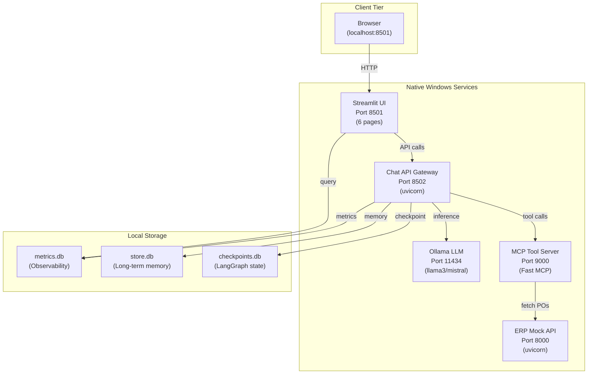

**This is Part 1 of 2.** See [Part 2: Skills, Observability, UI, Deployment & Glossary](pathname:///archon/architecture/ai-invoice-auditor-architecture-part2) for sections §7–§13.

# 1. What Changed in v5.0 — Executive Summary

v5.0 is a targeted ground-up rewrite of the runtime-layer choices made in v3/v4, driven by the constraint of running entirely on a single Windows machine with no Docker or cloud services. Simultaneously, all agent patterns have been upgraded to match the current LangChain 0.3+ official documentation for HITL middleware, multi-agent handoffs, skill loading, runtime injection, and long-term memory.

| Area | Was (v4) | Now (v5) |
| --- | --- | --- |
| HITL | `interrupt_before=[...]` compile-time + HITLMiddleware class | `HumanInTheLoopMiddleware` with `interrupt_on={}` + approve/edit/reject decisions via Command(resume=...) |
| Checkpointer | PostgresSaver (Docker required) | SqliteSaver from langgraph-checkpoint-sqlite — single .db file, no server |
| Observability | LangFuse (Docker) + SQLite dual-write | SQLite MetricsDB only — LangFuse removed entirely |
| Short-term memory | ConversationBufferWindowMemory (Redis required) | AgentState messages list — in-context, no server needed |
| Long-term memory | Not specified | SqliteStore (langgraph.store.sqlite) — namespaced key-value, accessed via ToolRuntime.store |
| Skills | Class-based Skill(ABC) with run() method | Prompt-driven tools using load_skill() progressive disclosure — per official LangChain Skills docs |
| Handoffs | Not implemented | Single-agent middleware pattern: tools return `Command(update={current_step:...})` to transition between invoice processing stages |
| Runtime context | Global config objects + manual threading | context_schema + ToolRuntime[Context] — LangChain dependency injection per official Runtime docs |
| Docker | Required (LangFuse, PostgreSQL, Redis) | Eliminated entirely — all services run as native Windows Python processes |

## **2. SQLite-First Infrastructure — No Docker Required**

## **2.1 Three SQLite Files — One Per Concern**

The entire v5.0 persistence layer uses three SQLite database files stored locally on the Windows machine. No servers, no Docker containers, no network dependencies.

| File | Path (Windows) | Purpose |
| --- | --- | --- |
| checkpoints.db | %APPDATA%\InvoiceAuditor\checkpoints.db | LangGraph graph state — SqliteSaver checkpointer. Survives process restarts. Required for HITL interrupt/resume. |
| store.db | %APPDATA%\InvoiceAuditor\store.db | Long-term memory store — SqliteStore. Per-invoice decisions, auditor preferences, vendor history, approved override patterns. |
| metrics.db | %APPDATA%\InvoiceAuditor\metrics.db | Observability — all agent node timings, MCP tool call timings, HITL decisions, RAG scores. Queried by Observability UI page. |

## **2.2 SQLite Checkpointer Setup**

```python
# src/core/persistence.py  — v5.0

from pathlib import Path
import os
from langgraph.checkpoint.sqlite import SqliteSaver
from langgraph.store.sqlite import SqliteStore          # long-term memory

# Windows-safe APPDATA path

APP_DIR = Path(os.getenv('APPDATA', Path.home())) / 'InvoiceAuditor'
APP_DIR.mkdir(parents=True, exist_ok=True)

CHECKPOINTS_DB = APP_DIR / 'checkpoints.db'
STORE_DB       = APP_DIR / 'store.db'
METRICS_DB     = APP_DIR / 'metrics.db'

# SqliteSaver — drop-in replacement for PostgresSaver / MemorySaver

# Thread-safe, file-based, zero config

checkpointer = SqliteSaver.from_conn_string(str(CHECKPOINTS_DB))

# SqliteStore — long-term memory (namespaced key-value)

# Supports vector search when an embed function is provided

from sentence_transformers import SentenceTransformer
_embed_model = SentenceTransformer('all-MiniLM-L6-v2')

def _embed(texts: list[str]) -> list[list[float]]:
    return _embed_model.encode(texts).tolist()

store = SqliteStore.from_conn_string(
    str(STORE_DB),
    index={'embed':_embed, 'dims': 384}  # MiniLM dims
)
```

## **2.3 Port Map — All Native Windows Processes**



**AI Invoice Auditor v5.0 System Architecture.** All services run as native Windows Python processes orchestrated via a single start_all.bat script, with SQLite providing persistence—eliminating Docker complexity while maintaining distributed service model.

With Docker removed, every service is a native Windows Python process or .exe. The entire system starts from one .bat file.

| Port | Service | Process Type | Notes |
| --- | --- | --- | --- |
| 8501 | Streamlit UI | Python (native) | All 6 UI pages — opens in browser automatically |
| 8502 | Chat API Gateway | Python uvicorn | /chat /stream /hitl /dashboard |
| 8000 | ERP Mock API | Python uvicorn | `GET /purchase-orders/{po_id}` |
| 9000 | MCP Tool Server | Python (Fast MCP) | 11 MCP tools registered |
| 11434 | Ollama | Windows exe | Local LLM — llama3/mistral. No internet needed after pull. |
| ✅ None | SQLite files | File system | checkpoints.db / store.db / metrics.db in %APPDATA%\InvoiceAuditor\ |

## **2.4 start_all.bat — v5.0 (Docker-Free)**

```batch
@echo off
SETLOCAL
SET ROOT=%~dp0
SET VENV=%ROOT%.venv\Scripts

echo [1/5] Starting Ollama...
start "Ollama" /MIN ollama serve
timeout /t 5 /nobreak > nul

echo [2/5] Pulling model if needed...
ollama pull llama3 2>nul

echo [3/5] Starting MCP Tool Server (port 9000)...
start "MCP Server" /MIN cmd /c "%VENV%\python.exe tools\mcp_server.py"
timeout /t 3 /nobreak > nul

echo [4/5] Starting ERP Mock API (port 8000)...
start "ERP Mock" /MIN cmd /c "%VENV%\uvicorn.exe erp_mock.main:app --port 8000"
timeout /t 3 /nobreak > nul

echo [5/5] Starting Streamlit UI (port 8501)...
start "Streamlit" cmd /c "%VENV%\streamlit.exe run ui\app.py"

echo ===================================================================
echo  All services started (no Docker required)
echo  UI:      <http://localhost:8501>
echo  ERP API: <http://localhost:8000/docs>
echo  SQLite:  %APPDATA%\InvoiceAuditor\
echo ===================================================================
pause
```

## **3. Human-in-the-Loop — HumanInTheLoopMiddleware (v5.0)**

Source: *<https://docs.langchain.com/oss/python/langchain/human-in-the-loop>*

## **3.1 How It Works — Official Pattern**

The official LangChain HITL pattern uses **HumanInTheLoopMiddleware** added to the agent's **middleware** list at creation time. The middleware intercepts tool calls after the model generates them but before execution. If a tool matches **interrupt_on**, it raises an **interrupt** and the graph state is saved to the SQLite checkpointer. The UI then presents the action and collects a decision (**approve**, **edit**, or **reject**). Execution resumes via **`Command(resume={"decisions":[...]})`** with the same thread_id.

| Decision Type | Symbol | Invoice Auditor Meaning |
| --- | --- | --- |
| approve | ✅ Execute as-is | Auditor confirms discrepancy is acceptable — run approve_invoice tool as proposed |
| edit | ✏️ Modify args first | Auditor corrects a field value before approval — e.g. change override amount |
| reject | ❌ Cancel + feedback | Auditor rejects invoice — message fed back to agent to generate rejection report |

## **3.2 Agent Creation with HumanInTheLoopMiddleware**

```python
# src/agents/invoice_audit_agent.py  — v5.0

from langchain.agents import create_agent, AgentState
from langchain.agents.middleware import HumanInTheLoopMiddleware
from src.core.persistence import checkpointer, store
from src.core.llm_factory import get_llm
from src.tools.invoice_tools import (
    approve_invoice, reject_invoice, override_invoice_field,
    flag_for_escalation
)

class InvoiceAuditState(AgentState):
    """Short-term memory lives here — the messages list IS the conversation.
    Between turns the SqliteSaver checkpointer persists this automatically.
    """
    invoice_id:         str
    current_step:       str   = 'triage'   # used by Handoffs (Section 4)
    discrepancies:      list  = []
    confidence:         float = 0.0
    final_status:       str   = ''
    auditor_id:         str   = ''

# -- Tools that require human approval before execution -----

# approve_invoice  — approve payment: high-stakes, all decisions allowed

# reject_invoice   — reject vendor:   approve or reject only, no edit

# override_invoice_field — field edit: must edit before execution

# flag_for_escalation   — safe: auto-approve, no human needed

audit_agent = create_agent(
    model=get_llm(),                   # Ollama llama3 via LLMFactory
    tools=[
        approve_invoice,
        reject_invoice,
        override_invoice_field,
        flag_for_escalation,
    ],
    state_schema=InvoiceAuditState,
    context_schema=InvoiceContext,     # Runtime dependency injection (Section 5)
    store=store,                       # Long-term memory (Section 6)
    middleware=[
        HumanInTheLoopMiddleware(
            interrupt_on={
                # Approve/edit/reject: auditor gets full control
                'approve_invoice': True,
                # No editing allowed — approve or reject only
                'reject_invoice': {
                    'allowed_decisions': ['approve', 'reject'],
                    'description': 'Confirm invoice rejection before notifying vendor',
                },
                # Must provide corrected values — edit required
                'override_invoice_field': {
                    'allowed_decisions': ['edit', 'reject'],
                    'description': 'Review field override — edit values if incorrect',
                },
                # Safe operation — no human needed
                'flag_for_escalation': False,
            },
            description_prefix='Invoice audit action requires auditor approval',
        ),
    ],
    checkpointer=checkpointer,  # SqliteSaver — persists state for resume
    system_prompt=(
        'You are an invoice audit agent. Review flagged invoices and take ',
        'appropriate actions. Always explain your reasoning before calling a tool.'
    ),
)
```

## **3.3 Invoking the Agent — Interrupt & Resume Flow**

```python
# src/agents/hitl_runner.py  — v5.0

from langgraph.types import Command
from src.agents.invoice_audit_agent import audit_agent
from src.observability.metrics_db import MetricsDB
import time

metrics = MetricsDB()

def run_audit(invoice_id: str, discrepancies: list, auditor_id: str):
    """Run agent until interrupt, then return interrupt payload to UI."""
    thread_id = f'audit:{invoice_id}'
    config    = {'configurable': {'thread_id': thread_id}}

    t0 = time.perf_counter()
    result = audit_agent.invoke(
        {
            'messages': [{'role': 'user',
                          'content': f'Review invoice {invoice_id}. '
                                     f'Discrepancies: {discrepancies}'}],
            'invoice_id':   invoice_id,
            'discrepancies': discrepancies,
            'auditor_id':   auditor_id,
        },
        config=config,
    )

    # Log HITL interrupt to SQLite metrics
    if '__interrupt__' in result:
        metrics.log_hitl_interrupt(
            invoice_id=invoice_id,
            thread_id=thread_id,
            actions=[a['name'] for a in
                     result['__interrupt__'][0].value['action_requests']],
            elapsed_ms=int((time.perf_counter()-t0)*1000)
        )
    return result

def resume_audit(invoice_id: str, decisions: list, auditor_id: str):
    """Resume after human provides decisions (approve / edit / reject).
    Called by Chat API Gateway POST /hitl/{invoice_id}/decision
    """
    thread_id = f'audit:{invoice_id}'
    config    = {'configurable': {'thread_id': thread_id}}
    t0 = time.perf_counter()

    result = audit_agent.invoke(
        Command(resume={'decisions': decisions}),
        config=config,  # same thread_id — SqliteSaver restores full state
    )

    metrics.log_hitl_decision(
        invoice_id=invoice_id,
        auditor_id=auditor_id,
        decisions=decisions,
        elapsed_ms=int((time.perf_counter()-t0)*1000)
    )
    return result

def stream_audit(invoice_id: str, discrepancies: list, auditor_id: str):
    """Streaming variant — yields AG-UI compatible events.
    Streamlit Chat screen uses this via httpx.stream.
    """
    thread_id = f'audit:{invoice_id}'
    config    = {'configurable': {'thread_id': thread_id}}

    for mode, chunk in audit_agent.stream(
        {'messages': [{'role': 'user',
                       'content': f'Review invoice {invoice_id}'}],
         'invoice_id': invoice_id,
         'discrepancies': discrepancies},
        config=config,
        stream_mode=['updates', 'messages'],
    ):
        if mode == 'messages':
            token, _ = chunk
            if token.content:
                yield {'type': 'TextDelta', 'delta': token.content}
        elif mode == 'updates' and '__interrupt__' in chunk:
            yield {'type': 'HumanInputRequired',
                   'interrupt': chunk['__interrupt__']}
```

## **3.4 Streamlit HITL Review Page — Decision UI**

```python
# ui/pages/3_HITL_Review.py  — v5.0

import streamlit as st
import httpx, json

st.title('HITL Review — Invoice Audit Decisions')

invoice_id = st.selectbox('Invoice awaiting review', get_pending_hitl_invoices())

if invoice_id:
    # Load the interrupt payload from Chat API Gateway
    interrupt_data = httpx.get(
        f'http://localhost:8502/hitl/{invoice_id}/interrupt').json()

    for i, action in enumerate(interrupt_data['action_requests']):
        st.subheader(f'Action {i+1}: {action["name"]}')
        st.json(action['arguments'])
        st.markdown(f'**Review guidance:** {action["description"]}')

        review_cfg  = interrupt_data['review_configs'][i]
        allowed     = review_cfg['allowed_decisions']
        decision    = st.radio(f'Decision for {action["name"]}',
                               allowed, horizontal=True, key=f'dec_{i}')

        edited_args = None
        if decision == 'edit':
            st.markdown('**Edit arguments:**')
            edited_args = {}
            for k, v in action['arguments'].items():
                edited_args[k] = st.text_input(k, value=str(v), key=f'edit_{i}_{k}')

        reject_msg = None
        if decision == 'reject':
            reject_msg = st.text_area('Rejection reason (required)',
                                      min_chars=10, key=f'msg_{i}')

    if st.button('Submit Decision', type='primary'):
        decisions = []
        for i, action in enumerate(interrupt_data['action_requests']):
            d = {'type': st.session_state[f'dec_{i}']  }
            if d['type'] == 'edit':
                d['edited_action'] = {'name': action['name'],
                                      'args': {k: st.session_state[f'edit_{i}_{k}']
                                               for k in action['arguments']}}
            elif d['type'] == 'reject':
                d['message'] = st.session_state[f'msg_{i}']
            decisions.append(d)

        httpx.post(f'http://localhost:8502/hitl/{invoice_id}/decision',
                   json={'decisions': decisions,
                         'auditor_id': st.session_state.auditor_id})
        st.success('Decision submitted — graph resuming...')
        st.rerun()
```

## **4. Multi-Agent Handoffs — Invoice Processing Stages**

Source: *<https://docs.langchain.com/oss/python/langchain/multi-agent/handoffs>*

## **4.1 Why Handoffs Fit Invoice Processing**

The official LangChain handoffs pattern is ideal for the Invoice Auditor because invoice processing is a **sequential, state-driven flow** where each stage unlocks the next only when preconditions are met (e.g., extraction must succeed before translation; translation must reach 0.80 confidence before validation). The **single-agent middleware approach** is used here — one agent changes its system prompt and available tools based on the **current_step** state variable, updated by handoff tools returning **`Command(update={...})`**.

## **4.2 Invoice Processing Stages via Handoffs**

| current_step | Agent Configuration | Handoff Tool → Next Step |
| --- | --- | --- |
| triage | Detect format + language; read meta.json | complete_triage() → 'extraction' |
| extraction | Run data_harvester MCP tool per format | complete_extraction(confidence) → 'translation' (non-EN) or 'validation' |
| translation | Translate non-English fields via LLM | complete_translation(confidence) → 'validation' if ≥0.80 else 'hitl' |
| validation | Check completeness + ERP cross-validation | complete_validation(result) → 'reporting' if auto-approve else 'hitl' |
| hitl | HumanInTheLoopMiddleware active — approve/edit/reject tools exposed | HITL decision → 'reporting' |
| reporting | Generate HTML report + index to FAISS | End of pipeline |

## **4.3 Handoff Implementation — Single Agent Middleware**

```python
# src/agents/pipeline_agent.py  — v5.0 Handoffs pattern

from langchain.agents import AgentState, create_agent
from langchain.agents.middleware import wrap_model_call, ModelRequest, ModelResponse
from langchain.tools import tool, ToolRuntime
from langchain.messages import ToolMessage
from langchain.agents.middleware import HumanInTheLoopMiddleware
from langgraph.types import Command
from src.core.persistence import checkpointer, store
from src.core.llm_factory import get_llm
from typing import Callable

# -- State carries current_step across all turns --------

class InvoicePipelineState(AgentState):
    invoice_id:             str
    raw_file_path:          str
    current_step:           str   = 'triage'
    language:               str   = 'en'
    extraction_confidence:  float = 0.0
    translation_confidence: float = 0.0
    discrepancies:          list  = []
    flags:                  list  = []
    final_status:           str   = ''

# -- Handoff tools — each updates current_step via Command ----

@tool
def complete_triage(
    detected_language: str,
    file_format: str,
    """Complete triage stage and hand off to extraction."""
            content=f'Triage complete: {file_format} invoice in {detected_language}',
        )],
        'language':     detected_language,
        'current_step': 'extraction',
    })

@tool
def complete_extraction(
    confidence: float,
    """Complete extraction and route to translation (non-EN) or validation."""
    next_step = 'translation' if runtime.state.get('language','en') != 'en' else 'validation'
            content=f'Extraction complete. Confidence={confidence:.2f}. Next: {next_step}',
        )],
        'extraction_confidence': confidence,
        'current_step': next_step,
    })

@tool
def complete_translation(
    translation_confidence: float,
    """Complete translation. Route to HITL if confidence < 0.80."""
    next_step = 'validation' if translation_confidence >= 0.80 else 'hitl'
            content=f'Translation confidence={translation_confidence:.2f}. Routing to {next_step}.',
        )],
        'translation_confidence': translation_confidence,
        'current_step': next_step,
    })

@tool
def complete_validation(
    discrepancies: list,
    confidence: float,
    """Complete validation. Auto-approve if confidence>=0.95 and no discrepancies."""
    if confidence >= 0.95 and not discrepancies:
        next_step, status = 'reporting', 'auto_approved'
    else:
        next_step, status = 'hitl', 'needs_review'
            content=f'Validation: {len(discrepancies)} discrepancies. Status={status}.',
        )],
        'discrepancies': discrepancies,
        'final_status':  status,
        'current_step':  next_step,
    })

# -- Stage configuration map ------

STAGE_CONFIGS = {
    'triage': {
        'prompt': 'Detect the invoice language and format. Call complete_triage when done.',
        'tools':  [complete_triage],
    },
    'extraction': {
        'prompt': 'Extract invoice fields using the data_harvester MCP tool. Call complete_extraction.',
        'tools':  [complete_extraction],
    },
    'translation': {
        'prompt': 'Translate non-English invoice fields to English. Call complete_translation.',
        'tools':  [complete_translation],
    },
    'validation': {
        'prompt': 'Validate completeness and cross-check with ERP. Call complete_validation.',
        'tools':  [complete_validation],
    },
    'hitl': {
        'prompt': 'An invoice requires human review. Present findings and await auditor decision.',
        'tools':  [],   # HumanInTheLoopMiddleware adds approve/reject/override
    },
    'reporting': {
        'prompt': 'Generate the HTML audit report and index the invoice.',
        'tools':  [],
    },
}

# -- Middleware: apply stage config based on current_step ----

@wrap_model_call
def apply_stage_config(
    request: ModelRequest,
    handler: Callable[[ModelRequest], ModelResponse],
) -> ModelResponse:
    step   = request.state.get('current_step', 'triage')
    config = STAGE_CONFIGS[step]
    request = request.override(
        system_prompt=config['prompt'],
        tools=config['tools'],
    )
    return handler(request)

# -- Pipeline agent — single agent, all stages ----

pipeline_agent = create_agent(
    model=get_llm(),
    tools=[
        complete_triage, complete_extraction,
        complete_translation, complete_validation,
    ],
    state_schema=InvoicePipelineState,
    context_schema=InvoiceContext,
    store=store,
    middleware=[
        apply_stage_config,          # dynamic config based on current_step
        HumanInTheLoopMiddleware(    # HITL only active in 'hitl' stage
            interrupt_on={
                'approve_invoice': True,
                'reject_invoice':  {'allowed_decisions': ['approve','reject']},
                'override_invoice_field': {'allowed_decisions': ['edit','reject']},
                'flag_for_escalation': False,
            },
            description_prefix='Invoice requires auditor decision',
        ),
    ],
    checkpointer=checkpointer,
)
```

## **5. Runtime Context Injection**

Source: *<http://docs.langchain.com/oss/python/langchain/runtime>*

LangChain's Runtime provides dependency injection for tools and middleware. Instead of global config objects, database connections and request-scoped values are declared in a **context_schema** dataclass and injected via **ToolRuntime[Context]**. This makes all tools testable in isolation and eliminates thread-safety issues from shared mutable state.

## **5.1 InvoiceContext — Dependency Schema**

```python
# src/context.py  — v5.0

from dataclasses import dataclass
from src.protocols.mcp_client import InstrumentedMCPClient
from src.observability.metrics_db import MetricsDB

@dataclass
class InvoiceContext:
    """All dependencies for an invoice audit run.
    Passed at invocation time — injected into every tool via ToolRuntime.
    """
    run_id:     str                      # unique per pipeline invocation
    invoice_id: str                      # current invoice being processed
    auditor_id: str = ''                 # set when human is involved
    mcp:        InstrumentedMCPClient = None  # MCP tool client (instrumented)
    metrics:    MetricsDB = None          # SQLite metrics writer
    erp_base_url: str = 'http://localhost:8000'
```

## **5.2 Using ToolRuntime in MCP Tool Wrappers**

```python
# src/tools/invoice_tools.py  — v5.0

import time
from langchain.tools import tool, ToolRuntime

@tool
def data_harvester_tool(
    file_path: str,
) -> dict:
    """Extract invoice data from PDF/DOCX/PNG using MCP data_harvester tool.

    The ToolRuntime injects the MCP client and metrics writer automatically.
    No global state is used.
    """
    mcp     = runtime.context.mcp
    metrics = runtime.context.metrics
    run_id  = runtime.context.run_id

    t0 = time.perf_counter()
    result = mcp.invoke_tool('data_harvester', {'file_path': file_path}, run_id)
    elapsed = int((time.perf_counter() - t0) * 1000)

    if metrics:
        metrics.log_tool_call(
            run_id=run_id,
            tool_name='data_harvester',
            duration_ms=elapsed,
            status='ok' if result else 'error',
        )
    return result

@tool
def approve_invoice(
    invoice_id: str,
    reason: str,
    """Approve an invoice for payment. Requires HITL approval before execution.

    This tool is intercepted by HumanInTheLoopMiddleware — the auditor
    must approve, edit, or reject it before it executes.
    """
    # Write approval to long-term memory store
    if runtime.store:
        runtime.store.put(
            ('invoices', 'decisions'),
            invoice_id,
            {'action': 'approved', 'reason': reason,
             'auditor': runtime.context.auditor_id}
        )
    return f'Invoice {invoice_id} approved. Reason: {reason}'
```

## **5.3 Agent Invocation with Context**

```python
# Invoking the pipeline agent with full context injection

from src.agents.pipeline_agent import pipeline_agent
from src.protocols.mcp_client import InstrumentedMCPClient
from src.observability.metrics_db import MetricsDB
import uuid

run_id = str(uuid.uuid4())

result = pipeline_agent.invoke(
    {'messages': [{'role': 'user',
                   'content': f'Process invoice docs/incoming/INV_ES_003.pdf'}],
     'invoice_id': 'INV-ES-003',
     'raw_file_path': 'docs/incoming/INV_ES_003.pdf'},
    config={'configurable': {'thread_id': f'pipeline:INV-ES-003'}},
    context=InvoiceContext(
        run_id=run_id,
        invoice_id='INV-ES-003',
        mcp=InstrumentedMCPClient(host='localhost', port=9000),
        metrics=MetricsDB(),
    ),
)
```

## **6. Short-Term & Long-Term Memory**

Sources: *<https://docs.langchain.com/oss/python/langchain/short-term-memory>*  |  *<https://docs.langchain.com/oss/python/langchain/long-term-memory>*

## **6.1 Two Memory Tiers — Clear Separation**

| Tier | LangChain Mechanism | Invoice Auditor Usage |
| --- | --- | --- |
| Short-term | AgentState.messages list — persisted per thread in SqliteSaver checkpointer | All conversation turns within a single invoice run. Auditor chat history. Agent reasoning and tool call results in context window. |
| Long-term | SqliteStore via langgraph.store.sqlite — namespaced key-value, vector-searchable | Approved override patterns across invoices. Auditor preference profiles. Vendor risk history. Past HITL decisions (ground-truth for future auto-approval tuning). |

## **6.2 Short-Term Memory — AgentState**

Short-term memory requires no special setup. The **AgentState.messages** list is automatically persisted to the SQLite checkpointer between invocations. When the agent is resumed (after HITL interrupt or across separate API calls), the **thread_id** in config is used to reload the full message history from checkpoints.db.

```python
# Short-term memory is automatic via SqliteSaver + thread_id

# The agent remembers everything within a conversation thread

# Turn 1 — initial processing

result1 = pipeline_agent.invoke(
    {'messages': [{'role':'user','content':'Process INV-1001'}]},
    config={'configurable': {'thread_id': 'pipeline:INV-1001'}},
    context=ctx,
)

# Turn 2 — after HITL decision (SqliteSaver restores all state automatically)

result2 = pipeline_agent.invoke(
    Command(resume={'decisions': [{'type': 'approve'}]}),
    config={'configurable': {'thread_id': 'pipeline:INV-1001'}},  # same thread
    context=ctx,
)

# Agent has full context of turn 1 — no state passed manually
```

## **6.3 Long-Term Memory — SqliteStore**

Long-term memory is stored in store.db using LangGraph's **SqliteStore**. It is organised by namespace tuples (like folders) and keys. Tools access it via **runtime.store** — the same store instance passed to **create_agent(store=store)**. Vector search is enabled for semantic recall.

```python
# src/memory/long_term.py  — v5.0 memory namespaces

from src.core.persistence import store

# -- Namespace design ------

# ('vendors', vendor_id)       → vendor risk profile + payment history

# ('invoices', 'decisions')    → all HITL decisions per invoice_id key

# ('auditors', auditor_id)     → auditor preference + override patterns

# ('patterns', 'overrides')    → approved override templates by type

@tool
def recall_vendor_history(
    vendor_id: str,
    """Look up this vendor's past invoice decisions from long-term memory.

    Used by validation stage to auto-adjust confidence thresholds
    for trusted vendors with clean payment history.
    """
    if not runtime.store:
        return 'No vendor history available (store not initialised)'

    vendor_mem = runtime.store.get(('vendors',), vendor_id)
    if vendor_mem:
        return str(vendor_mem.value)
    return f'No prior history for vendor {vendor_id}'

@tool
def save_audit_decision(
    invoice_id: str,
    action: str,
    reason: str,
    override_fields: dict,
    """Save HITL decision to long-term memory.

    Future pipeline runs can query past decisions to improve
    auto-approval thresholds and detect repeat issues.
    """
    if runtime.store:
        runtime.store.put(
            ('invoices', 'decisions'),
            invoice_id,
            {
                'action':          action,
                'reason':          reason,
                'override_fields': override_fields,
                'auditor_id':      runtime.context.auditor_id,
            }
        )
        # Also update vendor history with this outcome
        vendor_id = runtime.state.get('extracted',{}).get('vendor_id','')
        if vendor_id:
            existing = runtime.store.get(('vendors',), vendor_id)
            history  = existing.value if existing else {'decisions':[],'risk':'unknown'}
            history['decisions'].append({'invoice_id':invoice_id,'action':action})
            runtime.store.put(('vendors',), vendor_id, history)
    return f'Decision saved for {invoice_id}'

@tool
def semantic_recall_override_patterns(
    query: str,
    """Vector-search long-term memory for similar past override patterns.

    Helps the agent suggest appropriate override values based on
    what auditors have done before in similar situations.
    """
    if not runtime.store:
        return 'Store not available'
    results = runtime.store.search(
        ('patterns',), query=query   # uses MiniLM embeddings from store init
    )
    if not results:
        return 'No similar patterns found'
    return str([r.value for r in results[:3]])
```
