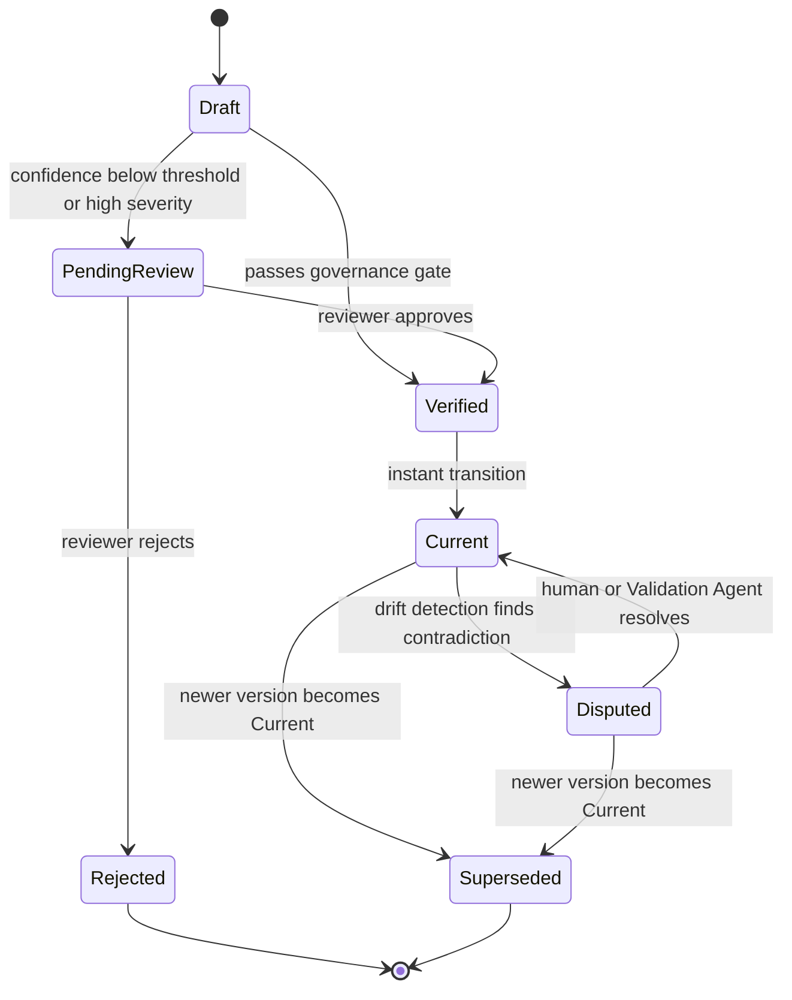

**Part 1 of 2.** Continue reading in [Part 2](pathname:///archon/architecture/parts/30-akes-addendum-document-update-and-versioning-part2): Changelog, Partial Updates, Retention & Governance Integration.

# AKES Addendum: Document Update & Versioning

Addendum to the Autonomous Knowledge Engineering System Brief

Extends: _AKES Architecture & Design Brief, June 2026_

Architecture Addendum — June 2026

## Contents

A1. Overview & Design Intent

A2. Document Version Lifecycle — State Machine

A3. How Updates Are Triggered

A4. The Three Update Paths (Agent / Human / Conflict)

A5. Version Store — Schema & Provenance

## A1. Overview & Design Intent

The main AKES brief describes what knowledge artifacts exist, how agents produce them, and how they are trusted. This addendum answers a more operational question: once a document artifact exists, how is it updated when the world changes — and how are successive versions managed so that history is never lost and consumers always know what version they are reading?

Three properties the versioning design must satisfy:

1. **Immutability of published versions.** Once a version reaches Current status, its content must not be silently changed. Changes produce a new version. This means any reader — human or agent — can always retrieve exactly what was published at a given date and trace why it changed.

2. **Diff-based, not full-rewrite updates.** A change to one service's dependency should not regenerate an entire Architecture Knowledge Pack. The Documentation Agent targets only the affected section(s), preserving human edits in unaffected sections.

3. **Bidirectionality.** The system reads from existing tools (GitHub, Confluence, Slack) and writes back to them. When a human edits a document in the published surface, that edit must flow back into the version store and the knowledge graph — not be silently overwritten the next time an agent processes a related change.

**Key design rule:** Human edits from the owning team always win over a concurrent agent-proposed draft. The agent's draft is discarded and re-evaluated against the human-edited state — it never silently overwrites human intent.

## A2. Document Version Lifecycle — State Machine

Every version of every artifact moves through a defined set of states. Transitions are triggered by agent decisions, human actions, or drift detection events — never by time alone.

**State definitions**

| State | Meaning | Visible to consumers? |
|---|---|---|
| Draft | Agent has produced a proposed diff. Not yet approved. Stored in the version store but not published. | No — internal only |
| PendingReview | Routed to human reviewer because confidence is below threshold or severity is high. The previous Current version remains active but is flagged with an "update pending" banner. | Partially — current version flagged |
| Verified | Passed governance gate (auto or human). Transitional — becomes Current immediately on approval. | No — instant transition |
| Current | The live, published version. Only one version per artifact can be Current at a time. | Yes — the default version readers see |
| Disputed | Drift Detection Agent found a high-severity contradiction in a Current version. The version is still readable but displayed with a visible warning. Requires owning team resolution. | Yes — with warning banner |
| Superseded | A newer version has become Current. This version is retained in the version store, queryable by date or version number, but not served by default. | Only on explicit historical query |
| Rejected | Human reviewer rejected the draft, or the draft was discarded due to a conflict with a concurrent human edit (Path C). Feedback is returned to the Documentation Agent for revision. | No — internal only |

### Critical invariants enforced by the Governance Agent

Exactly one version per artifact has status Current at any moment.

No version content is mutated in place after it leaves Draft — only its status field is updated.

A version in Superseded or Rejected state is never automatically deleted.

A version in Disputed state cannot be auto-resolved — a human or the Validation Agent must explicitly act.

## A3. How Updates Are Triggered

Updates to any document artifact are driven entirely by events, not by schedule. This is the "living document" property: the artifact responds to the world changing, within minutes rather than on a weekly batch cycle.

### Trigger event taxonomy

| Event type | Example | Typical artifacts affected |
|---|---|---|
| Code commit / PR merge | New database connection added to service A | Architecture Pack (dependency graph, data flows), Developer Pack (setup, build) |
| CI/CD pipeline change | New deployment target added | Developer Pack (deployment process), Architecture Pack (environment topology) |
| IaC change | Security group rule modified | Architecture Pack (security boundaries) — auto-routed to PendingReview by default given the sensitivity |
| Incident opened / closed | INC-4471 closed with postmortem | Operations Pack (common failures, runbooks), Architecture Pack (if root cause reveals undocumented dependency) |
| ADR / RFC merged | ADR-022: deprecate legacy endpoint | Architecture Pack (affected service entries), Developer Pack (coding standards / API guidelines) |
| Slack / conversation distilled | SME Interview Agent produces FAQ from thread | Developer Pack (FAQ section), Operations Pack (troubleshooting), Architecture Pack (rationale section) |
| Human edit on published surface | On-call engineer corrects runbook step during incident | Operations Pack (affected runbook) — always a high-trust, high-priority update |
| Scheduled drift scan | Weekly full-graph comparison pass | Any artifact where a claim can no longer be corroborated — triggers Disputed status, not a new version |
| API spec change | New endpoint added to OpenAPI spec | Architecture Pack (API surface in service catalog), AI Agent Pack (available tools if this is an MCP-exposed API) |

### What does NOT trigger an update

The Discovery Agent filters events before dispatching to the Documentation Agent. Events that do not affect any claim in the knowledge graph — for example, a commit that only changes test data, a comment-only PR, or a Slack message that the NL Extraction Agent scores as low-information — are acknowledged, stored in the raw document store for provenance, and not escalated to the update pipeline. This filter is essential for preventing update noise at high commit velocity.

## A4. The Three Update Paths

Every update to a document artifact follows one of three paths, depending on its origin. The sequence diagram below shows all three paths in a single view, including the conflict resolution rule when Path A and Path B collide.

<!-- TODO(diagram): Sequence diagram showing three update paths: Path A (agent-driven), Path B (human edit), and Path C (conflict resolution). Original fig ea-p7-2.png. -->

### Path A — Agent-driven update (most common)

The Documentation Agent reads the current version of the artifact from the version store, identifies which section(s) are affected by the triggering change, and produces a diff — not a full rewrite. This diff is written as a new Draft version. The Governance Agent then evaluates it against the auto-approve policy:

- If both confidence score ≥ threshold and blast radius is low → auto-approve: transition to Verified → Current, transition previous version to Superseded, publish to the relevant surface.

- If either condition fails → transition to PendingReview, flag the current version as "update pending," route a review request to the owning team via their preferred channel (Slack/Teams/ticket).

### Path B — Human edit (bidirectional connector)

A human edits a published document directly in the wiki, portal, or runbook repository. The bidirectional connector for that surface detects the edit via webhook or polling and fires a change event back to the system. The Discovery Agent recognizes this as a human edit on artifact X and writes it immediately as a new version with:

**source: human**

- **confidence: 1.0** (human-authoritative, specifically the owning team)

- **human-reviewed: true**, with the editor's identity from the surface's auth context

Critically, any queued agent Draft for the same artifact is discarded immediately — not routed through governance, not merged, simply voided. The knowledge graph is also updated: all claims derived from the affected section are re-evaluated against the new human-provided text and marked Verified (human-confirmed).

### Path C — Conflict (agent draft vs. concurrent human edit)

If an agent Draft exists in the version store at the moment a human edit event arrives for the same artifact, the Governance Agent detects the collision and applies the following deterministic resolution:

1. The human edit (v_m) is written and becomes Current immediately.

2. The agent draft (v_n+1) is transitioned to Rejected with reason conflict:human-edit.

3. The Documentation Agent is asked to re-evaluate its proposed changes against v_m as the new baseline — some of the agent's proposed changes may still be valid and will be re-submitted as a new Draft against v_m.

**Why human always wins in a conflict.** The primary risk in the AKES design (inherited from the Netflix principle cited in the main brief) is wrong-but-confident output reaching consumers. A human edit from the owning team represents the highest possible trust signal. Merging agent and human edits would introduce the risk of an agent's drift-unaware change silently overriding a human correction — precisely the failure mode the entire system exists to prevent.

## A5. Version Store — Schema & Provenance

The version store is an append-only log of artifact versions. It is separate from the knowledge graph (which stores entities and relationships) and from the raw document store (which stores original source artifacts). Its purpose is to be the authoritative record of what was published, when, why, and by whom.

<!-- TODO(diagram): Version store structure diagram showing four versions across five months with changelog rollup. Original fig ea-p9-3.png. -->

### Per-version metadata schema

| Field | Type | Purpose |
|---|---|---|
| **version_id** | UUID | Globally unique; not a sequential integer, to avoid distributed coordination on ID generation |
| **artifact_id** | UUID | Foreign key to the artifact entity in the knowledge graph |
| **version_number** | Integer (monotonic per artifact) | Human-readable sequence for display ("v4 of payments-runbook") |
| **status** | Enum | Current state in the lifecycle (Draft / PendingReview / Verified / Current / Superseded / Rejected / Disputed) |
| **content_hash** | SHA-256 | Hash of the full document content at this version — enables tamper detection and deduplication |
| **diff_from_prev** | Structured diff (section-level) | What changed from the previous version, stored as a structured diff rather than raw text — enables section-level queries ("what changed in the runbook's recovery procedure section?") |
| **trigger_event_ref** | String | Reference to the originating change event (commit SHA, incident ID, PR number, "human:wiki-edit:user@org") |
| **producing_agent** | String | Agent role + model version that produced this version (e.g., DocAgent/claude-sonnet-4-6). human for Path B edits. |
| **confidence_score** | Float [0.0–1.0] | Confidence at time of production. 1.0 for human-origin versions. |
| **source_citations** | Array of refs | Source artifact references used to produce/validate this version (commit, Slack thread, ADR, postmortem) |
| **human_reviewed** | Boolean | True if a human reviewer explicitly approved (PendingReview → Verified path) or authored (Path B) |
| **reviewer_id** | String (optional) | Identity of the human reviewer or editor, from auth context |
| **governance_policy_id** | String | Which auto-approve policy rule was applied (if auto-approved), for audit calibration |
| **created_at** | Timestamp (UTC) | When this version was written to the store |
| **published_at** | Timestamp (UTC, nullable) | When this version became Current — null for Rejected/Draft versions |
| **superseded_at** | Timestamp (UTC, nullable) | When a newer version replaced this one as Current |

### Why content_hash matters

The content hash serves two purposes. First, it enables the version store to detect if two distinct change events produce semantically identical content — a common case when two unrelated commits both touch the same service's entry in the catalog — allowing the system to skip publishing an identical version. Second, it provides a tamper-evident record: if a version's stored content no longer matches its hash, the system knows it was modified outside the normal write path, which should be treated as a security event.

## Related

- [Enterprise Agent Knowledge Architecture (EAKA) Research Study](81-eaka-research-study.md) — the research study this addendum extends.

