# DSA Principal Architect Reference

Hard &amp; Medium Concepts · Snippets · Examples · Tradeoffs

Graphs &amp; Trees · Dynamic Programming · System-Design DSA · Arrays / Strings / Sorting

```mermaid
graph TB
    subgraph GraphsAlgos["Graph Algorithms"]
        TopoSort["Topological Sort<br/>Kahn's / DFS<br/>O(V+E)"]
        ShortPath["Shortest Path<br/>Dijkstra / BFS / Bellman-Ford<br/>O((V+E) log V) to O(VE)"]
        Bridges["Bridges &amp; Articulation<br/>Tarjan's Algorithm<br/>O(V+E)"]
    end
    
    subgraph TreeAlgos["Tree/Range Algorithms"]
        SegTree["Segment Tree + Lazy<br/>Range queries/updates<br/>O(log n)"]
        LCA["Lowest Common Ancestor<br/>Binary Lifting<br/>O(log n) query"]
    end
    
    subgraph DPAlgos["Dynamic Programming"]
        IntervalDP["Interval DP<br/>Burst Balloons<br/>O(n³)"]
        TreeDP["Tree DP<br/>Max Independent Set<br/>O(n)"]
        Knapsack["Knapsack Variants<br/>0/1, Unbounded, Bitmask<br/>O(nW) to O(2^n·n²)"]
        CHT["Convex Hull Trick<br/>Line optimization<br/>O(n)"]
    end
    
    subgraph SystemDSA["System-Design DSA"]
        LRU["LRU Cache<br/>HashMap + DLL<br/>O(1)"]
        LFU["LFU Cache<br/>HashMap + Ordered Dict<br/>O(1)"]
        RateLimit["Rate Limiting<br/>Token/Leaky Bucket<br/>O(1)"]
        Bloom["Bloom Filter<br/>Set membership<br/>O(k)"]
        ConsHash["Consistent Hashing<br/>Distributed routing<br/>O(log n)"]
    end
    
    subgraph ArraysStrings["Arrays, Strings &amp; Sorting"]
        MonoStack["Monotonic Stack<br/>Histogram/Sliding Max<br/>O(n)"]
        SlidingWindow["Sliding Window<br/>Min window substring<br/>O(n)"]
        BinSearch["Binary Search on Answer<br/>Feasibility check<br/>O(n log range)"]
        MergeSort["Merge Sort Applications<br/>Count inversions<br/>O(n log n)"]
        StringAlgo["String Algorithms<br/>KMP/Rabin-Karp/Aho-Corasick<br/>O(n+m)"]
    end
    
    GraphsAlgos --> TreeAlgos
    TreeAlgos --> DPAlgos
    DPAlgos --> SystemDSA
    SystemDSA --> ArraysStrings
    
    style TopoSort fill:#e3f2fd
    style LRU fill:#f3e5f5
    style IntervalDP fill:#fff3e0
    style MonoStack fill:#e8f5e9
```



**Algorithm Taxonomy: Principal Architect Core Competencies**

This reference synthesizes hard and medium DSA concepts essential for enterprise architects designing scalable systems. It focuses on patterns that recur in interviews, production system design, and architectural decision-making.

## 1 · Graphs &amp; Trees

### 1.1 Topological Sort

Topological ordering of a DAG – critical for build systems, task scheduling, dependency resolution. Two canonical algorithms:

#### Kahn's Algorithm (BFS-based)

Maintain in-degree counts. Repeatedly extract zero-in-degree nodes into result. If result length &lt; V, a cycle exists.

**Kahn's Topological Sort — O(V+E)**

```python
from collections import deque
def topo_sort_kahn(graph, num_nodes):
    in_degree = [0] * num_nodes
    for u in graph:
        for v in graph[u]:
            in_degree[v] += 1
    queue = deque(i for i in range(num_nodes) if in_degree[i] == 0)
    order = []
    while queue:
        node = queue.popleft()
        order.append(node)
        for neighbor in graph.get(node, []):
            in_degree[neighbor] -= 1
            if in_degree[neighbor] == 0:
                queue.append(neighbor)
    if len(order) != num_nodes:
        raise ValueError("Graph has a cycle!")
    return order
# Example: 5->2->3->1, 5->0->4->1
graph = {5:[2,0], 4:[0,1], 2:[3], 3:[1], 0:[], 1:[]}
print(topo_sort_kahn(graph, 6))  # [4, 5, 0, 2, 3, 1]
```

#### DFS-based Topological Sort

Post-order DFS; reverse the finish stack. Use 3-color marking (0=white, 1=gray, 2=black) to detect back edges (cycles).

**DFS Topological Sort with cycle detection**

```python
def topo_sort_dfs(graph, num_nodes):
    WHITE, GRAY, BLACK = 0, 1, 2
    color = [WHITE] * num_nodes
    stack = []
    has_cycle = [False]
    def dfs(u):
        if has_cycle[0]: return
        color[u] = GRAY
        for v in graph.get(u, []):
            if color[v] == GRAY:       # back edge = cycle
                has_cycle[0] = True; return
            if color[v] == WHITE:
                dfs(v)
        color[u] = BLACK
        stack.append(u)                # post-order
    for i in range(num_nodes):
        if color[i] == WHITE:
            dfs(i)
    if has_cycle[0]:
        raise ValueError("Cycle detected")
    return stack[::-1]               # reverse = topological order
```

**Note:** Kahn's makes cycle detection explicit (queue empties early). DFS post-order is elegant but risks stack overflow on very deep graphs – convert to iterative for production.

### 1.2 Shortest Path Algorithms

| **Algorithm** | **Graph Type** | **Complexity** | **Key Use Case** |
|---|---|---|---|
| `BFS` | `Unweighted` | `O(V+E)` | `Hops, layers, word ladder` |
| `Dijkstra` | `Non-negative weights` | `O((V+E) log V)` | `GPS routing, network paths` |
| `Bellman-Ford` | `Negative weights OK` | `O(VE)` | `Currency arbitrage` |
| `A*` | `Weighted + heuristic` | `O(E log V) avg` | `Game pathfinding` |
| `Floyd-Warshall` | `All-pairs` | `O(V³)` | `Dense graphs, small V` |

**Dijkstra &amp; Bellman-Ford**

```python
import heapq
def dijkstra(graph, src, n):
    """graph[u] = [(weight, v), ...]"""
    dist = [float('inf')] * n
    dist[src] = 0
    pq = [(0, src)]           # (cost, node)
    while pq:
        d, u = heapq.heappop(pq)
        if d > dist[u]:       # stale entry
            continue
        for w, v in graph[u]:
            if dist[u] + w < dist[v]:
                dist[v] = dist[u] + w
                heapq.heappush(pq, (dist[v], v))
    return dist

def bellman_ford(edges, n, src):
    """edges = [(u, v, w)]; detects negative cycles"""
    dist = [float('inf')] * n
    dist[src] = 0
    for _ in range(n - 1):          # relax V-1 times
        for u, v, w in edges:
            if dist[u] + w < dist[v]:
                dist[v] = dist[u] + w
    # Check for negative cycle
    for u, v, w in edges:
        if dist[u] + w < dist[v]:
            raise ValueError("Negative cycle detected")
    return dist
```

**Note:** Dijkstra fails with negative edges because it assumes once a node is popped from the heap its distance is final. Bellman-Ford's V-1 passes guarantee propagation even through negative weights.

### 1.3 Bridges &amp; Articulation Points (Tarjan's)

Identifies single points/edges whose removal disconnects the graph. Critical for network SPOF analysis.

**Tarjan's Bridge Finding — O(V+E)**

```python
def find_bridges(n, edges):
    graph = [[] for _ in range(n)]
    for u, v in edges:
        graph[u].append(v); graph[v].append(u)
    disc = [-1] * n          # discovery time
    low  = [0]  * n          # lowest reachable disc time
    timer = [0]
    bridges = []
    def dfs(u, parent):
        disc[u] = low[u] = timer[0]; timer[0] += 1
        for v in graph[u]:
            if disc[v] == -1:          # tree edge
                dfs(v, u)
                low[u] = min(low[u], low[v])
                if low[v] > disc[u]:   # bridge condition
                    bridges.append((u, v))
            elif v != parent:          # back edge
                low[u] = min(low[u], disc[v])
    for i in range(n):
        if disc[i] == -1:
            dfs(i, -1)
    return bridges
# Articulation point: low[v] >= disc[u] for any child v
# (different condition – see extended version)
```

**Note:** Real-world use: mapping microservice dependency graphs to find single points of failure. If removing service X splits the call graph, X is an articulation point requiring redundancy.

### 1.4 Segment Tree

Supports range queries and point/range updates in O(log n). Lazy propagation defers updates for range-update efficiency.

**Segment Tree with Lazy Propagation — O(log n) query/update**

```python
class SegmentTree:
    def __init__(self, arr):
        self.n = len(arr)
        self.tree = [0] * (4 * self.n)
        self.lazy = [0] * (4 * self.n)
        self._build(arr, 0, 0, self.n - 1)
    def _build(self, arr, node, start, end):
        if start == end:
            self.tree[node] = arr[start]
        else:
            mid = (start + end) // 2
            self._build(arr, 2*node+1, start, mid)
            self._build(arr, 2*node+2, mid+1, end)
            self.tree[node] = self.tree[2*node+1] + self.tree[2*node+2]
    def _push_down(self, node, start, end):
        mid = (start + end) // 2
        if self.lazy[node]:
            self.tree[2*node+1] += self.lazy[node] * (mid - start + 1)
            self.tree[2*node+2] += self.lazy[node] * (end - mid)
            self.lazy[2*node+1] += self.lazy[node]
            self.lazy[2*node+2] += self.lazy[node]
            self.lazy[node] = 0
    
    def range_update(self, l, r, val, node=0, start=None, end=None):
        if start is None: start, end = 0, self.n - 1
        if r < start or end < l: return
        if l <= start and end <= r:
            self.tree[node] += val * (end - start + 1)
            self.lazy[node] += val; return
        mid = (start + end) // 2
        self._push_down(node, start, end)
        self.range_update(l, r, val, 2*node+1, start, mid)
        self.range_update(l, r, val, 2*node+2, mid+1, end)
        self.tree[node] = self.tree[2*node+1] + self.tree[2*node+2]
    
    def range_query(self, l, r, node=0, start=None, end=None):
        if start is None: start, end = 0, self.n - 1
        if r < start or end < l: return 0
        if l <= start and end <= r: return self.tree[node]
        mid = (start + end) // 2
        self._push_down(node, start, end)
        return (self.range_query(l, r, 2*node+1, start, mid) +
                self.range_query(l, r, 2*node+2, mid+1, end))

# Usage
st = SegmentTree([1,2,3,4,5])
print(st.range_query(1, 3))   # 9  (2+3+4)
st.range_update(1, 3, 10)
print(st.range_query(1, 3))   # 39 (12+13+14)
```

### 1.5 Lowest Common Ancestor (Binary Lifting)

Binary lifting preprocesses O(n log n) ancestor jumps, enabling O(log n) LCA queries.

**Binary Lifting LCA — O(n log n) build, O(log n) query**

```python
import math
class LCA:
    def __init__(self, n, edges, root=0):
        self.LOG = max(1, math.floor(math.log2(n)) + 1)
        self.depth = [0] * n
        self.up = [[-1]*n for _ in range(self.LOG)]
        graph = [[] for _ in range(n)]
        for u, v in edges:
            graph[u].append(v); graph[v].append(u)
        self._bfs(root, graph)
    
    def _bfs(self, root, graph):
        from collections import deque
        q = deque([root]); visited = {root}
        self.up[0][root] = root
        while q:
            u = q.popleft()
            for v in graph[u]:
                if v not in visited:
                    visited.add(v)
                    self.depth[v] = self.depth[u] + 1
                    self.up[0][v] = u
                    q.append(v)
        # Build sparse table
        for k in range(1, self.LOG):
            for v in range(len(self.depth)):
                self.up[k][v] = self.up[k-1][self.up[k-1][v]]
    
    def lca(self, u, v):
        if self.depth[u] < self.depth[v]: u, v = v, u
        diff = self.depth[u] - self.depth[v]
        for k in range(self.LOG):
            if (diff >> k) & 1:
                u = self.up[k][u]
        if u == v: return u
        for k in range(self.LOG - 1, -1, -1):
            if self.up[k][u] != self.up[k][v]:
                u = self.up[k][u]; v = self.up[k][v]
        return self.up[0][u]
```

## 2 · Dynamic Programming

### 2.1 Interval DP — Burst Balloons

Classic interval DP: dp[i][j] = answer for subarray [i..j]. Fill by increasing length. Key insight in Burst Balloons: think 'which balloon to pop LAST' – it cleanly separates left and right subproblems.

**Burst Balloons — Interval DP O(n³)**

```python
def maxCoins(nums):
    # Pad with virtual balloons of value 1
    nums = [1] + nums + [1]
    n = len(nums)
    dp = [[0] * n for _ in range(n)]
    # length 2 means empty interval — skip
    for length in range(2, n):          # window size
        for left in range(0, n - length):
            right = left + length
            # k = last balloon popped in (left, right)
            for k in range(left + 1, right):
                coins = nums[left] * nums[k] * nums[right]
                dp[left][right] = max(
                    dp[left][right],
                    dp[left][k] + coins + dp[k][right]
                )
    return dp[0][n - 1]
# Time: O(n^3), Space: O(n^2)
print(maxCoins([3, 1, 5, 8]))  # 167
```

**Note:** The 'last balloon' framing avoids dependency issues: at the moment k is popped, left and right are already-empty boundaries, not other balloons.

### 2.2 DP on Trees — Maximum Independent Set

dp[node][include/exclude] computed from leaves upward. Captures the 'no two adjacent nodes selected' constraint elegantly.

**Tree DP — Max Independent Set O(n)**

```python
def max_independent_set(n, edges):
    from collections import defaultdict
    graph = defaultdict(list)
    for u, v in edges:
        graph[u].append(v); graph[v].append(u)
    # dp[node] = (max_if_excluded, max_if_included)
    dp = {}
    
    def dfs(node, parent):
        excl, incl = 0, 1   # base: leaf contributes 0 or 1
        for child in graph[node]:
            if child == parent: continue
            c_excl, c_incl = dfs(child, node)
            excl += max(c_excl, c_incl)  # parent excl: child free
            incl += c_excl               # parent incl: child must excl
        dp[node] = (excl, incl)
        return excl, incl
    e, i = dfs(0, -1)
    return max(e, i)

print(max_independent_set(7, [(0,1),(0,2),(1,3),(1,4),(2,5),(2,6)]))  # 4
```

### 2.3 Knapsack Variants

| **Type** | **Recurrence** | **Trick** |
|---|---|---|
| `0/1 Knapsack` | `dp[w] = max(dp[w], dp[w-wt]+val)` | `Iterate w backward` |
| `Unbounded` | `dp[w] = max(dp[w], dp[w-wt]+val)` | `Iterate w forward` |
| `Bounded` | `Binary group items into powers of 2` | `Reduces to 0/1` |
| `Bitmask DP` | `dp[mask\|1&lt;<j] = min(dp[mask]+cost)` | `TSP, assignment` |

**Knapsack variants + Bitmask TSP**

```python
# 0/1 Knapsack — O(nW)
def knapsack_01(weights, values, W):
    dp = [0] * (W + 1)
    for wt, val in zip(weights, values):
        for w in range(W, wt - 1, -1):    # backward
            dp[w] = max(dp[w], dp[w - wt] + val)
    return dp[W]

# Unbounded Knapsack (e.g. coin change max value) — O(nW)
def knapsack_unbounded(weights, values, W):
    dp = [0] * (W + 1)
    for w in range(1, W + 1):             # forward
        for wt, val in zip(weights, values):
            if wt <= w:
                dp[w] = max(dp[w], dp[w - wt] + val)
    return dp[W]

# Bitmask DP — TSP O(2^n * n^2)
def tsp(dist):
    n = len(dist)
    INF = float('inf')
    dp = [[INF] * n for _ in range(1 << n)]
    dp[1][0] = 0       # start at node 0, mask = {0}
    for mask in range(1 << n):
        for u in range(n):
            if dp[mask][u] == INF: continue
            if not (mask >> u & 1): continue
            for v in range(n):
                if mask >> v & 1: continue   # not yet visited
                nm = mask | (1 << v)
                dp[nm][v] = min(dp[nm][v], dp[mask][u] + dist[u][v])
    full = (1 << n) - 1
    return min(dp[full][u] + dist[u][0] for u in range(n))
```

### 2.4 DP Optimization — Convex Hull Trick

When recurrence is dp[i] = min over j of (dp[j] + b[j]*a[i]), maintain a lower convex hull of lines y = b[j]*x + dp[j]. Reduces O(n²) to O(n) with monotone queries.

**Convex Hull Trick — O(n) amortized**

```python
class ConvexHullTrick:
    """Minimize dp[i] = min_j { m[j]*x + b[j] }
       Lines added with decreasing slope (monotone CHT)."""
    def __init__(self):
        self.lines = []   # (m, b)
        self.ptr = 0
    def _bad(self, l1, l2, l3):
        # l2 is unnecessary if intersection(l1,l3) <= intersection(l1,l2)
        return ((l3[1]-l1[1])*(l1[0]-l2[0]) <=
                (l2[1]-l1[1])*(l1[0]-l3[0]))
    def add_line(self, m, b):
        line = (m, b)
        while len(self.lines) >= 2 and self._bad(self.lines[-2], self.lines[-1], line):
            self.lines.pop()
        self.lines.append(line)
    def query(self, x):
        # Pointer advances only (monotone x queries)
        while (self.ptr + 1 < len(self.lines) and
               self.lines[self.ptr+1][0]*x + self.lines[self.ptr+1][1] <=
               self.lines[self.ptr][0]*x + self.lines[self.ptr][1]):
            self.ptr += 1
        m, b = self.lines[self.ptr]
        return m * x + b
```

## 3 · System-Design Adjacent DSA

### 3.1 LRU Cache

HashMap + doubly-linked list. MRU at head, LRU at tail. Both get and put are O(1).

**LRU Cache — O(1) get/put**

```python
class Node:
    def __init__(self, k=0, v=0):
        self.k, self.v = k, v
        self.prev = self.next = None

class LRUCache:
    def __init__(self, capacity):
        self.cap = capacity
        self.map = {}
        self.head = Node()        # dummy MRU sentinel
        self.tail = Node()        # dummy LRU sentinel
        self.head.next = self.tail
        self.tail.prev = self.head
    
    def _remove(self, node):
        node.prev.next = node.next
        node.next.prev = node.prev
    
    def _insert_front(self, node):  # insert after head
        node.next = self.head.next
        node.prev = self.head
        self.head.next.prev = node
        self.head.next = node
    
    def get(self, key):
        if key not in self.map: return -1
        node = self.map[key]
        self._remove(node); self._insert_front(node)
        return node.v
    
    def put(self, key, value):
        if key in self.map:
            self._remove(self.map[key])
        node = Node(key, value)
        self.map[key] = node
        self._insert_front(node)
        if len(self.map) > self.cap:
            lru = self.tail.prev
            self._remove(lru)
            del self.map[lru.k]
```

### 3.2 LFU Cache

Two maps: key→(val,freq) and freq→LinkedHashSet. Track minFreq. All operations O(1).

**LFU Cache — O(1) all operations**

```python
from collections import defaultdict, OrderedDict
class LFUCache:
    def __init__(self, capacity):
        self.cap = capacity
        self.min_freq = 0
        self.key_map  = {}          # key -> [val, freq]
        self.freq_map = defaultdict(OrderedDict)  # freq -> {key: _}
    
    def _update(self, key):
        val, freq = self.key_map[key]
        del self.freq_map[freq][key]
        if not self.freq_map[freq] and freq == self.min_freq:
            self.min_freq += 1
        self.key_map[key] = [val, freq + 1]
        self.freq_map[freq + 1][key] = None
    
    def get(self, key):
        if key not in self.key_map: return -1
        self._update(key)
        return self.key_map[key][0]
    
    def put(self, key, value):
        if self.cap == 0: return
        if key in self.key_map:
            self._update(key)
            self.key_map[key][0] = value
        else:
            if len(self.key_map) >= self.cap:
                evict_key, _ = self.freq_map[self.min_freq].popitem(last=False)
                del self.key_map[evict_key]
            self.key_map[key] = [value, 1]
            self.freq_map[1][key] = None
            self.min_freq = 1
```

### 3.3 Rate Limiting Algorithms

| **Algorithm** | **Memory** | **Allows Burst?** | **Accuracy** | **Used By** |
|---|---|---|---|---|
| `Fixed Window` | `O(1)` | `Edge burst (2x)` | `Approx` | `Simple APIs` |
| `Sliding Window Log` | `O(n)` | `No` | `Exact` | `Low-traffic` |
| `Token Bucket` | `O(1)` | `Yes (controlled)` | `Exact` | `AWS, GCP, Nginx` |
| `Leaky Bucket` | `O(queue)` | `No (smooth)` | `Exact` | `Network QoS` |
| `Sliding Win Counter` | `O(1)` | `Limited` | `~1%` | `Redis, Cloudflare` |

**Token Bucket &amp; Sliding Window Counter**

```python
import time

class TokenBucket:
    """Allows bursts up to 'capacity'; refills at 'rate' tokens/sec."""
    def __init__(self, capacity, rate):
        self.capacity  = capacity
        self.rate      = rate
        self.tokens    = capacity
        self.last_time = time.time()
    
    def allow(self, tokens=1):
        now = time.time()
        elapsed = now - self.last_time
        self.tokens = min(self.capacity, self.tokens + elapsed * self.rate)
        self.last_time = now
        if self.tokens >= tokens:
            self.tokens -= tokens
            return True
        return False

class SlidingWindowCounter:
    """Approximate sliding window using two fixed buckets."""
    def __init__(self, limit, window_sec):
        self.limit  = limit
        self.window = window_sec
        self.curr_count = 0
        self.prev_count = 0
        self.curr_start = time.time()
    
    def allow(self):
        now = time.time()
        elapsed = now - self.curr_start
        if elapsed >= self.window:           # roll window
            self.prev_count = self.curr_count if elapsed < 2*self.window else 0
            self.curr_count = 0
            self.curr_start = now
            elapsed = 0
        # Weighted estimate of requests in sliding window
        weight = 1 - elapsed / self.window
        estimated = self.prev_count * weight + self.curr_count
        if estimated < self.limit:
            self.curr_count += 1
            return True
        return False
```

**Note:** Distributed rate limiting: use Redis INCRBY + EXPIRE for atomic counters, or Lua scripts for Token Bucket to avoid race conditions between check and decrement.

### 3.4 Bloom Filter

Probabilistic set membership. False positives possible; false negatives impossible. Used in Cassandra/HBase to avoid disk lookups for missing keys.

**Bloom Filter — O(k) add/lookup, k = (m/n)ln2**

```python
import math, mmh3
from bitarray import bitarray

class BloomFilter:
    def __init__(self, n, fp_rate=0.01):
        """n = expected items, fp_rate = false positive rate"""
        self.m = math.ceil(-n * math.log(fp_rate) / (math.log(2)**2))
        self.k = max(1, round((self.m / n) * math.log(2)))
        self.bits = bitarray(self.m)
        self.bits.setall(0)
    
    def _hashes(self, item):
        return [mmh3.hash(item, seed=i) % self.m for i in range(self.k)]
    
    def add(self, item):
        for h in self._hashes(item):
            self.bits[h] = 1
    
    def __contains__(self, item):
        return all(self.bits[h] for h in self._hashes(item))

# Without mmh3, simulate with hashlib:
import hashlib
def _hash_fn(item, seed, m):
    key = f"{seed}:{item}".encode()
    return int(hashlib.md5(key).hexdigest(), 16) % m
# bf = BloomFilter(1000, fp_rate=0.01)
# bf.add("user:123"); "user:123" in bf  -> True (definite)
# "user:999" in bf                      -> False (definite miss) or True (FP)
```

**Note:** FP rate ≈ (1 - e^(-kn/m))^k. Counting Bloom Filter supports deletes by storing counts instead of bits. Cuckoo Filter offers better FP rate and delete support.

### 3.5 Consistent Hashing

Virtual nodes on a hash ring. Adding/removing a node only remaps keys in the adjacent arc. Used in Dynamo, Cassandra, Redis Cluster.

**Consistent Hashing with Virtual Nodes — O(log n) lookup**

```python
import hashlib, bisect

class ConsistentHashRing:
    def __init__(self, nodes=None, vnodes=150):
        self.vnodes = vnodes
        self.ring   = {}          # hash_pos -> node
        self.sorted_keys = []
        for node in (nodes or []):
            self.add_node(node)
    
    def _hash(self, key):
        return int(hashlib.md5(key.encode()).hexdigest(), 16)
    
    def add_node(self, node):
        for i in range(self.vnodes):
            vkey = f"{node}:vnode:{i}"
            pos  = self._hash(vkey)
            self.ring[pos] = node
            bisect.insort(self.sorted_keys, pos)
    
    def remove_node(self, node):
        for i in range(self.vnodes):
            vkey = f"{node}:vnode:{i}"
            pos  = self._hash(vkey)
            del self.ring[pos]
            idx  = bisect.bisect_left(self.sorted_keys, pos)
            self.sorted_keys.pop(idx)
    
    def get_node(self, key):
        if not self.ring: return None
        pos = self._hash(key)
        idx = bisect.bisect_right(self.sorted_keys, pos) % len(self.sorted_keys)
        return self.ring[self.sorted_keys[idx]]

ring = ConsistentHashRing(["node-A","node-B","node-C"])
print(ring.get_node("user:42"))   # deterministic assignment
```

**Note:** 150 vnodes per physical node is the Cassandra default. More vnodes = better load balance but more memory for the ring metadata.

## 4 · Arrays, Strings &amp; Sorting

### 4.1 Monotonic Stack — Core Patterns

Monotonic stacks solve 'nearest smaller/larger' problems in O(n) amortized – each element is pushed and popped at most once.

**Monotonic Stack: Histogram, Sliding Max, Trapping Rain Water**

```python
# Largest Rectangle in Histogram — O(n)
def largest_rectangle(heights):
    stack = []   # increasing stack of indices
    max_area = 0
    heights = heights + [0]   # sentinel to flush stack
    for i, h in enumerate(heights):
        start = i
        while stack and stack[-1][1] > h:
            idx, ht = stack.pop()
            max_area = max(max_area, ht * (i - idx))
            start = idx
        stack.append((start, h))
    return max_area

# Sliding Window Maximum (Monotonic Deque) — O(n)
from collections import deque
def sliding_window_max(nums, k):
    dq = deque()   # stores indices; front = max
    result = []
    for i, num in enumerate(nums):
        # Pop elements out of window
        if dq and dq[0] < i - k + 1:
            dq.popleft()
        # Maintain decreasing order
        while dq and nums[dq[-1]] < num:
            dq.pop()
        dq.append(i)
        if i >= k - 1:
            result.append(nums[dq[0]])
    return result

# Trapping Rain Water — O(n)
def trap(height):
    stack = []
    water = 0
    for i, h in enumerate(height):
        while stack and height[stack[-1]] < h:
            bot = stack.pop()
            if not stack: break
            width = i - stack[-1] - 1
            bounded = min(height[stack[-1]], h) - height[bot]
            water += width * bounded
        stack.append(i)
    return water

print(largest_rectangle([2,1,5,6,2,3]))  # 10
print(sliding_window_max([1,3,-1,-3,5,3,6,7], 3))  # [3,3,5,5,6,7]
print(trap([0,1,0,2,1,0,1,3,2,1,2,1]))  # 6
```

### 4.2 Sliding Window — Minimum Window Substring

Template: expand right, then shrink left when constraint violated. Use a frequency map and a 'formed' counter to track validity in O(1).

**Sliding Window — O(n) both problems**

```python
from collections import Counter

def min_window(s, t):
    need = Counter(t)
    missing = len(t)          # total chars still needed
    best = ""
    left = 0
    for right, ch in enumerate(s):
        if need[ch] > 0:
            missing -= 1
        need[ch] -= 1
        if missing == 0:      # valid window found
            # Shrink from left
            while need[s[left]] < 0:
                need[s[left]] += 1
                left += 1
            window = s[left:right+1]
            if not best or len(window) < len(best):
                best = window
            # Expand again
            need[s[left]] += 1
            missing += 1
            left += 1
    return best

# Longest substring with at most k distinct characters
def longest_k_distinct(s, k):
    freq = {}
    left = res = 0
    for right, ch in enumerate(s):
        freq[ch] = freq.get(ch, 0) + 1
        while len(freq) > k:
            lc = s[left]
            freq[lc] -= 1
            if freq[lc] == 0: del freq[lc]
            left += 1
        res = max(res, right - left + 1)
    return res

print(min_window("ADOBECODEBANC", "ABC"))  # "BANC"
print(longest_k_distinct("eceba", 2))      # 3 ("ece")
```

### 4.3 Binary Search on Answer

Any 'find minimum X such that condition holds' problem → binary search X, validate with greedy check. The key insight: the feasibility function is monotone.

**Binary Search on Answer — O(n log range)**

```python
# Split Array Largest Sum — O(n log(sum))
def split_array(nums, m):
    def can_split(mid):      # can we split into m groups, each <= mid?
        groups, cur = 1, 0
        for n in nums:
            if cur + n > mid:
                groups += 1; cur = 0
            cur += n
        return groups <= m
    lo, hi = max(nums), sum(nums)
    while lo < hi:
        mid = (lo + hi) // 2
        if can_split(mid):
            hi = mid
        else:
            lo = mid + 1
    return lo

# Koko Eating Bananas — O(n log max)
def min_eating_speed(piles, h):
    def can_finish(speed):
        import math
        return sum(math.ceil(p / speed) for p in piles) <= h
    lo, hi = 1, max(piles)
    while lo < hi:
        mid = (lo + hi) // 2
        if can_finish(mid):
            hi = mid
        else:
            lo = mid + 1
    return lo

# Capacity to Ship Packages — O(n log(sum))
def ship_within_days(weights, days):
    def can_ship(cap):
        trips, cur = 1, 0
        for w in weights:
            if cur + w > cap:
                trips += 1; cur = 0
            cur += w
        return trips <= days
    lo, hi = max(weights), sum(weights)
    while lo < hi:
        mid = (lo + hi) // 2
        if can_ship(mid):
            hi = mid
        else:
            lo = mid + 1
    return lo

print(split_array([7,2,5,10,8], 2))          # 18
print(min_eating_speed([3,6,7,11], 8))       # 4
print(ship_within_days([1,2,3,4,5,6,7,8,9,10], 5))  # 15
```

### 4.4 Merge Sort Applications — Count Inversions

During the merge step, every time we pick from the right half, all remaining elements in the left half form inversions with it.

**Inversion Count + K-way Merge — O(n log n) / O(n log k)**

```python
def count_inversions(arr):
    if len(arr) <= 1:
        return arr, 0
    mid = len(arr) // 2
    left,  l_inv = count_inversions(arr[:mid])
    right, r_inv = count_inversions(arr[mid:])
    merged = []
    inv = l_inv + r_inv
    i = j = 0
    while i < len(left) and j < len(right):
        if left[i] <= right[j]:
            merged.append(left[i]); i += 1
        else:
            # All remaining left elements > right[j]
            inv += len(left) - i
            merged.append(right[j]); j += 1
    merged.extend(left[i:]); merged.extend(right[j:])
    return merged, inv

_, inv = count_inversions([8, 4, 2, 1])
print(inv)   # 6   (all pairs are inversions)

# External Sort (k-way merge) — when data > RAM
import heapq
def k_way_merge(sorted_chunks):
    """Merge k sorted iterators using a min-heap. O(n log k)"""
    heap = []
    iters = [iter(chunk) for chunk in sorted_chunks]
    for idx, it in enumerate(iters):
        val = next(it, None)
        if val is not None:
            heapq.heappush(heap, (val, idx))
    result = []
    while heap:
        val, idx = heapq.heappop(heap)
        result.append(val)
        nxt = next(iters[idx], None)
        if nxt is not None:
            heapq.heappush(heap, (nxt, idx))
    return result

print(k_way_merge([[1,4,7],[2,5,8],[3,6,9]]))
# [1, 2, 3, 4, 5, 6, 7, 8, 9]
```

### 4.5 String Algorithms

| **Algorithm** | **Use Case** | **Time** |
|---|---|---|
| `KMP` | `Single pattern matching` | `O(n+m)` |
| `Rabin-Karp` | `Multi-pattern, rolling hash` | `O(n+m) avg` |
| `Z-algorithm` | `Prefix/suffix matching` | `O(n+m)` |
| `Aho-Corasick` | `Simultaneous multi-pattern search` | `O(n+m+matches)` |
| `Suffix Array` | `All substring queries, LCP` | `O(n log n) build` |

**KMP + Rabin-Karp string matching**

```python
# KMP — O(n+m)
def kmp_search(text, pattern):
    def build_lps(p):
        lps = [0] * len(p)
        length = 0; i = 1
        while i < len(p):
            if p[i] == p[length]:
                length += 1; lps[i] = length; i += 1
            elif length:
                length = lps[length - 1]
            else:
                lps[i] = 0; i += 1
        return lps
    
    lps = build_lps(pattern)
    matches = []; j = 0
    for i, ch in enumerate(text):
        while j and ch != pattern[j]:
            j = lps[j - 1]
        if ch == pattern[j]:
            j += 1
        if j == len(pattern):
            matches.append(i - j + 1)
            j = lps[j - 1]
    return matches

# Rabin-Karp — Rolling Hash — O(n+m) avg
def rabin_karp(text, pattern, base=31, mod=10**9+7):
    n, m = len(text), len(pattern)
    if m > n: return []
    ph = th = 0; power = 1
    for i in range(m):
        ph = (ph + (ord(pattern[i]) - 96) * power) % mod
        th = (th + (ord(text[i])    - 96) * power) % mod
        if i < m - 1: power = power * base % mod
    matches = []
    if ph == th: matches.append(0)
    for i in range(1, n - m + 1):
        th = (th - (ord(text[i-1]) - 96)) % mod
        th = (th * pow(base, mod-2, mod)) % mod   # mod inverse
        th = (th + (ord(text[i+m-1]) - 96) * power) % mod
        if th == ph: matches.append(i)   # verify to avoid hash collision
    return matches

print(kmp_search("aabaacaadaabaaba", "aaba"))   # [0, 9, 12]
```

**Aho-Corasick — O(n + sum(pattern lengths) + matches)**

```python
# Aho-Corasick — Multi-pattern in one pass
from collections import deque

class AhoCorasick:
    def __init__(self, patterns):
        self.goto   = [{}]
        self.fail   = [0]
        self.output = [[]]
        self._build(patterns)
    
    def _build(self, patterns):
        for pid, pat in enumerate(patterns):
            cur = 0
            for ch in pat:
                if ch not in self.goto[cur]:
                    self.goto[cur][ch] = len(self.goto)
                    self.goto.append({})
                    self.fail.append(0)
                    self.output.append([])
                cur = self.goto[cur][ch]
            self.output[cur].append(pid)
        
        # BFS to set failure links
        q = deque()
        for ch, s in self.goto[0].items():
            q.append(s)
        while q:
            r = q.popleft()
            for ch, s in self.goto[r].items():
                f = self.fail[r]
                while f and ch not in self.goto[f]:
                    f = self.fail[f]
                self.fail[s] = self.goto[f].get(ch, 0)
                if self.fail[s] == s: self.fail[s] = 0
                self.output[s] += self.output[self.fail[s]]
                q.append(s)
    
    def search(self, text):
        cur = 0; results = []
        for i, ch in enumerate(text):
            while cur and ch not in self.goto[cur]:
                cur = self.fail[cur]
            cur = self.goto[cur].get(ch, 0)
            for pid in self.output[cur]:
                results.append((i, pid))
        return results

ac = AhoCorasick(["he","she","his","hers"])
print(ac.search("ushers"))  # [(2,'she'),(3,'he'),(5,'hers')]
```

**Note:** Aho-Corasick is the go-to for real-time log scanning against thousands of error patterns, content moderation keyword matching, or network intrusion detection.

## Quick Reference — Complexity Cheat Sheet

| **Problem / Structure** | **Algorithm** | **Time** | **Space** |
|---|---|---|---|
| `Topological sort` | `Kahn's / DFS` | `O(V+E)` | `O(V)` |
| `Shortest path (unweighted)` | `BFS` | `O(V+E)` | `O(V)` |
| `Shortest path (weighted)` | `Dijkstra` | `O((V+E)log V)` | `O(V)` |
| `Negative weights` | `Bellman-Ford` | `O(VE)` | `O(V)` |
| `All-pairs shortest path` | `Floyd-Warshall` | `O(V³)` | `O(V²)` |
| `Bridges / Artic. points` | `Tarjan's` | `O(V+E)` | `O(V)` |
| `Range sum + point update` | `Fenwick Tree` | `O(log n)` | `O(n)` |
| `Range query + range update` | `Segment Tree + Lazy` | `O(log n)` | `O(n)` |
| `LCA queries` | `Binary Lifting` | `O(log n)/query` | `O(n log n)` |
| `Interval DP` | `Fill by length` | `O(n³)` | `O(n²)` |
| `Knapsack 0/1` | `1D DP backward` | `O(nW)` | `O(W)` |
| `TSP / Bitmask DP` | `DP on subsets` | `O(2^n * n^2)` | `O(2^n * n)` |
| `Convex Hull Trick` | `CHT / Li Chao` | `O(n)` | `O(n)` |
| `LRU Cache` | `HashMap + DLL` | `O(1)` | `O(n)` |
| `LFU Cache` | `2×HashMap + OrderedDict` | `O(1)` | `O(n)` |
| `Rate limiting` | `Token Bucket` | `O(1)` | `O(1)` |
| `Set membership` | `Bloom Filter` | `O(k)` | `O(m)` |
| `Distributed key routing` | `Consistent Hashing` | `O(log n)` | `O(n·vnodes)` |
| `Monotonic stack patterns` | `Mono Stack / Deque` | `O(n)` | `O(n)` |
| `Min window / k-distinct` | `Sliding Window` | `O(n)` | `O(k)` |
| `Minimize max / answer` | `Binary Search + greedy` | `O(n log r)` | `O(1)` |
| `Count inversions` | `Merge Sort` | `O(n log n)` | `O(n)` |
| `K-way external merge` | `Min-Heap` | `O(n log k)` | `O(k)` |
| `Single pattern search` | `KMP` | `O(n+m)` | `O(m)` |
| `Multi-pattern search` | `Aho-Corasick` | `O(n+sum(m))` | `O(sum(m))` |

## Principal Architect Interview Tips

- State complexity before coding – show you've already analyzed it.
- Mention the scalability pivot: 'At 10 TB this needs external sort / distributed sharding.'
- Name the tradeoff explicitly: 'Token bucket over leaky bucket here because we need to allow controlled bursts.'
- Watch for integer overflow in hash/rolling hash computations – use mod arithmetic.
- For graph problems, always clarify: directed/undirected, cyclic?, connected?, weighted?
- Clean code signals seniority: meaningful variable names, no magic numbers, helper functions.
