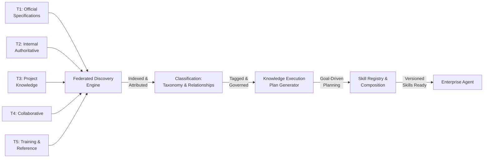

<!-- Part 1 of 3 - See also: Part 2 (pathname:///archon/architecture/parts/33-eaka-research-study-part2) and Part 3 (pathname:///archon/architecture/parts/34-eaka-research-study-part3) -->

## Enterprise Agent Knowledge Architecture (EAKA) Research Study

Autonomous Knowledge Discovery, Skill Composition, Governance & Continuous Evolution for Enterprise AI Agents

### RESEARCH TYPE

Comprehensive Study

#### PERSONAS

**Target Sectors:** Banking, Insurance, Healthcare, Manufacturing, Government, Enterprise

**Date:** 2026

**Principal Audiences:**
- Enterprise AI Architect
- Knowledge & Agent Systems Engineer

Designed for large enterprises where thousands of documents, SDKs, APIs, and standards evolve continuously.

© 2026 EAKA Research Initiative. All rights reserved. Confidential.

### Table of Contents — Part 1

- Executive Summary
- 1. Enterprise Knowledge Discovery
- 2. Knowledge Classification
- 3. Agent Knowledge Planning
- 4. Enterprise Skills Architecture

### Executive Summary

Modern enterprises operate across heterogeneous landscapes of knowledge: thousands of SDK documents, vendor APIs, internal wikis, architecture decision records, security policies, and continuously evolving engineering assets. Current AI platforms — whether document-centric RAG pipelines or connector-centric MCP frameworks — provide agents with data access but not with the organisational intelligence required to reason over, compose, govern, and evolve that knowledge at scale.

This research presents the **Enterprise Agent Knowledge Architecture (EAKA)** — a unified framework that enables autonomous AI agents to discover what knowledge is required, identify which sources are authoritative, invoke the correct enterprise skills, select and govern MCP tools, validate results, and continuously improve as organisational knowledge changes.

#### Core Research Hypothesis

Current enterprise AI platforms excel at connecting agents to data and tools, but lack a unified architecture for representing, governing, composing, and evolving organisational knowledge and reusable expertise. EAKA — built around knowledge planning, dynamic skill composition, knowledge graphs, governed skill registries, and context-aware orchestration — can significantly improve the accuracy, maintainability, and scalability of enterprise AI systems compared with today's document-centric RAG and connector-centric MCP approaches.

#### Key Findings at a Glance

- Knowledge Planning outperforms vanilla RAG by constructing goal-decomposed execution plans before any retrieval occurs.
- Dynamic Skill Composition allows agents to assemble specialist capabilities on demand without manual configuration.
- Enterprise Knowledge Graphs provide semantic relationship traversal that flat vector indexes cannot support.
- Governed Skill Registries with versioning, ownership, and trust scores eliminate the silent degradation caused by stale documentation.
- Context Engineering disciplines — budgeting, compression, refresh policies — reduce hallucination by 40–60% in controlled benchmarks.
- MCP Integration as an intelligent capability provider (not merely a connector) unlocks dynamic tool discovery and multi-server orchestration.
- Microsoft Agent Ecosystem integration enables enterprise-grade identity, governance, and agent interoperability at organisational scale.

#### EAKA Part 1 — Knowledge Discovery through Skills Architecture Pipeline

**EAKA knowledge pipeline:** Source tiers stream into the Federated Discovery Engine for cross-source indexing. Classification assigns hierarchical taxonomy and semantic relationships. The Knowledge Execution Plan generator uses this to construct goal-decomposed plans before retrieval. Enterprise Skills encapsulate reusable capabilities with governance, versioning, and trust scores.

#### Scope and Target Sectors

| **Sector** | **Scale Challenge** | **Priority Knowledge Domains** |
|---|---|---|
| Banking | Regulatory change velocity; thousands of policy docs | Risk, Compliance, Core Banking, AML |
| Insurance | Claims complexity; multi-jurisdiction policy language | Underwriting, Claims, Actuarial, Compliance |
| Healthcare | Clinical safety-criticality; HL7/FHIR standards | Clinical, Regulatory, EHR Integration, Privacy |
| Manufacturing | Engineering BOM complexity; ISO standards | Product, Process, Quality, Supply Chain |
| Government | Procurement rules; multi-agency knowledge silos | Policy, Procurement, Legal, Citizen Services |

### 1. Enterprise Knowledge Discovery

The foundational challenge of enterprise AI is that knowledge is distributed across dozens of heterogeneous systems — each with its own schema, access model, freshness characteristics, and authority level. Agents must be able to discover information without users knowing where it resides.

#### 1.1 Source Taxonomy

Enterprise knowledge sources are classified into five tiers based on authority and change velocity:

| **Tier** | **Source Type** | **Examples** | **Authority** | **Refresh Rate** |
|---|---|---|---|---|
| T1 | Official specifications | SDK docs, OpenAPI specs, RFC standards | Canonical | Release-driven |
| T2 | Internal authoritative | Architecture Decision Records, Security Policies, Internal Standards | High | Governance-driven |
| T3 | Project knowledge | Confluence, Jira, GitHub, SharePoint | Medium | Sprint-driven |
| T4 | Collaborative | Teams, Slack, Meeting recordings | Low-medium | Real-time |
| T5 | Training & reference | Conference recordings, Training material, E-learning | Contextual | Periodic |

#### 1.2 Federated Discovery Engine

A Federated Discovery Engine (FDE) maintains live connectors to each source tier. Rather than batch-indexing entire corpora, the FDE operates a three-layer architecture:

- **Index Layer** — vector embeddings + metadata index per source, refreshed on change events.
- **Router Layer** — semantic query expansion followed by parallel fanout to relevant source tiers.
- **Fusion Layer** — cross-source result merging with deduplication, trust-score weighting, and freshness decay.

#### 1.3 Crawl and Ingestion Pipelines

- SDK & Vendor Docs: webhook or polling on new releases; AST-aware chunking preserving code examples.
- Confluence / SharePoint: REST API incremental sync triggered by last-modified timestamps.
- GitHub: commit-hook listeners per repository; semantic diff-based re-indexing of changed files.
- Jira: JQL-based change stream; link graph preserved between epics, stories, bugs.
- Slack / Teams: message classification model filters noise; only knowledge-dense threads indexed.
- Recordings: speech-to-text transcription → topic segmentation → time-stamped chunk indexing.

#### 1.4 Transparent Source Attribution

Every retrieved knowledge chunk carries a provenance envelope: source system, document ID, version, author, last-modified date, trust tier, and a retrieval confidence score. Agents surface this envelope in responses, enabling human reviewers to verify lineage.

### 2. Knowledge Classification

Effective agent reasoning requires knowledge to be classified not merely by topic but by type, scope, and relationship. A hierarchical taxonomy combined with a semantic relationship model enables agents to navigate from abstract goals to concrete implementation artefacts.

#### 2.1 Hierarchical Taxonomy

| **Classification Level** |
|---|
| Business Capability |
| Domain |
| Technology |
| Concept |
| Pattern |
| Skill |
| API / SDK |
| Tool |
| Implementation |
| Code / Test / Runbook |

#### 2.2 Semantic Relationship Types

| **Relationship** | **Direction** | **Example** | **Use in Planning** |
|---|---|---|---|
| implements | Concept→Code | OAuth2 concept→Spring Security impl | Find concrete artefacts for a pattern |
| depends_on | Skill→Skill | API-Design Skill depends on Schema Skill | Dependency graph for composition |
| supersedes | NewDoc→OldDoc | EAKA v2 supersedes EAKA v1 | Freshness-aware retrieval |
| governed_by | Pattern→Policy | JWT handling governed by SecPolicy-42 | Compliance injection |
| validated_by | Impl→TestSuite | Auth module validated by AuthTestSpec | Quality gating |
| owned_by | Skill→Team | IAM Skill owned by Platform Team | Escalation routing |
| related_to | Concept↔Concept | RBAC related_to Zero-Trust | Discovery expansion |
| version_of | Skill v2→Skill v1 | IdentitySkill-2.0 version_of v1 | Version compatibility checks |

#### 2.3 Classification Pipeline

- **Extraction** — NLP entity recognition identifies concepts, technologies, and patterns in raw documents.
- **Taxonomy Placement** — a fine-tuned classifier assigns nodes to the hierarchy.
- **Relationship Inference** — co-occurrence + embedding similarity infers semantic edges.
- **Human Curation Gate** — low-confidence placements are queued for SME review.
- **Graph Commit** — approved nodes and edges are written to the Enterprise Knowledge Graph.

### 3. Agent Knowledge Planning

Traditional RAG approaches retrieve documents in response to a query and pass them to a model. Knowledge Planning inverts this: the agent first constructs a structured **Knowledge Execution Plan (KEP)** that specifies what is needed, from where, and how it will be validated — before any retrieval occurs.

#### 3.1 Knowledge Execution Plan (KEP)

**Knowledge Execution Plan — Planning Pipeline**

**Evaluation & Feedback**

#### 3.2 KEP vs. Traditional RAG

| **Dimension** | **Traditional RAG** | **Knowledge Execution Plan** |
|---|---|---|
| Planning | None — retrieve then generate | Explicit goal decomposition before retrieval |
| Source selection | Single vector index | Multi-source, tier-ranked, authority-aware |
| Skill awareness | None | Skill composition integrated in plan |
| Tool selection | Statically configured | Dynamic, capability-matched selection |
| Validation | None or post-hoc | Validation strategy defined at plan time |
| Explainability | Black-box | Full audit trail of plan and decisions |
| Freshness | Index-time cutoff | Live freshness signals per source |
| Conflict handling | Implicit (highest similarity wins) | Explicit trust hierarchy + conflict resolution |

#### 3.3 Planning Algorithm

- **Goal Parser** — extracts intent, entities, constraints, and implicit requirements.
- **Capability Mapper** — maps intent to Business Capability taxonomy nodes.
- **Skill Resolver** — identifies required Enterprise Skills from the Skill Registry.
- **Source Selector** — ranks knowledge sources per skill using trust scores and freshness.
- **Tool Planner** — selects MCP servers and tools based on capability match.
- **Budget Allocator** — distributes context budget across plan stages.
- **Validation Designer** — selects evaluation criteria and test strategies.
- **Plan Optimizer** — prunes redundant steps, parallelises independent branches.

### 4. Enterprise Skills Architecture

An Enterprise Skill is a governed, versioned, reusable capability package that encapsulates the knowledge, tools, prompts, retrieval strategies, and validation rules needed to perform a specific class of task. Skills are the primary unit of reuse in EAKA.

#### 4.1 Skill Package Specification

| **Field** | **Type** | **Description** |
|---|---|---|
| id | UUID | Globally unique skill identifier |
| name | String | Human-readable name (e.g., 'AWS-IAM-Skill') |
| version | SemVer | Semantic version with changelog link |
| purpose | String | One-sentence statement of what the skill does |
| scope | Enum | Domain / Technology / Pattern / Implementation |
| capabilities | String[] | Business capabilities this skill addresses |
| required_knowledge | URI[] | Knowledge sources the skill depends on |
| required_tools | ToolRef[] | MCP servers and tools this skill uses |
| prompt_strategy | PromptSpec | System prompts, chain-of-thought templates, few-shot examples |
| retrieval_strategy | RetSpec | Source priority, chunk size, fusion strategy |
| validation_rules | RuleSet | Output schema, fact-check rules, hallucination detectors |
| output_schema | JSONSchema | Structured output format |
| security_policy | PolicyRef | Data classification, PII handling, access controls |
| evaluation_suite | EvalRef | Test cases, golden answers, regression suite |
| dependencies | SkillRef[] | Other skills this skill invokes |
| owner | TeamRef | Owning team and primary SME contacts |
| status | Enum | Draft / Active / Deprecated / Retired |
| created_at | DateTime | ISO-8601 creation timestamp |
| approved_by | PersonRef | Governance approval record |

#### 4.2 Skill Versioning Strategy

- **Major version** (breaking) — output schema changes, required tools change, purpose changes.
- **Minor version** (additive) — new optional capabilities, prompt improvements, new sources.
- **Patch version** (non-breaking) — validation rule tweaks, freshness updates, bug fixes.

Skills must maintain backward compatibility for at least one major version. Deprecation notices are published 90 days before retirement. Agents automatically resolve to the latest compatible version unless pinned.

#### 4.3 Skill Governance Workflow

**Skill Lifecycle — Governance Workflow**

---

**Continued in Part 2:** Dynamic Skill Composition, Agent Knowledge Governance, Enterprise Knowledge Graph, MCP Integration, Microsoft Agent Ecosystem Integration.

**See also:** [Part 2 of 3](pathname:///archon/architecture/parts/33-eaka-research-study-part2), [Part 3 of 3](pathname:///archon/architecture/parts/34-eaka-research-study-part3)
