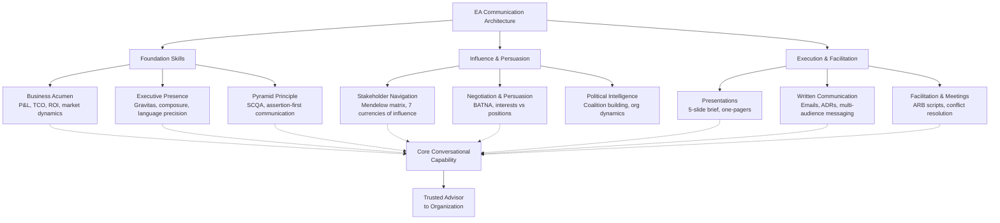

# Business Communication & Executive Skills

The definitive practical guide to the skills that determine whether your architecture recommendations get funded, followed, or ignored. Based on research across McKinsey, BCG, Gartner, Harvard Business Review, and the world's most effective EA practitioners — this guide provides every framework with real scripts, worked examples, templates, and the exact words to use in the exact situations you will face.



---

## 01 — Business Acumen: Speak the Language of the C-Suite

Gartner (2026) found that 73% of EA programmes require a stacked combination of skills — and financial and business acumen ranked second only to data and AI architecture skills. The EA who cannot answer 'what does this mean for revenue or risk?' will not be used by decision-makers. This section gives you the exact vocabulary, frameworks, and calculations to hold your own in any financial conversation.

### Financial Literacy — The Non-Negotiable Baseline

Every EA must be able to read and interpret three financial statements: the Income Statement (P&amp;L), the Balance Sheet, and the Cash Flow Statement. You do not need to be an accountant — you need to understand how architecture decisions appear in each statement and how to use that language with the CFO.

| Financial Statement | What It Shows &amp; What the EA Must Understand |
|---|---|
| **Income Statement (P&amp;L)** | Revenue, costs, gross profit, EBITDA, net profit over a period. Technology investment appears as OpEx (operating cost) or creates revenue enablement. |
| **Balance Sheet** | Assets, liabilities, and shareholders' equity at a point in time. Depreciation of technology assets. Technical debt appears as a liability. |
| **Cash Flow Statement** | Cash in and out — operating, investing, financing activities. Technology programmes are cash outflows. The CFO cares about when money leaves and when it returns. |

### The Five Numbers Every EA Must Know Cold

**1. Total Cost of Ownership (TCO)**

Formula: Acquisition Cost + Implementation + Operating Cost (annual) + Support + Decommission. Always model over 3–5 years. A SaaS solution at £100K/yr over 5 years (£500K + migration + run) vs. a build at £800K upfront + £80K/yr maintenance (£1.2M over 5 years). The 'cheaper' option is never the one with the lower licence fee.

**2. Return on Investment (ROI)**

Formula: [(Financial Gain - Cost of Investment) ÷ Cost of Investment] × 100. Target: &gt;15% for technology investments. Present as: '£2.1M annual saving on a £3.1M investment = 68% ROI at Month 18.' The CFO understands this immediately. Never present technology investment as cost — always as return.

**3. Payback Period**

Formula: Cost of Investment ÷ Annual Net Benefit. The most accessible metric for non-financial executives. '£3.1M investment ÷ £2.1M annual benefit = 18-month payback.' Anything under 24 months is typically easy to approve. Always state the payback period in the first slide of any business case.

**4. Net Present Value (NPV)**

Formula: Sum of [Cash Flow / (1 + Discount Rate)^Year] − Initial Investment. Accounts for the time value of money — £1M in Year 3 is worth less than £1M today. Use a discount rate of 8–12% (your organisation's WACC or a standard hurdle rate). Positive NPV = the investment creates value. The CFO will always want to see this.

**5. Cost of Inaction**

Formula: Annual Productivity Loss + Risk-Adjusted Incident Cost + Opportunity Cost. The most underused metric in EA. 'Staying on the current platform costs £187K/yr in data science time, growing at 25% annually as the team scales.' The cost of inaction reframes 'should we invest?' to 'can we afford not to?'

### Business Acumen in Conversation — What It Sounds Like

**EA with business acumen:** 'Our demand forecasting pilot cost £1.1M and delivered £2.1M in annual savings — that's a 91% ROI at month 14. To scale it across all categories, we need £800K additional investment. The adjusted payback is 8 months on the incremental spend. Staying on the current platform costs £187K per year in data scientist time. That grows to £280K as we add two more scientists next year. Migration pays for itself in 22 months.'

**EA without business acumen:** 'The platform is getting complex and we should probably look at alternatives. There are some inefficiencies in the current setup that are slowing us down. The technical debt is significant and we need to address it.'

### Understanding Market Dynamics — The Strategic EA Lens

The EA must understand the business environment the architecture is designed to serve. Porter's Five Forces (competitive rivalry, supplier power, buyer power, threat of substitutes, threat of new entrants) gives the EA a lens to understand why certain technology investments are strategically urgent. When NovaMart's AI-driven demand forecasting creates a 31% overstock advantage, that is a competitive rivalry event that makes the technology investment case for you — if you know how to frame it.

**The CFO Question:** Every business case must answer: 'What happens to revenue, cost, or risk if we don't do this?' Frame your architecture proposals in one of those three dimensions — everything else is noise at CFO level.

---

## 02 — The Pyramid Principle: McKinsey's Communication Framework

Created by Barbara Minto — the first female post-MBA hire at McKinsey — in the 1970s, the Pyramid Principle has spread from McKinsey to every major consulting firm and Fortune 500 boardroom in the world. The core idea is radical in its simplicity: start with the answer. Most people present chronologically — they build up to the conclusion. Executives don't have time for that. State your recommendation in the first ten seconds, then spend the rest of the time proving it.

### The Pyramid Principle Structure

| Level | Component | Definition |
|---|---|---|
| **1** | **Assertion** | State your single most important takeaway first. The recommendation, conclusion, or answer. One sentence maximum. This is the top of your pyramid. |
| **2** | **Arguments** | The 3 key reasons why your assertion is true. Grouped logically. Use deductive (premise→conclusion) or inductive (examples→pattern) reasoning. Never more than 5 arguments. |
| **3** | **Evidence** | The data, facts, analysis, and case studies that support each argument. This is the base. It can be extensive — but never show it unless asked. |

### The SCQA Framework — Setting Up the Pyramid

Before you state the assertion, you must create the context that makes it meaningful. McKinsey uses SCQA: Situation → Complication → Question → Answer.

| SCQA Element | What It Does &amp; Example (EA Context) |
|---|---|
| **Situation** | The shared context — something the audience already knows and agrees with. 'RetailCo operates 47 stores with a unified commerce platform launched 18 months ago.' |
| **Complication** | The change, problem, or tension that disrupts the situation. 'Our ML platform — built 18 months ago as an MVP — is now limiting demand forecasting accuracy.' |
| **Question** | The question the complication naturally provokes (often implicit). 'Should we upgrade our AI platform or accept the ongoing cost?' |
| **Answer** | Your recommendation — the top of the pyramid. 'We recommend an enterprise AI platform selection via a 7-week RFI process.' |

### Pyramid Principle in Practice — Worked Example

**BEFORE — Bottom-up presentation (how most EAs communicate):**

We assessed the current SageMaker platform which we implemented 18 months ago. The data science team has identified productivity issues. We ran a time analysis and found that 1,248 hours per year are lost to platform workarounds. We then looked at the market and identified five vendors. We ran an RFI process. After evaluating all five vendors against six criteria, we found that three vendors are competitive. We recommend...

[Executive has mentally checked out at line 3. They don't know what you're asking for.]

**AFTER — Pyramid Principle (Assertion → Arguments → Evidence):**

**ASSERTION:** We recommend running a 7-week RFI to select an enterprise AI platform. This will unlock 1,248 hours of annual data science productivity and enable our GenAI programme. Expected Year-1 ROI: 340%.

**ARGUMENT 1:** Our current SageMaker platform costs us £187K/year in productivity loss and cannot support the GenAI architecture we have committed to the board.

**ARGUMENT 2:** Three vendors — Databricks, AWS, DataRobot — are competitive at our scale with Year-1 adjusted TCO between £395K and £440K.

**ARGUMENT 3:** A structured RFI protects us from vendor lock-in and ensures we select the platform that fits our AI governance requirements.

**EVIDENCE:** Available on request — productivity analysis, vendor scorecards, TCO models.

### The Rule of 3

Arguments come in threes. The human brain naturally groups in three. If you have 7 reasons, your audience will forget 5. Find your 3 strongest arguments and lead with those. Evidence can be extensive — but arguments must be 3.

### One-Page Executive Brief Template

```
SUBJECT: [Topic] — Recommendation and Next Steps

RECOMMENDATION: [Single sentence. Your assertion. What you want them to do.]

CONTEXT (Situation + Complication):
[2-3 sentences. What the audience already knows + what has changed.]

THE CASE (3 arguments):
1. [Argument 1 — strongest first]
2. [Argument 2]
3. [Argument 3]

FINANCIAL IMPACT: [ROI / TCO / Cost of inaction — one line each]

DECISION REQUESTED: [Exactly what you need. By when. From whom.]

SUPPORTING DETAIL: Available on request / Appendix A
```

---

## 03 — Executive Presence & Gravitas: How to Command a Room

Executive presence is not charisma. It is the confidence, composure, and credibility that makes senior stakeholders believe you are the expert in the room — and that your recommendations deserve to be followed. Research from Harvard Business School identifies three pillars: how you look (appearance and body language), how you act (composure and decisiveness), and how you communicate (clarity and brevity).

### The Four Pillars of EA Executive Presence

**Preparation Gravitas:** The EA who knows the numbers cold — TCO, ROI, DORA metrics, the vendor comparison scores — commands the room through preparation, not personality. Before any executive meeting, know: the three questions you will be asked, the three objections you will face, and the one number that settles every argument.

**Composure Under Challenge:** When challenged in an Architecture Review Board, your response determines your credibility more than any slide. The formula: PAUSE (2 seconds), ACKNOWLEDGE ('That's an important point'), RESPOND (your substantive answer), CONFIRM ('Does that address your concern?'). Never become defensive. Never say 'I don't know' without immediately saying 'and here's how I'll find out.'

**Language Precision:** Executives notice vague language and lose confidence immediately. Replace: 'It's quite complex' → 'It involves three interdependent systems.' Replace: 'It might take a while' → 'It will take 6 weeks with this team.' Replace: 'We should probably look at this' → 'I recommend we commission an assessment.' Precise language signals precise thinking. Vague language signals uncertainty.

**Strategic Brevity:** The average executive attention span in a meeting is 4 minutes before their mind moves to email. The EA who takes 15 minutes to arrive at a recommendation will lose the room at minute 5. McKinsey's rule: if you cannot state your recommendation in one sentence and your supporting case in three sentences, you do not yet understand your own recommendation.

### Vague → Precise Language Rewrites

| Vague Language | Precise Language |
|---|---|
| *"We need to modernise our architecture."* | "Our current architecture is costing us 6 weeks of integration time per new capability. I recommend a 12-month modernisation programme that reduces this to 2 weeks, at a cost of £1.4M and a payback of 18 months." |
| *"The technical debt is a problem."* | "We have identified £2.3M of annual cost attributable to technical debt — through incident rate, productivity loss, and integration complexity. Unresolved, this grows by 30% annually as the estate expands." |
| *"We should probably look at a cloud migration."* | "I recommend we commission a cloud readiness assessment in Q3, targeting a phased migration of 12 Tier-2 applications by end Q2 next year. Projected: 22% reduction in infrastructure cost." |
| *"There are some concerns about the vendor's roadmap."* | "The vendor confirmed that LLM bias auditing — a mandatory requirement in our AI governance framework — is not available until Q1 2027. This creates a 9-month gap in our customer service AI launch plan. I recommend we disqualify this vendor from the shortlist." |

---

## 04 — Stakeholder Navigation: Influence Without Authority

The EA rarely has line management power over the people whose decisions they need to shape. Authority is positional — it comes from a title. Influence is relational — it comes from trust, credibility, and understanding what the other person values. The EA who relies on authority alone will be bypassed. The EA who builds influence will shape decisions before they reach the ARB.

### The Mendelow Stakeholder Matrix — Your Mapping Tool

Map every stakeholder on two axes: Power (ability to impact the programme) and Interest (how much they care about the outcome). This gives you four quadrants, each requiring a different engagement strategy.

| Power/Interest | Low Interest | High Interest |
|---|---|---|
| **High Power** | **Keep Satisfied** — Keep informed at the right level. Don't bore them with detail. One-pager updates. Early heads-up on major decisions. | **Manage Closely (Key Players)** — These are your most important stakeholders. Co-design where possible. Provide regular updates and early problem-flagging. |
| **Low Power** | **Monitor** — Monitor but don't over-invest. These stakeholders can become influential if they connect with a High Power ally. Never ignore them. | **Keep Informed** — Keep engaged and informed. They will influence High Power stakeholders. Show consideration for their concerns. |

### The 7 Currencies of Influence (Cohen &amp; Bradford Model)

Influence without authority works through exchange — you understand what the other person values and find ways to deliver it. Cohen &amp; Bradford identified seven currencies that stakeholders trade in:

| Currency | Definition &amp; Example |
|---|---|
| **Inspiration** | Vision, purpose, moral/ethical correctness. 'This architecture protects our customers.' |
| **Task** | Resources, budget, information, assistance. 'I'll give your team access to the compliance data you need.' |
| **Position** | Recognition, visibility, reputation, prestige. 'Your team's work on this will be presented to the board.' |
| **Relationship** | Personal connection, friendship, inclusion. 'I'd value your perspective — can we talk before the ARB?' |
| **Personal** | Gratitude, ownership, challenge, growth. 'This is genuinely complex work — I think your team is best placed.' |
| **Outside Currency** | Referrals, connections, introductions. 'I can connect you with the Head of Data at Pemberton — they solved this same problem.' |
| **Safe Environment** | Reduced risk, psychological safety, political cover. 'I'll take this to the ARB — you won't be the one fielding the CFO's questions.' |

### Managing the Most Difficult Stakeholders

**The Technical Expert Who Goes Over Your Head:** Pattern: They disagree with your architectural decision, bypass the ARB, and go directly to the CTO with their preferred solution. Response: Pre-empt by engaging them early — before the ARB. Acknowledge their expertise explicitly. Ask them to co-author the options analysis. When people contribute to a decision, they are far less likely to undermine it. If it still happens: 'I'm glad [name] raised this. We explored that approach in detail — would it help if I walked the CTO through the options analysis?'

**The CFO Who Won't Approve the Business Case:** Pattern: Your business case is technically sound but the CFO asks for more data every cycle. Response: Ask directly: 'What would need to be true for you to approve this?' Write down the answer. Deliver exactly that. If the goalposts move, name it: 'Last session, you asked for the productivity data. We've provided that. Can we agree on what the decision criteria are today?'

**The Business Sceptic Who Thinks AI/Tech Can't Solve Business Problems:** Pattern: 'We've tried technology before. It never works.' Usually backed by genuine past experience. Response: Never dismiss the history. 'You're right — a lot of technology implementations have failed here. That's exactly why this one is different: [specific difference]. Can I show you what the pilot delivered in concrete terms?'

---

## 05 — Negotiation & Persuasion: Getting to Yes

Enterprise Architects negotiate constantly — for budget, for exceptions to be resolved, for vendor terms, for delivery team compliance, for governance decisions. Negotiation in the EA context is rarely adversarial — it is the art of finding the solution that gives both parties enough of what they need to move forward. Fisher & Ury's 'Getting to Yes' framework is the foundation.

### Fisher & Ury's Four Principles

| Principle | Definition &amp; Example |
|---|---|
| **1. Separate People from Problems** | The technical architect who wants to use an unapproved technology is not your adversary — they have a legitimate need for a better tool. Attack the architecture problem together, not each other. |
| **2. Focus on Interests, Not Positions** | Their position: 'We must use MongoDB.' Their interest: 'We need a document store that scales to 10,000 writes per second.' One position, multiple solutions. Find the interest. |
| **3. Invent Options for Mutual Gain** | Before the negotiation, prepare at least three options that could work for both sides. The person with the most options has the most power in a negotiation. |
| **4. Insist on Objective Criteria** | Remove the debate from opinion. 'The approved technology radar says...' or 'The ARB decision record states...' or 'The vendor's own SLA data shows...' Objective criteria end arguments. |

### BATNA — Your Most Important Negotiation Concept

BATNA: Best Alternative to a Negotiated Agreement. Before any significant negotiation, define your BATNA and try to understand theirs. The party with the better BATNA has more negotiating power — not the louder voice, not the higher title. In vendor negotiations, your BATNA is your shortlisted alternative. In governance negotiations, your BATNA is escalation to the ARB or CDO. Never enter a negotiation without knowing your BATNA.

### Negotiation Script — EA Holds the Line on Architecture Standard

**Delivery Lead:** 'We need to use a point-to-point JDBC connection for this integration. The API approach adds two weeks to our sprint.'

**EA (Marcus):** 'I understand the timeline pressure — that's real. Let me separate two things. The timeline concern is legitimate. The JDBC approach is not an option I can approve, for a reason I can demonstrate concretely. Our 2018 middleware layer — which we're spending £8 million replacing right now — was built on exactly this decision, repeated 34 times. The JDBC connection would be integration number 35. I'm not willing to build the next version of that problem. Here's what I can do: Sophie tells me the API approach is a week of rework, not two. I'll free up Wei for that week to make it two parallel streams. Does that solve the timeline problem?'

**Delivery Lead:** 'If Wei's available, yes.'

**EA:** 'Then we have a solution. I'll confirm Wei's availability by end of today.'

[Outcome: Standard maintained. Delivery lead gets the timeline. Both parties win.]

### The Anchoring Principle in EA Negotiations

Anchoring: the first number stated in a negotiation disproportionately influences the final outcome. In TCO negotiations with vendors, always ask for their number first — or anchor high if you must go first. In budget negotiations, anchor at the full cost including risk contingency — then let the CFO negotiate you down to what you actually needed. In timeline negotiations, anchor at the realistic timeline — never compress it under pressure and then fail to deliver.

**The Pre-Mortem:** Before any major negotiation, run a 5-minute pre-mortem: 'It's 6 months from now and this negotiation failed catastrophically. What happened?' The answer reveals your risks, your BATNA gaps, and the concessions you cannot make.

---

## 06 — The Art of Presentation: Board Decks & One-Pagers

70% of employers worldwide rate communication as the most sought-after skill. Yet most EA presentations are built backwards — they start with the analysis and end with the recommendation. This section is about building presentations that land: that get decisions made, budgets approved, and architecture standards adopted.

### The 5-Slide Executive Architecture Brief

**Slide 1: The Recommendation** — One sentence on a single slide. Large font. The Pyramid Principle assertion. 'We recommend migrating to an enterprise AI platform by Q4 2026, at a cost of £2.1M, delivering £7.2M in three-year value.' Everything else in the deck proves this slide.

**Slide 2: The Situation** — SCQA Situation + Complication. 2-3 bullet points. 'We operate 3 production AI models on a foundation platform (Situation). That platform cannot support our GenAI programme and costs £187K/yr in productivity loss, growing 25% annually (Complication).' Maximum 30 words total. No technical jargon.

**Slide 3: The Options** — Never just one recommendation — always show you considered alternatives. A simple 3-column table: Option A (current state), Option B (your recommendation), Option C (alternative). Score each on: Cost, Speed, Risk, Strategic Fit. Make Option B the obvious winner — but show the work.

**Slide 4: The Numbers** — One financial summary. TCO, ROI, payback period, cost of inaction. Use a simple horizontal timeline showing when money goes out and when benefit arrives. Executives think in cash flow, not in spreadsheet cells. One chart. No tables on this slide.

**Slide 5: The Decision** — Exactly what you need, by when, from whom. 'Requested: Board approval to proceed with RFI-2026-AI-001. By: 15 June. Decision maker: Diana Cole (CDO). Supporting decision: Karen Mills (CFO) budget approval.' This slide ends the presentation. Never end with 'Questions?' — end with the decision you need.

### The Architecture One-Pager — Most Powerful EA Artefact

The one-pager is the EA's Swiss Army knife. A single page that a board member can read in 3 minutes and walk away understanding the recommendation, the rationale, and the decision required. Every major architecture recommendation should have one. McKinsey consultants produce these for every partner review — it is not a shortcut, it is a discipline.

**Structure:** Headline (recommendation in one sentence) → Situation (3 lines) + Problem (with numbers) + Cost of Inaction (with numbers) → The Recommendation (3 bullet points + what we will not do) + The Numbers (TCO/ROI/Payback) → Decision Required (exact request + deadline + name) → Risks &amp; Mitigations (2–3 rows) → Supporting Detail (Available in Appendix).

### Presentation Principles — Do's and Don'ts

**Do:** Open with the recommendation. Use the Rule of 3 — three key points maximum. End with a specific decision request and deadline. Use one compelling number per slide. Pre-align with key stakeholders before formal presentation.

**Don't:** Open with an agenda or 'Today I'll walk you through...'. Present 7 findings — executives will remember zero. End with 'Any questions?' — this transfers control and loses momentum. Cover slides in data tables — no executive processes tables in real time. Surprise a senior stakeholder in a public meeting — they will be defensive. Bury assumptions in footnotes — they will surface as objections later.

---

## 07 — Written Communication: Emails, Briefs & Reports That Get Read

Executives process email in 5 seconds. In that window they read: the subject line, the first sentence, and — if both pass — the first paragraph. The rest is supporting detail that may never be read. Write every executive email as if only the first 50 words will be read.

### The 5-Second Email Test

**Executive Email — Pyramid Principle:**

SUBJECT: Approval Required — AI Platform RFI Budget (£150K) — Decision by 14 June

Hi Diana,

We need your approval to proceed with the AI platform RFI at a cost of £150K. This enables the 7-week vendor assessment and secures the GenAI programme timeline. The cost of delay is approximately £3,600 per week in data science productivity.

Decision requested by: Friday 14 June.

Supporting detail: Attached (2 pages).

**Standard EA Email (what not to do):**

SUBJECT: AI Platform Assessment Update

Diana,

Following our discussions about the current SageMaker limitations, we have been exploring options for an enterprise AI platform. After reviewing the market, we believe an RFI process would be valuable. There would be some costs involved... [Three more paragraphs before the ask appears]

### Architecture Decision Records (ADRs) — The Format That Lasts

The ADR is the most important written artefact in the EA toolkit. It creates institutional memory — preventing the same architectural debates from happening repeatedly and giving new team members context for why the estate looks the way it does. A good ADR is read years later and still makes sense.

**ADR Template:**

```
ADR-[YEAR]-[NUMBER] | [Short Title] | Status: [Proposed / Accepted / Deprecated / Superseded]
Date: [Date] | Deciders: [Names and roles] | Review Date: [12 months from today]

CONTEXT
[2-4 sentences. The situation that made this decision necessary.]
[What problem are we solving? What constraints exist? What forces are at play?]

OPTIONS CONSIDERED
Option A: [Name] — [One sentence description]
Pros: [2-3 bullet points] | Cons: [2-3 bullet points]

Option B: [Name] — [One sentence description]
Pros: [2-3 bullet points] | Cons: [2-3 bullet points]

Option C: [Name] — [One sentence description — often: do nothing]
Pros: [2-3 bullet points] | Cons: [2-3 bullet points]

DECISION
[What we decided. One sentence. Not a paragraph — a sentence.]
[The specific option chosen and the primary reason.]

RATIONALE
[Why this option over the others. 3-5 sentences. Focus on the trade-offs accepted.]
[What did we choose NOT to do, and why?]

CONSEQUENCES
Positive: [What this decision enables]
Negative: [What this decision constrains or costs]
Risks: [What could go wrong and how we will monitor it]

COMPLIANCE CONDITIONS (if applicable)
[Any conditions that must be met for this decision to remain valid]
```

### Writing for Different Audiences — The Same Message, Four Ways

**Board / CEO (30 seconds):** NovaMart's AI advantage is costing us margin. Our demand forecasting system, operational since October, reversed 26% of that gap. Investment of £3.1M has returned £14.3M. Next phase: customer personalisation — projected £8M additional revenue. Budget requested: £1.6M for FY27.

**CFO (2 minutes):** The demand forecasting programme achieved ROI of 361% at month 14. £3.1M invested across AI platform, data science talent, and Customer Data Platform. Annual benefits: £2.1M overstock reduction + £12.2M churn reduction. FY27 request: £1.6M for personalisation. Payback: 11 months. Full financial model attached.

**CTO / CDO (5 minutes):** Three production AI systems live: demand forecasting (MAPE 13.6%), churn prediction (reducing churn by 3.8pp), GenAI customer service prototype. ML platform: 47 models registered, 312 reusable features. Architecture: SageMaker + API-first serving layer + outcome monitoring. Next: personalisation requires CDP completion (Q3) and vector database capability (Q4).

**Delivery Team (full detail):** Platform architecture: SageMaker ML + MLflow experiment tracking + AWS Feature Store + model serving via API Gateway. Guardrails: API-first integration, event-driven patterns, zero trust security posture. All models require outcome monitoring before production. GenAI workstream: RAG architecture with Bedrock, hallucination guardrail at 85% confidence threshold, human-in-the-loop Phase 1.

---

## 08 — Facilitation & Meetings: Getting to Decisions

The EA runs more workshops, review boards, and decision sessions than any other function. A bad facilitator produces a 2-hour meeting with no decision and a follow-up email asking for another meeting. A great facilitator produces a 90-minute session with a signed-off decision and named owners. The difference is almost entirely preparation and structure.

### The EA Meeting Taxonomy — Know Which Room You're Running

| Meeting Type | Purpose / EA Facilitation Goal / Duration |
|---|---|
| **Architecture Review Board (ARB)** | Governance decision on a proposal. Get to a recorded decision: Approve / Conditions / Defer / Reject. 90 minutes. |
| **Architecture Design Workshop** | Co-create a solution with delivery teams. Produce a decision on the key architectural trade-offs. Half-day (3 hours). |
| **Stakeholder Alignment** | Build shared understanding before formal governance. Identify and resolve objections before they reach the ARB. 45 minutes. |
| **Executive Architecture Brief** | Inform or gain approval from leadership. Leave the room with a decision or a named next step. 30 minutes max. |
| **Vendor Briefing (RFI)** | Understand vendor capability. Extract specific answers to specific questions — not a sales pitch. 60 minutes. |
| **Technology Radar Review** | Update the approved technology list. Ratify moves between Adopt / Trial / Hold / Retire. 2 hours annually. |

### The ARB Facilitation Script

**ARB Opening — Sets the Frame:**

'Good morning. We have 90 minutes. This ARB has one decision to make today: whether to approve the Unified Commerce Platform initiative under the conditions proposed in ADR-2025-001. The proposal materials were circulated 5 days ago. I'm assuming you've read them. If not — and that's fine — I'll summarise in 3 minutes. Questions on the summary before we go to the full discussion?'

[3-minute SCQA summary of the proposal]

'Diana, you're the sponsor. 60 seconds — what's the single most important thing you want the ARB to understand about this proposal?'

[Diana speaks]

'Alan, security is your domain. What are your top two questions?'

[Alan speaks]

'Karen, the financial model. What do you need to see?'

[Karen speaks]

'Alright. Let's take those in order.'

**ARB Closing — Getting to a Recorded Decision:**

'We've covered the three main areas of concern. Let me test where we are. Alan — are you comfortable with the security architecture as described, subject to the Vault configuration review condition? Karen — is the financial model sufficient for your approval? Understood — that becomes Condition 2. So we're at: Approve with Conditions. Condition 1: Vault configuration reviewed by CISO before production. Condition 2: Fully-loaded headcount business case before Design gate. Are both conditions named, with owners and resolution dates? Then the ARB decision is: Conditional Approval. I'll issue the ADR by end of day. Thank you all.'

### Handling Conflict in Facilitated Sessions

Conflict in an ARB or design workshop is healthy — it means people care about the outcome. The facilitator's job is not to eliminate conflict but to convert it from personal disagreement into structured problem-solving.

**De-escalation Script — When Two Stakeholders Are in Conflict:**

[Alan and James are in direct disagreement about the security architecture.]

**Marcus:** 'Alan, James — let me park this specific point for a moment. Alan, can I ask you to state your concern as a requirement rather than as an objection? What does the security architecture need to achieve?'

[Alan: 'Every service-to-service communication must be mutually authenticated.']

'James, can you state whether the proposed architecture satisfies that requirement? Yes, no, or with conditions?'

[James: 'mTLS satisfies it for existing services. The new event bus needs 2 weeks of additional work.']

'Then the resolution is: the event bus mTLS implementation is a delivery condition, with a 2-week estimate. Alan, does that satisfy your requirement?'

[Alan: 'Yes.']

'Good. I'll log that as an architecture condition. Moving on.' [What Marcus did: moved from positions ('I disagree with your design') to requirements ('what does security need to achieve?') — the Getting to Yes principle.]

---

## 09 — Political Intelligence: The Dimension Nobody Talks About

Political intelligence is the ability to understand how decisions actually get made in an organisation — which is almost never how the org chart suggests they should. Every EA operates in a political environment. The question is not whether to engage with organisational politics but whether to do so consciously or naively.

### Building Your Coalition — The Architecture Champions Network

No EA succeeds alone. The most effective EA practices build a distributed network of architecture champions — people in each business unit who understand the value of architectural thinking, advocate for standards, and bring problems to the EA before they become governance crises. BCG's research confirms: 70% of AI (and technology) transformation value comes from people and adoption. Your coalition is your most valuable asset.

Find the person in each business unit who feels the pain of the current architecture most acutely. That person is your natural champion. They want the change you're advocating — they just don't have the language or the access to make it happen. Give them both.

---

## 10 — Scripts & Templates: The Exact Words for the Exact Situations

This section provides ready-to-use scripts for the situations every EA faces. These are not scripts to memorise verbatim — they are starting points that you adapt to your voice, your organisation, and your relationship. The structure matters more than the exact words.

### Presenting a Recommendation to an Executive When You Have 5 Minutes

**SITUATION:** You've been stopped in the corridor or given an unplanned 5 minutes with the CDO.

'I want to run something by you. [Topic].'

**ASSERTION:** 'My recommendation is [X]. It will [deliver Y] and [costs Z].'

**ARGUMENT 1:** 'The first reason is [business reason — cost, revenue, or risk].'

**ARGUMENT 2:** 'The second reason is [strategic alignment].'

**ARGUMENT 3:** 'The third reason is [risk if we don't].'

**CLOSE:** 'I'd like [specific decision/action] by [date]. Can I send you a one-pager?'

Then stop. Do not over-explain. If they're interested, they'll ask questions. If they approve, say thank you and leave. The decision has been made.

### Holding a Line Under Pressure in an ARB

**SITUATION:** A senior stakeholder is pressuring you to approve something that violates an architecture standard.

'I understand the pressure you're under and I want to help you solve this. The reason I can't approve [X] isn't bureaucracy — it's that [specific risk]: [Insert concrete consequence from a past example or risk model]. Here's what I can approve: [alternative that meets the standard]. Here's what that takes: [specific ask — time, resource, or process].'

If they push: 'I want to be helpful. I also need to flag this formally as a risk if we proceed without addressing it. That protects you as much as it protects the architecture.' [Never say 'I won't.' Say 'Here's the risk.' Let them make the informed decision.]

### Raising a Risk You Were Overruled On

**SITUATION:** The ARB or CDO has approved something over your objection. The risk needs to be on record.

Email to the decision-maker (CC: the ARB chair):

**SUBJECT:** Risk Log — [Decision Reference] — [Topic]

'[Name], following the ARB decision on [date] to proceed with [X], I want to formally log the architectural risk as discussed:

- RISK: [One sentence description]
- LIKELIHOOD: [High / Medium / Low] — [Brief rationale]
- IMPACT: [Financial / Operational / Regulatory consequence if it materialises]
- MITIGATION: [What would reduce the risk — for future consideration]

I want to ensure this is visible and that we have a mechanism to review it at the next quarterly compliance cycle.'

[This is not adversarial. It is professional. It protects you and the organisation.]

### Giving Difficult Feedback to a Delivery Team

**SITUATION:** The 30% architecture review has identified a significant deviation from the approved SAD. The team lead needs to hear it clearly.

'I want to be direct with you because I respect your work and I want this project to succeed. What I'm seeing in the current implementation is [specific deviation]. This is a problem because [concrete consequence — not 'standards compliance' but the actual thing that goes wrong if it stays this way]. Here's what needs to change: [specific action]. Here's what I'll do to help: [specific support from EA side]. Here's the timeline I need it done by: [specific date — not 'soon'].'

[Never soften the feedback so much that the seriousness is lost. Never be so direct that the relationship is damaged. The formula: fact + consequence + solution + support + timeline.]

### Asking for Budget You Have Not Been Allocated

**SITUATION:** You need funding for an unplanned initiative (e.g., a security remediation after a discovery that couldn't have been anticipated).

'[Name], I need to bring a funding request to you that wasn't in the original plan. I'll give you the bottom line first: we need £[X] to [specific outcome]. The reason it wasn't planned: [honest explanation — e.g., we discovered this during the decommission process]. The cost of not funding it: [specific consequence — operational, regulatory, financial]. The cost of funding it is [£X]. The payback is [Y months]. I'm not asking you to decide today. I'm asking for a 20-minute conversation this week so I can show you the business case.'

[Note: 'I'm not asking you to decide today' reduces the threat response. You are asking for a conversation, not a decision. Much easier to say yes to.]

### The 10 Sentences Every EA Should Have Ready

1. 'My recommendation is [X]. Here are the three reasons.'
2. 'What would need to be true for you to approve this?'
3. 'The cost of inaction is [£X] per year, growing at [Y]%.'
4. 'I understand your concern. Let me separate the business problem from the solution.'
5. 'I can't approve that approach, and here's why it matters: [concrete consequence].'
6. 'What is the interest behind your position on this?'
7. 'I want to flag this as a formal risk so it's on record — that protects all of us.'
8. 'I don't know the answer to that. I'll find out by [specific date].'
9. 'You were right about that. Here's what I should have seen earlier.'
10. 'What does success look like from your perspective in 12 months?'

---

**The EA who speaks in numbers, listens with curiosity, decides with evidence, and communicates with brevity — that EA is not just an architect. They are a trusted advisor.**
