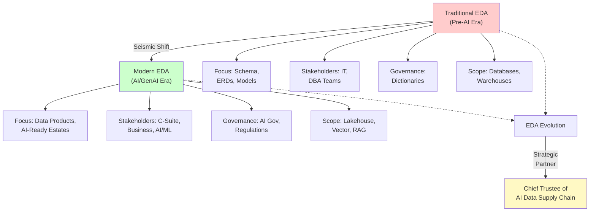

# ENTERPRISE DATA ARCHITECT IN THE AGE OF AI & GenAI

**Roles · Responsibilities · RFP Strategy · Artifacts · Leadership**

Strategic Playbook · 2025–2026 Edition

---

## EDA Role Evolution

**Diagram 1: EDA Role Evolution** — From back-office technical custodian to strategic business partner at the intersection of technology, governance, and AI value delivery.

---

## SECTION 1: ROLE DEFINITION & EVOLVING MANDATE

The Enterprise Data Architect (EDA) has historically been the custodian of data structures, integration patterns, and governance frameworks. In 2025–2026, this role has undergone a seismic shift. The explosive adoption of Generative AI, large language models (LLMs), and AI-augmented analytics has elevated the EDA to a **strategic business partner** sitting at the intersection of technology, governance, and business value delivery.

> **The Enterprise Data Architect of the GenAI era is not just a blueprint designer — they are the chief trustee of the data supply chain that fuels every AI-driven business outcome.**

### The Old vs. New EDA Mandate

| **Dimension** | **Traditional EDA (Pre-AI)** | **Modern EDA (AI / GenAI Era)** |
|---|---|---|
| **Primary Focus** | Schema, ERDs, data models | Data products, AI-ready data estates |
| **Stakeholders** | IT, DBA teams | C-Suite, business units, AI/ML teams |
| **Governance** | Data dictionaries, lineage | AI governance, responsible AI, regulations |
| **Architecture Scope** | Databases, warehouses, ETL | Lakehouse, vector DBs, LLMOps, RAG pipelines |
| **Value Metric** | System uptime, data quality % | AI ROI, time-to-insight, model trust scores |
| **Tooling Mindset** | Static, waterfall | Composable, modular, API-first, real-time |
| **Security Posture** | Role-based access | Zero-trust + AI inference security + PII masking |

### Title Variants You May Encounter

Chief Data Architect, AI Data Strategist, Data & AI Platform Architect, GenAI Infrastructure Lead, Data Mesh Architect

Regardless of title, the mandate is consistent: **design, govern, and evolve the data architecture that enables trustworthy, scalable, and ethical AI** across the enterprise.

---

## SECTION 2: CORE RESPONSIBILITIES IN THE AI/GenAI ERA

### AI-Ready Data Architecture Design

Design and govern multi-modal data platforms — cloud-native lakehouses, vector stores, feature stores, and real-time streaming — that serve both traditional BI and GenAI workloads. Define canonical data models that LLMs and ML models consume.

- Define reference architectures for RAG (Retrieval-Augmented Generation) pipelines
- Select and govern vector databases (Pinecone, pgvector, Weaviate, ChromaDB)
- Design semantic layers and knowledge graphs for LLM grounding
- Ensure sub-second data freshness for agentic AI workflows

### AI Governance & Data Trust

Own the policies, processes, and tooling that ensure data used to train, fine-tune, and run AI models is accurate, unbiased, compliant, and explainable.

- Establish Data Contracts between producers and AI consumers
- Implement model lineage tracking — from raw data to inference output
- Define PII and sensitive data handling for LLM prompt pipelines
- Align with EU AI Act, NIST AI RMF, and sector-specific regulations

### Data Mesh & Data Product Strategy

Architect the organizational data model — decentralized domain ownership, federated governance, and self-serve infrastructure — that accelerates AI delivery at scale.

- Define data product standards: discoverability, addressability, trustworthiness
- Govern domain data contracts and SLAs
- Enable data marketplace for internal AI teams
- Drive platform thinking over project thinking

### Cross-Functional AI Enablement

Act as the bridge between data engineering, ML/AI teams, business analysts, security, legal, and the C-Suite — translating architectural decisions into business language.

- Co-own AI roadmap with CDO, CTO, and Chief AI Officer
- Define data readiness assessments for each GenAI use case
- Mentor data engineers on LLMOps and MLOps best practices
- Lead architecture review boards for AI initiatives

### Architecture Performance & FinOps

Ensure the data architecture delivers measurable ROI, with clear cost management frameworks across cloud services, model inference, and data movement.

- Define TCO models for data platform choices
- Govern data compute costs (Spark, Snowflake credits, token consumption)
- Establish architecture fitness functions and data quality SLAs
- Report on data platform ROI to executive stakeholders

---

## SECTION 3: THE TRANSFORMATION IMPERATIVE

The GenAI wave is not an incremental upgrade — it is an architectural paradigm shift.

| **Dimension** | **From** | **To** | **Priority** |
|---|---|---|---|
| **Thinking Model** | Project-centric | Product & platform thinking | Critical |
| **Data Layer** | Data warehouse/lake | Lakehouse + vector + feature store | Critical |
| **Governance** | Manual, policy-driven | Automated, AI-assisted | High |
| **Integration** | Batch ETL | Event streaming + API mesh | High |
| **Security** | Perimeter & RBAC | Zero-trust + AI inference controls | Critical |
| **Skills** | SQL, ERD, modeling | LLM orchestration, RAG, embeddings | High |
| **Metrics** | Data quality scores | AI readiness index, model trust score | Medium |
| **Team Model** | Centralised CoE | Federated data mesh + AI guilds | High |

### The AI-Ready Data Estate — Target State

- **Unified Semantic Layer** — Single source of business definitions accessible by humans and AI agents
- **Real-Time Data Fabric** — Streaming-first architecture enabling event-driven AI decisions
- **Vector + Structured Hybrid** — Combined databases for semantic search and precision queries
- **Automated Data Quality** — ML-powered checks flagging training data issues before corruption
- **Federated Identity & Access** — Fine-grained access control across AI pipelines
- **Model-Aware Metadata** — Catalogues tracking data assets, model cards, and embeddings

---

## SECTION 4: RFP STRATEGY — END-TO-END PLAYBOOK

### PHASE 1: RFP Discovery & Intelligence

The discovery phase is the foundation upon which winning solutions are built. This is where the EDA develops a deep understanding of the client's current state, aspirations, and gaps.

- Conduct comprehensive data estate maturity assessment using DCAM or CMMI-DMM framework to quantify the baseline
- Map client's AI aspiration vs. data readiness gap — identify the strategic intent but also the architectural and organizational gaps
- Interview business stakeholders to surface 'burning platform' pain points — understand what is driving urgency
- Analyse existing architecture diagrams, data catalogues, and governance policies to understand legacy constraints
- Identify regulatory obligations (GDPR, HIPAA, sector AI regulations) that will shape the data governance design
- Benchmark client's current state against industry peers to provide context and realistic expectations

### PHASE 2: Architecture Vision & Solutioning

This phase translates the discovery insights into a compelling, strategic, and executable vision.

- Define 3-horizon data + AI architecture roadmap (0-6 months quick wins, 6-18 months foundation, 18-36 months transformation) that balances immediate value with long-term architectural correctness
- Design target-state data platform architecture with GenAI overlays — lakehouse + vector stores + real-time streaming foundations
- Propose reference architectures: Data Lakehouse for unified analytics, Data Mesh for at-scale governance, RAG pipeline designs for LLM grounding
- Define technology stack recommendations with vendor-neutral rationale — show alternatives and trade-offs transparently
- Create data governance and AI governance operating model — who owns what, how decisions flow, escalation paths
- Develop business value narrative — quantify 'so what' for each layer. Articulate cost of inaction, ROI of the architecture, time-to-value

### PHASE 3: Proposal Construction

- Lead the data architecture section as a key differentiator
- Include 'AI Readiness Scorecard' personalised to the client
- Provide Data & AI Architecture Decision Matrix with trade-off analysis
- Show proof points: case studies, reusable accelerators, reference architectures
- Embed Data Governance Operating Model visualisation
- Quantify risk mitigation — what failing to govern data costs

### PHASE 4: Orals / Client Presentation

- Present data architecture story in business outcomes language
- Use 'Day in the Life' narrative to make future state concrete
- Demonstrate GenAI prototype or POC using client's own data themes
- Lead the Q&A on data security, governance, and AI ethics
- Commit to a Data Architecture Charter as a living contract

### PHASE 5: Project Execution & Architecture Ownership

- Establish Architecture Governance Board in Week 1
- Deliver Architecture Decision Records (ADRs) for every major choice
- Run bi-weekly Architecture Health Checks against approved reference architecture
- Own data quality KPIs and report to programme leadership monthly
- Evolve architecture iteratively — use fitness functions to validate alignment
- Serve as Escalation Authority for all data and AI platform decisions

---

## SECTION 5: INPUT & OUTPUT ARTIFACTS

### Input Artifacts — What the EDA Consumes

| **Artifact** | **Source** | **Purpose** |
|---|---|---|
| Business Strategy Deck | Executive/Strategy team | Align architecture to 3–5yr business goals |
| Current-State Architecture Diagrams | IT / Enterprise Arch team | Baseline assessment and gap analysis |
| Data Inventory & Data Catalogue | Data Engineering / MDM team | Understand existing data assets & quality |
| AI Use Case Register | Business Units / CDO office | Prioritise data platform investments |
| Regulatory & Compliance Requirements | Legal / Risk / Compliance | Design governance guardrails |
| Technology Constraints & Standards | CTO / IT Architecture | Avoid duplication, align to standards |
| RFP / SOW / Statement of Need | Procurement / Client | Define scope of architecture work |
| Financial & FinOps Reports | Finance / Cloud FinOps | Optimise architecture spend |
| Security & Zero-Trust Policies | CISO / Security Arch | Embed security into data design |

### Output Artifacts — What the EDA Produces

| **Artifact** | **Audience** | **Cadence** |
|---|---|---|
| Enterprise Data Architecture Blueprint | CTO, CDO, Programme Board | Once per programme, updated annually |
| AI & GenAI Reference Architecture | AI/ML teams, Data Eng | Per major GenAI initiative |
| Data Governance Operating Model | CDO, Data Stewards, Legal | Programme initiation + quarterly review |
| Architecture Decision Records (ADRs) | All technical stakeholders | Per significant architectural decision |
| Data Product Catalogue & Standards | Data Mesh domain teams | Living document, monthly updates |
| Data & AI Maturity Assessment | Executive sponsors, CDO | Pre-engagement + annual re-assessment |
| Data Quality & Observability Dashboard | Data Owners, COO, Programme Mgr | Weekly / real-time |
| AI Readiness Scorecard | CxO, Client executives | Per RFP / per programme quarter |
| LLM Data Pipeline Design | AI Engineering, ML Ops | Per GenAI use case |
| RAG Architecture & Vector Store Design | AI Platform team | Per knowledge-base AI solution |
| Data Contract Templates | Data Producers, Consumers | Living standard, per domain |
| Technology Radar (Data & AI) | CTO, Architects | Quarterly |
| FinOps Architecture Report | CFO, Engineering Leads | Monthly |
| Architecture Health Assessment | Programme leadership | Bi-weekly during delivery |

---

## SECTION 6: COMMITMENTS TO LEADERSHIP & THE C-SUITE

### To the CEO

- Translate data architecture into competitive advantage narratives
- Ensure AI initiatives are built on a trustworthy, auditable data foundation
- Quantify the business risk of poor data architecture in financial terms
- Provide 3-year data & AI architecture roadmap aligned to business strategy

### To the CDO / Chief Data Officer

- Design and maintain the enterprise data model and semantic layer
- Lead the data governance operating model and data product strategy
- Own the data quality SLAs that underpin all AI outputs
- Report monthly on data estate health, coverage, and AI readiness

### To the CTO / Chief Technology Officer

- Align data architecture to enterprise technology strategy and standards
- Provide vendor-neutral architecture recommendations with TCO analysis
- Lead evaluation and selection of data platform technologies
- Ensure interoperability and avoid architectural lock-in

### To the CISO / Chief Information Security Officer

- Embed zero-trust security principles into every data pipeline design
- Define PII, sensitive data, and AI inference data classification policies
- Ensure LLM prompt injection and data exfiltration risks are architecturally mitigated
- Provide Data Security Architecture review for every AI use case

### To the CFO / Finance Leadership

- Deliver FinOps-aware architecture recommendations that optimise cloud data costs
- Provide TCO analysis for all major platform decisions
- Quantify the cost of data debt and the ROI of data quality investment
- Report on architecture-driven cost avoidance quarterly

### To Programme / Delivery Leadership

- Deliver Architecture Decision Records within 5 business days
- Attend and chair the Architecture Review Board bi-weekly
- Provide architecture sign-off on all epics and features before sprint planning
- Escalate architectural risks to programme leadership within 24 hours

---

## SECTION 7: WHAT BIG-WIN COMPANIES ARE DOING

### JPMorgan Chase — Financial Services

Deployed a firm-wide LLM Platform (IndexGPT) built on a governed data lakehouse. The EDA owns the 'AI Data Mesh' — domain-specific data products curated for LLM consumption with automated lineage, quality gates, and regulatory controls.

### Google / Alphabet — Technology

Vertexification of data — every asset is catalogued via Vertex AI Data Store. Google's EDA practice standardised on 'Data Products as APIs', enabling teams to build GenAI solutions without reinventing the data layer.

### Walmart — Retail

Built a GenAI platform on a unified data lakehouse (Azure + Databricks) feeding 70+ AI use cases. Centralised EDA team with federated execution — a hybrid mesh model.

### Pfizer — Life Sciences

Redesigned data estate to support AI-accelerated drug discovery. Implemented Knowledge Graph + Vector DB architecture enabling LLMs to traverse complex biomedical relationships.

### Microsoft — Technology

Copilot for Microsoft 365 underlies Microsoft's own EDA practice — a massive RAG architecture indexing enterprise data. Published 'Data-Centric AI' principle: architecture must prioritise data quality over model sophistication.

> **Common Pattern:** Companies achieving highest GenAI ROI invested first in data architecture foundations — unified semantic layers, automated governance, real-time data quality — BEFORE scaling AI use cases.

---

## SECTION 8: WHAT TOP CONSULTANCIES RECOMMEND

### McKinsey & Company

- Establish 'Data Foundation Sprint' before GenAI use cases go to production (8–12 weeks)
- Adopt 'Data Value Chain' model: treat data as product with P&L accountability
- Quantify 'Data Debt Tax' — poor data quality costs 15–25% of revenue
- Prioritise 'Lighthouse' GenAI use cases generating architecture reuse

### Deloitte

- Implement 'Trustworthy AI' framework — data governance is first pillar
- Build Data & AI Control Tower: single pane of glass for quality, performance, cost
- Adopt 'GenAI-Ready Data Maturity Model' (5 levels) to benchmark investment
- Create Data Architecture CoE with embedded AI Engineers and Governance Officers

### Accenture

- Champion 'Total Enterprise Reinvention' — rebuild for AI, not retrofit
- Implement 'Data Fabric' as connective tissue — 40–60% integration time reduction
- Establish AI Governance Council co-owned by EDA, CDO, Legal, Risk
- Use 'Data Mesh + AI Mesh' dual operating model

### IBM / IBM Consulting

- Watsonx data platform: open, governed, trusted data is non-negotiable
- Implement AI Factsheets — model and data provenance in architecture
- Adopt 'Responsible AI by Design' — EDA owns technical controls, CDO owns policy
- Build Universal Data Model spanning on-premise, multi-cloud, edge

### PwC

- Conduct 'GenAI Risk Radar' — data architecture risks top 3 GenAI failure modes
- Implement 'Fit for AI' data assessments at programme inception
- Recommend 'Data Product Factory' model: standardised blueprints for rapid creation
- EDA should own 'AI Readiness Index' — board-reportable quarterly metric

### Gartner Analyst Guidance

- By 2026, 80% of GenAI projects failing will cite inadequate data architecture
- 'Composable Data and Analytics' architecture pattern is strategic recommendation
- Data Fabric and Data Mesh are complementary — implement hybrid model
- EDA role will expand to include 'AI Architect' in 70% of large enterprises by 2027

---

## SECTION 9: MINDSET & GUIDING PRINCIPLES

### Think Business-First, Architecture-Second

Every decision starts with the business outcome. Ask 'What decision will this data architecture help the business make?'

### Be a Trusted Advisor, Not a Gatekeeper

Accelerate AI adoption by making it safe and scalable. Shift from 'you cannot do that' to 'here is how to do it safely'.

### Embrace Impermanence — Design for Change

Today's right architecture may be obsolete in 18 months. Design modular, composable systems that evolve without rewrites.

### Data Quality Is the New Non-Negotiable

Garbage in, garbage out is more dangerous with LLMs because failures are invisible. Automated data quality is the foundation.

### Govern Without Slowing Down

Modern governance is embedded, automated, and invisible. Policy-as-code, data contracts, automated lineage enable speed AND trust.

### Quantify Everything for the C-Suite

Every recommendation must include business case: ROI, risk cost, time-to-value, cost of inaction.

### Build for the Ecosystem, Not the Project

Design data products multiple AI use cases can reuse. Reusable, well-governed data assets are the greatest force multiplier.

### Stay Curious — The Landscape Shifts Monthly

LLM architectures, vector databases, and AI governance standards evolve at unprecedented speed. Weekly upskilling on LLMOps, RAG, embeddings.

---

## SECTION 10: QUICK-REFERENCE SUMMARY

### The EDA's 5 Non-Negotiables for the GenAI Era

1. **AI-Ready Data Estate** — Lakehouse + vector + real-time fabric
2. **Automated Governance** — Policy-as-code + data contracts + lineage
3. **Quantified Business Value** — ROI + risk reduction + time-to-value
4. **Data Trust Foundation** — Quality gates + compliance + responsible AI
5. **Continuous Learning** — Weekly upskilling on LLMOps, RAG, embeddings

---

**The Enterprise Data Architect who masters these five domains will be the most essential enabler of the AI revolution. Data is the fuel; the EDA is the engineer ensuring it is clean, available, and safely delivered to every engine in the enterprise.**

*Review and update quarterly as AI capabilities, governance standards, and enterprise architecture patterns evolve.*

## Related

- [Modern Data & AI Platform Blueprint 2026](87-modern-data-ai-platform-blueprint-2026.md) — the platform blueprint this role guide operates within.
- [Data & Knowledge Hub](../data-knowledge/index.md) — the broader data-architecture domain this role sits in.

