# Enterprise Manager in the Age of AI & GenAI

Roles · Leadership · RFP Strategy · Artifacts · Team Transformation

Strategic Leadership Playbook — 2025–2026 Edition

## 1. Role Definition & Evolving Mandate

The Enterprise Manager (EM) has always been the operational backbone of large organisations — accountable for delivering results through people, process, and technology. In 2025–2026, Generative AI, intelligent automation, and AI-augmented decision-making have fundamentally redefined what great management looks like. The EM is no longer just a people leader and delivery owner; they are now a **human-AI orchestrator**, responsible for blending human talent with AI capabilities to deliver outcomes at unprecedented speed and scale.

> The Enterprise Manager of the GenAI era leads not just teams of people — they lead ecosystems of humans and AI agents working in concert to deliver outcomes no individual or traditional team could achieve alone.

### 1.1 Old vs. New Enterprise Manager Mandate

| Dimension | Traditional EM (Pre-AI) | Modern EM (AI / GenAI Era) |
|-----------|------------------------|--------------------------|
| Team Composition | Humans only | Humans + AI agents + automation |
| Decision-Making | Intuition + experience + reports | AI-augmented insights + human judgement |
| Planning Horizon | Annual / quarterly cycles | Rolling, dynamic, AI-driven scenario planning |
| Performance Mgmt | Annual reviews, KPIs | Real-time AI dashboards, continuous feedback loops |
| Talent Strategy | Hire, train, retain people | Upskill for AI fluency; manage hybrid human-AI capacity |
| Client Engagement | Relationship-led, meeting-heavy | AI-assisted insights + data-driven conversations |
| Risk Management | Risk registers, manual monitoring | AI-powered risk sensing, predictive mitigation |
| Delivery Model | Waterfall / Agile sprints | Continuous delivery with AI co-pilots |
| Innovation | Annual innovation cycles | Continuous AI-assisted experimentation |

### 1.2 Common EM Titles in the AI Era

Enterprise Managers operate under many titles—Delivery Manager, Programme Manager, AI Transformation Lead, People & Performance Manager, Engineering Manager, P&L Owner—yet regardless of title, the AI-era EM's mandate converges on three imperatives: **deliver outcomes through hybrid human-AI teams, build AI fluency in their people, and drive continuous improvement using data and AI signals.**

## 2. Core Responsibilities in the AI/GenAI Era

### Outcome Delivery & AI-Augmented Execution

The EM is accountable for delivery outcomes—whether revenue, cost savings, customer satisfaction, or operational efficiency. In the AI era, this means orchestrating AI tools, automation, and human expertise to accelerate delivery.

- Define and own OKRs / KPIs at team and programme level
- Identify and embed AI co-pilots that accelerate team productivity (e.g., GitHub Copilot, AI-assisted testing)
- Run AI-augmented sprint planning and retrospectives using real-time data
- Manage delivery risk using predictive AI early-warning signals
- Own the end-to-end delivery rhythm: standups, reviews, retrospectives, and AI health checks

### Human-AI Team Leadership

The EM now manages a blended workforce—humans and AI agents. They must design team structures where AI handles repetitive, data-heavy, or pattern-matching tasks, freeing humans for creative, strategic, and relationship-intensive work.

- Define the Human vs. AI task allocation matrix for the team
- Manage AI agent performance alongside human performance
- Create psychological safety for teams experimenting with AI tools
- Design workflows where AI augments rather than replaces human judgement
- Monitor team wellbeing as AI changes the nature of daily work

### AI-Powered Performance Management

Move from annual reviews and lagging indicators to continuous, data-driven performance conversations powered by real-time AI dashboards and analytics.

- Implement real-time performance dashboards for individuals and teams
- Use AI-assisted 1:1s—sentiment analysis, meeting summaries, action tracking
- Set AI fluency development goals for every team member
- Define 'AI contribution' metrics alongside traditional output metrics
- Coach team members through AI-driven change—managing anxiety and resistance

### Continuous Improvement & Process Optimisation

The EM is the owner of operational efficiency. With AI, they can identify bottlenecks, automate manual tasks, and run continuous improvement at a pace previously impossible.

- Map team processes and identify automation candidates using process mining AI
- Implement AI-assisted quality assurance and review cycles
- Run structured Kaizen / continuous improvement sprints using AI insights
- Measure and report process efficiency gains from AI adoption quarterly
- Govern responsible AI use in delivery—prevent shadow AI and compliance risks

### Stakeholder & Client Management

The EM is the primary interface between the delivery team and business stakeholders. AI now enables more data-rich, proactive, and predictive client conversations.

- Deliver AI-powered status reporting: predictive timelines, risk heatmaps
- Use AI to prepare for executive briefings—synthesise data, anticipate questions
- Proactively surface delivery risks to leadership before they escalate
- Build trust by being transparent about where AI is and is not being used
- Manage client expectations around AI-assisted delivery timelines and quality

### Talent Development & AI Upskilling

The EM's most critical people responsibility in the GenAI era is ensuring their team does not get left behind. They must be the champion of AI learning within their team.

- Conduct quarterly AI skills gap assessments for the team
- Create personalised AI learning pathways for each team member
- Celebrate and incentivise AI experimentation and knowledge sharing
- Partner with L&D to build GenAI fluency programmes
- Build a team culture of continuous AI learning—dedicate time in every sprint

## 3. The Transformation Imperative

The GenAI era demands that Enterprise Managers transform their own leadership model, their team's operating model, and their personal skills. This is not optional—managers who fail to adapt will find their teams outperformed and their roles diminished.

| Dimension | From | To | Priority |
|-----------|------|----|---------| 
| Leadership Style | Command & control | Coach, orchestrate, empower + AI | Critical |
| Team Model | Human-only squads | Human + AI agent blended squads | Critical |
| Decision-Making | Gut + lagging data | AI-augmented real-time insights | Critical |
| Planning | Static quarterly plans | Dynamic AI-assisted scenario plans | High |
| Reporting | Manual status decks | Automated AI dashboards | High |
| Performance | Annual reviews | Continuous AI-assisted feedback | High |
| Meetings | Standing agendas, long | AI-summarised, outcome-focused | Medium |
| Hiring | Skills-based CV screening | AI-assisted + potential-based | High |
| Learning | Annual L&D budget | Embedded daily AI learning culture | Critical |
| Risk | Risk register, manual review | AI-powered predictive risk sensing | High |

### 3.1 The AI-Augmented Team—Target Operating Model

**AI Co-Pilot per Role:** Every team member has at least one AI tool that handles 20–30% of their routine work.

**Automated Status Reporting:** Daily/weekly status generated by AI from project tools—EM validates and adds context.

**AI Meeting Assistant:** Meeting transcription, action capture, and follow-up tracking fully automated.

**Predictive Delivery Dashboard:** Real-time sprint health, risk probability, and capacity forecasting.

**Continuous Feedback Loop:** AI-assisted weekly pulse checks replacing quarterly surveys.

**AI Learning Hours:** Dedicated 2 hours/week per team member for AI skills development, tracked by EM.

**Shadow AI Governance:** EM-enforced policy on approved vs. unapproved AI tools to manage risk.

## 4. People Leadership in the Age of AI

The human dimension of management becomes MORE critical, not less, in the AI era. As AI handles more transactional and analytical tasks, the EM's irreplaceable value lies in empathy, judgement, ethics, and the ability to inspire humans through change.

### Managing AI Anxiety in Your Team

AI-driven change creates anxiety. The EM must normalise uncertainty, celebrate experimentation, and create a culture where learning from AI failures is safe.

- Hold monthly 'AI reality check' team sessions—discuss fears openly
- Share your own AI learning journey—be vulnerable and curious
- Reframe AI as an amplifier, not a replacement, with concrete examples
- Create a team 'AI wins' board—celebrate productivity gains

### Redefining Roles & Career Paths

Many roles will evolve significantly. The EM must partner with HR to redefine job families, career ladders, and performance expectations in the AI era.

- Conduct a role-by-role AI impact assessment annually
- Co-create new career ladders that value AI fluency and hybrid working
- Identify team members at risk of role disruption early and invest in reskilling
- Celebrate 'AI-augmented promotions'—people who grew with AI tools

### Building a High-Trust AI Culture

Teams that trust their manager and each other are far more effective at adopting AI, because they are willing to experiment and share failures.

- Model AI transparency—tell the team when you use AI and how
- Build team agreements on responsible AI use
- Reward experimentation and knowledge-sharing over perfection
- Remove blame culture—psychological safety is the foundation of AI innovation

### Diversity, Equity & Inclusion in AI-Augmented Teams

AI tools can amplify existing biases. The EM must be proactive in ensuring AI-assisted processes (hiring, performance, promotion) are fair.

- Audit AI-assisted HR decisions for demographic bias quarterly
- Ensure AI learning opportunities are equally accessible to all team members
- Challenge AI tool vendors on bias testing and fairness certifications
- Include DEI lens in all AI use case approvals for the team

## 5. RFP Strategy—End-to-End Playbook

The Enterprise Manager plays a critical and often underestimated role in winning and delivering client engagements. In the AI era, clients want to see management maturity—how the EM will govern AI-augmented delivery, manage hybrid teams, and de-risk complex AI transformation programmes.

### Phase 1: Discovery & Qualification

- Lead stakeholder discovery interviews—map organisational pain points and AI aspirations
- Assess client's management maturity: change readiness, AI culture, leadership alignment
- Identify the 'burning platform'—what problem makes this RFP urgent right now?
- Map the power dynamics: who are the sponsors, blockers, and influencers?
- Qualify the RFP: is the client ready to be managed through AI-augmented delivery?
- Document assumptions about team size, AI tool access, and governance constraints

### Phase 2: Operating Model & Solution Design

- Design the delivery operating model: team structure, AI tools, governance cadence
- Define the Human-AI task allocation for the programme team
- Create the Risk Management Framework—highlight AI-specific delivery risks
- Propose a Delivery Assurance Model: how you will guarantee outcomes, not just outputs
- Design the stakeholder engagement and communication plan
- Build the change management and AI adoption plan for the client organisation

### Phase 3: Proposal Construction

- Write the Management Approach section—make it a differentiator, not a formality
- Include an 'AI Delivery Acceleration' narrative: how AI tools cut delivery time
- Showcase your team's AI fluency credentials and past AI-augmented delivery evidence
- Propose an Outcome-Based commercial model tied to AI-delivered productivity gains
- Include a Client AI Readiness Assessment—show you understand their context
- Quantify the management value: faster delivery, lower risk, higher quality

### Phase 4: Orals & Presentation

- Lead the team section of the orals—demonstrate team quality and culture fit
- Present the 'Day in the Life' of the AI-augmented delivery team
- Show a live AI dashboard prototype—give the client a taste of the future
- Answer 'How will you manage AI risks?' with a crisp, confident governance model
- Demonstrate empathy with their change challenge—show you've delivered this before

### Phase 5: Mobilisation & Delivery Governance

- Stand up the delivery governance structure in Week 1—steering, delivery board, team rituals
- Deploy AI tooling and establish team norms for AI use in the first sprint
- Set up the real-time delivery dashboard and share access with client stakeholders
- Run a 'Team AI Baseline' session—assess team AI fluency and set growth goals
- Establish the escalation protocol and RAID log with AI-assisted monitoring
- Deliver the first Value Milestone within 30 days—build momentum and trust early

### 5.1 EM's RFP Win Themes

| Win Theme | EM Contribution | Differentiator |
|-----------|-----------------|-----------------|
| Delivery Certainty | AI-augmented risk prediction, milestone governance | Predictive delivery dashboard |
| Speed to Value | AI-accelerated team productivity, faster sprints | 30-day first value commitment |
| People-First AI | Empathetic change management, AI upskilling plan | Human-AI team design blueprint |
| Transparent Governance | Real-time dashboards, proactive escalation model | Client-facing AI health score |
| Outcome-Based Delivery | KPI ownership, commercial model tied to results | Outcome guarantee framework |

## 6. Input & Output Artifacts

### 6.1 Input Artifacts—What the EM Consumes

| Artifact | Source | Purpose |
|----------|--------|---------|
| RFP / SOW / Statement of Need | Procurement / Client | Define scope, constraints, and success criteria |
| Business Strategy & OKRs | Executive / Client leadership | Align delivery to strategic goals |
| Programme Architecture Blueprint | Enterprise Architect / CTO | Understand technical context and constraints |
| AI Capability Inventory | Technology / AI team | Know available AI tools and automations |
| Team Skills Matrix | HR / Resource Management | Plan team composition and upskilling needs |
| Financial Budget & FinOps Report | Finance / PMO | Manage delivery within cost envelope |
| Risk & Compliance Register | Risk / Legal / Security | Identify governance guardrails |
| Stakeholder Map & Power Analysis | Account / Strategy team | Navigate organisational dynamics |
| Sprint Velocity & Quality Metrics | Engineering / Delivery team | Monitor team performance and capacity |
| AI Tool Performance Reports | AI Platform / Engineering | Assess AI co-pilot effectiveness |
| Change Readiness Assessment | Change Management / HR | Calibrate adoption pace and support needs |
| Client Satisfaction / NPS Data | Account Management | Course-correct and improve client outcomes |

### 6.2 Output Artifacts—What the EM Produces

| Artifact | Audience | Cadence |
|----------|----------|---------|
| Delivery Operating Model | Programme Board, Client | Programme initiation |
| Team Charter & AI Use Policy | Delivery team, Client | Sprint 0 / programme start |
| Real-Time Delivery Dashboard | Steering committee, PMO | Live / weekly update |
| Weekly Status Report (AI-generated) | Client, leadership | Weekly |
| Sprint Planning & Retrospective Report | Team, delivery leadership | Every sprint |
| Risk & RAID Log (AI-monitored) | Programme Board, Client | Continuously updated |
| AI Fluency Development Plan | Each team member, HR, L&D | Quarterly |
| Stakeholder Engagement Plan | Account management, Client | Programme initiation + monthly review |
| Change Management Plan | Client leadership, HR | Programme initiation |
| Value Realisation Report | Executive sponsors, CFO | Monthly / quarterly |
| Team Performance Scorecard | Leadership, HR | Monthly |
| AI Tool ROI Report | CTO, Finance, Client | Quarterly |
| Lessons Learned / Retrospective Pack | PMO, future programmes | End of programme / major milestone |
| Executive Briefing Pack | C-Suite, Steering Committee | Monthly |

## 7. Commitments to Leadership & Stakeholders

The EM's operating contract with leadership is defined by accountability, transparency, and proactive communication. In the AI era, these commitments are underpinned by data, real-time visibility, and AI-assisted governance.

### To the CEO / Executive Sponsor

- Deliver measurable business outcomes—not just project completion
- Provide monthly executive briefings: value delivered, risks, decisions needed
- Quantify the business impact of AI adoption in the programme
- Escalate strategic risks within 24 hours—no surprises policy

### To the Client / Account Leadership

- Proactive, data-driven status communication—never reactive firefighting
- Deliver the first Value Milestone within 30 days of programme start
- Maintain NPS above target through continuous feedback loops and rapid response
- Be transparent about AI use, limitations, and governance within the programme

### To the Programme / Portfolio Director

- Maintain real-time RAID log—no hidden risks or issues
- Deliver sprint velocity at or above plan—flag deviations within the sprint
- Provide accurate monthly financial forecasts with variance explanations
- Escalate resourcing conflicts and capacity risks proactively

### To the Team

- Create a psychologically safe environment for AI experimentation
- Invest in every team member's AI upskilling—dedicate time and budget
- Provide clear, frequent, and honest feedback—not just at review time
- Shield the team from organisational noise; keep focus on delivery outcomes

### To the CTO / Technology Leadership

- Enforce responsible AI tool use—no shadow AI without governance approval
- Provide monthly AI tool adoption and ROI data for the programme
- Flag architecture and technical debt risks that threaten delivery timelines
- Champion the technical team's voice in business and client conversations

### To the CFO / Finance

- Deliver programmes within budget—or escalate variance before it occurs
- Quantify AI productivity gains in financial terms monthly
- Provide FinOps-aware delivery planning—optimise AI tool and cloud spend
- Report on cost-of-delay for any programme risks materialising

## 8. What Big-Win Companies Are Doing

The world's most successful organisations in the AI era share a common management DNA. Here is what their Enterprise Managers are doing differently—and what you can adopt:

### Amazon (Technology / Retail)

Amazon managers operate on the 'Working Backwards' and 'Two-Pizza Team' principles, now supercharged by AI. Every team has an AI productivity goal embedded in their OKRs. Managers are evaluated on how effectively they have integrated AI tools into delivery workflows.

- AI productivity metrics embedded in manager scorecards
- Two-pizza teams with one dedicated 'AI experimentation' sprint per quarter
- Weekly AI learnings shared across management cohort via internal tool
- Real-time operational dashboards for every manager—no manual reporting

### Google / Alphabet (Technology)

Google's management model centres on psychological safety (Project Aristotle findings) combined with AI-augmented performance management. Managers use AI tools to identify early signals of team health issues, delivery risks, and talent flight risks.

- AI-powered team sentiment analysis in continuous feedback loops
- Manager effectiveness scores updated quarterly using AI analysis of team signals
- 20% innovation time extended to include AI experimentation projects
- OKR tracking fully automated—managers focus on strategy, not reporting

### Microsoft (Technology)

Microsoft's 'growth mindset' culture, championed by Satya Nadella, now explicitly includes AI fluency as a leadership expectation. All managers complete quarterly AI capability assessments and are expected to lead AI adoption within their teams.

- AI fluency included in all manager performance reviews
- Copilot for Managers: AI-assisted 1:1s, meeting summaries, and action tracking
- Real-time delivery insights via Microsoft Viva and Power BI AI dashboards
- Manager community of practice for sharing AI use cases across business units

### Deloitte (Internal Practice) (Consulting)

Deloitte's own management model, which they also sell to clients, has been redesigned around AI-augmented delivery. Their 'Future of Work' practice shows that managers who actively champion AI adoption achieve 35–45% higher team productivity scores.

- Human-AI task allocation built into project planning templates
- AI-generated weekly project health scores for all managers
- Mandatory AI upskilling programme for all manager grades
- Client-facing AI delivery transparency reports as a standard deliverable

### Unilever (Consumer Goods)

Unilever rebuilt their management model around 'Future Fit' leadership—combining emotional intelligence with AI fluency. They pioneered AI-assisted talent decisions and now use AI tools in performance calibration with human oversight.

- Future Fit Leadership Framework: EQ + AI fluency as equal pillars
- AI-assisted talent mobility recommendations reviewed by managers monthly
- Structured 'Manager as Coach' programme with AI conversation analysis
- Real-time sustainability and operational KPIs on manager dashboards

**The management pattern that wins:** Companies achieving the highest AI ROI from their management layer have invested in three things simultaneously—AI fluency development, real-time visibility tools, and psychological safety for experimentation. No single lever works without the other two.

## 9. What Top Consultancies Recommend

### McKinsey & Company

- The 'Superagency' concept: Enterprise Managers must become orchestrators of AI agents, not just people managers. McKinsey's 2024 research shows AI-empowered managers deliver 25–40% higher team productivity in the first year of adoption.
- Adopt 'Talent Sustainability' as a management metric: measure how effectively you are reskilling your team for the AI era, not just their current performance.
- Implement 'Value Sprints'—short, outcome-focused delivery cycles with AI-generated progress tracking that replace traditional waterfall governance.
- Managers must own the 'AI-to-Human handoff' design—knowing when AI decisions need human review is the most critical management judgement call in the GenAI era.

### Deloitte

- The 'Human Sustainability' framework: as AI takes on more tasks, managers must actively protect and develop uniquely human capabilities—creativity, empathy, and ethical reasoning.
- Implement 'Responsible AI by Management Design'—every EM should have an AI use policy for their team, reviewed quarterly with HR and compliance.
- Deloitte's Global Human Capital Trends report shows 82% of organisations expect managers to have AI fluency by 2026—make this a hiring and promotion criterion now.
- Build 'AI Inclusion' into management—ensure AI tools are equally accessible and beneficial across all demographics on the team.

### Accenture

- The 'Reinvented Manager' model: Accenture's research shows the EM role is splitting into two: administrative management (largely AI-automated) and leadership (irreducibly human).
- Adopt 'Total Workforce Intelligence'—AI-powered capacity planning, skills tracking, and talent mobility recommendations that replace annual HR review cycles.
- Champion 'Human + Machine' KPIs: performance metrics should capture both human contribution and AI-assisted contribution to team outcomes.
- EMs should lead 'AI Use Case Discovery Workshops' within their teams—bottom-up AI adoption accelerates faster than top-down mandates.

### Gartner Analyst Guidance

- By 2027, 50% of management reporting tasks will be fully automated by AI—EMs who still manually produce status reports will be seen as inefficient.
- The number-one management failure mode in AI adoption is 'AI anxiety amplification'—managers who are anxious about AI inadvertently slow their team's adoption.
- Gartner recommends 'Composable Management'—modular, adaptable management frameworks that can integrate new AI capabilities without full process re-engineering.
- EMs should establish a 'Personal AI Board of Directors'—3–5 AI tools they use daily to manage the team—and share this openly with their reports.

### IBM Institute for Business Value

- IBM's research shows organisations that train managers in AI ethics and responsible AI governance are 3x more likely to sustain AI adoption beyond the pilot phase.
- Implement 'AI Transparency Rituals'—weekly team sessions where the manager shares what AI told them and what human judgement overrode it.
- The 'Manager as AI Steward' role: EMs are responsible for the ethical, safe, and responsible use of AI by every member of their team.
- Build 'AI Literacy Ladders'—defined progression paths from AI awareness to AI fluency to AI leadership for every team member, managed by the EM.

## 10. Mindset & Guiding Principles

The transformation from a traditional to an AI-era Enterprise Manager is fundamentally a mindset shift. Skills and tools matter—but the manager who leads with curiosity, psychological safety, and outcome obsession will outperform the one with just the best toolkit.

### Lead with Curiosity, Not Fear

The EM who is curious about AI—actively experimenting, learning, and sharing—creates a contagious energy that drives team adoption. Fear and resistance are leadership choices.

### You Are a Coach First, a Manager Second

In the AI era, the transactional parts of management get automated. What remains—and what becomes more valuable—is your ability to develop, motivate, and inspire people.

### Outcome Obsession Over Activity Obsession

AI will make your team faster. But faster at the wrong thing is worse. The great EM keeps the team laser-focused on business outcomes, not just delivery velocity.

### Radical Transparency Builds AI-Era Trust

Be open about how you use AI in management. Share your prompts, your AI insights, and your overrides of AI recommendations. Transparency accelerates team trust and adoption.

### Design for Humans, Augmented by AI

AI should make your team's work more meaningful—not more mechanical. Always ask: 'Does this AI tool free up time for higher-value human work?'

### Manage Energy, Not Just Time

AI changes the pace of work dramatically. The great EM watches for burnout signals in an always-on AI environment and actively protects recovery and creative time.

### Embrace Ambiguity as a Superpower

The AI landscape shifts monthly. The manager who thrives is comfortable making decisions with incomplete information and adapting quickly when the picture changes.

### Quantify Your Management Value

In the AI era, every management decision should have a measurable outcome. Know your team's productivity gain from AI adoption. Know your NPS. Know your delivery variance. Data is your credibility with leadership.

> The Enterprise Manager who will define the next decade is not the one who knows the most AI tools—it is the one who builds the most trust: with their team, their clients, and their leadership. AI amplifies capability; trust amplifies impact.

## 11. Quick-Reference Summary

| Domain | Key Action | Success Metric |
|--------|-----------|-----------------|
| Role Identity | Position as human-AI orchestrator and outcome owner | Executive confidence + team engagement score |
| Team Model | Design human + AI agent blended squads | 20-30% productivity gain from AI co-pilots |
| Decision-Making | Implement AI-augmented dashboards and insight tools | Decision speed; data-driven escalations |
| RFP / Presales | Lead management approach; quantify AI delivery acceleration | Win rate uplift; EM named in SOW |
| Delivery | Real-time RAID, sprint governance, value milestones | On-time, on-budget, outcome achieved |
| People Dev | AI upskilling plans for every team member | Team AI fluency score quarterly |
| Stakeholder Comms | AI-generated status + monthly executive briefings | NPS > target; zero surprise escalations |
| Change Mgmt | Human-centred AI adoption; psychological safety culture | AI adoption rate > 80% in 6 months |
| FinOps | Manage AI tool and delivery costs; monthly variance report | Within budget; quantified AI ROI |
| Innovation | Monthly AI experimentation sessions; capture wins | 2+ AI-driven process improvements/quarter |
| Ethics & Governance | Team AI use policy; responsible AI by design | Zero shadow AI incidents |

### The EM's 5 Non-Negotiables for the GenAI Era

1. **Human-AI Team Design:** Deliberate, ethical co-location of humans and AI agents
2. **Outcome Obsession:** Relentless focus on business impact, not activity
3. **AI Fluency Culture:** Continuous learning embedded in team operations
4. **Radical Transparency:** Open, honest communication about AI use and limits
5. **Continuous Learning:** Adaptation as AI capabilities and organisational needs evolve

The Enterprise Manager who commits to these five principles will not just survive the AI era—they will be the reason their organisation thrives in it. Management is the human layer that makes AI trustworthy, purposeful, and transformational. That has never been more important than it is today.

This document is intended as a living leadership reference. Review and update quarterly as AI capabilities, management practices, and organisational expectations continue to evolve.

```mermaid
graph TD
    A["Enterprise Manager<br/>Human-AI Orchestrator"] --> B["Core Responsibilities"]
    B --> B1["Outcome Delivery"]
    B --> B2["Human-AI Team Leadership"]
    B --> B3["AI-Powered Performance Management"]
    B --> B4["Continuous Improvement"]
    B --> B5["Stakeholder Management"]
    B --> B6["Talent Development"]
    
    A --> C["Transformation Imperatives"]
    C --> C1["Leadership Style<br/>Command & Control → Coach & Empower"]
    C --> C2["Team Model<br/>Humans Only → Human + AI Blend"]
    C --> C3["Decision-Making<br/>Gut Feel → AI-Augmented Insights"]
    
    A --> D["RFP & Delivery Strategy"]
    D --> D1["Discovery & Qualification"]
    D --> D2["Operating Model Design"]
    D --> D3["Proposal Construction"]
    D --> D4["Mobilisation"]
    
    A --> E["Guiding Principles"]
    E --> E1["Curiosity Over Fear"]
    E --> E2["Coach Mindset"]
    E --> E3["Outcome Obsession"]
    E --> E4["Radical Transparency"]
    
    style A fill:#4A90E2
    style B fill:#7B68EE
    style C fill:#50C878
    style D fill:#FF6B6B
    style E fill:#FFB347
```

## Related

- [Enterprise Data Architect in the Age of AI & GenAI](84-enterprise-data-architect-ai-genai.md) — a companion role guide for a related enterprise function.
- [Strategy Hub](../strategy/index.md) — the broader AI-adoption and change-management context managers operate within.

