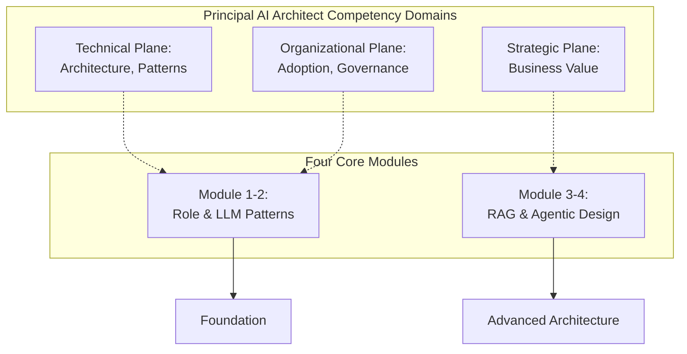

# Principal & Enterprise AI Architect (Part 1 of 2): Scenario & Strategy Mastery

### Overview

This is Part 1 of 2. See [Part 2: Governance, Strategy & Decision Frameworks](pathname:///archon/architecture/principal-enterprise-ai-guide-educative-part2) for governance, leadership, and decision frameworks.



6 Modules · 24 Lessons · 12 Real-World Scenarios · 6 Knowledge Checks · Decision Frameworks

| Module | Topic | Description |
|--------|-------|-------------|
| **01** | **Role, Mindset & Competency Map** | The Principal AI Architect's identity, career path, and skill ladder |
| **02** | **Enterprise LLM Architecture Patterns** | Foundational design patterns every principal must master |
| **03** | **RAG, Knowledge Systems & Context Engineering** | Building enterprise-grade knowledge retrieval |
| **04** | **Agentic AI System Design** | Architecting safe, reliable, and auditable agent systems |
| **05** | **AI Governance, Risk & Responsible AI** | From EU AI Act to ethical deployment at scale |
| **06** | **Strategy, Leadership & Executive Influence** | Translating AI capability into business transformation |

###### MODULE 01

## Role, Mindset & Competency Map

What separates a Principal AI Architect from a Senior Engineer — and how to become one.

###### Lesson 1.1

#### The Principal AI Architect — Role Definition & Identity

**Strategy Leadership Career**

The Principal AI Architect operates at the intersection of deep technical expertise, business strategy, and organizational leadership. Unlike a Senior Engineer who delivers solutions within a defined scope, the Principal defines the scope itself — setting the technical direction for AI systems that may span 5+ years and affect thousands of stakeholders.

###### The Three Planes of Principal Impact

- Technical Plane: Defining architecture standards, selecting platforms, resolving cross-cutting technical decisions that no single team can own.

- Organizational Plane: Influencing how AI is adopted, governed, and operationalized across business units. The Principal is the AI conscience of the organization.

- Strategic Plane: Translating AI capability into business value. The Principal bridges CTO-level vision and engineering-level execution.

#### Core identity markers of a Principal AI Architect:

**Architecture: Senior Engineer → Principal AI Architect Evolution**

| Senior Engineer | Principal AI Architect |
|---|---|
| **Delivers within scope** | **Defines the scope** |
| **Solves assigned problems** | **Identifies the right problems to solve** |
| **Deep in one domain** | **Broad across domains, expert in key ones** |
| **Accountable for code** | **Accountable for organizational outcomes** |
| **Executes architectural decisions** | **Makes architectural decisions others execute** |
| **Influence = team** | **Influence = organization** |

#### The Principal AI Architect Competency Ladder

| Domain | Skill Area | Mid-Level | Senior | Principal |
|--------|-----------|-----------|--------|-----------|
| **LLM Systems** | Architecture patterns, model selection, fine-tuning, evaluation | **Proficient** | **Expert** | **Authority** |
| **RAG &amp; Retrieval** | Vector stores, hybrid search, chunking, re-ranking | **Proficient** | **Expert** | **Expert** |
| **Agentic AI** | Orchestration, HITL, tool use, multi-agent design | **Foundation** | **Proficient** | **Expert** |
| **MLOps / LLMOps** | CI/CD for models, evaluation infra, observability, drift | **Foundation** | **Proficient** | **Expert** |
| **Security &amp; Trust** | Prompt injection, NHI, data privacy, adversarial AI | **Foundation** | **Proficient** | **Expert** |
| **Governance** | EU AI Act, responsible AI, bias audits, compliance-as-code | **Foundation** | **Foundation** | **Expert** |
| **Data Engineering** | Pipelines, vector stores, data quality, synthetic data | **Proficient** | **Proficient** | **Expert** |
| **Executive Comm.** | Stakeholder influence, business case, strategy presentations | **Foundation** | **Proficient** | **Authority** |
| **Product Thinking** | Use case prioritization, ROI modeling, build vs. buy | **Foundation** | **Foundation** | **Expert** |
| **Team Leadership** | Mentoring, technical standards, cross-team alignment | **Foundation** | **Proficient** | **Authority** |

###### What Real Job Descriptions Say

- SAP's Principal Agentic AI Engineer requires: 'Exceptional understanding of AIOps and LLMOps/AgentOps concepts (e.g. MLflow 3.0)' + 'Deep infrastructure knowledge on hyperscaler clouds' + 'entrepreneurial spirit and exceptional leadership.'

- Caterpillar's Senior Principal AI Architect requires: 'Ability to translate complex technical concepts for non-technical stakeholders' — communication is listed alongside technical requirements.

- Salesforce's Principal AI Architect requires: 'Guide customer CxOs through emerging AI solutions' — the role is inherently advisory and executive-facing.

The pattern: Principal = deep technical expertise + organizational influence + executive translation. All three are required.

**Lesson 1.2**

#### The Principal's Decision-Making Framework

Principal-level decisions are characterized by incomplete information, long time horizons, and organizational consequences. The following framework structures how a Principal approaches any significant architectural or strategic decision.

| Is this reversible? | Time horizon &gt; 1 year? | Org-wide impact? |
|---|---|---|
| **Decide fast, iterate** | **Prototype &amp; validate** | **Build consensus first** |
| **Your team only** | **Cross-functional review** | **Executive alignment** |

**The Two-Speed Principal** Principals must operate at two speeds simultaneously:

- Fast (operational): Technical mentoring, code reviews, incident escalation, daily architectural guidance — respond same-day.

- Slow (strategic): Technology roadmap, platform selection, governance framework design, organizational structure — operate on quarterly and annual cycles.

The failure mode is spending all time on fast-speed work and never creating the slow-speed vision that gives the organization direction. Protect 30-40% of your calendar for slow-speed thinking.

###### KEY TAKEAWAYS

The Principal AI Architect defines scope, sets direction, and is accountable for organizational outcomes — not just code.

Competency spans 10 domains; Authority-level expertise in 3+ is the Principal differentiator.

Operating at two speeds (operational + strategic) is essential — neither alone is sufficient.

Real job descriptions universally require executive communication alongside technical depth.

###### MODULE 02

## Enterprise LLM Architecture Patterns

The foundational design patterns every Principal AI Architect must know and apply.

###### Lesson 2.1

#### The AI Gateway Pattern

**Architecture Security Scalability**

The AI Gateway is the most critical architectural pattern for enterprise LLM deployments. It externalizes cross-cutting concerns — authentication, rate limiting, cost metering, content filtering, audit logging — from application teams, enabling centralized governance without blocking innovation.

#### What the AI Gateway must do:

###### AI Gateway — Required Capabilities

- Identity &amp; Tenant Isolation: JWT validation with tenant-id, data-classification, and model-tier entitlements. Multi-tenant environments require strict tenant context isolation per request.

- Bi-directional Content Filtering: Input filters block prompt injection, jailbreak patterns, and PII in user inputs. Output filters strip residual PII and confidential content before delivery.

- Model Router: Routes requests to the appropriate model tier based on task complexity, data classification, and cost budget. The router is itself a lightweight ML model or rule engine.

- Token Metering &amp; Cost Attribution: Every token consumed is tagged by tenant, user, and use-case. Feeds showback/chargeback ledger. Enables per-BU cost visibility.

- Audit Log: Immutable, tamper-evident log of every request/response — input hash, output, model used, latency, cost, classification. Required for EU AI Act High-Risk systems.

- Rate Limiting &amp; Quota Management: Per-tenant and per-user rate limits prevent one BU from starving others. Adaptive throttling during provider outages.

###### AI Gateway Request Context Schema

```
# AI Gateway Request Context (conceptual schema)
{
  "tenant_id": "business-unit-42",
  "user_id": "hashed-user-id",
  "data_classification": "CONFIDENTIAL",
  "model_tier": 2,
  "task_type": "document_drafting",
  "token_budget": 4096,
  "audit_required": true,
  "content_filter_level": "STRICT"
}
# Gateway validates, routes, filters, logs — before any model sees the request
```

###### REAL-WORLD SCENARIO — Multi-Tenant GenAI Platform

###### Company type: Global bank with 40+ business units

Challenge: 50 BUs want to use GenAI. IT refuses shared access due to data classification conflicts. BUs start using personal API keys — creating shadow AI.

###### Your Task as Principal AI Architect:

Design an AI Gateway architecture that enables all 50 BUs to use GenAI safely without creating 50 separate deployments.

###### Solution Approach:

→ Deploy a centralized AI Gateway (Azure API Management + custom filter layer or LiteLLM Enterprise). → Issue tenant JWTs scoped to each BU's data classification level. Restricted data → Tier 3 isolated endpoint only.

→ Configure per-BU token quotas and monthly cost caps. Dashboard shows each BU their consumption in real-time.

→ Input/output content classifiers run on every request — reject if classification exceeds BU entitlement.

→ Audit every request to immutable store (Azure ADLS + Purview) — BU compliance officers have read access to their own audit trail.

**Outcome: Shadow AI eliminated. All 50 BUs onboarded in 8 weeks. Cost visibility achieved. Compliance team satisfied. BUs iterate freely within guardrails.**

#### Model Routing &amp; the Portfolio Strategy

**Lesson 2.2**

**Cost Architecture Optimization**

Using one model for all tasks is the AI equivalent of routing all network traffic through a satellite link — expensive, slow, and wasteful. The model portfolio strategy assigns each use case to the optimal model tier based on complexity, risk, and cost.

###### Routing Criteria: Complexity Axis

###### Routing Criteria: Risk Axis

- Reasoning depth: Does the task require • Output consequence: Wrong answer = multi-step reasoning? regulatory fine → Tier 3. • Context length: Long context → larger • Human review: All outputs reviewed → context window needed. Tier 1 acceptable. • Tool use: Complex tool chains → Tier 2/3 • Data sensitivity: RESTRICTED data → only. Tier 3 isolated endpoint. • Domain specificity: Legal, medical, code • Reversibility: Irreversible action → Tier 2/3 → higher tier for quality. for quality. • Latency tolerance: Real-time responses → • Volume: &gt;10K queries/day → Tier 1 for Tier 1 preferred. cost control.

###### The Economics of Model Routing

Typical enterprise traffic distribution with routing: ~60% Tier 1 (1/20th the cost of Tier 3), ~30% Tier 2 (1/5th the cost), ~10% Tier 3 (full cost).

Result: average cost per query drops 70-80% vs. all-Tier-3, with minimal quality degradation on routed tasks. Validation: Deploy A/B testing. Use LLM-as-judge automated evaluation to measure quality delta across tiers. Tier 1 typically performs at 95%+ quality of Tier 3 for classification, summarization, and simple Q&amp;A.

ROI timeline: Model routing typically pays back its implementation cost within 30 days at enterprise scale.

**Lesson 2.3**

#### Latency Engineering for Production LLM Systems

###### Performance

###### LLMOps

Enterprise SLAs for AI systems typically require p95 latency &lt; 2-3 seconds. Raw LLM inference rarely meets this out of the box. Latency engineering is a systematic discipline with a defined diagnostic and remediation playbook.

###### Systematic Latency Remediation (in order of ROI)

1. Enable streaming (SSE/chunked transfer): Zero infrastructure cost. Changes perceived latency from 'model generation time' to 'time to first token.' Highest ROI intervention.

2. Prefix caching: Cache the KV-computation for shared system prompts. If your system prompt is 2,000 tokens and repeated on every call, prefix caching eliminates 2,000 tokens of prefill cost. Reduces TTFT by 40-70%.

3. Semantic caching (Redis + embedding similarity): Cache full responses for semantically similar queries. Hit rates of 20-40% achievable for FAQ/support use cases. Eliminates model call entirely.

4. Continuous batching tuning: Validate it is enabled on your inference server (vLLM, TGI, TensorRT-LLM). Tune max_num_seqs and max_batch_prefill_tokens to your traffic pattern.

5. Quantization (FP16 → AWQ/INT8): 1.5-2× throughput gain at marginal quality cost. Validate quality with automated regression suite before production rollout.

6. Horizontal scaling + least-connections LB: Effective only after steps 1-5 are exhausted — scaling an inefficient system is expensive.

##### KNOWLEDGE CHECK

**Q1. An enterprise chatbot has p99 latency of 8 seconds. The SLA requires p99 &lt; 2s. Which intervention should be implemented FIRST?**

A) Horizontal scale inference replicas

**B) Enable streaming (SSE) on the client**

C) Quantize the model from FP16 to INT8

D) Fine-tune the model on domain data

Streaming is zero-cost and immediately changes perceived latency to time-to-first-token (typically &lt;1s), even if full generation takes 6-8s. Always the first intervention.

**Q2. A model routing strategy typically achieves what level of cost reduction vs. all-frontier-model deployment?**

A) 10-20%

B) 30-40%

**C) 70-80%**

D) 90%+

Routing ~60% of traffic to nano models (1/20th the cost) and ~30% to mid-tier (1/5th cost) yields 70-80% average cost reduction at enterprise scale.

###### KEY TAKEAWAYS

The AI Gateway is the most important architectural pattern for enterprise GenAI — it externalizes all cross-cutting governance concerns.

Model portfolio strategy reduces inference cost 70-80% with minimal quality impact through intelligent routing.

Streaming is the highest-ROI latency intervention — implement before any infrastructure changes.

Prefix caching for shared system prompts reduces TTFT by 40-70% at zero model quality cost.

###### MODULE 03

## RAG, Knowledge Systems &amp; Context Engineering

Building enterprise-grade retrieval systems that are accurate, secure, and auditable.

###### Lesson 3.1

#### Advanced RAG Architecture for Enterprise

Naive RAG — embed, store, retrieve, generate — fails in enterprise contexts due to heterogeneous document types, access control requirements, multilingual content, and citation accuracy demands. Advanced RAG addresses each of these systematically.

#### The 7 Levers of RAG Quality:

###### RAG Quality Levers — From Naive to Production-Grade

1. Chunking Strategy: Semantic chunking preserves meaning units better than fixed-size. Hierarchical chunking (retrieve at clause, return section) provides context without noise.

2. Embedding Model: Domain-specific embeddings (legal, medical, financial) outperform general-purpose models by 15-30% on in-domain retrieval precision.

3. Query Rewriting: HyDE (Hypothetical Document Embedding) generates a hypothetical answer and embeds it — retrieves more relevant chunks than the raw query. Multi-query expansion covers query ambiguity.

4. Hybrid Search: Dense retrieval misses exact matches (case numbers, statute citations, product codes). BM25 sparse retrieval captures them. Reciprocal Rank Fusion (RRF) combines both rank lists.

5. Re-ranking: Cross-encoder re-ranker (Cohere Rerank, BGE re-ranker) on top-50 chunks before passing top-10 to the LLM. Improves answer quality by 20-40% on enterprise knowledge bases.

6. Context Compression: LLMLingua or similar — compress retrieved chunks to preserve information density without token waste. Reduces cost and improves quality on long documents.

7. Citation Grounding: After generation, verify all citations appear in retrieved chunks using entailment scoring. Flag ungrounded citations for human review.

###### Lesson 3.2

#### Access-Controlled RAG — Building Privilege-Aware Retrieval

**Security RAG Governance**

In enterprise environments, not all users should retrieve all documents. Privilege-aware RAG enforces access control at the retrieval layer — making it architecturally impossible for a user to retrieve documents they are not authorized to see, regardless of query phrasing.

###### Privilege-Aware RAG — Access Control at the Data Layer

```
# Privilege-Aware Vector Store Query (conceptual)
def retrieve_chunks(query: str, user_context: UserContext) -> list[Chunk]:
    embedding = embed(query)
    # Build filter: ONLY chunks the user is authorized to see
    access_filter = {
        "classification": {"$lte": user_context.clearance_level},
        "tenant_id": user_context.tenant_id,
        "document_groups": {"$in": user_context.authorized_groups}
    }
    # Access filter enforced IN the vector store, not in application code
    chunks = vector_store.query(
        vector=embedding,
        filter=access_filter,  # <-- enforced at data layer
        top_k=50
    )
    return rerank(query, chunks)[:10]
```

```
# Critical: filter is at the DATA layer, not the APPLICATION layer
# Application-layer filters can be bypassed by prompt injection
```

###### REAL-WORLD SCENARIO — Legal Firm RAG — Citation Accuracy &amp; Privilege

###### Company type: Global law firm with 2M+ legal documents across 12 languages

Challenge: Lawyers need a RAG system, but: (1) attorney-client privilege must be enforced, (2) citations must be verifiable — a hallucinated case cite is a disciplinary risk, (3) cross-language retrieval needed for international matters.

###### Your Task as Principal AI Architect:

Design the RAG architecture addressing all three constraints without sacrificing retrieval quality.

###### Solution Approach:

→ Privilege-aware indexing: documents tagged at ingest with privilege metadata (attorney-client, work-product, public). Retrieval enforces privilege at the vector store query filter layer.

→ Multilingual embedding: use multilingual-e5-large or BGE-M3 — unified embedding space across all 12 languages enables cross-language retrieval without language-specific indexes.

→ Hybrid search with RRF: dense retrieval for semantic similarity + BM25 for exact statute/case number matches. Legal text is terminology-heavy — dense-only retrieval misses exact citations.

→ Citation verification pipeline: after generation, extract all citations from the LLM output. Verify each against retrieved source chunks using NLI entailment scoring. Unverified citations flagged for attorney review.

→ Hierarchical chunking: chunk at clause level, return full section for context. Store chunk-to-document provenance for citation reconstruction.

**Outcome: Privilege never compromised at the data layer. Citation accuracy &gt;95% verified citations. Cross-language retrieval enabled for all 12 languages. System accepted by legal risk committee.**

###### Lesson 3.3

#### Context Engineering — The New Prompt Architecture

**Context Optimization Engineering**

Context engineering is the discipline of designing what goes into the LLM's context window — in what order, in what format, and at what level of compression — to maximize quality and minimize cost. It is to modern AI what database schema design is to relational systems.

###### The Context Window Budget Framework

Allocate your context window deliberately. For a 128K token window:

- System Prompt (5-10%): Role, tone, output format, safety constraints. Stable — compress aggressively and prefix-cache.

- Retrieved Context (40-60%): RAG chunks. Compress with LLMLingua before insertion. Most variable — budget-manage carefully.

- Conversation History (10-20%): Summarize older turns into a rolling summary rather than appending raw history.

- Few-Shot Examples (5-10%): 2-3 high-quality examples that demonstrate the desired output format. Use dynamic selection — retrieve examples most similar to the current query.

- Current Query + Instructions (5%): The actual user request and any query-specific instructions.

Context engineering principle: every token in the window should earn its place. Tokens that don't increase answer quality are waste.

###### KEY TAKEAWAYS

Advanced RAG has 7 quality levers — chunking, embedding, query rewriting, hybrid search, re-ranking, compression, and citation grounding.

Access control must be enforced at the vector store data layer, not the application layer — application-layer filters are bypassable.

Multilingual RAG requires a unified multilingual embedding model — language-specific indexes break cross-language retrieval.

Context engineering is a first-class architectural discipline — allocate context window tokens deliberately and compress aggressively.

###### MODULE 04

## Agentic AI System Design

Architecting safe, reliable, and auditable autonomous agent systems for enterprise.

###### Lesson 4.1

#### The Enterprise Agent Safety Architecture

**Safety Architecture Reliability**

Enterprise agentic AI introduces a fundamentally different threat model from chatbots: agents take real-world actions at machine speed. Every architectural decision must account for the blast radius of a failure — not just the quality of the output.

###### The Five Non-Negotiable Safety Controls

1. Minimal Privilege: Agent credentials have the narrowest possible scope. An ITSM agent can create tickets, not delete them. Credentials are ephemeral (per-task), not long-lived.

2. Action Classification: Every proposed action is classified as Reversible or Irreversible BEFORE execution. Irreversible actions (send email, submit order, delete record) require synchronous human confirmation.

3. Plan-Then-Confirm: For multi-step workflows, the agent presents its full action plan to the user for approval before executing ANY step. One decision covers the full plan.

4. Policy Engine (Separate from Reasoning LLM): An independent policy model evaluates every proposed action against business rules. The reasoning LLM cannot evaluate its own proposed actions safely — conflict of interest.

5. Circuit Breakers: If the same tool is called with the same parameters more than 3 times, or if the agent exceeds its step budget, halt immediately and escalate to a human. Prevents runaway loops.

###### Lesson 4.2

#### Multi-Agent Orchestration Patterns

**Multi-Agent Orchestration Architecture**

Multi-agent systems decompose complex tasks across specialized agents. The orchestration pattern determines how agents communicate, delegate, and share state — and is the primary driver of reliability, cost, and auditability.

###### Orchestrator-Specialist Pattern

###### Peer-to-Peer (Swarm) Pattern

One orchestrator agent decomposes the task and delegates sub-tasks to specialist agents. Specialists return results to the orchestrator, which synthesizes the final output.

Agents collaborate as peers with no central orchestrator. Coordination emerges via shared state or message passing. Resilient but non-deterministic.

- Best for: well-defined task decomposition with diverse tool expertise.

  - Best for: creative tasks, adversarial validation, parallel research.

- Auditability: High — orchestrator is the single source of task state.

  - Auditability: Low — no single source of task state; requires aggregate logging.

- Failure mode: orchestrator becomes a bottleneck; single point of failure.

  - Failure mode: non-deterministic outputs; difficult to reproduce for audit.

- Framework: LangGraph (stateful orchestration), Google ADK (hierarchical tree).

- Avoid for: regulated, high-stakes, or legally accountable workflows.

###### REAL-WORLD SCENARIO — Procurement Automation Agent

###### Company type: Fortune 500 manufacturer — 500 purchase orders/day

Challenge: Finance team wants to automate PO processing. Each PO requires: vendor validation, budget approval, ERP submission, and vendor notification. Error in any step costs thousands of dollars.

###### Your Task as Principal AI Architect:

Design the multi-agent orchestration architecture with fault isolation and human oversight.

###### Solution Approach:

→ Orchestrator-specialist pattern: Orchestrator manages state; 4 specialists (Vendor Validator, Budget Checker, ERP Submitter, Notification Agent) handle their domain.

→ Action classification at every step: Budget approval (reversible) proceeds autonomously. ERP submission (irreversible) requires human approval with 4-hour SLA.

→ Saga pattern: define compensating transactions for each step. If ERP submission fails after vendor notification, the compensating action is a correction notification to the vendor.

→ Idempotency keys on all ERP API calls: duplicate PO submissions with the same key return existing PO, not a new one. Prevents duplication on retry after outage.

→ Confidence scoring per agent: Vendor Validator emits a confidence score. If confidence &lt; 0.80, PO is flagged for manual vendor review before proceeding.

→ Circuit breaker: if ERP API fails 3 consecutive times, halt the workflow and alert the finance team. Do not attempt to retry indefinitely.

**Outcome: PO processing time reduced from 2 days to 4 hours. Error rate dropped 85%. Finance team retains oversight on all irreversible actions. Zero duplicate POs since deployment.**

###### Lesson 4.3

#### Agent Evaluation &amp; LLMOps for Agentic Systems

**Evaluation LLMOps Monitoring**

Evaluating agentic systems is harder than evaluating LLMs — agents take multi-step actions with emergent, context-dependent behavior. The evaluation framework must cover trajectory quality (did the agent take the right steps?), not just final output quality.

###### The 4-Tier Agentic Evaluation Framework

Tier 1 — Trajectory Evaluation: Did the agent take the right steps in the right order? Use LLM-as-judge to score each step's appropriateness given the goal and context. Required for every agent in production.

Tier 2 — Tool Call Validation: Did the agent invoke the right tools with the right parameters? Log all tool calls and validate against expected tool-call schemas. Catch parameter errors before they cause side effects.

Tier 3 — Outcome Evaluation: Did the final outcome achieve the user's goal? Use LLM-as-judge for subjective tasks; hard metrics (task completion rate, error rate) for structured tasks.

Tier 4 — Business Metrics (Lagging): Process cycle time, error rate, human escalation rate, cost per task. The ultimate arbiter of agent value. Measured weekly/monthly against baseline.

Golden scenario set: maintain 50-100 curated end-to-end scenarios with expected trajectories and outcomes. Run regression on every deployment. Add 5-10 new scenarios per sprint from production failures.

##### KNOWLEDGE CHECK

**Q1. An agentic AI sends 200 duplicate emails to vendors due to a retry loop during an outage. Which architectural control would have prevented this?**

A) Better system prompt instructions

**B) Idempotency keys on the email tool API call**

C) More capable reasoning model

D) Faster infrastructure scaling

Idempotency keys ensure that the same action with the same key produces the same result and is not executed twice. This is a data-layer control, not a prompt or model issue.

**Q2. In a multi-agent system, which pattern provides the highest auditability?**

A) Peer-to-peer (swarm)

**B) Orchestrator-specialist with LangGraph stateful checkpointing**

C) Fully autonomous agents with shared memory

D) Reactive event-driven agents

Orchestrator-specialist with stateful checkpointing (e.g., LangGraph) maintains a single source of task state and enables full trajectory reconstruction. Swarm patterns are non-deterministic and hard to audit.

###### KEY TAKEAWAYS

The 5 non-negotiable agent safety controls: minimal privilege, action classification, plan-then-confirm, independent policy engine, circuit breakers.

Orchestrator-specialist is the enterprise-preferred multi-agent pattern for high-stakes, auditable workflows. Saga pattern with compensating transactions is required for any multi-agent workflow with irreversible side effects.

Agent evaluation must cover trajectory quality, not just final output — LLM-as-judge scores each step.

## Related

- [Enterprise AI Architect Bible](72-enterprise-ai-architect-bible-2026.md) — the fuller reference this scenario-based guide complements.
- [DSA Principal Architect Reference](80-dsa-principal-architect-reference.md) — a companion reference for the same seniority level.

