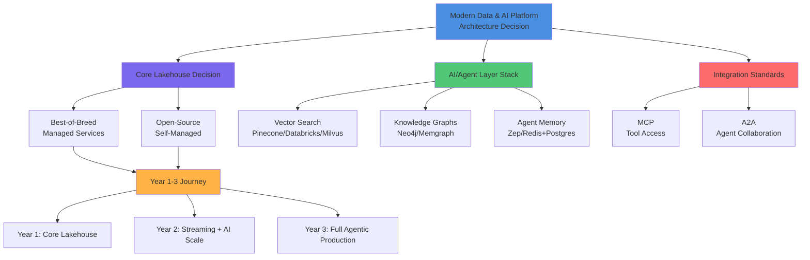

# Modern Data & AI Platform Blueprint 2026

Comparative design of Best-of-Breed and Open-Source/Self-Managed architectures spanning ingestion, streaming, lakehouse, governance, security, knowledge graphs, vector infrastructure, agentic AI, evaluation, and FinOps—with cost models, maturity assessments, risks, and a 3-year adoption roadmap.

**Scope:** Global operations, real-time + batch analytics, generative AI & autonomous agent workflows

**Horizon:** Launch mid-2026 · 3-year roadmap through 2029

**Document type:** Comparative Reference Architecture & Investment Blueprint

## Table of Contents

**Front Matter**
- Executive Summary & Key Findings
- Comparative Overview & Recommendation Preview

**Architecture 1 — Best-of-Breed**
- High-Level Design & Layered View
- Component Mapping
- Tradeoffs & Performance Characteristics
- Cost Estimates (Year 1–3)
- Maturity Assessment
- Risks & Mitigations

**Architecture 2 — Open-Source / Self-Managed**
- High-Level Design & Layered View
- Component Mapping
- Tradeoffs & Performance Characteristics
- Cost Estimates (Year 1–3)
- Maturity Assessment
- Risks & Mitigations

**Synthesis & Planning**
- Comparative Summary Matrix
- 3-Year Adoption Roadmap
- Recommendations & Prioritization

**Appendices**
- Detailed Cost Breakdown
- Glossary of Terms
- Pricing & Protocol Assumptions

## Executive Summary

A greenfield Fortune 500 platform launching in mid-2026 should be built on an **open table format lakehouse** (Apache Iceberg as the primary standard) with clear separation between storage, compute, catalog, and governance layers, layered with AI-native infrastructure—vector search, knowledge graphs, and agent memory—and standardized agent interoperability via the **Model Context Protocol (MCP)** for tool access and the emerging **Agent-to-Agent (A2A)** protocol for multi-agent collaboration.

This blueprint compares two architectures end-to-end across ingestion, streaming, storage/lakehouse, catalog, governance, security, lineage, observability, knowledge graph, vector infrastructure, agent memory, MCP, A2A, AI gateway, agent runtime, evaluation, FinOps, and compliance.

### Key Findings

| Dimension | Best-of-Breed | Open-Source / Self-Managed |
|-----------|---------------|--------------------------|
| Time to MVP | 3–6 months | 9–15 months |
| 3-Yr TCO (100TB→400TB active) | ~$28M–$42M aggregate | ~$19M–$33M aggregate (before personnel premiums) |
| AI/Agent Feature Maturity (2026) | 4/5 — native vector search, agent frameworks, AI gateways as first-party features | 2.5/5 — strong components, but integration burden |
| Vendor Lock-in Risk | Medium — mitigated by Iceberg adoption | Low — fully portable |
| Operational Overhead | Low–Medium — managed services absorb complexity | High — requires dedicated SRE team (8–12 FTE) |
| Multi-Cloud / Hybrid / Sovereignty | Medium — varies by vendor, egress costs apply | High — identical across any Kubernetes substrate |

**Recommendation Preview:** For most Fortune 500 organizations, adopt a **hybrid approach**: an Iceberg lakehouse core with an Iceberg REST catalog (keeping Trino, Databricks, and Snowflake viable compute engines), best-of-breed components for the AI gateway, vector search, and agent runtime, and MCP/A2A as standardized integration contracts between agents and tools.

## Architecture 1: Best-of-Breed (Managed)

A curated mix of leading managed/SaaS platforms (Databricks/Snowflake-class lakehouse, Confluent streaming, Pinecone/Neo4j AI infrastructure, Collibra/Immuta governance) optimized for time-to-value, reduced operational burden, and out-of-box AI/agent capability.

### Layered Architecture View

Best-of-Breed architecture flows through: ingestion → streaming → storage/lakehouse → AI/agent layer → governance → consumption. Batch and streaming pipelines converge into unified Iceberg tables queryable by any compute engine (Trino, Spark, Databricks, Snowflake).

**Batch Path:** Fivetran ingests data from SaaS sources, Airbyte Cloud handles hybrid connectors, and dbt transformations operate on Iceberg gold tables, with schema drift handling automated. Supports complex ETL workflows with change tracking and full lineage capture.

**Real-Time Path:** Debezium captures database changes to Kafka, Apache Flink processes streaming events with sub-100ms latency targets, and writes streaming sinks directly to Iceberg, enabling unified queries across batch and real-time data in a single lakehouses. Confluent-managed Kafka eliminates operational complexity for streaming infrastructure.

**Unified Iceberg Lakehouse:** Both pathways converge on Iceberg tables stored in cloud object storage (S3, Azure ADLS, or GCS), enabling queryability from any compute engine while maintaining full ACID semantics, schema evolution, and time-travel capabilities.

The AI/Agent layer sits atop the lakehouse, querying Iceberg tables directly via Databricks/Snowflake compute or Trino. Vector search and knowledge graph services are populated via streaming or batch jobs from the same Iceberg tables. MCP servers expose lakehouse data, vector search, and knowledge graph as standardized tools to agent runtimes; A2A enables those agents to delegate sub-tasks to specialized agents (e.g., a "data retrieval agent" calling a "compliance-check agent").

### Component Mapping

| Capability | Primary Tool(s) | Native / Integration | Notes |
|-----------|-----------------|----------------------|-------|
| Batch / SaaS ingestion | Fivetran, Airbyte Cloud | Native | Pre-built connectors for 100s of SaaS sources |
| CDC | Confluent + Debezium connectors | Native | Managed Kafka Connect runtime via Confluent Cloud |
| Streaming | Confluent Cloud (Kafka) + Apache Flink (managed) | Native | Sub-100ms p99 achievable for event processing |
| Unstructured ingestion | Unstructured.io, AWS Bedrock Data Automation | Integration | Document parsing, OCR, chunking for AI content |
| Object storage | Amazon S3 / Azure ADLS / Google Cloud Storage | Native cloud | Foundation for exabyte-scale; lifecycle tiering |
| Table format | Apache Iceberg | Open standard | Native to Databricks and Snowflake (2024+) |
| Lakehouse compute | Databricks (Photon) or Snowflake | Native | Auto-scaling SQL/Spark compute; serverless options |
| Catalog | Unity Catalog (Databricks) or Polaris/Horizon (Snowflake) | Native | Increasingly Iceberg REST-catalog compatible |
| Governance / quality | Unity Catalog policies + Monte Carlo + Great Expectations | Mixed | Policy enforcement native; quality via integration |
| Security | Cloud IAM + Immuta / Privacera (ABAC) + KMS encryption | Integration | Fine-grained attribute-based access control |
| Lineage | Unity Catalog / Horizon native + OpenLineage feed to Atlan | Native + Integration | Automated column-level lineage |
| Observability | Datadog, Monte Carlo, native platform metrics | Integration | Unified dashboards across infrastructure and data quality |
| Knowledge graph | Neo4j Aura, GraphRAG via LlamaIndex/LangChain | Integration | Entity resolution pipelines feed graph from Iceberg |
| Vector infrastructure | Databricks Vector Search / Snowflake Cortex Search / Pinecone | Native or Integration | In-platform avoids data movement |
| Agent memory | Zep, Mem0, or LangGraph checkpoints in Postgres | Integration | Session + long-term semantic/episodic memory |
| MCP (tool access) | Anthropic MCP servers for internal tools | Emerging standard | Standardizes agent tool discovery and calls |
| A2A (agent collaboration) | A2A protocol via orchestration layer | Emerging / Integration | Multi-agent task delegation |
| AI gateway | Portkey, Cloudflare AI Gateway, or Databricks AI Gateway | Native or Integration | LLM/MCP/A2A proxy with routing, guardrails |
| Agent runtime | LangGraph, Bedrock AgentCore, Databricks Agent Bricks | Mixed | Orchestration, execution, sandboxing for agents |
| Evaluation | Databricks Mosaic AI Evaluation, Braintrust, Arize Phoenix | Integration | Model/agent performance, RAG evaluation |
| FinOps | CloudZero, Vantage, native cost dashboards | Integration | Cost visibility, chargeback, anomaly detection |
| Compliance / audit | Unity Catalog audit logs + CloudTrail | Native | Supports SOX, GDPR, HIPAA, PCI evidence needs |

### Tradeoffs & Performance Characteristics

**Performance:** Databricks and Snowflake deliver sub-second to low-second BI query latency at petabyte scale with auto-scaling capabilities. Streaming pipelines via Confluent and Flink achieve sub-100ms p99 latency for event processing. Query optimizer tuning is handled by vendors; most organizations achieve target SLAs without custom performance tuning.

**Scalability:** Effectively unbounded via cloud object storage with elastic compute scaling. Scales to exabyte-class data volumes. Compute resources scale elastically but at a premium per-unit cost compared to self-managed alternatives. Multi-tenancy and resource isolation are handled transparently by the platform.

**Complexity:** Lower integration burden—most components ship pre-integrated with vendor support contracts. Standard connectors cover 90%+ of typical SaaS and database sources. Fewer custom integrations needed compared to open-source stacks.

**Vendor Lock-in:** Significantly mitigated by Apache Iceberg adoption as the canonical table format, which keeps data portable across query engines (Trino, Databricks, Snowflake). However, compute, catalog, and governance layers remain comparatively sticky to individual vendors. Switching compute engines mid-production is feasible but requires planning and coordination.

**Talent Availability:** Substantially easier hiring—SQL, dbt, Databricks, and Snowflake skills are widely available in the market. Reduced need for specialized distributed systems expertise. Lower training overhead for platform teams.

**Multi-Cloud / Hybrid Flexibility:** Snowflake and Databricks both operate across AWS, Azure, and GCP, enabling cloud vendor flexibility. Cross-cloud egress costs are material at scale (typically $0.01–$0.05 per GB); latency also increases for multi-region queries and should be factored into SLA planning.

**AI/Agent Readiness:** Highest of the two architectures—native vector search, agent frameworks, and AI gateways are first-party features as of 2025–2026. GPU workload integration and LLM orchestration ship with vendor support, reducing time-to-value for agentic AI workloads.

**Operational Overhead:** Low—managed services absorb patching, scaling, and high availability responsibilities. On-call rotations are minimal; vendor SLAs typically guarantee 99.9% uptime with automatic failover and disaster recovery built-in.

### Cost Estimate — Year 1–3

Assumptions: ~100TB active data growing toward ~400TB by Year 3; moderate-to-heavy GPU AI workloads; US-blended enterprise personnel costs; 2026 list pricing with 15–25% enterprise discounts.

| Category | Year 1 | Year 2 | Year 3 |
|----------|--------|--------|--------|
| Storage (object + Iceberg) | $0.6M | $1.0M | $1.8M |
| Compute (lakehouse + streaming) | $4.5M | $7.5M | $11M |
| AI / GPU (training + inference + vector) | $2.5M | $5M | $8M |
| Licensing | $3M | $4M | $5.5M |
| Egress / networking | $0.3M | $0.5M | $0.8M |
| Personnel (25–35 FTE) | $6M | $7M | $8M |
| **Total** | **≈ $17M** | **≈ $25M** | **≈ $35M** |

**Sensitivity:** 2x/year data growth adds ~30–40% to storage + compute by Year 3. FinOps practices can recover 15–25% of compute spend.

### Maturity Assessment (2026, 1–5 scale)

| Dimension | Score | Notes |
|-----------|-------|-------|
| Reliability / SLA | 5 | Mature managed services with multi-region availability |
| Iceberg / table format support | 4 | Databricks and Snowflake both native (2025–2026) |
| Vector / AI-native features | 4 | Snowflake Cortex and Databricks Vector Search are GA |
| Governance / catalog | 4 | Unity Catalog and Horizon strong; cross-platform interop maturing |
| MCP ecosystem | 3 | Standard gaining adoption; server ecosystem consolidating |
| A2A ecosystem | 2 | Very early stage; protocol stabilizing through 2026 |
| Agent runtime maturity | 3 | Frameworks evolving; production patterns settling |

### Risks & Mitigations

**Risk — Catalog lock-in despite Iceberg.** *Mitigation:* Use Iceberg REST Catalog specification; avoid catalog-specific metadata extensions to preserve compute engine switching capability.

**Risk — AI gateway / agent tooling churn.** *Mitigation:* Abstract agent tool access behind an internal MCP gateway for framework swap-out without rearchitecting consuming applications.

**Risk — Cost overruns from GPU inference.** *Mitigation:* Shift-left FinOps—tag AI workloads at creation, set budgets/alerts, use spot/serverless GPU where latency permits.

**Risk — Multi-region compliance.** *Mitigation:* Region-scoped Iceberg namespaces with row-level policies enforcing data residency at query time.

## Architecture 2: Open-Source / Self-Managed

The Open-Source / Self-Managed architecture builds from fully open components running on Kubernetes, with Apache Iceberg as the table format and an Iceberg REST catalog (Project Nessie or Apache Polaris) enabling git-like versioning and engine-agnostic access. This maximizes control and portability across cloud and on-premises, at the cost of higher integration and operational effort.

### Layered Architecture View

Open-Source architecture flows through: ingestion → stream processing → storage/lakehouse → AI/agent layer → governance → consumption. Deployed entirely on self-managed Kubernetes infrastructure, either cloud-hosted or on-premises.

**Batch Path:** Airbyte OSS ingests from 100+ connectors, Apache Spark executes ETL transformations, and dbt builds dimensional models on top of Iceberg tables. Schema drift handling and data quality checks are implemented via Great Expectations or Soda Core. Full lineage is captured via OpenLineage and federated through Marquez or OpenMetadata.

**Real-Time Path:** Debezium captures database changes from source systems into Apache Kafka (via Strimzi operator on Kubernetes), Apache Flink processes streaming events with millisecond-latency targets, and writes directly to Iceberg streaming sinks on MinIO or Ceph object storage. Optional serving layer (Pinot or Materialize) supports sub-second analytics for real-time dashboards.

**Unified Iceberg Lakehouse:** Both batch and streaming pathways converge on Iceberg tables stored on S3-compatible object storage (MinIO for cloud deployments, Ceph for on-premises or hybrid). Iceberg's open format enables queryability from Trino (federated SQL), Spark (batch/ML), or Flink (streaming analytics) without vendor lock-in. Table versioning via Project Nessie or Apache Polaris REST catalog enables git-like branching and time-travel queries.

**AI/Agent Overlay:** Milvus or Qdrant provide vector search over embeddings generated from Iceberg tables via batch or streaming jobs. Neo4j Community or Memgraph host the knowledge graph for GraphRAG and entity resolution. Agent memory layer combines Redis (short-term/session state) with Postgres + pgvector extension (long-term semantic and episodic memory). Self-hosted MCP servers using open SDKs expose these services as standardized tools to agent runtimes. A2A multi-agent collaboration is implemented via Kafka or NATS message bus using the emerging A2A schema, though this layer requires the most custom integration work in 2026.

### Component Mapping

| Capability | Primary Tool(s) | Notes |
|-----------|-----------------|-------|
| Batch ingestion | Airbyte OSS | Self-hosted on Kubernetes; broad connector library |
| CDC | Debezium + Kafka Connect | Industry-standard, widely-adopted CDC framework |
| Streaming | Apache Kafka (Strimzi on K8s) + Apache Flink | Comparable latency to managed Confluent if operated well |
| Unstructured ingestion | Apache Tika, Unstructured OSS, Docling | Self-managed pipelines for document parsing |
| Object storage | MinIO or Ceph | S3-compatible, exabyte-capable, cloud or on-prem |
| Table format | Apache Iceberg | Primary open standard; Hudi/Delta viable alternatives |
| Catalog | Project Nessie or Apache Polaris (OSS) | Iceberg REST catalog with git-like versioning |
| Compute | Trino (interactive SQL) + Spark (batch/ML) | Engine-agnostic over Iceberg |
| Governance / quality | Great Expectations, Soda Core, OpenMetadata | Requires integration glue; no single console |
| Security | Apache Ranger + Open Policy Agent (OPA) | ABAC via Ranger policies; policy-as-code |
| Lineage | OpenLineage + Marquez | Must be wired across Spark, Flink, Trino |
| Observability | Prometheus / Grafana / OpenTelemetry | Full-stack metrics, traces, logs for heterogeneous system |
| Knowledge graph | Neo4j Community or Memgraph | Entity resolution via Zingg/Senzing OSS |
| Vector infrastructure | Milvus, Qdrant, or pgvector | Milvus for scale; pgvector for simplicity |
| Agent memory | Redis (short-term) + Postgres/pgvector (long-term) | DIY semantic + episodic memory layer |
| MCP (tool access) | Self-hosted MCP servers (open SDKs) | Build/maintain internal connectors |
| A2A (agent collaboration) | Kafka/NATS-based message bus implementing A2A | Minimal OSS tooling; custom glue likely |
| AI gateway | LiteLLM Proxy (OSS) | Routing, cost tracking, guardrails |
| Agent runtime | LangGraph + Temporal (workflow durability) | Production-agent ops patterns still emerging |
| Evaluation | Arize Phoenix OSS, Ragas, promptfoo | OSS eval tooling maturing well |
| FinOps | OpenCost / Kubecost + custom dashboards | Manual chargeback setup |
| Compliance / audit | Ranger audit + custom log pipeline to SIEM | Higher build effort; centralize to OpenSearch/SIEM |

### Tradeoffs & Performance Characteristics

**Performance:** Trino can match managed warehouse performance for federated and interactive queries (sub-second to low single-digit-second latency at scale) but requires careful configuration and resource tuning. Flink on Kafka achieves latencies comparable to managed Confluent if operated well, though operational complexity is higher. Query performance is very sensitive to proper indexing, partitioning strategy, and hardware sizing.

**Scalability:** Theoretically exabyte-scale via Ceph/MinIO + Iceberg + Kubernetes, bounded mainly by operational maturity rather than technology limits. Linear scalability across clusters requires proper data partitioning and query planning awareness.

**Complexity:** Significantly higher—dozens of components (Kafka, Flink, Trino, Ranger, Prometheus, etc.) must be integrated, upgraded, and secured independently. Each component has its own operational procedures, monitoring requirements, and failure modes. Integration testing across components is non-trivial.

**Vendor Lock-in:** Lowest of the two architectures—fully portable across clouds and on-premises. Code and configurations are reusable without modification across AWS, Azure, GCP, and private data centers.

**Talent Availability:** Highly constrained—requires deep platform engineering skills in Kafka operations, Flink tuning, Kubernetes administration, and Trino query optimization. Harder to hire and retain, with a significant salary premium (typically 20–30% higher than comparable managed-service roles). Niche skill set with limited labor market depth.

**Multi-Cloud / Hybrid Flexibility:** Best-in-class—runs identically on any Kubernetes substrate, whether cloud-hosted Kubernetes (EKS, AKS, GKE) or self-managed on-premises. No vendor-specific dependencies; complete portability and data sovereignty.

**AI/Agent Readiness:** Lower out-of-box than managed alternatives. Vector search (Milvus/Qdrant), knowledge graphs, and agent components exist but require significant integration work to reach feature parity with managed AI suites. Evaluation and observability frameworks are community-driven and less polished.

**Operational Overhead:** High—requires a dedicated platform SRE function (estimated 8–12 additional FTEs versus the Best-of-Breed architecture). On-call rotations are essential; production incidents require deep platform expertise to resolve. Continuous patching, security updates, and dependency management create baseline operational burden.

### Cost Estimate — Year 1–3

Same baseline as Architecture 1 (~100TB active → ~400TB by Year 3). Infrastructure reflects self-managed Kubernetes compute/storage nodes rather than managed-service pricing.

| Category | Year 1 | Year 2 | Year 3 |
|----------|--------|--------|--------|
| Infrastructure (compute / Kubernetes) | $3M | $5.5M | $8.5M |
| Storage (Ceph/MinIO) | $0.4M | $0.7M | $1.2M |
| GPU (training + inference) | $2.5M | $5M | $8M |
| Licensing (mostly $0; some support) | $0.3M | $0.4M | $0.5M |
| Egress / networking | $0.2M | $0.35M | $0.55M |
| Personnel (35–45 FTE — larger SRE team) | $8.5M | $10M | $11.5M |
| **Total** | **≈ $15M** | **≈ $22M** | **≈ $30M** |

**Sensitivity:** Lower direct infrastructure cost, but personnel premium narrows the gap. At 2x/year data growth, infrastructure scales linearly while personnel grows sub-linearly—favoring open-source at >1PB scale.

### Maturity Assessment (2026, 1–5 scale)

| Dimension | Score | Notes |
|-----------|-------|-------|
| Reliability / SLA | 3 | Achievable but requires significant SRE investment |
| Iceberg / table format support | 5 | Iceberg is OSS-native; best-supported ecosystem |
| Vector / AI-native features | 2.5 | Milvus/Qdrant solid but integration-heavy |
| Governance / catalog | 3 | OpenMetadata/DataHub strong but less turnkey |
| MCP ecosystem | 3 | OSS SDKs available; maintenance burden on internal team |
| A2A ecosystem | 1.5 | Minimal OSS tooling; mostly custom-built as of 2026 |
| Agent runtime maturity | 2.5 | LangGraph/Temporal solid; production ops patterns emerging |

### Risks & Mitigations

**Risk — Operational fragility from component sprawl (20+ OSS systems).** *Mitigation:* Standardize on Kubernetes operators (Strimzi for Kafka, Flink Operator, Trino Operator); adopt an internal developer-platform model.

**Risk — Talent attrition on niche skills.** *Mitigation:* Invest in training; consider managed-OSS hybrids for non-differentiating components.

**Risk — Slower AI/agent feature velocity.** *Mitigation:* Adopt OSS AI frameworks early; contribute upstream; consider best-of-breed carve-out for AI gateway/vector layer.

**Risk — Compliance audit overhead.** *Mitigation:* Centralize all audit logs into a SIEM from day one with standardized OpenLineage events.

## Comparative Summary & Recommendations

| Use Case / Priority | Best-of-Breed | Open-Source / Self-Managed |
|-------|--------|--------|
| Fast time-to-market (&lt;6mo MVP) | ✅ Strong fit | ❌ Weak fit |
| Lowest 3-yr TCO at >1PB scale | ⚠ Moderate | ✅ Strong fit (if SRE talent secured) |
| Strict data sovereignty / on-prem | ⚠ Possible via Outposts | ✅ Strong fit |
| Cutting-edge AI/agent features (2026) | ✅ Strong fit | ⚠ Lag 6–12 months |
| Regulatory audit readiness (SOX/HIPAA) | ✅ Strong fit | ⚠ Requires build-out |
| Avoiding vendor lock-in | ⚠ Partial (Iceberg helps) | ✅ Strong fit |
| Talent market depth | ✅ Strong | ⚠ Constrained |

**Net Takeaway:** Best-of-Breed wins on speed, AI/agent velocity, and compliance readiness. Open-Source wins on lock-in avoidance, sovereignty, and TCO at >1PB scale with sufficient platform engineering talent.

## 3-Year Adoption Roadmap

### Year 1 — MVP: Core Lakehouse + Governance

**Q1–Q2:** Stand up Iceberg lakehouse on cloud object storage with REST catalog. Establish CDC and batch ingestion for top 5–10 source systems. Deploy baseline RBAC/ABAC and encryption-at-rest/in-transit.

**Q3:** Deploy streaming backbone (Kafka/Confluent + Flink) for highest-priority real-time use case. Stand up data-quality framework and lineage capture (OpenLineage).

**Q4:** Launch vector search and first GraphRAG use case in contained domain. Establish AI gateway with guardrails and LLM routing. Deploy initial MCP servers for 3–5 internal tools.

**Success metrics:** Time-to-onboard new data source &lt; 2 weeks; 95% pipeline SLA adherence; first production RAG use case live.

### Year 2 — Scale: Streaming + BI/AI Expansion

Expand streaming coverage; introduce serving layer (Pinot/Materialize) for sub-second analytics. Build enterprise-scale knowledge graph and entity resolution; expand vector infrastructure to multi-tenant. Stand up agent runtime (LangGraph/Temporal) with persistent agent memory (episodic + semantic). Introduce A2A protocol pilots for 2–3 cross-agent workflows; expand MCP server catalog to 15–20 tools. Mature FinOps: per-workload chargeback, automated cost-anomaly detection, GPU utilization optimization.

**Success metrics:** Streaming latency p99 &lt; 500ms; agent task success > 80% on pilots; cost/query reduced 20% versus Year 1.

### Year 3 — Optimize / Transform: Full Agentic AI + Advanced FinOps

Multi-agent systems in production across 3+ domains, coordinated via A2A; full MCP governance layer (centralized registry, authentication, audit). Advanced evaluation pipelines—continuous RAG/agent evaluation with regression testing. Shift-left FinOps fully embedded in CI/CD for data/AI pipelines, with predictive cost modeling. Full data-sovereignty/residency enforcement automated via policy-as-code.

**Success metrics:** Time-to-insight reduced 50%; agent-driven decisions covering > 30% of targeted workflows; full audit-trail coverage for SOX, GDPR, HIPAA.

### Dependencies & Skill-Building

Year 1 requires platform engineering (Iceberg, catalog, streaming) and data governance hires before AI/agent work. Year 2's agent runtime and A2A pilots depend on Year 1's MCP foundation. Year 3's multi-agent production depends on Year 2's evaluation maturity. Each year's pilots should be production-promotable without re-platforming.

## Strategic Recommendations

**Prioritize AI innovation speed:** Best-of-breed core for AI gateway, vector search, and agent runtime regardless of base lakehouse choice.

**Prioritize cost control at extreme scale (>1PB):** Open-source core with selective managed services for AI/streaming control planes.

**Prioritize compliance certainty (HIPAA/PCI/SOX):** Best-of-breed, leveraging vendor compliance certifications and built-in audit/lineage.

**Prioritize multi-cloud / sovereignty:** Open-source core with best-of-breed AI layer abstracted behind AI gateway/MCP boundary for vendor swappability.

**Pragmatic default recommendation:** For Fortune 500 greenfield builds, adopt an Iceberg lakehouse core with Iceberg REST catalog (keeping Trino and Databricks/Snowflake viable), best-of-breed for AI gateway, vector search, and agent runtime, and open standards (MCP/A2A) as integration contracts so underlying vendors remain swappable.

## Appendix A: Detailed Cost Breakdown

| Category | Best-of-Breed (Yr1/Yr2/Yr3) | Open-Source/Self-Managed (Yr1/Yr2/Yr3) |
|----------|--------|--------|
| Storage / Infrastructure | $0.6M / $1.0M / $1.8M | $3.4M / $6.2M / $9.7M (compute + storage) |
| Compute | $4.5M / $7.5M / $11M | — (included above) |
| AI / GPU | $2.5M / $5M / $8M | $2.5M / $5M / $8M |
| Licensing | $3M / $4M / $5.5M | $0.3M / $0.4M / $0.5M |
| Egress / Networking | $0.3M / $0.5M / $0.8M | $0.2M / $0.35M / $0.55M |
| Personnel | $6M / $7M / $8M | $8.5M / $10M / $11.5M |
| **3-Yr Cumulative** | **≈$77M** | **≈$67M (excl. personnel premium risk)** |

### Cost Drivers & Sensitivities

- **Data growth at 2x/year:** adds ~30–40% to storage + compute by Year 3 in both architectures.
- **GPU pricing:** largest variable; assumes continued moderate price declines through 2028.
- **FinOps savings potential:** 15–25% recoverable on compute via auto-suspend, tiered storage, spot/serverless inference (Best-of-Breed); per-workload chargeback and bin-packing on Kubernetes (Open-Source).
- **Personnel premium risk:** Open-Source savings highly sensitive to hiring/retaining 35–45 specialized platform engineers; 20% understaffing typically manifests as reliability and velocity degradation rather than direct cost.
- **Active vs. total stored volume:** "100TB active" assumes total stored volume (including raw/historical/AI-generated unstructured content) is 3–5x larger, with lifecycle policies managing cost.

## Appendix B: Glossary

| Term | Definition |
|------|-----------|
| A2A | Agent-to-Agent protocol — an emerging open standard for multi-agent task delegation and collaboration |
| ABAC | Attribute-Based Access Control — access decisions based on user, resource, and environment attributes vs. fixed roles |
| CDC | Change Data Capture — streaming database changes (inserts/updates/deletes) to downstream systems in near real time |
| FinOps | Financial Operations — practices for cost visibility, optimization, and chargeback across cloud/SaaS spend |
| GDPR | General Data Protection Regulation — EU data privacy and protection law |
| GraphRAG | Retrieval-Augmented Generation using knowledge graphs (entities + relationships) to improve retrieval relevance |
| Iceberg / Hudi / Delta | Open table formats bringing ACID transactions, schema evolution, and time travel to object storage data |
| Lakehouse | Unified architecture combining data lake storage (object storage + open table formats) with warehouse-style analytics and ML |
| MCP | Model Context Protocol — an open standard for exposing tools, data sources, and context to AI agents |
| RAG | Retrieval-Augmented Generation — augmenting LLM prompts with retrieved documents/data to improve accuracy |
| SOX | Sarbanes-Oxley Act — US financial reporting and internal-controls regulation, relevant to audit trails and data integrity |
| Zero-Trust | Security model assuming no implicit trust; every request is authenticated, authorized, and encrypted |

## Appendix C: Protocol & Market Assumptions

**MCP adoption** is assumed to continue consolidating through 2026 as the dominant agent-tool-access standard.

**A2A adoption** is less certain and may be superseded by competing multi-agent protocols. Treat A2A investments as pilots until at least 2027.

**Pricing & market assumptions:** Cost estimates assume 2026 cloud list pricing with typical 15–25% enterprise discounts and moderate reserved-capacity commitments. GPU costs assume continued but not dramatic price declines through the roadmap period. Personnel costs assume US-blended enterprise salary bands; global operations may shift this materially.

**Document scope & limitations:** This blueprint is a directional planning reference, not a procurement-ready bill of materials. Vendor names represent illustrative category leaders (mid-2026) and should be validated against current RFP responses, security reviews, and negotiated enterprise pricing. Cost figures are order-of-magnitude estimates for budget-planning; component choices should be informed by proof-of-concept benchmarking against the enterprise's specific data volumes and query patterns.

---

End of document — Modern Data & AI Platform Architecture Blueprint, prepared for Executive Architecture Review, 2026.
