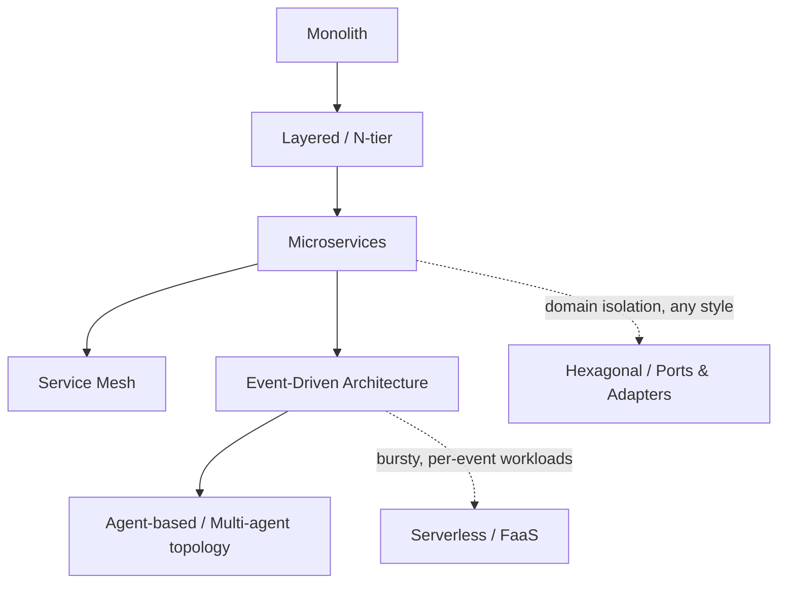

An architecture style is a named, recurring shape for organizing a system's components and their communication — the level above individual patterns. Most enterprise AI platforms are compositions of several styles at once (an event-driven backbone carrying a microservices layer that hosts a multi-agent topology), so the practical skill isn't picking one style — it's knowing which style governs which slice of the system, and why.

## Core Concepts

| Style | Shape | Where it governs | Primary trade-off |
|---|---|---|---|
| Monolith | Single deployable unit | Small teams, early-stage products, tightly coupled domains | Fast to build and reason about; scales poorly across teams and load profiles |
| Layered (N-tier) | Strict horizontal layers (presentation/business/data) | Traditional enterprise apps; still common inside individual services | Simple to onboard into; layers tend to leak abstractions under pressure |
| Microservices | Independently deployable services per bounded context | Large orgs, independent scaling/release needs | Team autonomy and fault isolation; adds network, versioning, and operational cost |
| Service Mesh | Sidecar-managed service-to-service traffic | High-density microservice estates needing uniform mTLS, retries, observability | Centralizes cross-cutting concerns; adds a control-plane dependency and latency overhead |
| Event-Driven Architecture (EDA) | Producers/consumers decoupled via an event backbone | Systems needing loose coupling, replay, and multi-consumer fan-out | Excellent decoupling and auditability; harder to trace a single request end-to-end |
| Hexagonal / Ports & Adapters | Domain core isolated behind ports; adapters plug in at the edges | Systems that must swap infrastructure (model vendor, DB, queue) without touching domain logic | Keeps the domain testable and vendor-agnostic; more upfront ceremony than a direct-call design |
| Serverless / FaaS | Ephemeral, event-triggered functions | Bursty, infrequent, or per-request workloads | No idle cost, auto-scales; cold starts and execution-time limits constrain long-running agent loops |
| Agent-based / Multi-agent topology | Autonomous agents coordinating via messages, shared state, or a supervisor | Workloads decomposed into specialized reasoning/tool-use roles rather than fixed request/response steps | Matches non-deterministic, multi-step work well; introduces coordination, cost, and reliability concerns absent from the styles above |

The arrows above trace a common maturity path, not a mandate — a hexagonal core or an event backbone can wrap a monolith just as well as a microservices estate; the diagram shows where each style *typically* gets introduced as system scale and team count grow, not a required sequence.

## AI-Specific Considerations

Two things change once agents and LLM calls enter a system that a pre-2023 architecture-styles discussion wouldn't cover:

- **Non-determinism breaks strict layering.** A layered architecture assumes a request produces a predictable call graph; an agent loop may re-enter the same "layer" an unknown number of times (tool call → reasoning → another tool call). Hexagonal boundaries around the agent's tool/data adapters hold up better than strict N-tier layering here, because the domain core doesn't need to assume a fixed call count.
- **The agent-based style is additive, not a replacement.** A multi-agent topology still needs to live inside something — usually an event-driven backbone (for durable message passing between agents) or a microservices/service-mesh estate (for the tools and data services agents call). See [Multi-Agent Topology Patterns](59-multi-agent-topology-patterns.md) for topology-level detail (supervisor, swarm, hierarchical) that sits one level below the styles catalogued here, and [Agentic AI Landing Zone Architecture](22-agentic-ai-landing-zone-architecture.md) for how these styles compose into a full reference architecture.

## Decision Matrix

| If your primary constraint is… | Lean toward |
|---|---|
| Team independence / release cadence | Microservices (+ service mesh if the estate is large) |
| Vendor or infrastructure swappability (model provider, vector DB) | Hexagonal / Ports & Adapters |
| Loose coupling with replay/audit needs | Event-Driven Architecture |
| Bursty, infrequent, cost-sensitive workloads | Serverless / FaaS (mind cold-start limits for long agent loops) |
| Decomposing a workload into specialized reasoning/tool-use roles | Agent-based / multi-agent topology, layered on top of one of the above |
| Small team, early-stage, single deployable is still tractable | Monolith (modular monolith with clear internal boundaries, not a ball of mud) |

## Anti-Patterns

- **Style-mixing without a boundary.** Adopting microservices for release independence while still sharing a single database defeats the isolation the style is chosen for.
- **Forcing determinism onto an agent loop.** Wrapping a multi-agent system in a strict layered architecture (UI → business logic → data, one pass only) breaks the first time an agent needs to re-plan.
- **Serverless for long-running agent orchestration.** FaaS execution-time limits and cold starts make it a poor host for a supervisor agent coordinating a multi-hour task, even though it's a fine host for a single tool-call function.
- **Adopting a service mesh before there's a service-count problem.** The control-plane operational cost is easy to underestimate below roughly a few dozen services.

## Related

- [Multi-Agent Topology Patterns](59-multi-agent-topology-patterns.md) — topology-level detail for the agent-based style catalogued above.
- [Agentic AI Landing Zone Architecture](22-agentic-ai-landing-zone-architecture.md) — a full reference architecture composing several of these styles.
- [Enterprise Agent Reference Architectures, Platform Engineering & Checklists](47-enterprise-agent-reference-architectures.md) — reference architectures built from these style choices.
- [Enterprise Architecture Glossary & Cheat Sheet](69-ea-glossary-cheatsheet.md) — term-level definitions for styles referenced only briefly here (DDD, layered architecture).
