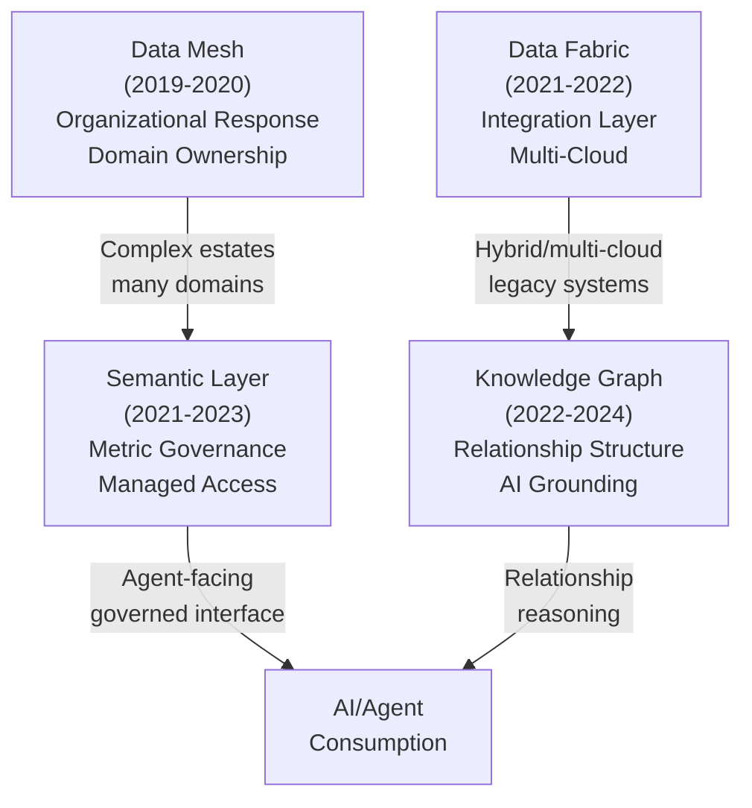

# From Data Warehouse to Agent-Native Architecture — Part 2

*Enterprise Architecture Evolution Research Report — 2026–2031 Edition*

This is **Part 2 of 3**. This section covers the paradigms that emerged in response to organizational and analytical complexity challenges: data mesh (domain ownership), data fabric (integration across disparate systems), knowledge graphs (relationship-structured reasoning), and semantic layers (governed metrics). [Part 1](../20-ai-native-architecture-evolution-report.md) covers foundational storage paradigms; [Part 3](13-ai-native-architecture-evolution-report-decision-forecast.md) covers feature stores, vector infrastructure, agent memory, and decision frameworks.

## Paradigm Evolution: Organizational to Analytical Dimensions

## Data Mesh

Domain ownership and data-as-a-product — an organizational paradigm implemented technically

##### Why It Emerged

Data mesh emerged around 2019-2020 (most associated with Zhamak Dehghani's writing while at Thoughtworks) as a response not primarily to a technology limitation but to an organizational bottleneck: centralized data engineering teams, regardless of how well-architected their lakehouse or warehouse, became throughput bottlenecks as the number of data consumers and use cases grew faster than the central team could scale. Every new data product request queued behind the same team, regardless of which business domain needed it or had the most relevant domain expertise to build it correctly.

##### Problems Solved

- Eliminated the central-team bottleneck by distributing data ownership and pipeline-building responsibility to the business domains that generate and best understand the data

- Improved data quality at the source — domain teams with direct business context produce more accurate, contextually-correct data products than a central team interpreting unfamiliar domain logic secondhand

- Enabled parallel development — multiple domains can build and evolve their data products simultaneously without contending for central team capacity

- Formalized data-as-a-product thinking — explicit ownership, documentation, SLAs, and discoverability requirements that ad-hoc central-team-produced datasets often lacked

- Federated computational governance — global policies (security, compliance) enforced consistently via shared platform tooling, while domain-specific decisions remain local

##### Problems Introduced

- **Organizational change management burden:** data mesh requires domains to take on engineering responsibility they often don't have staffing or skills for — the most commonly cited reason for stalled mesh initiatives is domains lacking the data engineering capacity the model assumes they'll develop

- **Platform team becomes a new bottleneck:** the self-serve infrastructure platform that domains depend on requires significant upfront investment and ongoing maintenance by a platform team — under-investment here means domains can't actually self-serve, undermining the model's core premise

- **Interoperability and duplication risk:** without strong data contracts (the explicit interface between domains), federated domains can produce inconsistent definitions for shared concepts (e.g., 'customer') — the exact problem centralization was meant to prevent, now distributed across more teams

- **Governance consistency challenges:** 'federated computational governance' is conceptually elegant but operationally demanding — ensuring consistent application of security/compliance policies across many independently-operated data products requires governance tooling maturity that few organizations had when mesh adoption began

- **Discoverability at scale:** as the number of independently-produced data products grows, finding the right one (and trusting it's the authoritative source) becomes its own challenge — requiring a robust data marketplace/catalog that many early mesh implementations underbuilt

##### Enterprise Adoption Patterns

Adoption has been selective and concentrated in large, multi-business-unit enterprises (financial services, telecommunications, large retail/consumer goods, healthcare systems) where domain boundaries are clear and central data teams had become demonstrable bottlenecks. Smaller organizations and those with simpler organizational structures have largely not adopted full data mesh — the organizational overhead isn't justified at smaller scale, where a well-run centralized team can still keep pace with demand. Many organizations that publicly discuss 'data mesh' have adopted specific principles (data products, data contracts, domain ownership for select domains) without the full federated model — a 'mesh-inspired' rather than 'mesh-complete' adoption pattern that appears far more common than complete implementations.

##### Migration Paths

The most common and successful migration path is incremental and starts with platform investment, not domain reorganization: build the self-serve infrastructure platform (often on top of an existing lakehouse — adding data product templates, automated quality checks, and a catalog/marketplace) before asking any domain to take on ownership; then pilot with one or two domains that already have relatively strong engineering capability and a clear, valuable data product to publish; then expand domain-by-domain based on pilot learnings, rather than a simultaneous organization-wide reorganization. Organizations that attempted simultaneous reorganization across many domains report significantly higher rates of stalled or reversed initiatives.

##### Failure Modes

- **Stalled adoption due to domain capacity:** domains agree to ownership in principle but lack engineering staff to build/maintain data products, resulting in stale, unmaintained 'data products' that violate the data-as-a-product premise

- **Shadow centralization:** when domains can't keep pace, central platform teams informally absorb the work again — re-creating the original bottleneck but with added mesh-related governance overhead and no corresponding benefit

- **Inconsistent data contracts:** domains publish data products with incompatible schemas for overlapping concepts, requiring downstream consumers to build reconciliation logic — effectively recreating integration complexity at the consumption layer

- **Governance drift:** federated domains apply security/classification policies inconsistently due to varying levels of governance maturity, creating compliance gaps that are harder to detect than in a centralized model because there's no single point of audit

##### Operational Complexity

Very High, and primarily organizational rather than technical. The technical components (lakehouse, data contracts, catalog) are individually well-understood; the complexity is in coordinating many independently-operated data products with consistent quality, governance, and interoperability — a coordination problem that scales with the number of domains, not the data volume.

##### Cost Implications

Costs shift from centralized (predictable, single budget line) to distributed (each domain bears its own data product costs, often making total cost less visible and harder to optimize centrally). The platform team investment required for self-serve infrastructure is substantial and often underestimated in business cases — organizations that justify mesh adoption primarily on cost reduction (vs. throughput/agility) frequently find the platform investment offsets near-term savings, with payoff (if it materializes) appearing over multi-year horizons through improved development velocity.

##### Governance Implications

Data mesh's 'federated computational governance' concept directly anticipates many requirements that became formal regulatory expectations later (data product ownership maps naturally to GDPR/CCPA data controller accountability; data contracts map to the kind of documented data flows increasingly required for AI Act compliance). Organizations with mature mesh implementations often find compliance documentation comparatively easier because ownership and lineage are explicit by design — but organizations with stalled or partial mesh adoption can find themselves with governance responsibilities distributed to domains that aren't actually executing them, a worse position than centralized governance with clear (if bottlenecked) accountability.

##### AI Readiness

Medium-High, conceptually well-aligned but execution-dependent. The data-as-a-product framing extends naturally to 'AI assets as products' (a domain's trained model or curated knowledge graph segment as a product with defined consumers and SLAs) — anticipating the 'AI mesh' direction discussed in broader operational governance literature. In practice, AI readiness depends heavily on whether individual domain data products meet the quality/documentation bar AI use cases require — which varies widely across domains within the same mesh.

##### Agent Readiness

Medium, with a notable structural advantage: agents querying well-defined data products with explicit contracts and ownership have clearer provenance and accountability than agents querying an undifferentiated central lakehouse — 'which domain owns this data and who do I escalate to if the agent's output based on it is wrong' is answerable by design in a mature mesh. The limitation is the same as AI readiness: this advantage only materializes for data products that meet the mesh's own quality bar, which is inconsistent across most real implementations.

## Data Fabric

Active metadata and AI-assisted integration across hybrid and multi-cloud estates

##### Why It Emerged

Data fabric emerged roughly 2021-2022 (heavily promoted by Gartner and major integration vendors — Informatica, IBM, Microsoft Purview) as a response to a different problem than data mesh: not organizational bottlenecks, but the technical complexity of multi-cloud and hybrid environments where data exists across dozens of disparate systems (on-prem databases, multiple cloud providers, SaaS applications) and full consolidation into a single lakehouse or warehouse is impractical, too slow, or prohibited by data residency requirements. Data fabric proposes an integration layer driven by 'active metadata' — metadata that's continuously and automatically updated (often AI-assisted) and used to orchestrate data access, discovery, and movement across this fragmented landscape without requiring all data to physically consolidate.

##### Problems Solved

- Provides a unified discovery and access layer across heterogeneous, geographically-distributed systems without requiring full data consolidation — valuable where consolidation is technically impractical or legally constrained (data residency)

- Active metadata automatically maintains an up-to-date map of where data lives, its lineage, and its relationships — reducing the manual cataloging burden that static catalogs require

- AI-assisted discovery and classification reduce the metadata curation bottleneck that plagued earlier governance efforts by automating much of the initial tagging/classification work

- Supports incremental modernization — legacy systems can remain in place (avoiding risky, expensive migrations) while the fabric layer provides modern access patterns on top

##### Problems Introduced

- **Heavy dependency on metadata quality and AI classification accuracy:** the entire value proposition rests on active metadata being accurate — AI-assisted classification has non-trivial false-positive/negative rates, and errors propagate into access decisions and discovery results, sometimes invisibly

- **Query performance unpredictability:** federated queries across the fabric to systems with vastly different performance characteristics (a fast cloud warehouse vs. a slow legacy on-prem database) can produce unpredictable end-to-end latency, especially problematic for AI applications expecting consistent response times

- **Vendor lock-in risk is high:** data fabric is heavily vendor-driven (vs. data mesh, which is more of an architectural philosophy implementable with various tools) — adopting a fabric platform often means adopting that vendor's metadata model, connectors, and governance framework as the central nervous system of the data estate

- **Doesn't solve underlying data quality issues:** a fabric can provide unified access to a poorly-governed legacy system, but it doesn't fix that system's data quality — it can make poor-quality data more discoverable and accessible, which isn't always an improvement without parallel quality remediation

- **Conceptual overlap and confusion with data mesh:** the two paradigms address different problems (technical integration complexity vs. organizational ownership) but are frequently conflated in vendor marketing, leading some organizations to adopt fabric tooling expecting mesh-like organizational benefits it doesn't provide

##### Enterprise Adoption Patterns

Adoption is growing but remains heavily concentrated among enterprises with genuinely complex hybrid/multi-cloud estates — typically large enterprises with significant on-premises legacy investment (financial services, manufacturing, healthcare, government) that can't fully migrate to cloud-native lakehouse architectures in the near term but need modern data access patterns for AI initiatives now. Adoption is most commonly implemented via expansion of existing enterprise integration vendor relationships (an organization already using Informatica or IBM for integration adopts that vendor's fabric capabilities) rather than as a greenfield architecture choice — reflecting the paradigm's vendor-driven origins.

##### Migration Paths

Unlike the lake-to-lakehouse or warehouse-to-lakehouse migrations, data fabric is rarely a 'migration' in the sense of moving data — it's typically an additive integration layer deployed on top of existing systems (warehouses, lakehouses, operational databases, SaaS applications) without requiring those systems to change. The practical 'migration path' is: deploy the fabric's metadata scanning/connector layer across priority systems (often starting with the systems most relevant to a specific AI initiative driving the investment), validate AI-assisted classification accuracy on a subset before trusting it for access control decisions, and incrementally expand connector coverage. Over time, some organizations use the fabric's unified view to identify consolidation opportunities (the fabric reveals duplicate datasets across systems that can then be consolidated into a lakehouse) — fabric and lakehouse adoption can be complementary rather than competing paths.

##### Failure Modes

- **Misclassification-driven access incidents:** AI-assisted classification incorrectly tags sensitive data as non-sensitive (or vice versa), leading to either inappropriate access grants or unnecessary access restrictions discovered only when users report problems

- **Federated query timeouts/failures:** queries spanning the fabric to slow or unreliable legacy systems time out or fail, particularly problematic when an AI application's response depends on the federated query completing within a latency budget

- **Metadata staleness for rapidly-changing systems:** active metadata scanning runs on a schedule (even if frequent) — for systems with rapid schema/data changes, there's a window where the fabric's view is stale, leading to discovery results or access decisions based on outdated information

- **Vendor platform outages becoming single points of failure:** as the fabric becomes the primary discovery/access layer across many systems, an outage of the fabric platform itself can disrupt access to systems that are individually healthy — a new centralized dependency in what was meant to be a decentralization-friendly pattern

##### Operational Complexity

Medium-High. Lower than fully consolidating disparate systems into a single platform (the fabric avoids that migration effort entirely), but the fabric platform itself requires ongoing operational attention: connector maintenance as source systems change, monitoring of AI classification accuracy (requiring periodic human review/correction), and capacity planning for federated query load on source systems that weren't designed for fabric-driven query patterns.

##### Cost Implications

Fabric platform licensing (typically priced per connected source system, data volume scanned, or per-user) is a direct, often substantial cost — and is additive to the cost of the underlying systems the fabric connects to (the fabric doesn't replace any existing system's licensing/operational cost). The cost case rests on avoided migration costs (not having to consolidate everything into a lakehouse) and improved AI/analytics time-to-value across the fragmented estate — a case that's genuinely strong for organizations with truly complex hybrid estates, but weak for organizations whose data estate is simple enough that consolidation (lakehouse) would be more cost-effective than an additional integration layer.

##### Governance Implications

Data fabric's active metadata and AI-assisted classification can meaningfully accelerate governance maturity for organizations starting from a low baseline (the automation reduces the manual cataloging effort that's the typical governance bottleneck). However, governance decisions (access policies, classification taxonomies) are now mediated through the fabric's AI classification — making the accuracy and auditability of that classification itself a governance concern requiring its own oversight, somewhat recursive but increasingly common across AI-assisted governance tooling generally.

##### AI Readiness

Medium-High for discovery and access, Lower for direct AI workload support. Data fabric excels at helping AI systems discover what data exists and where, and at providing governed access across fragmented sources — valuable for grounding AI applications in enterprise context. However, the fabric itself isn't where AI computation happens (no model training, no embedding generation, no feature serving) — it's a discovery and access layer that AI workloads depend on as a prerequisite, with the actual AI infrastructure (lakehouse, feature store, vector database) sitting alongside or behind it.

##### Agent Readiness

Medium, and conceptually promising but early. A well-implemented data fabric's unified, governed discovery layer is arguably exactly what agents need to navigate a complex enterprise data estate without requiring custom integration for every source system an agent might need — the fabric's active metadata could in principle drive agent-facing discovery (e.g., exposed via MCP). This combination (fabric metadata + MCP exposure) is an active area of vendor development as of 2026 but few mature production reference implementations exist yet.

## Knowledge Graph

From semantic web niche to AI grounding infrastructure

##### Why It Emerged

Knowledge graphs have two distinct emergence stories that have recently converged. The first wave (2000s-2010s) grew from the semantic web tradition (RDF, OWL, SPARQL) and large-scale entity graphs popularized by Google's Knowledge Graph (2012) for search — representing entities and relationships explicitly to enable richer search results and reasoning than keyword matching allowed. Adoption in this wave was real but niche — life sciences, financial services taxonomies (FIBO), and a handful of large tech companies. The second wave (2022-2024) is AI-driven: as retrieval-augmented generation (RAG) matured, practitioners found that pure vector/embedding-based retrieval struggled with questions requiring multi-hop reasoning ('what products does the supplier of Company X's main competitor also supply?') — questions that graphs answer naturally through traversal. GraphRAG (combining knowledge graphs with LLM-based retrieval) emerged as a direct response, dramatically accelerating knowledge graph adoption for reasons largely unrelated to the original semantic web motivations.

##### Problems Solved

- Multi-hop reasoning — answering questions that require traversing relationships across multiple entities, which neither relational joins (too rigid for ad-hoc traversal) nor vector similarity (no relationship structure) handle well

- Explicit relationship modeling — making implicit business relationships (organizational hierarchies, supply chains, regulatory dependencies, product relationships) queryable as first-class structure rather than buried in foreign keys across many tables

- AI grounding with explainable provenance — GraphRAG retrieval paths can be inspected ('the answer came from traversing these specific relationships') in a way that's more interpretable than dense vector similarity scores

- Agent long-term memory structure — representing entities, facts about them, and how those facts relate and change over time, providing structure that flat conversation logs or pure vector memory lack

- Unifying disparate data sources around shared entities — a customer entity can link records from CRM, support tickets, and transaction history into a single queryable node, without requiring those source systems to be physically merged

##### Problems Introduced

- **Ontology design is hard and consequential:** deciding what entity types and relationship types exist, and how they're defined, is a significant upfront design effort with long-lasting consequences — poor ontology design compounds over time as more data and queries depend on it, and is expensive to retrofit

- **Entity resolution is a continuous, error-prone process:** determining that 'Acme Corp', 'Acme Corporation', and 'ACME (UK) Ltd' refer to related-but-distinct entities (or the same entity) requires ongoing entity resolution pipelines that produce errors — and those errors silently corrupt the graph's relationship structure in ways that are hard to detect (a wrongly-merged entity creates plausible-but-wrong multi-hop answers)

- **Scaling graph queries is fundamentally different from scaling relational/columnar queries:** multi-hop traversal performance depends on graph topology and indexing strategies that require specialized expertise — teams experienced with SQL/columnar optimization often find graph query performance tuning unintuitive

- **GraphRAG construction cost scales non-linearly:** building/updating the graph from a document corpus (entity extraction, relationship extraction, community detection/summarization in the Microsoft GraphRAG pattern) is computationally expensive, and full re-indexing for large, frequently-updated corpora can be impractical, requiring incremental update strategies that are still maturing

- **Consistency between the graph and source data:** when source documents/records change or are deleted, the graph's derived entities and relationships must be updated correspondingly — without this, the graph can retain stale or contradictory information that an agent retrieves with full confidence

##### Enterprise Adoption Patterns

First-wave adoption (semantic web/RDF-based) remained concentrated in life sciences (drug interaction graphs, gene ontologies), financial services regulatory taxonomies, and government/defense data exchange — domains where formal ontological reasoning had clear, specific value propositions justifying the specialized expertise required. Second-wave adoption (AI/GraphRAG-driven) is broader and more rapid, but adoption maturity varies enormously: many organizations have built pilot or proof-of-concept knowledge graphs for specific GraphRAG use cases (often a single domain — e.g., a product catalog or organizational knowledge base) without yet tackling the harder problem of an enterprise-wide knowledge graph spanning multiple domains with consistent ontology — the latter remains aspirational for most organizations as of 2026.

##### Migration Paths

There's rarely a 'migration' from a prior architecture to a knowledge graph in the sense of replacing something — knowledge graphs are almost universally additive, built from data that continues to exist in its source systems (lakehouse tables, document repositories) with the graph providing a derived, relationship-oriented view. The typical adoption path: start with a narrow, well-bounded domain where multi-hop reasoning has clear value (e.g., product/supplier relationships, organizational structure) and a manageable entity count; build the initial ontology with domain experts (not purely engineering-driven, given the long-lasting consequences of ontology design); establish the entity extraction/resolution pipeline and validate its accuracy before connecting it to AI retrieval (an inaccurate graph confidently retrieved by an LLM is worse than no graph); then expand entity types and source coverage incrementally, treating ontology evolution as an ongoing governance process rather than a one-time design exercise.

##### Failure Modes

- **Entity resolution errors silently propagating:** incorrectly merged or split entities produce plausible-sounding but incorrect multi-hop answers that are difficult to detect without dedicated entity resolution quality monitoring — a novel failure mode with no warehouse/lakehouse-era analog

- **Ontology rigidity blocking new use cases:** an ontology designed for the initial use case lacks the entity/relationship types a new use case needs, and retrofitting the ontology requires re-processing already-extracted data — creating the same kind of schema-change friction that plagued early data warehouses, in a new form

- **Graph/source inconsistency after updates:** source document updates or deletions not reflected in the graph in a timely manner, leading to an agent confidently citing relationships derived from since-deleted or since-corrected source material

- **Query performance cliffs at scale:** graph queries that perform acceptably during pilot/POC phases (small entity counts) degrade sharply as the graph grows, particularly for queries involving high-degree nodes (entities with very many relationships) — a scaling characteristic that's hard to predict from small-scale testing

##### Operational Complexity

High. Beyond standard database operations (backup, scaling, access control), knowledge graphs require ongoing entity resolution pipeline operation and quality monitoring (a new operational discipline with few mature tools), ontology governance processes (deciding how the ontology evolves and who has authority over changes), and — for GraphRAG specifically — extraction pipeline operation that must run continuously as new source content arrives, with its own quality monitoring requirements.

##### Cost Implications

Graph database storage costs are typically higher per unit of source data than relational/columnar storage (often cited as 3-10x, depending on relationship density, due to the overhead of storing relationships as first-class structures with their own properties/indexes). For GraphRAG specifically, entity/relationship extraction using LLMs across a large corpus is a significant compute cost — both the initial extraction and ongoing incremental updates as the corpus grows. These costs are often under-estimated in initial GraphRAG pilots conducted on small corpora, where extraction costs are modest, but scale significantly for enterprise-wide corpora.

##### Governance Implications

Knowledge graphs introduce a governance challenge with no direct precedent: the graph's entities and relationships are derived from source data through an extraction/resolution process that itself requires governance (who can modify the ontology, how are extraction errors corrected, what's the process for handling entity resolution disputes). Additionally, access control on graphs is more complex than on tables — restricting access to certain relationships or entity types (rather than entire tables/columns) requires graph-aware access control that most general-purpose access control frameworks (designed for tabular data) don't natively support well.

##### AI Readiness

Very High — this is, for the AI-driven second wave, the primary purpose. Knowledge graphs directly address a known weakness of pure vector-based RAG (multi-hop reasoning), and provide structure for representing the kind of relational, evolving knowledge that LLMs alone cannot maintain. As of 2026, knowledge graphs are increasingly considered a standard (if not yet universal) component of enterprise AI architectures where reasoning over relationships matters.

##### Agent Readiness

Very High, and arguably the architecture component most directly aligned with agent needs: agents reasoning about 'what should I do next given what I know about this situation' benefit specifically from relationship-structured knowledge (this customer is related to this account, which had this incident, which was caused by this product issue) in a way that flat document retrieval doesn't provide. Knowledge graphs are increasingly positioned as the structural backbone of agent long-term memory, combined with vector search for semantic similarity over unstructured content the graph doesn't directly represent.

## Semantic Layer

Governed metric definitions — and the emerging interface between AI and enterprise data

##### Why It Emerged

The semantic layer emerged (as a distinct, modern category — the concept of a 'metrics layer' is older, but its current form crystallized around 2021-2023, driven significantly by dbt's Semantic Layer and tools like Cube and AtScale) as a direct response to metric proliferation: as organizations adopted multiple BI tools, multiple data marts, and increasingly self-service analytics, the same business concept (e.g., 'monthly active users', 'gross margin') was defined slightly differently in each tool/team's queries — leading to the all-too-familiar situation where two dashboards showing 'the same metric' display different numbers, undermining trust in data broadly. The semantic layer proposes defining metrics once, centrally, as governed code, with every consuming tool (BI dashboards, ad-hoc queries, and now AI agents) querying through this layer rather than reimplementing the definition.

##### Problems Solved

- Eliminates metric definition drift — a single, version-controlled definition of each business metric, with changes subject to review, ensures consistency across all consuming tools

- Decouples metric logic from physical data models — metrics can be redefined or the underlying tables can be restructured (e.g., during a lakehouse migration) without requiring every downstream report/dashboard to be individually updated, as long as the semantic layer's interface remains stable

- Provides a governed, documented vocabulary of business concepts that's discoverable — new analysts (or AI agents) can find 'what metrics exist and what they mean' rather than reverse-engineering definitions from existing dashboards

- Enables consistent row-level security and access policies to be enforced at the semantic layer regardless of which tool/interface is used to query — rather than reimplementing security logic in each BI tool

- Increasingly serves as the natural, governed interface for natural-language-to-query AI systems — an agent asking 'what was Q3 revenue by region' against the semantic layer gets a governed, consistent answer, vs. against raw tables where the agent must correctly reconstruct the business logic itself

##### Problems Introduced

- **Yet another layer that can drift from reality:** if the semantic layer's metric definitions aren't kept in sync with evolving business logic (e.g., a new revenue recognition rule), the semantic layer becomes a source of systematically wrong-but-consistent answers — consistency isn't the same as correctness, and a governed-but-outdated definition can be more dangerous than an obviously ad-hoc one because it carries an unwarranted appearance of authority

- **Coverage gaps create shadow definitions:** if the semantic layer doesn't cover a metric a team needs, that team defines it themselves outside the semantic layer — recreating the original drift problem for anything not yet modeled, with the semantic layer's existence potentially creating false confidence that 'metrics are governed' when coverage is actually partial

- **Performance overhead and caching complexity:** semantic layers translate logical metric queries into physical queries against underlying data — this translation and any caching layers introduce their own performance characteristics and potential staleness issues that need monitoring distinct from the underlying data platform's performance

- **Governance bottleneck risk:** if changes to metric definitions require central semantic layer team approval, this can recreate a version of the central-team bottleneck that data mesh sought to eliminate — semantic layer governance needs to balance consistency with the agility domains need

- **Tool/platform lock-in for the semantic definitions themselves:** different semantic layer implementations (dbt Semantic Layer, Cube, AtScale, vendor-native semantic layers in Databricks/Snowflake) use different modeling languages — migrating semantic layer implementations means re-implementing potentially hundreds of metric definitions

##### Enterprise Adoption Patterns

Adoption has grown rapidly since 2022, often as a natural extension of dbt adoption (organizations already using dbt for transformation logic find the Semantic Layer a natural addition using the same tooling and team) or as a feature of the primary lakehouse/warehouse platform (Databricks and Snowflake have both integrated semantic layer capabilities natively). Adoption tends to start with the highest-visibility, most-disputed metrics (revenue, key operational KPIs that appear in executive dashboards) where definitional consistency has the highest political and business value, then expands coverage gradually — full coverage of an organization's metric catalog is rare; most semantic layers cover a meaningful but partial subset of all metrics in active use.

##### Migration Paths

Semantic layer adoption is additive to existing warehouse/lakehouse architecture — it sits on top, translating logical queries to physical ones. The typical path: inventory existing metric definitions across BI tools/dashboards to identify the highest-drift, highest-value metrics for initial semantic layer coverage; implement these in the chosen semantic layer tooling, validating that semantic layer results match (or, where they don't, determining which definition is correct — often a valuable exercise that surfaces existing inconsistencies); migrate consuming dashboards/tools to query through the semantic layer rather than directly against tables (this migration is often the slowest step, as it requires touching many downstream artifacts); and, increasingly, expose the semantic layer to AI agents via natural-language interfaces or MCP servers as an early, well-governed agent-data integration point.

##### Failure Modes

- **Definition staleness:** a metric definition becomes outdated as business logic changes, but because the semantic layer 'looks' authoritative, the resulting incorrect-but-consistent numbers propagate with unwarranted confidence across all consuming tools and (increasingly) AI agent responses

- **Partial coverage confusion:** users (and agents) don't always know whether a given metric is available through the semantic layer or requires direct querying — leading to inconsistent usage patterns where some answers are governed and others aren't, without a clear signal to the consumer about which is which

- **Translation/performance issues at scale:** complex semantic layer queries (especially those involving many joined metrics with different granularities) can generate inefficient underlying queries, causing performance problems that are hard to diagnose because the generated SQL isn't directly visible to the person experiencing the slowness

- **Governance approval bottlenecks:** if metric changes require slow central review, teams route around the semantic layer for new/changing metrics, undermining adoption momentum

##### Operational Complexity

Medium. Lower than the underlying lakehouse/warehouse it sits on top of, but requires ongoing curation: metric definitions need review processes, the semantic model needs to evolve as business logic changes, and (for performance) caching layers need monitoring for staleness. The complexity is concentrated in governance process design (who can change definitions, how is correctness validated) rather than infrastructure operations.

##### Cost Implications

Direct platform costs (licensing for dedicated semantic layer tools, or feature costs within lakehouse platforms) are typically modest relative to overall data platform spend. The larger cost consideration is the migration effort of updating existing dashboards/reports to query through the semantic layer — often a multi-month-to-multi-year effort depending on the number of existing artifacts, and frequently the reason semantic layer coverage remains partial (the migration cost for long-tail dashboards exceeds their business value, so they're left querying tables directly indefinitely).

##### Governance Implications

The semantic layer is itself a governance mechanism — for the metrics it covers, it provides exactly the kind of single, auditable, access-controlled definition that governance frameworks aim for. Its governance value is proportional to its coverage and to the rigor of its change-review process — a semantic layer with minimal coverage and no change governance provides little actual governance benefit beyond what it superficially appears to.

##### AI Readiness

Very High, and increasingly central. The semantic layer is emerging as the primary mechanism by which AI systems get 'governed' access to business data — an LLM translating a natural language question into a semantic layer query (rather than raw SQL against physical tables) inherits the semantic layer's access controls, consistent definitions, and performance characteristics, dramatically reducing the risk of AI-generated queries returning subtly-wrong results due to misunderstood schema or business logic.

##### Agent Readiness

Very High — among the most agent-ready components discussed in this report. The semantic layer's structured, documented, governed interface is close to ideal for agent consumption: agents can discover available metrics/dimensions, query them with governed definitions, and operate within enforced access policies — without needing to understand underlying table structures or business logic nuances. Exposure via MCP servers (allowing any MCP-compatible agent to query the semantic layer through a standard protocol) is one of the most mature agent-data integration patterns as of 2026, precisely because the semantic layer was designed for exactly this kind of governed, structured external consumption — even though AI agents weren't the original consumer it was designed for.

## Trade-offs

**Four Paradigm Trade-offs — Organizational vs. Technical, Local vs. Global**: Part 2 presents four distinct responses to different pain points, each involving fundamental trade-offs:

- **Data Mesh** trades operational simplicity (centralized team, consistent practices) for organizational agility (domain autonomy, parallel development). The cost is substantial coordinated governance overhead at larger scale — mesh works well in mature, large organizations with clear domain boundaries but is overkill for smaller organizations or those with tightly integrated operations.

- **Data Fabric** trades consolidation effort (avoiding expensive migrations) for integration complexity and vendor dependency. It's valuable when consolidation is genuinely impossible (regulatory constraints, legacy lock-in) but becomes an expensive, overly complex layer if the underlying systems could be consolidated into a lakehouse.

- **Knowledge Graphs** trade simplicity (relational joins are well-understood) for relationship-structured reasoning that neither tables nor vectors alone provide. The cost is substantial upfront investment in ontology design and ongoing entity resolution pipeline operation — justified for domains where multi-hop reasoning matters, wasteful otherwise.

- **Semantic Layers** trade coverage (can't model every metric/dimension) for governance and consistency on what they *do* cover. Partial coverage creates confusion ('is this metric governed or should I compute it myself?') worse than either full coverage or no semantic layer at all.

The key pattern: each paradigm solves real problems but introduces new ones. Mesh solves central-team bottlenecks but creates coordination challenges. Fabric solves consolidation impossibility but adds integration complexity. Knowledge graphs solve reasoning limitations but introduce ontology maintenance. Semantic layers solve metric drift but create coverage boundaries. Mature implementations layer multiple paradigms (mesh principles for data products + semantic layer for metrics + knowledge graph for entity relationships) rather than choosing one.

## Related

This is Part 2 of a three-part report. Refer to:

- [Part 1: Data Warehouse, Lake, and Lakehouse Paradigms](../20-ai-native-architecture-evolution-report.md)
- [Part 3: Feature Stores, Vector Infrastructure, Agent Memory, and Decision Frameworks](13-ai-native-architecture-evolution-report-decision-forecast.md)

## Sources

This report synthesizes research from enterprise data architecture documentation, vendor white papers, academic literature on distributed systems, and direct operational experience. See Part 1 for full sourcing details.
