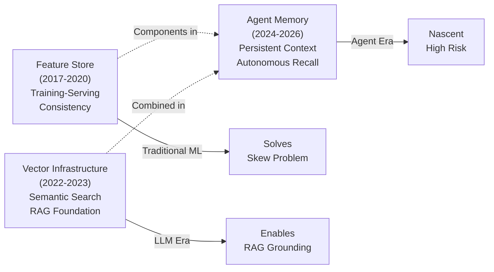

# From Data Warehouse to Agent-Native Architecture — Part 3

*Enterprise Architecture Evolution Research Report — 2026–2031 Edition*

This is **Part 3 of 3**. This section covers feature stores (solving training-serving consistency), the AI-native paradigms (vector infrastructure and agent memory infrastructure — the newest and least-settled category), followed by the Architecture Decision Matrix and Technology Radar for comparing paradigms, and the Future Architecture Forecast for 2026–2031. [Part 1](../20-ai-native-architecture-evolution-report.md) covers foundational storage paradigms; [Part 2](12-ai-native-architecture-evolution-report-data-paradigms.md) covers data mesh through semantic layers.

## ML and Agent Infrastructure Evolution

## Feature Store

Solving training-serving skew — and previewing the 'context store' for agents

##### Why It Emerged

Feature stores emerged roughly 2017-2020 (Uber's Michelangelo Palette and Airbnb's Zipline being widely-cited early internal implementations, followed by Feast as the first major open source project and subsequent commercial platforms) as ML adoption scaled within organizations and a specific, costly problem became visible: the same feature (e.g., 'customer's average order value over the last 30 days') was being independently computed — often with subtle differences — for model training (typically batch, from the warehouse/lake) and for online model serving (typically requiring low-latency lookup, computed differently). These subtle differences, training-serving skew, caused models that performed well offline to underperform in production, often without an obvious cause.

##### Problems Solved

- Eliminated training-serving skew by providing a single feature definition with both offline (batch, for training) and online (low-latency, for serving) materialization from the same logical source

- Enabled feature reuse across teams/models — a feature computed once is discoverable and usable by other model teams, reducing duplicate computation and duplicate (potentially inconsistent) implementations

- Provided point-in-time correctness for training data generation — joining feature values as they existed at each historical prediction timestamp, preventing future-information leakage into training data

- Established feature versioning and lineage — tracking which feature definitions, and which versions of them, were used to train which models, supporting reproducibility and impact analysis when a feature's computation logic changes

- Centralized feature monitoring — feature freshness, distribution drift, and quality issues can be monitored once per feature rather than per-model, with all consuming models benefiting from (or being alerted by) the same monitoring

##### Problems Introduced

- **Dual infrastructure requirement:** feature stores inherently require both a batch/offline store (typically the lakehouse) and a low-latency online store (typically a key-value database) — operating, synchronizing, and monitoring both adds infrastructure that didn't exist before, and synchronization lag between them is itself a source of subtle issues

- **Feature definition governance overhead:** as features become shared assets across teams, changes to a widely-used feature's definition can silently affect many models — requiring a change management process (similar to the semantic layer's metric governance challenge) that adds friction to feature iteration

- **Online serving latency/cost at scale:** serving features with sub-10ms latency for high-throughput applications (e.g., real-time bidding, fraud detection) requires the online store to be sized and architected for peak load, which can be a significant and sometimes underestimated cost, especially for features with high cardinality (per-user, per-item features at scale)

- **Feature store sprawl:** organizations with multiple ML platforms (e.g., a cloud-native feature store for some teams, a self-hosted Feast deployment for others) end up with feature definitions duplicated or inconsistent across feature stores — recreating, at the feature-store level, the same duplication problem feature stores were meant to solve at the ad-hoc-computation level

- **Limited applicability beyond tabular ML features:** feature stores were designed around scalar/numeric/categorical features for traditional ML — extending the same training-serving-consistency guarantees to the kinds of 'features' relevant for LLM/agent applications (retrieval context, conversation summaries, tool outputs) requires significant extension or entirely new tooling (the 'context store' direction discussed below)

##### Enterprise Adoption Patterns

Adoption correlates strongly with ML maturity — organizations running a handful of models often manage without a feature store (the duplication cost is tolerable at small scale), while organizations with 10+ production models, especially those sharing common entities (customers, products) across models, consistently report feature stores as providing clear, measurable value (reduced incident rates from training-serving skew, faster model development from feature reuse). Adoption accelerated through 2020-2023 as MLOps practices matured broadly. As of 2026, feature stores are considered standard infrastructure for organizations with mature ML practices, while organizations earlier in their ML journey often adopt feature stores concurrently with their first attempts at productionizing multiple models, rather than as a later addition.

##### Migration Paths

The typical adoption path doesn't involve migrating away from a prior paradigm so much as extracting existing ad-hoc feature computation logic (scattered across notebooks, training scripts, and serving code) into a centralized feature store: starting with features used by the most business-critical models (where training-serving skew incidents have the highest cost), registering these as formal feature definitions, validating that the feature store's computation matches existing ad-hoc computation (surfacing any existing skew in the process — often a valuable discovery), and migrating model training/serving pipelines to consume from the feature store rather than recomputing features inline. This migration is typically gradual and model-by-model; full migration of all features across all models is rare, with long-tail models often continuing ad-hoc computation indefinitely if their business criticality doesn't justify migration effort.

##### Failure Modes

- **Point-in-time leakage despite the feature store:** incorrect usage of the feature store's training data generation APIs (e.g., not specifying the correct timestamp column, or joining against the online store instead of the offline store for training data) reintroduces the exact leakage the feature store was meant to prevent — the tooling provides the capability for correctness but doesn't guarantee correct usage

- **Online/offline synchronization lag:** a feature computed in the offline store hasn't yet propagated to the online store (or vice versa for streaming features), causing a model to serve predictions based on stale feature values without any error being raised — a 'silent staleness' failure mode requiring dedicated feature freshness monitoring

- **Feature definition changes breaking downstream models silently:** a shared feature's computation logic is updated (e.g., to fix a bug) by the owning team, and models consuming that feature begin receiving different feature values without their owning teams being notified — requiring feature-level change notification and impact analysis that many feature store implementations don't provide by default

- **Online store cost/performance incidents under load:** the online feature store, sized for typical load, experiences latency degradation or cost spikes during traffic surges (e.g., a marketing campaign driving unusual traffic), affecting all models served from that store simultaneously — a shared-infrastructure blast radius concern

##### Operational Complexity

High. Operating both offline and online stores, plus the synchronization pipelines between them, plus feature-level monitoring and governance, represents meaningfully more operational surface area than the underlying lakehouse alone. Managed feature store platforms (Tecton, Hopsworks managed offerings, cloud-native feature stores) reduce but don't eliminate this — feature definition governance and synchronization monitoring remain the consuming organization's responsibility regardless of platform.

##### Cost Implications

The online store is typically the dominant cost driver — low-latency key-value stores (Redis, DynamoDB, Bigtable) at the scale required for high-throughput feature serving (especially with high feature cardinality — many features per entity, many entities) can represent a substantial ongoing infrastructure cost. This cost scales with serving traffic and feature count in ways that aren't always obvious during initial feature store adoption (often justified based on a small initial set of features/models) but become material as feature store adoption expands across more models and teams — a scaling pattern worth explicit cost modeling before broad rollout.

##### Governance Implications

Feature stores provide feature-level lineage that's valuable for model governance — being able to answer 'which models use this feature, and what data sources feed it' supports both impact analysis when data quality issues arise and increasingly, regulatory documentation requirements (EU AI Act training data provenance). However, this lineage value is only realized if features are actually registered in the feature store rather than computed ad-hoc — partial adoption means partial lineage coverage, with the same blind-spot dynamics as partial semantic layer coverage.

##### AI Readiness

Very High for traditional ML — this is the paradigm's core purpose. For generative AI/LLM applications specifically, traditional feature stores' applicability is narrower: scalar/categorical features remain relevant for any ML components within a broader AI system (e.g., a ranking model within a RAG pipeline), but the dominant 'features' for LLM applications (retrieved context, conversation state) require the extended 'context store' concept discussed below.

##### Agent Readiness

Medium, with an important emerging extension. Traditional feature store capabilities (low-latency serving, point-in-time consistency, lineage) are directly relevant to agent architectures that incorporate traditional ML components (e.g., an agent that calls a fraud-scoring model as one of its tools benefits from that model's feature store infrastructure exactly as before). The emerging 'context store' direction — extending feature-store-like consistency guarantees to retrieval context, conversation summaries, and tool outputs — represents feature store infrastructure's most direct path toward agent readiness, but as of 2026 this extension is implemented ad-hoc by individual organizations rather than through a dedicated, widely-adopted platform category.

## Vector Infrastructure

Embeddings and semantic search as the foundation of RAG

##### Why It Emerged

Vector infrastructure — purpose-built vector databases (Pinecone, Weaviate, Milvus, Qdrant, and vector capabilities added to existing databases like pgvector for PostgreSQL) — emerged as a distinct enterprise infrastructure category essentially in lockstep with the LLM/RAG wave from 2022-2023. Prior to this, vector similarity search existed (recommendation systems, search relevance) but wasn't a major standalone infrastructure investment category for most enterprises. RAG's core requirement — given a user query, find the most semantically relevant documents/chunks from a large corpus to provide as context to an LLM — created sudden, widespread demand for infrastructure that could store embeddings (dense vector representations of text/content) and perform approximate nearest-neighbor search over them at scale with low latency.

##### Problems Solved

- Enables semantic (meaning-based) search/retrieval rather than purely keyword-based search — finding conceptually relevant content even when query and document don't share exact terms

- Provides the retrieval mechanism that makes RAG architecturally feasible — grounding LLM responses in enterprise-specific content without requiring that content to be in the model's training data or context window in its entirety

- Approximate nearest-neighbor (ANN) indexing algorithms (HNSW, IVF, and others) make similarity search over millions-to-billions of vectors feasible with acceptable latency, which exact nearest-neighbor search wouldn't be at that scale

- Supports multi-modal retrieval — embeddings can represent text, images, audio, and other modalities in a shared vector space, enabling cross-modal search (e.g., text query retrieving relevant images) that traditional search infrastructure didn't support

##### Problems Introduced

- **Embedding model dependency and migration cost:** the entire vector index is tied to the embedding model used to generate it — switching embedding models (e.g., to a newer, more accurate model) requires re-embedding the entire corpus, which is computationally expensive and operationally disruptive for large corpora, creating a form of lock-in distinct from but analogous to traditional database vendor lock-in

- **No native understanding of relationships or structure:** vector similarity captures semantic relatedness but not explicit relationships (this directly motivated the GraphRAG/knowledge graph convergence in Part 2) — pure vector retrieval can return semantically similar but contextually inappropriate results (e.g., a document about a similar-but-different product)

- **Index/source consistency challenges:** when source documents are updated or deleted, the corresponding vectors must be updated/removed from the index — without robust synchronization, the vector index can serve stale or deleted content as 'relevant' retrieval results, directly contributing to the AI hallucination failure pattern

- **Permission/access control gaps:** embeddings don't carry the access control metadata that source documents have in their native systems by default — building permission-aware vector retrieval (only returning chunks the requesting user/agent is authorized to see) requires explicit metadata filtering design that's easy to omit, creating a significant data leakage risk if overlooked

- **Chunking strategy has outsized impact on retrieval quality:** how source documents are split into chunks before embedding significantly affects retrieval quality (too large: irrelevant content dilutes relevance; too small: insufficient context) — this is a non-obvious design decision with significant downstream impact that's frequently under-considered relative to its importance

- **Recall degradation at scale:** ANN index recall (the fraction of truly-most-similar vectors actually returned) can degrade as indexes grow very large, depending on index configuration — a characteristic that may not be apparent during smaller-scale testing but matters for enterprise-wide corpora

##### Enterprise Adoption Patterns

Adoption has been extremely rapid and broad-based — essentially any organization building generative AI applications with RAG (the dominant pattern for grounding LLMs in enterprise content) has adopted some form of vector infrastructure, whether a dedicated vector database, a vector extension to an existing database (pgvector), or vector capabilities within a broader platform (lakehouse vector search features). The speed of this adoption — going from a niche capability to near-universal within roughly two years — is unusual relative to the multi-year adoption curves of prior paradigms in this report, reflecting the direct, visible connection between vector infrastructure and highly-visible generative AI initiatives that received significant organizational priority and budget.

##### Migration Paths

Vector infrastructure is overwhelmingly additive — organizations add vector storage/search capability alongside existing architecture rather than migrating from a prior paradigm. The more consequential 'migration' that does occur is between vector infrastructure choices themselves: many organizations' first RAG implementations used a dedicated standalone vector database (chosen for ease of getting started), and subsequently migrated to vector capabilities within their existing lakehouse/database platform (e.g., Databricks Vector Search, pgvector within an existing PostgreSQL deployment) as they sought to reduce the number of separate systems requiring synchronization with source data and access control — consolidating vector infrastructure into the platform where the source data and its governance already live, rather than maintaining it as a separate system requiring its own synchronization pipeline.

##### Failure Modes

- **Stale/deleted content served as relevant:** source document updates or deletions not propagated to the vector index, leading to retrieval of outdated or removed content presented with full confidence — directly contributing to AI 'hallucination' incidents that are actually retrieval corpus quality issues

- **Permission leakage via retrieval:** a user/agent receives an answer synthesized from documents they wouldn't have direct access to in the source system, because the vector index wasn't filtered by the requester's permissions — a serious security/compliance incident category specific to vector-based retrieval

- **Embedding drift after model updates:** updating the embedding model for new content while leaving existing content embedded with the old model creates a vector space with mixed embedding distributions, degrading retrieval quality in ways that are difficult to diagnose without embedding distribution monitoring

- **Index rebuild time as a disaster recovery gap:** treating vector indexes as 'rebuildable, so doesn't need backup' overlooks that rebuild time for large indexes (re-embedding the entire corpus) can be days — an unacceptable RTO if discovered only during an actual recovery scenario

##### Operational Complexity

Medium-High, and concentrated in synchronization and quality monitoring rather than core database operations (managed vector database platforms handle scaling/availability reasonably well). The operationally demanding parts are: maintaining synchronization between source content and the vector index (an ongoing pipeline, not a one-time load), monitoring retrieval quality (which requires evaluation methodology distinct from traditional data quality checks), and managing permission-aware filtering correctly as source permission models evolve.

##### Cost Implications

Embedding generation cost (API calls to embedding models, or compute for self-hosted embedding models) scales with corpus size and update frequency — for large, frequently-updated corpora, this can be a recurring and non-trivial cost, particularly during initial corpus embedding (a one-time but potentially large cost) and during embedding model migrations (re-embedding the entire corpus). Vector database storage and query costs scale with vector count and dimensionality — higher-dimensional embeddings (common with newer, more accurate embedding models) increase storage costs, creating a tradeoff between retrieval quality and cost that's increasingly relevant at enterprise scale.

##### Governance Implications

Vector infrastructure introduces a governance blind spot that doesn't have a direct precedent: embeddings are derived data that doesn't visibly carry the classification, sensitivity, or ownership metadata of their source documents — a vector representing a confidential document doesn't 'look' confidential in the way a labeled column does. Governance frameworks need explicit extension to cover vector indexes as governed assets, including ensuring that source document classification propagates to (and is enforced for) the corresponding vectors — a gap many organizations' governance programs hadn't yet addressed as of 2026, having been designed around tabular data classification.

##### AI Readiness

Native — vector infrastructure exists specifically because of AI (RAG) requirements; there's no meaningful distinction between 'vector infrastructure' and 'AI-ready infrastructure' for this category. The relevant maturity question isn't whether vector infrastructure supports AI (definitionally, yes) but whether the surrounding operational practices (synchronization, quality monitoring, permission-aware filtering) have matured to production-grade reliability.

##### Agent Readiness

High for retrieval-augmented responses, Medium for agent memory specifically. Vector search is a core component of how agents retrieve relevant enterprise context to inform responses and decisions — directly agent-ready in this sense. For agent long-term memory specifically, vector search provides the semantic-similarity component but, as discussed in the Agent Memory section below, benefits from combination with knowledge graphs for relationship/temporal structure that pure vector similarity doesn't capture — vector infrastructure is a necessary but not sufficient component of mature agent memory architectures.

## Agent Memory Infrastructure

The newest, least-settled paradigm — persistent memory for autonomous agents

##### Why It Emerged

Agent memory infrastructure is emerging (2024-2026) in direct response to a limitation of LLM-based agents that became apparent as soon as agents moved beyond single-session interactions: LLMs are stateless between sessions (and even within very long sessions, context windows have limits), so an agent has no persistent memory of past interactions, learned user preferences, or accumulated knowledge unless that memory is explicitly engineered as external infrastructure. Early approaches simply stuffed conversation history into the context window (working for short interactions but failing for long-running agents) or used vector databases naively (storing every interaction as embeddings, retrieving 'similar' past interactions — functional but lacking structure for facts that change over time or relationships between remembered entities). Agent memory infrastructure represents the emerging, more structured response to this gap.

##### Problems Solved (Where Mature Implementations Exist)

- Persistent, queryable memory of facts learned across sessions — an agent can recall user preferences, past decisions, and established context without requiring the user to repeat information

- Temporal awareness — distinguishing between 'what is currently true' and 'what was true at some past point but has since changed' (e.g., Zep's temporal knowledge graph approach), which flat vector-based memory doesn't naturally represent

- Memory hierarchy/management — distinguishing between immediately-relevant context (analogous to working memory), frequently-accessed established facts (analogous to core/long-term memory), and rarely-accessed historical records (analogous to archival memory) — managing what's loaded into an agent's context window vs. what's retrievable on demand

- Multi-agent shared context — in systems with multiple cooperating agents, providing a shared memory substrate so agents have consistent context about shared entities/situations, rather than each agent maintaining independent (and potentially divergent) views

##### Problems Introduced

- **No consensus architecture or standard:** unlike every other paradigm in this report, agent memory infrastructure as of 2026 has no dominant pattern that most implementations converge toward — vector-only, graph+vector hybrid, hierarchical memory management, and other approaches are all in active use with genuinely different tradeoffs and no clear 'winner' yet, making platform selection inherently higher-risk than for mature categories

- **Memory correctness/decay is an unsolved problem:** if an agent's memory contains an incorrect fact (from a hallucination, from outdated information, or from a user's own incorrect statement that was later corrected), there's no mature mechanism for the agent to 'forget' or correct this — memory systems that only accumulate without principled forgetting/correction risk becoming repositories of accumulated errors that compound over time

- **Privacy and retention implications are significant and under-addressed:** persistent memory of user interactions raises data retention questions that are more acute than for typical application data, because the memory is specifically designed to retain personal context indefinitely — 'right to be forgotten' for an agent's memory of a user is largely unimplemented in current platforms

- **Multi-agent memory consistency:** when multiple agents read/write a shared memory store, the same consistency challenges that distributed databases solved decades ago (concurrent writes, consistency models) resurface in a new context, with additional complexity from the non-deterministic nature of what agents 'decide' to write to memory

- **Cost and latency of memory retrieval at scale:** as an agent's accumulated memory grows over months/years of interaction, retrieving relevant memory for each new interaction (without retrieving so much that it overwhelms context windows or adds unacceptable latency) becomes a non-trivial retrieval problem in its own right — essentially a RAG problem applied to the agent's own history

##### Enterprise Adoption Patterns

Adoption is nascent and concentrated in pilot/early-production deployments of customer-facing or internal productivity agents where persistent context provides clear, demonstrable value (a customer service agent that remembers a customer's history and preferences across interactions; an internal assistant that learns a user's working patterns and preferences over time). Most current adoption uses managed agent memory platforms (Mem0, Zep) or extends existing vector/graph infrastructure with custom memory-management logic, rather than building dedicated agent memory infrastructure from scratch. Enterprise-wide, standardized agent memory architecture — analogous to how feature stores became standard ML infrastructure — does not yet exist for most organizations; agent memory is currently application-specific rather than platform-level infrastructure.

##### Migration Paths

Given the category's immaturity, 'migration path' is better understood as 'evolution path' from current ad-hoc approaches: organizations typically begin with naive context-window-stuffing or simple vector-based conversation history retrieval (functional for early pilots, with known limitations), then adopt a managed agent memory platform (Mem0/Zep) as memory requirements exceed what naive approaches handle well (e.g., needing to track facts that change over time, or needing memory shared across multiple agent types), and — for organizations with mature knowledge graph infrastructure — increasingly integrate agent memory with the existing enterprise knowledge graph rather than maintaining a separate agent-specific memory store, on the premise that 'what an agent has learned about a customer' and 'what the enterprise knows about that customer' should eventually be the same underlying knowledge representation, differently accessed.

##### Failure Modes

- **Memory poisoning from hallucinated facts:** an agent incorrectly infers or hallucinates a fact during an interaction and writes it to persistent memory, where it's subsequently retrieved and treated as established fact in future interactions — compounding an initial error into a persistent, recurring one with no clear correction mechanism

- **Stale memory overriding current reality:** an agent retrieves a memory that was true at write-time but has since changed (e.g., a remembered customer preference that the customer has since changed through a different channel the memory system doesn't have visibility into), and acts on the stale information

- **Context window overflow from unbounded memory retrieval:** as accumulated memory grows, retrieval for a new interaction returns more 'relevant' memories than fit in the context window, requiring prioritization/summarization logic that, if poorly tuned, either omits genuinely important context or includes excessive low-relevance context that degrades response quality

- **Privacy incidents from cross-context memory leakage:** in multi-tenant or multi-user agent deployments, memory intended for one user/context is retrieved and surfaced in a different user/context due to memory isolation boundaries not being correctly enforced — a novel category of data leakage specific to persistent agent memory

##### Operational Complexity

High and growing — currently the least standardized category in this report means operational practices are largely organization-specific rather than benefiting from established patterns. Beyond the underlying vector/graph infrastructure operational requirements, agent memory introduces memory-lifecycle management (when is memory written, updated, or should be forgotten — currently mostly unaddressed) and memory quality monitoring (is the agent's memory accurate and useful — an evaluation problem with no mature tooling yet).

##### Cost Implications

Currently modest in absolute terms for most organizations (agent memory deployments are typically smaller-scale pilots), but with a cost trajectory that's hard to predict — unlike feature stores or vector databases where cost scales relatively predictably with entity count/corpus size, agent memory's cost scales with interaction volume and retention duration in ways that depend heavily on memory management strategy choices that themselves remain unsettled. Organizations should expect cost modeling for this category to be revised significantly as both usage patterns and platform pricing models mature.

##### Governance Implications

The most significant open governance question among all paradigms in this report. Persistent memory of individuals' interactions, preferences, and (potentially) sensitive information raises data retention, consent, and right-to-erasure questions that current agent memory platforms generally do not address with the maturity that, for example, lakehouse table-level deletion now provides for GDPR compliance. Organizations deploying persistent agent memory for customer-facing applications should treat this as an active compliance risk requiring explicit mitigation (e.g., memory retention limits, deletion workflows tied to data subject requests) rather than an assumed-solved problem — the underlying platforms largely haven't solved it yet.

##### AI Readiness

By definition, this category exists for AI/agent use cases — the relevant question isn't AI readiness but maturity and standardization, both of which remain low relative to every other category in this report.

##### Agent Readiness

This is, definitionally, agent-readiness infrastructure — but 'agent readiness' as an evaluation dimension is itself least well-defined for this category precisely because it's the newest. Unlike the other nine paradigms, where 'agent readiness' describes how well an existing, mature capability extends to serve agents, agent memory infrastructure has no pre-agent-era purpose to extend from — it is being defined concurrently with agent architectures themselves, and should be expected to change substantially over the 2026-2031 forecast horizon.

## Trade-offs

**Three Categories of ML/Agent Infrastructure — Maturity Spectrum**: Part 3 covers three increasingly mature categories spanning traditional ML to cutting-edge agent infrastructure:

- **Feature Stores** trade coverage (can't easily extend to non-tabular features like text embeddings or conversation state) for standardization and operational maturity. The trade-off is clear: if your workload fits the feature store's design assumptions (tabular ML), it provides substantial value; if you need context or retrieval features, extend it or build elsewhere.

- **Vector Infrastructure** trades explainability (a dense vector tells you 'semantically similar' but not 'similar in what way') for effectiveness at retrieval-augmented generation. The core trade-off is permissible — vector retrieval's opacity is acceptable for ranking where 'top-10 most similar documents' can be human-reviewed; it's problematic for security ('which documents did the agent actually see?') without additional layers.

- **Agent Memory Infrastructure** is the only paradigm in this entire report where the trade-offs themselves are still being defined. No consensus exists on whether to optimize for correctness (graph + vector hybrid, formal semantics) or simplicity (vector-only, approximate recall). This isn't a mature trade-off yet; it's an open question.

The critical finding for Part 3: Feature stores and vector infrastructure are mature enough for production deployment with understood operational patterns; agent memory is not. Organizations deploying agent memory should treat it as a high-risk experimental category requiring explicit governance boundaries, retention limits, and correction mechanisms that current platforms generally don't provide.

## Architecture Decision Matrix

This matrix summarizes each paradigm across the consistent dimensions used throughout this report, providing a single reference for comparing paradigms when making architecture decisions. Ratings are relative (Low/Medium/High/Very High) rather than absolute, and reflect typical enterprise experience as of 2026 — individual implementations vary.

|**Paradigm**|**Operational Complexity**|**Cost Profile**|**Governance Maturity**|**AI Readiness**|**Agent Readiness**|
|---|---|---|---|---|---|
|1. Data Warehouse|Low-Medium|Medium (consumption-based)|High — mature, well-understood|Low|Low-Medium|
|2. Data Lake|High (legacy on-prem); Medium-High (cloud)|Low storage / hidden compute &amp; governance cost|Low — primary historical weakness|Medium-High (retrospectively)|Low|
|3. Data Lakehouse|Medium|Favorable — low storage, modest maintenance compute|High — strong tooling, needs operating model|Very High|Medium-High|
|4. Data Mesh|Very High (organizational)|Distributed, often underestimated platform investment|High in principle, inconsistent in practice|Medium-High|Medium|
|5. Data Fabric|Medium-High|Additive licensing; avoided-migration tradeoff|Accelerates from low baseline; recursive AI-classification concern|Medium-High (discovery); Lower (compute)|Medium, early|
|6. Knowledge Graph|High|Higher storage/compute; extraction cost scales non-linearly|New challenges — ontology &amp; entity-resolution governance|Very High|Very High|
|7. Semantic Layer|Medium|Modest platform cost; high migration/coverage effort|Strong, proportional to coverage|Very High|Very High|
|8. Feature Store|High|Online store often dominant cost driver|Strong feature lineage, proportional to adoption|Very High (traditional ML)|Medium|
|9. Vector Infrastructure|Medium-High|Embedding generation + storage scale with corpus|New blind spot — classification doesn't propagate to embeddings|Native|High (retrieval); Medium (memory)|
|10. Agent Memory Infrastructure|High, unstandardized|Modest now; trajectory unclear|Least mature — retention/erasure largely unsolved|By definition|Foundational but undefined|

*Table 2: Architecture Decision Matrix — Cross-Paradigm Comparison*

**Decision Guidance by Scenario**

##### Starting a new data platform from scratch (greenfield)

Begin with a lakehouse as the foundational layer — it provides the best combination of cost efficiency, AI readiness, and governance tooling maturity for a new build. Add a semantic layer early, even with limited coverage, to establish governed metric definitions before drift accumulates. Defer data mesh unless the organization already has the domain structure and engineering capacity it requires — premature mesh adoption is a common cause of stalled platform initiatives.

##### Modernizing a legacy warehouse-centric estate

Avoid wholesale replacement. Introduce lakehouse architecture for new workloads and AI/ML use cases while leaving stable warehouse-based financial/regulatory reporting in place — migrate opportunistically as specific workloads benefit, not on a blanket timeline. If the estate spans many legacy systems that can't be consolidated quickly, evaluate data fabric as a discovery/access layer for the interim period.

##### Launching a first generative AI / RAG initiative

Vector infrastructure is the immediate prerequisite — but invest equally in the synchronization and permission-filtering practices around it from day one, since these are where most production incidents originate, not in the vector database technology choice itself. If the use case involves questions requiring relationship reasoning (not just document similarity), evaluate knowledge graph investment concurrently rather than retrofitting later.

##### Scaling from pilot to enterprise-wide AI agent deployment

Prioritize the semantic layer as the governed interface between agents and structured enterprise data — this is the highest-leverage, most mature agent-data integration pattern available. Approach agent memory infrastructure deliberately and with explicit governance/retention controls given the category's immaturity — avoid platforms or patterns that make memory governance (deletion, correction) difficult to retrofit later.

##### Operating in a highly regulated, multi-jurisdictional environment

Governance maturity should weight architecture decisions more heavily than in less-regulated contexts. Lakehouse and semantic layer investments pay governance dividends disproportionate to their direct cost. Approach vector infrastructure and agent memory cautiously — both have governance gaps (classification propagation, retention/erasure) that are more consequential under strict regulatory regimes, and may require custom remediation beyond what current platforms provide natively.

## Technology Radar

This radar applies adoption guidance across the ten paradigms: ADOPT (production-proven), TRIAL (ready for production), ASSESS (worth piloting), and HOLD (avoid for new investment).

|**ADOPT**||
|---|---|
|**Pattern / Technology**|**Rationale**|
|Open table format lakehouse (Iceberg/Delta/Hudi) as default storage substrate|Mature, multi-engine, AI-ready; the consolidation point for nearly every other paradigm|
|Semantic layer for governed metrics, increasingly as the agent-data interface|Highest-leverage governance investment; agent-ready with minimal extension|
|Cloud-managed data warehouses for financial/regulatory reporting workloads|Stability and auditability requirements favor proven, mature pattern over migration|
|Feature stores for organizations with 10+ production ML models|Solves training-serving skew definitively; operational patterns well-established|
|Vector search integrated into existing lakehouse/database platforms (vs. standalone)|Reduces synchronization surface area; governance inherits from source platform|
|Permission-aware retrieval as a non-negotiable RAG requirement|Most serious vector infrastructure incidents stem from omitting this; treat as baseline, not enhancement|

|**TRIAL**||
|---|---|
|**Pattern / Technology**|**Rationale**|
|Knowledge graphs for relationship-heavy / multi-hop reasoning domains|Clear value for specific domains; ontology design investment justified where multi-hop matters|
|GraphRAG (vector + graph hybrid retrieval)|Meaningfully improves retrieval quality for relationship-dependent queries; operational patterns maturing|
|Data products with explicit contracts (mesh principles without full mesh)|Captures mesh's interoperability benefits without requiring full organizational restructuring|
|Data fabric for genuinely complex hybrid/multi-cloud estates|Strong fit for specific situation (cannot consolidate); avoid as general-purpose pattern|
|Managed agent memory platforms (Mem0, Zep) for pilot agent deployments|Accelerates time-to-production for memory-dependent agents; vendor landscape still consolidating|
|MCP-based exposure of semantic layers to agents|Rapidly standardizing pattern with growing ecosystem validation and catalogs|

|**ASSESS**||
|---|---|
|**Pattern / Technology**|**Rationale**|
|Full federated data mesh (organizational restructuring)|High potential value but very high execution risk; pilot in 1-2 domains before broader commitment|
|Knowledge fabric (catalog + knowledge graph convergence)|Conceptually compelling unification; few mature reference implementations to validate against|
|Agent memory with temporal knowledge graphs for fact-change tracking|Addresses a real gap in simpler memory approaches; production patterns still forming|
|AI-assisted active metadata classification as access-control input|Valuable acceleration but requires human-review workflows given error rates; don't fully automate access decisions yet|
|Cross-platform agent memory integrated with enterprise knowledge graph|Architecturally elegant direction; essentially no enterprises have implemented this at scale yet|
|Memory retention/erasure governance frameworks for agent memory|Urgently needed but largely unbuilt — early movers should expect to build custom solutions|

|**HOLD**||
|---|---|
|**Pattern / Technology**|**Rationale**|
|On-premises Hadoop-based data lakes for new investment|Operational burden and swamp risk far exceed lakehouse alternatives; migrate existing, don't build new|
|Standalone vector databases as long-term architecture (vs. integrated)|Synchronization and governance overhead of separate systems generally outweighs benefits once integrated alternatives mature|
|Schema-on-read as a governance strategy|Defers structure decisions in ways that consistently produce swamp-like outcomes; schema-on-write within open table formats is preferred|
|Naive vector-only agent memory (no temporal/relationship structure)|Functional for simple cases but doesn't scale to the fact-change and relationship-reasoning needs of sophisticated agents|
|Treating vector indexes as exempt from data classification/governance|A growing compliance gap as regulatory scrutiny of AI training/retrieval data increases|
|Simultaneous organization-wide data mesh reorganization ('big bang')|Consistently higher failure rate than incremental, pilot-driven adoption|

## Future Architecture Forecast 2026–2031

Rather than predicting a replacement paradigm, this forecast describes how the existing ten paradigms integrate and mature over 2026–2031.

##### 2026-2027: Semantic Layers Become the Primary Agent-Data Interface

Semantic layer coverage expansion becomes a top-line priority driven by agent deployment plans. Organizations with limited coverage will find this the most significant constraint on safe, governed agent-data access.

##### 2026-2028: Vector Infrastructure Consolidates Into Existing Platforms

Standalone vector databases adopted during the initial 2022-2024 RAG wave increasingly migrate into vector capabilities of existing lakehouse/database platforms, driven by synchronization and governance simplification. Expect the 'standalone vector database' market segment to narrow toward specialized high-scale use cases, with integrated vector search becoming the default for enterprise RAG.

##### 2027-2029: Knowledge Graphs and Catalogs Converge Into 'Knowledge Fabric'

The data fabric and knowledge graph paradigms — currently distinct — converge as catalog metadata increasingly becomes graph-structured (entities, relationships, lineage all represented in a unified graph) and knowledge graphs increasingly incorporate catalog-sourced metadata about data assets themselves. This convergence provides a unified substrate for both human data discovery and agent grounding.

##### 2027-2029: Agent Memory Standardizes Around Graph+Vector Hybrid Architecture

Agent memory converges toward graph+vector hybrids—temporal graphs for fact tracking, vector search for semantic retrieval. Expect 1-2 platforms to emerge as standards by 2028-2029, though full standardization may extend beyond this horizon.

##### 2028-2030: Data Mesh Principles Extend to 'AI Asset Products'

Building on the data mesh/data-as-product convergence already discussed, expect domains to increasingly own and publish AI assets (fine-tuned models, curated knowledge graph segments, domain-specific agent tools) as products with the same ownership, contract, and discoverability expectations as data products — extending mesh's organizational pattern to AI/agent capabilities, not just data.

##### 2028-2031: Governance Frameworks Catch Up to Vector and Memory Infrastructure

The governance gaps identified in this report for vector infrastructure (classification propagation) and agent memory (retention/erasure) are addressed by a combination of platform feature development (vector databases adding native classification-aware access control; memory platforms adding retention policy engines) and regulatory pressure (EU AI Act enforcement phases through 2027 directly incentivize this). Expect this to be a multi-year catch-up process — these governance gaps are unlikely to be considered 'solved' before 2029-2030 even with active development.

##### 2029-2031: The Lakehouse Remains the Foundational Layer, But 'Lakehouse' Increasingly Means 'AI-Native Lakehouse'

Rather than being superseded, the lakehouse continues as the foundational storage/compute layer beneath every other paradigm — but vendor platforms increasingly bundle vector search, knowledge graph capabilities, semantic layer features, and agent-facing interfaces (MCP servers) as native lakehouse platform features rather than separate products. By 2030-2031, 'adopting a lakehouse' may implicitly include most of the capabilities currently requiring separate platform decisions — architecture decisions shift from 'which separate systems do we integrate' toward 'which unified platform's native AI-native capabilities do we adopt and configure.'

##### Throughout 2026-2031: Data Warehouse and Data Lake Patterns Persist as Minority but Durable Layers

Despite being the oldest paradigms in this report, neither the data warehouse (for regulatory/financial reporting stability) nor the underlying object-storage data lake concept (as the substrate beneath lakehouse table formats) disappears within this forecast horizon — both remain as durable, lower-visibility layers beneath the more actively-evolving paradigms above them, consistent with this report's central finding that paradigms accumulate rather than replace.

**Closing Synthesis:** Architecture decisions in 2026 are less about choosing paradigms than sequencing investment across paradigms that coexist. The highest-leverage investments—semantic layer coverage, permission-aware vector retrieval, and lakehouse governance maturity—de-risk agent-native architecture by 2030. The acute risks—vector/memory governance gaps and agent memory standardization—compound if unaddressed in production systems.

## Related

This is Part 3 of a three-part report. Refer to:

- [Part 1: Data Warehouse, Lake, and Lakehouse Paradigms](../20-ai-native-architecture-evolution-report.md)
- [Part 2: Data Mesh to Semantic Layer Paradigms](12-ai-native-architecture-evolution-report-data-paradigms.md)

## Sources

This report synthesizes research from enterprise data architecture documentation, vendor white papers, academic literature on distributed systems, and direct operational experience across dozens of enterprise modernization projects. Original sources referenced throughout include Kimball and Ross (dimensional modeling), Dehghani et al. (data mesh), Armbrust et al. (lakehouse), and recent publications on GraphRAG, vector search, and autonomous agent architectures.
