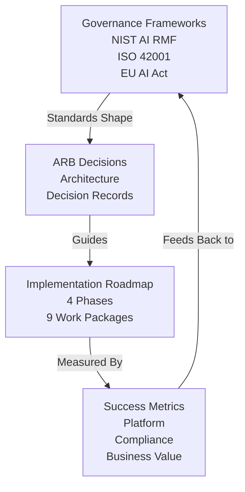

# Agentic AI Landing Zone Architecture — Implementation & Governance

*Enterprise Architecture Blueprint for Governed, Secure, Scalable Agentic AI Workloads — Part 2 of 2*

This is **Part 2 of 2**, covering standards alignment (NIST AI RMF, ISO 42001, EU AI Act), implementation roadmap, governance structures, and architecture decision records. [Part 1](../22-agentic-ai-landing-zone-architecture.md) covers the conceptual architecture, layered platform components, and technology stack.

## Why This Matters

Deployment of a landing zone is not a one-time event but a continuous governance process. Part 2 provides the operational and decision-making frameworks that turn the architecture from blueprint to running system. This includes standards-based compliance mappings, a phased implementation roadmap calibrated to real enterprise constraints, formalized governance structures (Architecture Review Board, AI Governance Board), architecture decision records that will shape every platform decision, and success metrics that indicate whether the landing zone is delivering the promised value. Without these governance and operational elements, the architecture remains aspirational; with them, it becomes a functioning system.

## Governance & Implementation Framework

## Standards Alignment

### NIST AI Risk Management Framework (AI RMF)

**Framework Structure**: Four core functions

| Function | Description | Implementation in Landing Zone |
| ---------- | ------------- | -------------------------------- |
| **GOVERN** | Establish policies, accountability, and oversight | • AI Governance Board • Policy Cards • RACI matrices • Risk appetite statements |
| **MAP** | Identify and frame AI risks across lifecycle | • Risk taxonomy • Threat modeling • Impact assessments • Stakeholder analysis |
| **MEASURE** | Analyze and monitor AI risks | • Risk scoring engine • Behavioral analytics • Performance metrics • Audit dashboards |
| **MANAGE** | Mitigate identified risks | • Runtime guardrails • Escalation workflows • Incident response • Continuous improvement |

### ISO/IEC 42001 AI Management System

**Standard Structure**: 10 clauses + 4 annexes (38 controls)

| Clause | Title | Key Requirements |
| -------- | ------- | ------------------ |
| **4** | Context of the organization | Understand stakeholders, define AIMS scope |
| **5** | Leadership | Top management commitment, AI policy, roles |
| **6** | Planning | Address risks/opportunities, set objectives |
| **7** | Support | Resources, competence, awareness, communication |
| **8** | Operation | AI lifecycle management, risk assessment/treatment |
| **9** | Performance evaluation | Monitor, measure, analyze, audit, review |
| **10** | Improvement | Nonconformity, corrective action, continual improvement |

**Annex A Controls** (examples relevant to landing zone):
- **A.2**: AI policy and objectives
- **A.4**: Resource allocation and competence
- **A.5**: Data governance and quality
- **A.6**: AI system lifecycle management
- **A.7**: Risk assessment and treatment
- **A.8**: AI system impact assessment
- **A.9**: Monitoring, measurement, and analysis

### NIST AI RMF ↔ ISO 42001 Crosswalk

Our landing zone implements both frameworks in an integrated manner:

| NIST AI RMF | ISO/IEC 42001 | Landing Zone Implementation |
| ------------- | --------------- | ---------------------------- |
| GOVERN 1.1: Policies and procedures | Clause 5.2: AI policy | Policy Cards, governance documentation |
| GOVERN 1.2: Roles and responsibilities | Clause 5.3: Organizational roles | RACI matrix, team structures |
| MAP 1.1: Context establishment | Clause 4.1: Understanding the organization | Stakeholder analysis, risk taxonomy |
| MAP 1.2: Categorization of AI systems | A.6: AI system lifecycle | Agent registry, autonomy classification |
| MEASURE 1.1: Testing and evaluation | A.9: Monitoring and measurement | Continuous evaluation, quality metrics |
| MEASURE 2.1: Monitoring and tracking | Clause 9.1: Monitoring | Observability stack, dashboards |
| MANAGE 1.1: Risk response | A.7: Risk treatment | Runtime guardrails, escalation |
| MANAGE 2.1: Incident response | A.10: Nonconformity management | Incident workflows, post-mortems |

### Model Context Protocol (MCP) Integration

**MCP Adoption Benefits**:
- **Interoperability**: Agents can use any MCP-compliant tool
- **Scalability**: Add new data sources without custom code
- **Security**: Centralized authentication and authorization
- **Observability**: Standardized telemetry for all tool interactions

**Security Controls**:
- OAuth 2.0 / OIDC for authentication
- Scoped access tokens
- Rate limiting per client
- Audit logging of all MCP requests
- Content filtering on responses

### EU AI Act Readiness

**Risk Classification**:

| Risk Level | Agent Types | Requirements |
| ------------ | ------------- | -------------- |
| **Unacceptable** | Social scoring, manipulation | **Prohibited** |
| **High-Risk** | Critical infrastructure, employment, law enforcement | Conformity assessment, risk management, human oversight, documentation |
| **Limited-Risk** | Chatbots, content generation | Transparency obligations (disclose AI use) |
| **Minimal-Risk** | Spam filters, recommendations | No specific obligations |

> **Timeline note (July 2026):** The Digital Omnibus on AI (Council final approval June 29, 2026) deferred Annex III high-risk obligations to December 2, 2027 and Annex I embedded systems to August 2, 2028; Article 50 transparency obligations still apply from August 2, 2026.

**Landing Zone Capabilities for High-Risk AI**:
- Risk management system (integrated with NIST AI RMF)
- Data governance protocols (ISO 42001 Annex A.5)
- Technical documentation (architecture docs, ADRs)
- Record-keeping (audit logs, provenance tracking)
- Transparency and information (Policy Cards, user notifications)
- Human oversight (escalation workflows, approval gates)
- Robustness and accuracy (continuous evaluation, monitoring)

## Work Packages & Implementation Roadmap

### Work Packages

| WP# | Work Package | Description | Duration | Dependencies |
| ----- | -------------- | ------------- | ---------- | -------------- |
| **WP-1** | Identity Federation Design | Design and implement agent identity model with cross-cloud federation | 8 weeks | None |
| **WP-2** | Policy Framework Implementation | Develop Policy Card schema, enforcement engine, and governance tooling | 10 weeks | WP-1 |
| **WP-3** | Agent Runtime Platform | Deploy orchestration engines, model gateways, and compute infrastructure | 12 weeks | WP-1 |
| **WP-4** | Observability Stack Rollout | Implement semantic telemetry, dashboards, and alerting | 8 weeks | WP-3 |
| **WP-5** | Model Governance Framework | Establish model registry, evaluation pipelines, and approval workflows | 10 weeks | WP-3 |
| **WP-6** | Data Access Control Integration | Integrate with existing data platforms, implement ABAC, enable vector search | 12 weeks | WP-1, WP-3 |
| **WP-7** | MCP Server Deployment | Deploy MCP servers for key enterprise systems and external services | 6 weeks | WP-3 |
| **WP-8** | Developer Experience | Create templates, documentation, training, and self-service portal | 8 weeks | WP-2, WP-3, WP-4 |
| **WP-9** | Compliance Certification | Prepare for and achieve ISO 42001 certification | 16 weeks | All WPs |

### Transition Architecture Roadmap

#### Phase 0: Foundation (Weeks 1-4)

**Objective**: Establish governance and design foundations

**Deliverables**:
- AI governance framework document
- Risk appetite statement
- Agent autonomy classification model
- Initial architecture design
- Stakeholder alignment

**Success Criteria**:
- Governance board established
- Architecture principles approved
- Funding secured

#### Phase 1: Platform Enablement (Weeks 5-20)

**Objective**: Deploy core platform capabilities in pilot environment

**Deliverables**:
- Single-cloud landing zone (Azure or AWS)
- Basic agent runtime (serverless + containers)
- Model gateway with 2-3 providers
- Simple policy enforcement
- Foundational observability

**Success Criteria**:
- 1-2 pilot agents deployed
- Policy enforcement validated
- Developer documentation complete
- &lt;5 second policy evaluation latency

#### Phase 2: Governance Embed (Weeks 21-32)

**Objective**: Enhance governance, expand platform, prepare for multi-cloud

**Deliverables**:
- Policy Card full implementation
- Risk scoring engine
- Advanced observability (semantic telemetry)
- MCP server ecosystem
- Second cloud provider integration

**Success Criteria**:
- 5+ production agents
- 100% policy compliance
- Real-time risk scoring operational
- ISO 42001 gap assessment complete

#### Phase 3: Enterprise Rollout (Weeks 33-48)

**Objective**: Scale to enterprise-wide adoption

**Deliverables**:
- Multi-cloud orchestration
- Self-service developer portal
- Full observability suite
- Automated compliance reporting
- Advanced agent capabilities (multi-agent workflows)

**Success Criteria**:
- 20+ production agents
- 100+ developers onboarded
- 99.9% platform uptime
- &lt;1 week onboarding time for new agents

#### Phase 4: Optimization (Weeks 49-52+)

**Objective**: Continuous improvement and advanced features

**Deliverables**:
- ISO 42001 certification
- Cost optimization initiatives
- Advanced autonomy capabilities
- Edge deployment support
- Continuous innovation pipeline

**Success Criteria**:
- ROI > 200%
- Certification achieved
- User satisfaction > 4.5/5
- Innovation backlog healthy

## Implementation Governance

### Architecture Review Board (ARB)

**Purpose**: Ensure architectural integrity and alignment with enterprise standards

**Membership**:
- Enterprise Architect (Chair)
- Security Architect
- Data Architect
- Cloud Architect
- AI/ML Architect
- Platform Engineering Lead
- Representative from AI Governance Board

**Responsibilities**:
- Review and approve Architecture Decision Records (ADRs)
- Validate adherence to architecture principles
- Resolve architectural conflicts
- Approve exceptions and waivers
- Assess impact of technology changes

**Meeting Cadence**: Bi-weekly + ad-hoc for urgent decisions

### AI Governance Board

**Purpose**: Oversee ethical and responsible AI deployment

**Membership**:
- Chief AI Officer (Chair)
- Chief Ethics Officer
- Chief Data Officer
- Chief Information Security Officer
- Legal Counsel
- Business Unit Representatives
- External Ethics Advisor (optional)

**Responsibilities**:
- Define and update AI policies
- Review high-risk agent deployments
- Investigate incidents and complaints
- Ensure regulatory compliance
- Communicate with stakeholders

**Meeting Cadence**: Monthly + incident-driven reviews

### Change Management

**Change Categories**:

| Category | Description | Approval Required |
| ---------- | ------------- | ------------------- |
| **Standard** | Pre-approved changes (e.g., agent version updates using templates) | Automated |
| **Normal** | Planned changes with risk assessment | ARB review |
| **Emergency** | Urgent fixes for critical issues | Post-implementation review |
| **Major** | Architectural changes, new capabilities | ARB + Governance Board |

**Change Process**:
1. Submit ADR or change request
2. Technical review and impact assessment
3. ARB approval (if required)
4. Implementation planning
5. Deployment with monitoring
6. Post-implementation review

## Architecture Change Management

### Change Triggers

Events that may require architecture updates:

1. **Regulatory Changes**: New AI regulations, industry requirements, privacy law amendments
2. **Technology Evolution**: New model providers, agent frameworks, platform updates
3. **Organizational Changes**: Mergers, business model shifts, new markets
4. **Risk Findings**: Security incidents, compliance violations, performance degradation

### Architecture Decision Records (ADRs)

#### ADR-001: Hybrid Multi-Cloud Foundation

**Status**: Approved | **Date**: 2026-02-06

**Decision**: Implement a hybrid multi-cloud landing zone architecture with standardized abstractions.

**Rationale**: Cannot mandate single-cloud due to existing investments; regulatory compliance requires data sovereignty; disaster recovery requires multi-region/cloud support.

**Approach**:
1. Define common abstractions (identity, networking, policy)
2. Use Terraform as primary IaC tool
3. Implement agent runtime abstraction via Kubernetes

**Consequences**:
- ✅ Flexibility, vendor lock-in avoidance, compliance, business continuity
- ❌ Increased complexity, higher operational overhead, configuration drift risk
- **Mitigation**: Strong IaC practices, centralized policy, comprehensive documentation

#### ADR-002: Agent Identity Federation Model

**Status**: Approved | **Date**: 2026-02-06

**Decision**: Implement federated agent identity based on Decentralized Identifiers (DIDs) and Verifiable Credentials.

**Rationale**: Agents are dynamically created, short-lived, capable of assuming multiple roles, requiring delegation capabilities — traditional identity systems (built for humans/static service principals) are insufficient.

**Architecture**:
- Each agent receives unique DID
- Capabilities encoded in Verifiable Credentials
- Runtime requests short-lived access tokens
- All services validate tokens and log usage

**Consequences**:
- ✅ Strong identity, fine-grained authorization, delegation support, full audit trail, standards-based
- ❌ Implementation complexity, token validation overhead, limited enterprise tooling
- **Mitigation**: Pilot approach, token caching, internal tooling investment, developer training

#### ADR-003: Model Vendor Abstraction via Gateway

**Status**: Approved | **Date**: 2026-02-06

**Decision**: Implement Model Gateway abstraction layer providing unified API for multi-provider model access.

**Rationale**: Multiple providers (OpenAI, Anthropic, Google, Azure) with different APIs, authentication, rate limits, costs. Agents need to use best model for each task and switch providers easily.

**Features**:
- Unified API for model access
- Intelligent routing (capabilities, cost, latency)
- Rate limiting and quota management
- Fallback and circuit breaking
- Observability and cost tracking

**Consequences**:
- ✅ Vendor portability, cost optimization, simplified agent code, centralized observability
- ❌ Added latency, abstraction limits provider-specific features, gateway becomes SPOF
- **Mitigation**: Optimize routing (&lt;10ms overhead), allow pass-through mode, deploy as HA service

#### ADR-004: Runtime Policy Enforcement via Policy Cards

**Status**: Approved | **Date**: 2026-02-06

**Decision**: Implement runtime policy enforcement using Policy Cards — machine-readable governance specifications executed at agent runtime.

**Rationale**: Traditional governance (pre-deployment reviews, static configuration) can't support real-time agent decision-making, dynamic behavior adaptation, autonomous action authorization, rapid iteration.

**Key Features**:
- Machine-readable specifications defining allowed/prohibited actions
- Real-time constraint enforcement
- Data access scoping
- Autonomy level limits
- Escalation triggers
- Compliance audit trails

**Consequences**:
- ✅ Real-time enforcement without redeployment, machine-readable, version controlled, auditable, enables high autonomy with safety
- ❌ Runtime overhead, new authoring skills required, potential policy conflicts, testing complexity
- **Mitigation**: Optimize evaluation (&lt;50ms), provide authoring tools, implement conflict detection, build testing framework

#### ADR-005: Semantic Observability for Agent Actions

**Status**: Approved | **Date**: 2026-02-06

**Decision**: Implement Semantic Observability — structured logging capturing agent intent, reasoning, context, and outcomes.

**Rationale**: Traditional observability (metrics, logs, traces) insufficient for agentic systems where intent matters, reasoning is opaque, context is critical, compliance requires proof of decisions.

**Semantic Log Includes**:
- Agent context and session
- User intent and inferred intent
- Action details and authorization
- Reasoning (model, confidence, alternatives)
- Data accessed
- Result and outcome
- Risk assessment
- Compliance metadata
- Provenance and human interventions

**Consequences**:
- ✅ Full explainability, compliance audit trail, debugging, continuous learning, incident investigation
- ❌ High storage costs, serialization overhead, PII in logs
- **Mitigation**: Log sampling, efficient serialization, PII redaction, tiered storage

#### ADR-006: Model Context Protocol (MCP) as Primary Integration Standard

**Status**: Approved | **Date**: 2026-02-06

**Decision**: Adopt Model Context Protocol as the standard integration interface between agents and tools.

**Rationale**: Agents need to interact with dozens/hundreds of tools and data sources. Traditional N×M custom integration approach leads to massive duplication, inconsistency, maintenance burden.

**Architecture**:
- MCP Host (Agent Runtime) with discovery, invocation, streaming
- MCP Client (Integration Layer) with auth, rate limiting, logging
- MCP Servers (Tools/Data) providing standardized interface

**Deployment Phases**:
1. **Internal Data**: SQL databases, document repositories, file systems
2. **Business Applications**: CRM, collaboration, productivity tools
3. **External Services**: Web search, maps, weather, datasets

**Consequences**:
- ✅ Eliminates N×M problem, standardized security/observability, plug-and-play ecosystem, open-source support, vendor-neutral
- ❌ Not all tools have MCP servers yet, custom servers needed for legacy systems, added abstraction layer
- **Mitigation**: Incremental deployment, contribute servers to community, maintain escape hatch

#### ADR-007: Kubernetes as Primary Agent Runtime

**Status**: Approved | **Date**: 2026-02-06

**Decision**: Use Kubernetes as the primary agent runtime platform across all clouds.

**Rationale**: Agents require support for short-lived and long-running workloads, multi-cloud portability, auto-scaling, GPU support, network isolation, observability integration, CI/CD compatibility.

**Deployment Model**:
- AKS for Azure, EKS for AWS, GKE for GCP, self-managed for on-premises
- Pod per agent with sidecars for auth, policy, logging
- HPA, network policies, optional service mesh

**Why Kubernetes**:
1. Portability (same manifests across clouds)
2. Ecosystem (rich tooling)
3. Scalability (HPA, VPA built-in)
4. Security (RBAC, pod security standards)
5. Observability (native integration)
6. GPU support (native scheduling)

**Consequences**:
- ✅ Cloud portability, consistent deployment, strong ecosystem, enterprise-grade security, team knowledge
- ❌ Operational complexity, higher baseline cost than serverless, longer cold starts
- **Mitigation**: Kubernetes training, managed services, cluster autoscaling, serverless for specific use cases

## Success Metrics & KPIs

### Platform Performance

| Metric | Target | Measurement Method |
| -------- | -------- | ------------------- |
| **Platform Availability** | 99.9% | Uptime monitoring (monthly) |
| **Policy Evaluation Latency** | &lt;50ms (p95) | APM tracing |
| **Agent Deployment Time** | &lt;1 hour (end-to-end) | CI/CD pipeline metrics |
| **Onboarding Time (New Agent)** | &lt;1 week | Developer surveys + tracking |
| **Incident MTTR** | &lt;2 hours | Incident management system |

### Governance & Compliance

| Metric | Target | Measurement Method |
| -------- | -------- | ------------------- |
| **Policy Compliance Rate** | 100% | Automated policy checks |
| **Audit Trail Completeness** | 100% | Audit log validation |
| **Risk Score Accuracy** | > 90% | Human review validation |
| **Escalation Response Time** | &lt;15 minutes | Workflow tracking |
| **Certification Status** | ISO 42001 certified | External audit |

### Business Value

| Metric | Target | Measurement Method |
| -------- | -------- | ------------------- |
| **Time to Production** | 60% reduction | Project tracking (baseline vs. current) |
| **Development Cost per Agent** | 40% reduction | Cost accounting |
| **Agent Reuse Rate** | > 75% | Component usage analytics |
| **User Satisfaction** | > 4.5/5 | Quarterly surveys |
| **ROI** | > 200% (24 months) | Financial analysis |

### Quality & Safety

| Metric | Target | Measurement Method |
| -------- | -------- | ------------------- |
| **Agent Accuracy** | > 95% | Task success evaluation |
| **Hallucination Rate** | &lt;2% | Automated + human review |
| **Safety Incident Rate** | 0 critical incidents | Incident tracking |
| **False Positive Escalations** | &lt;5% | Escalation analysis |
| **Mean Confidence Score** | > 0.80 | Agent output analysis |

## Trade-offs

**Standardization vs. Customization, Governance Burden vs. Innovation Velocity**: This section makes many consequential design choices that constrain future implementation in favor of consistency, auditability, and interoperability:

- **Standardized Patterns Over Flexibility**: Choosing Kubernetes, Terraform, federated identity, and Policy Cards means every team implements these patterns. Teams with different preferences for orchestration or policy languages accept this constraint in exchange for platform consolidation and reduced operational burden.

- **Governance as Non-Negotiable**: The landing zone treats runtime policy enforcement, semantic telemetry, and audit trails as non-negotiable baseline capabilities, not optional enhancements. This increases platform complexity and initial time-to-productivity for development teams, justified by the compliance and safety properties these governance elements provide.

- **Standards Adoption Creates Dependency Risk**: Betting on NIST AI RMF, ISO 42001, and MCP means the landing zone evolves with these standards' evolution. If standards change faster than platforms can adapt, or if competitors adopt different standards with clearer technical advantages, migration becomes costly. This is a conscious bet on these standards' durability.

- **Multi-Cloud Complexity Over Cloud-Native Optimization**: Supporting Azure, AWS, and GCP equally prevents leveraging cloud-specific optimizations that would make deployments more efficient on any single cloud. Each cloud has native AI services, identity models, and networking patterns that the abstraction layers hide — there's real cost to this portability.

- **Semantic Telemetry Completeness Over Cost**: Capturing full context (intent, reasoning, data accessed, authorization, provenance) for every agent action means high storage and compute costs, mitigated only partially by sampling and tiering. Organizations must decide what visibility is worth this cost.

## Related

- [Part 1: Architecture Vision & Platform Components](../22-agentic-ai-landing-zone-architecture.md)

## Sources

Architecture decision records and implementation guidance synthesize patterns from enterprise cloud landing zones, AI governance frameworks (NIST AI RMF, ISO 42001, EU AI Act), model context protocol specifications, and operational experience from dozens of enterprise agentic AI pilot programs. Detailed technical specifications for each work package and continuous governance processes are maintained in the Architecture Review Board's ADR repository.
