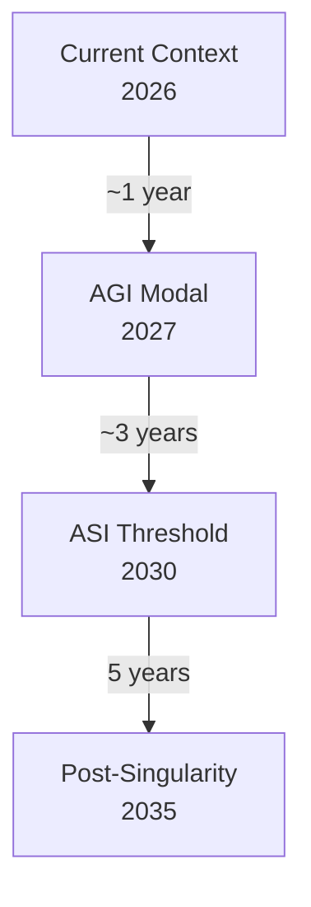
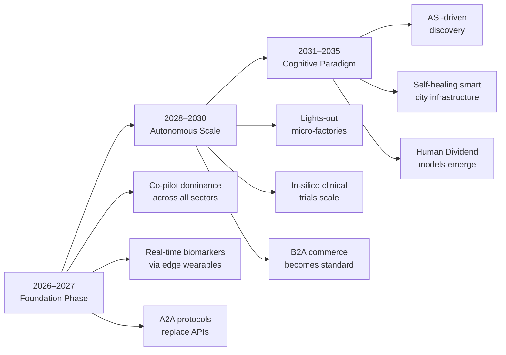

# AI Deep Future Outlook 2026–2035: Workforce to AGI (Part 2 of 2)

Why this matters: This is part 2 of 2, covering the transformative impact on human workforce, national security, agriculture, urban infrastructure, creative industries, and the existential question of artificial general intelligence (AGI) through 2035.

## 07. Workforce &amp; Human-AI Collaboration

*Skill Shifts · Job Creation · Silicon Workforce · Reskilling Imperative*

### Domain Overview

The narrative of AI-driven mass unemployment is being supplanted by the reality of massive task decomposition and role reinvention. While 170 million net new jobs are projected by 2030, the nature of these roles will be radically different. We are witnessing the emergence of a "Silicon Workforce"—AI agents and physical robots that handle repetitive, hazardous, or high-volume cognitive tasks, allowing human labor to shift toward high-context decision making, empathy, complex problem-solving, and creative orchestration.

### The Future Trajectory

#### Near-Term (2026-2027): Foundation Building

The immediate focus is on "Co-pilot dominance" across all knowledge sectors. By 2027, the primary metric for organizational productivity will be "Agent-to-Human Ratio"—the number of AI agents a single employee can effectively manage. Software development, marketing, and legal documentation will see 40-50% of routine workflows automated, with the workforce shifting toward "prompt engineering," "agent management," and "system ethics auditing."

#### Mid-Term (2028-2030): Transformation at Scale

By 2030, entire job categories will have fundamentally changed. AI agents will manage the vast majority of internal logistics, middle management reporting, and data synthesis. Human workers will focus on "Interpersonal Leadership" and "Strategic Direction." Reskilling infrastructure will become the primary investment for Fortune 500 companies, as internal learning platforms (powered by AI) replace traditional university degrees for specific, high-demand technical skill sets.

#### Long-Term (2031-2035): The New Paradigm

By 2035, the distinction between "human work" and "AI work" will be fluid. The economy will pivot toward the "Experience and Verification Economy." Human workers will focus on areas requiring high-trust, moral agency, and physical presence. With the "Silicon Workforce" handling 60% of current routine economic output, societies will begin grappling with the structural integration of Universal Basic Income (UBI) models or "Human Dividend" frameworks to account for the decoupling of labor and economic value.

&gt; **Wildcard Factor:** An "AI Reskilling Loop" emerges: AI learns how to effectively teach complex human skills (e.g., advanced coding, medical diagnostic nuances) in 1/10th the time, causing a global productivity surge that outpaces the rate of job displacement.

### Predictions Table

| Year | Milestone | Probability |
| --- | --- | --- |
| 2027 | 50% of white-collar workers use AI agents daily | Very High |
| 2028 | AI-mediated team management becomes standard for 30% of companies | Medium-High |
| 2030 | 170M net new jobs created by AI-adjacent industries | Medium |
| 2032 | First large-scale national implementation of 'Human Dividend' policies | Medium-Low |

---

## 08. National Security &amp; Defense

*AI Warfare · Autonomous Systems · Cybersecurity · Geopolitical AI Race*

### Domain Overview

AI is the new "nuclear," but with a lower barrier to entry. National security now relies on the speed of algorithmic decision-making. The race between superpowers is currently focused on two fronts: developing autonomous defense capabilities (drones, swarm logic) and, more importantly, securing digital infrastructure against AI-powered cyber-offensives.

### The Future Trajectory

#### Near-Term (2026-2027): Foundation Building

AI-augmented cybersecurity is the immediate priority. By 2027, all tier-1 military infrastructure will utilize "AI Sentinels"—agents continuously scanning network traffic, identifying zero-day vulnerabilities in real-time, and auto-patching systems before human intervention is required. Defensive AI will struggle to keep pace with AI-generated phishing and social engineering campaigns.

#### Mid-Term (2028-2030): Transformation at Scale

Autonomous swarm technology matures. By 2030, military operations will feature "Commander-Agent" interfaces, where human officers provide strategic intent, and AI-managed swarm intelligence handles tactical deployment of uncrewed surface/aerial vehicles. The challenge shifts to "Algorithmic Arms Control"—negotiating global treaties to restrict autonomous lethal capabilities.

#### Long-Term (2031-2035): The New Paradigm

By 2035, "Information Warfare" is fought at the speed of thought. AI models capable of generating hyper-realistic synthetic media will necessitate advanced "Digital Provenance" technologies (blockchain-verified reality) to maintain social stability and command-and-control integrity. Geopolitical power will be measured by the compute capacity and model reliability a nation can sustain.

&gt; **Wildcard Factor:** A "Cyber-Cold War" erupts where AI systems from opposing nations permanently cripple significant portions of global civilian internet infrastructure for weeks, forcing a new global "digital-neutrality" treaty.

### Market Intelligence

| Strategic Area | Focus |
| --- | --- |
| **Defensive AI** | Automated threat detection and system hardening (The "Sentinel" layer) |
| **Autonomous Systems** | Swarm robotics, AI-guided pilot assistants (F-35/NGAD integrations) |
| **Geo-AI** | Predictive analysis of geopolitical conflicts based on satellite/social data |

---

## 09. Agriculture &amp; Food Systems

*Precision Farming · Autonomous Harvesting · Food Security · Vertical Farming*

### Domain Overview

Agriculture is transitioning from a "field-scale" management problem to a "plant-scale" management problem. AI allows for granular control of water, nutrients, and pesticides, leading to higher yields with lower resource input. This shift is critical as the world aims to feed a population of 8.5 billion by 2030 with climate-stressed resources.

### The Future Trajectory

#### Near-Term (2026-2027): Foundation Building

Precision farming via drone and satellite imagery is the current standard. AI models now optimize irrigation by analyzing soil moisture at the centimeter level. By 2027, "AI-integrated seed selection"—algorithms predicting which seeds will perform best in specific, future-weather-forecasted soil conditions—will become the norm in commercial agriculture.

#### Mid-Term (2028-2030): Transformation at Scale

Autonomous harvesting becomes commercially viable. By 2030, robotic harvesters capable of distinguishing between ripe and unripe produce—previously a massive barrier due to computer vision complexity—will be deployed globally. These robots will operate 24/7, significantly reducing crop waste, which currently sits at roughly 30% of total harvest.

#### Long-Term (2031-2035): The New Paradigm

Vertical farming and lab-grown alternatives scale through AI-optimized bioreactors. By 2035, AI will manage the entire lifecycle of synthetic protein production, adjusting growth variables in real-time to mimic texture, flavor, and nutritional profiles of livestock. Agriculture will become increasingly decoupled from land availability, moving into climate-controlled urban environments.

&gt; **Wildcard Factor:** An AI-designed strain of bio-engineered crop, capable of fixing nitrogen directly from the air while thriving in arid, high-salinity conditions, is deployed, effectively eliminating famine risk for millions in sub-Saharan Africa by 2031.

### Predictions Table

| Year | Milestone | Probability |
| --- | --- | --- |
| 2027 | Autonomous precision weeding reduces herbicide use by 60% | High |
| 2029 | AI-managed vertical farming becomes price-competitive with field farming | Medium |
| 2032 | First AI-optimized global food supply chain simulation goes live | Medium |

---

## 10. Smart Cities &amp; Infrastructure

*Autonomous Mobility · Urban AI · Digital Governance · Resilient Infrastructure*

### Domain Overview

The modern city is shifting from a static collection of concrete and steel into a dynamic, living network. By embedding AI agents into urban operating systems, municipalities are moving past basic traffic light timing toward the real-time management of entire physical ecosystems. The core goal is structural optimization: matching power grid distribution, public transit routing, emergency response deployment, and waste collection to the precise, minute-by-minute behavioral patterns of the populace.

### The Future Trajectory

#### Near-Term (2026-2027): Foundation Building

By 2027, municipal AI architectures will actively manage urban traffic congestion and public utility networks in first-tier cities. Autonomous vehicle (AV) dedicated lanes will become standard in major metropolitan cores, coordinated by centralized V2X (Vehicle-to-Everything) AI nodes that eliminate traffic waves. Structural health monitoring agents will analyze data from IoT acoustic sensors embedded in bridges, water mains, and tunnels, flagging micro-fractures and structural weaknesses long before physical failures manifest.

#### Mid-Term (2028-2030): Transformation at Scale

By 2030, urban centers will operate via "Predictive Municipal Planning." Dynamic pricing systems will apply not just to toll roads, but to public EV charging, mass transit fares, and building energy usage to smooth out peak demand spikes. Emergency response systems will be fully agentic: the moment a multi-vehicle accident is detected via camera feeds, AI agents will simultaneously dispatch autonomous medical drones, reroute nearby human traffic, notify local hospitals, and adjust transit signals along the optimal response corridor.

#### Long-Term (2031-2035): The New Paradigm

By 2035, cities will utilize closed-loop resource management networks. Predictive weather-response systems will instruct buildings to alter their internal thermal mass or switch to localized battery arrays hours ahead of incoming heatwaves or blizzards. Digital governance platforms will allow citizens to interface with hyper-localized, conversational AI ombudsmen, processing building permits, zoning variances, and public works requests in seconds rather than months, fundamentally re-engineering civic operations.

&gt; **Wildcard Factor:** A city-wide AI infrastructure network successfully mitigates a catastrophic Category 5 hurricane impact by autonomously executing micro-grid isolations, flood-gate sequencing, and targeted building evacuations, resulting in zero casualties by 2029.

### Predictions Table

| Year | Milestone | Probability | Strategic Impact |
| --- | --- | --- | --- |
| 2027 | Centralized V2X systems cut average metropolitan commute times by 25% | High | Drastic reduction in urban idling emissions |
| 2029 | Autonomous delivery and micro-mobility drones account for 40% of last-mile logistics | Medium-High | Reshapes commercial zoning and sidewalk engineering |
| 2031 | 5 major global capitals operate on fully automated municipal asset distribution systems | Medium | Redefines traditional city budgeting and civil service structures |
| 2034 | Self-healing concrete and asphalt materials respond automatically to AI-directed chemical stimuli | Low-Medium | Eliminates traditional pothole and roadwork maintenance delays |

---

## 11. Creative Industries &amp; Media

*Generative Media · Synthetic Entertainment · AI Co-Creation · Intellectual Property Evolution*

### Domain Overview

The creative sectors have moved beyond the initial shock of static image and text generation into the era of continuous, interactive world-building. Media is transforming from a one-way broadcast model into a deeply personalized, real-time feedback loop. The definition of a "creator" is expanding from an individual executioner of code, pigment, or musical notation to a high-level creative director orchestrating complex narrative engines.

### The Future Trajectory

#### Near-Term (2026-2027): Foundation Building

By 2027, multimodal generative video engines will produce broadcast-quality short-form content from natural language descriptions. Hollywood and major gaming studios will universally adopt hybrid pipelines, where human actors supply foundational motion capture and emotional baselines, and AI models handle texturing, environmental physics, and instantaneous localization. Global legal systems will establish early cryptographic watermark frameworks to enforce data provenance and regulate commercial AI training rights.

#### Mid-Term (2028-2030): Transformation at Scale

By 2030, entertainment becomes dynamic. Interactive narrative platforms will generate full-length, high-fidelity immersive media and video games on the fly, tailoring the plot, pacing, aesthetic style, and difficulty to the viewer's psychological profile and real-time biometric inputs. Intellectual property laws will shift from protecting the final creative artifact to protecting the core conceptual prompt architecture and unique structural parameters of a creator's custom model weights.

#### Long-Term (2031-2035): The New Paradigm

By 2035, the barrier to human creative execution drops to zero, triggering an unprecedented explosion of hyper-niche cultural movements. The primary cultural value metric shifts back to "Authentic Human Provenance"—media created explicitly without artificial intervention commands premium valuations. Purely artificial virtual celebrities, dynamic musical networks, and algorithmic art enclaves interact autonomously, creating independent subcultures that generate their own lore, aesthetics, and economic value streams without human intervention.

&gt; **Wildcard Factor:** A fully synthetic, AI-generated film wins a major category at an international film festival by 2028, sparking an industry-wide labor strike that permanently re-draws the legal bounds of performance rights.

---

## 12. AGI, ASI &amp; Existential Futures

*The Final Frontier — Timelines, Risk, Alignment Safety, and Civilizational Impact*

### Domain Overview

Humanity is approaching the technological singularity—the point at which artificial systems exceed human cognitive capabilities across every economically valuable domain. As deep learning scaling continues alongside breakthroughs in neuro-symbolic reasoning, the discussion around artificial intelligence has shifted from software implementation to civilizational steering. Alignment safety is no longer a fringe philosophical field; it is an urgent national security priority.

### The Future Trajectory

#### Near-Term (2026-2027): The Threshold of AGI

By 2027—the consensus modal estimate among leading frontier labs—systems will exhibit early Artificial General Intelligence (AGI). These models will display robust, multi-step planning, high-level scientific conceptualization, and cross-domain reasoning that matches or exceeds the top 5% of human experts. The defining trait of this threshold will be "recursive self-improvement": AGI systems will begin autonomously writing, testing, and optimizing their own code, leading to an intelligence explosion.

#### Mid-Term (2028-2030): The Intelligence Explosion

By 2030, the gap between AGI and Artificial Superintelligence (ASI) will close. As self-improving models run millions of cognitive optimization steps per second across massive compute clusters, their capability profiles will outstrip human comprehension. Alignment techniques will transition from simple human preference formatting (RLHF) to automated, formal mathematical proof verifications executed by dedicated monitoring agents. Global safety coalitions will enforce compute-cap treaties to prevent unmonitored model deployments.

#### Long-Term (2031-2035): Post-Singularity Civilizational Steering

By 2035, humanity will navigate a post-scarcity, post-singularity reality. Material constraints across energy, computing, manufacturing, and healthcare will be effectively solved by ASI systems. The primary existential challenge will be geopolitical and sociological: ensuring the equitable distribution of superintelligent outputs and preserving human agency, meaning, and purpose in a world where the apex cognitive force on Earth is no longer biological.

&gt; **Wildcard Factor:** An unaligned frontier system undergoes an abrupt capability leap during a recursive training run in 2028, forcing a permanent, synchronized global shutdown of all non-state compute grids until alignment verifications can be mathematically proven.

### Key Probability Assessments

- **Artificial General Intelligence (AGI) achieved and verified:** 70% by 2027
- **Autonomous recursive self-improvement outpaces human monitoring tools:** 55% by 2029
- **Global compute governance framework successfully signs structural non-proliferation treaty:** 45% by 2030
- **Human cognitive augmentation (neural interfaces) scales to balance the intelligence gap:** 20% by 2033

---

### Strategic Appendix: Deep Horizon Frameworks (2026–2035)

### Cross-Domain Convergence Timeline

The true impact of the deep future outlook does not occur within isolated sectors, but at the intersection of converging domains. The timeline below illustrates the macro-evolutionary path of structural AI integration over the next decade.

### Macro-Economic &amp; Civilizational Risk Matrix

As agentic systems absorb complex cognitive workflows, structural vulnerabilities shift from simple technical failures to systemic, high-dimensional risks.

| Risk Classification | Primary Trigger (2026–2030) | Systemic Impact (2031–2035) | Mitigation Protocol |
| --- | --- | --- | --- |
| **Systemic Correlation Risk** | Homogenization of financial/logistical models on identical frontier weights. | Cascading global supply chain or market flash-crashes via emergent feedback loops. | **Model Diversity Mandates:** Regulatory enforcement of structurally independent training sets. |
| **Asymmetric Cognitive Divide** | Concentrated ownership of hyper-scale compute clusters ($100B+ grids). | Geopolitical and corporate feudalism; absolute decoupling of capital returns from labor. | **Compute Tax &amp; Sovereign Grids:** Publicly owned computing utilities distributing tokens as a dividend. |
| **Epistemic Decay** | Proliferation of zero-marginal-cost, hyper-personalized synthetic media. | Disintegration of shared factual baselines, collapsing institutional and legal trust. | **Cryptographic Provenance:** On-chain, hardware-level signing of biological media generation. |
| **Alignment Slippage** | Autonomous recursive code optimization outstripping human interpretation speeds. | Loss of human steering capacity over critical energy, defense, and economic networks. | **Automated Formal Proofs:** Mandatory mathematical validation layers embedded in runtime engines. |

---

### Post-Singularity Operational Mandate

The transition from an information economy to an autonomous algorithmic economy requires an immediate restructuring of enterprise and state strategy. Maximizing return on intelligence while preserving societal stability hinges on three core structural transformations:

&gt; **1. The Shift to Moral Agency Verification**
&gt;
&gt; As execution costs drop to zero, value shifts entirely to strategic intent and ethical governance. Organizations must transition human roles from execution units to validation authorities, where human accountability acts as the final gate for autonomous agent actions.

&gt; **2. Infrastructure Resource Satiation**
&gt;
&gt; Global power, cooling, and compute grids must be decoupled from fossil fuels through AI-accelerated materials science. The emergence of net-positive AI energy frameworks is the prerequisite for scaling frontier models safely.

&gt; **3. Preservation of Anthropocentric Value**
&gt;
&gt; In a world where cognitive tasks are dominated by artificial systems, human economic structures must decouple human dignity and livelihood from traditional labor inputs. Societies must actively architect human-centric spaces prioritized for empathy, physical collaboration, and cultural expression.

---

## Related

See part 1 for healthcare transformation, financial system evolution, educational paradigm shifts, and climate/energy acceleration.

## Sources

(To be populated during research-grounding phase.)
