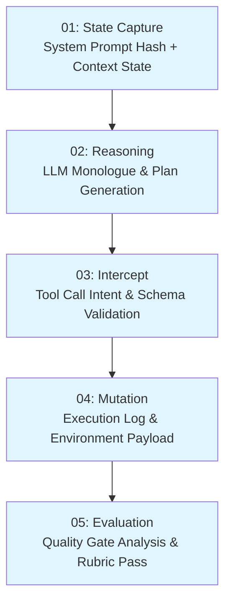
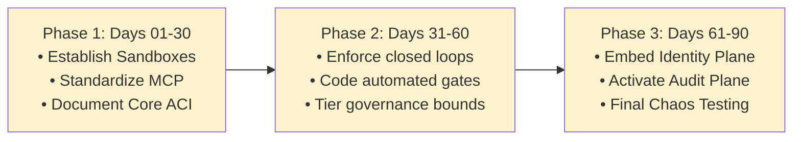
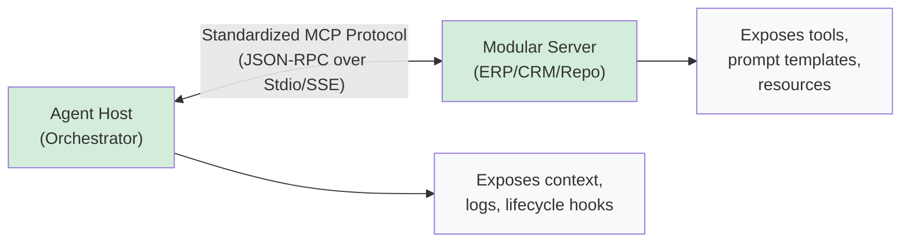
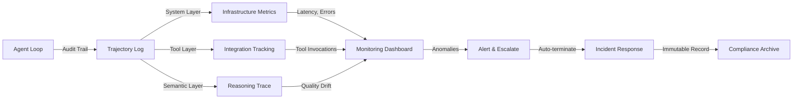

## Why This Matters

Production agentic systems require more than architectural foundations — they demand rigorous governance, security controls, observability infrastructure, and a structured maturity progression. This part equips enterprise architects with the operational practices and implementation roadmaps needed to move from design to defended production deployments.

---

## **SECTION 08: The Agent-Computer Interface**

Tool design is the highest-leverage, most under-invested part of most agent architectures.

Just as human-computer interaction designers spend significant effort designing good UIs, building good agent-computer interfaces (ACI) deserves equal care. Tools are how an agent perceives and acts on the world; a poorly documented or ambiguous tool produces unreliable agent behavior no amount of prompt engineering can fully compensate for.

### **What a Well-Designed Tool Looks Like**
*   A clear name and a description written as if for a new engineer joining the team.
*   Parameters with explicit types, bounds, constraints, and example values.
*   Error messages that tell the agent exactly what to try differently, not just that something failed.
*   Outputs structured in a format the model parses reliably (JSON/schemas, not ad-hoc prose).

### **Common ACI Failure Modes**
*   Two tools with overlapping purposes that the model cannot reliably distinguish.
*   Free-text parameters where a constrained enum would completely remove ambiguity.
*   Silent failures that return an empty result instead of a clear error code.
*   Tools that require contextual knowledge the model has no baseline way to acquire.

Connectivity itself has converged on a standard: the **Model Context Protocol (MCP)**, developed by Anthropic, has become the de facto open standard for agent-to-tool integration in 2026. It gives agents a consistent way to discover and call tools across ERPs, CRMs, ticketing systems, and internal services without needing a bespoke integration layer for every pairing of agent and system.

&gt; **Test Tools Like Code:** Before trusting a tool in a production loop, run the agent against it with a held-out set of realistic tasks and read the invocation transcripts. Most ACI problems surface immediately once you watch an agent try, fail, and guess at why — and they remain invisible if you only read the tool's schema.

---

## **SECTION 09: Governance &amp; Autonomy Tiers**

The choice is not between full human control and full autonomy. It's calibrating oversight to the reversibility and consequence of each action.

Treating human oversight as binary is the most common governance mistake. Organizations that require human-in-the-loop approval for every single agent action defeat the value of agentic AI; organizations that apply zero oversight to high-risk agents expose themselves to regulatory liability and operational harm. The right model calibrates oversight to what's actually at stake in a given action.

*   **Human-in-the-loop:** A human must approve a significant agent action *before* it executes. Appropriate for irreversible, high-consequence, or low-confidence actions — e.g., an outbound payment, a public-facing communication, or a destructive change to production infrastructure.
*   **Human-on-the-loop:** The agent acts autonomously while a human monitors behavior and reviews logs retrospectively. Appropriate for reversible, low-consequence, well-tested actions — e.g., ticket triage, internal data lookups, draft generation.

### **Autonomy Levels by System Integration**

| Integration | Read Access | Write / Consequential Actions |
| :--- | :--- | :--- |
| **ERP** *(SAP, Oracle)* | Master data via least-privilege API access | Purchase orders, financial records require human approval at minimum |
| **CRM** *(Salesforce, HubSpot)* | Account history, deal stages, metrics | Customer writes require strict confidence thresholds and full audit logging |
| **ITSM** *(ServiceNow, Jira)* | Ticket triage, classification, and metadata | Ticket creation/updates can run autonomously; on-call escalation has explicit triggers |
| **HR** *(Workday, SuccessFactors)* | Onboarding workflows and manuals | Account creation and training assignment run autonomously with defined escalation paths |

Most enterprise use cases in 2026 still operate at the lower end of the autonomy spectrum for high-risk actions — full autonomy is reserved for narrow, well-validated, reversible workflows. Calibrate your ambition to the maturity of your quality gate *(Section 07)*, not the other way around.

Build compliance as an architectural feature from day one, not as something bolted onto an existing deployment after an incident or an audit. That means audit trails, decision logs, and role-based access embedded directly in the orchestration layer itself, plus explicit, written policies on which action classes require approval, how long decision data is retained, and who holds override authority.

---

## **SECTION 10: The Regulatory Landscape**

Regulation written for predictive models is being stretched to cover systems that act. Architects should track the gap, not just the letter of each law.

Most existing AI governance frameworks were built to assess risk at training or deployment time. Agentic risk manifests in *execution*, not configuration — the relevant question is not what the model can do, but what the agent actually does across a full, multi-step run. Several major frameworks bear directly on enterprise agent deployments in 2026.

### **Regulatory Framework Compliance Guide**

| Framework | What It Requires | Status / Deadline |
| :--- | :--- | :--- |
| **EU AI Act** | Effective human oversight for high-risk systems; traceability, documentation, and the ability to stop, correct, or override any autonomous action. | High-risk obligations phasing in through 2027; broader provisions already enforceable. |
| **NIST AI RMF + Agent Profile** | The Govern, Map, Measure, Manage functions, extended with an agent-specific profile covering identity, authentication, and containment boundaries. | Agent-focused profile from NIST's CAISI initiative planned for late 2026. |
| **Colorado AI Act** | Oversight obligations for AI systems making consequential decisions about Colorado residents. | Deadline June 30, 2026. |
| **ISO/IEC 42001** | AI management system standard; increasingly used to govern third-party agent vendors and supply-chain risk. | Voluntary certification, growing enterprise adoption. |

&gt; **The Liability Question:** When an autonomous agent takes a harmful action — an unauthorized trade, an erroneous communication, an infrastructure change — responsibility may fall on the model developer, the deploying organization, or the end user depending on jurisdiction and contract terms. As a working assumption, treat the deploying organization as the default bearer of liability and architect logging and approval controls accordingly; confirm the specific allocation with legal counsel.

### **Minimum Architectural Requirements Emerging Across Frameworks**
*   **Visible, not black-box:** Decision logic must be documented and inspectable — regulators describe this as replacing the black box with a "glass box."
*   **Stoppable, always:** Every agent needs an immediate mechanism to halt, correct, or override its operation at any point in a execution run.

*Disclaimer: This guide is not legal advice. Regulatory deadlines and obligations shift quickly — verify current requirements against primary sources and legal counsel before finalizing a compliance posture.*

---

## **SECTION 11: Security &amp; Identity**

Agents are not users and not service accounts. They need their own identity model, with its own threats and its own controls.

The deployment of autonomous agents introduces failure modes that don't map cleanly onto traditional application security: data leakage through extensive context windows, indirect prompt injection from content the agent reads rather than from its operator, and identity spoofing that exploits the gap between who an agent claims to be acting for and what it's actually been authorized to do.

### **Primary Risk Patterns**
*   **Indirect Prompt Injection:** An agent processes untrusted external data (e.g., an incoming email, a customer support ticket, or a scraped webpage) containing hidden instructions that hijack the agent's system prompt and malicious tools are invoked.
*   **Context Window Exfiltration:** Attackers inject instructions that trick the agent into dumping its system configuration, memory stores, or proprietary enterprise data into outbound responses or external tracking endpoints.
*   **Privilege Escalation &amp; Spoofing:** An agent running with excessive system rights executes dangerous commands on behalf of an unprivileged user, exploiting a lack of session tracking and boundary mapping.

### **Security Controls Blueprint**
1.  **Isolated Token Management:** Issue short-lived, scoped access tokens bound specifically to the agent session and user context. Never let an agent operate using general application-level service keys.
2.  **Strict Input Sanitation &amp; Separation:** Isolate untrusted data inputs into separate data fields. Leverage LLM features like delimiter wrapping or dedicated structural inputs to ensure instructions cannot easily masquerade as raw data.
3.  **Human Verification for Privileged Tool Calls:** Enforce hard checkpoints for any tool execution classified as irreversible or high-impact (e.g., database writes, financial transactions, configuration overrides).
4.  **Egress Filtering:** Implement strict networking firewalls and content proxies on agent environments to prevent unauthorized data exfiltration or webhook exploitation.

---

## **SECTION 12: Observability &amp; the Audit Plane**

Enterprise loops fail dynamically. Traditional system monitoring catches service outages, but it cannot detect semantic drift, tool-loop deadlocks, or reasoning degradation.

To govern an agent fleet safely, platform teams must shift from basic telemetry to a structured **Audit Plane** that treats an agent's internal monologue, tool invocations, and environment responses as a single, immutable transaction ledger.

### **The Three Strata of Agent Telemetry**

*   **The System Layer (Infrastructure):** Standard microservice metrics—API latency, token throughput, cache-hit ratios, HTTP error codes, and memory utilization of the execution engine.
*   **The Tool Layer (Integration):** MCP execution tracking, tool response payload sizing, invocation latency, schema validation failures, and tool-driven exceptions.
*   **The Semantic Layer (Reasoning):** The agent's structural trace—its raw thoughts, planning steps, critic evaluations, and intermediate trajectory state.

### **The Anatomy of a Trajectory Log**

Every loop invocation must generate an absolute, replayable trace. Storing merely the final prompt and final response is insufficient for debugging or legal compliance.

Each trajectory log captures the complete sequence from state capture through final evaluation to enable audit compliance and debugging.

### **Detecting Loop-Specific Anomalies**

Architects must implement specific detectors on the monitoring plane to automatically flag and terminate loops displaying aberrant behavior patterns before they burn through token or execution budgets:

*   **The Infinite Retrying Deadlock:** The agent repeats an identical tool call with the same parameters multiple times, receiving the same structural error from the environment, unable to pivot its planning phase autonomously.
*   **Context Window Bleed:** The trajectory context window grows exponentially due to unsummarized tool outputs (e.g., pulling a raw 10MB CSV file into context), causing prompt degradation and soaring token costs.
*   **Hallucinatory Drift:** The evaluation score of the intermediate loop responses declines across iterations, signaling that the agent is wandering away from the primary objective given by the operator.

---

## **SECTION 13: The Loop Engineering Maturity Model**

Transitioning an enterprise from basic prompt engineering to an automated, resilient multi-agent architecture requires structural changes in infrastructure, testing, and team capabilities. The following four-tier model establishes a formal pathway for organizational scaling.

### **Maturity Matrices**

#### **Level 1: The Prompter (Ad-Hoc &amp; Single-Turn)**
*   **Architecture:** Direct, unstructured single-turn prompt/response patterns using web interfaces or basic API wrappers.
*   **Tooling:** None. The human manually copies and pastes data between systems.
*   **Verification:** Purely ad-hoc human review.
*   **Risk Profile:** High. Behavioral unpredictability, high operational friction, no historical tracing.

#### **Level 2: The Automator (Predefined Code Paths)**
*   **Architecture:** Fixed workflows, prompt chaining, and rigid routing. The system is deterministic; logic branches are hardcoded via traditional software application engineering.
*   **Tooling:** Custom, bespoke integrations bound tightly to specific application endpoints.
*   **Verification:** Standard structural verification (JSON schema validation, regex syntax parsers).
*   **Risk Profile:** Bounded cost, but fragile execution pipelines that break when unexpected data inputs diverge from structural assumptions.

#### **Level 3: The Architect (Governed Closed Loops)**
*   **Architecture:** Dynamic single-agent systems executing canonical loops (Discovery through Iteration). The agent autonomously determines tool-selection trajectories within a closed boundary.
*   **Tooling:** Standardized tool registries leveraging open frameworks like the Model Context Protocol (MCP).
*   **Verification:** Decoupled, automated Quality Gates utilizing static analyzers, unit tests, and isolated maker/checker subagents.
*   **Risk Profile:** Controlled via cost/token budgets, explicit step ceilings, and granular human-in-the-loop triggers.

#### **Level 4: The Fleet Commander (Orchestrated Swarms)**
*   **Architecture:** Fully dynamic Multi-Agent Fleets using isolated Orchestrator-Worker topologies, shared durable external memories, and ephemeral workspace worktrees.
*   **Tooling:** Enterprise-wide abstraction planes featuring polymorphic tool discovery and dynamic context routing.
*   **Verification:** Hierarchical evaluation planes where specialized verification swarms continually execute automated stress-testing against running loops.
*   **Risk Profile:** Low operational blast radius. Systems are highly resilient, auto-recovering from tool failures and isolating malicious injections to ephemeral worker contexts.

---

## **SECTION 14: Implementation Roadmap &amp; Architect's Checklist**

A disciplined, 90-day execution framework designed to move an enterprise application from a validated proof-of-concept to a hardened, fully governed production deployment.

### **The 90-Day Execution Timeline**

This three-phase approach ensures systematic progression from sandbox validation through governance integration to final hardening.

### **The Enterprise Architecture Sign-Off Checklist**

Before shifting any closed-loop system from staging to production, the lead AI architect must formally sign off on the following security, architectural, and governance requirements:

#### **Core Architecture &amp; Containment**
*   [ ] **Hard Ceiling Budgets:** Is there a hard stop on max tokens per run, max runtime seconds, and total iteration count enforced by the platform runtime (not the LLM)?
*   [ ] **State Isolation:** Are execution agents running inside ephemeral, isolated environments (e.g., containerized worktrees) where a failure cannot contaminate baseline application states?
*   [ ] **API Abstraction:** Are all LLM interactions decoupled via an abstraction layer, preventing vendor lock-in and allowing seamless model swapping?

#### **The Agent-Computer Interface (ACI) &amp; Quality Gates**
*   [ ] **Deterministic Quality Gates:** Is the final verification step built using automated code tools (linters, test suites, or decoupled validators) that the agent cannot override through reasoning manipulation?
*   [ ] **Tool Ambiguity Pass:** Have all available tools been validated for schema cleanliness, strict parameter bounds, and descriptive text that differentiates them from other tools?
*   [ ] **Graceful Exception Routing:** Do tools return detailed, parseable error codes to the agent during execution errors instead of throwing silent drops or fatal system crashes?

#### **Security, Identity, &amp; Governance**
*   [ ] **Least-Privilege Identity:** Is the agent running on its own distinct service identity with permission levels scoped tightly to the required task, utilizing user-delegated tokens?
*   [ ] **Indirect Injection Protection:** Are data inputs separating system instructions from untrusted data blocks using clear field boundaries or semantic delimiters?
*   [ ] **Autonomy Tier Enforcement:** Are destructive or high-consequence system actions (e.g., payment routing, master data modifications) blocked by hard human-in-the-loop gates?
*   [ ] **Immutable Trajectory Logging:** Is every reasoning step, internal monologue trace, tool call input, and environment response written to an immutable audit plane for historical compliance checking?

---

## **APPENDIX A: The Model Context Protocol (MCP) Reference Architecture**

To prevent bespoke tool integration sprawl, production loop architectures must standardize on the Model Context Protocol (MCP). The architecture relies on an explicit separation between the Client, the Orchestration Host, and decentralized, modular Tool Servers.

The MCP protocol enables clean separation between agent orchestration and tool implementation, supporting standardized integration patterns.

### **Core MCP Implementation Pattern**

Every tool server connected to an enterprise loop must strictly implement the following three capabilities to remain inspectable by the governance plane:

1.  **Resources:** Schema-controlled, read-only data inputs (e.g., system logs, database tables) that provide the agent with objective state information without granting write access.
2.  **Tools:** Executable functions that allow the agent to perform actions on the enterprise environment (e.g., modifying a record, creating an archive). Each tool must provide an explicit parameter schema.
3.  **Prompts:** Pre-designed prompt templates that expose recommended system patterns directly from the source system to the orchestrator, reducing prompt engineering drift.

---

## **APPENDIX B: Loop Failure Mode Diagnostic Matrix**

When an operating loop encounters an exception in production, the platform engineering team should leverage the following standard diagnostic matrix to classify the root architectural failure.

| Symptom | Root Cause | Immediate Mitigation | Architectural Fix |
| :--- | :--- | :--- | :--- |
| **Rapid token depletion** with identical reasoning steps. | **Infinite Tool Loop:** The tool fails to return a state that matches the model's planning criteria. | Force-terminate the run via the platform step counter. | Enhance the tool's error text to suggest alternative parameters. |
| **Drastic quality degradation** after 10+ iterations. | **Context Window Poisoning:** The agent's history is flooded with verbose error messages or raw system logs. | Purge the intermediate run log and summarize the state. | Implement semantic log-truncation or markdown summarization steps. |
| **Agent executes unauthorized systems** via API. | **Indirect Prompt Injection:** Untrusted file or system data has hijacked the context pipeline. | Quarantine the service account identity; invalidate active tokens. | Redesign the ACI to enforce hard schema parameters over text payloads. |
| **High latency** across single-step transitions. | **Monolithic Single-Agent Bottleneck:** The system is processing too many parallel variables simultaneously. | Fan out the task into manual sub-queues. | Migrate the architecture to an **Orchestrator-Workers** topology. |

---

## Production Governance &amp; Observability Architecture

### Governance &amp; Autonomy Tier Trade-offs

| Autonomy Level | Read Access | Write Authority | Risk | Best For |
| :--- | :--- | :--- | :--- | :--- |
| **Level 0: Advisory** | Unrestricted | None (read-only) | Minimal | Analysis, recommendations |
| **Level 1: Supervised** | Scoped | Reversible actions + human review | Low | Internal workflows |
| **Level 2: Constrained** | Scoped | Bounded authority + audit trail | Medium | Customer-facing, high-value |
| **Level 3: Broad** | Scoped | High-value decisions | High | Only proven, stable systems |
| **Level 4: Full** | Unrestricted | Unrestricted | Critical | Rare; exceptionally mature systems |

### Maturity Model Progression

| Level | Architecture | Verification | Risk Profile |
| :--- | :--- | :--- | :--- |
| **1: Prompter** | Single-turn, unstructured | Ad-hoc human | High unpredictability |
| **2: Automator** | Fixed workflows, deterministic | Structural checks (schema, regex) | Fragile on edge cases |
| **3: Architect** | Dynamic loops, closed boundaries | Automated gates, maker/checker | Controlled via budgets &amp; gates |
| **4: Fleet Commander** | Multi-agent swarms, orchestrated | Hierarchical evaluation planes | Resilient, auto-recovering |

---

## Related

- [Agentic AI Landing Zone: Agent Platform Layer](../29-agentic-ai-landing-zone-platform-layer.md)
- [Agentic AI Landing Zone: EU AI Act Compliance](../25-agentic-ai-landing-zone-eu-ai-act.md)
- [Agentic AI Landing Zone: Implementation Playbooks](../30-agentic-ai-landing-zone-playbooks.md)

## Sources

- Enterprise AI deployments, 2026 production customer data
- EU AI Act (Digital Omnibus final approval, June 29, 2026)
- NIST AI RMF and Agent-specific profiles
- Model Context Protocol (MCP) specification
- Anthropic internal security and governance architecture
