# Enterprise Multi-Model AI Strategy — Technical Comparison, Decision Frameworks & Architecture (Part 2 of 3)

## Why This Matters

This is **Part 2 of 3** of the definitive enterprise reference for selecting, routing, governing, evaluating, and operating foundation models across an organization. Part 2 provides technical comparison of frontier models, decision frameworks for model selection, and detailed architecture patterns for multi-model systems. Part 1 established the foundational business case and surveyed the 2026 model landscape; Part 3 covers operations, governance, security, and future trends.

**Cross-references to other parts:**
- [Part 1: Enterprise Multi-Model AI Strategy — Vendor-Agnostic Guide (Part 1)](54-enterprise-multi-model-ai-strategy.md) — Foundational case for multi-model and landscape survey
- [Part 3: Enterprise Multi-Model AI Strategy — Operations, Governance & Future Trends (Part 3)](pathname:///archon/architecture/parts/19-enterprise-multi-model-ai-strategy-part3)

---

## Table of Contents — Part 2

**Part III — Technical Comparison**

6. [Claude vs GPT vs Gemini vs Open Source](#6-claude-vs-gpt-vs-gemini-vs-open-source--technical-comparison)

**Part IV — Decision Frameworks**

7. [Enterprise Model Decision Tree](#7-enterprise-model-decision-tree)
8. [Dynamic Model Selection](#8-dynamic-model-selection)

**Part V — Architecture**

9. [Model Routing Architecture](#9-model-routing-architecture)
10. [Multi-Model Agent Architecture](#10-multi-model-agent-architecture)
11. [Context Window Strategy](#11-context-window-strategy)
12. [Enterprise Reference Architectures](#12-enterprise-reference-architectures)

---

## Part III — Technical Comparison

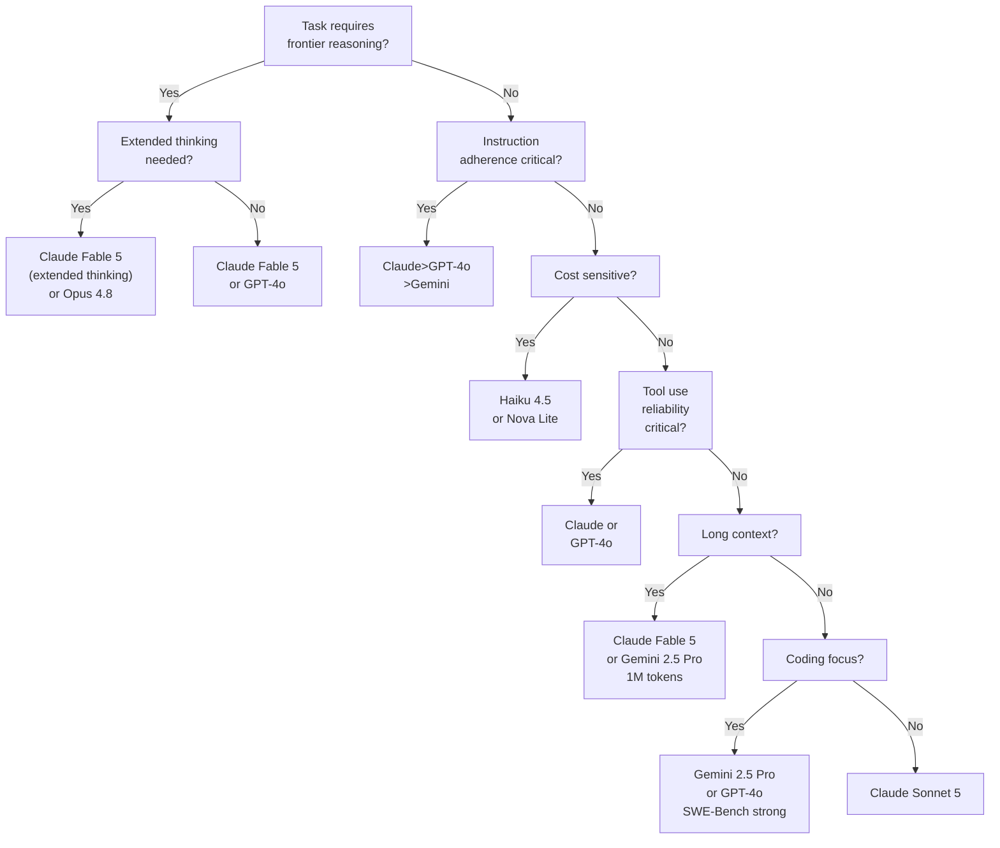

**Multi-Model Selection Decision Tree.** Model choice depends on task characteristics—reasoning depth, cost sensitivity, instruction adherence, and domain focus all influence the decision. No single model dominates; use this decision tree to route each workload appropriately.

## 6. Claude vs GPT vs Gemini vs Open Source — Technical Comparison

### 6.1 Instruction Following

Claude (Anthropic) is designed from the ground up around detailed instruction following. Constitutional AI training means Claude rarely ignores explicit constraints in system prompts. Particularly reliable for multi-constraint tasks, persona adherence, and structured format compliance.

GPT-4o (OpenAI) shows strong instruction following but with higher variance on complex multi-constraint prompts. Some practitioners report more "creative interpretation" of instructions than Anthropic models.

Gemini 2.5 Pro has improved substantially in 2026 but historically showed more hallucinations on specific constraint adherence. Strongest at factual task following; weaker on nuanced persona or style constraints.

Llama 3.3 70B (self-hosted) performance on instruction following depends heavily on the RLHF tuning variant used. Meta's base Instruct models are competitive; community fine-tunes vary widely.

**Verdict:** Claude > GPT-4o > Gemini > Open-source (varies) for strict instruction adherence.

### 6.2 Reasoning Depth and Chain-of-Thought

| Model | Reasoning mode | GPQA Diamond | MATH-500 | ARC-Challenge |
| --- | --- | --- | --- | --- |
| Claude Fable 5 (extended thinking) | Extended thinking | ~83% | ~96% | ~98% |
| GPT-4o (with o3) | System 2 reasoning | ~87% | ~97% | ~98% |
| Gemini 2.5 Pro | Thinking mode | ~84% | ~97% | ~98% |
| DeepSeek-R1 | Chain-of-thought | ~79% | ~97% | ~96% |
| Llama 3.1 405B | Standard CoT | ~50% | ~73% | ~88% |
| Llama 3.3 70B | Standard CoT | ~46% | ~68% | ~84% |

Source: public benchmark leaderboards (MMLU Pro, LiveBench, GPQA); verify against current evaluations at publication date.

**Extended thinking / reasoning mode:** All frontier commercial models now have a "reasoning" or "thinking" mode that uses explicit chain-of-thought before generating. DeepSeek-R1 is the leading open-source reasoning model. These modes increase latency (5–30s) and cost (2–5× token usage) substantially. Use only for tasks that demonstrably benefit.

### 6.3 Hallucination and Factual Accuracy

Hallucination rates are task-dependent. General patterns from practitioner research:

- **Grounded (RAG) tasks:** All frontier models perform similarly when grounding context is provided. The differentiator is faithfulness — how well the model stays within provided context vs. adding ungrounded facts.
- **Open-domain factual:** Gemini with Search grounding leads (real-time knowledge); Claude and GPT-4o are strong but have knowledge cutoffs.
- **Long-context faithfulness:** Claude Fable 5 and Gemini 2.5 Pro maintain higher faithfulness over 500K+ token contexts than GPT-4o (128K limit creates truncation risk).
- **Open-source:** Generally higher hallucination rates without careful prompt engineering; quantised models show further degradation.

### 6.4 Tool Use and Function Calling

Claude uses XML-tagged tool call format and has the most reliable structured tool use in multi-step agent tasks. Claude Agent SDK enables complex tool orchestration patterns.

GPT-4o established the de-facto JSON schema function-calling API that most frameworks (LangChain, AutoGen) use as their interface contract. Most ecosystem tooling works natively with OpenAI schema.

Gemini supports function calling with JSON schema; supports Google Search grounding as a native tool.

Open-source models show tool calling quality that varies significantly. Mistral Large 2 and Llama 3.1+ have explicit fine-tuning for function calling. Smaller models (<13B) struggle with complex nested tool schemas.

**Recommendation:** For multi-step agents, prefer Claude or GPT-4o. For tool-calling in constrained pipelines, test any open-source model specifically on your tool schema before committing.

### 6.5 Coding Capabilities

| Benchmark | GPT-4o | Claude Fable 5 | Gemini 2.5 Pro | DeepSeek-V3 | Qwen2.5-Coder 32B |
| --- | --- | --- | --- | --- | --- |
| HumanEval | ~90% | ~88% | ~91% | ~90% | ~92% |
| SWE-Bench Verified | ~49% | ~49% | ~63% | ~47% | ~37% |
| BigCodeBench | ~63% | ~64% | ~68% | ~66% | ~65% |

Note: SWE-Bench Verified reflects real-world repository issue resolution. These figures change rapidly; check the current standings at publication date.

**Key insight:** Gemini 2.5 Pro leads on SWE-Bench (full repository context + multi-file changes). GPT-4o and Claude are competitive across benchmarks. Open-source models like DeepSeek-Coder and Qwen-Coder approach commercial quality for specific coding tasks at a fraction of the cost.

### 6.6 Cost Profile Comparison

```
COST PER 1,000 REQUESTS (typical enterprise workload: 500 input / 500 output tokens)

Ultra premium tier:
  Claude Fable 5:     ~$30.00
  GPT-4o:             ~$6.25

Standard production tier:
  Claude Sonnet 5:    ~$6.00
  Gemini 2.5 Pro:     ~$5.63
  GPT-4o mini:        ~$0.38

Efficient tier:
  Claude Haiku 4.5:   ~$3.00
  Gemini 2.0 Flash:   ~$0.25
  Amazon Nova Lite:   ~$0.15

Self-hosted (GPU cost):
  Llama 3.3 70B:      ~$0.003 (H100 rental, no idle cost)
  Mistral 7B:         ~$0.001 (A10G rental)
```

### 6.7 Context Window Strategy by Provider

| Provider / Model | Max Context | Practical Limit | Notes |
| --- | --- | --- | --- |
| Claude Fable 5 | 1M tokens | ~900K reliable | Best-in-class faithfulness at long context |
| Gemini 2.5 Pro | 1M tokens | ~800K reliable | Strong; some loss-in-the-middle reported |
| GPT-4o | 128K tokens | ~100K reliable | Hard limit forces chunking for long docs |
| Amazon Nova Pro | 300K tokens | ~250K reliable | AWS-native; good for document batches |
| Llama 3.1 405B | 128K tokens | ~100K reliable | Self-hosted; context management critical |

### 6.8 Determinism and Consistency

No frontier model is fully deterministic. Temperature=0 reduces but does not eliminate output variation across providers:

- Claude: temperature=0 is more consistent than most; recommended for structured extraction
- GPT-4o: seed parameter available for reproducibility (best-effort)
- Gemini: temperature=0 available; less consistent than Claude in practitioner testing
- Open-source: temperature=0 is effective; same weights equals more reproducible

**Design implication:** Never assume AI outputs are idempotent. Build evaluation harnesses that can tolerate non-deterministic responses.

---

## Part IV — Decision Frameworks

## 7. Enterprise Model Decision Tree

### 7.1 Primary Routing Decision Tree

The decision tree below routes workload classification to the most appropriate model tier based on data residency, context requirements, and task specialization.

START: New AI workload or model selection decision

Can data leave the organization or cross national boundaries?

YES: Commercial API allowed
NO: Self-hosted open-source (Llama, Mistral, Phi) on-premise or private VPC

For commercial APIs: Is required context greater than 128K?

YES: Claude or Gemini (1M context)
NO: Consider GPT-4o, Nova, Mistral, or Haiku

What is the required capability?

Reasoning & Math: DeepSeek-R1, Claude Fable, Gemini 2.5 (reasoning mode)
Coding (≥HumanEval 90%): GPT-4o, DeepSeek Coder, Qwen-Coder
Vision (image/video): GPT-4o, Gemini 2.5, Claude Fable (OCR, docs)
Audio/Speech: GPT-4o, Gemini 2.5 (Whisper for open-source)

Is there a cost constraint of less than $0.01 per 1K tokens?

YES: Gemini Flash, Nova Micro, Haiku 4.5, Self-hosted OSS
NO: Task-appropriate frontier model (see above)

### 7.2 Task-to-Model Mapping

| Task Category | Primary Model | Fallback | Rationale |
| --- | --- | --- | --- |
| Complex reasoning / research | Claude Fable 5, o3, Gemini 2.5 Pro | Claude Sonnet 5 | Extended thinking; long context |
| Code generation (general) | GPT-4o, Claude Sonnet 5 | DeepSeek-Coder | Broad language support |
| Code review / refactoring | Claude Fable 5, Gemini 2.5 Pro | GPT-4o | Long context + reasoning |
| Classification / triage | Claude Haiku 4.5, Gemini Flash | Nova Micro | Cost; speed |
| RAG / document Q&A | Claude Sonnet 5, Cohere Command R+ | Gemini Flash | Faithfulness; long context |
| Customer support chat | Claude Haiku 4.5, GPT-4o mini | Gemini Flash | Speed; cost; safety |
| Vision / image analysis | GPT-4o, Gemini 2.5 Pro | Llama 3.2 11B | Multimodal quality |
| Audio transcription | GPT-4o Realtime, Gemini Flash | Whisper (OSS) | Native audio capability |
| Translation | GPT-4o, Qwen2.5 | Mistral Large 2 | Multilingual quality |
| SQL / structured data | GPT-4o, Claude Haiku | DeepSeek-V3 | Structured output reliability |
| Agent planning | Claude Fable 5, GPT-4o | Claude Sonnet 5 | Tool use; instruction following |
| Embedding | Cohere Embed 3, OpenAI text-3 | Jina / BGE-M3 (OSS) | Retrieval quality; multilingual |
| Air-gapped / on-premise | Llama 3.3 70B, Mistral Small | Phi-4 | Full data control |
| Edge / mobile | Phi-3 Mini, Gemma 3 4B | Llama 3.2 3B | Low memory; CPU-friendly |
| Financial analysis | Claude Sonnet 5, GPT-4o | — | Safety; structured output |
| Medical / clinical | Claude Fable 5 (with HITL) | — | Safety; faithfulness |

### 7.3 Approved Model Tiers

Structure your enterprise catalog as three tiers:

| Tier | Criteria | Examples | Approval Required |
| --- | --- | --- | --- |
| **T1: Approved Production** | Security reviewed, SLA backed, DPA signed, benchmarked on enterprise tasks | Claude Sonnet 5, GPT-4o, Gemini 2.5 Pro, Llama 3.3 70B (self-hosted) | Architecture review board |
| **T2: Approved Experimental** | Evaluated but limited production use; monitoring required | DeepSeek-R1 (self-hosted), Qwen2.5, Mistral Large 2 | Team lead + security sign-off |
| **T3: Sandbox Only** | Not approved for production data; dev/test only | New model releases, community models, unreviewed weights | Engineer self-service in sandbox |

---

## 8. Dynamic Model Selection

### 8.1 Classification-Based Routing

A lightweight classifier routes requests before they hit expensive models. The code example below demonstrates a task classifier that makes routing decisions based on heuristics and optional LLM classification:

```python
class TaskClassifier:
    """Routes requests to the most cost-effective viable model."""

    ROUTING_RULES = {
        "simple_extraction": {"model": "claude-haiku-4-5", "max_tokens": 256},
        "classification":    {"model": "gemini-flash-2.0", "max_tokens": 128},
        "code_generation":   {"model": "gpt-4o",           "max_tokens": 4096},
        "long_analysis":     {"model": "claude-sonnet-5",  "max_tokens": 8192},
        "complex_reasoning": {"model": "claude-fable-5",   "max_tokens": 16384},
        "vision":            {"model": "gpt-4o",           "max_tokens": 2048},
    }

    def classify(self, request: str, context: dict) -> str:
        # Fast heuristic pass (no LLM call)
        if len(request) < 200 and "classify" in request.lower():
            return "classification"
        if request.startswith("```") or "\n```" in request or "def " in request or "function " in request:
            return "code_generation"
        if context.get("images"):
            return "vision"
        if context.get("doc_tokens", 0) > 50_000:
            return "long_analysis"

        # Classifier LLM call (cheap model)
        # Returns: simple_extraction | classification | code_generation |
        #          long_analysis | complex_reasoning
        return self._classify_with_llm(request)
```

### 8.2 Confidence-Based Cascade

Generate with a cheap model, escalate only if quality is insufficient:

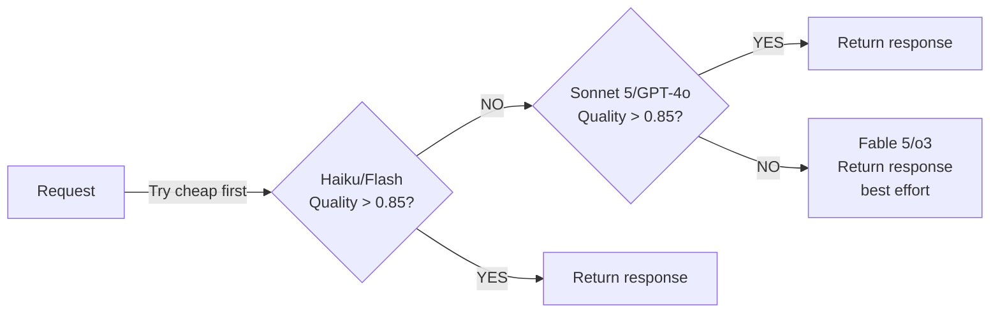

Quality scoring approaches include:

- LLM-as-judge (fast model checking output completeness)
- Length-based heuristics (suspiciously short responses flagged)
- Confidence token analysis (models supporting logprobs)
- Task-specific validators (regex check on structured output; unit tests for code)

### 8.3 Intent-Based Routing

For chat or agentic applications, route based on detected user intent:

| Intent Signal | Routing Decision | Example |
| --- | --- | --- |
| "Write code" / "Fix bug" | Code specialist model | Codestral, GPT-4o |
| "Analyse this document" | Long-context model | Claude Fable 5, Gemini 2.5 Pro |
| "Translate" | Multilingual model | GPT-4o, Qwen2.5, Mistral Large 2 |
| "Summarise" | Efficient model | Haiku, Gemini Flash |
| "Research" / "Reason about" | Reasoning model | Fable 5 (extended thinking), o3 |
| "Look at this image" | Multimodal model | GPT-4o, Gemini 2.5 Pro |
| Keywords: legal / medical / financial | Safety tier + HITL gate | Claude Fable 5 with guardrails |

### 8.4 Latency-Aware Routing

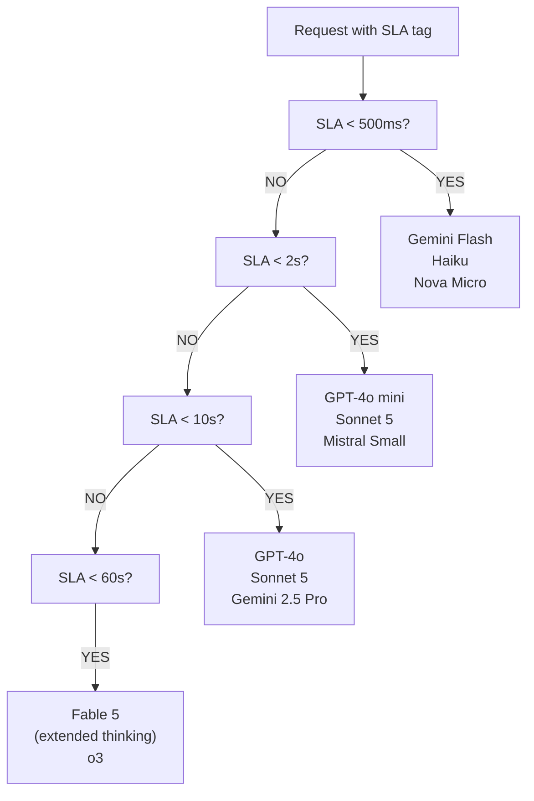

### 8.5 Risk-Aware Routing

Not all tasks are equal in impact of failure:

| Risk Level | Failure Impact | Model Tier | Gate |
| --- | --- | --- | --- |
| **Critical** | Legal, financial, safety consequence | T1 only; highest capability | Mandatory HITL |
| **High** | Customer-facing; reputational | T1; production-stable models | Guardrails enabled |
| **Medium** | Internal; correctable | T1 or T2; most current model | Soft guardrails |
| **Low** | Dev/internal tooling | Any approved tier | Logging only |

---

## Part V — Architecture

## 9. Model Routing Architecture

### 9.1 Architecture Patterns Comparison

See Enterprise AI Architecture Patterns for Pattern 11: Cost Optimisation Routing and Pattern 5: AI Gateway for canonical implementation blueprints.

| Pattern | Description | Best For | Complexity |
| --- | --- | --- | --- |
| **Rule-based** | Static rules map task type to model | Predictable workloads; low ops overhead | Low |
| **Classifier routing** | Lightweight LLM classifies intent and routes | General-purpose enterprise API | Medium |
| **Semantic router** | Embedding similarity routes to specialised handlers | Domain-specific multi-model setup | Medium |
| **Confidence cascade** | Generate cheap, escalate if quality insufficient | Cost minimisation with quality floor | Medium |
| **Latency-aware** | SLA tag determines model tier | Real-time consumer applications | Low-Medium |
| **Cost-aware** | Budget remaining per team determines model | FinOps-governed platforms | Medium |
| **Risk-aware** | Data classification drives model and gate choice | Regulated industries | High |
| **Mixture of Experts** | Ensemble multiple models; aggregate or select best | Research, high-stakes decisions | Very High |
| **Progressive enhancement** | Start simple; add models only where improvement measurable | Cost-conscious iterative build | Medium |

### 9.2 Abstraction Layer Architecture

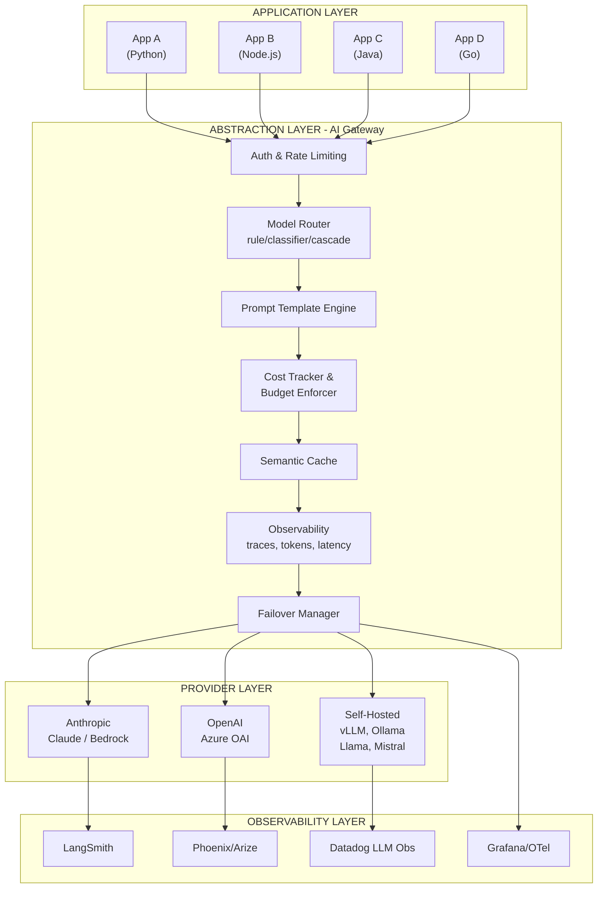

### 9.3 Implementation Tools for the Abstraction Layer

| Tool | Type | Routing | Cost tracking | Self-host | Notes |
| --- | --- | --- | --- | --- | --- |
| **LiteLLM** | Open-source proxy | Yes | Yes | Yes | 100+ providers; OpenAI-compatible; Python |
| **Kong AI Gateway** | Enterprise gateway | Yes | Yes | Yes | Plugin ecosystem; Kubernetes-native |
| **OpenRouter** | Hosted gateway | Yes | Yes | No | External service; good for prototyping |
| **Azure AI Foundry** | Managed gateway | Yes | Yes | No | Azure-centric; model catalog |
| **Amazon Bedrock** | AWS managed | Yes | Yes | No | AWS-native; Bedrock model list only |
| **Google Vertex AI** | GCP managed | Yes | Yes | No | GCP-centric; Vertex model catalog |
| **LangChain Router** | Framework layer | Yes | No | Yes | Code-level routing; no gateway overhead |

See Kong AI Gateway Guide for detailed configuration instructions.

---

## 10. Multi-Model Agent Architecture

### 10.1 Specialised Agent Roles

In complex agentic systems, different models serve different roles based on their strengths. Assigning the right model to each role controls cost while maintaining quality.

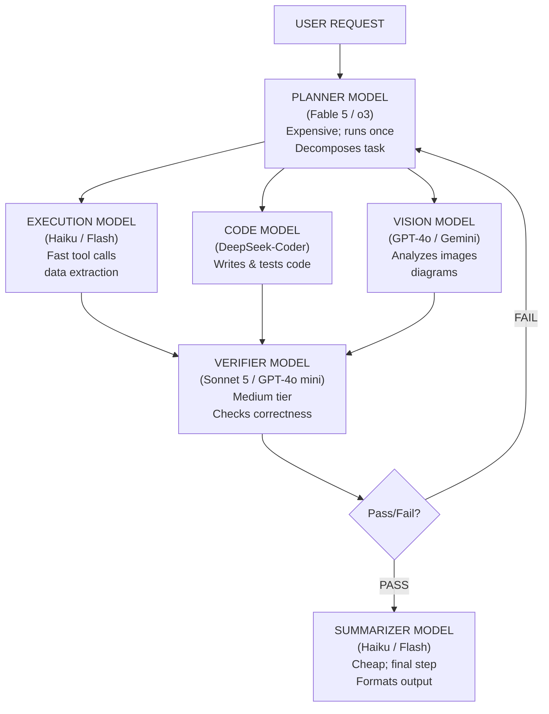

### 10.2 Agent Role to Model Assignment

| Agent Role | Purpose | Recommended Model Tier | Cost Weight |
| --- | --- | --- | --- |
| **Planner** | Goal decomposition, strategy, agent coordination | T1 Premium (Fable 5, o3) | Low (called once) |
| **Reasoner** | Deep analysis, inference chains | T1 Extended thinking | Low-Medium |
| **Executor** | API calls, data extraction, actions | T3 Efficient (Haiku, Flash) | High (called many times) |
| **Code Generator** | Writing and debugging code | T1-T2 Code specialist | Medium |
| **Code Verifier** | Running and validating code output | T2 mid-tier or sandbox | Medium |
| **Retriever** | Finding relevant information (RAG) | Embedding model (separate) | High (per chunk) |
| **Vision Analyst** | Processing images, charts, PDFs | T1 Multimodal (GPT-4o, Gemini) | Medium |
| **Speech Agent** | Audio transcription / TTS | T1 Audio (GPT-4o Realtime) | Medium |
| **Judge / Critic** | Evaluating output quality | T2 mid-tier | Medium |
| **Summariser** | Final synthesis and formatting | T3 Efficient | Medium |
| **Memory Manager** | Context compression, recall | Embedding + T3 | High (background) |

### 10.3 Model Collaboration Patterns

**Sequential (Pipeline):** Output of one model feeds directly to the next.

```
Planner -> Researcher (RAG) -> Writer -> Critic -> Formatter -> Output
```

Cost pattern: high model (once) -> medium (once) -> medium (once) -> low (once)

**Parallel Fan-Out:** Planner spawns multiple specialist models simultaneously.

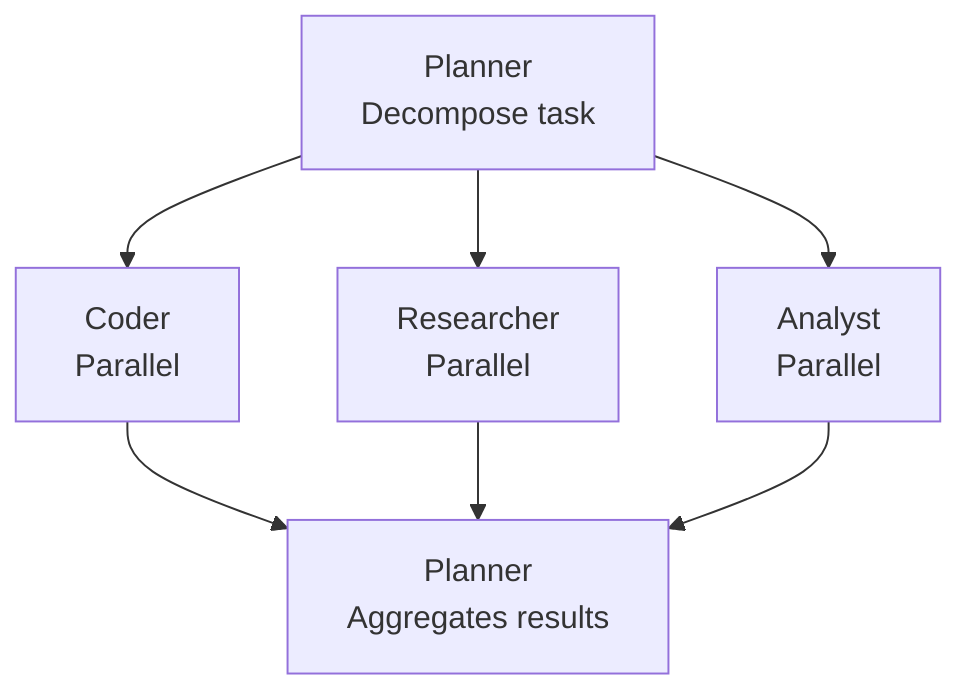

See Enterprise AI Architecture Patterns Parallel Fan-Out Pattern for implementation details.

**Debate / Ensemble:** Multiple models independently answer; a judge selects or synthesises best answer.

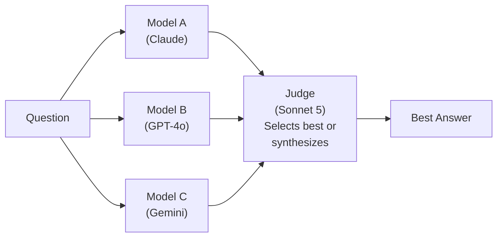

Use for high-stakes decisions, conflict resolution, and reducing single-model hallucination risk. Cost: 3x inference plus judge call.

---

## 11. Context Window Strategy

### 11.1 When to Use Each Context Size

| Context Size | Use Case | Model Options | Trade-off |
| --- | --- | --- | --- |
| **< 32K** | Single document Q&A; short chat; classification | Any model | No constraint |
| **32K – 128K** | Multi-document analysis; codebase context; conversation history | GPT-4o, Llama 3.3, Mistral Large | Cost scales with tokens |
| **128K – 500K** | Full repository analysis; book-length documents; legal contracts | Claude Sonnet 5, Nova Pro | Higher cost; verify model faithfulness |
| **500K – 1M+** | Entire codebases; multi-document legal discovery; research corpus | Claude Fable 5, Gemini 2.5 Pro | Significant cost; loss-in-middle risk |

### 11.2 Context Management Strategies

**Retrieval over stuffing:** For most enterprise use cases, RAG with 10–20 retrieved chunks outperforms naive full-context stuffing at lower cost.

**Hierarchical retrieval:** Chunk, retrieve, and expand context around relevant sections. Better precision than full-document context.

**Context compression:** Use a cheap model (Haiku, Flash) to summarise prior conversation history before each long-horizon agent step.

**Memory layers:**

```
Short-term: Current conversation window (tokens)
Working: Task-specific scratchpad (compressed summaries)
Long-term: Vector store (semantic search)
Episodic: Structured key-value (facts, decisions, tool results)
```

For CALM (Context and Memory) patterns, see Enterprise AI Architecture Patterns CALM Context Management Pattern.

---

## 12. Enterprise Reference Architectures

### 12.1 Small Startup / MVP

**Profile:** 5–20 engineers; <$50K/month AI spend; single cloud.

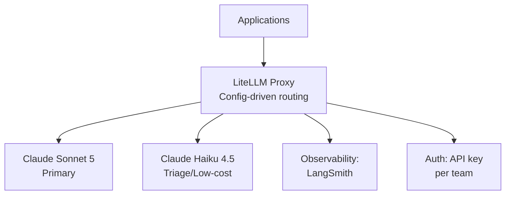

Key decisions: Minimal infrastructure; single commercial provider; simple routing; add complexity only when cost or capability limits appear.

### 12.2 Mid-Size Enterprise

**Profile:** 50–200 engineers; multi-team; $50K–$500K/month AI spend; multi-cloud consideration.

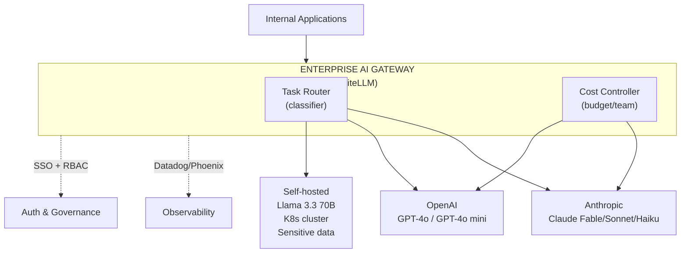

### 12.3 Large Regulated Enterprise (Bank / Insurance / Healthcare)

**Profile:** 500+ engineers; $1M+/month AI spend; strict data residency; compliance requirements.

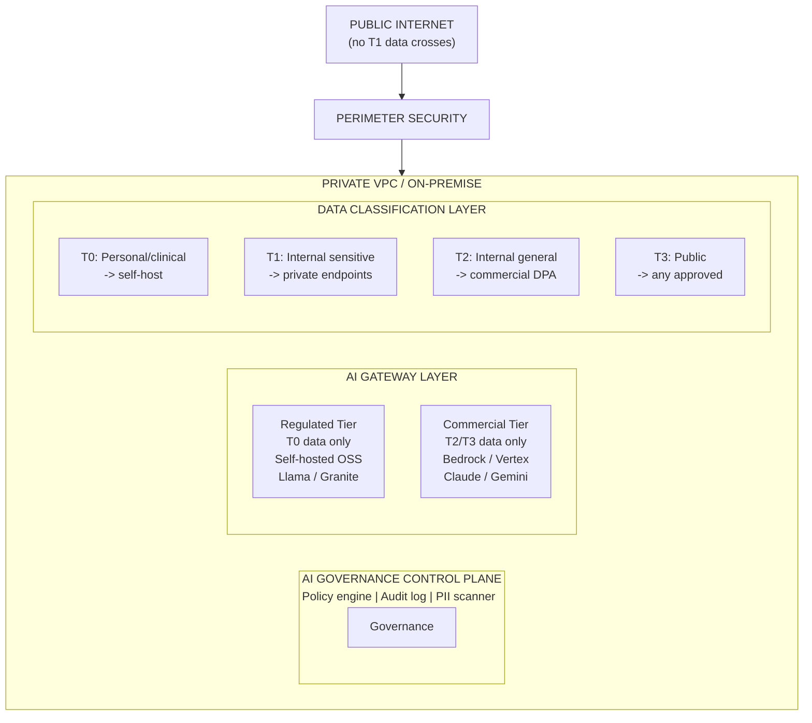

### 12.4 Government / Sovereign AI

**Profile:** National security or data sovereignty requirements; no commercial cloud in some deployments.

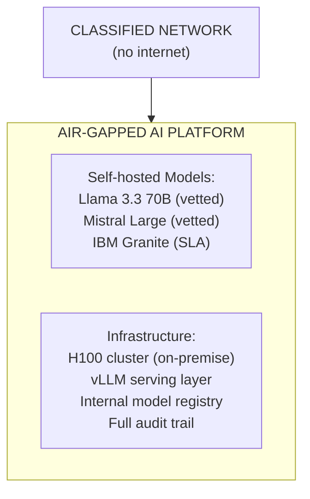

Model weights must be (a) downloaded and verified offline, (b) scanned for trojans/backdoors, (c) signed with internal keys, (d) stored in isolated registry.

### 12.5 Global SaaS / Edge AI

**Profile:** Globally distributed users; data residency by region; latency-sensitive applications.

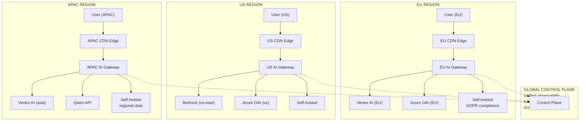

---

## Related

- [Enterprise Multi-Model AI Strategy — Part 1](54-enterprise-multi-model-ai-strategy.md) — Foundational case and model landscape
- [Enterprise Multi-Model AI Strategy — Part 3](pathname:///archon/architecture/parts/19-enterprise-multi-model-ai-strategy-part3) — Operations, governance, future trends
- [Enterprise AI Architecture Patterns](49-enterprise-ai-architecture-patterns.md) — Canonical patterns for routing, caching, evaluation
- [Enterprise AI Architect Foundations](48-enterprise-ai-architect-foundations.md) — Role definition, token economics
- [Kong AI Gateway Guide](pathname:///archon/platforms/kong-ai-gateway-guide) — AI gateway implementation details

## Sources

None (synthesized from public benchmarks, vendor documentation, and enterprise practitioner experience as of Q3 2026).
