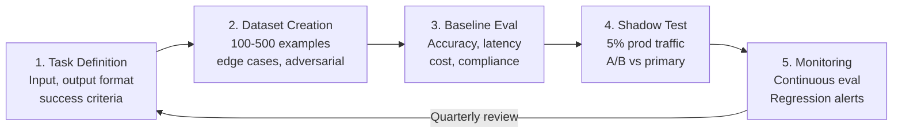
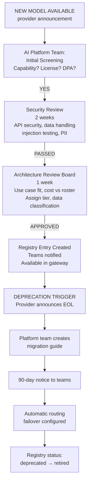
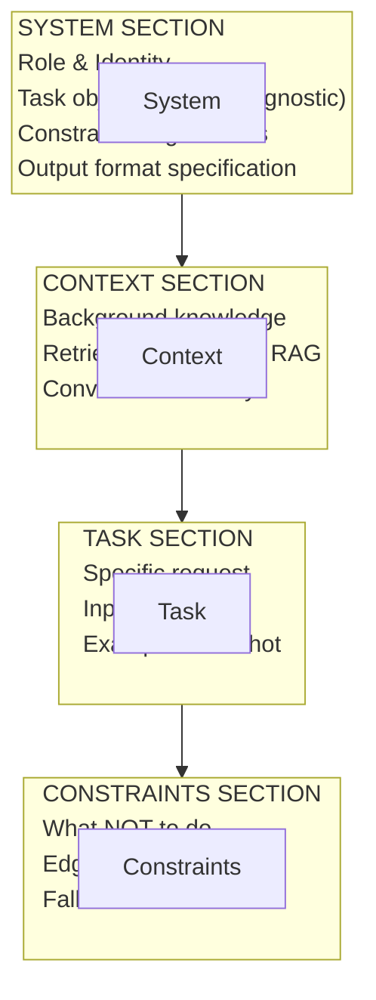

# Enterprise Multi-Model AI Strategy — Operations, Governance & Future Trends (Part 3 of 3)

## Why This Matters

This is **Part 3 of 3** of the definitive enterprise reference for selecting, routing, governing, evaluating, and operating foundation models across an organization. Part 3 covers operational disciplines, governance frameworks, security architecture, and forward-looking trends for multi-model systems. Part 1 established business case and landscape; Part 2 covered decision frameworks and architectures. Together, these parts form a complete playbook for enterprise multi-model strategy.

**Cross-references to other parts:**
- [Part 1: Enterprise Multi-Model AI Strategy — Vendor-Agnostic Guide (Part 1)](54-enterprise-multi-model-ai-strategy.md) — Foundational case and landscape survey
- [Part 2: Enterprise Multi-Model AI Strategy — Technical Comparison, Decision Frameworks & Architecture (Part 2)](18-enterprise-multi-model-ai-strategy-part2.md) — Decision frameworks and architecture patterns

---

## Table of Contents — Part 3

**Part VI — Operations**

13. [Model Evaluation Framework](#13-model-evaluation-framework)
14. [Cost Optimisation](#14-cost-optimisation)
15. [Enterprise Model Registry](#15-enterprise-model-registry)

**Part VII — Governance and Security**

16. [Enterprise Governance](#16-enterprise-governance)
17. [Security](#17-security)
18. [Vendor Lock-in Prevention](#18-vendor-lock-in-prevention)
19. [Prompt Portability](#19-prompt-portability)

**Part VIII — Looking Ahead**

20. [Future Trends 2026–2030](#20-future-trends-20262030)

**Appendices**

- [Best Practices & Anti-Patterns](#best-practices--anti-patterns)
- [Migration Roadmap](#migration-roadmap)
- [Governance Checklist](#governance-checklist)
- [Glossary](#glossary)
- [Further Reading](#further-reading)

---

## Part VI — Operations

## 13. Model Evaluation Framework

### 13.1 Why Benchmark Scores Are Insufficient

Public benchmarks measure narrow, standardised tasks under controlled conditions. Enterprise AI fails for different reasons:

| Benchmark limitation | Enterprise reality |
| --- | --- |
| Clean, formatted inputs | Messy, inconsistent real-world data |
| Single-turn Q&A | Multi-turn conversations with context |
| Public data | Proprietary domain knowledge required |
| Consistent prompts | Varied user phrasing in production |
| Scores averaged across tasks | Your specific task may be an outlier |
| Tested at publication | Models update continuously |

**Rule:** Always benchmark on your own data and tasks before committing a model to production.

### 13.2 Enterprise Evaluation Stack

| Tool | Purpose | OSS? | Notes |
| --- | --- | --- | --- |
| **DeepEval** | Comprehensive LLM eval framework | Yes | Metrics: hallucination, faithfulness, relevance, toxicity |
| **Phoenix (Arize)** | Tracing + eval + LLM observability | Yes | Visual UI; OpenTelemetry-native |
| **Ragas** | RAG-specific evaluation | Yes | Context precision/recall, faithfulness, answer relevance |
| **LangSmith** | Tracing, eval, dataset management | Partial | Best LangChain integration; LangGraph traces |
| **Promptfoo** | Prompt testing, red-teaming, CI eval | Yes | YAML-configurable; runs in CI pipelines |
| **OpenAI Evals** | Evaluation harness | Yes | Provider-agnostic despite name; benchmark library |
| **HELM** | Holistic evaluation | Yes | Stanford; multi-metric; research-grade |
| **PromptBench** | Robustness testing | Yes | Tests sensitivity to prompt variations |

### 13.3 Enterprise Evaluation Dimensions

**Accuracy dimensions:**

- Factual correctness on domain-specific questions
- Faithfulness to provided context (RAG tasks)
- Format compliance (JSON schema, XML structure)
- Task completion rate (did it do what was asked?)

**Safety dimensions:**

- PII leakage rate
- Harmful content refusal rate
- Prompt injection resistance
- Jailbreak resistance

**Operational dimensions:**

- P50 / P95 / P99 latency
- Cost per successful task
- Retry rate (model errors / refusals)
- Throughput under load

**Regression dimensions:**

- Quality delta vs. previous model version
- Behaviour consistency across temperature=0 runs
- Edge case handling

### 13.4 Key Public Benchmarks with Enterprise Relevance

| Benchmark | What It Measures | Enterprise Relevance |
| --- | --- | --- |
| **MMLU** | Knowledge across 57 subjects | Broad domain coverage assessment |
| **GPQA Diamond** | Graduate-level scientific reasoning | Complex domain expertise |
| **HumanEval** | Python code generation | Coding capability baseline |
| **SWE-Bench Verified** | Real GitHub issue resolution | Full software engineering task quality |
| **BigCodeBench** | Diverse code generation | Multi-language coding assessment |
| **GAIA** | General AI assistant tasks | Practical task completion |
| **AgentBench** | Multi-turn agent performance | Agentic reliability |
| **WebArena** | Web navigation tasks | Browser-based automation |
| **TAU-Bench** | Tool-augmented understanding | Tool use quality |
| **LiveBench** | Monthly-updated current tasks | Avoids training data contamination |

### 13.5 Evaluation Pipeline



**Enterprise Model Evaluation Pipeline.** Five-stage continuous process from task definition through dataset preparation, baseline benchmarking, production shadow testing, and ongoing monitoring. Quarterly full reviews and continuous regression alerts ensure models stay fit-for-purpose.

1. TASK DEFINITION: Define input, expected output format, success criteria

2. DATASET CREATION: Golden set of 100–500 representative examples, edge cases (known-hard inputs), adversarial samples (prompt injection, jailbreak attempts)

3. BASELINE EVALUATION: Run all candidate models on dataset. Collect accuracy, latency, cost, format compliance.

4. PRODUCTION SHADOW TEST: Route 5% of real traffic to candidate model. Compare outputs vs. primary model (A/B). Monitor for regression on production distribution.

5. CONTINUOUS MONITORING: Eval harness runs on every model update. Alert if accuracy drops >5% or cost rises >20%. Quarterly full evaluation review.

---

## 14. Cost Optimisation

### 14.1 The Multi-Model Cost Reduction Playbook

The primary lever of multi-model strategy is cost: routing to the cheapest model that can adequately handle each task.

**Observed savings from routing:**

- Simple to efficient model: 60–80% cost reduction on classified tasks
- Semantic caching: 20–40% reduction on repeated or similar queries
- Batch inference: 40–50% reduction (available on Claude, GPT-4o, Gemini)
- Prompt compression: 10–30% reduction with no quality loss on concise prompts

### 14.2 Cost Optimisation Techniques

| Technique | Cost Saving | Quality Impact | Complexity |
| --- | --- | --- | --- |
| **Model routing** (complex to cheap model) | 60–80% | None (if classified correctly) | Medium |
| **Semantic caching** | 20–40% | None | Medium |
| **Batch inference** | 40–50% | None | Low |
| **Prompt compression** | 10–30% | Low if done carefully | Medium |
| **Context caching** | 50–90% on cached tokens | None | Low (provider feature) |
| **Speculative decoding** | 20–40% latency; marginal cost | None | High |
| **Quantisation (self-hosted)** | 30–50% GPU memory | Slight quality loss for INT4 | High |
| **KV cache reuse** | 30–50% on repetitive system prompts | None | Low (provider feature) |
| **Output length control** | 10–50% | Depends on task | Low |
| **Model cascade** | 40–70% | None (with quality gate) | Medium |

### 14.3 Cost Attribution Framework

Tag every AI call before it leaves your gateway:

```yaml
headers:
  X-Cost-Project: "project-id"
  X-Cost-Team: "team-id"
  X-Cost-UseCase: "use-case-slug"
  X-Cost-DataClass: "T2"
  X-Cost-Env: "prod"  # prod / staging / dev
```

This enables:

- Per-team showback/chargeback
- Per-use-case cost baselines
- Anomaly detection (>20% drift from baseline triggers alert)
- Model tier governance (detect T1 model used for T3 task)

### 14.4 FinOps Maturity for AI

| Stage | Capability | Typical Saving |
| --- | --- | --- |
| **Crawl** | Total AI spend tracked; per-project breakdown | Baseline |
| **Walk** | Per-team tagging; top-10 cost drivers identified; model routing live | 30–50% |
| **Run** | Real-time dashboards; anomaly alerts; automatic routing; chargeback; model governance reviews | 50–70% |

See Enterprise AI Architect Foundations for the FinOps Foundation nine-bucket framework.

---

## 15. Enterprise Model Registry

### 15.1 Why a Model Registry Matters

Without a registry, enterprises face:

- Shadow AI — teams using unapproved models with production data
- Audit gaps — no record of which model made which decision
- Ungoverned deprecation — models silently removed; applications break
- No cost visibility — spend scattered across individual accounts

### 15.2 Model Registry Schema

```yaml
# Enterprise Model Registry Entry

model:
  id: "claude-sonnet-5-20250901"
  display_name: "Claude Sonnet 5"
  provider: "Anthropic"
  family: "Claude"
  version: "5.0"
  release_date: "2025-09-01"

capabilities:
  context_window: 1000000
  output_tokens_max: 128000
  vision: false
  audio: false
  function_calling: true
  streaming: true
  batch_inference: true
  structured_output: true
  mcp_support: true

performance:
  # From internal evaluation on enterprise task set
  accuracy_score: 0.91
  hallucination_rate: 0.03
  format_compliance: 0.98
  p50_latency_ms: 1200
  p95_latency_ms: 4500

cost:
  input_per_mtok: 2.00
  output_per_mtok: 10.00
  batch_discount: 0.50
  context_cache_discount: 0.90

governance:
  tier: "T1"              # T1 / T2 / T3
  status: "approved"      # approved / experimental / deprecated / retired
  approval_date: "2026-03-15"
  approved_by: "AI Architecture Review Board"
  security_review: "passed"
  security_review_date: "2026-03-10"
  data_classification_allowed: ["T1", "T2", "T3"]  # NOT T0 (personal/clinical)

compliance:
  soc2_type2: true
  hipaa: true
  gdpr: true
  pci_dss: true
  fedramp: false

regions:
  supported: ["us-east-1", "eu-west-1", "ap-southeast-1"]
  restricted: []

deployment:
  api_endpoint: "https://api.anthropic.com/v1"
  bedrock_model_id: "anthropic.claude-sonnet-5-20250901-v1:0"
  vertex_model_id: "claude-sonnet-5@20250901"
  self_hosting: false

lifecycle:
  expected_deprecation: "2027-09-01"
  successor_model: "claude-sonnet-6"
  migration_guide: "https://docs.anthropic.com/migration/sonnet-5-to-6"

ownership:
  platform_owner: "AI Platform Team"
  business_owner: "AI CoE"
  support_channel: "#ai-platform-support"
```

### 15.3 Registry Governance Workflow



---

## Part VII — Governance and Security

## 16. Enterprise Governance

### 16.1 AI Model Governance Framework

Enterprise model governance answers: Who approves what model for what use, with what controls, and who is accountable?

**Governance bodies:**

| Body | Scope | Cadence | Decisions |
| --- | --- | --- | --- |
| **AI Architecture Review Board** | Model approval, tier assignment | Monthly | Add/remove models from registry |
| **AI CoE (Centre of Excellence)** | Standards, patterns, training | Quarterly | Guidance, tooling selection |
| **Business Unit AI Leads** | Use case approval | Per project | Use case risk assessment |
| **AI Security Team** | Security reviews, incident response | Continuous | Security approval, incident triage |
| **Legal / Compliance** | DPA review, licensing, regulatory | Per vendor | Vendor approval, jurisdiction decisions |

### 16.2 Model Lifecycle Policy

```
RESEARCH -> EXPERIMENTAL -> APPROVED -> DEPRECATED -> RETIRED

Research:      Sandbox only; no production data; self-service
Experimental:  T2/T3 data; limited teams; enhanced monitoring
Approved:      All permitted data classes; full production use
Deprecated:    No new integrations; existing use continues (90-day window)
Retired:       All routing blocked; historical audit retained 7 years
```

### 16.3 Use Case Approval Checklist

Before deploying any AI feature to production:

- Model in T1 or T2 registry with appropriate data classification approval?
- Data classification of inputs assessed and documented?
- PII/sensitive data masked before API call?
- System prompt reviewed and version-controlled?
- Guardrail pipeline configured (content safety, PII detection)?
- HITL gates defined for high-risk actions?
- Fallback model configured?
- Observability: traces, latency, cost, accuracy monitoring active?
- Incident response runbook documented?
- Legal review of outputs (if customer-facing, regulated domain)?
- EU AI Act risk classification completed (if EU deployment)?

### 16.4 Regulatory Framework Alignment

| Regulation | Key AI Requirements | Architecture Response |
| --- | --- | --- |
| **EU AI Act** | High-risk AI systems: transparency, human oversight, accuracy | Risk classification; HITL for high-risk; audit logs |
| **NIST AI RMF** | Govern, Map, Measure, Manage | Governance board; risk registry; evals; incident process |
| **ISO 42001** | AI management system | Policy framework; documented processes; audit readiness |
| **GDPR / CCPA** | No personal data to non-compliant processors | DPA with provider; data masking; EU data residency |
| **HIPAA** | BAA required for PHI | Use Bedrock or Vertex AI with BAA; or self-host |
| **SOX** | Financial data controls; audit trails | Immutable audit logs; access controls; approval workflows |
| **FedRAMP** | US government cloud requirements | AWS GovCloud / Azure Government models only |

---

## 17. Security

### 17.1 Threat Model for Multi-Model Environments

Multi-model architectures expand the threat surface:

| Threat | Attack Vector | Mitigation |
| --- | --- | --- |
| **Prompt injection** | Malicious content in user input manipulates model behaviour | Input sanitisation; prompt injection testing; output validation |
| **Tool abuse** | Agent uses tools in unintended ways | Tool permission scoping; least-privilege tool access; action confirmation |
| **Model poisoning** | Malicious fine-tune or weight modification | Model provenance verification; registry integrity checks; SBOM |
| **Supply chain attack** | Compromised model weights or inference library | Signed model artifacts; dependency scanning; isolated download pipeline |
| **Data exfiltration** | Model leaks training or user data in outputs | Output scanning; PII detection; data classification enforcement |
| **Model denial of service** | Cost-flooding attacks via prompt amplification | Rate limiting per user/team; cost caps; anomaly detection |
| **Cross-tenant data leakage** | Context from one tenant surfaces in another | Tenant isolation; context flushing; dedicated inference endpoints |
| **Insecure MCP connections** | MCP server returns malicious tool results | MCP server authentication; output validation; sandboxed tool execution |
| **A2A trust exploitation** | Rogue agent impersonates trusted agent | Agent identity via mTLS/JWT; permission scopes per agent identity |

### 17.2 Security Architecture Controls

**Network isolation:**

```
Applications -> AI Gateway (DMZ) -> Provider endpoints (TLS 1.3+)
                    |
              Private VPC only (no public internet for self-hosted)
```

**Identity and access:**

- API keys scoped per team, per environment, per model tier
- Short-lived credentials preferred (AWS IAM, Azure Managed Identity)
- API key rotation every 90 days at maximum
- No hardcoded credentials in code; vault-managed secrets

**Data controls:**

- PII scanner at gateway ingress and egress
- Data classification tag enforced before model routing
- All responses logged with retention per data classification
- Encryption at rest and in transit for all AI interactions

**Model integrity (self-hosted):**

```bash
# Verify model weights before loading
sha256sum llama-3.3-70b-instruct.gguf
# Compare against published checksum from Hugging Face / Meta
# Store in internal registry with signature
```

### 17.3 Prompt Security Checklist

- System prompt stored in version control (not hardcoded)
- System prompt injection tested before production deployment
- User input validated and length-limited before model call
- Indirect prompt injection from tool/API responses tested
- Output validation before action execution (especially tool calls)
- Sensitive instructions not in user-visible system prompts
- Prompt templates reviewed for information disclosure risks

---

## 18. Vendor Lock-in Prevention

### 18.1 The Four Lock-in Vectors

| Vector | Mechanism | Risk Level | Mitigation |
| --- | --- | --- | --- |
| **API schema lock-in** | Provider-specific request format | High | OpenAI-compatible abstraction layer |
| **Feature lock-in** | Proprietary features (extended thinking, Realtime API) | Medium | Track feature dependencies; avoid in shared libraries |
| **Embedding lock-in** | Vectors incompatible across providers | High | Store raw text; rebuild index on switch; use portable formats |
| **Fine-tune lock-in** | Custom model on one provider | Very High | Keep labelled dataset; document training config; use open-source base |

### 18.2 Abstraction Layer Design

The abstraction layer is your primary defence against lock-in. Design principles:

1. Single API contract: Applications call your internal API (OpenAI-compatible schema preferred as it has widest adoption).
2. Provider adapters: Each provider implemented as a swappable adapter.
3. Configuration-driven routing: Model selection in config, never hardcoded.
4. Feature flags for proprietary capabilities: Proprietary features are opt-in and isolated.

```python
# WRONG — creates lock-in
import anthropic
client = anthropic.Anthropic(api_key=key)
response = client.messages.create(
    model="claude-fable-5",
    messages=[{"role": "user", "content": prompt}]
)

# RIGHT — abstraction layer
from enterprise_ai import AIClient
client = AIClient(use_case="research-agent")  # routing config drives model selection
response = client.complete(messages=[{"role": "user", "content": prompt}])
```

### 18.3 LiteLLM as the Default Gateway

LiteLLM is the most widely adopted open-source solution for multi-model abstraction:

```yaml
# litellm_config.yaml — define all models in one config
model_list:
  - model_name: "primary-reasoning"
    litellm_params:
      model: "anthropic/claude-fable-5-20251101"
      api_key: "os.environ/ANTHROPIC_API_KEY"

  - model_name: "production-standard"
    litellm_params:
      model: "anthropic/claude-sonnet-5-20250901"
      api_key: "os.environ/ANTHROPIC_API_KEY"

  - model_name: "high-volume-triage"
    litellm_params:
      model: "gemini/gemini-2.0-flash"
      api_key: "os.environ/GOOGLE_API_KEY"

  - model_name: "air-gapped-workload"
    litellm_params:
      model: "ollama/llama3.3:70b"
      api_base: "http://internal-gpu-cluster:11434"

router_settings:
  routing_strategy: "usage-based-routing-v2"
  fallbacks: [{"primary-reasoning": ["production-standard"]}]
  context_window_fallbacks: [{"claude-fable-5": ["gemini-2.5-pro"]}]
```

### 18.4 Prompt Portability

Design prompts to be model-agnostic:

**Avoid model-specific syntax in shared templates:**

```xml
<!-- BAD: Claude-specific XML tags in a shared template -->
<claude_instructions>
  You are an analyst...
</claude_instructions>

<!-- GOOD: Model-agnostic instructions -->
<system>
  You are an analyst. Your task is: {task_description}
  Format your response as: {output_format}
</system>
```

**Model-specific tuning in adapters, not prompts:**

```python
class ModelAdapter:
    def format_prompt(self, template: str, model_id: str) -> str:
        if model_id.startswith("claude"):
            return self._apply_claude_formatting(template)
        elif model_id.startswith("gpt"):
            return self._apply_openai_formatting(template)
        return template  # fallback: use as-is
```

---

## 19. Prompt Portability

### 19.1 Universal Prompt Structure

Structure prompts so the core logic is model-agnostic:



### 19.2 Structured Output Portability

All frontier models support JSON schema enforcement; use it consistently:

```python
# Portable structured output approach
RESPONSE_SCHEMA = {
    "type": "object",
    "properties": {
        "answer": {"type": "string"},
        "confidence": {"type": "number", "minimum": 0, "maximum": 1},
        "citations": {"type": "array", "items": {"type": "string"}}
    },
    "required": ["answer", "confidence"]
}

# Implemented per-provider but same schema
# Claude: tool_choice={"type": "tool"} with matching tool schema
# OpenAI: response_format={"type": "json_schema", "json_schema": ...}
# Gemini: response_mime_type="application/json" + response_schema
```

### 19.3 Few-Shot Example Portability

Few-shot examples are the most portable prompt component. They work identically across all providers. When moving between models, these require no changes. System prompt framing and output format instructions may need minor adaptation.

**Migration checklist when switching models:**

- Re-test all system prompts on new model (10-sample golden set)
- Check structured output compliance (JSON schema may parse differently)
- Verify tool call format (some models use different function call schemas)
- Re-benchmark on task-specific evaluation set
- Check cost impact (token count may differ with same prompt across models)

---

## Part VIII — Looking Ahead

## 20. Future Trends 2026–2030

### 20.1 Model Commoditisation

Foundation model capabilities are converging rapidly at each price tier. GPT-4o-class capability that cost $60/MTok in 2023 costs $2.50/MTok in 2026. This trend continues:

**Implication:** Differentiation will shift from raw capability to:

- Specialisation (domain-tuned models for medicine, law, finance)
- Ecosystem and tooling quality (MCP, A2A, developer experience)
- Reliability and trust (uptime SLAs, safety certifications)
- Data integration and grounding (access to enterprise data)

**Architecture response:** Build abstraction layers that make swapping commodity capability trivial. Invest in evaluation infrastructure to quickly validate new entrants.

### 20.2 Reasoning Models as Standard

Extended thinking / chain-of-thought reasoning modes (Claude thinking, o3, DeepSeek-R1) are moving from premium features to standard capabilities. By 2027, most frontier models will have configurable reasoning depth.

**Implication:** Architecture patterns need to handle variable latency (1s to 60s+ for deep reasoning) and variable cost (2–10x baseline tokens). Design retry and timeout strategies that account for reasoning mode.

### 20.3 Small Language Models (SLMs) for Edge

Phi-4, Gemma 3 4B, Llama 3.2 3B, and similar models are reaching practical utility for many tasks at <5B parameters. On-device inference (phones, IoT, edge servers) becomes viable.

**Implication:** Enterprise architectures will include "edge tier" in the model routing hierarchy. Tasks that can run locally with no network round-trip become cost optimisation opportunities.

### 20.4 Domain-Specific Foundation Models

Purpose-built models for regulated domains are proliferating:

- **Healthcare:** BioMedLM, Med-PaLM 3, clinical fine-tunes of Llama
- **Legal:** Harvey, Thomson Reuters CoCounsel (GPT-4 backbone)
- **Financial:** Bloomberg GPT successors, Morgan Stanley internal
- **Code:** Codestral, Qwen-Coder, StarCoder 2

**Implication:** Domain-specific models may out-perform general models on narrow tasks at lower cost. Add evaluation criteria for domain benchmarks (MedQA, LegalBench, FinBench) alongside general benchmarks.

### 20.5 Mixture-of-Experts (MoE) as Default Architecture

DeepSeek-V3 (671B MoE, ~37B active parameters), Mixtral, and similar architectures show frontier performance at 3–5x lower inference cost than dense models. Most new frontier models are MoE or will be.

**Implication:** Self-hosted open-source MoE models become more attractive. Plan GPU procurement around MoE memory requirements (larger total model weight, smaller active parameters).

### 20.6 Agent-Native Models

Models designed explicitly for agentic use — planning, tool use, long-horizon task completion, and self-reflection — are replacing general-purpose models in agentic contexts. Claude's Agent SDK, OpenAI's o3 for agentic tasks, Google's Gemini 2.0 for agentic scenarios.

**Implication:** Evaluate models specifically on AgentBench and tool-use benchmarks, not just MMLU. Agentic reliability is the primary enterprise differentiator.

### 20.7 Confidential Inference

Azure Confidential Computing, AWS Nitro Enclaves, and specialised confidential AI clouds enable inference where even the cloud provider cannot access inputs or outputs.

**Implication:** Confidential inference may unlock regulated use cases (healthcare, government) that currently require on-premise deployment, without the operational overhead. Evaluate in 2027–2028 for sensitive workloads.

### 20.8 Model Context Protocol (MCP) and A2A Evolution

MCP (Anthropic-originated, now widely adopted) standardises tool connections to models. A2A (Agent-to-Agent) protocol standardises how agents communicate. Both are converging into infrastructure standards.

**Implication:** By 2028, most enterprise AI platforms will use MCP for tool integration and A2A for agent orchestration. Agents designed today with proprietary orchestration patterns will need migration.

### 20.9 Self-Improving Agents

Agents that evaluate their own outputs, generate synthetic training data, and refine their own prompts and tool use are emerging. Initial production deployments in 2026 at major tech companies.

**Enterprise implication:** Self-improving agents are difficult to audit and may drift from intended behaviour. Governance frameworks need explicit policies for agent self-modification and synthetic data generation.

---

## Best Practices & Anti-Patterns

### Do's

| Practice | Why |
| --- | --- |
| Build an AI gateway abstraction layer from day one | Switching cost is 10x higher if you wire providers directly into applications |
| Maintain a tested integration with at least two providers | Single provider failure should not take down AI-dependent services |
| Benchmark on your own data, not just public benchmarks | Model scores on your tasks can differ by 30%+ from published benchmarks |
| Tag every AI call with project / team / use-case / environment | Without tagging, you cannot govern costs or detect anomalies |
| Run evaluations on every model update (automated in CI) | Provider model updates can silently degrade your specific use cases |
| Store raw text alongside embeddings | Allows re-embedding when switching embedding model without re-ingesting data |
| Keep fine-tune training data in your own storage | Fine-tune lock-in is the hardest to escape if you lose the data |
| Define data classification policy before choosing models | Wrong model for sensitive data is a compliance incident |
| Version-control all system prompts | Prompt changes are equivalent to code changes in their impact |
| Test fallback behaviour under provider outage | Fallbacks that are never tested are not reliable |

### Don'ts

| Anti-pattern | Consequence |
| --- | --- |
| Hardcode model IDs in application code | Every model change requires code deploy across all services |
| Use T1 (premium) models for T3 (triage) tasks | 10–50x unnecessary cost; teams hit budget limits prematurely |
| Trust public benchmark rankings for production decisions | Benchmark ≠ your task; always evaluate on representative samples |
| Deploy a new model to production without shadow testing | Silent regressions discovered in production cause user-facing failures |
| Standardise on one model because it's "easiest" | Creates structural lock-in; no fallback; ceiling on cost optimisation |
| Allow teams to use unapproved models with production data | Compliance incident risk; ungoverned spend; no audit trail |
| Ignore model deprecation notices | Application breaks overnight when provider removes support |
| Build model-specific features directly into shared libraries | Creates hidden dependencies that surface only during migration |
| Fine-tune without preserving training data | Loss of fine-tune training data makes model updates impossible |
| Skip prompt injection testing | Production deployments vulnerable to user-controlled prompt manipulation |

---

## Migration Roadmap

### Phase 1: Foundation (Month 1–3)

- Audit all existing AI integrations (models, direct API calls, SDKs)
- Stand up LiteLLM or Kong AI Gateway as abstraction layer
- Migrate highest-traffic integrations to gateway
- Implement API key management via secrets vault
- Add basic tagging for cost attribution
- Define data classification tiers

### Phase 2: Governance (Month 3–6)

- Publish first model registry (even if just a spreadsheet initially)
- Stand up AI Architecture Review Board
- Implement semantic caching for top 5 use cases
- Add basic model routing (classify simple vs complex)
- Baseline evaluation harness for 3 primary use cases
- Security review of all T1 models in registry

### Phase 3: Optimisation (Month 6–12)

- Full multi-model routing across all use cases
- Automated regression eval in CI/CD pipeline
- Self-hosted open-source model for T0 data / air-gap use cases
- Cost dashboards with per-team showback
- Formal model lifecycle process (approval → deprecated → retired)
- Shadow testing pipeline for new model candidates

### Phase 4: Maturity (Month 12–24)

- Chargeback to business unit P&Ls
- Confidential inference evaluation for regulated data
- Multi-region deployment with data residency enforcement
- MCP-standardised tool layer (model-agnostic tool calls)
- Agent evaluation benchmarks integrated into model approval process

---

## Governance Checklist

**Model approval (run for each new model):**

- Vendor DPA signed with legal
- Security assessment completed (API endpoint, data handling)
- License compatible with enterprise use
- Data classification restrictions documented
- Benchmarked on at least 3 representative enterprise tasks
- Tier assigned (T1 / T2 / T3)
- Approved regions documented
- Registry entry created
- Team notification sent

**Use case approval (run for each production deployment):**

- Model in registry with correct data classification approval
- System prompt version-controlled and reviewed
- Guardrails configured
- HITL gates defined (or explicitly waived with justification)
- Fallback model configured and tested
- Observability active (traces, latency, cost, accuracy)
- Incident response runbook documented
- Regulatory compliance check (EU AI Act risk class, GDPR, etc.)

---

## Glossary

| Term | Definition |
| --- | --- |
| **A2A** | Agent-to-Agent — protocol for agents to communicate tasks and results to each other |
| **Abstraction layer** | Software layer that hides provider-specific details; applications call the abstraction, not the provider directly |
| **AI gateway** | Central control plane for AI requests: auth, routing, caching, rate limiting, observability |
| **Batch inference** | Processing many requests together at 40–50% cost discount; latency measured in hours not seconds |
| **CoT** | Chain-of-Thought — explicit reasoning step before answer generation |
| **Context caching** | Provider-side caching of repeated prefix (system prompt, documents) at 90% token cost reduction |
| **Data classification** | Tiering of data sensitivity (T0: regulated personal, T1: sensitive internal, T2: internal, T3: public) |
| **DPA** | Data Processing Agreement — legal contract governing how vendor handles your data |
| **Extended thinking** | Claude's mode for deep reasoning; model generates internal thoughts before final answer |
| **Faithfulness** | Degree to which model response stays within provided context vs. generating ungrounded content |
| **Fine-tuning** | Training a model on custom data to specialise it for a task |
| **HITL** | Human-in-the-Loop — requiring human confirmation before high-stakes model-initiated actions |
| **LLM-as-judge** | Using a language model to evaluate another model's output quality |
| **MCP** | Model Context Protocol — Anthropic standard for tool/resource connections to LLMs |
| **Model registry** | Enterprise catalog of approved models with capabilities, governance, and lifecycle metadata |
| **MoE** | Mixture-of-Experts — architecture where only a subset of model parameters activate per token |
| **MTTR** | Mean Time To Recovery — relevant when a primary model goes down and fallback must activate |
| **Prompt injection** | Attack where malicious content in user input manipulates model instructions |
| **Quantisation** | Reducing model weight precision (FP16 to INT8 to INT4) to reduce memory and increase inference speed |
| **RAG** | Retrieval-Augmented Generation — grounding model responses in retrieved documents |
| **Semantic cache** | Cache that matches semantically similar (not just identical) queries to reduce redundant model calls |
| **Shadow testing** | Routing a fraction of real traffic to a candidate model to compare with primary model in production conditions |
| **SLM** | Small Language Model — sub-10B parameter models suitable for edge and on-device inference |
| **T0/T1/T2/T3** | Data classification tiers (T0 = most sensitive, T3 = public) |
| **TTFT** | Time to First Token — latency metric measuring how quickly model begins generating output |
| **vLLM** | Open-source high-throughput inference engine for self-hosted models; uses PagedAttention |
| **Vendor lock-in** | Dependency on a specific provider that makes switching costly or disruptive |

---

## Further Reading

**Vendor Documentation**

- [Anthropic Documentation](https://docs.anthropic.com) — Claude API, Agent SDK, MCP
- [OpenAI API Reference](https://platform.openai.com/docs) — GPT-4o, o3, function calling
- [Google Vertex AI Docs](https://cloud.google.com/vertex-ai/docs) — Gemini on GCP
- [AWS Bedrock Documentation](https://docs.aws.amazon.com/bedrock) — Multi-model managed service

**Standards and Frameworks**

- [NIST AI Risk Management Framework](https://www.nist.gov/system/files/documents/2023/01/26/AI%20RMF%201.0.pdf)
- [EU AI Act Full Text](https://artificialintelligenceact.eu)
- [ISO/IEC 42001:2023](https://www.iso.org/standard/81230.html) — AI Management Systems
- [FinOps Foundation AI FinOps Framework](https://www.finops.org/wg/ai-finops/)

**Benchmarks and Evaluation**

- [HELM Benchmark](https://crfm.stanford.edu/helm/) — Stanford holistic evaluation
- [SWE-Bench](https://www.swebench.com) — Real-world software engineering tasks
- [LiveBench](https://livebench.ai) — Contamination-free monthly benchmark
- [LMSYS Chatbot Arena](https://lmarena.ai) — Human preference leaderboard

**Tools and Frameworks**

- [LiteLLM](https://github.com/BerriAI/litellm) — Multi-provider proxy; 100+ models
- [DeepEval](https://github.com/confident-ai/deepeval) — LLM evaluation framework
- [Phoenix (Arize)](https://github.com/Arize-ai/phoenix) — LLM tracing and evaluation
- [Ragas](https://github.com/explodinggradients/ragas) — RAG evaluation
- [Promptfoo](https://github.com/promptfoo/promptfoo) — Prompt testing and red-teaming

**Internal Cross-References**

- [Enterprise AI Architect Foundations](48-enterprise-ai-architect-foundations.md) — Role, token economics, integration patterns
- [Enterprise AI Architecture Patterns](49-enterprise-ai-architecture-patterns.md) — 15 canonical patterns including routing, caching, evaluation
- [Enterprise AI Governance & Compliance](51-enterprise-ai-governance-compliance.md) — Governance framework detail
- [Kong AI Gateway Guide](pathname:///archon/platforms/kong-ai-gateway-guide) — AI gateway implementation
- [Claude Models 2026](pathname:///archon/agentic-systems/coding-tools/claude-models-2026) — Claude model reference

---

## Related

- [Enterprise Multi-Model AI Strategy — Part 1](54-enterprise-multi-model-ai-strategy.md) — Foundational case and model landscape
- [Enterprise Multi-Model AI Strategy — Part 2](18-enterprise-multi-model-ai-strategy-part2.md) — Technical comparison, decision frameworks, architecture
- [Enterprise AI Architecture Patterns](49-enterprise-ai-architecture-patterns.md) — Canonical patterns for routing, caching, evaluation
- [Enterprise AI Governance & Compliance](51-enterprise-ai-governance-compliance.md) — Governance framework detail
- [Enterprise AI Architect Foundations](48-enterprise-ai-architect-foundations.md) — Role definition, token economics

## Sources

None (synthesized from public benchmarks, vendor documentation, and enterprise practitioner experience as of Q3 2026).
