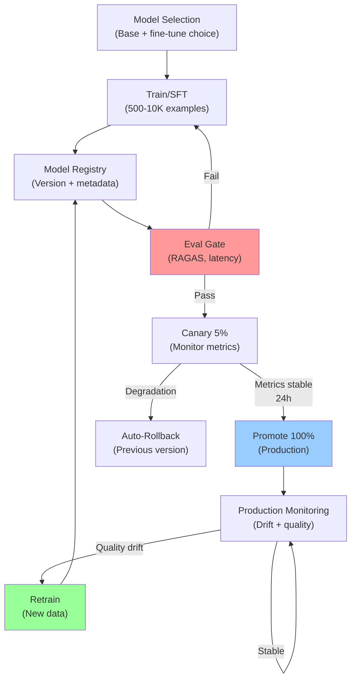

# Enterprise AI Architect Bible (Part 2 of 2)

The definitive MAANG-targeted preparation guide for senior technologists with 20+ years of experience in Data Science, Data Engineering, and Solution Architecture.

Edition April 2026. This is Part 2 of 2. For foundational concepts, see [Part 1: LLM Architecture, Agentic Systems, and RAG](pathname:///archon/architecture/72-enterprise-ai-architect-bible-2026).

This document covers LLMOps & Production AI Engineering, AI Safety & Governance & Ethics, MAANG System Design Playbook, and Portfolio/Career Strategy.

---

## LLMOps & Production AI Engineering

Getting an AI system to work in a demo is easy. Making it reliable, observable, and improvable in production at billion-user scale is the hard part. LLMOps is the discipline that bridges this gap. This section covers the full production AI lifecycle: fine-tuning, serving, CI/CD for models, observability, and the infrastructure engineering behind it all.

### Fine-Tuning: When, Why, and How

Fine-tuning is often the wrong answer. Most enterprise AI problems should be solved with better prompting, RAG, or model selection before reaching for fine-tuning. But when fine-tuning is the right answer, you need to know the full technical landscape.

#### Decision Framework: Prompt vs RAG vs Fine-tune

| Scenario | Recommended Approach | Rationale |
|---|---|---|
| Need domain knowledge from private docs | RAG | Dynamic retrieval, no retraining needed |
| Need consistent output format / style | Prompt engineering + few-shot | Fastest, cheapest, most maintainable |
| Need to reduce costs on high-volume repetitive task | Fine-tune small model (SFT) | Smaller model matches large model on narrow task |
| Need to teach a new capability not in base model | Fine-tuning (SFT + RLHF) | Fundamental behavior change requires weight updates |
| Need model to refuse certain behaviors | RLHF / DPO / Constitutional AI | Safety alignment is a fine-tuning problem |
| Need domain-specific reasoning patterns | Fine-tune on chain-of-thought examples | Teaches reasoning style, not just answers |

#### Fine-Tuning Techniques

- **SFT (Supervised Fine-Tuning).** Train on (input, desired_output) pairs. The foundation of all fine-tuning. Requires 500–10K high-quality examples minimum. Quality >> Quantity—1K carefully curated examples beat 100K noisy ones.
- **LoRA (Low-Rank Adaptation).** Instead of updating all weights, add small rank-decomposed matrices alongside frozen base weights. Reduces trainable parameters by 99%+, enabling fine-tuning on a single A100. The standard approach for 7B–70B models.
- **QLoRA.** LoRA on a quantized (4-bit) base model. Enables fine-tuning a 70B model on a single 48GB GPU. ~5% quality penalty vs full LoRA—acceptable for most use cases.
- **DPO (Direct Preference Optimization).** Trains model on (chosen, rejected) response pairs without needing a separate reward model. More stable than RLHF, less compute-intensive. The current standard for alignment fine-tuning.
- **GRPO (Group Relative Policy Optimization).** DeepSeek-developed RLHF variant. Uses group-relative rewards instead of a value network. State-of-the-art for mathematical reasoning fine-tuning.
- **PEFT (Parameter-Efficient Fine-Tuning).** Umbrella term for LoRA, Prefix Tuning, Prompt Tuning, IA3. Hugging Face's PEFT library provides unified API for all variants.

### Model Serving Infrastructure

| Serving Solution | Best For | Key Features | Throughput | Complexity |
|---|---|---|---|---|
| vLLM | High-throughput production, all models | PagedAttention, continuous batching | Highest OSS | Medium |
| TGI (Hugging Face) | Hugging Face ecosystem, simple deployment | Flash Attention 2, AWQ support | High | Low |
| NVIDIA Triton Inference Server | Enterprise, multi-model serving, optimization | Custom backends, ensemble models | Very High | High |
| AWS SageMaker Inference | AWS-native, managed, auto-scaling | Managed scaling, model registry integration | High | Low |
| Vertex AI Prediction | GCP-native, Gemini ecosystem | Managed, A/B testing, traffic splitting | High | Low |
| LiteLLM | Multi-provider abstraction, cost routing | 100+ LLM providers in one API | Pass-through | Very Low |
| Ollama | Local/edge deployment, development | Simple setup, model library | Low | Very Low |

### CI/CD for Models and Prompts

Production AI systems require version control and automated testing for both model weights and prompts. Most teams treat prompts as static text—a costly mistake. Prompt regressions are as real as code regressions, and just as damaging.

**LLMOps Continuous Improvement Cycle.** Model versions move through eval gates, canary deployment with automated rollback, then production monitoring that triggers retraining when drift is detected. Complete automation reduces manual incident response and enables rapid model iteration at scale.

- **Model Registry.** Every model version (base + fine-tuned) is registered with metadata: training data hash, hyperparameters, eval metrics, and deployment history. MLflow Model Registry and Vertex AI Model Registry are the leading solutions.
- **Prompt Version Control.** Prompts are code. Store in Git with PR reviews. Use LangSmith, PromptLayer, or Weave for prompt experiment tracking. Each prompt version has an associated eval score.
- **Eval Gate in CI.** Every model or prompt change triggers an automated eval run. If RAGAS faithfulness drops > 3% or latency P95 increases > 15%, the CI pipeline blocks deployment. No human can override without documented exception.
- **Canary Deployment.** New model version serves 5% of traffic. Monitor faithfulness, latency, error rate, and user satisfaction proxy (thumbs down rate, re-query rate). Auto-promote to 100% if metrics are stable for 24 hours. Auto-rollback if any metric degrades > threshold.
- **Shadow Mode.** Run the new model in parallel with production, logging outputs without serving them to users. Compare outputs offline. Catch regressions before any user sees them.
- **A/B Testing.** For UX-facing changes, run controlled experiments with statistical significance testing. Use Thompson Sampling for faster convergence vs fixed-allocation A/B tests.

### LLM Observability

LLMs are inherently opaque—they don't throw exceptions when they hallucinate or produce low-quality outputs. Observability is how you see inside the black box. Think of it as distributed tracing for AI systems.

- **Traces and Spans.** A trace captures the full execution of one user request, from input through all LLM calls, tool invocations, and retrievals, to final output. Each step is a span with timing, token counts, and input/output payloads. LangSmith, Arize Phoenix, and OpenTelemetry are the leading solutions.
- **LLM-as-Judge Monitoring.** Deploy a lightweight judge model that evaluates production outputs in real time for faithfulness, relevance, and safety. Route flagged outputs to human review. This is your production equivalent of unit tests.
- **Token Usage Tracking.** Track input tokens, output tokens, cached tokens, and model tier per request. Attribute to product feature, user cohort, and agent type. This is the FinOps data layer.
- **Drift Detection.** Monitor output quality metrics over time. Embedding distribution drift (input queries shifting) and output quality drift (faithfulness declining) signal that the system needs retraining or prompt revision.
- **Error Classification.** Classify failures: hallucination, refusal, tool call error, timeout, context overflow, format violation. Each type requires a different mitigation strategy.

| Tool | Primary Use | Strengths | OSS? |
|---|---|---|---|
| LangSmith | Tracing, prompt management, eval | Best LangChain integration, UI, eval framework | No (managed) |
| Arize Phoenix | LLM observability, drift detection, evals | Best open source observability, embeddings viz | Yes |
| Helicone | API proxy observability, cost tracking | Zero-code integration, detailed cost attribution | Yes (self-host) |
| Weights & Biases (Weave) | Experiment tracking + LLM tracing | Best W&B integration, rich experiment UI | No (managed) |
| OpenTelemetry | Vendor-agnostic distributed tracing | Standard protocol, integrates everywhere | Yes |
| MLflow | Experiment tracking, model registry, evals | Comprehensive MLOps platform, self-hostable | Yes |

### GPU Infrastructure Design

At MAANG scale, GPU infrastructure design is an architectural discipline. You won't be choosing between GPU types at an interview, but you must reason coherently about compute requirements and tradeoffs.

- **GPU Memory Sizing.** Rule of thumb: model parameters × 2 bytes (FP16) for inference. A 70B model needs ~140GB VRAM minimum. Add KV cache overhead for long-context inference. This determines whether you need 1, 2, or 4 H100s.
- **Tensor Parallelism vs Pipeline Parallelism.** Tensor parallelism (splits weight matrices across GPUs) reduces latency but requires high inter-GPU bandwidth (NVLink). Pipeline parallelism (assigns layers to GPUs) is more bandwidth-efficient but adds pipeline bubble latency. Use tensor parallelism for low-latency serving, pipeline for large models where tensor parallelism doesn't fit.
- **Spot / Preemptible Instances.** Use spot instances for batch inference and fine-tuning (70% cost reduction). Use on-demand for real-time serving. Design batch jobs to checkpoint frequently for spot interruption recovery.
- **Multi-tenant Controls.** Kubernetes with NVIDIA GPU Operator enables fractional GPU allocation, namespace isolation, and priority queuing. Critical for sharing GPU clusters across teams with different SLA requirements.
- **Custom Silicon.** Google's TPUs, AWS Trainium, and NVIDIA H100/H200 have distinct performance profiles. TPUs excel at large-scale training; H100s are more versatile for mixed inference/training workloads.

---

## AI Safety, Governance & Ethics

At Staff and Principal level, you own the AI governance framework for your organization or product area. This is not a soft skill—it requires deep technical knowledge of safety mechanisms, regulatory requirements, bias detection, and audit infrastructure. Every MAANG interview at senior level includes Ethical AI scenarios.

### Safety Architecture

Safety in AI systems operates at multiple layers: the model level, the application level, and the infrastructure level. Architects must design defense-in-depth safety architectures that remain robust even when individual layers fail.

#### Constitutional AI & RLHF

- **Constitutional AI (Anthropic).** The model is trained with a set of principles it must follow. During RLHF, the model critiques its own outputs against these principles and revises them. The principles are explicit, auditable, and updatable without full retraining.
- **RLHF (Reinforcement Learning from Human Feedback).** Human raters evaluate model outputs for helpfulness, harmlessness, and honesty. A reward model is trained on these ratings, then used to fine-tune the base LLM via PPO. Effective but expensive and sensitive to rater quality.
- **DPO for Safety.** Safer alternative to RLHF. Train directly on (safe_response, unsafe_response) pairs without a separate reward model. More stable, cheaper, increasingly preferred.
- **Output Classifiers.** Deploy safety classifiers that evaluate every LLM output before returning to users. Llama Guard (Meta) and ShieldGemma (Google) are open-source options. Run as a lightweight parallel call to minimize latency impact.

### Agentic-Specific Safety Risks

Agentic systems introduce safety risks that don't exist in single-call LLM interactions. The combination of tool access, multi-step execution, and reduced human oversight creates novel threat surfaces that architects must design against explicitly.

#### Prompt Injection

Malicious content in retrieved documents, tool outputs, or user inputs attempts to override the agent's system prompt and redirect its behavior. This is the most common and most dangerous agentic attack vector.

Mitigations: Sandboxed tool execution environments; input/output sanitization; instruction hierarchy (system prompt has unconditional precedence); suspicious pattern detection in retrieved content.

#### Tool Privilege Escalation

An agent granted minimal permissions uses a chain of tool calls to achieve elevated access—analogous to a privilege escalation attack in traditional security.

Mitigations: Capability-based security (agents receive minimal tools for their task); tool call audit logging; anomaly detection on tool usage patterns; human approval for irreversible actions.

#### Reward Hacking / Goal Misspecification

An agent optimizing for a proxy metric finds unexpected ways to maximize it that violate the spirit of the task—Goodhart's Law applied to AI agents.

Mitigations: Specify constraints alongside objectives; use outcome validators that check multiple criteria; implement hard guardrails for known problematic behaviors; continuous human oversight for autonomous agents.

#### Data Exfiltration

An agent with access to sensitive enterprise data is manipulated into exfiltrating it via MCP tool calls, email, or API calls.

Mitigations: Data classification-aware tool policies; egress controls and allowlisting; DLP (Data Loss Prevention) integration; agent output auditing for PII/sensitive data patterns.

#### Cascading Failures

In multi-agent systems, one agent's incorrect output becomes another agent's input, amplifying errors across the pipeline. Each agent trusts the output of the previous agent without independent verification.

Mitigations: Output validation schemas between agents; confidence thresholds for inter-agent handoffs; independent verification agents at critical junctions; circuit breakers for anomalous output patterns.

### Bias Detection & Fairness

- **Demographic Parity.** The model's outcome rates should be similar across demographic groups (gender, race, age). Use population sampling to measure disparate impact ratios. Flag if any group's outcome rate differs by more than 20% from the baseline group.
- **Equalized Odds.** The model's false positive and false negative rates should be similar across groups. Demographic parity can mask unequal error distributions—always check both.
- **Calibration.** The model's stated confidence should match actual accuracy. A model that says "I'm 90% confident" should be correct 90% of the time across all demographic groups.
- **Intersectional Analysis.** Bias often amplifies at intersections (e.g., young Black women vs young Black men vs older Black women). Always test intersectional cohorts, not just individual demographic dimensions.
- **Tools.** IBM AI Fairness 360, Aequitas, Fairlearn (Microsoft), What-If Tool (Google). Integrate into the model evaluation pipeline as mandatory checks before production deployment.

### Regulatory Landscape

| Regulation | Jurisdiction | Key Requirements | Architect Implications |
|---|---|---|---|
| EU AI Act (2026 enforcement) | European Union | Risk categorization, conformity assessment, human oversight for high-risk AI | Design risk assessment into architecture; document all AI decision points; ensure human override capability |
| NIST AI RMF | USA (voluntary) | Govern, Map, Measure, Manage framework | Implement AI risk register; continuous monitoring; stakeholder communication |
| GDPR / CCPA | EU / California | Data subject rights, consent, right to explanation | Implement explainability layer; data retention policies; model output audit trails |
| HIPAA AI guidance | USA (healthcare) | PHI protection in AI training and inference | Data anonymization pipelines; access controls; breach notification procedures |
| SOC 2 Type II for AI | USA (enterprise trust) | Security, availability, confidentiality controls | Audit logging, access controls, incident response for AI systems |
| NYC Local Law 144 | New York City (HR AI) | Bias auditing for automated employment decisions | Annual third-party bias audits; candidate notification requirements |

### Enterprise AI Governance Framework

An AI Governance Framework is the operational structure that ensures AI systems are developed, deployed, and monitored responsibly. At MAANG scale, this must be systematized, not dependent on individual judgment.

- **AI Risk Register.** Document every AI system in production with: purpose, data sources, model type, risk tier (low/medium/high), regulatory requirements, bias test results, and incident history.
- **Model Cards.** For every production model, maintain a model card documenting: intended use, out-of-scope uses, training data summary, evaluation results by demographic group, known limitations, and update history.
- **AI Review Board.** Multi-disciplinary review (legal, ethics, security, product, engineering) for any high-risk AI deployment. Define clear criteria for what requires review vs expedited approval.
- **Incident Response for AI.** Define AI-specific incident categories (hallucination, bias discovery, adversarial attack, model degradation). Assign severity levels and escalation paths. Run regular red team exercises.
- **Responsible AI Documentation.** Datasheets for datasets (Gebru et al.), model cards (Mitchell et al.), and system cards for complex multi-component AI systems. These are audit artifacts, not marketing documents.

---

## MAANG System Design Playbook

System design is where senior AI Architect interviews are won or lost. MAANG interviewers are not looking for the "correct" answer—they don't exist. They are evaluating how you decompose complexity, reason about tradeoffs, handle constraints, and communicate your thinking. This section gives you a repeatable framework and 10 canonical problems.

### AI System Design Framework

Apply this framework consistently across every system design question. Deviating from structure is how candidates run out of time and miss critical dimensions.

#### Step 1: Clarify Requirements (5 min)

- Scale: How many users? Queries per second? Data volume? Geographic distribution?
- Latency: Real-time (&lt;500ms), near-real-time (&lt;5s), or batch acceptable?
- Quality: What does "good enough" mean? How is success measured?
- Constraints: Budget cap? Existing infrastructure? Compliance requirements?
- Failure modes: What happens when the AI is wrong? Who is the downstream victim?

#### Step 2: High-Level Architecture (10 min)

- Sketch the major components: data sources, ingestion, storage, model serving, API layer, monitoring.
- Draw data flow: how does a query move through the system end-to-end?
- Identify the critical path: which component determines overall latency?
- Name the tech choices at each layer and briefly justify them.

#### Step 3: Deep Dive on Critical Components (15 min)

- Choose 2–3 components that are most interesting or most risky.
- Design them in detail: data structures, algorithms, scaling mechanisms.
- Address the hardest problems: consistency, fault tolerance, cold start, data freshness.

#### Step 4: Scale & Reliability (5 min)

- How does the system behave at 10x current load? 100x?
- What are the single points of failure? How are they mitigated?
- Data consistency model: eventual vs strong consistency for each store.
- Observability: what metrics, traces, and alerts are needed?

#### Step 5: Tradeoffs & Alternatives (5 min)

- What did you trade off to make this design? What would you change if constraints changed?
- What alternatives did you consider and why did you reject them?
- What would you build differently if cost were no constraint? If latency were no constraint?

### 10 Canonical Design Problems with Solutions

#### Problem 1: Design a Multi-Agent Travel Planning System

Design an AI agent that can plan a complete trip: book flights, hotels, and restaurants, and adapt to real-time changes. Handle tool failures and prevent infinite loops.

**Key Components:**

- **Orchestrator Agent.** Uses Plan-and-Execute pattern. Plans itinerary with frontier model, delegates booking subtasks to specialized agents.
- **Specialist Agents.** FlightAgent, HotelAgent, RestaurantAgent—each with domain-specific tools and error handling.
- **MCP Tool Layer.** Booking APIs (Amadeus, Booking.com) exposed as MCP tools with standardized schemas.
- **Loop Prevention.** Max iteration counter + state hash comparison. If agent revisits same state, escalate to human.
- **Failure Recovery.** Each specialist has retry logic, fallback providers, and graceful degradation (skip restaurant if all fail, return plan with caveat).
- **State Management.** LangGraph with checkpointing. User can pause, inspect, and modify the plan at any step.

**Scale notes:** For 1M users/day: async task queue (Temporal), heterogeneous model routing (GPT-5 for planning, GPT-4o-mini for execution), result caching for popular routes.

#### Problem 2: Design an Enterprise RAG System at 10M Queries/Day

Build a RAG system for a Fortune 500 company with 50M internal documents, 10M daily queries, sub-3-second P95 latency, and strict data access controls.

**Key Components:**

- **Ingestion Pipeline.** Apache Kafka for document change events, distributed chunking workers, embedding generation (GPU cluster), Weaviate for storage. Process 1M doc updates/day.
- **Access Control.** Row-level security in Weaviate using document ACLs mirrored from the source system. Query filter applied before retrieval—never post-filter (security + performance).
- **Query Pipeline.** Query expansion (3 phrasings) → hybrid search (BM25 + vector) → cross-encoder rerank → context assembly → LLM generation.
- **Caching Layer.** Semantic cache (Redis + embedding similarity) for top 20% of queries (typically 60–70% cache hit rate for enterprise use cases). Reduces LLM cost by 60%.
- **Model Tier.** Haiku/GPT-4o-mini for simple factual queries, Sonnet/GPT-4o for complex reasoning—auto-classified by a lightweight router model.
- **Observability.** RAGAS metrics in production (sampled 5%), P95 latency per query type, cache hit rate, cost-per-query dashboard.

**Scale notes:** Horizontal scaling: read-replicas for Weaviate, auto-scaling query workers, regional deployment for global latency. 10M queries/day = ~116 QPS peak (assume 3x peak factor: ~350 QPS burst).

#### Problem 3: Design YouTube Shorts Recommendation with AI

Design a recommendation engine for YouTube Shorts that balances immediate engagement (swipe patterns) with long-term user satisfaction and platform health.

**Key Components:**

- **Feature Store.** Real-time features (last 10 swipes, current session context) in Redis. Batch features (7-day watch history, content preferences) in BigTable. Feast for feature serving.
- **Multi-Objective Ranking.** Optimize simultaneously for watch time, completion rate, like probability, and long-term retention signal. Use Pareto-optimal frontier to balance objectives.
- **Exploration vs Exploitation.** Epsilon-greedy with decay for new users; Thompson Sampling for established user profiles. Reserve 10% of recommendations for exploration.
- **Real-Time Feedback Loop.** Swipe-away within 2s → negative signal. Full watch + replay → strong positive. Update user embedding in real time using streaming ML (Flink + online learning).
- **Diversity Constraints.** Enforce topic diversity (no more than 3 consecutive same-topic videos) and creator diversity. Hardcoded constraints override ranking scores.
- **Safety Layer.** Pre-filter content with Llama Guard classifier. Post-filter recommendation slate for policy violations before serving.

**Scale notes:** 500M daily active users. Candidate generation must reduce 1B+ videos to ~1000 candidates per user in &lt;50ms. Use ANN (ScaNN) on pre-computed video embeddings. Ranking &lt; 100ms.

#### Problem 4: Design a Code Review AI Agent

Build an AI agent that reviews code PRs for bugs, security issues, style violations, and architectural concerns. Must integrate with GitHub, provide actionable feedback, and learn from developer acceptance/rejection of suggestions.

**Key Components:**

- **Trigger.** GitHub webhook on PR open/update → message queue → code review orchestrator.
- **Multi-Agent Pipeline.** SecurityAgent (OWASP checks, vulnerability patterns), ArchitectureAgent (design pattern violations, dependency issues), StyleAgent (linting, naming conventions), SummaryAgent (synthesizes findings).
- **Context Assembly.** Diff + affected files + test coverage report + similar past PRs (RAG from code embedding store) + repo architecture documentation.
- **Feedback Ranking.** Prioritize findings by severity (Critical > Major > Minor). Suppress low-severity findings if PR is already large. Group related findings.
- **Learning Loop.** When developer accepts a suggestion → positive signal. When developer dismisses with explanation → extract reasoning for few-shot examples. Retrain monthly.
- **Latency.** P95 &lt; 60 seconds for PRs &lt; 500 lines. Async processing with GitHub commit status check showing progress.

**Scale notes:** For a large enterprise: 50K PRs/day. Queue-based architecture with priority routing (small PRs get priority). Cost control: use Haiku for style checks, Opus for architecture analysis.

#### Problem 5: Design an AI-Powered Customer Service System

Build an AI customer service system that can resolve 70% of tickets autonomously while seamlessly escalating to human agents for the remaining 30%. SLA: &lt; 30s for initial response.

**Key Components:**

- **Intent Classifier.** Lightweight model (fine-tuned Phi-3) classifies intent and complexity. Routes simple (FAQ, order status) to fully autonomous; complex (refund dispute, technical issue) to HITL.
- **Knowledge Base RAG.** Product documentation, past resolved tickets, and support runbooks in hybrid retrieval. Updated in near-real-time via event stream from CMS.
- **Action Agents.** OrderLookupAgent, RefundAgent, AccountAgent—each with bounded permissions and confirmation requirements before irreversible actions.
- **Escalation Protocol.** Confidence &lt; threshold → human escalation with full context summary. Customer dissatisfaction signal (explicit request, sentiment detection) → immediate human handoff.
- **Human Agent Interface.** AI prepares a briefing (issue summary, customer history, attempted resolutions, recommended next action) before human takes over. Human never starts from scratch.
- **Quality Loop.** Human agent rates AI's briefing quality and marks resolution success. Low-rated sessions feed into fine-tuning dataset.

**Scale notes:** Tiered capacity: AI agents handle burst (no queue); human agents have fixed capacity with SLA-based queuing. Real-time capacity dashboard routes excess volume.

### Behavioral & Leadership Questions by Company

#### Amazon

- Describe a time you dived deep into a technical problem and discovered the root cause that others had missed. (Dive Deep)
- Tell me about a time you had to make a difficult decision with incomplete data and limited time. (Bias for Action)
- Give an example of when you earned trust by being transparent about a failure. (Earn Trust)
- Describe the largest or most complex system you've architected. What were the tradeoffs you made? (Think Big)
- Tell me about a time you simplified a complex technical system significantly. (Frugality + Simplify)

#### Google

- Tell me about a time your AI model failed in production. What happened, what was the impact, and what did you change? (Googleyness: humility + learning)
- Describe a situation where requirements for an AI feature were vague or constantly changing. How did you navigate it?
- Tell me about a cross-functional project where you had to influence without authority. How did you get alignment?
- How have you handled a situation where your AI system showed unexpected bias against a demographic group?
- Describe your approach to technical debt in AI systems—when do you pay it down vs live with it?

#### Meta

- How have you moved fast on an AI project while maintaining quality? What did you cut and what did you protect?
- Tell me about a time you made a bold technical bet that paid off—and one that didn't.
- Describe how you've built AI systems that work at massive scale (billions of users or data points).
- How do you think about the social impact of AI systems you design? Give a concrete example.

---

## Portfolio, Certifications & Career Strategy

Technical skills get you into the interview room. Portfolio projects give interviewers concrete evidence to anchor their evaluation. Certifications signal commitment and verify breadth. Career strategy determines how fast you get to the right room. This section gives you the complete playbook from portfolio to offer negotiation.

### The 5-Project Portfolio Roadmap

Every project in your portfolio must be public (GitHub), documented (README + Architecture Decision Records), and deployable (not just a notebook). Interviewers will look at your GitHub during or before the interview loop. Each project should take 2–4 weeks of dedicated work. Quality beats quantity.

#### Beginner Level

**Project 1: Production RAG System with Full Evaluation Pipeline**

Goal: Demonstrate end-to-end RAG engineering: ingest, chunk, embed, retrieve, rerank, generate, evaluate.

- Document ingestion pipeline (PDF, HTML, databases) with chunking strategy comparison.
- Hybrid search: pgvector + BM25 with RRF fusion.
- Cross-encoder reranking (BGE-Reranker or Cohere).
- RAGAS evaluation suite with automated CI gate.
- Streamlit or FastAPI frontend with latency and cost tracking dashboard.
- Architecture Decision Record documenting chunking strategy choice with benchmark data.

**Interview Signal.** Shows production-grade data engineering applied to RAG—not just a langchain tutorial.

#### Intermediate Level

**Project 2: Multi-Agent Workflow with MCP Integration**

Goal: Demonstrate multi-agent orchestration using LangGraph + MCP, with observability and HITL.

- LangGraph orchestrator with 3+ specialist agents (researcher, writer, reviewer pattern).
- MCP server exposing 5+ tools (web search, database query, file operations, API calls).
- Human-in-the-loop approval gate with async notification (email/Slack).
- LangSmith or Phoenix tracing showing full execution traces.
- Agent Card documentation for all agents following MCP specification.
- Cost breakdown dashboard showing model usage by agent and task type.

**Interview Signal.** Shows MCP fluency and agentic systems design—the most in-demand skill in 2026.

#### Advanced Level

**Project 3: LLMOps Pipeline with Fine-Tuning and CI/CD**

Goal: Demonstrate MLOps discipline applied to LLMs: fine-tuning, eval gates, canary deployment.

- QLoRA fine-tuning pipeline (Llama 3 8B or Mistral 7B) on domain-specific dataset.
- Before/after eval comparison using RAGAS + LLM-as-judge.
- MLflow experiment tracking with model registry.
- CI/CD pipeline with automated eval gate (GitHub Actions).
- Canary deployment (10% → 50% → 100%) with rollback trigger.
- vLLM serving with Prometheus metrics and Grafana dashboard.

**Interview Signal.** Shows production MLOps discipline—rare even among ML engineers, exceptional for architects.

#### Expert Level

**Project 4: Enterprise Multi-Agent System with A2A and Governance**

Goal: Demonstrate full enterprise AI architecture: A2A, audit trails, governance, cost dashboard.

- 2+ agents from different frameworks (LangGraph + Google ADK) communicating via A2A.
- Immutable audit trail for all agent actions (append-only log with cryptographic hash chain).
- AI Risk Register documentation and model cards for all agents.
- Data access control layer (simulated RBAC) enforced at MCP tool level.
- FinOps dashboard: cost-per-task by agent, model tier, and user cohort.
- Bias evaluation report on agent outputs across simulated demographic groups.

**Interview Signal.** Shows enterprise governance maturity—what distinguishes Principal from Staff level.

#### Master Level

**Project 5: Self-Healing Autonomous Agent with Full Observability**

Goal: Demonstrate production-grade autonomous systems: self-healing, observability, SLA management.

- Autonomous agent (e.g., infrastructure monitoring + remediation) with LangGraph + Temporal.
- Self-healing: detects its own failures, retries with modified strategy, escalates if pattern persists.
- Circuit breaker pattern: disables tool when error rate exceeds threshold.
- OpenTelemetry distributed tracing with all spans instrumented.
- LLM-as-judge monitoring on all outputs with alerting for quality degradation.
- SLA dashboard: P50/P95/P99 latency, availability, error rate, cost-per-outcome.
- Chaos engineering test suite: what happens when each component fails?

**Interview Signal.** The portfolio closer—demonstrates Staff/Principal engineering judgment on every dimension.

### Certification Roadmap

| Certification | Priority | Timeline | Why It Matters | Cost |
|---|---|---|---|---|
| TOGAF 10 Foundation + Practitioner | Critical | Month 1 | Required for "Enterprise Architect" title legitimacy | ~$500 |
| Google Professional ML Engineer | Critical | Month 2 | Signals Vertex AI, MLOps, and Gemini ecosystem depth to Google & others | ~$200 |
| AWS Certified ML Specialty | Critical | Month 3 | SageMaker, Bedrock, Trainium—required for Amazon interviews | ~$300 |
| Azure AI Engineer Associate | High | Month 4 | Azure OpenAI, Copilot Studio—covers Microsoft's AI stack | ~$165 |
| Anthropic Claude Certification | High | Month 3 | MCP fluency, agentic design, Constitutional AI—differentiating in 2026 | ~$200 |
| Databricks Certified ML Professional | Medium | Month 5 | Lakehouse, MLflow, Delta Lake, Unity Catalog—your DE background makes this fast | ~$200 |
| NVIDIA AI Infrastructure | Medium | Month 6 | GPU infrastructure design, CUDA ecosystem—signals hardware-level understanding | ~$150 |

### The MAANG Interview Process Decoded

#### Google

- **Recruiter screen (30 min):** Background fit, interest in specific org (Core Search, DeepMind, Cloud AI).
- **Hiring Assessment:** Often a coding snapshot or reasoning test. May include GenAI context problems.
- **Phone screen (45 min):** ML/AI technical depth—LLM internals, RAG, system design intro.
- **Onsite Loop (5x 45 min):** Coding (2x), ML System Design (1x), ML Theory (1x), Googleyness (1x).
- **Hiring Committee Review:** Packet reviewed by committee independent of interviewers—no lobbying works.
- **Timeline:** 8–14 weeks from application to offer.

#### Amazon

- **Recruiter screen:** 30 min, resume walk + Leadership Principles alignment.
- **Technical Phone Screen (60 min):** Coding problem + 2–3 LP questions.
- **Virtual Onsite (6x 60 min):** Each interviewer owns 1–2 Leadership Principles + technical domain.
- **Bar Raiser:** One interviewer is a trained "Bar Raiser" who focuses entirely on raising the hiring bar.
- **SDE vs Applied Scientist:** Architect roles may blend both tracks—clarify with recruiter.
- **Timeline:** 4–8 weeks. Amazon moves faster than Google.

#### Meta

- **Initial Screen:** Coding assessment (LeetCode-style, 45 min online).
- **Phone Screen:** Technical depth on ML systems and past project impact.
- **Onsite (5–6x):** Coding (2x), ML System Design (1x), ML Theory (1x), Cross-functional/behavioral (1–2x).
- **Focus Areas:** Scale, impact, speed of execution, social implications of AI.
- **Offer Timeline:** 4–6 weeks.

#### Apple

- **Most secretive process.** Often recruiter-initiated (not inbound applications).
- **Multiple rounds of domain-specific technical interviews**—varies significantly by team.
- **Heavy emphasis on deep domain expertise and team fit** over general algorithms.
- **Slower timeline:** 8–16 weeks common.

### Offer Negotiation for AI Architects

- **Always have a competing offer.** Your leverage is zero without one. Pursue at least 2–3 MAANG processes simultaneously. A Google offer is your best leverage at Amazon and vice versa.
- **Negotiate the RSU grant, not just base.** Base salary variance is 10–15% between MAANG companies at the same level. RSU grant variance is 50–200%. This is where the real negotiation lives.
- **Negotiate the refresh cadence.** A good refresher in year 2 can add $50–150K annually. Ask for guaranteed minimum refreshes in writing.
- **Level is everything.** One level up at MAANG is a 40–80% total comp increase. Push hard on leveling—present your 20 years of experience as clear Staff/Principal signal. Don't accept a Senior offer for a Principal-level role.
- **Sign-on bonus.** Typically $50–200K at Staff level, paid to offset unvested equity you're leaving behind. Always quantify and present your unvested equity in writing to the recruiter.

### Your 30–60–90 Day Plan Post-Hire

- **Days 1–30 (Learn).** Map all existing AI systems. Identify technical debt. Build relationships with key stakeholders (product, security, legal). Don't propose architectural changes yet.
- **Days 31–60 (Contribute).** Take ownership of one concrete deliverable (an architectural review, a design doc, a PoC). Identify the highest-leverage architectural problem in the team's backlog.
- **Days 61–90 (Lead).** Present a strategic architectural proposal (new framework adoption, tech debt remediation, or new capability). Begin influencing the team's technical direction. Establish your cadence for architecture reviews.

---

## Final Advice

The Enterprise AI Architect role in 2026 is being defined right now. The people who will shape it are those who combine deep systems thinking with genuine AI fluency—not those who know the most buzzwords. Your 20 years of building real systems at scale is the foundation. The AI layer on top is learnable. The systems judgment beneath it is not. Lead with your strength.

---

**End of the Enterprise AI Architect Bible**

*April 2026 · For the Architect Who Builds What Others Only Talk About*

**Document Status:** This is Part 2 of a 2-part enterprise reference architecture. Part 2 focuses on production systems, safety, system design, and career strategy. Last updated: July 2026. For foundational concepts, see [Part 1](pathname:///archon/architecture/72-enterprise-ai-architect-bible-2026).
