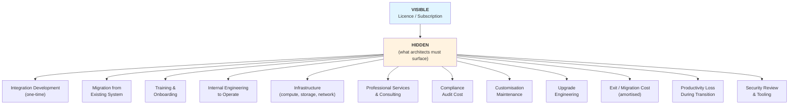
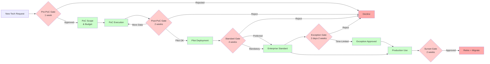

# Enterprise Technology Selection & Decision Framework (Part 2 of 2)

**Audience:** Enterprise architects, architecture review boards (ARBs), platform engineering leads, CTO/CIO advisors, technology procurement teams, and engineering leadership.

**Purpose:** Continuation of the enterprise technology selection framework. Part 2 covers risk assessment, vendor evaluation, TCO modelling, ARB governance, ADR templates, success metrics, common anti-patterns, and reference models for different organisation types.

**Scope (Part 2 of 2):** Risk Assessment Framework, Vendor Evaluation Framework, Total Cost of Ownership, Organisational Readiness, ARB Decision Process, Decision Documentation (ADRs), Measuring Success, Common Decision Anti-Patterns, Reference Models by Organisation Type, Templates and Checklists, Glossary, and Further Reading. See Part 1 for decision philosophy, classification, criteria, evaluation methods, and lifecycle management.

**Related:** [Architectural Review Board](pathname:///archon/architecture/00-wiki-governance) | [Enterprise Technology Selection (Part 1)](pathname:///archon/architecture/75-enterprise-technology-selection-framework)

---

## Table of Contents

11. [Risk Assessment Framework](#11-risk-assessment-framework)
12. [Vendor Evaluation Framework](#12-vendor-evaluation-framework)
13. [Total Cost of Ownership](#13-total-cost-of-ownership)
14. [Organisational Readiness](#14-organisational-readiness)
15. [ARB Decision Process](#15-arb-decision-process)
16. [Decision Documentation — ADRs](#16-decision-documentation--architecture-decision-records)
17. [Measuring Success After Selection](#17-measuring-success-after-selection)
18. [Common Decision Anti-Patterns](#18-common-decision-anti-patterns)
19. [Reference Models by Organisation Type](#19-reference-models-by-organisation-type)
20. [Templates and Checklists](#20-templates-and-checklists)

---

## 11. Risk Assessment Framework

### 11.1 Technology Risk Dimensions

| Risk Category | Specific Risks | Assessment Questions |
| --- | --- | --- |
| **Vendor / product maturity** | Immature product; unstable APIs; frequent breaking changes | How many production deployments at comparable scale? |
| **Vendor financial stability** | Vendor acquired, pivoted, or shut down | Revenue trajectory; VC funding status; profitable? |
| **Product roadmap** | Roadmap doesn't align with our needs; key features won't be built | Is our use case on the roadmap? What's the release cadence? |
| **Community health** (OSS) | Abandoned project; security issues not patched | GitHub commit frequency; issue response time; number of maintainers |
| **OSS sustainability** | Key maintainer leaves; foundation withdraws support | Is it under a reputable foundation (CNCF, Apache)? Commercial backer? |
| **Lock-in risk** | Proprietary formats; data export limitations; switching cost | Can we export all data in standard formats? What is the migration cost? |
| **Operational risk** | Complex operations; frequent incidents; high MTTR | Reference customer operational complexity; incident history |
| **Skills risk** | Niche skill set; hard to hire; high consultant dependency | Market for talent; availability of training; certification path |
| **Regulatory / compliance risk** | Non-compliant with regulations; unclear compliance stance | Required certifications present? Data residency options? |
| **Security risk** | Poor security track record; unpatched CVEs; supply chain | CVE response time; security bug bounty program; SBOM available? |

### 11.2 Risk Scoring Model

Score each risk category: 1 = Low / 2 = Medium / 3 = High

| Risk | Likelihood (1–3) | Impact (1–3) | Risk Score (L × I) | Mitigation |
| --- | --- | --- | --- | --- |
| Vendor financial stability | 1 | 3 | 3 | |
| Lock-in risk | 2 | 3 | 6 | Abstraction layer; data export testing |
| Skills availability | 3 | 2 | 6 | Training plan; external support contract |
| Security posture | 1 | 3 | 3 | Annual security review |
| Roadmap alignment | 2 | 2 | 4 | Vendor roadmap in contract |
| **Total** | | | **22 / 45** | |

Risk thresholds: 0–15 = Low / 16–30 = Medium / 31–45 = High. High-risk technologies require ARB risk acceptance before adoption.

### 11.3 Open Source Sustainability Checklist

Before adopting an open-source project:

- [ ] GitHub stars > 1,000 (or domain equivalent maturity signal)
- [ ] Active commits within last 30 days
- [ ] Multiple active maintainers (not single-person project)
- [ ] Issues responded to within 2 weeks on average
- [ ] Security CVEs responded to within 30 days historically
- [ ] Backed by foundation (CNCF, Apache, Linux Foundation) or commercial company
- [ ] Commercial support available if needed
- [ ] Licence is compatible with enterprise use (Apache 2.0, MIT, BSD preferred; verify GPL implications)
- [ ] SBOM (Software Bill of Materials) available or generatable

---

## 12. Vendor Evaluation Framework

### 12.1 Evaluating the Vendor, Not Just the Product

A great product from a troubled vendor is a high-risk investment. Evaluate the vendor as a long-term business partner.

### 12.2 Vendor Assessment Dimensions

**Financial health:**

- Revenue trajectory: growing or declining?
- Profitability: can they fund their roadmap without additional fundraising?
- Funding status: VC-backed vs. bootstrapped vs. public? (Each has different risk profiles)
- Customer concentration: if their top 3 customers leave, do they survive?

Indicators: Annual reports, Crunchbase funding data, Glassdoor trends (warning sign if dropping), customer reference calls.

**Product roadmap:**

- Does their roadmap align with our 3-year needs?
- What has their roadmap delivery track record been?
- Do they prioritise enterprise needs or consumer/SMB features?

Verify: Ask for the last 3 roadmap presentations and compare to what shipped.

**Enterprise support:**

- SLA for P1 issues (4-hour response or next-day?)
- Dedicated customer success manager at our account tier?
- Escalation path for critical issues?
- Support hours (24/7 or business hours only)?

Test before committing: Submit a non-trivial support ticket during evaluation. Evaluate response quality and time.

**Customer references:**

- Can they provide 3 reference customers at similar size and industry?
- Can you talk directly to the reference customers' architects (not just their marketing contacts)?
- What are the reference customers' biggest operational pain points?

**Ecosystem and partner network:**

- Is there a healthy partner / ISV ecosystem?
- Are there multiple system integrators who can help us implement?
- Does the vendor depend on us to build all integrations ourselves?

**Innovation velocity:**

- Feature release cadence: monthly, quarterly?
- Do they have R&D investment proportional to their revenue?
- Are they leading or following in their category?

**Acquisition risk:**

- Is the vendor likely acquisition target?
- If acquired, what happens to our contract and roadmap?
- Are there contract clauses protecting against material feature removal post-acquisition?

**Contract flexibility:**

- Month-to-month vs. multi-year only?
- Can you reduce seats if your usage drops?
- Is there a data export guarantee in the contract?
- Exit assistance clause?

### 12.3 Vendor Scorecard

| Dimension | Weight | Score (1–5) | Weighted |
| --- | --- | --- | --- |
| Financial health | 20 | | |
| Product fit | 25 | | |
| Enterprise support quality | 15 | | |
| Roadmap alignment | 15 | | |
| Ecosystem maturity | 10 | | |
| Contract terms | 10 | | |
| Reference customer quality | 5 | | |
| **Total** | **100** | | |

Interpret: 400+ = Strong vendor; 300–399 = Acceptable; <300 = Proceed with caution.

---

## 13. Total Cost of Ownership

### 13.1 Why Acquisition Cost Is Misleading

Organisations routinely undercount the cost of technology by 3–5× because they count only the licence or subscription fee.

The TCO iceberg:



**Total Cost of Ownership Iceberg.** Organisations see only the licence/subscription cost visible above the waterline. Hidden below: integration, migration, training, operations, infrastructure, consulting, compliance, maintenance, upgrades, exit costs, and productivity loss. True TCO is typically 3–5× the acquisition cost.

### 13.2 TCO Model Structure

| Category | Year 1 | Year 2 | Year 3 | Year 4 | Year 5 | Total |
| --- | --- | --- | --- | --- | --- | --- |
| **Acquisition / Licence** | | | | | | |
| Subscription fee (base) | | | | | | |
| Enterprise add-ons / modules | | | | | | |
| **Infrastructure** | | | | | | |
| Compute (cloud / on-prem) | | | | | | |
| Storage | | | | | | |
| Network egress | | | | | | |
| **Implementation (one-time)** | | | | | | |
| Internal engineering | | | | | | |
| Professional services | | | | | | |
| Data migration | | | | | | |
| **Operations (recurring)** | | | | | | |
| Platform team (FTE fraction) | | | | | | |
| Monitoring / tooling | | | | | | |
| Support contract | | | | | | |
| **Training** | | | | | | |
| Initial training | | | | | | |
| Ongoing / new hire | | | | | | |
| **Compliance** | | | | | | |
| Security reviews | | | | | | |
| Audit support | | | | | | |
| **Upgrade / Maintenance** | | | | | | |
| Major version upgrades (est.) | | | | | | |
| Customisation maintenance | | | | | | |
| **Exit Provision (amortised)** | | | | | | |
| Migration cost if wrong (1/5) | | | | | | |
| **TOTAL** | | | | | | |

### 13.3 Hidden Costs Frequently Missed

| Hidden Cost | Typical Miss Reason | How to Capture |
| --- | --- | --- |
| Integration maintenance | "We'll do it once and it'll work" | Estimate 15–20% of initial integration cost annually |
| Upgrade engineering | "Upgrades are free" | Budget 2–4 engineer-weeks per major version |
| Training new hires | "The team already knows it" | $3–10K per new engineer for certification + ramp time |
| Productivity loss during transition | "We'll migrate on a weekend" | 10–30% productivity reduction for 2–6 weeks |
| Compliance cost increase | "We're already compliant" | New tool = new evidence to collect in audits |
| Shadow licensing | "We only need 10 seats" | Usage always grows; model at 2× current estimate |

---

## 14. Organisational Readiness

### 14.1 Technology Without Readiness Fails

Even the right technology selection fails without organisational readiness. Assess readiness before committing.

| Dimension | Questions to Assess | Readiness Indicators |
| --- | --- | --- |
| **Skills** | Do we have people who can operate this today? | ≥2 engineers with demonstrated expertise |
| **Team structure** | Is there a team accountable for this platform? | Named owner; clear on-call responsibility |
| **Operating model** | How will we support this in production? | Runbook exists; escalation path defined |
| **Governance maturity** | Do we have processes to govern this at scale? | Policy exists; enforcement mechanism |
| **Change readiness** | Are teams willing to change their current workflow? | Change champions identified; pilot team enthusiastic |
| **Executive sponsorship** | Is there a senior sponsor with budget authority? | Named executive sponsor committed |
| **Adoption capacity** | How many technology changes are teams absorbing right now? | Technology change backlog assessment |

### 14.2 Readiness Scoring

Score each dimension: 1 = Not ready / 3 = Partial readiness / 5 = Fully ready.

Total < 20: High risk of adoption failure; address gaps before proceeding.
Total 20–28: Moderate readiness; proceed with change management plan.
Total > 28: Ready; proceed with standard governance.

### 14.3 Skill Gap Closure Strategies

| Gap Level | Closure Strategy | Timeline |
| --- | --- | --- |
| **Zero internal expertise** | Hire specialist; engage SI partner; vendor training programme | 3–6 months to functional competency |
| **Basic familiarity, no depth** | Structured training; hands-on PoC; pair with vendor PS | 1–3 months |
| **One expert, no redundancy** | Train second engineer; document institutional knowledge | 1 month |
| **Team skilled, management gap** | Architecture training; ARB education; exec briefing | 2–4 weeks |

---

## 15. ARB Decision Process

See the [Architectural Review Board](pathname:///archon/architecture/00-wiki-governance) governance model for the full ARB operating framework.

### 15.1 Submission Requirements

All technology decisions above the departmental tool level require an ARB submission:

**Minimum required artefacts:**

- Problem statement (what capability gap does this address?)
- Options considered (minimum 3, or justify why fewer)
- Weighted decision matrix completed
- Architecture fitness assessment
- Security review (or security review waiver for low-risk tools)
- TCO model (5-year)
- Risk assessment
- Recommended decision with rationale

**Optional but recommended:**

- PoC results
- Reference architecture diagram
- Migration plan from current state

### 15.2 Decision Gates

| Gate | Trigger | Decision | Timeline |
| --- | --- | --- | --- |
| **Pre-PoC gate** | Request to PoC a candidate technology | Approve / reject PoC scope and budget | 1 week |
| **Post-PoC gate** | PoC complete; team wants to proceed | Approve for pilot / reject / more data needed | 2 weeks |
| **Standard designation gate** | Team wants enterprise-wide standard | Approve as Preferred / Mandatory / reject | 4 weeks |
| **Exception gate** | Deviation from existing standard | Approve time-limited exception / reject | 2 business days (blocking) / 2 weeks (planned) |
| **Sunset gate** | Technology being retired | Approve retirement date and migration plan | 2 weeks |



**ARB Technology Decision Gates.** Five sequential gates govern technology adoption: PoC approval, pilot readiness, enterprise standardization, exception requests, and retirement. Each gate has a defined timeline and clear approval criteria, ensuring consistent decision-making across the organization.

### 15.3 Stakeholder Roles in the Decision

| Role | Responsibility | Decision Authority |
| --- | --- | --- |
| **Submitting team** | Prepare submission; present to ARB | Propose; implement |
| **Enterprise architect** | Assess strategic fit; provide guidance before submission | Review; advise |
| **Security architect** | Security risk assessment | Approve / reject on security grounds |
| **Platform team** | Assess operational fit; deployment feasibility | Advise on operations |
| **Finance** | Validate TCO model; budget availability | Approve financial commitment |
| **Legal / compliance** | Review contracts, licences, data handling | Approve / reject on legal grounds |
| **ARB chair** | Facilitate decision; resolve tie-breakers | Final decision authority |

---

## 16. Decision Documentation — Architecture Decision Records

### 16.1 Why ADRs Matter

Architecture Decision Records capture: what was decided, why, what options were rejected, and what consequences to expect. Without ADRs:

- Future teams re-litigate decisions that were already made
- Context for a decision is lost when team members leave
- Post-mortems can't distinguish wrong decisions from right decisions badly implemented

### 16.2 ADR Template — Standard Decision

```markdown
# ADR-NNNN: [Short title of the decision]

**Date:** YYYY-MM-DD  
**Status:** [Draft | Proposed | Accepted | Superseded | Deprecated]  
**Supersedes:** [ADR-XXXX if this replaces a prior decision]  
**Superseded by:** [ADR-YYYY if this has been superseded]

---

## Context

[2–3 paragraphs describing the situation that created the need for a decision.
What problem are we solving? What constraints exist? What triggered this decision now?]

## Decision Drivers

- [Key factor 1 that influenced this decision]
- [Key factor 2]
- [Key factor 3]

## Options Considered

### Option 1: [Name]
- Description: [What is this option?]
- Pros: [...]
- Cons: [...]
- Estimated TCO (5yr): $[X]

### Option 2: [Name]
- Description:
- Pros:
- Cons:
- Estimated TCO (5yr): $[X]

### Option 3: [Name]
- Description:
- Pros:
- Cons:
- Estimated TCO (5yr): $[X]

## Evaluation

[Paste or link to the weighted decision matrix. Summarise the key scoring differences.]

| Criterion | Weight | Option 1 | Option 2 | Option 3 |
|---|---|---|---|---|
| [Criterion] | [W] | [Score] | [Score] | [Score] |
| **Total** | **100** | **[X]** | **[X]** | **[X]** |

## Decision

We select **Option [N]: [Name]**.

**Rationale:** [3–5 sentences explaining why this option wins. Reference the scoring,
but also explain any qualitative factors the matrix doesn't capture.]

## Consequences

**Positive:**
- [Expected positive outcome 1]
- [Expected positive outcome 2]

**Negative / Trade-offs accepted:**
- [Trade-off 1 we accept]
- [Risk 1 we accept]

**Risks and mitigations:**
| Risk | Mitigation |
|---|---|
| [Risk] | [Mitigation] |

## Review Date

This decision should be revisited by: [DATE — typically 12–24 months]

**Success metrics:**
- [How will we know this was the right decision?]
- [Metric 1]
- [Metric 2]

## Approvals

| Role | Name | Date |
|---|---|---|
| ARB Chair | | |
| Security Architect | | |
| Enterprise Architect | | |
```

### 16.3 Lightweight ADR — For Departmental Tools

For lower-risk, lower-scope decisions:

```markdown
# ADR-NNNN: [Tool selection for X]

**Date:** YYYY-MM-DD | **Status:** Accepted | **Owner:** [Team]

**Problem:** [1–2 sentences]

**Options considered:** [Option A], [Option B], [Option C]

**Decision:** [Option X] because [2–3 sentence rationale].

**Trade-off accepted:** [What we give up by not choosing the other options]

**Review by:** [DATE]
```

---

## 17. Measuring Success After Selection

### 17.1 Success Metrics Framework

Define success metrics at decision time — not after deployment.

| Metric Category | Example KPIs | Target | Measurement Method |
| --- | --- | --- | --- |
| **Adoption** | % of target teams actively using the technology | 80% within 6 months | Platform telemetry / user survey |
| **User satisfaction** | Developer experience score | ≥4/5 | Quarterly survey |
| **Platform stability** | Uptime / availability | ≥99.9% | Monitoring dashboard |
| **Operational efficiency** | Incidents per month; MTTR | Baseline → 20% improvement | Incident tracking |
| **Cost outcomes** | Actual TCO vs. projected | Within 20% of model | Finance report |
| **Productivity impact** | Feature delivery velocity before/after | 10–20% improvement | DORA metrics |
| **Security posture** | Security findings in quarterly scan | Zero criticals | Security scan results |
| **Business outcomes** | Business KPI the technology was meant to move | Defined per use case | Business reporting |

### 17.2 Post-Implementation Review Schedule

| Timing | Review Focus | Output |
| --- | --- | --- |
| **30 days post-launch** | Technical issues; onboarding friction | Issue list; quick fixes |
| **90 days post-launch** | Adoption progress; cost tracking vs. model | Go/continue decision |
| **6 months post-launch** | User satisfaction; stability; cost vs. model | Decision validation |
| **12 months post-launch** | Full success metric assessment; lessons learned | ADR updated with outcomes |
| **Annually thereafter** | Technology radar reassessment; still right choice? | Adopt/Trial/Assess/Hold |

---

## 18. Common Decision Anti-Patterns

### 18.1 The Fourteen Anti-Patterns

| Anti-Pattern | Description | Detection Signal | Countermeasure |
| --- | --- | --- | --- |
| **Feature checklist bias** | Selecting the tool with the longest feature list, not the best fit | RFP built from feature marketing materials | Evaluate against your specific use cases only |
| **Vendor marketing influence** | Decision driven by sales relationship, not evaluation | Architecture team hasn't tested the product | Require PoC with own data; bar vendor from ARB |
| **Shiny object syndrome** | Adopting new technology because it's exciting, not because it solves a problem | No problem statement exists | Require problem statement before evaluation starts |
| **Executive preference** | Senior leader mandates technology without evidence | "The CTO tried it at his last company" | Require same ARB process regardless of seniority |
| **PoC ≠ production** | PoC success treated as production validation | PoC went to production without Go/No-Go gate | Mandatory Go/No-Go gate; isolated PoC environments |
| **Ignoring operational cost** | Licence is cheap; operation is expensive | Only licence cost in the business case | Require TCO model covering operations |
| **Over-customisation** | Product is bent to fit existing workflow instead of adopting product's intended use | >20% of features are custom-built on top of the product | Adopt product's workflow; if impossible, reconsider the product |
| **Tool duplication** | Same capability covered by 3 different tools | Capability map shows overlap | Annual capability rationalization |
| **Ignoring exit strategy** | No plan for what happens when this technology is wrong | No data export validation; no migration cost estimate | Require exit cost in TCO; test data export during PoC |
| **Technology-first architecture** | Architecture designed around a technology's features, not the business problem | "We're a Kafka shop" as a reason for using Kafka | Business-first problem statement required |
| **Popularity ≠ fit** | "Everyone uses it" as justification | Cited evidence is blog posts and job postings | Require fit assessment; industry adoption ≠ your use case fit |
| **Pilot success ≠ scale readiness** | Successful pilot treated as evidence of enterprise-scale readiness | Pilot had 5 users; enterprise has 5,000 | Require load testing at enterprise scale before standard designation |
| **Recency bias** | New tools preferred because they are new | Evaluation team has no institutional memory | Include lifecycle risk assessment for young products |
| **Sunk cost fallacy** | Continuing with a failing technology because of past investment | "We've already spent $500K on this" | Decision is about future cost, not past cost; be willing to cut losses |

---

## 19. Reference Models by Organisation Type

### 19.1 Startup (< 50 engineers)

**Priority order:** Speed to value → Cost → Operational simplicity → Standards.

**Approach:**

- Minimise custom infrastructure; use managed SaaS for everything possible
- Resist premature standardisation; let patterns emerge from 2–3 real use cases
- Use high-trust vendors with monthly contracts (no 3-year lock-in)
- Document decisions in lightweight ADRs; don't build a full ARB yet
- Key risk: tool sprawl as teams move fast; quarterly rationalization checkpoint

**Key criteria weighting:** Business value 35% / Cost 25% / Time to value 25% / Operational complexity 15%

### 19.2 Mid-Size Enterprise (50–500 engineers)

**Priority order:** Strategic alignment → Operational efficiency → Cost → Standardisation.

**Approach:**

- Establish an ARB (2-week review cycle, not heavyweight)
- Define Preferred standards for top 5–7 capability categories
- Start technology radar (quarterly)
- Begin TCO modelling for decisions > $100K/year
- Key risk: inconsistent standards as different teams make different choices

**Key criteria weighting:** Business value 25% / Technical fit 25% / TCO 20% / Operations 15% / Risk 15%

### 19.3 Global Enterprise (500+ engineers)

**Priority order:** Strategic alignment → Security/compliance → Standardisation → Operational at scale.

**Approach:**

- Full ARB with designated roles; 2–4 week review cycle
- Mandatory standards for strategic platforms
- Quarterly technology radar; annual rationalization
- Full TCO model for all decisions > $50K/year
- Key risk: standards enforcement; innovation vs. standardisation tension

**Key criteria weighting:** Technical fit 20% / Security 25% / TCO 20% / Business value 20% / Operations 15%

### 19.4 Highly Regulated Organisation (Bank, Insurance, Healthcare)

**Priority order:** Compliance → Security → Operational control → Standards → Business value.

**Approach:**

- Compliance gate before any evaluation starts
- Data residency non-negotiable; vendor DPA mandatory
- Security assessment required for all technologies (not just critical)
- Regulatory approval required for AI and data systems
- Longer evaluation cycles (8–16 weeks) justified by compliance review

**Key criteria weighting:** Security/compliance 35% / Risk 20% / Technical fit 20% / Business value 15% / TCO 10%

### 19.5 Government Agency

**Priority order:** Sovereignty → Security → Compliance → Operational → Cost.

**Approach:**

- National security classification may restrict vendor set
- FedRAMP (US) / NCSC (UK) / BSI (Germany) certification required
- Procurement framework constraints (G-Cloud, GSA Schedule, etc.)
- Long evaluation cycles; public procurement rules
- Open-source preferred for transparency and audit requirements

**Key criteria weighting:** Security 30% / Compliance 30% / Risk 20% / Technical fit 15% / Cost 5%

### 19.6 Healthcare Provider

**Priority order:** Patient safety → HIPAA/clinical compliance → Security → Clinical fit → Cost.

**Approach:**

- Clinical workflow impact assessment required for any patient-facing technology
- HIPAA BAA required for all PHI-touching systems
- Medical device classification review if AI touches clinical decisions
- Clinician satisfaction is a first-class evaluation criterion
- Change management is expensive; prioritise stability

**Key criteria weighting:** Compliance/safety 30% / Clinical fit 25% / Security 20% / Risk 15% / TCO 10%

### 19.7 Financial Institution

**Priority order:** Regulatory compliance → Risk management → Security → Operational resilience → Cost.

**Approach:**

- MAS TRM / EBA ICT guidelines / OCC model risk management
- Model risk management process for any AI/ML system
- Third-party risk management programme for all vendors
- Operational resilience: recovery time objectives for all systems
- Exit and portability requirements in all vendor contracts

**Key criteria weighting:** Compliance/risk 35% / Security 25% / Technical fit 20% / Resilience 15% / Cost 5%

### 19.8 Manufacturing Organisation

**Priority order:** Operational continuity → Integration with OT systems → Security → Cost → Innovation.

**Approach:**

- OT/IT boundary must be explicitly addressed in any deployment
- Industrial protocol support (MQTT, OPC-UA, Modbus) required where applicable
- Edge deployment capability critical for factory floor
- Long-lived systems: 10+ year operational requirements drive vendor stability priority
- Safety systems: functional safety standards (IEC 61508, ISO 13849)

**Key criteria weighting:** Operational fit 30% / Integration 25% / Security 20% / Risk/stability 15% / Cost 10%

---

## 20. Templates and Checklists

### 20.1 Technology Evaluation Scorecard (Master Template)

```
TECHNOLOGY EVALUATION SCORECARD
================================
Technology being evaluated: _______________
Evaluation date: _______________
Evaluating team: _______________
Competing options: _______________

MUST-HAVE GATE (eliminate before scoring):
[ ] Data residency requirement met
[ ] Required compliance certification present
[ ] Licence compatible with enterprise use
[ ] Within budget envelope
[ ] Integration with enterprise IdP confirmed

WEIGHTED SCORING:
                      Weight  Opt A  Opt B  Opt C
Business value:         ___    ___    ___    ___
Strategic alignment:    ___    ___    ___    ___
Technical fit:          ___    ___    ___    ___
Security posture:       ___    ___    ___    ___
TCO (5yr):              ___    ___    ___    ___
Operational complexity: ___    ___    ___    ___
Vendor stability:       ___    ___    ___    ___
Skills/adoption:        ___    ___    ___    ___
TOTAL:                  100    ___    ___    ___

RISK SUMMARY:
Option A key risk: _______________
Option B key risk: _______________
Option C key risk: _______________

RECOMMENDATION: _______________
RATIONALE: _______________
REVIEWER: _______________ DATE: _______________
```

### 20.2 Buy vs Build Decision Checklist

- [ ] Is a commercial or open-source solution available that covers ≥80% of use case?
- [ ] Is this a differentiating capability that constitutes IP?
- [ ] Do we have engineering capacity AND intention to maintain long-term?
- [ ] Is the 3-year build cost less than buy + integration cost?
- [ ] Have we considered extending an existing platform rather than buying or building?
- [ ] Is there a strategic partner who can deliver this better/faster?

### 20.3 ARB Submission Checklist

Before submitting for ARB review:

- [ ] Problem statement documented
- [ ] Minimum 3 options evaluated (or fewer options justified)
- [ ] Weighted decision matrix completed
- [ ] Architecture fitness assessment completed
- [ ] TCO model completed (5-year)
- [ ] Risk assessment completed
- [ ] Security review completed (or waiver requested with justification)
- [ ] Recommended option stated with rationale
- [ ] PoC results attached (if applicable)

### 20.4 Technology Retirement Checklist

- [ ] All consuming teams identified
- [ ] 90+ day advance notice sent
- [ ] Migration guide published
- [ ] Successor technology documented
- [ ] Migration support offered (office hours, scripts)
- [ ] Hard retirement date set
- [ ] Automated block on new deployments configured for retirement date
- [ ] Registry status updated to Sunset → Retired
- [ ] Audit records retained per retention policy
- [ ] Cost tracking updated to remove sunset licences

---

## Glossary

| Term | Definition |
| --- | --- |
| **ADR** | Architecture Decision Record — documented record of a technology decision and its rationale |
| **AHP** | Analytic Hierarchy Process — pairwise comparison method for deriving objective weights |
| **ARB** | Architecture Review Board — governance body for technology decisions |
| **Best-of-breed** | Strategy of selecting the best individual tool for each capability, regardless of vendor |
| **CMDB** | Configuration Management Database — inventory of all enterprise IT assets |
| **FinOps** | Financial Operations — practice of managing cloud and technology spend |
| **MoSCoW** | Must have / Should have / Could have / Won't have — requirements prioritisation method |
| **OSS** | Open Source Software |
| **Platform thinking** | Preference for one platform that solves a class of problems over many single-problem tools |
| **PoC** | Proof of Concept — bounded evaluation of a technology in a controlled environment |
| **Shadow IT** | Technology used by teams without central IT knowledge or approval |
| **Technology optionality** | Architectural design that makes it possible to swap underlying technology without rewriting business logic |
| **Technology radar** | Visual map of technologies by adoption recommendation (Adopt/Trial/Assess/Hold) |
| **TCO** | Total Cost of Ownership — full cost of a technology decision over its useful life |
| **TOGAF** | The Open Group Architecture Framework — enterprise architecture methodology |
| **Tool sprawl** | Proliferation of tools across an organisation with overlapping or duplicate capabilities |
| **Vendor lock-in** | Dependency on a specific vendor that makes switching costly or disruptive |
| **Weighted scoring matrix** | Decision method that scores options on multiple criteria with assigned importance weights |

---

## Further Reading

**Standards and Frameworks**

- [TOGAF 10 — ADM and Technology Architecture](https://www.opengroup.org/togaf)
- [NIST AI RMF 1.0](https://www.nist.gov/system/files/documents/2023/01/26/AI%20RMF%201.0.pdf)
- [ISO/IEC 25010 — Software Quality](https://www.iso.org/standard/35733.html)
- [Thoughtworks Technology Radar](https://www.thoughtworks.com/radar)

**Decision Methods**

- Kepner and Tregoe, *The Rational Manager* — structured decision analysis
- Saaty, *The Analytic Hierarchy Process* — pairwise comparison method
- Ulwick, *Jobs to be Done: Theory to Practice* — capability-driven evaluation

**Enterprise Architecture Practice**

- [Gartner Magic Quadrant and Critical Capabilities](https://www.gartner.com/en/methodologies/magic-quadrant) — market context (supplement, not replace, internal evaluation)
- [FinOps Foundation Framework](https://www.finops.org/framework/)
- [CNCF Landscape](https://landscape.cncf.io) — cloud-native technology inventory

**Internal Cross-References**

- [Architectural Review Board Operating Model](pathname:///archon/architecture/00-wiki-governance)
- [Technology Investment Fundamentals](pathname:///archon/architecture/00-wiki-governance)
- [AI Solution Lifecycle Deliverables](pathname:///archon/architecture/00-wiki-governance)
- [Enterprise Multi-Model AI Strategy](pathname:///archon/architecture/00-wiki-governance)
- [Enterprise AI Governance & Compliance](pathname:///archon/architecture/00-wiki-governance)

---

## See Also

**Part 1 of this framework:** Technology Decision Philosophy, Classification Framework, Enterprise Decision Criteria, Weighted Decision Matrix Methods, Buy vs Build, Architecture Fitness Assessment, Technology Lifecycle Management, PoC Framework, Standards and Exceptions, and Technology Rationalization. See [Enterprise Technology Selection & Decision Framework (Part 1 of 2)](pathname:///archon/architecture/75-enterprise-technology-selection-framework).
