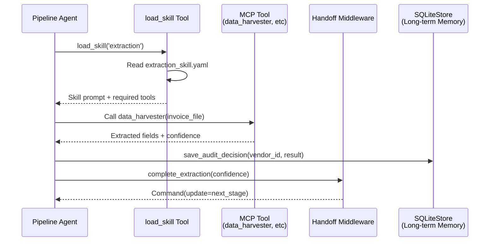

**This is Part 2 of 2.** See [Part 1: Executive Summary, SQLite Infrastructure, HITL, Handoffs, Runtime & Memory](pathname:///archon/architecture/ai-invoice-auditor-architecture) for sections §1–§6.

## **7. Skills — Prompt-Driven Progressive Disclosure (v5.0)**

Source: *<https://docs.langchain.com/oss/python/langchain/multi-agent/skills>*

## **7.1 What Changed — Class-Based → Prompt-Driven**

The previous architecture used an abstract **Skill(ABC)** class with a **run()** method — this is NOT the pattern in the current LangChain skills documentation. The official pattern packages skills as specialised prompts plus optionally specific tools, stored as files or database records. A single load_skill(skill_name) tool gives the agent access to any skill's prompt and context on demand. Progressive disclosure ensures the agent only loads a skill's prompt when it needs it — not all upfront. Different teams can maintain skill prompt files independently in the prompts/ directory. Loading a skill can also register new tools by updating state dynamically.

## **7.2 Skill Prompt Files**

```yaml
# prompts/skills/extraction_skill.yaml

name: extraction_skill
version: '1.0'
description: 'Expert invoice data extraction from PDF, DOCX, and scanned PNG'
prompt: |
  You are an expert invoice data extraction specialist.
  Use the data_harvester MCP tool to extract the following fields:

  - invoice_no, invoice_date, vendor_id, currency, total_amount
  - line_items: item_code, description, qty, unit_price, total

  Rules:
  - For PDFs: use pdfplumber via data_harvester
  - For DOCX: use python-docx via data_harvester
  - For PNG: use pytesseract via data_harvester (set ocr=True)
  - Attach a confidence score (0.0-1.0) based on field completeness
  - If field count < 80% of expected, confidence < 0.6

  Call complete_extraction(confidence=<score>) when done.
required_tools:
  - data_harvester
```

```yaml
# prompts/skills/translation_skill.yaml

name: translation_skill
version: '1.0'
description: 'Multilingual invoice translation — ES/DE/FR to EN'
prompt: |
  You are a professional invoice translator.
  Translate all extracted invoice fields to English.
  Preserve all numeric values, dates, and codes exactly.
  Supported source languages: Spanish (es), German (de), French (fr).

  Rate your confidence (0.0–1.0):
  - 1.0 = all fields translated unambiguously
  - 0.8 = minor ambiguities in non-financial fields
  - <0.8 = route to HITL for human verification

  Call complete_translation(translation_confidence=<score>) when done.
required_tools: []
```

```yaml
# prompts/skills/validation_skill.yaml

name: validation_skill
version: '1.0'
description: 'Invoice completeness and ERP cross-validation'
prompt: |
  You are an invoice validation specialist.

  1. Check field completeness against rules.yaml thresholds
  2. Call business_validator MCP tool to compare with ERP purchase orders
  3. Apply tolerance rules: price=5%, quantity=0%, tax=2%
  4. Auto-approve if confidence >= 0.95 AND discrepancies == []
  5. Route to HITL if any discrepancy or confidence < 0.95

  Call complete_validation(discrepancies=[...], confidence=<score>) when done.
required_tools:
  - data_completeness_checker
  - business_validator
```

## **7.3 load_skill Tool — Progressive Disclosure**

```python
# src/tools/skills_tool.py  — v5.0 official Skills pattern

import yaml
from pathlib import Path
from langchain.tools import tool, ToolRuntime

SKILLS_DIR = Path('prompts') / 'skills'

SKILL_REGISTRY = {
    'extraction':  'extraction_skill.yaml',
    'translation': 'translation_skill.yaml',
    'validation':  'validation_skill.yaml',
    'reporting':   'reporting_skill.yaml',
    'rag_query':   'rag_query_skill.yaml',
}

@tool
def load_skill(
    skill_name: str,
    """Load a specialised skill prompt and context on demand.

    Available skills:
    - extraction:  PDF/DOCX/PNG invoice data extraction expert
    - translation: Multilingual invoice translation (ES/DE/FR → EN)
    - validation:  Completeness check + ERP cross-validation
    - reporting:   HTML audit report generation
    - rag_query:   Natural language Q&A over processed invoices

    Returns the skill's prompt. Call this before starting the related task.
    The prompt will guide you on what tools to use and how.
    """
    if skill_name not in SKILL_REGISTRY:
        available = ', '.join(SKILL_REGISTRY.keys())
        return f'Unknown skill: {skill_name}. Available: {available}'

    skill_path = SKILLS_DIR / SKILL_REGISTRY[skill_name]
    skill_data = yaml.safe_load(skill_path.read_text(encoding='utf-8'))

    # Optional: log skill load to metrics
    if runtime.context.metrics:
        runtime.context.metrics.log_skill_load(
            run_id=runtime.context.run_id,
            skill_name=skill_name
        )

    return (
        f'=== SKILL: {skill_data["name"]} v{skill_data["version"]} ===\n'
        f'{skill_data["prompt"]}\n'
        f'Required tools: {skill_data.get("required_tools",[])}\n'
        f'=== END SKILL ==='
    )
```

## **7.4 Pipeline Agent With Skills Tool**

The **pipeline_agent** from Section 4 is extended with **load_skill** so each stage starts by loading the relevant skill prompt before calling MCP tools. The handoff middleware still controls stage transitions, but the skill provides the specialist prompt context dynamically.



**Skills-Driven Invoice Processing Pipeline.** Agent loads the relevant skill prompt before each stage, calls MCP tools with expert guidance, persists decisions to long-term memory, then signals handoff to the next stage. Progressive disclosure ensures only active skills are in context.

```python
# Extension to pipeline_agent — add load_skill to all stage tool lists

from src.tools.skills_tool import load_skill

pipeline_agent = create_agent(
    model=get_llm(),
    tools=[
        load_skill,          # always available — agent calls this first at each stage
        complete_triage,
        complete_extraction,
        complete_translation,
        complete_validation,
        data_harvester_tool,
        recall_vendor_history,      # long-term memory read
        save_audit_decision,        # long-term memory write
        semantic_recall_override_patterns,  # vector search
    ],
    state_schema=InvoicePipelineState,
    context_schema=InvoiceContext,
    store=store,
    middleware=[apply_stage_config, HumanInTheLoopMiddleware(...)],
    checkpointer=checkpointer,
    system_prompt=(
        'You process invoices through sequential stages. '
        'At each stage, first call load_skill(skill_name) to get expert guidance, '
        'then perform the task, then call the appropriate complete_* handoff tool.'
    ),
)
```

## **7.5 Skill Audit — All 12 Skill Modules → Prompt Files**

| Old Class Module | New Prompt File | Key Change |
| --- | --- | --- |
| monitor_skill.py | prompts/skills/monitor_skill.yaml | Removed class. Replaced by triage stage in handoffs plus complete_triage tool. |
| extractor_skill.py | prompts/skills/extraction_skill.yaml | Prompt-driven. data_harvester_tool(ToolRuntime) replaces class method. |
| translator_skill.py | prompts/skills/translation_skill.yaml | LCEL chain moved to translation stage middleware. Prompt externalised. |
| invoice_validator_skill.py | prompts/skills/validation_skill.yaml | Merged into validation_skill. Completeness plus ERP in one prompt. |
| biz_validator_skill.py | (merged into validation_skill.yaml) | ERP check is a step within validation_skill, not a separate agent. |
| reporting_skill.py | prompts/skills/reporting_skill.yaml | Prompt guides HTML report structure. insight_reporter MCP tool unchanged. |
| rag/indexing_skill.py | prompts/skills/rag_indexing_skill.yaml | Incremental indexing prompt. vector_indexer MCP tool unchanged. |
| rag/retrieval_skill.py | prompts/skills/rag_query_skill.yaml | Unified retrieval plus augmentation plus generation plus reflection into one rag_query skill. |
| rag/generation_skill.py | (merged into rag_query_skill.yaml) | Generation step is part of rag_query skill prompt flow. |
| rag/reflection_skill.py | (merged into rag_query_skill.yaml) | RAG Triad retry is described in prompt. Conditional edge in LangGraph graph. |

## **8. Observability — SQLite MetricsDB (LangFuse Removed)**

With Docker removed, LangFuse is eliminated. The SQLite MetricsDB (metrics.db) provides complete local observability for agent nodes, MCP tool calls, LLM calls, HITL events, and skill loads. The Observability UI page queries it directly.

## **8.1 MetricsDB Schema**

```python
# src/observability/metrics_db.py  — v5.0 SQLite-only

import sqlite3, json, time, hashlib
from pathlib import Path
from src.core.persistence import METRICS_DB

SCHEMA = '''
CREATE TABLE IF NOT EXISTS pipeline_runs (
    run_id        TEXT PRIMARY KEY,
    invoice_id    TEXT,
    started_at    TEXT,
    finished_at   TEXT,
    total_ms      INTEGER,
    final_status  TEXT,
    auto_approved INTEGER,
    stage_count   INTEGER
);
CREATE TABLE IF NOT EXISTS stage_transitions (
    id           INTEGER PRIMARY KEY AUTOINCREMENT,
    run_id       TEXT,
    from_step    TEXT,
    to_step      TEXT,
    transition_at TEXT,
    trigger_tool  TEXT
);
CREATE TABLE IF NOT EXISTS tool_calls (
    id          INTEGER PRIMARY KEY AUTOINCREMENT,
    run_id      TEXT,
    tool_name   TEXT,
    started_at  TEXT,
    duration_ms INTEGER,
    status      TEXT,
    input_hash  TEXT,
    output_size INTEGER,
    error_msg   TEXT
);
CREATE TABLE IF NOT EXISTS llm_calls (
    id                INTEGER PRIMARY KEY AUTOINCREMENT,
    run_id            TEXT,
    model             TEXT,
    started_at        TEXT,
    prompt_tokens     INTEGER,
    completion_tokens INTEGER,
    latency_ms        INTEGER,
    cost_usd          REAL
);
CREATE TABLE IF NOT EXISTS hitl_events (
    id           INTEGER PRIMARY KEY AUTOINCREMENT,
    run_id       TEXT,
    invoice_id   TEXT,
    auditor_id   TEXT,
    action       TEXT,
    decision_type TEXT,
    wait_ms      INTEGER,
    recorded_at  TEXT
);
CREATE TABLE IF NOT EXISTS skill_loads (
    id          INTEGER PRIMARY KEY AUTOINCREMENT,
    run_id      TEXT,
    skill_name  TEXT,
    loaded_at   TEXT
);
CREATE TABLE IF NOT EXISTS rag_scores (
    id           INTEGER PRIMARY KEY AUTOINCREMENT,
    run_id       TEXT,
    faithfulness REAL,
    relevance    REAL,
    groundedness REAL,
    scored_at    TEXT
);
'''

class MetricsDB:
    def __init__(self, path: Path = METRICS_DB):
        path.parent.mkdir(parents=True, exist_ok=True)
        self.conn = sqlite3.connect(str(path), check_same_thread=False)
        self.conn.row_factory = sqlite3.Row
        self.conn.executescript(SCHEMA)

    # Writers
    def log_tool_call(self, run_id, tool_name, duration_ms,
                      status, input_data=None, error_msg=None):
        ih = hashlib.sha256(
            json.dumps(input_data or {}, sort_keys=True).encode()
        ).hexdigest()[:16]
        self.conn.execute(
            'INSERT INTO tool_calls(run_id,tool_name,started_at,duration_ms,'
            'status,input_hash,error_msg) VALUES(?,?,datetime("now"),?,?,?,?)',
            (run_id, tool_name, duration_ms, status, ih, error_msg))

    def log_hitl_interrupt(self, run_id, invoice_id, thread_id, actions, elapsed_ms):
        self.conn.execute(
            'INSERT INTO hitl_events(run_id,invoice_id,auditor_id,action,decision_type,'
            'wait_ms,recorded_at) VALUES(?,?,"pending",?,"interrupt",?,datetime("now"))',
            (run_id, invoice_id, json.dumps(actions), elapsed_ms))

    def log_hitl_decision(self, run_id=None, invoice_id=None, auditor_id=None,
                          decisions=None, elapsed_ms=0):
        for d in (decisions or []):
            self.conn.execute(
                'INSERT INTO hitl_events(run_id,invoice_id,auditor_id,action,'
                'decision_type,wait_ms,recorded_at) VALUES(?,?,?,?,?,?,datetime("now"))',
                (run_id, invoice_id, auditor_id,
                 'hitl_decision', d.get('type','unknown'), elapsed_ms))

    def log_skill_load(self, run_id, skill_name):
        self.conn.execute(
            'INSERT INTO skill_loads(run_id,skill_name,loaded_at)'
            ' VALUES(?,?,datetime("now"))',
            (run_id, skill_name))

    # Query helpers (used by Observability UI page)
    def slowest_tools(self, n=10):
        return [dict(r) for r in self.conn.execute(
            'SELECT tool_name, AVG(duration_ms) avg_ms, COUNT(*) calls,'
            'SUM(CASE WHEN status="error" THEN 1 ELSE 0 END) errors'
            ' FROM tool_calls GROUP BY tool_name ORDER BY avg_ms DESC LIMIT ?',
            (n,)).fetchall()]

    def stage_transition_funnel(self):
        return [dict(r) for r in self.conn.execute(
            'SELECT to_step, COUNT(*) cnt FROM stage_transitions'
            ' GROUP BY to_step ORDER BY cnt DESC').fetchall()]

    def auto_approval_rate(self, days=30):
        tot  = self.conn.execute(
            'SELECT COUNT(*) FROM pipeline_runs'
            ' WHERE started_at > datetime("now",?)', (f'-{days} days',)).fetchone()[0]
        if not tot: return 0.0
        auto = self.conn.execute(
            'SELECT COUNT(*) FROM pipeline_runs WHERE auto_approved=1'
            ' AND started_at > datetime("now",?)', (f'-{days} days',)).fetchone()[0]
        return round(auto/tot*100, 1)
```

## **9. UI Pages Specification — All 6 Streamlit Pages**

## **9.0 Shared Sidebar**

| Element | Detail |
| --- | --- |
| Navigation | Links to all 6 pages with icons. HITL badge count (red) shows invoices awaiting human review. |
| Service Health | Service status per endpoint (MCP :9000, ERP :8000, Ollama :11434, Chat API :8502). Polled every 30s via health endpoints. |
| Auditor ID | Text input — persisted in st.session_state. Prefixed to all HITL decisions and stored in long-term memory. |
| Current Stage | If pipeline active: current_step badge showing triage → extraction → translation → validation → hitl → reporting. |

## **9.1 Page 1 — Pipeline Monitor**

| Attribute | Specification |
| --- | --- |
| File | ui/pages/1_Pipeline_Monitor.py |
| Purpose | Live view of all invoice runs with stage-by-stage progress. Shows handoff transitions as pipeline moves through triage → extraction → translation → validation → hitl/reporting. |
| Layout | Top: 4 KPI tiles (Total | Auto-Approved | Pending HITL | Errors). Middle: Active run card per invoice (stage badge strip). Bottom: Completed runs table with status filter. |
| Data Sources | GET /dashboard/metrics (batch stats) | GET /stream/{run_id} SSE (stage transitions) | SQLite stage_transitions table |
| AG-UI Events | StepProgress per handoff transition. HumanInputRequired → HITL badge increment. RunFinished → move to completed table. |
| Interactions | Click stage badge → show timing for that stage. Click invoice_id → open Chat page. Upload Invoice file widget → triggers new pipeline run. |

## **9.2 Page 2 — Invoice Chat**

| Attribute | Specification |
| --- | --- |
| File | ui/pages/2_Invoice_Chat.py |
| Purpose | Natural-language Q&A over any processed invoice. Short-term memory (AgentState) preserves conversation within session. Long-term memory (SqliteStore) surfaces vendor history and past decisions. |
| Layout | Left (30%): Invoice selector, metadata panel (vendor, total, status, confidence, flags). Right (70%): Chat messages with streaming tokens, chat input, Clear History button. |
| Data Sources | POST /chat → streamed answer with TextDelta events. Short-term: SqliteSaver thread history reloaded on invoice select. Long-term: recall_vendor_history tool surfaces past decisions automatically. |
| AG-UI Events | RUN_STARTED → show spinner. TextDelta → stream tokens. StepProgress (skill load) → sidebar badge. RUN_FINISHED → hide spinner. |
| Memory Display | Vendor History expander shows SqliteStore entries for this vendor (long-term). Chat history is the short-term memory in context. |

## **9.3 Page 3 — HITL Review**

| Attribute | Specification |
| --- | --- |
| File | ui/pages/3_HITL_Review.py |
| Purpose | Structured approve/edit/reject decision UI for flagged invoices. Backed by the HumanInTheLoopMiddleware interrupt/resume pattern. Three decision types with appropriate controls per type. |
| Layout | Per action card: tool name, arguments, description. Decision radio (approve/edit/reject per allowed_decisions). Edit mode shows field-level inputs. Reject mode shows reason textarea (min 10 chars). Submit button sends Command(resume={decisions:[...]}). |
| Data Sources | GET /hitl/{invoice_id}/interrupt → loads interrupt payload. POST /hitl/{invoice_id}/decision → resumes SqliteSaver-checkpointed graph. Logs to hitl_events table in metrics.db. |
| AG-UI Events | HumanInputRequired auto-navigates here. HumanDecisionMade → toast plus sidebar badge decrement plus pipeline resume. |
| Memory | Past decisions for this vendor from SqliteStore shown as context. Decision is saved to long-term memory via save_audit_decision tool after submit. |

## **9.4 Page 4 — Executive Dashboard**

| Attribute | Specification |
| --- | --- |
| File | ui/pages/4_Executive_Dashboard.py |
| Purpose | CFO/COO-facing KPI view. Business outcomes, SLA, ROI, cost savings. Printable to PDF via pdfkit. |
| Layout | 4 KPI tiles: Auto-Approval Rate | Avg Processing Time | Batch SLA | Estimated Savings. Approval trend chart (30d). Stage funnel chart. Auditor leaderboard. |
| Data Sources | GET /dashboard/metrics (SQLite MetricsDB helpers). st.cache_data ttl=300s. |
| Interactions | Period selector 7d/30d/90d. PDF export. Click tile → per-invoice drill-down modal. |

## **9.5 Page 5 — Observability**

| Attribute | Specification |
| --- | --- |
| File | ui/pages/5_Observability.py |
| Purpose | Technical operations view. Agent stage timing, MCP tool performance, LLM cost (Ollama=free), skill load frequency, RAG quality scores. All from SQLite metrics.db. |
| Tabs | Tab 1 — Stage Funnel (handoff transitions). Tab 2 — Tool Performance (slowest_tools() query, error rates). Tab 3 — Skill Usage (which skills loaded most). Tab 4 — HITL Analytics (decision type breakdown, avg wait time). Tab 5 — RAG Quality (faithfulness/relevance/groundedness gauges). |
| Data Sources | Direct SQLite queries via MetricsDB helper methods. No external service needed. |
| Alerts | Red tab badge if: tool error_rate >5% | avg_stage_ms > threshold | RAG score &lt; threshold. |

## **9.6 Page 6 — Settings**

| Attribute | Specification |
| --- | --- |
| File | ui/pages/6_Settings.py |
| Purpose | Runtime config and health check. LLM model, validation thresholds, HITL policy, memory management, SQLite file viewer. |
| Sections | A: LLM Config (provider/model/temperature). B: Validation Rules (tolerance sliders). C: HITL Policy (which tools require approval). D: Memory (view SqliteStore entries, clear by namespace). E: Service Health (ping all ports). F: Config viewer (resolved config.yaml as JSON, read-only). |
| Memory Controls | View long-term store by namespace. Delete individual keys or entire namespace. Export store.db as file download. View metrics.db size plus last write time. |
| HITL Policy Editor | Toggle interrupt_on per tool (True/False/custom). Change allowed_decisions per tool. Changes take effect on next agent creation (via restart or hot-reload). |

## **10. Updated Project Folder Structure (v5.0)**

**Key Folder Changes v5.0:**

- **config/** (unchanged): rules.yaml, config.yaml (removed langfuse/postgres sections)
- **docs/** (unchanged): docs/incoming/, docs/erp/
- **prompts/** (new): Externalised skill prompts (extraction_skill.yaml, translation_skill.yaml, validation_skill.yaml, reporting_skill.yaml, rag_indexing_skill.yaml, rag_query_skill.yaml)
- **src/context.py** (new): InvoiceContext dataclass
- **src/core/** (modified): persistence.py (SqliteSaver + SqliteStore), llm_factory.py (Ollama), paths.py (Windows-safe), config_loader.py
- **src/agents/** (new): pipeline_agent.py (Handoffs + HITL), invoice_audit_agent.py (HITL-only), hitl_runner.py (run/resume/stream)
- **src/memory/** (new): long_term.py (SqliteStore recall/save tools)
- **src/observability/** (modified): metrics_db.py (SQLite-only, LangFuse removed)
- **src/protocols/** (unchanged): mcp_client.py (InstrumentedMCPClient), a2a_broker.py
- **src/schemas/** (modified): invoice.py, a2a_message.py, hitl.py (approve/edit/reject)
- **tools/** (unchanged): All 11 MCP tools, mcp_server.py
- **chat_api/** (modified): main.py (/hitl uses resume_audit), agui_bus.py, session_store.py (SqliteStore), routers/ (chat.py, hitl.py, dashboard.py)
- **ui/pages/** (modified): 1_Pipeline_Monitor (handoffs), 2_Invoice_Chat (memory panels), 3_HITL_Review (approve/edit/reject), 4_Executive_Dashboard, 5_Observability (SQLite only), 6_Settings (memory + policy)
- **erp_mock/** (unchanged)
- **tests/**, **start_all.bat**, **stop_all.bat**, **.env.example** (updated): Removed Docker, removed langfuse/psycopg, added sqlite deps
- **README.md**

## **11. requirements.txt (v5.0 — No Docker/LangFuse/PostgreSQL)**

```
# Orchestration

langgraph>=0.3.0
langgraph-checkpoint-sqlite>=0.1.0      # SqliteSaver — replaces PostgresSaver
langchain>=0.3.0
langchain-community>=0.3.0
langchain-ollama>=0.1.0
langchain-openai>=0.1.0                 # optional — for Azure switch

# HITL Middleware

# HumanInTheLoopMiddleware is in langchain>=0.3 — no extra package

# Memory

# SqliteStore is in langgraph>=0.3 — no extra package

# sqlite3 is Python stdlib — no install needed

sentence-transformers>=2.7.0            # embeddings for SqliteStore vector search

# Chat API Gateway

fastapi>=0.111.0
uvicorn[standard]>=0.29.0
httpx>=0.27.0
sse-starlette>=1.8.0
ag-ui-sdk>=0.1.0

# Protocols

fastmcp>=0.9.0
a2a-sdk>=0.2.0

# Document Parsing

pdfplumber>=0.10.0
python-docx>=1.1.0
pytesseract>=0.3.10
Pillow>=10.0.0

# Vector DB (RAG)

faiss-cpu>=1.8.0
qdrant-client>=1.9.0                    # optional — if Qdrant preferred
chromadb>=0.5.0                         # optional — if Chroma preferred

# RAG Evaluation

trulens-eval>=0.30.0

# Schema Validation

pydantic>=2.7.0
pydantic-settings>=2.2.0

# Frontend

streamlit>=1.35.0
pdfkit>=1.0.0                           # Executive Dashboard PDF export

# Config + Utilities

pyyaml>=6.0.1
python-dotenv>=1.0.1
structlog>=24.0.0

# Windows compatibility

colorama>=0.4.6                         # Windows terminal colour support

# Testing

pytest>=8.2.0
pytest-asyncio>=0.23.0

# REMOVED vs v4.0

# langfuse                — removed (no Docker, no LangFuse server)

# langgraph-checkpoint-postgres — removed (SQLite replaces PostgreSQL)

# psycopg[binary]        — removed (no PostgreSQL)

# redis                  — removed (no Redis; SqliteStore for memory)

# langchain-redis        — removed

# pywin32                — removed (not needed)
```

## **12. Updated Sprint Plan (v5.0)**

| S | Theme | Deliverables | Definition of Done |
| --- | --- | --- | --- |
| S0 | Windows Env | winget Python/Git/Ollama. Tesseract install. start_all.bat (no Docker). SqliteSaver + SqliteStore initialised. InvoiceContext dataclass. | start_all.bat runs; metrics.db+checkpoints.db+store.db created; ollama serve running |
| S1 | Ingestion + Skills | 6 skill YAML files. load_skill tool. MCP watcher+harvester tools via ToolRuntime. InvoicePipelineState. Triage handoff. | load_skill('extraction') returns prompt; 6 invoices detected by watcher |
| S2 | Handoffs Pipeline | All 5 handoff tools (complete_triage/extraction/translation/validation). apply_stage_config middleware. Pipeline agent creation with all stages. | Invoice goes triage → extraction → translation → validation stage transitions logged in stage_transitions table |
| S3 | MCP + Telemetry | InstrumentedMCPClient (ToolRuntime-injected). MetricsDB writers for tool_calls plus stage_transitions. All 11 MCP tools wired. | tool_calls table populated on every MCP invocation |
| S4 | HITL Middleware | HumanInTheLoopMiddleware on audit_agent. SqliteSaver checkpointer. run_audit/resume_audit/stream_audit. hitl_events logging. | Interrupt fires for approve_invoice; resume with approve/edit/reject works via Command(resume=...) |
| S5 | Memory Layer | SqliteStore (store.db). recall_vendor_history plus save_audit_decision plus semantic_recall tools. Long-term memory written on every HITL decision. | Vendor history saved after decision; re-running same vendor shows history in context |
| S6 | AG-UI + Chat API | AgUIEventBus SSE. FastAPI /chat /stream /hitl/decision /dashboard. Stage transitions emit StepProgress events. | SSE stream shows handoff transitions; HITL resume via API |
| S7 | RAG Pipeline | FAISS plus rag_query_skill.yaml. RAG Triad scores to rag_scores table. rag_query skill loaded on-demand. | 5 test queries answered; rag_scores table populated |
| S8 | All 6 UI Pages | Pages 1-6 per spec in Section 9. HITL approve/edit/reject UI. Memory panels. Stage funnel in Observability tab. | Full 6-page app working; auditor can investigate → decide → see history |
| S9 | Polish + Deliver | Integration tests. README with Windows setup. 5-slide deck. Demo video all 6 pages. Linting. | Demo clean on Windows; all 6 stages fire in order; HITL works end-to-end |

## **13. Glossary (v5.0)**

| Term | Definition (v5.0) |
| --- | --- |
| HumanInTheLoopMiddleware | Official LangChain middleware added to create_agent(middleware=[...]). Intercepts tool calls matching interrupt_on policy. Three decision types: approve (execute as-is), edit (modify args first), reject (cancel with feedback). Requires SqliteSaver checkpointer for state persistence across the interrupt. |
| SqliteSaver | langgraph-checkpoint-sqlite checkpointer. Stores full graph state (AgentState messages plus all fields) in checkpoints.db. Replaces MemorySaver (no restart) and PostgresSaver (no Docker). Thread-safe, single-file. |
| SqliteStore | langgraph.store.sqlite long-term memory store. Namespaced key-value (namespace tuple plus key string). Vector-searchable with embedded MiniLM embeddings. Accessed via runtime.store in any tool using ToolRuntime. |
| Short-term memory | AgentState.messages list persisted per thread_id in SqliteSaver. Automatically restored on resume. Represents the in-context conversation history for a single invoice run. |
| Long-term memory | SqliteStore entries persisted across all runs. Namespaces: (vendors,), (invoices,decisions), (auditors,), (patterns,). Read/written by tools via runtime.store. Survives application restarts. |
| Handoffs | Official LangChain multi-agent pattern. Tools return Command(update={current_step:...}) to transition the agent between processing stages (triage → extraction → translation → validation → hitl → reporting). Single-agent middleware variant used: one agent, dynamic config per stage. |
| Skills (v5.0) | Prompt-driven specialisations per official LangChain Skills docs. Packaged as YAML files in prompts/skills/. Loaded on-demand via load_skill(skill_name) tool — progressive disclosure. Not class-based. Teams maintain skill files independently. |
| ToolRuntime[Context] | LangChain dependency injection in tools. runtime.context → InvoiceContext (run_id, mcp client, metrics). runtime.store → SqliteStore. runtime.state → current AgentState. runtime.tool_call_id → for ToolMessage pairing in handoffs. |
| load_skill | Tool that returns a skill's prompt YAML content on demand. Agent calls this at the start of each processing stage to get expert guidance. Enables progressive disclosure and independent team maintenance of skill prompts. |
| wrap_model_call | LangChain middleware decorator used by apply_stage_config. Intercepts model requests before LLM call. Reads current_step from state and overrides system_prompt plus tools per stage config. Enables dynamic agent behaviour without multiple agent instances. |
| MetricsDB | SQLite-backed local observability store (metrics.db). Tables: pipeline_runs, stage_transitions, tool_calls, llm_calls, hitl_events, skill_loads, rag_scores. Queried by Streamlit Observability page. Replaces LangFuse. |
| Command(resume=...) | LangGraph primitive used to resume a graph interrupted by HumanInTheLoopMiddleware. resume={'decisions':[{type:'approve'}]} OR {type:'edit', edited_action:{name:..., args:{...}}} OR {type:'reject', message:'...'}. Passed with same thread_id to reload SqliteSaver state. |

**END OF DOCUMENT — AI Invoice Auditor Architecture v5.0 (Part 2)**
Skills, Observability, UI Pages, Project Structure, Requirements, Sprint Plan, Glossary
