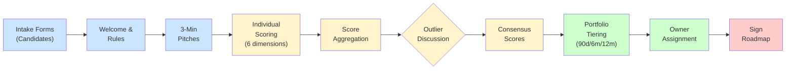

## Overview

This is Part 2 of 2 of the AI Transformation Consultant Toolkit 2026. For Part 1, see [Part 1 of 2: Client Maturity Journey & Archetypes, AI Readiness Assessment, Discovery Questionnaire Bank](pathname:///archon/architecture/77-ai-transformation-consultant-toolkit-2026).

**Complete consultant toolkit for enterprise AI transformation engagements.** Stakeholder interview templates, use case prioritisation frameworks, FAQ banks, phase-gated checklists, and ready-to-use deliverable templates modelled on McKinsey, Deloitte, BCG, and Accenture methodologies.

For use with clients in any industry. All templates are framework-agnostic and should be customised to client context before engagement.

---

## Part 4: Stakeholder Interview Templates

Structured interview guides for 5 key stakeholder groups. Each template includes opening framing, core questions, probing techniques, and what to listen for. Use verbatim or adapt — the structure is more important than the exact wording.

### CEO / CAIO Interview Guide

**Duration:** 45 minutes  
**Setting:** Private  
**Tone:** Peer-to-peer, strategic

#### Opening Frame (2 minutes)

"Thank you for your time. I want to use this conversation to understand your vision for what AI transformation means for [Company Name] specifically — not AI in general, but what it means here, in your context, with your constraints. I'm going to ask some questions that might feel direct — they're designed to help me give you an honest assessment rather than tell you what you want to hear. Is that OK?"

#### Agenda

- Strategic vision for AI (10 min)
- Current state and past attempts (10 min)
- Organisational dynamics and constraints (10 min)
- Success definition and accountability (10 min)
- Open questions and next steps (5 min)

#### Key Questions (select 6–8)

- What does winning on AI look like for you in 3 years — not for the industry, for this company specifically?
- What is the single biggest thing standing between you and that vision today?
- If your #1 competitor deployed a fully autonomous AI agent for [key function] tomorrow, what would you do?
- Which leaders in your organisation are your biggest AI advocates? Which are your biggest blockers?
- What AI investment have you made in the last 12 months and what was the outcome — honestly?
- What would make you personally lose confidence in this programme and shut it down?
- If I could only improve one metric in your business using AI in the next 6 months, what should it be?
- What are you not telling me about AI at [Company] that I should know?

#### What to Listen For

- Specificity vs vagueness — vague vision = needs vision workshop before strategy
- Named metrics vs aspirational language — named metrics = real commitment
- Self-awareness about data and talent gaps — absent = overconfidence risk
- Willingness to say "I don't know" — intellectual honesty predicts programme success
- Whether they mention employees with empathy or only numbers — reveals culture

### CTO / CIO Interview Guide

**Duration:** 60–90 minutes  
**Setting:** Technical  
**Tone:** Architect-to-architect

#### Opening Frame

"I want to understand your technical landscape in enough depth to give you an honest architecture recommendation. I'm not here to sell you a particular technology — I'm here to understand your constraints and design something that will actually work in your environment. Some of my questions will be uncomfortable — they're designed to surface risks before they become failures."

#### Key Questions

- Walk me through your most recent major platform decision. Who made it, how was it made, and what would you do differently?
- What is the technical debt you are most afraid of? Specifically, what AI use cases does it make impossible today?
- Describe the last production incident that caused significant business impact. How was it detected, how long to resolve?
- If you had to containerise and deploy a new AI service by next Monday, what is the longest step in that process?
- What is your organisation's current process for approving a new SaaS tool with data access? How long does it take?
- Which of your enterprise systems would be most valuable to AI agents, and which have no API today?
- What is your relationship with your security team like? Do they block AI or help design it securely?
- Describe your dream architecture for AI in 3 years. Now, what prevents you from building it today?

#### Technical Red Flags to Listen For

- No CI/CD: every deployment is manual and slow — LLMOps will be painful
- No observability: "we find out about problems from users" — can't monitor AI quality
- No API gateway: enterprise systems are not AI-accessible without significant integration work
- Shadow IT: "teams use tools without telling us" — platform sprawl and security gaps
- No data catalogue: "we know where the data is" but it's not documented — AI integration will be slow

### Frontline Worker Focus Group Guide

**Duration:** 60 minutes  
**Group size:** 6–8 people  
**Setting:** Informal, no managers present  
**Goal:** Understand the human reality of AI adoption. Frontline workers know what's broken and what they're afraid of. Their trust determines adoption success.

#### Facilitation Rules

- No recording without explicit consent. Take notes by hand — recording creates anxiety.
- No names in notes. Assure anonymity explicitly and repeatedly.
- No managers or senior leaders in the room. Ever. Non-negotiable.
- Start with rapport — ask about their current work before mentioning AI.
- Never argue with fear or dismiss concerns — listen, validate, probe.

#### Discussion Questions

**Warm-up (5 min)**

Tell me about a typical day in your role. What takes up most of your time?

**Current pain (10 min)**

What is the most frustrating part of your job that you wish could be easier? What tools do you use today that you love or hate?

**AI awareness (5 min)**

Have you heard about the AI programme at [Company]? What have you heard — from any source?

**Concerns (15 min)**

What concerns do you have about AI in your workplace? What would worry you most? What would help you feel more confident?

**Aspirations (10 min)**

If AI could take over one part of your job that you dislike, what would you want it to handle? What parts of your job do you think only a human can do?

**Trust (10 min)**

What would an AI tool need to do for you to trust its output? What would make you distrust it?

**Wishes (5 min)**

If you could send one message to the people designing the AI programme, what would it be?

---

## Part 5: Use Case Prioritisation Framework

Translating discovery findings into a prioritised AI roadmap. Use this framework to facilitate a leadership workshop that produces an agreed, owned, funded use case portfolio — not a consultant's wish list.

### Use Case Scoring Rubric

Score each identified use case across 6 dimensions. Total score out of 60. Top scores go into the 90-day plan; remainder into the 6-month and 12-month roadmap.

| Dimension | 1 (Low) | 3 (Medium) | 5 (High) | Weight |
|-----------|---------|-----------|---------|--------|
| Business Value | Nice-to-have; no clear metric | Clear metric; $100K–$1M impact | Core metric; $1M+ impact or strategic | ×2 |
| Data Readiness | Data doesn't exist or is inaccessible | Data exists but needs cleaning | Clean, labelled, accessible data ready | ×2 |
| Technical Feasibility | Requires unproven technology or new stack | Requires moderate technical build | Proven pattern; existing stack | ×1.5 |
| Time to Value | >12 months to first result | 3–12 months to first result | <3 months to first result | ×1.5 |
| Organisational Readiness | Strong resistance; no sponsor | Mixed reception; sponsor identified | Enthusiastic team; clear owner | ×1 |
| Risk Level | High: regulatory, safety, or reputational risk | Medium: limited downside; manageable | Low: internal tool; reversible | ×1 |

### Use Case Intake Form

Complete one form per candidate use case before the prioritisation workshop.

**Use Case Name:** ___

**Business Problem Statement (what pain does this solve?):** ___

**Primary Beneficiary (team/department/customer):** ___

**Business Sponsor Name & Title:** ___

**Success Metric (how will we know it worked?):** ___

**Target Metric Value (what number constitutes success?):** ___

**Estimated Annual Value if Successful ($):** ___

**Key Data Sources Required:** ___

**Estimated Build Timeline (weeks):** ___

**Known Risks or Constraints:** ___

**Dependencies on Other Teams or Systems:** ___

**Has This Been Attempted Before? If so, what happened?:** ___

### Portfolio Prioritisation Workshop Agenda

2-hour facilitated session with business sponsors and technical leads.

| Time | Activity | Facilitator | Output |
|------|----------|-------------|--------|
| 0:00–0:10 | Welcome & Rules: decisions made today are binding commitments | AI Architect | Shared commitment |
| 0:10–0:30 | Use Case Presentations: 3-minute pitch per use case by sponsor | Sponsors | Shared understanding |
| 0:30–0:55 | Individual Scoring: each participant scores all use cases on rubric | All | Score sheets |
| 0:55–1:15 | Score Aggregation & Debate: outlier scores discussed; consensus built | Facilitator | Agreed scores |
| 1:15–1:40 | Portfolio Assignment: top 3 = 90-day; next 4 = 6-month; rest = 12-month | All | Tiered roadmap |
| 1:40–1:55 | Owner Assignment: each use case gets a named business owner | Leaders | Accountability map |
| 1:55–2:00 | Next Steps & Commitment: sign the prioritisation document | AI Architect | Signed roadmap |

**Use Case Prioritisation Workshop Flow.** Candidates move from intake through pitched presentations into multi-criteria scoring (Business Value, Data Readiness, Technical Feasibility, Time to Value, Org Readiness, Risk Level). Scores drive portfolio tiering: highest-scoring use cases enter the 90-day plan with named owners and board sign-off.

---

## Part 6: FAQ Bank — All Client Scenarios

70+ frequently asked questions with consultant-grade answers. Memorise the structure: validate the concern, give the honest answer, redirect to constructive action. Never dismiss a question — every question is a window into a concern that will block the programme if unaddressed.

### Executive FAQs — The Sceptical CEO

**Q: How do I know this isn't just hype? My team has told me AI will transform everything before.**

A: You're right to be sceptical — most AI transformations fail not because of bad technology but because of poor execution: wrong use cases, dirty data, or no change management. The honest answer is: AI is real and is delivering measurable results in specific use cases. The question is which use cases and in what sequence. Our job is to find the ones that work in your specific context, not the ones that look good in a slide.

**Action:** Run a 2-week discovery sprint. Find one use case with clean data and clear ROI. Prove it before scaling.

---

**Q: My competitors are all announcing AI — are they actually using it or just announcing it?**

A: Both. The public announcements are 80% aspiration and 20% real production deployment. However, the 20% is compounding. The companies that have working AI systems today are building institutional knowledge that takes 12–18 months to replicate. The most dangerous scenario is waiting another 12 months to start.

**Action:** Commission competitive AI intelligence: which use cases are competitors actually running? This often clarifies the urgency better than any analyst report.

---

**Q: How much is this going to cost and what is the realistic ROI?**

A: Honest answer: Discovery phase costs $150K–$300K for an enterprise. First production AI system: $300K–$1M depending on complexity. Ongoing platform and operations: $200K–$500K/year. ROI depends entirely on the use case — we have seen 3x in 6 months and 5-year paybacks on others. The only way to give you an accurate ROI is to complete the discovery and model it against your specific workflows.

**Action:** Commit to discovery phase only. ROI modelling is a discovery output, not an input.

---

**Q: What happens to my employees? How many jobs will AI eliminate?**

A: This question deserves a serious answer, not reassurance. AI will change more jobs than it eliminates. The honest breakdown: roughly 20% of current tasks will be fully automated, 60% will be augmented (humans + AI working together), and 20% remain unchanged. Net employment impact in most enterprises we work with is flat or positive in year 1 because efficiency gains fund growth, not headcount reduction. But specific roles will change significantly, and managing that transition requires intentional workforce investment.

**Action:** Commission workforce impact assessment as part of discovery. Communicate findings to employees before the rumour mill does.

---

**Q: Who is accountable when the AI makes a mistake?**

A: The organisation is. Always. AI is a tool — like any tool, the organisation that deploys it is responsible for its outcomes. This means: governance must be designed before deployment, not retrofitted after an incident. The AI Architect's job includes designing accountability frameworks, audit trails, and incident response before the first agent goes live.

**Action:** Include accountability matrix in the AI Governance Charter. Legal must sign before any production deployment.

---

### Technical FAQs

**Q: Should we build our own LLM or use an API?**

A: For 95% of enterprises: use an API. Building a foundation model requires $50M–$500M+ in compute, world-class ML research teams, and terabytes of curated training data. What you should consider building: fine-tuned variants of open-source models on your proprietary data. This creates a competitive moat without the cost of building from scratch. The ROI decision: fine-tuning costs $50K–$200K and creates proprietary capability. Building from scratch costs $50M+ and is rarely justified outside Big Tech.

**Action:** Establish API-first strategy with fine-tuning as a follow-up investment after 3+ production systems are live.

---

**Q: How do we choose between RAG and fine-tuning?**

A: Short answer: start with RAG, add fine-tuning for style and domain dialect later. RAG is better when data changes frequently, you need source citations, or you lack training data. Fine-tuning wins when you have stable knowledge, need specific tone/format, or have very high inference volume that makes per-query retrieval cost prohibitive. Most production systems in 2026 use both: RAG for knowledge retrieval, fine-tuning for response style alignment.

**Action:** Start with RAG for pilot. Evaluate fine-tuning after 6 weeks of production data feedback.

---

**Q: What vector database should we use?**

A: It depends on your scale and existing stack. Pinecone for fastest time-to-production with no infra ops. pgvector if you're already on PostgreSQL and scale is <10M vectors. Weaviate for complex multi-tenant schemas. Qdrant for highest throughput production workloads. Chroma only for prototyping — not production-ready at scale.

**Action:** Match vector DB choice to your scale expectations and existing data stack. Default to Pinecone if starting from zero.

---

**Q: How do we prevent AI hallucinations in production?**

A: Three layers: architectural, operational, and human. Architecture: RAG with mandatory source citation constrains the model to retrieved facts. Operational: faithfulness evaluation (RAGAS) on sampled outputs catches drift. Human: review gates on all customer-facing outputs until trust is established. No system eliminates hallucination — the goal is to detect, contain, and correct them faster than they cause harm.

**Action:** Design a hallucination monitoring dashboard as a production requirement, not an afterthought.

---

**Q: Our data is in 15 different systems. Where do we start?**

A: Start with the system that contains data for your highest-priority use case, and build one MCP server for it. Resist the temptation to build a unified data layer first — that is a 12-month programme that delays value. Build one integration, prove the value, then invest in the platform. Priority order: highest business value use case data first, regardless of technical elegance.

**Action:** Create an integration roadmap focused on use-case-driven data access, not platform-driven consolidation.

---

### Legal & Compliance FAQs

**Q: What does the EU AI Act mean for us?**

A: If you operate in Europe or sell to European customers, you need to know your AI risk tier. High-risk AI (HR, credit, healthcare decisions) requires conformity assessments, bias testing, and human oversight. Prohibited AI (social scoring, real-time biometric surveillance) cannot be deployed. GPAI models above 10^25 FLOPs face systemic risk obligations — this affects which models you build on. Penalties: up to 3% of global revenue. This is not theoretical — enforcement began in 2024.

**Action:** Commission an EU AI Act impact assessment as the first governance deliverable.

---

**Q: Can we send customer data to ChatGPT or Claude?**

A: Depends on your regulatory environment and data classification. Standard API use: data may be used for model training by some providers — read the terms carefully and opt out. For HIPAA: must have a Business Associate Agreement in place with the provider. For GDPR: data processing must have legal basis, provider must be GDPR compliant. For confidential business data: review your data classification policy — many enterprises prohibit sending classified data to external APIs. The safest path: use enterprise-tier APIs (Azure OpenAI, AWS Bedrock, Anthropic Enterprise) with contractual data protection terms.

**Action:** Map your data classification policy to vendor options. Enterprise APIs provide the safest contractual terms for regulated data.

---

**Q: How do we explain AI decisions to customers who are affected by them?**

A: The EU AI Act requires explainability for high-risk AI decisions affecting individuals. In practice, this means: model cards for each AI system, logging of decision factors, human review process for contested decisions, and a customer-facing explanation on request. Design explainability into the architecture, not the UI — if the model cannot tell you why it made a decision, you cannot explain it to a customer.

**Action:** Include explainability requirements in all use case designs from day 1. Treat "black box decisions affecting customers" as a deployment blocker.

---

**Q: What AI use cases are simply off the table legally?**

A: Prohibited under EU AI Act: real-time biometric surveillance in public spaces, social scoring systems, manipulation of human behaviour subconsciously. Very high risk requiring specific legal basis: automated hiring decisions, credit scoring, insurance risk, benefits eligibility. Practically off-limits without expert counsel: medical diagnosis, legal advice, decisions affecting criminal justice. The rule of thumb: if an AI decision significantly affects a person's life without human review, you need legal sign-off before proceeding.

**Action:** Map all candidate use cases against prohibited/high-risk categories. Legal sign-off required before moving to architecture phase.

---

### HR & Workforce FAQs

**Q: How do we communicate AI to employees who are scared of losing their jobs?**

A: Be honest and specific, not reassuring and vague. Tell employees exactly which tasks AI will take over, which tasks will change, and what support you're providing for the transition. Vague reassurance ("AI will create new jobs") is worse than honest specifics. The most effective communication: "Here are the 5 tasks in your role that AI will handle by Q3. Here is the training programme we're running to help you focus on the 15 tasks only humans can do. Here is who to talk to if you have concerns."

**Action:** Communication plan must be ready before any AI pilot is announced externally.

---

**Q: What skills should we be hiring for in AI teams?**

A: Priority hire in 2026: AI Architects (rarest, most expensive — $250-400K total comp). ML Engineers with production MLOps experience (not research). Data Engineers who understand vector stores and streaming. Prompt Engineers (emerging — can be grown internally from existing staff). AI Product Managers who understand probabilistic system design. What you don't need to hire: data scientists for every use case. Many use cases are architecture + prompt engineering, not model training.

**Action:** Build your 2026 AI team around architects + ML engineers. Prompt engineering skills can be developed internally.

---

**Q: How do we build an AI culture when most of our employees aren't technical?**

A: AI culture is not about making everyone a developer. It is about: psychological safety to experiment (safe-to-fail environment), access to tools that let non-technical employees use AI (Copilot, Claude, Gemini Workspace), visible leadership usage (CEO showing their AI workflow publicly), and a recognition system that celebrates AI-powered work, not just volume of work. The citizen developer programme — low-code/no-code AI tools — is your cultural entry point.

**Action:** Launch an AI Champion programme before the formal training rollout. Champions create culture; training creates awareness.

---

---

## Part 7: Phase-Gated Checklists

Production deployments gate on these checklists. Nothing ships without sign-off. Each checklist has an owner (Architect, Client, Legal) and a gate criterion. Print and complete in client meetings — visible progress builds trust.

### Pre-Engagement Checklist

Complete before the first client meeting. Missing items delay engagement start.

#### Consultant Preparation

- Industry research: top 5 AI use cases in client's vertical with ROI data
- Competitive intelligence: what AI has client's top 3 competitors announced?
- Regulatory landscape: what compliance requirements govern client's AI use?
- Data landscape: what is known about client's current data infrastructure?
- Stakeholder research: LinkedIn profiles + press quotes from key leaders

#### Engagement Setup

- Non-Disclosure Agreement signed before any sensitive data is shared
- Statement of Work drafted for Discovery phase with clear deliverables
- Engagement kickoff meeting scheduled with all key stakeholders
- Client point-of-contact identified who can make decisions
- Access requests submitted for relevant systems and documentation

#### Internal Consultant Alignment

- AI Readiness Assessment template customised for client industry
- Discovery questionnaire selected and customised (8–12 questions per stakeholder)
- Engagement risk assessment completed (regulatory, data, organisational)
- Resource plan confirmed: architect, data engineer, change manager allocated
- Success metrics defined and agreed with engagement partner

### Architecture Review Checklist

Gate criterion: Architecture must pass all CRITICAL items before build phase begins.

#### Data Architecture [CRITICAL]

- Data source inventory completed with API status for each source
- Data quality assessment completed with remediation plan for gaps
- PII identification and masking strategy documented
- Data access control design reviewed and approved by security
- Vector database selection documented with justification
- Embedding model selection documented with evaluation results
- Data retention and deletion policy defined for AI-generated data

#### AI System Architecture [CRITICAL]

- LLM selection documented with eval scores on domain-specific test set
- RAG vs fine-tuning decision documented with rationale
- Context window strategy documented (chunk size, retrieval strategy)
- Model serving architecture documented (latency, throughput, cost model)
- Prompt versioning strategy defined
- Evaluation framework designed: metrics, golden dataset, automated gates
- Canary deployment strategy defined for model updates

#### Agentic Architecture (if applicable) [CRITICAL]

- Agent permission scope defined — minimum viable permissions only
- Kill switch and circuit breaker designed and documented
- Human-in-the-loop gates identified for all high-stakes decisions
- Agent audit trail design reviewed and approved by legal
- Max-iterations guard implemented and tested
- Tool authentication and MCP server security reviewed
- Agent failure modes documented with response procedures

#### Security Architecture [CRITICAL]

- Threat model completed with AI-specific attack vectors (prompt injection, data exfiltration)
- DLP (Data Loss Prevention) strategy for all AI inputs and outputs
- IAM roles for AI systems reviewed with least-privilege principle
- API key management and rotation policy defined
- Audit logging design reviewed and approved
- Incident response plan for AI-specific failures documented
- Third-party AI vendor security assessment completed

#### Governance Architecture [ADVISORY]

- AI Governance Charter v1 drafted and sent for legal review
- Model card template created and completed for pilot use case
- Bias testing plan designed with demographic groups identified
- Regulatory compliance check completed (EU AI Act, HIPAA, etc.)
- AI ethics review completed by nominated reviewer
- Communication plan for AI deployment drafted
- Training plan for users of the AI system drafted

### Production Deployment Checklist

Gate criterion: ALL items must be complete. No partial deployment to production.

#### Quality Gates

- Evaluation suite passing on all automated metrics (faithfulness >0.80, relevance >0.80)
- LLM-as-judge quality score within accepted range on 50-sample test set
- Latency P99 within SLA requirement (document specific target: ___ms)
- Cost-per-query within budget model (document target: $___ per 1K queries)
- Load test completed at 2x expected peak traffic
- Regression test: new version does not degrade metrics from previous version
- Red-team safety test: adversarial inputs tested and failure modes documented

#### Operational Readiness

- Monitoring dashboard live: latency, cost, quality, safety metrics
- Alerting configured: PagerDuty/OpsGenie for quality degradation, cost spikes, errors
- Canary deployment configured: 5% of traffic to new version, 95% to baseline
- Rollback procedure tested and documented (target: < 5 minutes to rollback)
- On-call rotation established for AI system with documented escalation path
- LangSmith/Arize/Phoenix observability traces verified in production
- Cost dashboard live with budget alerts configured

#### Governance Sign-Off

- AI Governance Charter signed by CAIO or designated authority
- Legal sign-off on use case (data usage, liability, compliance)
- Security sign-off: CISO or security lead has reviewed and approved
- Model card completed and filed in model registry
- Privacy Impact Assessment completed (if PII involved)
- Training completed for all users of the AI system (completion rate >80%)
- User communication sent: what AI does, what it doesn't do, how to report issues

#### Business Readiness

- Business owner signed off: they accept accountability for AI outputs in their domain
- Escalation path documented: when users should override AI recommendation
- Feedback mechanism live: users can flag incorrect or harmful AI outputs
- Success metrics dashboard live and shared with business owner
- First-90-days review scheduled with stakeholders
- Support process defined: who users call when AI behaves unexpectedly

### Post-Deployment Monitoring Checklist

Run weekly for first 3 months, then monthly.

#### Week 1–4: Intensive Monitoring (Daily)

- Quality metrics reviewed: faithfulness, relevance, cost, latency
- User feedback log reviewed: any flags of incorrect or harmful outputs?
- Error rate reviewed: LLM API errors, tool failures, timeouts
- Cost vs forecast: is actual spend within 10% of model?
- Canary comparison: is new model performing as expected vs baseline?
- Usage adoption: are target users actually using the system?
- Any incidents? If yes, incident report filed and root cause documented.

#### Month 2–3: Stability Monitoring (Weekly)

- Quality drift check: 7-day rolling average vs baseline
- LLM-as-judge evaluation on 50-sample weekly production set
- User satisfaction signal (NPS or CSAT if available)
- Model version: is there a newer model available that should be evaluated?
- Data drift: have input data distributions changed significantly?
- Bias audit: any demographic disparities in output quality emerging?
- Next use case evaluation: is the team ready to expand?

#### Ongoing: Quarterly AI Health Review

- Full evaluation suite re-run on latest production data
- Benchmark comparison: how does current system compare to available frontier models?
- Cost optimisation review: model routing, prompt caching, batch API opportunities
- Governance review: any new regulations that affect this deployment?
- User adoption review: what percentage of target users are active?
- Business outcome review: are the promised metrics being delivered?
- Roadmap review: what is the next AI investment priority?

---

## Part 8: Templates & Deliverable Frameworks

Ready-to-use templates for every major engagement deliverable. Adapt to client branding and context. Never deliver a template without populating all client-specific fields — a blank template is worse than no template.

### AI Business Case Template

**Target:** CFO + CEO sign-off  
**Length:** 2–3 pages  
**Tone:** Financial, precise

#### Executive Summary (1 paragraph)

One sentence problem. One sentence proposed solution. Three numbers: investment, projected return, payback period.

#### Problem Statement

Quantified description of current pain: hours lost/week, error rate, cost per transaction, customer satisfaction score, competitive gap. Every claim must have a number attached.

#### Proposed AI Solution

What AI does (in plain English). What it does not do. How humans and AI collaborate. Which team deploys it and who owns it ongoing.

#### Financial Model

Investment: Year 1 build ($___), Year 2 operations ($___), Year 3 operations ($___). Returns: Labour hours saved × fully-loaded cost rate. Error reduction × cost per error. Revenue impact (if applicable). Total 3-year NPV. Payback period.

#### Risk Assessment

Technical risks and mitigations. Organisational risks and mitigations. Regulatory risks and mitigations. What happens if we don't do this (opportunity cost).

#### Success Metrics & Milestones

90-day: [specific metric, target value]. 180-day: [metric, target]. 12-month: [metric, target]. Who owns each metric. Review cadence.

#### Decision Required

Single, specific ask: "Approval for $[amount] to commence [specific phase] by [date]." No ambiguous asks. One decision per document.

---

### AI Governance Charter Template

Required document. Must be signed before any production AI deployment. Legal must review. This is the constitution for all AI activity at the organisation.

| Section | Key Content Required |
|---------|----------------------|
| **Preamble** | Organisation's commitment to responsible AI. Values: transparency, fairness, accountability, safety. |
| **Scope** | Which AI systems does this charter govern? Included: all AI systems deployed by [Organisation]. Excluded: personal productivity AI tools below [data sensitivity threshold]. |
| **Governance Structure** | AI Governance Board composition, meeting cadence, decision rights, escalation path. Who can approve: use cases [role], budget [role], architecture [role], incident response [role]. |
| **Use Case Approval Process** | Intake form→Risk assessment→Technical review→Legal review→Ethics review→Board approval. Timeline: standard (30 days), expedited (10 days), emergency (48 hours). |
| **Prohibited Use Cases** | Exhaustive list of AI uses this organisation will never pursue. Examples: social scoring, biometric surveillance without consent, manipulative personalisation. |
| **Data Governance for AI** | Data classification for AI use. PII handling requirements. Retention policies. Deletion on request. Cross-border data flow restrictions. |
| **Model Governance** | Model registry requirements. Model card mandate. Evaluation criteria before deployment. Drift monitoring policy. Retirement process. |
| **Human Oversight** | Mandatory human review triggers. Escalation thresholds. Override rights for human operators. Logging of human interventions. |
| **Bias & Fairness Standards** | Demographic groups to be monitored. Fairness metrics and thresholds. Audit frequency. Remediation process when bias detected. |
| **Incident Response** | Definition of AI incident. Severity classification. Response SLAs. Communication requirements. Post-incident review mandate. |
| **Review & Amendment** | Charter review frequency (annual minimum). Amendment process. Who can propose amendments. Board approval required for all changes. |

---

### ROI Tracking Dashboard Template

Monthly dashboard shared with executive sponsor. Tells the story of AI value in numbers.

**Metrics to Track per AI System**

| Category | Metric | Baseline | Current | Target | Trend |
|----------|--------|----------|---------|--------|-------|
| Quality | AI Output Accuracy / Faithfulness | N/A | ___ | ≥0.85 | ↑↓→ |
| Quality | Error Rate / Hallucination Rate | N/A | ___ | <2% | ↑↓→ |
| Adoption | Active Users / Target Users | 0% | ___ | >70% | ↑↓→ |
| Adoption | Queries per Active User per Week | 0 | ___ | >20 | ↑↓→ |
| Efficiency | Task Time Saved per User (hrs/wk) | 0 | ___ | ___ | ↑↓→ |
| Efficiency | Throughput Increase (%) | 0% | ___ | ___ | ↑↓→ |
| Cost | Cost per Query ($) | N/A | ___ | < $___ | ↑↓→ |
| Cost | Monthly AI Infrastructure Spend ($) | $0 | ___ | < $___ | ↑↓→ |
| Business | Business Metric Impacted | ___ | ___ | ___ | ↑↓→ |
| Business | Annualised $ Value Delivered | $0 | ___ | ___ | ↑↓→ |
| Governance | Safety Incidents in Period | 0 | ___ | 0 | ↑↓→ |
| Governance | Bias Audit Status | N/A | ___ | Passed | ↑↓→ |

---

### AI Vendor Evaluation Scorecard

Use when evaluating LLM providers, vector DB vendors, observability platforms. Score 1–5. Weight reflects enterprise AI priorities.

| Dimension | Criteria | Weight | Vendor A | Vendor B | Vendor C |
|-----------|----------|--------|----------|----------|----------|
| Capability | Benchmark scores on your domain-specific eval | 25% | ___ | ___ | ___ |
| Security | SOC2, ISO 27001, HIPAA BAA, data residency | 20% | ___ | ___ | ___ |
| Cost | Total cost of ownership: API + infra + support | 15% | ___ | ___ | ___ |
| Reliability | SLA %, uptime history, support response time | 15% | ___ | ___ | ___ |
| Integration | API quality, SDK support, enterprise connectors | 10% | ___ | ___ | ___ |
| Governance | Model cards, audit support, explainability | 10% | ___ | ___ | ___ |
| Roadmap | Innovation velocity, customer alignment, longevity | 5% | ___ | ___ | ___ |
| **TOTAL (weighted)** | | **100%** | **___** | **___** | **___** |

---

*This toolkit is Part 2 of 2. Part 1 contains Client Maturity Journey & Archetypes, AI Readiness Assessment, and Discovery Questionnaire Bank.*

*Adapt all templates to your client's industry, vocabulary, and risk profile. The structure is more important than the exact wording. Update questions and checklists as your engagement experience grows — the best consultants don't use templates mechanically; they use them as a foundation for the judgment that only experience can provide.*
