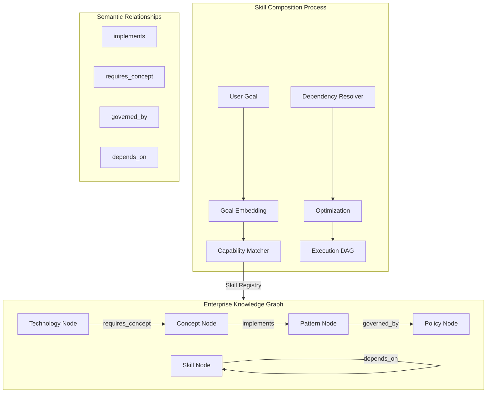

<!-- Part 2 of 3 - See also: Part 1 (pathname:///archon/architecture/81-eaka-research-study) and Part 3 (pathname:///archon/architecture/parts/34-eaka-research-study-part3) -->

## Enterprise Agent Knowledge Architecture (EAKA) Research Study

Part 2 of 3: Skill Composition, Governance, Knowledge Graph, MCP & Ecosystem Integration

### 5. Dynamic Skill Composition

Dynamic Skill Composition is the ability for agents to automatically assemble specialist capabilities in response to a user goal — without manual configuration. The Skill Composer analyses goal requirements and constructs an optimal composition of Enterprise Skills.

#### 5.1 Composition Example

User Goal: "Implement secure authentication for an AWS service." 

Automatically composed skills:
- Identity Skill → IAM patterns, OAuth2/OIDC, SAML
- AWS Skill → AWS IAM, Cognito, STS, SDK docs
- Security Skill → Threat modelling, OWASP Top 10, pen-test patterns
- Architecture Skill → Zero-trust patterns, ADR retrieval
- Documentation Skill → Runbook generation, OpenAPI annotation
- Testing Skill → Security test cases, integration test scaffolding

#### EAKA Part 2 — Skill Composition & Knowledge Graph Model

**Skill composition drives knowledge graph traversal:** The Composition Process ingests a user goal and queries the Skill Registry backed by the Enterprise Knowledge Graph. Semantic relationships (implements, governed_by, requires_concept, depends_on) enable multi-hop reasoning. The output is an optimized directed acyclic graph (DAG) of skill invocations respecting governance policies.

#### 5.2 Composition Algorithm

- **Step 1 — Goal Embedding:** encode goal into semantic vector.
- **Step 2 — Capability Matching:** retrieve top-k Skills from registry by cosine similarity.
- **Step 3 — Dependency Resolution:** traverse Skill dependency graph; add transitive dependencies.
- **Step 4 — Conflict Detection:** identify conflicting tool requirements or policy contradictions.
- **Step 5 — Optimisation:** minimise total context budget while maximising capability coverage.
- **Step 6 — Execution Graph:** produce a directed acyclic graph (DAG) of Skill invocations.
- **Step 7 — Parallel Execution:** execute independent Skill branches concurrently.
- **Step 8 — Result Fusion:** merge outputs with cross-skill consistency checking.

#### 5.3 Composition Planning Algorithms

| **Algorithm** | **Approach** | **Best For** | **Complexity** |
|---|---|---|---|
| Greedy Coverage | Add highest-coverage skill iteratively | Fast, low-complexity goals | O(n log n) |
| Constraint Solver | ILP optimisation over skill × budget matrix | Budget-constrained compositions | NP-hard, approximated |
| Graph Search (A*) | Heuristic search over skill dependency graph | Deep dependency chains | O(b^d) with pruning |
| Learned Policy | RL-trained composition policy network | High-frequency goal patterns | O(1) inference |
| Hybrid Planner | Graph search seeded by learned policy | Production enterprise deployments | Best of both |

#### 5.4 Composition Governance

- Maximum composition depth: configurable per deployment (default: 6 skill levels).
- Budget cap per composition enforced by Context Planner.
- Security boundary: skills from different data-classification tiers cannot share context.
- Audit log records every composition decision for post-hoc review.

### 6. Agent Knowledge Governance

Enterprise AI systems must operate under rigorous governance — not only for compliance but for trust. EAKA's Governance Engine enforces policies across knowledge quality, source authority, skill approvals, access control, and audit trails.

#### 6.1 Trust Score Model

Every knowledge artefact and skill carries a computed Trust Score (0–100) derived from:

- **Source Authority** (30 pts) — tier weighting: T1=30, T2=24, T3=18, T4=10, T5=6.
- **Freshness** (25 pts) — exponential decay from last-verified timestamp.
- **Ownership Quality** (20 pts) — SME-assigned, recently reviewed artefacts score higher.
- **Validation Coverage** (15 pts) — percentage of claims with automated test coverage.
- **Usage Feedback** (10 pts) — positive agent-use outcomes weighted over time.

#### 6.2 Conflict Resolution Protocol

**Conflict Resolution Protocol**

**Notify downstream skills of resolution**

#### 6.3 Compliance and Auditability

| **Requirement** | **EAKA Mechanism** | **Audit Evidence** |
|---|---|---|
| GDPR / Data Privacy | PII classification tags + access control per skill | Access log per query + data-class attribution |
| Regulatory compliance | Policy injection into KEP at plan time | KEP export with policy references |
| IP / Confidentiality | Source-tier access controls; DLP checks on output | Redaction log; DLP event stream |
| Change management | Approval workflow with version history | Git-like immutable skill history |
| Incident response | Full KEP replay for any prior execution | KEP archive with inputs/outputs |
| Model governance | Eval suite pass/fail per skill version | Evaluation report per release |

#### 6.4 Deprecation Workflow

- Deprecation notice published 90 days before retirement (T-90).
- Downstream agents notified via Skill Registry subscription events at T-90, T-30, T-7.
- At T-0, skill status transitions to 'Retired'; all invocations return structured deprecation error.
- Retired skills remain in read-only archive for audit and rollback purposes.

### 7. Enterprise Knowledge Graph

The Enterprise Knowledge Graph (EKG) is the semantic backbone of EAKA. Rather than indexing flat documents, the EKG represents organisational knowledge as a richly connected graph of concepts, technologies, people, policies, and capabilities — enabling agents to reason over relationships, not just retrieve text.

#### 7.1 EKG Node Types

| **Node Type** | **Key Properties** | **Example** |
|---|---|---|
| Concept | name, definition, taxonomy_path, trust_score | OAuth2, Zero-Trust, CQRS |
| Technology | name, vendor, version, lifecycle_status | AWS Cognito 2.x, Spring Security 6 |
| SDK | name, language, version, doc_url, changelog_url | AWS SDK for Java v2.20 |
| Pattern | name, intent, applicability, consequences | Circuit Breaker, Saga, CQRS |
| Policy | name, regulation_ref, data_class, owner | PCI-DSS-3.2 SecPolicy |
| Person | name, role, team, expertise[] | Jane Smith, Platform Architect |
| Project | name, status, team, repository_url | Auth Platform Modernisation |
| Repository | url, language, ci_status, last_commit | github.com/acme/auth-service |
| Agent | name, capabilities[], skill_refs[], version | SecurityAgent-v3 |
| Skill | id, version, status, owner, trust_score | AWS-IAM-Skill v2.1 |
| MCPServer | url, capabilities[], auth_model, health_status | github-mcp.acme.com |
| Tool | name, mcp_server, schema, rate_limit | search_code, create_issue |

#### 7.2 Key Edge Types

- Concept **implements** Pattern — links abstract patterns to concrete implementations.
- Skill **requires_concept** Concept — skill dependency on knowledge domains.
- Person **expertise_in** Technology — human expertise graph for escalation routing.
- Policy **governs** Pattern — compliance injection points.
- Repository **contains** SDK — code provenance for SDK documentation.
- Agent **uses_skill** Skill — agent capability tracking.
- Concept **supersedes** Concept — knowledge evolution over time.

#### 7.3 Graph Evolution Strategy

- **Event-driven updates** — graph mutated by change events from source connectors.
- **LLM-assisted edge inference** — new documents trigger relationship extraction; SME-gated commit.
- **Temporal versioning** — all edges carry a validity window [valid_from, valid_to].
- **Confidence-weighted edges** — inferred edges carry a confidence score; only high-confidence edges used by planner.
- **Conflict reconciliation** — contradictory edges trigger the Governance Engine conflict protocol.

#### 7.4 Query Patterns

- **Concept path query** — traverse from Business Capability to concrete implementation artefacts.
- **Expertise routing** — find SMEs by traversing Person → expertise_in → Technology edges.
- **Impact analysis** — identify all Skills/Agents affected by a knowledge node deprecation.
- **Freshness scan** — retrieve all nodes with trust_score < threshold for curation review.

### 8. MCP Integration

Model Context Protocol (MCP) is treated in EAKA not as a simple connector but as an **intelligent capability provider**. The MCP Integration Layer provides dynamic discovery, semantic tool selection, multi-server orchestration, and governance — transforming MCP into a first-class architectural component.

#### 8.1 MCP Capability Registry

Each registered MCP Server carries a structured capability manifest:

- **server_id** — globally unique identifier.
- **capabilities[]** — semantic capability descriptions (not just tool names).
- **tools[]** — full tool schema with input/output types and rate limits.
- **auth_model** — OAuth2, API key, mTLS, or identity-federated.
- **data_classifications[]** — what data tiers this server may access.
- **trust_level** — governance-assigned trust (Internal / Vendor / Community).
- **health_endpoint** — live health and latency metrics.
- **sla** — p95 latency, availability SLA, and support contact.

#### 8.2 Dynamic MCP Discovery

**Dynamic MCP Discovery and Tool Selection**

#### 8.3 Multi-MCP Orchestration

- **Parallel invocation** — independent tool calls across servers executed concurrently.
- **Sequential chaining** — output of one MCP tool piped as input to the next.
- **Fallback cascading** — if primary server fails, automatic failover to next-ranked server.
- **Result fusion** — cross-server results merged with source attribution preserved.
- **Budget enforcement** — total tool-call budget capped per KEP stage.

#### 8.4 MCP Security Boundaries

MCP server invocations are bound by the data classification of the invoking Skill. A Skill operating on Confidential data may not invoke an MCP server classified below Confidential. All cross-boundary attempts are blocked by the Governance Engine and logged for security review.

#### 8.5 Tool Governance

| **Control** | **Mechanism** | **Enforcement Point** |
|---|---|---|
| Access control | Skill-level RBAC + data-class matching | MCP Registry at dispatch time |
| Rate limiting | Per-server token bucket; burst allowance | MCP Client wrapper |
| Input validation | JSON Schema validation before dispatch | Skill Composer |
| Output validation | Schema + hallucination detector post-call | Evaluation Engine |
| Audit logging | Every tool call logged with KEP reference | Observability Layer |
| Deprecation | Tool version pinning; migration alerts | MCP Registry subscription |

### 9. Microsoft Agent Ecosystem Integration

Microsoft's agent ecosystem — spanning Azure AI Foundry, Microsoft 365 Copilot, Azure AI Agent Service, and Microsoft Fabric — provides enterprise-grade orchestration, identity, and governance infrastructure. EAKA integrates natively with this ecosystem while remaining vendor-neutral through open standards.

#### 9.1 Integration Architecture

| **Layer** | **Microsoft Component** | **EAKA Integration Point** |
|---|---|---|
| Identity & Auth | Entra ID (AAD), MSAL | Skill access control via OAuth2 + RBAC tokens |
| Orchestration | Azure AI Agent Service | EAKA Skill Composer as custom agent plugin |
| Knowledge | Microsoft Graph, SharePoint | T2/T3 source connectors in Federated Discovery Engine |
| Collaboration | Microsoft 365 Copilot | EAKA skills surfaced as Copilot extensions |
| Data Platform | Microsoft Fabric / Purview | Data lineage, classification, and policy enforcement |
| Model Hosting | Azure OpenAI / AI Foundry | Model endpoints for Skill execution and evaluation |
| Monitoring | Azure Monitor, Application Insights | EAKA observability telemetry pipeline |
| DevOps | Azure DevOps, GitHub Actions | Skill CI/CD pipeline integration |

#### 9.2 Skill Discovery via Microsoft Ecosystem

- Skills registered in EAKA Skill Registry are exposed as **Microsoft Copilot Plugins** via OpenAPI manifest.
- Azure AI Agent Service discovers EAKA skills through the **Agent Plugin Catalogue**.
- Skill metadata is indexed in **Microsoft Graph** for organisation-wide discoverability.
- Entra ID group membership drives skill-level access control automatically.

#### 9.3 Ecosystem Comparison

| **Dimension** | **Microsoft (AI Foundry)** | **AWS (Bedrock Agents)** | **Google (Vertex AI)** | **Open Source (LangGraph)** |
|---|---|---|---|---|
| Orchestration | Agent Service + Semantic Kernel | Bedrock Agent DAGs | Agent Builder | LangGraph / CrewAI |
| Skill/Tool model | Copilot Plugins + A2A | Action Groups | Extensions | Tools / Custom nodes |
| Knowledge store | Azure AI Search + Graph | Knowledge Bases (S3) | Vertex Search | Any (pluggable) |
| Identity | Entra ID (enterprise-grade) | IAM Roles | Workspace Identity | None (bring-your-own) |
| Governance | Purview + AI Foundry guardrails | Bedrock Guardrails | Model Armor | None native |
| MCP support | Preview (mid-2025+) | Partial (custom) | Partial (via SDK) | Full (open-source) |
| Openness | Proprietary + open standards | Proprietary | Proprietary | Fully open |
| EAKA fit | Best for enterprises on M365 | Best for AWS-native | Best for GCP-native | Best for custom/hybrid |

---

**Continued in Part 3:** Knowledge Context Engineering, Agent Reliability, Enterprise Reference Architecture, AI-Assisted Knowledge Lifecycle, Maturity Model & Roadmap, Platform Comparison Matrix.

**See also:** [Part 1 of 3](pathname:///archon/architecture/81-eaka-research-study), [Part 3 of 3](pathname:///archon/architecture/parts/34-eaka-research-study-part3)
