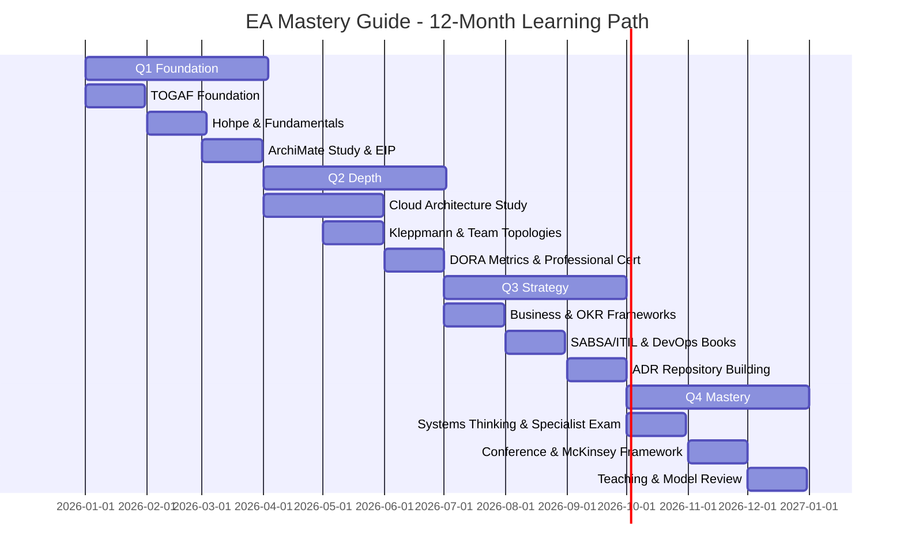

**This is Part 2 of 2.** For Part 1 covering EA frameworks, technical domains, and business & strategy domains, see [EA Mastery Guide Part 1](pathname:///archon/architecture/71-ea-mastery-guide).

---

## 04 — Must-Read Books

30 essential books — with a reading order.

### Tier 1 — Read First (Foundational Canon)

#### The Software Architect Elevator

*Gregor Hohpe (2020)*

The single best book for the modern EA. Hohpe describes the EA as the person who rides the elevator between the engine room (technology) and the penthouse (strategy). Packed with real-world patterns, anti-patterns, and hard-won lessons. If you read one book this year, read this one.

#### Enterprise Integration Patterns

*Gregor Hohpe & Bobby Woolf (2004)*

The definitive catalogue of 65 integration patterns — still the reference 20 years later. Every integration decision you make will reference a pattern in this book. Available as a free web reference at enterpriseintegrationpatterns.com.

#### Fundamentals of Software Architecture

*Mark Richards & Neal Ford (2020)*

The best modern textbook on software architecture. Covers architectural characteristics, patterns (layered, event-driven, microservices, space-based), decision-making, and the architect's role. Required reading for any architect.

#### Measure What Matters

*John Doerr (2018)*

The OKR bible. Every EA must understand how goals are set and measured at the organisational level. This is how strategy becomes action — and how EA outcomes are communicated in board language.

#### Business Model Generation

*Osterwalder & Pigneur (2010)*

The Business Model Canvas — the tool that grounds EA in business strategy. Without understanding the business model, the EA is designing for the wrong destination.

#### Accelerate

*Forsgren, Humble & Kim (2018)*

The research behind the DORA metrics. Proves with data how software delivery performance connects to organisational performance. The EA who can quote DORA metrics in a board conversation is the EA who gets listened to.

### Tier 2 — Read Next (Domain Depth)

#### Patterns of Enterprise Application Architecture

*Martin Fowler*

The patterns behind every enterprise application. Layering, data source, object-relational, web presentation, concurrency patterns. 40 patterns that still appear in modern architectures.

#### Building Microservices

*Sam Newman (2nd ed., 2021)*

The definitive guide to microservices architecture — decomposition strategies, service communication, distributed data management, and the real cost of microservices. Balanced and honest.

#### Designing Data-Intensive Applications

*Martin Kleppmann (2017)*

The most important technical book of the decade. Storage engines, distributed systems, stream processing, consensus algorithms. Must-read for any EA touching data architecture.

#### Team Topologies

*Skelton & Pais (2019)*

Four team types (Stream-aligned, Enabling, Complicated-subsystem, Platform) and three interaction modes. Reframes how architecture teams are organised. The EA who doesn't understand Team Topologies will design systems that cannot be delivered.

#### The Phoenix Project

*Kim, Behr & Spafford (2013)*

Business novel about IT transformation. More EAs have changed their practice from this book than from any framework document. Read it on a weekend.

#### Rewired

*Eric Lamarre, Kate Smaje, Rodney Zemmel (McKinsey, 2023)*

McKinsey's framework for digital and AI transformation. Six capabilities every organisation must build. The EA's strategic language for board conversations.

#### Thinking in Systems

*Donella Meadows (2008)*

Systems thinking — the intellectual foundation of enterprise architecture. Feedback loops, stocks and flows, leverage points. Transforms how you see organisational and technical complexity.

#### The Architecture of Trust

*Andrew Sherwood (SABSA, 2022)*

The deep dive into enterprise security architecture practice. Builds on SABSA framework with real case studies. Essential for security-focused EAs.

### Tier 3 — Advanced & Specialist Reading

- Mastering ArchiMate — Gerben Wierda | The ArchiMate practitioner bible
- Chess and the Art of Enterprise Architecture — Gerben Wierda | Strategy and architecture
- A Seat at the Table — Mark Schwartz | IT leadership in the DevOps era
- The DevOps Handbook — Kim, Humble, Willis, Debois | DevOps transformation guide
- Lean Enterprise — Humble, Molesky, O'Reilly | Lean principles applied to large organisations
- Designing Distributed Systems — Brendan Burns | Patterns for distributed systems (free PDF)
- The Data Warehouse Toolkit — Ralph Kimball | Dimensional modelling fundamentals
- AI Superpowers — Kai-Fu Lee | AI geopolitics and business strategy
- The Innovator's Dilemma — Clayton Christensen | Disruption theory — every EA needs this lens
- Digital Transformation — Thomas Siebel | Enterprise-scale digital transformation case studies
- An Introduction to Information Engineering — James Martin | Classic EA and data planning text
- TOGAF Standard 10th Edition — The Open Group | Read cover to cover once, then use as reference
- NIST Cybersecurity Framework 2.0 — NIST | Free — the global security architecture standard
- Hidden Technical Debt in Machine Learning Systems — Google (NIPS 2015) | Free paper — ML production essentials
- A Philosophy of Software Design — John Ousterhout | Deep module design and complexity management
- Staff Engineer — Will Larson | The technical leadership path — highly relevant for senior EAs

---

## 05 — Websites, Blogs & Communities

Where the best EAs go to stay current.

### Key Resources

#### The Open Group Blog

Official publications, standards updates, and practitioner insights from the maintainers of TOGAF and ArchiMate. Subscribe to their newsletter — every major framework update is published here first.

- **Reference:** blog.opengroup.org

#### EA Voices (eavoices.com)

Aggregated enterprise architecture wisdom from across the blogosphere — pulls the best EA content into one daily feed. A curated daily read for staying current across the profession.

- **Reference:** eavoices.com

#### Gartner Research (gartner.com)

The definitive enterprise technology research. The Magic Quadrant reports, Hype Cycle, and EA trend analysis. Many organisations have institutional access — if yours does, use it heavily.

- **Reference:** gartner.com/en/information-technology/insights/enterprise-architecture

#### Martin Fowler's Blog (martinfowler.com)

The most cited software architect in history. Patterns, refactoring, microservices, agile. Every post is worth reading. His Bliki (blog-wiki hybrid) is a masterclass in structured technical thinking.

- **Reference:** martinfowler.com

#### Gregor Hohpe's Blog (architectelevator.com)

Author of Enterprise Integration Patterns and The Software Architect Elevator. Real-world EA advice, patterns, and transformation insights. Subscribe immediately.

- **Reference:** architectelevator.com

#### IASA Global (iasaglobal.org)

The International Association of Software and Systems Architects. Professional body for the architecture profession. Architecture & Governance Magazine, skills frameworks, community forums.

- **Reference:** iasaglobal.org

#### InfoQ (infoq.com)

High-quality technical articles, talks, and podcasts on software architecture, DevOps, AI, and cloud. One of the best signal-to-noise ratios in tech publishing.

- **Reference:** infoq.com/architecture-design

#### AWS Architecture Center

The best free cloud architecture reference library. AWS Well-Architected, reference architectures, whitepapers on every domain. Equally valuable even if you're not AWS-first.

- **Reference:** aws.amazon.com/architecture

#### Ardoq Blog (ardoq.com/blog)

One of the most consistently excellent EA practitioner blogs. Deep content on application rationalisation, EA maturity, capability modelling, and AI in EA. Research-backed.

- **Reference:** ardoq.com/blog

#### Architecture & Governance Magazine

IASA Global's online publication. Leadership, governance, business alignment, and EA trends. Published for EAs, by EAs. Free access.

- **Reference:** architectureandgovernance.com

#### ThoughtWorks Technology Radar

Published twice yearly — the most influential technology adoption guide in the industry. Adopt/Trial/Assess/Hold classifications for languages, frameworks, tools, and platforms. Required bi-annual reading.

- **Reference:** thoughtworks.com/radar

#### DORA Research (dora.dev)

The official home of DevOps Research and Assessment metrics. Annual State of DevOps Report is free — the most important annual benchmark for delivery performance.

- **Reference:** dora.dev

#### Gartner Hype Cycle (free summaries)

Annual technology hype cycle tracks 2,000+ technologies through Innovation Trigger, Peak of Inflated Expectations, Trough of Disillusionment, Slope of Enlightenment, Plateau of Productivity.

- **Reference:** gartner.com/en/research/methodologies/gartner-hype-cycle

#### The Open Group ArchiMate Spec

The full ArchiMate 3.2 specification — free to download. Keep this bookmarked. Use it as a reference during every modelling session.

- **Reference:** opengroup.org/archimate-forum/archimate3-overview.htm

#### DAMA International (dama.org)

Data Management Association. Home of DAMA-DMBOK (Data Management Body of Knowledge). Essential for any EA with significant data architecture responsibility.

- **Reference:** dama.org

#### FinOps Foundation (finops.org)

The professional body for cloud financial management. Free practitioner resources, maturity model, and certification. Every EA with cloud scope needs to understand FinOps.

- **Reference:** finops.org

### Podcasts & Video Channels to Follow

- Software Architecture Radio (IASA) — softwarearchitecturerapid.com — deep dive interviews
- InfoQ Architecture Podcast — infoq.com/podcasts — bi-weekly practitioner interviews
- The Changelog — changelog.com — open source, tools, and engineering culture
- Architecture Weekly (Oskar Dudycz) — youtube.com/@oskardudycz — weekly architecture patterns
- Thoughtworks Technology Podcast — thoughtworks.com/insights/podcasts — strategy & tech culture
- GOTO Conference YouTube — youtube.com/@GOTO-Conferences — world-class architecture talks, free
- CTO Craft (CTOcraft.co.uk) — Engineering leadership and architecture at scale
- AWS Online Tech Talks — youtube.com/aws — free architecture sessions every week

---

## 06 — Certifications Roadmap

What to get, in what order, and what each is actually worth.

Certifications validate knowledge but do not replace experience. The right sequence depends on your current role and target. The universal EA foundation: TOGAF + one cloud architecture cert. Add ArchiMate for modelling, SABSA if you touch security, and ITIL 4 for service management. Below is the sequence most hiring managers and EA practice leads recommend.

### Foundation Layer — Get These First

The most employer-recognised EA credential globally. 60% of Fortune 500 use TOGAF. TOGAF dominates Europe and Asia-Pacific in EA job requirements. Study path: Official TOGAF Study Guide + practice exams. Do NOT just memorise phases — understand the principles behind ADM. Foundation (Level 1) is 40 MCQs open book. Practitioner (Level 2) is 8 scenario-based questions.

The modelling certification that makes TOGAF practical. Without ArchiMate, TOGAF is a written framework with no agreed visual language. With ArchiMate, your architecture models are immediately readable by any certified practitioner globally. Study with the free Archi tool (archi-matetool.com) — build practice models of real systems.

### Cloud Architecture — Choose Your Primary Cloud

The highest-signal cloud architect credential for AWS environments. Validates design of complex, multi-account, multi-region architectures. Prerequisites: AWS Solutions Architect Associate is recommended. Study: A Cloud Guru, Stephane Maarek (Udemy), AWS Whitepapers. Relevant to approximately 35% of enterprise environments globally.

The Azure equivalent — mandatory for Microsoft-centric enterprises. Tests identity, governance, data, business continuity, and infrastructure design on Azure. Prerequisite: AZ-104 (Azure Administrator) recommended. Azure is dominant in regulated industries, financial services, and European enterprises. Updated April 2026 — confirm current exam objectives.

The GCP credential — most valuable for data-engineering-heavy and AI-first environments given Google's BigQuery and Vertex AI dominance. GCP market share is growing in AI/ML workloads — this cert is increasingly valuable for EAs leading AI transformation programmes.

### Specialist Credentials — Based on Your Domain

The gold standard for enterprise security architects. CSAP demonstrates mastery of business-driven security architecture. If your EA scope includes security architecture, SABSA certification is considered the differentiating credential by CISO teams. Requires foundation + practitioner exams + portfolio submission for chartered level.

Validates mastery of IT service management at the practitioner level. The EA must understand change management, service design, and SLA governance. ITIL 4 Foundation (£300) is sufficient for most EAs — Managing Professional for those with significant ITSM governance responsibility.

The governance and audit credential. CISA validates understanding of IS audit, control, and assurance — directly relevant for EAs in regulated industries. Particularly valued in financial services, healthcare, and government. Strong signal for senior EA roles with compliance responsibility.

The cloud financial management credential. As cloud spend becomes one of the largest IT budget lines, the EA who can speak FinOps with the CFO is invaluable. Free study materials at finops.org — one of the best value certifications available.

### Certification Path by Role

| Role Focus | Recommended Cert Stack | Timeline |
|---|---|---|
| Early Career EA | TOGAF Foundation → ArchiMate Practitioner → AWS/Azure Associate | 6–12 months |
| Mid-Level EA | TOGAF Practitioner → AWS/Azure Professional → ITIL 4 Foundation | 12–18 months |
| Senior EA | Full stack above + SABSA Foundation → CISA or CSAP | 18–30 months |
| Security-Focused EA | TOGAF + ArchiMate + SABSA Chartered → CISSP (optional) | 24–36 months |
| AI-Transformation EA | TOGAF + AWS/GCP Professional → FinOps FOCP → Google Cloud AI | 18–24 months |

---

## 07 — Tools & Platforms

What EAs actually use to get work done.

### EA Modelling & Repository Platforms

#### Archi (free)

The free, open-source ArchiMate 3 modelling tool. Cross-platform. Used by students, practitioners, and consultants. Start here before spending money.

- **Reference:** archi-matetool.com

#### BiZZdesign Enterprise Studio

Enterprise-grade EA platform. ArchiMate native, strong governance and reporting features. Widely used in large enterprises and government.

- **Reference:** bizzdesign.com

#### LeanIX

Market leader for application portfolio management and technology risk assessment. Integrates with ServiceNow, Jira, Confluence.

- **Reference:** leanix.net

#### Sparx Enterprise Architect

The market-leading professional EA modelling tool. Supports ArchiMate, UML, BPMN, SysML. Team collaboration, reporting, model management.

- **Reference:** sparxsystems.com

#### Ardoq

Modern cloud-native EA platform. Strong data-driven capabilities, application portfolio management, and stakeholder communication features.

- **Reference:** ardoq.com

#### Alfabet (Software AG)

Enterprise architecture and strategic portfolio management. Strong in regulated industries and TOGAF-aligned governance.

- **Reference:** softwareag.com/alfabet

### Diagramming & Visual Communication

#### Lucidchart

Browser-based diagramming. Excellent for stakeholder-facing diagrams, process flows, and quick architecture sketches.

- **Reference:** lucidchart.com

#### draw.io (diagrams.net)

Free, open-source diagramming. Integrates with Confluence, Google Drive. The default EA diagramming tool for budget-conscious teams.

- **Reference:** diagrams.net

#### Structurizr

C4 Model diagramming tool by Simon Brown. Architecture-as-code approach — diagrams from DSL. Free tier available.

- **Reference:** structurizr.com

#### Mermaid.js

Architecture-as-code in markdown. Sequence diagrams, flowcharts, ERDs generated from text. Embeds natively in GitHub, GitLab, Confluence.

- **Reference:** mermaid.js.org

### Collaboration & Knowledge Management

#### Confluence

The enterprise wiki — where EA artefacts live. Architecture principles, ADRs, roadmaps, governance reports. Learn to structure a Confluence space for EA practice.

- **Reference:** atlassian.com/confluence

#### Notion

Modern alternative to Confluence. Particularly popular in smaller organisations. Flexible database-wiki hybrid.

- **Reference:** notion.so

#### GitHub / GitLab

Architecture-as-code repositories, ADR storage (Architecture Decision Records), and diagram versioning via Mermaid or PlantUML.

- **Reference:** github.com | gitlab.com

---

## 08 — Soft Skills & Leadership

The skills that determine whether your architecture actually gets implemented.

Gartner (2025) confirms: the primary reason EA programmes fail is not technical — it is the EA's inability to influence without authority. The EA rarely has line management power over the people whose decisions they need to shape. Every framework in the world is useless if you cannot get people to follow it.

### Influence Without Authority

The EA's core challenge. Read: Influence Without Authority (Cohen & Bradford). The currency model: identify what each stakeholder values (visibility, autonomy, security, recognition) and build a relationship that exchanges value. The EA who only says 'no' will be bypassed. The EA who helps stakeholders achieve their goals within architectural guardrails will be trusted.

### Executive Communication & Storytelling

Every board presentation is a narrative, not a technical report. Read: The Pyramid Principle (Barbara Minto) — conclusion first, supporting evidence second. One-page architecture briefs for executives. The difference between an EA who gets budget approved and one who doesn't is almost entirely communication quality. Study: McKinsey Presentation Methodology, HBR Guide to Persuasive Presentations.

### Facilitation & Architecture Workshops

The EA runs more workshops than any other function. Learn: Design Thinking facilitation, the Architecture Review Board facilitation pattern, liberating structures. Key skill: knowing when to open the room and when to close it. A bad facilitator produces a long workshop with no decision. A good facilitator produces a 90-minute session with a signed-off architectural principle.

### Stakeholder Mapping & Management

Use the Mendelow Matrix: Power vs. Interest grid. High power, high interest: manage closely. High power, low interest: keep satisfied. Low power, high interest: keep informed. Low power, low interest: monitor. Map your stakeholder landscape quarterly. The EA's most dangerous stakeholder: the technical expert who goes to leadership when their preferred technology is not on the approved stack.

### Negotiation & Conflict Resolution

Architecture decisions create winners and losers — the business unit that doesn't get their preferred tool, the vendor who doesn't make the shortlist. Read: Getting to Yes (Fisher & Ury). Focus on interests, not positions. The best EA conflicts are resolved before they reach the ARB through pre-alignment conversations with key stakeholders.

### Strategic Thinking & Systems Thinking

Read: Thinking in Systems (Meadows). The EA sees the organisation as a complex adaptive system. Key tools: causal loop diagrams, iceberg model (events → patterns → structure → mental models), leverage points. The EA who thinks in systems makes decisions that don't create the next problem. The EA who thinks in features creates technical debt.

---

## 09 — 12-Month EA Mastery Learning Path

A week-by-week structured programme from wherever you are now.

### Q1 — Foundation (Months 1–3)

**Weeks 1–2:** Read The Software Architect Elevator (Hohpe). This is your orientation. Take notes on every concept. Start following eavoices.com and martinfowler.com daily.

**Weeks 3–4:** Start TOGAF 10 Foundation study. Use the official TOGAF Study Guide. Study 1 hour per day. Subscribe to The Open Group newsletter.

**Weeks 5–6:** Read Fundamentals of Software Architecture (Richards & Ford). Map the architectural styles to systems you have worked with.

**Weeks 7–8:** Take TOGAF Foundation (Level 1) exam. Then immediately begin TOGAF Practitioner (Level 2) study.

**Weeks 9–10:** Download Archi (free tool). Build ArchiMate models of your current organisation — business layer, application layer, technology layer. This is the best learning exercise available.

**Weeks 11–12:** Read Enterprise Integration Patterns (Hohpe & Woolf) — first 8 chapters covering core messaging patterns. Study the ThoughtWorks Technology Radar — understand every technology classification.

### Q2 — Depth (Months 4–6)

**Month 4, Week 1:** Take TOGAF Practitioner (Level 2) exam. Take ArchiMate 3 Practitioner exam.

**Month 4, Weeks 2–4:** Begin cloud architecture study. Choose your primary cloud (AWS/Azure/GCP). Start with the Associate-level certification study. A Cloud Guru or Stephane Maarek courses on Udemy.

**Month 5:** Read Designing Data-Intensive Applications (Kleppmann). This is the technical book you will reference most often in your career. Take notes — build a personal summary.

**Month 5 (continued):** Read Team Topologies (Skelton & Pais). Map your current organisation's team structure to the four topology types. Write a 1-page reflection on what you observe.

**Month 6:** Take your AWS/Azure Associate certification exam. Begin Professional-level study immediately. Read Accelerate (Forsgren et al.) — understand DORA metrics and how to apply them.

### Q3 — Strategy (Months 7–9)

**Month 7:** Read Business Model Generation (Osterwalder). Read Measure What Matters (Doerr). Apply both frameworks to your current organisation — build a capability map and an OKR structure for your EA practice.

**Month 7 (continued):** Subscribe to Architecture & Governance Magazine (IASA). Attend one EA webinar per month from The Open Group or IASA.

**Month 8:** Take your AWS/Azure Professional certification exam. Begin SABSA Foundation study if security is in your scope. Alternatively, begin ITIL 4 Foundation study. Read The Phoenix Project (Kim et al.) — read over a weekend. Then read The DevOps Handbook (Kim et al.) — read over the following month.

**Month 9:** Build your first Architecture Decision Record repository — at least 5 ADRs documenting real decisions in your organisation. Publish them internally. This is your most valuable EA deliverable to date.

### Q4 — Mastery (Months 10–12)

**Month 10:** Read Thinking in Systems (Meadows). Apply systems thinking to one current organisational problem. Produce a causal loop diagram. Share it with a senior stakeholder.

**Month 10 (continued):** Complete SABSA Foundation or ITIL 4 Foundation exam. Depending on role focus, begin FinOps Practitioner study or CISA exam preparation.

**Month 11:** Attend a major EA conference: The Open Group Event, Gartner IT Symposium, or a regional EA Summit. Prepare two questions in advance. Make three meaningful connections. Follow up within 48 hours.

**Month 11 (continued):** Read Rewired (McKinsey). Understand the six AI and digital transformation capabilities. Apply the framework to your organisation — write a 2-page assessment.

**Month 12:** Teach something. Run an internal EA workshop on a framework, pattern, or concept you have mastered this year. Teaching is the highest form of learning. This is how you identify remaining gaps.

**Month 12 (continued):** Complete your chosen specialist certification (SABSA, CISA, FinOps FOCP, or cloud professional). Review your ArchiMate models from Month 1 — update them to reflect what you now know.

---

## 12-Month Mastery Learning Path Visual

---

## 10 — 30 EA Master Principles

The non-negotiable rules that separate good EAs from great ones.

These 30 principles are distilled from 147 EA engagements across FTSE 250 companies, the published research of McKinsey, BCG, Gartner, and IASA, and the collective wisdom of the world's most-cited EA practitioners. They are not framework rules — they are hard-won truths.

### 1. Architecture Is Enabling, Not Controlling

The moment stakeholders see you as a blocker rather than an enabler, you have lost your influence. Every governance decision must add more value than the friction it creates.

### 2. Document the Why, Not Just the What

Architecture Decision Records that say 'we chose Kafka because it was recommended' are worthless. ADRs that say 'we chose Kafka because our peak load model requires X events/second and the alternatives fail at Y' are priceless.

### 3. The Map Is Not the Territory

Your architecture diagram is a model — a useful simplification of reality. Never mistake the model for the thing it describes. Always verify your architecture diagrams against what is actually deployed.

### 4. Start With the Business Problem

The best technical solution to the wrong business problem is still the wrong solution. Every EA engagement begins with: what problem is the business actually trying to solve?

### 5. Technical Debt Has a Business Cost — Quantify It

Expressing technical debt as 'this code is messy' achieves nothing. Expressing it as '£187,000 per year in data science productivity and growing' gets a budget.

### 6. The Incumbent Always Has a Structural Advantage

Organisations default to staying with what they have. Your RFI, your options analysis, your business case must explicitly quantify the cost of inaction — or inertia wins.

### 7. Governance Without Enforcement Is Decoration

An architecture principle that nobody follows is not a principle — it is a wish list. Every standard needs an enforcement mechanism: automated fitness functions, pre-production gates, or quarterly compliance reviews.

### 8. The Sceptic in the Room Is Your Most Valuable Ally

The person who challenges every assumption is the person who will catch the failure nobody else saw coming. Win the sceptic and you win the programme.

### 9. API-First Is Not Optional

Every service, every integration, every data access must have a defined API contract before implementation begins. APIs without contracts create the point-to-point webs you spend years dismantling.

### 10. Data Quality Is the Prerequisite for Everything Else

You cannot build meaningful AI on broken data. You cannot run meaningful analytics on inconsistent data. You cannot deliver personalisation on fragmented customer data. Fix the data first.

### 11. Migration Risk Is Never Zero

Every technology migration has hidden complexity — data migration, dependency resolution, user transition, parallel running. Always budget for 30–50% more time than the estimate and plan for parallel running.

### 12. Observability Is Architecture

A system you cannot see is a system you cannot manage. Logging, metrics, and distributed tracing are first-class architectural requirements — not operational afterthoughts.

### 13. The 30% Review Is Your Most Cost-Effective Governance Investment

A structural architectural mistake caught at 30% costs a fraction of what it costs at 90% or in production. This is not optional when the stakes are high.

### 14. Vendor Lock-In Is a Risk, Not a Blocker

All technology creates some lock-in. The EA's job is to make lock-in a conscious, costed decision — not to eliminate it (impossible) but to manage it through abstraction layers and contractual safeguards.

### 15. Every Exception Creates a Precedent

The architecture exception you grant under pressure today becomes the normal practice next quarter. Every exception must have a named owner, a resolution date, and a cost-of-permanence calculation.

### 16. Security Is Designed In, Not Bolted On

Security requirements defined after the design is complete are security theatre. Every SAD must include security architecture before the first line of code is written.

### 17. The Cloud Is a Deployment Model, Not a Strategy

Lifting and shifting a legacy application to cloud gives you a cloud bill and the same application. Modernisation requires redesign. Cloud strategy requires a placement policy, operating model, and FinOps governance.

### 18. Complexity Has a Tax — Charge It

Every additional service, integration, and technology component adds operational overhead. The cost of complexity is rarely in the design — it is in the ongoing maintenance, the debugging, and the cognitive load.

### 19. The EA Who Builds Alone Builds Irrelevance

Architecture that is designed in isolation and handed to delivery teams will be ignored or circumvented. Co-design is not inefficiency — it is adoption insurance.

### 20. Your Technology Radar Must Be a Living Document

A technology radar published once and forgotten is worse than none — it creates false confidence. Review it twice a year. Kill technologies on the 'Retire' list aggressively.

### 21. Application Portfolio Hygiene Is a Financial Discipline

Every application costs money to run. Every redundant application is money that could be building new capability. Application rationalisation is not a technical activity — it is financial stewardship.

### 22. The Decommission Is as Important as the Deployment

A system that is 'decommissioned' but still running is a zombie — consuming budget, creating security risk, and complicating future integrations. Retirements must be managed with the same rigour as new deployments.

### 23. AI Governance Must Precede AI Deployment

A model without a fairness audit, without outcome monitoring, and without a human-in-the-loop mechanism for edge cases is not production-ready — regardless of its test accuracy.

### 24. Communication Style Determines EA Effectiveness

The board needs a one-page narrative. The CTO needs a three-slide technical summary. The delivery team needs a guardrails document with code examples. Same architecture, four different communications.

### 25. The EA Must Ride the Elevator

Gregor Hohpe's metaphor is exact: the EA must be equally comfortable in the engine room (discussing specifics with engineers) and the penthouse (translating strategy with executives). Most EAs are comfortable in only one direction.

### 26. Simplicity Requires More Skill Than Complexity

Anyone can add another layer, another service, another integration. The expert EA finds the simplest solution that satisfies the requirements — and defends it against the pressure to over-engineer.

### 27. Great EAs Create More EAs

The measure of a great EA practice is not the quality of the architecture diagrams — it is the architectural thinking embedded across the organisation. Mentoring, communities of practice, and architecture champions multiply your impact.

### 28. Every Architecture Decision Is a Trade-Off

There is no perfect architecture. There is only the architecture whose trade-offs are explicitly understood and accepted by the right people. Document what you chose not to do, and why.

### 29. The 70% Rule: People and Culture Determine AI Value

BCG's research is clear: 10% of value comes from the algorithm, 20% from data and technology, 70% from people, adoption, and culture. This applies equally to every technology transformation, not just AI.

### 30. Your Reputation Is Your Most Valuable Asset

EAs who commit to delivery timelines and meet them, who say 'I don't know' when they don't, and who acknowledge when their recommendation was wrong — those EAs get listened to. Trust is built in years and destroyed in minutes.

---

## Mastery Closure

*"Mastery in Enterprise Architecture is not knowing every answer. It is knowing which question to ask, of whom, at what moment — and having the credibility to make the answer matter."*

---

## Cross-Reference

This concludes Part 2 of the EA Mastery Guide. **Return to:** [Part 1: Frameworks, Technical Domains & Business Strategy](pathname:///archon/architecture/71-ea-mastery-guide).
