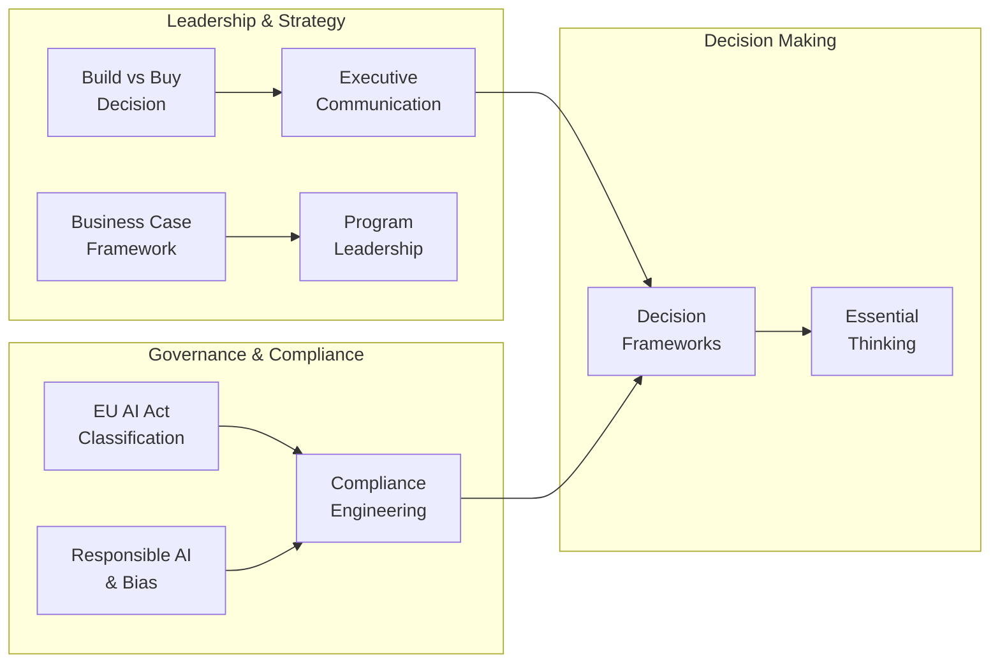

# Principal & Enterprise AI Architect (Part 2 of 2): Governance, Strategy & Decision Frameworks

### Overview

This is Part 2 of 2. See [Part 1: Scenario & Strategy Mastery](pathname:///archon/architecture/principal-enterprise-ai-guide-educative) for foundational modules on role, LLM architecture patterns, RAG, and agentic systems.



## AI Governance, Risk &amp; Responsible AI

From regulatory compliance to ethical deployment — the Principal's governance playbook.

###### Lesson 5.1

#### EU AI Act — Practical Classification &amp; Compliance Engineering

**Regulation Governance EU AI Act**

The EU AI Act creates a risk-tiered regulatory framework that every enterprise deploying AI in or to EU subjects must comply with. For the Principal AI Architect, this is an engineering discipline as much as a legal one — compliance must be embedded in the deployment pipeline.

| Risk Tier | AI Act Classification | Enterprise Examples | Key Obligations |
|---|---|---|---|
| **PROHIBITED** | Banned entirely | Social scoring, subliminal manipulation, real-time biometric surveillance (with exceptions) | Do not deploy. Period. |
| **HIGH-RISK** | Annex III listed | HR screening, credit decisioning, critical infrastructure AI, biometric ID, law enforcement | FRIA + Annex IV technical doc + Conformity Assessment + HITL + EU DB registration + Ongoing monitoring |
| **LIMITED RISK** | Transparency required | Chatbots, deepfakes, AI-generated content — users must know | Disclose AI nature to users. Content watermarking for generated media. |
| **MINIMAL RISK** | Largely unregulated | Spam filters, AI game NPCs, recommendation systems without high-risk criteria | No mandatory obligations. Voluntary Code of Practice recommended. |

###### Embedding EU AI Act Compliance in Your CI/CD Pipeline

- AI System Registry: Every AI system has a registry entry: system_id, use_case, risk_tier, owner, compliance_status, last_audit. Tagging at inception, not retrospectively.

- Pipeline Gates: High-Risk deployment triggers automatic documentation artifacts in the CI/CD pipeline — FRIA template, Annex IV technical documentation, test evidence package. Deployment blocked until artifacts are completed and signed off.

- Federated Compliance Model: Hub-and-spoke — central AI Risk Office sets standards; embedded AI Risk Stewards per BU conduct first-pass classification. Only edge cases escalate centrally. This scales to 80+ systems without creating a bottleneck.

- Ongoing Monitoring Gates: High-Risk systems trigger quarterly automated bias audits, drift monitoring alerts, and incident reporting to the central registry. MLOps platform (MLflow 3.0, Vertex AI) executes these automatically.

- Penalty awareness: Non-compliance with High-Risk requirements = fines up to 3% of global annual turnover. Non-compliance with Prohibited AI = 7% of global annual turnover.

###### Lesson 5.2

#### Responsible AI — Bias Detection, Fairness, and Incident Response

**Responsible AI Bias Ethics**

Responsible AI is not a policy document — it is an engineering discipline. Bias must be measured quantitatively, fairness constraints must be implemented technically, and incidents must be responded to with the same rigor as a security breach.

###### Fairness Metrics — Know the Difference

Demographic Parity: Equal selection rates across groups. Use when base rates should be equalized (e.g., correcting historical underrepresentation).

Equalized Odds: Equal true positive AND false positive rates across groups. Use for hiring, credit, criminal justice — where both types of error matter.

Calibration: Predicted probability matches actual probability equally across groups. Use for risk scoring systems.

These metrics conflict — you cannot simultaneously satisfy all three (Impossibility Theorem). Choose the right one for your domain context.

###### Bias Incident Response Protocol

Hour 0-4: Suspend automated decisions. Switch to HITL mode. Do NOT wait for root cause.

Hour 4-24: Scope assessment — how many affected, what decisions made, what is irreversible?

Day 1-3: Legal notification assessment — EEOC (US), GDPR (EU), NY Local Law 144 (hiring AI).

Day 3-30: Root cause — training data audit, feature analysis, proxy variable identification.

Day 30-90: Remediation — rebalancing, fairness constraints, third-party audit, re-deployment with monitoring.

###### REAL-WORLD SCENARIO — Hiring AI Bias Incident

###### Company type: Technology enterprise with global hiring — AI screening deployed 6 months ago

Challenge: Internal analysis reveals the AI screening tool shows 40% lower pass-through rate for candidates from certain demographic groups. 8,000 candidates were screened. Legal and HR are demanding immediate action.

###### Your Task as Principal AI Architect:

Lead the incident response as Principal AI Architect — technical, legal, and organizational dimensions.

###### Solution Approach:

→ IMMEDIATE (0-4 hours): Suspend all automated screening decisions. Issue a hold on any pending rejections. Brief CISO, CPO, and General Counsel.

→ SCOPE (4-24 hours): Pull complete audit log — all candidates screened, pass/fail decisions, feature weights used, model version. Compute disparate impact ratio by demographic group across all 8,000.

→ ROOT CAUSE: Audit training data — was the model trained on historical hires that reflected past discriminatory practices? Identify proxy features (zip code, school name, name) that correlate with protected characteristics.

→ LEGAL: Engage employment law counsel for EEOC notification assessment. In New York, NY Local Law 144 requires bias audit before deployment — determine if this obligation was met.

→ REMEDIATION: Re-weight training data, apply equalized odds constraint during fine-tuning, validate with disaggregated metrics by demographic group, commission third-party bias audit before re-deployment.

→ MONITORING: Deploy fairness dashboard with automated weekly disparate impact testing. Bias threshold breach triggers automatic HITL escalation.

**Outcome: Incident contained within 4 hours. Legal exposure assessed and managed proactively. Root cause identified as proxy variables in training data. System re-deployed after third-party audit with fairness constraints enforced. Ongoing monitoring prevents recurrence.**

###### KEY TAKEAWAYS

EU AI Act compliance is an engineering problem — embed classification, documentation, and monitoring in the CI/CD pipeline.

Fairness metrics conflict — Equalized Odds is the right constraint for high-stakes decisions (hiring, credit, criminal justice).

Bias incident response: suspend first, scope second, root cause third. Never wait for root cause before suspending a known-biased system.

The federated compliance model (hub-and-spoke) is the only governance structure that scales to 80+ AI systems without creating bottlenecks.

## Strategy, Leadership &amp; Executive Influence

Translating AI capability into business transformation — the Principal's non-technical superpower.

###### Lesson 6.1

#### The AI Business Case — Building Credible ROI Models

**Strategy ROI Business Case**

The most technically sound AI system delivers zero value if it cannot be justified, funded, and sustained. Building a credible business case is a core Principal AI Architect skill — not something that can be delegated to finance or product.

###### The 5-Component AI Business Case Framework

1. Baseline Measurement (non-negotiable): Measure current state BEFORE any AI deployment. Time-motion studies, cycle time data, error rate logs. Without a baseline, ROI cannot be calculated — only claimed.

2. Benefit Quantification — Hard &amp; Soft:

Hard: (Time saved hours/week) × (fully-loaded hourly cost) × (FTE count) = direct labor savings.

Hard: (Error rate reduction) × (cost per error) = quality savings.

Soft (proxy): Employee satisfaction → retention improvement → cost = (attrition reduction) × (1.5× annual salary replacement cost).

1. Cost Model — Include ALL components: Inference costs (model tier × volume), infrastructure, observability tooling, HITL operations staffing, compliance (High-Risk = €50K-500K), maintenance (15% of build cost annually), model upgrade regression testing.

2. Scenario Analysis (3 scenarios mandatory): Pessimistic (50% benefit, 120% cost), Base, Optimistic. Present the RANGE, not a point estimate. Ranges are credible; single numbers are negotiable.

3. Measurement Cadence: Commit to quarterly actual-vs-budget reporting. Enterprises that measure actuals deliver 3× the projected ROI of those that don't — because measurement drives course correction.

###### Lesson 6.2

#### Build vs. Buy vs. Fine-tune — The Principal's Decision Framework

**Strategy Build vs. Buy**

The build vs. buy vs. fine-tune decision is one of the highest-stakes choices a Principal AI Architect makes. Get it wrong and the organization either over-invests in capability that doesn't differentiate, or under-invests and falls behind competitors.

**Build vs. Buy vs. Fine-tune Decision Matrix**

```
# Build vs. Buy Decision Framework
# OPTION A: Pre-train proprietary foundational LLM
# Cost: $50M - $500M+ compute + 100+ ML researchers
# Time: 18-36 months to production
# Moat: Weak — model weights ≠ competitive advantage
# When: NEVER for 99% of enterprises
#
# OPTION B: Fine-tune + RAG on best-in-class base model (RECOMMENDED)
# Cost: 1-5% of Option A
# Time: Weeks to months
# Moat: STRONG — proprietary data + workflows + distribution
# When: Domain adaptation, specialized vocabulary, brand voice
#
# OPTION C: Pure API (no fine-tuning)
# Cost: Lowest
# Time: Days to weeks
# Risk: Vendor lock-in, data privacy, API dependency
# Mitigation: Model-agnostic abstraction layer (LiteLLM, AWS Bedrock)
# When: Standard use cases, fast time-to-value required
#
# The competitive moat is in data + application + distribution
# NOT in the model weights. Invest accordingly.
```

**Lesson 6.3**

#### Executive Communication — The Principal's Translation Layer

**Communication Leadership Stakeholders**

The most common failure mode for technically excellent Principal AI Architects is inability to translate complex systems into executive language. Executives make decisions in terms of risk, cost, speed, and competitive positioning — not tokens, embeddings, or inference latency.

###### Technical Language (Engineer)

###### Executive Language (Principal)

'We need to implement prefix caching to reduce TTFT by 40-70%.'

'The p99 latency on the inference cluster is 8 seconds due to a KV-cache miss rate of 80%.'

'We should use RAG with a cross-encoder re-ranker to improve retrieval precision.'

'The model is exhibiting distributional shift — evaluation metrics have degraded by 12%.'

'We can cut customer wait time from 8 seconds to under 2 by optimizing how we reuse existing computation. No additional cloud spend.'

'Our AI assistant is 4× slower than our SLA requires. Root cause identified. We can fix it in 2 weeks without new hardware.'

'Our search quality is at 65%. With a proven technique, we can reach 85%+ in 6 weeks. This reduces customer escalations by ~25%.'

'Our AI accuracy has dropped 12% in the past 30 days — likely due to data drift. We need 3 weeks to retrain and redeploy.'

###### The Executive AI Briefing Structure

1. Business Impact First: Lead with what changes for the business — revenue, cost, risk, speed. Technical details come last (or not at all).

2. The Three Numbers: Every AI initiative needs three numbers — investment required, expected return, and timeline to first value. Executives decide on these three.

3. Risk + Mitigation: For every AI initiative, name the top 2 risks and their mitigations. Executives who hear no risks assume you haven't thought about them.

4. Decision Requested: End every executive briefing with a clear, specific decision you need. 'Approve $400K budget to deploy the AI gateway and onboard 15 BUs by Q3' is a decision. 'We want to move forward' is not.

5. One Page, Maximum: If you can't explain the initiative in one page, you don't understand it well enough to execute it. The one-pager forces clarity — for them and for you.

###### Lesson 6.4

#### AI Program Leadership — Roadmapping and Scaling

Building an AI capability in an enterprise is a multi-year program, not a project. The Principal AI Architect is often the de facto program lead — responsible for the three-horizon roadmap, organizational change management, and the AI operating model.

**Architecture: The Three-Horizon AI Roadmap**

| HORIZON 1 0–3 months | HORIZON 2 3–9 months | HORIZON 3 9–18 months |
|---|---|---|
| **Quick Wins** | **Process Automation** | **Workflow Transformation** |
| **• AI copilots • Document drafting • Meeting summaries • Code assistants** | **• RAG for knowledge retrieval • Automated report generation • Customer support agents • Data extraction pipelines** | **• End-to-end agentic workflows • Multi-agent procurement • Autonomous monitoring • AI-native product features** |
| **ROI: immediate Risk: low Gov: basic** | **ROI: 3-6 months Risk: medium Gov: moderate** | **ROI: 9-18 months Risk: high Gov: full** |

###### REAL-WORLD SCENARIO — Stalled AI Program — 12% Adoption Crisis

###### Company type: 12,000-person professional services firm — GenAI program launched 6 months ago

Challenge: Adoption is at 12% despite mandatory training and tool access. Three senior managers are actively discouraging use. The CPO is threatening to cancel the program.

###### Your Task as Principal AI Architect:

Diagnose the program and design a recovery plan as Principal AI Architect.

###### Solution Approach:

→ Diagnose before prescribing: segment adoption by BU, seniority, and use case. Interview 20-30 non-adopters. Find the real blockers: fit problem (tool doesn't solve my pain), trust problem (I don't trust the outputs), or psychological safety problem (I fear job replacement).

→ Address the resistant managers directly: bring them into the program design as AI Champions. Give them early access to new capabilities and invite them to evaluation sessions. Resistance becomes advocacy when people feel ownership.

→ Pivot from tool-push to problem-pull: stop promoting 'AI tools.' Start with 'what takes you the most time each week?' Build targeted solutions for specific pains. Adoption follows perceived value, not mandates.

→ Executive commitment on psychological safety: a public, specific commitment from leadership — 'No AI-driven headcount reductions in the next 24 months' — is the single highest-leverage adoption intervention.

→ Peer advocacy program: the 12% who are adopting have stories. Surface those stories. Peer testimonials are 10× more effective than vendor marketing or management mandates.

**Outcome: Adoption reaches 38% within 90 days. Three resistant managers become the program's most visible champions. CPO approves Horizon 2 investment. Adoption reaches 65% at 6 months.**

##### KNOWLEDGE CHECK

###### Q1. The CEO mandates '10× productivity from GenAI in 12 months.' What is the Principal AI Architect's first move?

A) Accept the mandate and build toward it

B) Reject the mandate as unrealistic

**C) Decompose the metric — identify specific tasks where 10× is achievable vs. aggregate average**

D) Commission a vendor RFP immediately

10× enterprise-wide in 12 months is almost certainly unachievable. The right move is decomposing the metric — specific tasks (drafting, summarization) can achieve 8-10×; aggregate is likely 3-5×. Accepting uncritically and failing destroys credibility. Decomposing and reframing demonstrates strategic maturity.

###### Q2. Which of the following is the strongest source of competitive moat for an enterprise AI strategy?

A) Pre-training a proprietary foundational LLM

B) Using the most advanced frontier model via API

**C) Proprietary data pipelines + domain-adapted models + workflow integration**

D) Having the largest GPU cluster

The competitive moat in enterprise AI is data, workflows, and distribution — not model weights. Pre-training a foundational LLM costs $50M-$500M+ and does not produce durable competitive advantage for 99% of enterprises. Domain adaptation via fine-tuning + RAG on proprietary data delivers 80% of the value at 1% of the cost.

###### KEY TAKEAWAYS

The AI business case requires a baseline, three-scenario range, and a committed measurement cadence — not a single-number projection.

The competitive moat is proprietary data + workflows + distribution, not model weights. Fine-tune and RAG over buying/building base models.

Executive communication leads with business impact, presents three numbers (investment, return, timeline), names risks, and ends with a specific decision request.

The three-horizon roadmap (Quick Wins → Automation → Transformation) structures AI program delivery across an 18-month arc.

AI adoption barriers are almost never technical — they are trust, fit, and psychological safety problems requiring human solutions.

## Principal AI Architect — Decision Frameworks &amp; Cheat Sheet

Quick-reference for the most critical decisions a Principal AI Architect makes.

| Decision | Diagnostic Question | Principal's Answer |
|---|---|---|
| **When to use RAG vs. Fine-tuning** | Is the knowledge static or dynamic? Does it exceed the context window? Is it proprietary data the model has never seen? | **RAG: dynamic knowledge, proprietary documents, real-time retrieval needed. Fine-tune: consistent style/tone, domain vocabulary, format compliance. Use both for best results.** |
| **When to build vs. buy AI platform** | Does proprietary model capability create durable competitive advantage? What is the time-to-value delta? | **Buy (API): 99% of enterprises. Fine-tune + RAG: domain adaptation. Pre-train: only AI labs with $50M+ and a specific model differentiation thesis.** |
| **Which agent orchestration pattern** | Is the task decomposable? Is auditability required? Is determinism required? | **Orchestrator-specialist for auditable, high-stakes workflows. Peer-to-peer only for creative, non-regulated tasks. Never swarm for financial/legal/medical decisions.** |
| **Which model tier to use** | What is the task complexity? What is the error consequence? What is the volume? | **Tier 1 (nano): FAQ, classification, simple summarization. Tier 2 (mid): drafting, moderate reasoning. Tier 3 (frontier): complex reasoning, legal/medical, agentic multi-step.** |
| **EU AI Act risk classification** | Is the use case in Annex III? Does it affect employment, credit, critical infrastructure, or biometric ID? | **Annex III = High-Risk → FRIA + Annex IV + Conformity Assessment mandatory. Not in Annex III = Limited or Minimal Risk → Transparency obligation only.** |
| **When to require human-in-the-loop** | Is the action reversible? Is the consequence of error significant? Is this a High-Risk AI Act system? | **Irreversible + high-consequence = synchronous HITL required. Reversible + low-consequence = async notification. High-Risk AI Act systems = HITL evidence required for compliance.** |
| **HITL escalation threshold** | What confidence level is required for autonomous action vs. escalation? | **Calibrate threshold against historical accuracy. Typical: confidence ≥ 0.85 → autonomous. &lt; 0.85 → HITL. Adjust threshold based on domain risk tolerance.** |
| **How to diagnose low adoption** | What type of barrier is it? Fit, trust, or psychological safety? | **Fit: tool doesn't solve user's real pain → pivot to problem-pull. Trust: outputs unreliable → improve quality + show accuracy metrics. Safety: fear of replacement → executive commitment required.** |

Essential Thinking Frameworks for Principal AI Architects

- Goodhart's Law: 'When a measure becomes a target, it ceases to be a good measure.' → Design AI systems with multiple correlated metrics, not a single optimizable KPI.

- Two-Pizza Team Rule (applied to agents): If your agent's toolset requires more than one 'team' to explain, it's doing too much. Decompose into specialist agents.

- Conway's Law (applied to AI): AI systems will mirror the communication structure of the teams that build them. Multi-team alignment = multi-agent design. Fix the org structure first.

- Petrov Rule (Agentic AI): For any irreversible action, a human must be in the loop. No level of autonomy justifies removing human oversight from decisions with major real-world consequences.

- The Reversibility Test: Before approving any architectural decision, ask 'what is the cost to reverse this in 12 months?' High reversal cost = decide slowly and involve more stakeholders.

- The Newspaper Test (two versions): Would this AI decision appear on the front page as harmful? (classic) — AND — Would this AI decision appear on the back page as pointlessly cautious? (Amazon). Both tests must pass.

###### Sources

Research sourced from: Bain Technology Report 2025 · WEF Agentic AI Adoption Report · PwC AI Agent Survey 2025 · OWASP Agentic Security Initiative · Check Point Cyber Security Report 2026 · State of Agentic AI Security 2025 (Akto) · Microsoft Learn (Agentic AI Architect Certification) · SAP, Caterpillar, Salesforce, T-Mobile Principal AI Architect Job Specifications · Langfuse Framework Comparison · EU AI Act (Official Journal 2024) · EU AI Act Enforcement Timeline 2025-2026

Principal & Enterprise AI Architect — Educative-Style Learning Guide · Scenario & Strategy Mastery · Research Edition 2025–2026
