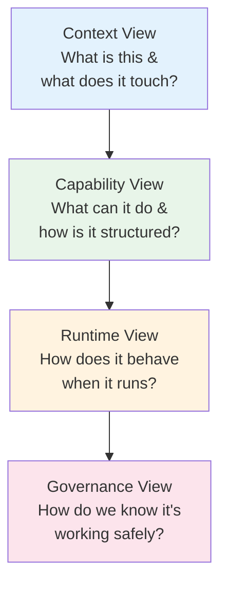
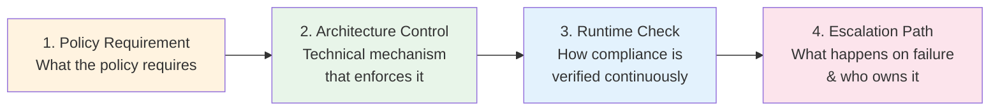

# EA Architect Deep Dive — The Five Arenas (Part 2 of 2)

This document covers three arenas of architect communication: Engineering & Architecture (Arena 3), Governance/Risk/Operations (Arena 4), and Board/Vendor/External (Arena 5). For Executive and Product/Domain Stakeholder communication, see [Part 1 of 2](../06-ea-architect-deep-dive-five-arenas.md).

---

## Section 06 — Arena 3: Engineering & Architecture

Turning AI strategy into clear, implementable architecture that multiple engineering tribes can align on, build from, and own in production.

## Engineering & Architecture Arena

**Decisions · Trade-offs · Alignment · Delivery Readiness**

### The Engineering Communication Paradox

Engineering audiences are the most technically literate audience an architect faces — and also the most likely to reject an architectural direction if they feel it was not reached through rigorous reasoning. The paradox is that the very depth that makes engineers excellent at building also makes them highly attuned to architectural reasoning that skips steps, ignores trade-offs, or presents conclusions without showing the work.

Effective engineering communication is not about simplifying — it is about making the reasoning visible. Engineers need to see not just what you decided but what you considered and rejected, and why. The architect who walks into an engineering review with a single recommendation will face resistance. The one who walks in with three options, the NFRs that drove the evaluation, and an honest assessment of the risks in the recommended option will earn alignment.

### The 4-View Architecture Narrative

For every major AI initiative, structure your communication across these four views in order. Each view answers a different engineering question and addresses a different concern. The sequence matters — context before capability, capability before runtime, runtime before governance.

**Context View:** What is this and what does it touch? Actors (users, systems, admins), external dependencies, data flows at the system boundary level, and integration touchpoints. The context view answers the question "what changes in our landscape when this is deployed?" It is deliberately technology-agnostic — focused on responsibilities and relationships, not implementations.

Artifacts: Context diagram (C4 Level 1), actor list, integration dependency map, data flow overview, external API catalogue.

**Capability View:** What can it do and how is it structured? The agentic stack layers in full — engagement (channels, UX, agent interfaces), capabilities (orchestration, intelligence, tools, controls), data (systems of record, vector stores, event streams, knowledge bases), and governance (policy enforcement, audit logging, human-in-the-loop). This view reveals the full component landscape and how capabilities are organised.

Artifacts: Component diagram (C4 Level 2–3), capability model, agentic stack diagram, data architecture view, model registry design.

**Runtime View:** How does it behave when it runs? Sequence diagrams for the primary happy path and the top 3 failure paths. Feedback loops: how does the system learn, adapt, and recover? Orchestration patterns: how do agents coordinate and hand off? Concurrency model: what happens under load? This view is where most production surprises are either anticipated or missed.

Artifacts: Sequence diagrams (happy path + failure paths), feedback loop diagram, orchestration pattern documentation, load model and capacity plan.

**Governance View:** How do we know it's working safely? The full control landscape: logging architecture, evaluation framework, guardrail design, human-in-the-loop triggers, model performance monitoring, and escalation paths. This view is often the last produced and the first questioned by governance teams — build it early and keep it current.

Artifacts: Control matrix, evaluation plan, monitoring dashboard design, guardrail specification, incident response runbook.

### The Agentic AI Stack as Common Language

Standardise on a consistent stack model for every agentic AI conversation. This becomes your "TOGAF for AI agents" — a shared vocabulary that works across engineering teams, architecture reviews, and vendor conversations.

**Engagement Layer:** The outermost layer — how humans and systems interact with the AI system.
- Conversational interfaces (chat, voice, email)
- API gateways for system-to-system interaction
- Third-party agent connections (incoming/outgoing)
- UX surfaces and interaction design
- Multi-modal input handling (text, image, document)
- Rate limiting and authentication

**Capabilities Layer:** The core of the agentic system — what it can reason about, decide, and do.
- Orchestration engine (LangGraph, AutoGen, custom)
- Foundation model(s) and model routing
- Tool registry (functions, APIs, database connectors)
- Memory systems (short-term, long-term, episodic)
- Planning and reasoning patterns (ReAct, CoT, ToT)
- Capability controls and policy enforcement

**Data Layer:** The knowledge and information substrate that the AI draws from and writes to.
- Systems of record (ERP, CRM, HR, finance)
- Vector store / embedding database
- Knowledge bases and document repositories
- Event streams and real-time data feeds
- Data quality and validation pipelines
- Data lineage and provenance tracking

**Governance Layer:** The control, audit, and assurance infrastructure that keeps the system safe.
- Guardrail framework (input/output filtering, policy checks)
- Audit logging (every interaction, every decision)
- Evaluation framework (accuracy, safety, bias, drift)
- Human-in-the-loop triggers and escalation
- Model performance monitoring and alerting
- Compliance controls and regulatory reporting

### Trade-off Framing — The Full Decision Matrix

For every significant architectural decision, present options using this matrix. The NFR column is critical — it anchors the decision to objective criteria rather than preferences. Engineering audiences respond to NFR-anchored decisions because they can evaluate the logic independently.

| Decision | Option A | Option B | Option C | Key NFR Driver | Recommendation Trigger |
|---|---|---|---|---|---|
| Build vs Buy | Custom development | Vendor platform | Open-source + support | Control, compliance, total cost | Vendor if speed critical; build if differentiation needed |
| Deployment model | Centralised platform | Federated per-domain | Hybrid (core + local) | Governance vs autonomy | Central if governance is immature; federated if domains have strong data ownership |
| Processing model | Online / synchronous | Async / event-driven | Batch + real-time hybrid | Latency SLO, cost | Online if user-facing; async if background; hybrid for mixed workloads |
| Model strategy | Single foundation model | Multiple specialised models | Model mesh with routing | Accuracy, cost, latency | Single if starting out; mesh if accuracy variation across domains is high |
| Orchestration | Custom agent framework | Managed orchestration (vendor) | Hybrid | Flexibility vs ops burden | Managed if ops maturity is low; custom if control requirements are high |
| Memory architecture | No persistent memory | User-scoped memory | Shared organisation memory | Privacy, compliance, cost | Driven by regulatory requirements and user trust model |
| Evaluation | Human-only evaluation | Automated eval suite | Human + automated | Speed, cost, coverage | Human only for v1; automate as patterns stabilise |
| Guardrail placement | Pre-processing only | Post-processing only | Both layers | Latency, safety level | Both layers for high-stakes domains; post-only for low-risk |

### Working Inside Delivery Frameworks

Principal architects at most organisations work within Agile or SAFe delivery frameworks. The language you use must translate AI architecture work into the concepts these frameworks already have vocabulary for:

| AI Architecture Concept | Agile / SAFe Translation | Practical Implication |
|---|---|---|
| Foundation model evaluation | Architecture spike / enabler | Timeboxed; produces a decision, not a deliverable; appears in PI planning |
| Data pipeline readiness | NFR: data readiness criterion | Part of definition of ready for AI feature stories — not a separate workstream |
| Evaluation framework design | Architecture enabler | Planned as runway work before feature stories depend on it |
| Guardrail specification | NFR: safety criterion | Part of definition of done — AI feature stories are not done until guardrails pass |
| Model performance baseline | Acceptance criterion | Written into user story acceptance criteria, not assumed |
| Feedback loop design | Architectural runway | Built before the features that depend on the feedback signals |
| Governance sign-off | Gate criterion | Explicit PI gate or release condition — not an afterthought |

### What Engineering Trust Buys You

The architect who makes complex AI architecture legible to multiple engineering tribes earns a specific kind of trust: the trust that comes from being the person who helps teams make better decisions without dictating them. That trust converts into the influence that allows you to shape architectural direction at scale — which is exactly what distinguishes a principal architect from a senior engineer.

---

## Section 07 — Arena 4: Governance, Risk & Operations Communication

Being the calm, structured voice on AI risk, controls, and long-term operations — the arena that most technical architects underinvest in and that creates the most durable organisational influence when mastered.

## Governance / Risk / Operations Arena

**Controls · Auditability · Compliance · Operational Resilience**

### Why This Arena Creates Disproportionate Influence

In most organisations deploying AI, the governance and risk function is the primary blocker between pilots and production. Legal teams, compliance officers, risk committees, and regulators all sit between "AI that works in a sandbox" and "AI that runs at scale." The architect who can communicate fluently in this arena — who speaks risk in its own language rather than asking the governance team to translate technical architecture — becomes the person who unlocks that bottleneck. That unlocking role creates disproportionate influence.

The second reason this arena matters is durable relevance. Executive attention shifts; product roadmaps change; engineering teams turn over. Governance and compliance requirements have long lifespans. The architect who becomes the "default voice" on AI governance in an organisation holds a position that is structurally stable over time.

### The Governance Control Chain

For every AI risk, be able to articulate the complete control chain using this four-part structure. Practice this pattern until it is automatic — it signals enterprise-grade thinking to any governance, risk, or compliance audience.

**Policy Requirement:** What does the policy, regulation, or risk appetite statement require? Name the specific requirement — not a paraphrase, not a general principle. If there is no existing policy, say so explicitly and name what policy should exist.

Example: "The AI Acceptable Use Policy requires that no customer PII is used to train or fine-tune models without explicit consent and legal review."

**Architecture Control:** What specific technical mechanism enforces the policy requirement? Name the component, not the category. "We have guardrails" is not an architecture control. "We have a pre-processing PII detection layer using Presidio with a block-on-detection configuration" is an architecture control.

Example: "PII detection runs on all inputs before reaching the model layer. Detected PII is masked in transit and never persisted in the vector store."

**Runtime Check:** How is compliance with the control verified continuously in production — not just at deployment? Who monitors it? What is the check frequency? What is the alert threshold? Governance teams are far more comfortable with controls that have continuous verification than with controls that were tested once at launch.

Example: "Detection accuracy is measured weekly against a held-out test set. False negative rate above 0.5% triggers an automated alert to the AI Safety team."

**Escalation Path:** What happens when the control fails, triggers a threshold, or produces an unexpected result? Name the person who receives the alert, the action they take, and the timeline. Governance teams need to see that failure modes have owners, not just detection mechanisms.

Example: "On alert, the AI Safety engineer on call is paged. The affected endpoint is rate-limited within 5 minutes. A full audit of the previous 24 hours of requests is initiated. Risk committee is notified within 4 hours."

### AI Risk Taxonomy — Communication-Ready

Use this taxonomy when presenting AI risks to governance audiences. The categories map to existing risk management frameworks, which makes the conversation familiar rather than novel:

| Risk Category | Specific Risks | Governance Audience Language | Control Priority |
|---|---|---|---|
| Accuracy & Reliability | Hallucination, model drift, edge case failures, adversarial inputs | Response accuracy risk, reliability SLA risk, quality degradation | High — affects trust and user safety |
| Data & Privacy | PII exposure, data leakage, training data contamination, consent gaps | Data privacy risk, regulatory compliance risk, consent management | Critical — regulatory exposure |
| Bias & Fairness | Demographic bias, proxy discrimination, feedback loop bias, representation gaps | Fairness risk, regulatory discrimination risk, reputational risk | High — legal and reputational |
| Security & Adversarial | Prompt injection, jailbreaking, model inversion, supply chain risk | Cybersecurity risk, model integrity risk, vendor security risk | Critical — active threat landscape |
| Operational & Availability | Model provider outage, inference cost spike, latency degradation, capacity limits | Service continuity risk, cost overrun risk, SLA breach risk | Medium — operational impact |
| Governance & Compliance | Regulatory non-compliance, audit trail gaps, explainability requirements | Compliance risk, regulatory risk, accountability risk | High — growing regulatory environment |
| Ethical & Reputational | Brand damage from AI output, controversial use cases, public trust erosion | Reputational risk, stakeholder trust risk, public relations risk | Medium — depends on industry and use case |

### First-Class Feedback Loops — The Operational Architecture

Describe feedback loops as named, explicit components of the AI architecture — not as monitoring afterthoughts. Each loop should have a name, a metric, a measurement cadence, an owner, and an intervention protocol.

| Loop Name | What is Measured | Measurement Method | Cadence | Owner | Intervention Trigger |
|---|---|---|---|---|---|
| Data Quality Loop | Completeness, freshness, schema drift, null rates, outlier frequency | Automated data quality checks in pipeline; weekly profile comparison | Daily automated; weekly human | Data Engineering Lead | Quality score below threshold; schema change detected; freshness SLA missed |
| Model Performance Loop | Accuracy on held-out set, latency p50/p90/p99, cost per inference, output length | Automated eval suite run on versioned test set; APM instrumentation | Weekly automated; monthly human | ML Platform Lead | Accuracy delta >3% from baseline; latency p99 above SLO; cost spike >20% |
| Safety & Guardrails Loop | Blocked output rate, false positive rate on guardrails, safety classifier confidence | Guardrail telemetry; weekly sample review by safety team | Daily automated; weekly human | AI Safety Lead | False positive rate >2%; novel jailbreak pattern detected; user complaint spike |
| Bias & Fairness Loop | Output distribution across demographic proxies, feedback sentiment by segment | Periodic bias audit using fairness testing suite | Quarterly | Responsible AI Lead | Statistically significant disparity detected; regulatory audit trigger |
| Business Outcome Loop | Primary KPI delta vs baseline, user adoption rate, task completion rate, error reduction | Business intelligence dashboard; A/B comparison where possible | Weekly | Product Owner | KPI below target; adoption below forecast; negative user feedback trend |
| Operational Loop | Availability SLO, error rate, queue depth, resource utilisation, cost vs budget | SRE monitoring stack; alerting on defined thresholds | Real-time | SRE / Platform Lead | SLO breach; error rate above threshold; cost anomaly |

### Communicating with SRE and Operations Teams

SRE and operations teams are highly effective at managing systems they understand well. The challenge with AI systems is that the failure modes are different in character from those of traditional software — they are probabilistic, non-deterministic, and often emerge at the intersection of model behaviour and data. Bridge this gap by translating AI concepts into the operational language these teams already use:

| AI Concept | SRE / Ops Translation | Practical Implication |
|---|---|---|
| Model accuracy degradation | Service quality SLO breach | Define a measurable accuracy SLO and include it in the SRE dashboard alongside latency and availability |
| Hallucination rate increase | Output reliability incident | Create a runbook for "reliability incident" that includes model-specific investigation steps |
| Prompt injection attack | Security incident — AI-specific | Separate incident category with specific detection, containment, and escalation steps |
| Model provider API outage | Third-party dependency failure | Include in dependency risk register; design fallback behaviour; test regularly |
| Context window exceeded | Request capacity limit hit | Define behaviour at limit (truncate? error? queue?); include in capacity planning |
| Guardrail false positive spike | Service degradation — false blocking | Monitor user-facing impact; include in SLO; have a tuning runbook ready |
| Training data update | Planned maintenance with quality gate | Treat like a deployment: staged rollout, quality checks, rollback plan |
| L2 vs L3 escalation | Application vs model/data incident | Define clear demarcation: L2 owns application layer; L3 (ML team) owns model and data layer |

### The Governance Unlock

In organisations deploying AI at scale, governance clarity is the gating factor for production deployment — more often than technical readiness. The architect who speaks governance fluently is the one who accelerates delivery, not slows it. Own this arena and you own the path from pilot to production.

---

## Section 08 — Arena 5: Board, Vendor & External

The emerging arena — representing AI architecture thinking credibly outside the organisation, in board briefings, vendor negotiations, analyst conversations, and regulatory engagements.

## Board / Vendor / External Arena

**Strategic Positioning · Vendor Leverage · Market Credibility**

### Why This Arena Now

Three forces are converging to make Arena 5 competency urgent for principal architects. First, AI strategy is moving onto board agendas — boards are asking for AI briefings, creating AI committees, and expecting management to articulate a credible AI position. Second, the vendor landscape for AI is complex and moving fast — vendor selection decisions that would previously have been delegated to procurement now require architectural oversight at a senior level. Third, regulatory scrutiny of AI is intensifying globally — architects are increasingly called into regulatory engagement conversations where their technical authority is needed.

### Board-Level AI Communication

Board communication on AI has a different register from CXO communication. Boards are interested in strategic risk and opportunity at a 3–5 year horizon, fiduciary responsibility around AI investments, competitive positioning, and regulatory exposure. They are not interested in project updates or capability details.

**AI Strategic Position:** Where does AI fit in the organisation's 3-year strategy? What is the thesis — cost, capability, competitive? Is the organisation a leader, follower, or selectively innovative? Is the position consistent with market reality?

**Material Risk Assessment:** What are the three AI risks that could have a material impact on the business? How are they being managed? What is the residual risk after controls? Are there emerging regulatory risks the board should be aware of?

**Investment Adequacy:** Is the AI investment level appropriate given the strategic ambition? How does it compare to sector peers? Is the governance infrastructure keeping pace with the capability build? Are there investment gaps that create risk?

**Management Capability:** Does management have the AI leadership capability to execute the strategy? What are the key person dependencies? Is there a succession plan for critical AI roles? Is the broader organisation building AI literacy?

### Vendor Communication — Maintaining Leverage

The AI vendor landscape in 2026 is characterised by a small number of highly capable foundation model providers, a large number of application layer vendors, and significant consolidation pressure. Architects who communicate effectively with vendors maintain leverage and get better outcomes from commercial negotiations and partnership conversations.

| Situation | Ineffective Pattern | Effective Pattern | Why It Works |
|---|---|---|---|
| Evaluating a new vendor | Demo-driven evaluation; vendor controls the narrative | Capability-specific RFP with your evaluation criteria published upfront | Forces the vendor to address your criteria, not demonstrate their strengths |
| Negotiating a contract | Accepting standard terms; no architectural input | Architecture review of data portability, audit access, SLA terms, and exit provisions | Protects the organisation from vendor lock-in and data loss scenarios |
| Vendor claims accuracy | Accepting benchmark results at face value | Requiring evaluation on your specific data and use cases before contract | Benchmarks rarely translate directly; your data is the only valid test |
| Partnership conversation | Asking "what can you do for us?" | Bringing a specific architectural gap and asking how they solve it | Changes the dynamic from vendor pitch to technical problem-solving |
| Roadmap discussion | Accepting vendor roadmap as given | Sharing your requirements and asking for roadmap commitment or alternatives | Creates documented obligations and surfaces alternatives early |

### Vendor Evaluation Architecture

Structure every vendor evaluation using the same five dimensions. This creates a consistent basis for comparison and prevents evaluations from being dominated by demo quality rather than technical substance:

**Capability Fit:** Does the vendor's capability address your specific use case at the data volume, accuracy, and latency requirements you need?

**Architecture Compatibility:** How does the vendor's solution integrate with your agentic stack? What are the integration costs and migration paths?

**Governance & Compliance:** Does the vendor's data handling, audit logging, and compliance posture meet your regulatory and risk requirements?

**Commercial Sustainability:** Is the vendor financially stable enough to be a long-term partner? What are the exit provisions if the partnership ends?

**Operational Maturity:** What is the vendor's SLA? How do incidents get escalated? What is their observability posture and support model?

### Regulatory Engagement Communication

As regulators engage more directly with AI-deploying organisations, architects are increasingly called into regulatory conversations. These conversations have a specific register — regulators want to understand controls, not capabilities:

- **Lead with governance, not with capability** — regulators are not impressed by what the AI can do; they care how it is controlled.
- **Have your control chain documentation ready** — every risk category should have a completed four-part control chain.
- **Name your responsible individuals** — regulators want to know who owns AI decisions, not what team is responsible.
- **Be specific about what you do not know** — regulators trust specificity about uncertainty far more than confident general claims.
- **Prepare a plain-language system description** — a two-page description of what the AI does, in non-technical language, approved by legal.

### The External Credibility Signal

Arena 5 competency is what separates architects who are respected inside the organisation from those who are recognised outside it. The ability to represent AI architecture credibly to a board, a regulator, or a sophisticated vendor is the mark of a principal architect who has genuinely mastered the communication dimension of the role — not just the technical one.

---

## Series Navigation

- **Part 1 of 4 (Foundation):** [EA Architect Deep Dive — Foundation](../05-ea-architect-deep-dive-foundation.md)
- **Part 2 of 4 (Five Arenas - Part 1 of 2 split):** [EA Architect Deep Dive — The Five Arenas (Part 1 of 2)](../06-ea-architect-deep-dive-five-arenas.md)
- **Part 2 of 4 (Five Arenas - Part 2 of 2 split):** EA Architect Deep Dive — The Five Arenas (Part 2 of 2) — This document
- **Part 3 of 4 (Toolkit & Practice):** [EA Architect Deep Dive — Toolkit & Practice](../07-ea-architect-deep-dive-toolkit-practice.md)
- **Part 4 of 4 (Measurement & Growth):** [EA Architect Deep Dive — Measurement & Growth](../08-ea-architect-deep-dive-measurement-growth.md)
