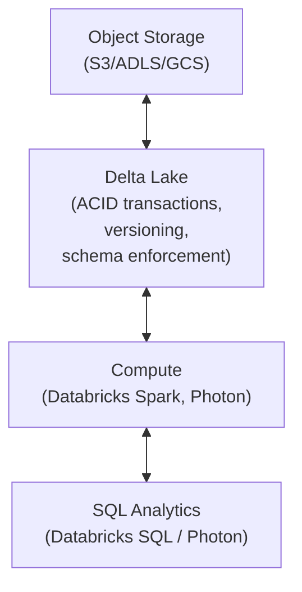
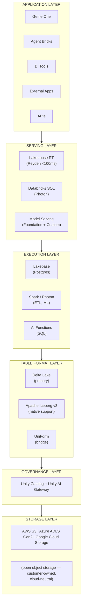
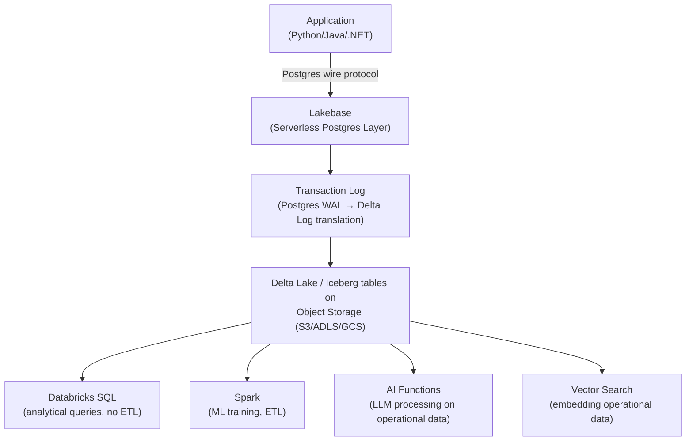
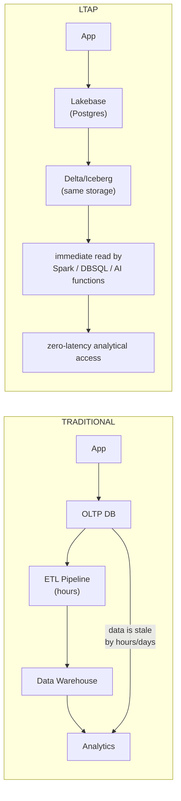
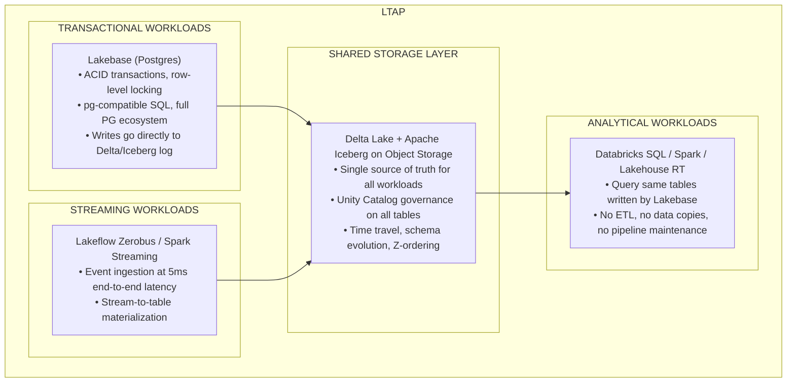
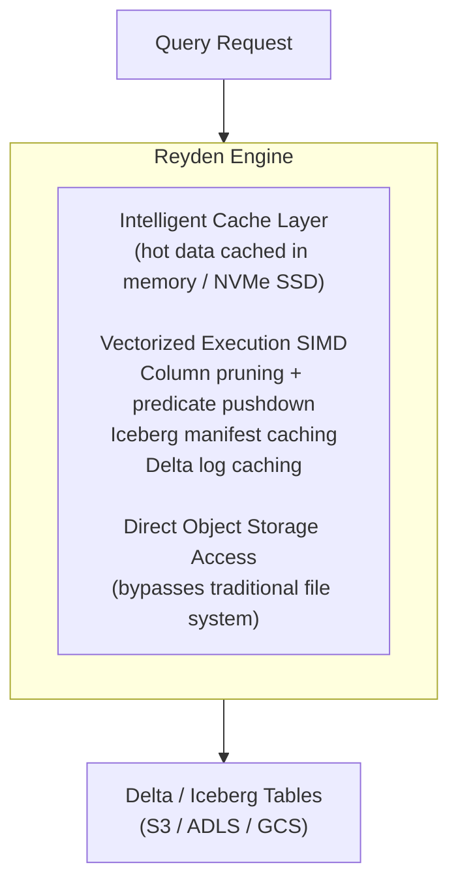
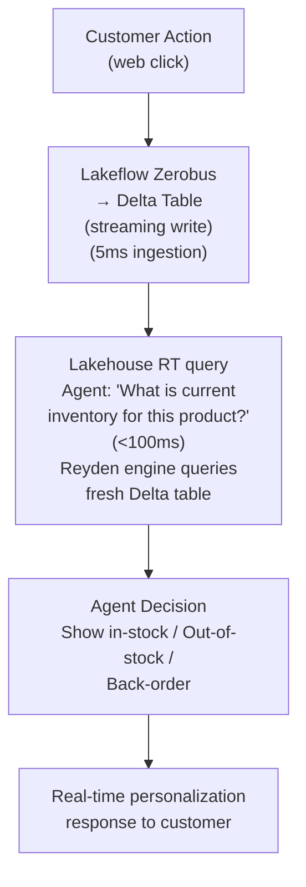
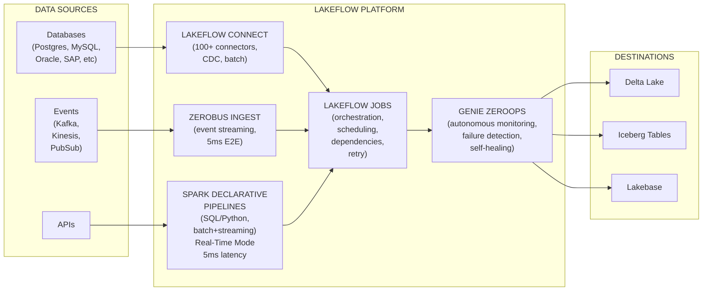
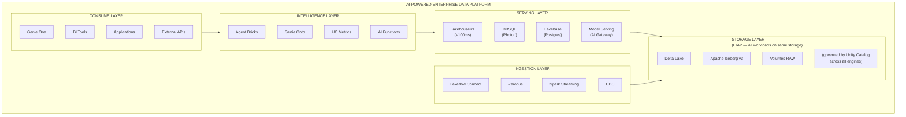

# Databricks Lakehouse Architecture & Real-Time Infrastructure

Covers Research Area 7: Complete Lakehouse layered architecture including 2026 announcements — Lakebase, LTAP, Lakehouse RT, Lakeflow

---

## 1. The Lakehouse Architecture — 2026 Edition

The Lakehouse architecture has evolved significantly in 2026. What began as a unified storage layer for analytics has become a **multi-modal data platform** capable of serving transactional, analytical, real-time, and AI workloads simultaneously.

### Classic Lakehouse (2020–2023)



### 2026 Lakehouse — Full Architecture



---

## 2. Lakebase — Serverless Postgres on Open Storage (GA)

### What it Is

Lakebase is serverless PostgreSQL that **stores data in Delta Lake and Apache Iceberg format on customer-owned object storage**, rather than in traditional Postgres storage. This means:

- Full Postgres compatibility (SQL dialect, wire protocol, psycopg2, JDBC)
- Data immediately readable by analytical engines (Spark, Databricks SQL)
- No ETL pipelines between operational and analytical workloads
- Scales from 0 to production automatically (serverless)
- 12 million database launches per day as of DAIS 2026

### Architecture



### Key Features (GA 2026)

| Feature | Description |
|---------|-----------|
| **LTAP Integration** | All writes stored in Delta/Iceberg from point of write |
| **Cross-cloud DR** | Cross-cloud and cross-region disaster recovery |
| **Git-style branching** | Create branches for dev/test without data copying |
| **Snapshots** | Point-in-time consistent snapshots |
| **Autonomous operations** | Self-healing, auto-vacuum, auto-analyze |
| **Lakebase Search** | Hybrid vector + full-text retrieval (Beta) |
| **Synced Tables** | Push Lakebase rows to Delta for immediate analytical access |
| **Lakebase CDF** | Change Data Feed for streaming to downstream consumers |

### Early Adopters

Block, Ensemble, Superhuman, Zillow — reported as production customers at DAIS 2026.

### Lakebase vs Traditional Postgres

| Dimension | Traditional Postgres | Lakebase |
|-----------|--------------------|---------|
| Storage | Local disk / EBS | Object storage (S3/ADLS/GCS) |
| Analytical access | ETL required (hours delay) | Immediate (same tables) |
| Scaling | Manual provisioning | Serverless (automatic) |
| Backup | pg_dump / PITR | Delta time travel (built-in) |
| Data format | Postgres heap | Delta Lake / Iceberg |
| AI integration | Separate embedding pipeline | Built-in (Lakebase Search) |
| Cost model | Always-on instance | Pay-per-request |
| Cold start | Instant | Sub-second (serverless warm pool) |

---

## 3. LTAP — Lake Transactional/Analytical Processing (GA)

### The Problem LTAP Solves

The traditional "Lambda Architecture" required separate OLTP (Postgres, MySQL) and OLAP (data warehouse) systems with complex ETL pipelines between them:



### LTAP Architecture Components



### LTAP Agent Patterns

LTAP enables entirely new agent patterns that were impossible with ETL-coupled architectures:

**Pattern 1: Operational AI Agent**

```
Agent reads Lakebase order table (Postgres)
  → runs SQL analysis (same data, no copy)
  → triggers action (update order status via Lakebase write)
  → streams event to downstream (Zerobus)
  → real-time dashboard updates (Lakehouse RT)
```

**Pattern 2: Self-Healing Data Pipeline**

```
Genie ZeroOps monitors Lakebase tables
  → detects data quality issue (null spike in revenue column)
  → root-cause analysis via Spark query on same storage
  → creates Lakebase incident ticket (Postgres write)
  → notifies data engineering team (Slack via MCP)
  → proposes fix (Lakeflow pipeline patch)
```

---

## 4. Lakehouse RT — Real-Time Analytics (GA)

### What it Is

Lakehouse RT (Real-Time) is Databricks' new analytics product powered by **Reyden**, a purpose-built compute engine optimized for:

- Sub-100ms query latency on Delta Lake and Iceberg tables
- 12,000+ queries per second sustained throughput
- Up to 16x faster than separate real-time serving stacks (per Databricks)
- Response times as low as 10ms on smaller datasets

### Architecture: Reyden Engine



### Lakehouse RT vs Alternatives

| System | Latency | Architecture | Data Freshness | Governance |
|--------|---------|-------------|----------------|-----------|
| **Lakehouse RT** | &lt;100ms | On Delta/Iceberg | Real-time (same tables) | Full UC |
| Pinot/Druid | &lt;10ms | Separate real-time store | Near-real-time (minutes lag) | Custom |
| ClickHouse | &lt;50ms | Separate columnar DB | Near-real-time (minutes lag) | Custom |
| Snowflake | ~1s | Separate warehouse | Seconds-to-minutes | Snowflake-only |
| BigQuery | ~1s | Serverless warehouse | Seconds | GCP-only |

### Agent Use Case: Real-Time Decision Making



---

## 5. Lakeflow — Unified Agentic Data Engineering (GA)

Lakeflow unifies all data movement and transformation under a single product family, governed by Unity Catalog.

### Lakeflow Component Map



### Lakeflow Designer (GA)

Visual no-code pipeline builder:

- Drag-and-drop canvas for pipeline construction
- Natural-language prompts to generate pipeline stages
- Automatic schema inference and mapping
- Live data preview
- One-click deploy to production
- Full lineage captured in Unity Catalog

### Genie ZeroOps (Private Preview)

Background AI agent for autonomous data operations:

- Monitors pipeline health metrics (data quality scores, SLA compliance)
- Performs root-cause analysis using error logs + lineage graph
- Proposes and optionally auto-applies fixes (within defined policy bounds)
- Creates runbook entries in Lakebase for future reference
- Notifies teams via MCP (Slack, PagerDuty, Jira)

---

## 6. The Agent-First Data Architecture Pattern

### Reference Architecture: AI-Powered Enterprise Data Platform



---

## Sources

- [Lakeflow Agentic Data Engineering Blog](https://www.databricks.com/blog/lakeflow-new-era-agentic-data-engineering)
- [LTAP Launch Press Release](https://www.databricks.com/company/newsroom/press-releases/databricks-launches-ltap-first-lake-transactionalanalytical)
- [Databricks DAIS 2026 Announcements](https://atlan.com/know/ai-agent/databricks/databricks-data-ai-summit-2026-announcements/)
- [Databricks DAIS 2026 All 20+ Major Launches](https://www.flexera.com/blog/perspectives/databricks-data-ai-summit-2026/)
- [Bain DAIS 2026 Analysis](https://www.bain.com/insights/databricks-data-ai-summit-the-lakehouse-becomes-the-agentic-enterprise-control-plane/)
- [thecuberesearch DAIS 2026](https://thecuberesearch.com/databricks-data-ai-summit-2026-wrap-up-the-lakehouse-becomes-the-operating-layer-for-agentic-ai/)
