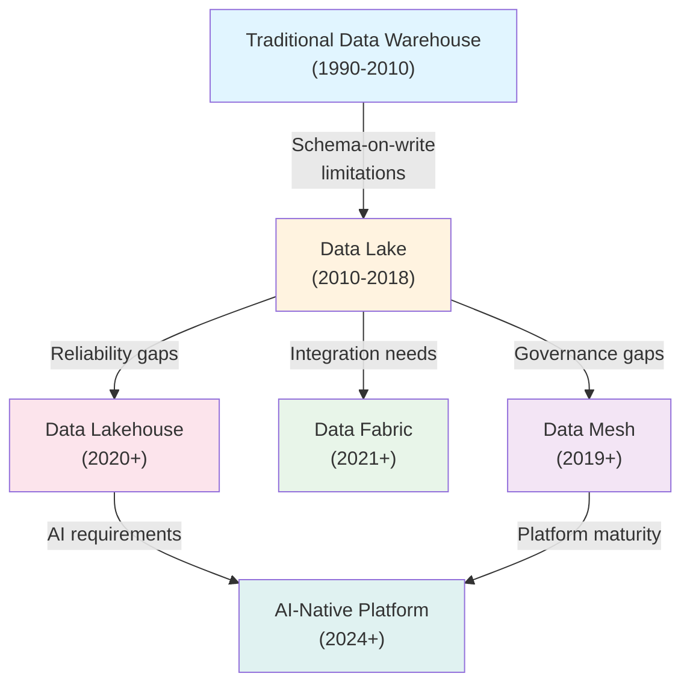
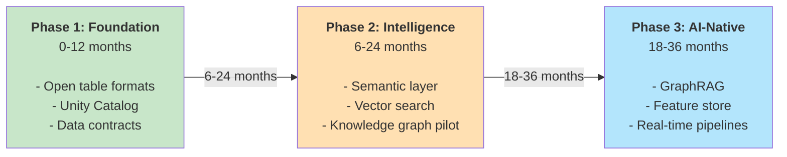

**ENTERPRISE RESEARCH REPORT**

2025 – 2030 Edition

# Data Architecture for AI

Knowledge Graphs  |  Lakehouses  |  Feature Stores  |  Semantic Layers  |  Vector DBs

A practitioner-level study on designing, governing, and scaling data foundations that power Generative AI, Agentic AI, Machine Learning, and Enterprise Knowledge Systems.

**Enterprise Architects**

**Principal Engineers CTOs AI Platform Teams Data Platform Teams**

**Technical PMs**

Covers: Lakehouse Architecture  •  Knowledge Graphs  •  GraphRAG  •  Feature Stores

Semantic Layers  •  Metadata Catalogs  •  Vector Databases  •  Enterprise AI Reference Architectures

Published June 2025

## Table of Contents

- Executive Summary
- 1. Evolution of Enterprise Data Architecture
- 2. Data Lakehouse Architecture
- 3. Lakehouse Vendors & Platform Comparison
- 4. Knowledge Graphs for AI
- 5. Knowledge Graph + LLM Architectures (GraphRAG)
- 6. Feature Stores & ML Data Architecture
- 7. Semantic Layer & Metrics Layer
- 8. Metadata & Data Catalog Platforms
- 9. Vector Databases & Retrieval Infrastructure
- Part 2: Enterprise AI Data Architecture Reference Models (continue in [Part 2](pathname:///archon/data-knowledge/parts/01-data-architecture-for-ai-report-part2.md))

## Executive Summary

**Key Finding:** Enterprises are converging on AI-native data architectures that combine open-table-format lakehouses, knowledge graphs, vector databases, and semantic layers — creating a unified intelligence fabric that powers everything from self-service analytics to autonomous AI agents. The window to establish this foundation is 2025–2027.

The enterprise data landscape is undergoing its most significant transformation since the advent of the cloud data warehouse. Generative AI and Agentic AI are not merely new workloads — they impose fundamentally different requirements on data infrastructure: real-time context retrieval, relationship-aware reasoning, temporal consistency, multi-modal storage, and enterprise-grade governance at every layer.

This report synthesizes practitioner experience, production deployments, vendor positioning, and forward-looking architecture patterns across 16 major research domains. It is designed to serve as both a decision framework for technology selection and a strategic roadmap for enterprises at any stage of their AI data journey.

### Five Critical Findings

###### 1. The Lakehouse Has Won the Storage War

Apache Iceberg has emerged as the de-facto open table format, with Databricks, Snowflake, AWS, Google, and virtually every major vendor now supporting it. The battle has shifted upstream to compute engines, governance layers, and AI integration.

###### 2. Knowledge Graphs Are No Longer Optional

GraphRAG implementations at Microsoft, Google, and dozens of Fortune 500 enterprises demonstrate 40–60% accuracy improvements over flat-vector RAG alone. Relationship-aware retrieval is becoming a baseline requirement for enterprise AI.

###### 3. Feature Stores Are Maturing into AI Data Products

The distinction between offline training data and online serving data is collapsing. Next-generation feature platforms unify batch, streaming, and real-time feature serving under a single governance model aligned with the data product paradigm.

###### 4. Semantic Layers Are the Missing Link for Agent Readiness

AI agents require business-context-aware data access. Semantic and metrics layers from dbt, Cube, and AtScale are evolving into agent-consumable knowledge APIs that enforce governance while enabling natural-language querying.

###### 5. Governance Cannot Be Retrofitted

Organizations that implement column-level security, data contracts, and AI lineage tracking from day one reduce compliance remediation costs by an estimated 3–5x compared to those that bolt it on post-deployment.

### Market Size & Investment Context

The global data infrastructure market supporting AI workloads is projected to reach $280B by 2028 (Gartner, IDC composite estimates). Key segments: cloud data platforms ($95B), AI/ML platforms ($72B), data governance &amp; quality ($18B), knowledge graph platforms ($8B, fastest growing at 34% CAGR), and vector database infrastructure ($4B, growing at 47% CAGR). Enterprise AI data readiness scores average 3.1/10 across industries (McKinsey 2024), signaling substantial greenfield opportunity.

## Evolution of Enterprise Data Architecture

From warehouses to AI-native intelligence fabrics

Enterprise data architecture has evolved through distinct paradigm shifts, each driven by the failure modes of its predecessor and the emergence of new business requirements. Understanding this lineage is essential for making sound architectural decisions today.

### Traditional Data Warehouse (1990–2010)

Emerged from OLAP and dimensional modeling (Inmon, Kimball). Solved: structured reporting, business intelligence, executive dashboards. Limitations: schema-on-write rigidity, poor scalability for raw data, high ETL cost, no support for semi-structured or unstructured data. Current adoption: declining for new projects, widely maintained. AI readiness: Very Low — requires heavy pre-processing for ML workloads.

### Data Lake (2010–2018)

Popularized by Hadoop/HDFS. Solved: raw data storage at scale, schema-on-read flexibility, cost economics for petabyte-scale. Limitations: became 'data swamps' without governance, poor query performance, consistency challenges, no ACID transactions. Current adoption: Transitioning to lakehouse. AI readiness: Medium — unstructured storage useful but without structure for reliable ML.

### Data Mesh (2019–present)

Organizational paradigm (Zhamak Dehghani) — domain-oriented ownership, data as a product, self-serve platform, federated governance. Solved: Conway's Law misalignment between centralized data teams and business domains. Limitations: organizational complexity, requires mature data culture, tooling still catching up. Current adoption: Growing in large enterprises. AI readiness: High — if implemented with AI-native data products.

### Data Fabric (2021–present)

Metadata-driven, AI-assisted integration layer connecting heterogeneous data sources. Solved: integration complexity across multi-cloud and hybrid environments. Key vendors: Informatica, IBM, Talend. Limitations: vendor-specific implementations, complexity of metadata management. AI readiness: High — designed for intelligent data discovery.

### Data Lakehouse (2020–present)

Combines data lake economics with warehouse-grade reliability. Built on open table formats (Iceberg, Delta, Hudi) with ACID transactions, schema enforcement, and SQL analytics. Solved: the reliability and performance gaps of data lakes while preserving flexibility. Current adoption: Dominant architecture for new data platform builds. AI readiness: Very High — native integration with ML/AI runtimes, unified batch+streaming.

### Knowledge Graphs (2012–present, surging post-2022)

Graph-structured representation of entities and their relationships. Solved: semantic understanding, entity disambiguation, multi-hop reasoning. Limitations: schema design complexity, query performance at scale, data engineering overhead. Current adoption: Accelerating rapidly for RAG and agentic AI. AI readiness: Very High.

### Vector Databases (2021–present)

Purpose-built for embedding storage and approximate nearest-neighbor (ANN) search. Solved: semantic similarity search at scale for LLM applications. Limitations: no relational structure, consistency challenges, cost at high cardinality. Current adoption: Ubiquitous in AI applications. AI readiness: Native — designed for AI workloads.

### AI-Native Data Platforms (2024–present)

Emerging category combining lakehouse storage, semantic layers, knowledge graphs, feature stores, and vector retrieval under unified governance. Examples: Databricks' AI-Native Lakehouse, Snowflake Cortex + Horizon, Microsoft Fabric. Solved: fragmentation of the AI data stack. Current adoption: Early adopter phase. AI readiness: Native.

### Migration Path: Toward AI-Native Architecture

The recommended migration path for most enterprises follows a three-phase journey:

- **Phase 1 (Foundation, 0–12 months):** Adopt open table formats on existing cloud storage. Implement Unity Catalog or equivalent governance. Establish data contracts and quality SLAs.

- **Phase 2 (Intelligence Layer, 6–24 months):** Deploy semantic layer for business metrics. Introduce vector search for unstructured content. Pilot knowledge graph for key entity domains.

- **Phase 3 (AI-Native, 18–36 months):** Unified AI data platform with GraphRAG, agent-ready feature stores, real-time context pipelines, and enterprise knowledge graph.

## Data Lakehouse Architecture

Open table formats, processing engines, storage, and catalogs

### Open Table Formats

Open table formats provide ACID transaction semantics, schema evolution, time-travel, and partition management on top of object storage — the foundational layer of the modern lakehouse.

| Format | Governance | Merge-on-Read | Copy-on-Write | Streaming | Best For | Key Adopters |
|---|---|---|---|---|---|---|
| Apache Iceberg | Apache Foundation | Yes | Yes | Flink, Kafka | Multi-engine, multi-cloud | Netflix, Apple, Dremio, AWS |
| Delta Lake | Linux Foundation | Yes | Yes | Spark Structured | Databricks ecosystems | Databricks, Microsoft, many ISVs |
| Apache Hudi | Apache Foundation | Yes | Yes | Spark, Flink | Near-real-time upserts | Uber, ByteDance, Amazon |

*Table 1: Open Table Format Comparison*

### Apache Iceberg — Deep Dive

Iceberg has become the dominant open table format as of 2024–2025. Its architecture separates metadata (manifest files, snapshot trees) from data files, enabling concurrent reads and writes across engines. Key capabilities:

- Hidden partitioning — queries don't require knowledge of partition layout

- Schema evolution without full table rewrites (add, drop, rename, reorder, widen types)

- Time travel with configurable snapshot retention for audit and ML reproducibility

- Row-level deletes enabling GDPR-compliant data erasure

- Apache Polaris (formerly Snowflake's Polaris) emerging as open catalog standard

- Native support across Spark, Flink, Trino, Presto, StarRocks, DuckDB, Snowflake, BigQuery

### Processing Engines

The choice of processing engine determines query latency, throughput, cost, and integration with AI/ML runtimes. No single engine dominates all workloads.

#### Apache Spark (Batch + Micro-batch)

Dominant for large-scale ETL and ML training. Databricks Runtime adds optimizations (Photon engine, Delta Cache). Weakness: high memory overhead, slow for ad-hoc queries.

#### Apache Flink (Real-time streaming)

Gold standard for sub-second streaming with exactly-once semantics. Used by Uber, LinkedIn, Netflix for real-time feature computation and event-driven AI pipelines.

#### Trino / Presto (Interactive SQL)

Massively parallel query engine for ad-hoc analytics across diverse sources. Starburst commercializes Trino with enterprise governance. Sub-10-second for most queries.

#### DuckDB (Embedded / Laptop-scale)

In-process OLAP engine with remarkable performance for single-node workloads. Increasingly used for local feature engineering, model prototyping, and edge analytics.

#### Snowflake Engine (Cloud DW + Lakehouse)

Proprietary vectorized engine with automatic clustering, result caching, and Iceberg external table support. Converging on Polaris-based open lakehouse model.

#### Databricks Runtime (Unified Analytics)

Optimized Spark + Delta Lake runtime with Photon C++ query engine, MLflow integration, and Unity Catalog governance. Leading platform for combined data + AI workloads.

### Storage Layers

Object storage has become the universal substrate for lakehouse architectures. Key selection criteria: egress costs, performance (especially for small-file I/O), consistency guarantees, and ecosystem integrations.

| Platform | Provider | Latency | Throughput | Egress Cost | Best For |
|---|---|---|---|---|---|
| Amazon S3 | AWS | ~10ms first byte | High | $0.09/GB | AWS-native, dominant ecosystem |
| Azure Data Lake Gen2 | Microsoft | ~15ms first byte | High | $0.087/GB | Azure/Fabric ecosystem |
| Google Cloud Storage | Google | ~8ms first byte | Very High | $0.12/GB | GCP/BigQuery workloads |
| MinIO | Open Source | ~2ms (on-prem) | Very High | N/A (internal) | On-prem/hybrid, S3-compatible |

*Table 2: Cloud Object Storage Comparison*

### Metadata &amp; Data Catalogs

| Catalog | Type | Iceberg Support | Lineage | AI Features | Notes |
|---|---|---|---|---|---|
| Unity Catalog | Commercial (Databricks) | Native | Yes | AI asset governance | De-facto for Databricks; expanding to multi-cloud |
| AWS Glue Catalog | Cloud (AWS) | Yes | Limited | SageMaker integration | Default for AWS Glue, Athena, EMR workloads |
| Apache Polaris | Open Source | Native (Iceberg) | No (yet) | None native | Emerging open standard for Iceberg catalog interop |
| DataHub | Open Source (LinkedIn) | Yes | Yes | ML entity support | LinkedIn-originated; strong lineage graph |
| OpenMetadata | Open Source | Yes | Yes | ML metadata | Modern API-first architecture; fast growing community |
| Hive Metastore | Open Source (Apache) | Partial | No | None | Legacy; being replaced in most new deployments |

*Table 3: Metadata Catalog Comparison*

## Lakehouse Vendors & Platform Comparison

Commercial platforms, open source leaders, and positioning

### Databricks

**LEADER**

Architecture: Unified Data + AI platform built on Delta Lake and Apache Spark, with Photon vectorized engine, Unity Catalog governance, MLflow for ML lifecycle, and Mosaic AI for LLM fine-tuning and serving. Market Position: #1 for combined data engineering + ML workloads. $800M+ ARR (2024 est.). AI Integration: Native — Databricks coined 'Data + AI' positioning. Model Serving, Feature Store, Vector Search, LLM Gateway all natively integrated. Strengths: Best-in-class Spark optimization, Delta Sharing, Unity Catalog cross-platform governance. Weaknesses: High cost at scale, vendor lock-in risk on proprietary optimizations. Best For: Enterprises building unified data + AI platforms on AWS/Azure/GCP.

### Snowflake

**LEADER**

Architecture: Cloud-native DW with separate compute and storage, Snowpark for Python/ML, Cortex AI for LLM features, Arctic open-source LLM, and Polaris Catalog for Iceberg. Market Position: $2.8B ARR (FY2025), dominant in structured analytics. AI Integration: Cortex (LLM APIs), Cortex Search (hybrid search), Document AI, and Snowflake Intelligence (agentic data querying). Strengths: Ease of use, time-travel, zero-copy cloning, strong BI tool integrations. Weaknesses: Compute credits can be expensive for ML training; Spark ecosystem not native. Best For: SQL-centric enterprises, BI-heavy workloads, governed data sharing.

### Microsoft Fabric

**CHALLENGER**

Architecture: Unified SaaS platform on Azure combining Synapse Analytics, Power BI, Data Factory, Real-Time Analytics, and OneLake (Delta Lake-based) under one license. Market Position: Rapidly gaining enterprise share via Microsoft 365 bundling. AI Integration: Copilot deeply embedded; Azure OpenAI integration; Fabric notebooks with native ML support. Strengths: Microsoft ecosystem integration, single license model, Power BI ubiquity. Weaknesses: OneLake performance vs. dedicated platforms; maturity gaps in some workloads. Best For: Microsoft-centric enterprises, organizations already on M365/Azure.

### Google BigQuery + Dataplex

**LEADER**

Architecture: Serverless columnar DW with BigLake for unified lakehouse, Dataplex for data governance, Vertex AI for ML, and Gemini for AI integration across the stack. Market Position: Strong in analytics; surging with Gemini AI integration. AI Integration: Gemini models natively accessible in BigQuery SQL; BigQuery ML; Vector Search in BigQuery; Agent Builder for enterprise AI apps. Strengths: Serverless scaling, BQML simplicity, Looker semantic layer integration. Weaknesses: GCP lock-in, less mature OSS ecosystem vs. Databricks. Best For: GCP-native organizations, serverless analytics, Looker BI deployments.

### AWS (Athena + Glue + EMR + Redshift)

**LEADER**

Architecture: Modular ecosystem — S3 as lakehouse substrate, Glue for ETL/catalog, Athena for serverless SQL, EMR for Spark, Redshift for DW, SageMaker for ML. Market Position: Largest cloud footprint; many enterprises run hybrid Redshift + S3 lakehouse. AI Integration: Bedrock for foundation models, SageMaker for ML lifecycle, Kendra/Q for enterprise search. Strengths: Service breadth, global infrastructure, S3 as universal substrate. Weaknesses: Fragmented tooling requires significant integration effort; governance complex. Best For: AWS-native enterprises, organizations preferring best-of-breed assembly.

### Starburst / Trino

**CHALLENGER**

Architecture: Enterprise Trino distribution with Galaxy SaaS offering, data products, and cross-source federation. No storage layer — query-in-place across any source. Market Position: Leading open query federation vendor; $250M+ funding. AI Integration: Warp Speed AI optimizer, Iceberg REST catalog, AI-ready metadata. Strengths: True query federation, no data movement, strong OSS community. Weaknesses: Not a full data platform; requires separate storage and orchestration. Best For: Multi-cloud data federation, organizations with diverse legacy sources.

### Dremio

**NICHE**

Architecture: SQL Lakehouse Platform with Apache Arrow-based query acceleration, Nessie (open catalog with Git-like branching), and reflection (materialized views). Market Position: Strong in self-service analytics on lakehouse; $230M+ funding. AI Integration: Semantic Layer for AI agent consumption; Arrow Flight for high-speed ML data delivery. Strengths: Zero-copy data virtualization, Nessie catalog branching, fast ad-hoc queries. Weaknesses: Smaller ecosystem than Databricks/Snowflake; limited ML-native features. Best For: Self-service analytics teams, Arrow-native ML pipelines, Iceberg-first deployments.

## Knowledge Graphs for AI

Graph models, enterprise platforms, and AI integration patterns

Knowledge graphs are emerging as the connective tissue of enterprise AI systems. They represent entities (people, products, concepts, events) and their relationships in a structured, queryable form that enables reasoning beyond what vector embeddings alone can achieve.

### Why Knowledge Graphs for AI?

**The Core Insight:** Vector embeddings capture semantic similarity. Knowledge graphs capture structural relationships. Enterprise AI requires both — GraphRAG implementations combining them show 40–60% accuracy improvements over vector-only RAG on complex multi-hop reasoning tasks (Microsoft Research, 2024).

- **Enterprise Search:** Entity-aware search that understands 'show me all contracts related to Supplier X and their subsidiaries' without keyword matching

- **Retrieval-Augmented Generation (RAG):** Graph-augmented retrieval traverses relationships to gather richer context, dramatically improving LLM accuracy on complex queries

- **Agentic AI Memory:** Agents maintain long-term memory of entities, actions, and relationships across sessions enabling true organizational knowledge accumulation

- **Recommendation Systems:** Product/content recommendations using collaborative filtering enhanced with semantic relationship context

- **Regulatory Compliance:** Automated lineage tracking linking data assets to regulatory obligations through relationship traversal

- **Fraud Detection:** Real-time graph traversal identifying suspicious relationship patterns across accounts, transactions, and entities

### Graph Models

#### Property Graph

Nodes and edges with arbitrary key-value properties. Query language: Cypher (Neo4j), Gremlin, openCypher. Most widely adopted model for enterprise applications. Best for: flexible schema, application-driven graphs.

#### RDF (Resource Description Framework)

Triple-based model (subject-predicate-object). W3C standard. Query language: SPARQL. Best for: semantic web, ontology-driven systems, regulatory/government data.

#### OWL (Web Ontology Language)

Formal ontology language built on RDF enabling automated reasoning and inference. Used in: life sciences, financial services compliance, supply chain ontologies.

#### LPG + RDF Hybrid

Modern platforms (Stardog, Ontotext) support both models, enabling property graph flexibility with semantic reasoning. Emerging as enterprise standard.

### Enterprise Knowledge Graph Platforms

#### Neo4j — LEADER | Property Graph + Cypher

Dominant enterprise graph database. 1,000+ enterprise customers. Native vector index for GraphRAG. GenAI integration via LangChain and LlamaIndex. Aura cloud service. AuraDB for managed deployments. Strengths: largest community, rich tooling, excellent documentation. Weaknesses: RDF/SPARQL support limited; scaling beyond 1B+ nodes complex.

#### Stardog — LEADER | RDF + Property Graph + SPARQL

Enterprise knowledge graph platform with native reasoning engine. Supports OWL, SPARQL, and openCypher. Virtual graphs (query without data movement). Strong in regulated industries (pharma, finance, defense). Voicebox natural language query interface. Best for: knowledge-centric enterprises needing semantic reasoning.

#### TigerGraph — CHALLENGER | Property Graph + GSQL

Purpose-built for deep link analytics at scale. 10–100x faster than Neo4j for multi-hop traversals on very large graphs (100B+ edges). Used by HSBC, Intuit for fraud detection and risk. Graph ML natively supported. Weaknesses: smaller community.

#### Ontotext GraphDB — SPECIALIST | RDF + SPARQL + Inference

Leading RDF graph database with OWL reasoning. Widely adopted in publishing, media, healthcare, and government. Semantic similarity search. Strong EU market presence. Best for: standards-compliant semantic knowledge management.

#### Amazon Neptune — CLOUD | Property Graph + RDF

Managed graph database supporting both Gremlin (property graph) and SPARQL (RDF). Neptune Analytics adds vector similarity search. Best for: AWS-native deployments needing managed graph infrastructure without operational overhead.

#### Azure Cosmos DB (Gremlin) — CLOUD | Property Graph + Gremlin

Globally distributed graph database within the Cosmos DB multi-model platform. Automated scaling. Best for: Microsoft-centric applications needing global distribution. Limitations: Gremlin only (no SPARQL), Cosmos pricing complex at scale.

## Knowledge Graph + LLM Architectures

GraphRAG, agentic memory, and relationship-aware retrieval

### GraphRAG Architecture

GraphRAG (Graph-augmented Retrieval-Augmented Generation) is the most significant architectural advancement in enterprise AI retrieval since the introduction of RAG itself. It addresses the fundamental limitation of flat-vector RAG: inability to traverse relationships and reason about multi-hop connections.

#### Microsoft Research (2024): GraphRAG Performance

GraphRAG on the same datasets as standard RAG showed:

- "comprehensiveness" improvements of 72%
- "diversity" improvements of 62%
- "empowerment" improvements of 57% on complex sensemaking queries

Microsoft has open-sourced GraphRAG at `github.com/microsoft/graphrag`.

### GraphRAG Pipeline Architecture

#### 1. Entity &amp; Relationship Extraction

LLM or NER model extracts entities and relationships from source documents. Tools: spaCy, GLiNER, custom fine-tuned models. Graph is built incrementally as documents are ingested. Entity disambiguation and co-reference resolution are critical.

#### 2. Community Detection &amp; Summarization

Graph communities (clusters of related entities) are identified using algorithms like Leiden or Louvain. Each community is summarized by an LLM to create 'community reports' that serve as high-level context anchors for retrieval.

#### 3. Hybrid Retrieval (Global + Local)

Global search: query community reports for high-level thematic answers. Local search: combine vector search on embeddings with graph traversal for entity-specific deep retrieval. Both paths feed context to the LLM generator.

#### 4. Context Assembly &amp; Generation

Retrieved graph context (entities, relationships, community summaries) plus relevant document chunks are assembled into the LLM context window. The LLM generates grounded responses with citation to source nodes.

### Agentic AI Memory Architecture

AI agents require multiple types of memory to function effectively in enterprise environments. Knowledge graphs are the only data structure capable of supporting all four memory types.

| Memory Type | Description | Graph Role | Technology |
|---|---|---|---|
| Episodic Memory | Record of past actions and interactions | Event/session nodes with temporal edges | Neo4j, property graph with timestamps |
| Semantic Memory | Factual knowledge about the world and domain | Entity + relationship graph with ontology | Stardog, GraphDB, Neo4j + OWL |
| Procedural Memory | Knowledge of how to perform tasks | Workflow and tool-use relationship graphs | Knowledge graph + workflow engine |
| Working Memory | Current session context and state | Short-term context nodes, evicted on session end | In-memory graph or vector store |

*Table 4: Agent Memory Architecture with Knowledge Graphs*

### Enterprise GraphRAG Implementations

#### Microsoft 365 Copilot

Uses Microsoft Graph (not a graph DB, but a relationship graph API over M365 data) combined with Azure AI Search vector retrieval. Graph provides org-chart traversal, document co-authorship relationships, and permission-aware entity context. Processing: billions of edges across Azure's tenant graph infrastructure.

#### Google Vertex AI + Knowledge Graph

Google's Enterprise Knowledge Graph service provides entity resolution and relationship enrichment. Vertex AI Search uses graph signals for document ranking. NotebookLM uses graph-augmented reasoning on personal document collections.

#### Salesforce Einstein AI

Salesforce Data Cloud creates a 'customer graph' linking contacts, accounts, opportunities, and interactions. Einstein Copilot uses this graph for context-aware CRM AI. The Customer 360 graph enables relationship traversal across all Salesforce clouds.

#### LinkedIn Knowledge Graph

LinkedIn maintains one of the world's largest enterprise knowledge graphs (~900M members, 67M companies, skills, job relationships). Powers job recommendations, skills inference, economic graph insights, and feed ranking. Built on Pinot for OLAP and custom graph infra.

## Feature Stores &amp; ML Data Architecture

Online/offline consistency, training-serving parity, and MLOps integration

Feature stores solve the most persistent pain point in ML engineering: the training-serving skew problem. When features computed during model training differ from features available at inference time — due to different codebases, different data snapshots, or different computation logic — model performance in production degrades unpredictably.

### Core Concepts

#### Online Store

Low-latency key-value store for real-time feature serving at inference time. Technologies: Redis, DynamoDB, Bigtable. P99 latency requirements: &lt;10ms for most use cases.

#### Offline Store

High-throughput columnar store for historical feature retrieval used in model training. Technologies: S3/GCS + Parquet/Iceberg, BigQuery, Redshift, Hive. Supports point-in-time correct lookups.

#### Point-in-Time Correctness

Critical for preventing data leakage in training. Feature values must be joined as they existed at the moment of each training label's event timestamp, not at data ingestion time.

#### Feature Reuse

Central feature registry enables teams to discover and reuse existing features, avoiding duplicate computation. Estimated to reduce ML engineering time by 30–50% at scale.

#### Training-Serving Consistency

Same feature transformation logic deployed for both offline batch computation and online real-time computation. Tecton enforces this via 'Feature Pipeline as Code' patterns.

### Platform Comparison

| Platform | Type | Online Store | Offline Store | Streaming | Point-in-Time | LLM Ready | Best For |
|---|---|---|---|---|---|---|---|
| Tecton | Commercial SaaS | Redis/DynamoDB | S3/Snowflake | Yes (Flink) | Yes | Yes | Enterprise real-time ML |
| Feast | Open Source | Redis/SQLite | BigQuery/Redshift | Partial | Yes | Partial | Teams starting with OSS |

| Platform | Type | Online Store | Offline Store | Streaming | Point-in-Time | LLM Ready | Best For |
|---|---|---|---|---|---|---|---|
| Hopsworks | Open/Commercial | RonDB (MySQL NDB) | Hudi/Parquet | Yes (Flink/Spark) | Yes | Yes | On-prem + cloud hybrid ML |
| Vertex AI FS | Cloud (GCP) | Bigtable/Redis | BigQuery | Yes | Yes | GCP | GCP-native ML teams |
| SageMaker FS | Cloud (AWS) | DynamoDB | S3 (Glue) | Yes (Kinesis) | Yes | AWS | AWS SageMaker ML teams |
| Azure ML FS | Cloud (Azure) | Redis | Azure SQL/ADLS | Partial | Partial | Azure | Azure ML / Fabric teams |

*Table 5: Feature Store Platform Comparison*

### Feature Stores for Generative AI

Traditional feature stores were designed for structured ML (tabular data, classification, regression). GenAI introduces new requirements:

- Embedding storage and retrieval (vector features) alongside traditional scalar features

- Prompt template versioning and A/B testing as 'features' for LLM calls

- Retrieval context as a feature type — tracking which documents were retrieved for which queries

- Fine-tuning dataset management with lineage to production model versions

- Real-time context injection pipelines for RAG-augmented inference

## Semantic Layer &amp; Metrics Layer

Business context, governance, and agent-ready analytics

The semantic layer has evolved from a BI abstraction tool to a critical component of enterprise AI architecture. It provides the business context layer that translates raw data structures into business concepts — enabling AI agents, LLMs, and business users to query data in natural language with confidence in correctness and governance.

**Why Semantic Layers Matter for AI:** Without a semantic layer, LLMs generating SQL must infer business logic from raw schema names. With a semantic layer, the LLM receives curated business definitions, metric logic, and access-controlled views — reducing hallucination risk and ensuring consistent, governed answers.

#### dbt Semantic Layer + MetricFlow

dbt's semantic layer (powered by MetricFlow) defines metrics, dimensions, and entities in YAML adjacent to dbt models. Integrates with Tableau, Metabase, Hex, and AI query tools via semantic layer APIs. Key advantage: metrics defined once, consumed everywhere. Best for: dbt-centric data teams.

#### Cube (formerly Cube.js)

Headless BI semantic layer with REST, GraphQL, and SQL APIs. Supports caching (pre-aggregations) for sub-second query response. 'Cube AI' enables natural language to Cube API. Widely adopted in embedded analytics use cases. Best for: teams building data products and AI apps.

#### AtScale

Enterprise semantic layer with universal translation to SQL across 15+ query engines. AI-Link feature connects LLMs to the semantic layer for governed NL querying. Strong in regulated industries. Best for: large enterprises with complex metric governance.

#### Looker Semantic Model (LookML)

Google's BI platform with a proprietary semantic modeling language (LookML). Tightly integrated with BigQuery and Gemini AI. Looker Conversational Analytics uses LookML to ground Gemini responses in governed metrics. Best for: GCP/BigQuery shops.

## Metadata &amp; Data Catalog Platforms

Discovery, lineage, governance, and AI asset management

Metadata management is no longer merely a compliance function — it is the foundation of AI governance. Understanding what data exists, how it was produced, who can access it, and how it has been used in AI models is a regulatory and operational necessity.

### Collibra — ENTERPRISE LEADER

Comprehensive data governance platform covering catalog, lineage, quality, privacy, and policy. 500+ enterprise customers including many Fortune 500. AI Governance module for ML model documentation. Strong GDPR/CCPA compliance tooling. Workflow engine for data stewardship. Weaknesses: High cost ($500K+ ACV common), complex implementation. Best for: large regulated enterprises.

### Alation — LEADER

Collaboration-focused data catalog with behavioral analytics (tracks how data is actually used). Open Data Quality Initiative for quality framework integration. Alation AI enables natural language catalog search. Trusted by Salesforce, eBay, BMW. Best for: enterprises prioritizing data literacy and self-service discovery.

### Informatica IDMC — ENTERPRISE LEADER

AI-powered metadata intelligence platform (CLAIRE AI engine) for automated metadata discovery and lineage. Broad connectivity (300+ connectors). Strongest in enterprises with complex multi-system integration needs. Best for: large enterprises with diverse data estates.

### Atlan — CHALLENGER

Modern, developer-friendly data catalog with Slack/Jira integrations, dbt native support, and active metadata capabilities. Fast-growing ($105M Series C 2022). Loved by data teams for ease of use vs. legacy platforms. Best for: modern data stack teams, dbt-centric orgs.

### DataHub (LinkedIn OSS) — OPEN SOURCE LEADER

Production-proven open source catalog used at LinkedIn (serving 5,000+ datasets), Airbnb, Slack. Graph-native metadata model. Strong lineage support. Active community. DataHub Cloud (Acryl Data) for managed deployment. Best for: teams wanting OSS with production credibility.

### OpenMetadata — OPEN SOURCE CHALLENGER

Modern API-first catalog with comprehensive metadata schema, built-in data quality, and collaboration features. Faster iteration than DataHub on some features. Strong in mid-market. Best for: teams starting fresh who want modern OSS stack.

## Vector Databases &amp; Retrieval Infrastructure

ANN algorithms, hybrid search, performance benchmarks, and RAG suitability

Vector databases store high-dimensional embeddings (typically 768–4096 dimensions) and enable approximate nearest-neighbor (ANN) search — the core retrieval mechanism for RAG, semantic search, recommendation, and multimodal AI applications.

### ANN Algorithms

#### HNSW (Hierarchical Navigable Small World)

Most widely adopted. Builds a multi-layer graph structure. Excellent recall/latency tradeoff. Incremental index updates supported. Used by: Pinecone, Weaviate, Qdrant, pgvector, Redis Vector.

#### IVF (Inverted File Index)

Clusters vectors into cells; searches only nearest cells. Faster build time than HNSW. Used in FAISS (Facebook AI Similarity Search) — the foundational library underlying many systems.

#### ScaNN (Google)

Google's Scalable Approximate Nearest Neighbors with product quantization. Best-in-class throughput at Google scale. Open-sourced but primarily used internally at Google.

#### DiskANN (Microsoft)

Graph-based ANN designed for SSD-based storage of billion-scale indexes. Enables large-scale vector search with smaller memory footprint. Used in Azure AI Search.

### Platform Comparison

| Platform | Type | Primary ANN | Hybrid Search | Max Scale | Managed | Best For |
|---|---|---|---|---|---|---|
| Pinecone | Purpose-built SaaS | Proprietary | Yes (sparse+dense) | Billions | Yes (SaaS only) | Production RAG, ease of use |
| Weaviate | OSS + Cloud | HNSW | Yes (BM25+vector) | Hundreds of M | Yes | Multi-modal, knowledge graphs |
| Milvus / Zilliz | OSS + Cloud | HNSW / IVF | Yes | Billions | Yes (Zilliz) | High-scale enterprise search |
| Qdrant | OSS + Cloud | HNSW | Yes | Hundreds of M | Yes (Qdrant Cloud) | Payload filtering, Rust performance |

| Platform | Type | Primary ANN | Hybrid Search | Max Scale | Managed | Best For |
|---|---|---|---|---|---|---|
| Chroma | OSS | HNSW | Partial | Millions | No | Dev/prototyping, local RAG |
| pgvector (PostgreSQL) | OSS extension | HNSW / IVFFlat | Yes (full SQL) | Tens of M | Via RDS/Supabase | Existing Postgres users |
| Elasticsearch / OpenSearch | OSS + Cloud | HNSW (FAISS) | Yes (BM25+KNN) | Billions | Yes | Text + vector hybrid at scale |
| Redis Vector | Cloud + OSS | HNSW | Partial | Hundreds of M | Yes (Redis Cloud) | Real-time, low-latency applications |
| MongoDB Atlas Vector | Cloud | HNSW | Yes | Hundreds of M | Yes | Existing MongoDB users |
| BigQuery Vector | Cloud (GCP) | ScaNN | Yes (SQL) | Billions | Yes (serverless) | GCP-native, SQL interface |

*Table 6: Vector Database Platform Comparison*

### Hybrid Search Architecture

Pure vector search excels at semantic similarity but can miss exact keyword matches critical for enterprise use cases (product codes, names, regulatory identifiers). Hybrid search combining dense vector retrieval with sparse BM25 keyword search consistently outperforms either approach alone — typical improvement: 5–15% on NDCG@10.

Reciprocal Rank Fusion (RRF) is the most widely adopted score fusion strategy, combining rankings from multiple retrievers without requiring score normalization. Implementations: Elasticsearch (ELSER), Weaviate (alpha parameter), Pinecone (hybrid alpha).

### Selection Framework

Key decision criteria when selecting a vector database:

- **Scale:** Under 10M vectors: any platform works. 10M–1B: Pinecone, Weaviate, Qdrant, pgvector (with tuning). Over 1B: Milvus/Zilliz, Elasticsearch, BigQuery Vector, Pinecone.

- **Query Latency:** Sub-10ms: Redis Vector, Qdrant (in-memory). Sub-100ms: Pinecone, Weaviate. Seconds acceptable: Milvus, pgvector at high cardinality.

- **Hybrid Search Quality:** Best: Elasticsearch/OpenSearch, Weaviate, Pinecone. Good: Qdrant, pgvector + tsvector. Limited: Chroma, Redis Vector.

- **Operational Simplicity:** Fully managed (minimal ops): Pinecone, Zilliz, Qdrant Cloud. Self-hosted with cloud option: Weaviate, Milvus. Embedded: Chroma, pgvector.

- **Cost:** Lowest for volume: pgvector (on existing Postgres), Chroma (self-hosted). Competitive SaaS: Qdrant Cloud, Weaviate Cloud. Premium: Pinecone at scale.

- **Integration Depth:** LangChain/LlamaIndex: all major platforms supported. Native LLM provider integration: Pinecone (OpenAI), Weaviate (multi-model). Graph+vector: Weaviate, Neo4j.

---

**Continue to [Part 2: Enterprise AI Data Architecture Reference Models, Governance, Case Studies &amp; Trends](pathname:///archon/data-knowledge/parts/01-data-architecture-for-ai-report-part2.md)**
