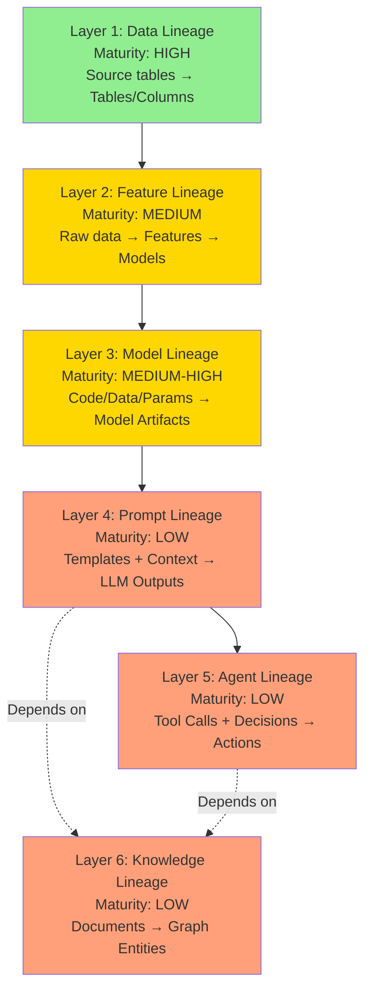

# End-to-End Lineage for AI-Era Data Systems — Part 1

Data | Feature | Model | Prompt | Agent | Knowledge Lineage — Impact Analysis & Compliance

A complete study of lineage architectures spanning tables to autonomous agents — covering platform comparison, impact and root-cause analysis, compliance reporting, and AI traceability.

**Data Architects Platform Engineers ML Engineers AI Governance Teams Compliance Teams Risk Teams Agent Developers**

Covers: Six Lineage Layers • Platform Comparison • Impact & Root-Cause Analysis

Compliance Reporting • AI Traceability & Explainability • Multi-Agent Lineage Evolution

End-to-End Lineage Systems for AI — Research Report | Confidential **CONFIDENTIAL — For Internal Use Only**

Published June 2026

## Table of Contents

| **Executive Summary** | **3** |
| --- | --- |
| **The Six-Layer Lineage Model** | **5** |
| **1 — Data Lineage** | **7** |
| **2 — Feature Lineage** | **10** |
| **3 — Model Lineage** | **13** |
| **4 — Prompt Lineage** | **16** |
| **5 — Agent Lineage** | **19** |
| **6 — Knowledge Lineage** | **22** |
| **Platform Comparison** | **25** |
| **Impact Analysis** | **29** |
| **Root Cause Analysis** | **31** |
| **Compliance Reporting** | **33** |
| **AI Traceability & Explainability** | **36** |
| **Lineage for Multi-Agent AI Systems** | **39** |

## Executive Summary

**Key Finding:** Lineage has expanded from a single technical concern (which tables feed which other tables) into a six-layer graph spanning raw data, computed features, trained models, prompts and retrieved context, autonomous agent decisions, and derived knowledge structures. Most enterprises have mature technical (table-level) lineage but significant — often complete — gaps in the five AI-era layers. These gaps are not cosmetic: they are precisely where root-cause analysis of AI failures, compliance evidence for AI regulation, and explainability for autonomous agent decisions must occur, and where they currently cannot.

This report examines lineage as an end-to-end discipline spanning six distinct but interconnected layers: data lineage (the established foundation), feature lineage (the ML-era extension), model lineage (training-to-artifact traceability), prompt lineage (the generative AI extension), agent lineage (the emerging frontier for autonomous systems), and knowledge lineage (for graph-structured enterprise knowledge). For each layer, the report examines what changed from the prior layer, what existing tooling covers versus what remains a gap, and how the major lineage platforms — OpenLineage, Marquez, DataHub, OpenMetadata, and Collibra, alongside emerging entrants — address (or don't yet address) each layer.

The report then examines four cross-cutting applications of lineage — impact analysis, root cause analysis, compliance reporting, and AI traceability/explainability — each of which depends on different combinations of the six layers, and each of which is correspondingly only as complete as the weakest layer it depends on. The report closes by examining how lineage itself must evolve for multi-agent AI systems, where a single user request may fan out into dozens of agent-to-agent and agent-to-tool interactions, each a potential lineage edge that current platforms were not designed to capture.

#### Six Critical Findings

##### 1. Lineage Completeness Decreases Monotonically Across the Six Layers

Data lineage (Layer 1) is mature at most enterprises with established data platforms — OpenLineage and catalog-integrated lineage cover the majority of transformation pipelines. Feature lineage (Layer 2) is moderately covered where feature stores are adopted, but adoption itself is partial. Model lineage (Layer 3) is generally well-covered within a single ML platform but fragments across multi-platform estates. Prompt lineage (Layer 4), agent lineage (Layer 5), and knowledge lineage (Layer 6) are, for most organizations as of 2026, either absent or implemented as custom, non-standardized logging — no enterprise examined in this research has end-to-end coverage across all six layers with a single integrated lineage graph.

##### 2. The 'Lineage Gap' Is Where AI Incidents Become Unexplainable

When an AI system produces an incorrect or harmful output, the investigation path runs backward through the layers: agent decision → prompt and retrieved context → model version → features → source data. A break in this chain at any layer halts the investigation. Because layers 4-6 are the least mature, most AI incident investigations in 2026 terminate at 'the model produced this output' without being able to establish why — the most common single root cause cited in this report's incident analysis section is not a data quality issue or a model issue per se, but a lineage gap that prevented determining which of several plausible causes was actually responsible.

##### 3. OpenLineage Has Become the De Facto Interchange Standard, But Coverage Above Layer 2 Is Inconsistent

OpenLineage's job/run/dataset model and facet-based extensibility have made it the most widely-adopted open standard for data and (with custom facets) feature lineage. However, the specification's core abstractions (jobs producing/consuming datasets) map awkwardly onto model training runs, prompt executions, and agent tool calls — extensions exist but are implemented inconsistently across the ecosystem, meaning OpenLineage-based lineage graphs frequently have rich Layer 1-2 coverage and sparse, vendor-specific Layer 3+ coverage.

##### 4. Catalog Platforms Are Converging on Graph-Native Lineage Models, Which Favors AI-Era Extension

DataHub and OpenMetadata's graph-based metadata models — where lineage is represented as edges in a property graph rather than a separate lineage-specific data structure — provide a more natural extension point for new node/edge types (prompts, agent runs, knowledge graph entities) than earlier relational-metadata catalog architectures. This architectural choice, made before the AI-era lineage requirements were fully understood, has turned out to be advantageous for the extensions now being built.

##### 5. Compliance Frameworks Are Driving Lineage Investment Faster Than Internal Operational Needs

While the operational case for AI/prompt/agent lineage (faster incident resolution, better debugging) is strong, the EU AI Act's documentation requirements for high-risk systems — requiring demonstrable training data provenance and decision traceability — are emerging as the more urgent forcing function for enterprises to invest in Layers 3-5, particularly for organizations with EU exposure facing phased enforcement through 2027.

##### 6. Multi-Agent Systems Will Require a Lineage Model Extension That Doesn't Yet Exist in Mature Form

Single-agent lineage (Layer 5) can, with effort, be represented as an extended trace — a linear-ish (if branching) sequence of tool calls and decisions. Multi-agent systems, where independent agents communicate via protocols like A2A and may operate concurrently with overlapping context, require a lineage model that captures not just sequences but agent-to-agent communication graphs, shared-memory read/write conflicts, and emergent coordination patterns — a fundamentally graph-shaped (not trace-shaped) lineage problem that current distributed tracing-derived approaches (OpenTelemetry-based agent observability) are not natively designed to represent.

## The Six-Layer Lineage Model

The table below provides a navigational overview of the six lineage layers examined in this report, the question each layer answers, and its typical maturity level across enterprises as of 2026. Detailed analysis of each layer follows in the numbered sections.

| **#** | **Layer** | **Core Question Answered** | **Typical Maturity (2026)** | **Primary Tooling** |
| --- | --- | --- | --- | --- |
| 1 | Data Lineage | Which source columns/tables, through which jobs, produced this table/column? | High — mature and widely adopted | OpenLineage, dbt, Spline, catalog-native |
| 2 | Feature Lineage | Which raw data and transformations produced this feature, and which models consume it? | Medium — strong where feature stores adopted, absent elsewhere | Tecton, Hopsworks, Feast (limited), catalog extensions |
| 3 | Model Lineage | Which data, features, code version, and hyperparameters produced this trained model artifact? | Medium-High within single ML platforms; fragments across multi-platform estates | MLflow, SageMaker Lineage, Vertex ML Metadata |
| 4 | Prompt Lineage | Which prompt template version, combined with which retrieved context, produced this LLM output? | Low — mostly custom logging, inconsistent standards | Langfuse, Helicone, custom instrumentation |
| 5 | Agent Lineage | Which sequence of tool calls, decisions, and data sources led to this agent action? | Low — emerging, largely custom on OpenTelemetry | OpenInference/OpenTelemetry-based, framework-native traces |
| 6 | Knowledge Lineage | Which source documents and extraction runs produced this graph entity/relationship? | Low — niche outside GraphRAG-specific implementations | Custom extraction pipeline logging, emerging catalog extensions |

*Table 1: The Six-Layer Lineage Model*

#### Why Six Layers, and Why This Order

The six layers are ordered to reflect both historical emergence and dependency structure: each layer depends on the layers before it for full traceability, while introducing lineage concerns that didn't exist in prior layers. Data lineage (Layer 1) is the foundation — without knowing where data comes from, no higher layer's lineage can be complete, since features, models, prompts, agents, and knowledge graphs are all ultimately derived from data. Feature lineage (Layer 2) extends data lineage with the specific transformation and point-in-time semantics that ML requires. Model lineage (Layer 3) extends feature lineage with training-run provenance — the same feature set can produce different models depending on code version, hyperparameters, and random seeds. Prompt lineage (Layer 4) is the first layer where the 'data' being traced (retrieved context, prompt templates) may not have existed as structured data in the traditional sense — introducing fundamentally different traceability requirements. Agent lineage (Layer 5) extends prompt lineage across multiple sequential (or concurrent) LLM interactions and tool calls that constitute a single agent task. Knowledge lineage (Layer 6) is somewhat orthogonal — it traces how source documents become graph-structured knowledge, which then becomes an input to layers 4-5 (retrieved/traversed by agents) — making it both a foundation for and a consumer of the lineage chain.

**How to Read This Report:** Each layer section follows a consistent structure: What Changed From the Prior Layer, What Existing Tooling Covers, What Remains a Gap, and Platform Capability Notes. This structure is designed to make explicit exactly where the lineage chain breaks for a given organization — readers should expect to identify their own organization's lineage maturity layer-by-layer rather than receiving a single 'mature' or 'immature' verdict.

### Data Lineage

Column- and table-level transformation lineage — the established foundation

##### What This Layer Answers

Data lineage answers: for a given table or column, which source tables/columns, processed through which jobs/queries/transformations, produced it — and conversely, for a given source table, which downstream tables/columns depend on it. This is bidirectional by necessity: backward lineage supports root cause analysis ('why does this number look wrong'), while forward lineage supports impact analysis ('what breaks if I change this').

##### What Existing Tooling Covers

- **Job/run/dataset capture:** OpenLineage's core model — every pipeline run emits events describing which datasets it read and wrote, with column-level detail via facets — is widely integrated into Spark, dbt, Airflow, Flink, and other major processing engines

- **Transformation-as-code lineage:** dbt's compiled DAG provides exact, deterministic lineage for SQL-based transformations, since the transformation logic itself is the lineage source of truth — no separate capture mechanism is needed beyond parsing the dbt project

- **Column-level lineage via SQL/Spark parsing:** tools like Spline (for Spark) and SQL-parsing-based lineage extractors can derive column-level lineage automatically from query plans without requiring manual annotation

- **Catalog-integrated lineage visualization:** DataHub, OpenMetadata, and Collibra all provide lineage graph visualization integrated with their broader catalog — allowing a user to navigate from a table's documentation directly to its upstream/downstream lineage

##### What Remains a Gap

- **Out-of-band/manual interventions:** as discussed in the companion Operational Excellence report's Production Failure Analysis, manual corrections (ad-hoc UPDATE statements, manually uploaded corrected files) are invisible to lineage tooling that only tracks pipeline-driven transformations — this remains the most common source of 'unexplained' data lineage gaps even in otherwise-mature implementations

- **Cross-platform lineage continuity:** when data moves between fundamentally different systems (e.g., from an operational database via CDC into a lakehouse, then via reverse ETL into a SaaS CRM), lineage capture at each system boundary depends on each system's individual OpenLineage/catalog integration — gaps at any boundary break the end-to-end chain, and CDC tools historically have had less mature lineage integration than transformation tools like dbt

- **Non-tabular and streaming lineage:** lineage for streaming pipelines (Kafka topics, stream processing jobs) is less uniformly captured than batch lineage — partly because streaming jobs are long-running rather than discrete runs, which doesn't map as cleanly onto OpenLineage's run-based model

- **Business/semantic lineage connection:** technical (column-level) lineage rarely connects automatically to business lineage (which KPIs/metrics are affected) — this connection requires the semantic layer (discussed in the companion Architecture Evolution report) to be both adopted and itself lineage-instrumented, which is inconsistent across organizations

##### Platform Capability Notes

###### OpenLineage

The specification itself, not a platform — defines the job/run/dataset/facet model that other tools implement. Integrations exist for Spark, Flink, dbt, Airflow, Dagster, and others. Column-level lineage is supported via the ColumnLineageDatasetFacet, though adoption of this specific facet varies by integration maturity.

###### Marquez

The reference implementation/metadata service for OpenLineage — stores and visualizes the lineage graph that OpenLineage events describe. Strong for organizations wanting a lightweight, purpose-built lineage store without adopting a full catalog platform, but lacks the broader governance/documentation features of DataHub, OpenMetadata, or Collibra.

###### DataHub

Graph-native metadata model where lineage is represented as edges between dataset/job/etc. entities in a property graph — supports both push-based (via OpenLineage or native emitters) and pull-based (via crawlers/connectors that parse query history) lineage ingestion. Column-level lineage is well-supported for major engines.

###### OpenMetadata

Similar graph-based approach to DataHub, with growing connector coverage for automated lineage extraction. Notable for integrating lineage directly into its data quality and observability features — a lineage edge can be annotated with the quality status of the upstream dataset.

###### Collibra

Enterprise-grade lineage with the deepest source-system connector library among catalog platforms, reflecting its long history in regulated-industry data governance. Lineage is tightly integrated with Collibra's policy and classification framework — a lineage edge can trigger policy propagation (e.g., a classification tag flows downstream automatically).

### Feature Lineage

Extending data lineage with point-in-time semantics and cross-model blast radius

##### What Changed From Data Lineage

Feature lineage extends data lineage with two requirements that table-level lineage doesn't address: point-in-time correctness (a feature's lineage must capture not just 'what data produced this feature' but 'as of what timestamp', since the same feature definition produces different values at different points in time) and many-to-many consumption (a single feature is typically consumed by many models, and a single model consumes many features — making 'blast radius' analysis for feature changes a many-to-many graph traversal rather than the more tree-like structure of typical table lineage).

##### What Existing Tooling Covers

- **Feature definition versioning:** feature stores with native versioning (Tecton, Hopsworks) track which version of a feature's transformation logic was active at any point in time, supporting reproducibility of historical feature values

- **Feature-to-model consumption mapping:** mature feature stores maintain a registry of which models/training runs consumed which feature versions — answering 'if I change this feature's logic, which models are affected' (forward/impact direction)

- **Feature-to-source lineage:** feature definitions reference their underlying data sources (typically lakehouse tables), and this reference can be combined with Layer 1 data lineage to produce an end-to-end view from raw source table to served feature value

- **Point-in-time join lineage:** platforms with native point-in-time join support record the timestamp semantics used for each training dataset generation, supporting the question 'was this training dataset generated with correct point-in-time joins, or is there leakage'

##### What Remains a Gap

- **Feature lineage outside adopted feature stores:** the majority of feature lineage tooling is feature-store-native — organizations computing 'features' as ad-hoc SQL/dataframe transformations outside a feature store (common for long-tail models, as discussed in the companion Architecture Evolution report) have no feature lineage at all for those features, only whatever table-level lineage (Layer 1) happens to cover the underlying transformation

- **Cross-feature-store lineage fragmentation:** organizations using multiple feature stores (e.g., a cloud-native feature store for some teams, self-hosted Feast for others) have feature lineage siloed within each platform, with no unified view of 'all features derived from this source table' across platforms

- **Online/offline synchronization lineage:** lineage typically describes the offline (batch) computation path well, but the online serving path — including synchronization lag between offline and online stores — is less consistently captured, even though synchronization lag is a documented production failure mode (companion Operational Excellence report)

- **Feature lineage for 'context store' / agentic features:** as discussed in the companion Architecture Evolution report, the extension of feature-store concepts toward agent context (retrieval results, conversation summaries) is ad-hoc per organization — there is no standard feature lineage model for these emerging feature types

##### Platform Capability Notes

###### OpenLineage

No first-class feature or feature-store abstraction in the core specification. Organizations integrating feature store lineage with OpenLineage-based pipeline lineage typically do so via custom facets representing feature definitions as a dataset type — functional but non-standardized across implementations.

###### Marquez

Inherits OpenLineage's lack of native feature abstraction; feature lineage would need to be represented through the same custom-facet approach, with no out-of-box feature-store integration.

###### DataHub

Has explicit support for ML entity types (MLFeatureTable, MLFeature, MLModel) in its metadata model, allowing feature definitions, their source lineage, and their consumption by models to be represented as first-class graph entities — among the stronger options for representing feature lineage within a general-purpose catalog.

###### OpenMetadata

Growing support for ML entity types, with feature lineage representable similarly to DataHub's approach, though with a smaller set of feature-store-specific connectors as of this writing — coverage depends on whether the specific feature store platform in use has an OpenMetadata connector.

###### Collibra

Feature lineage is generally handled via Collibra's AI Governance module rather than the base lineage capability — integrations with major feature store platforms exist but depth varies; Collibra's strength remains the policy propagation aspect (a feature derived from classified data inherits that classification).

###### Emerging: Feature-store-native lineage (Tecton, Hopsworks)

The most complete feature lineage as of 2026 remains within feature-store-native lineage graphs rather than general-purpose catalogs — Tecton and Hopsworks both provide feature-to-source and feature-to-model lineage natively, but this lineage is generally not exported to or unified with broader enterprise catalog lineage without custom integration work.

### Model Lineage

Training-run provenance — code, data, hyperparameters, and artifact versioning

##### What Changed From Feature Lineage

Model lineage extends feature lineage with the additional dimensions that determine a trained model artifact's behavior beyond its input features: the exact code version (training script, preprocessing logic), hyperparameters, random seeds, compute environment (library versions, hardware), and the specific snapshot of training data (which, per Layer 2, requires point-in-time feature values). Two training runs using identical features can produce meaningfully different models if any of these additional dimensions differ — model lineage exists to make this difference traceable rather than an unrecorded variable.

##### What Existing Tooling Covers

- **Experiment tracking as lineage substrate:** MLflow, Weights & Biases, and similar experiment tracking tools capture code version (often via git commit hash), hyperparameters, metrics, and artifact references for each training run — providing the raw lineage data even when not framed explicitly as 'lineage'

- **Model registry versioning:** MLflow Model Registry, SageMaker Model Registry, and Vertex Model Registry maintain version history for registered models, linking each version back to its producing training run and forward to its deployment history (which endpoints/environments serve this version)

- **Training data snapshot references:** platforms with integrated feature store + training + registry (Databricks, SageMaker, Vertex AI) can reference the exact feature data snapshot (often via lakehouse time-travel, Section 3 of the companion Architecture Evolution report) used for a given training run, providing data-to-model traceability within that platform

- **Deployment lineage:** tracking which model version is/was deployed to which serving endpoint at which time — supporting both rollback ('redeploy the previous version') and historical investigation ('which model version produced this prediction on this date')

##### What Remains a Gap

- **Cross-platform model lineage fragmentation:** an organization using one platform for training (e.g., a Databricks notebook with MLflow) and a different platform for serving (e.g., a custom Kubernetes-based serving infrastructure) has model lineage that's complete within MLflow but doesn't automatically connect to production serving logs without custom integration — meaning 'which model version produced this specific production prediction six months ago' can require manual correlation across systems

- **Foundation model / third-party LLM lineage:** for models that are fine-tuned or used as-is from a third-party provider (OpenAI, Anthropic, etc.), 'model lineage' in the traditional training-run sense doesn't apply in the same way — the relevant lineage becomes which model version/snapshot (often identified by a model API version string controlled by the provider, not the enterprise) was used, which is a fundamentally different and less-enterprise-controlled lineage record

- **Ensemble and pipeline model lineage:** when a production system's 'model' is actually a pipeline of multiple models (e.g., a retrieval model, a re-ranking model, and a generation model), lineage tooling designed around single-model training runs doesn't naturally represent the composite lineage of the overall pipeline's behavior

- **Continuous/online learning lineage:** for models that update continuously (online learning) rather than via discrete training runs, the experiment-tracking-based lineage model (one run = one lineage record) doesn't map cleanly — lineage for continuously-updating models remains an edge case most tooling doesn't address well

##### Platform Capability Notes

###### OpenLineage

No native model/experiment abstraction — the specification's job/run/dataset model can represent a training run as a 'job' with the trained model as an output 'dataset', but this is a loose fit; most organizations use OpenLineage for the data-to-feature portion of model lineage (Layers 1-2) and a dedicated ML platform (MLflow etc.) for the training-to-model portion, with limited integration between the two lineage representations.

###### Marquez

Same limitation as OpenLineage given its role as the reference implementation — model lineage specifically is outside its primary scope.

###### DataHub

First-class MLModel, MLModelGroup, and related entity types allow model versions, their training run lineage, and their deployment lineage to be represented in the same graph as data and feature lineage — DataHub's MLflow integration can ingest experiment tracking data into this unified graph, providing one of the more complete cross-layer (1-3) lineage views among general-purpose catalogs.

###### OpenMetadata

Similarly growing ML entity support; integration depth with major experiment tracking/registry platforms (MLflow, SageMaker) is actively developing, with coverage varying by specific platform combination.

###### Collibra

Model lineage is addressed through the AI Governance module, which focuses more on model risk/compliance metadata (approval status, risk tier, documentation completeness) than on granular training-run provenance — Collibra is typically positioned as the governance layer consuming lineage from MLflow/registry platforms rather than as the lineage source of truth for training provenance itself.

###### Emerging: MLflow / SageMaker Lineage / Vertex ML Metadata as de facto standards

Within their respective platforms, these provide the most complete model lineage available — the gap is exclusively at the cross-platform level. Emerging open standards efforts (extending OpenLineage's facet model to better represent ML experiment/model entities) are in early stages as of 2026 but not yet broadly adopted.

### Prompt Lineage

The first layer where 'lineage' means tracing non-deterministic, context-assembled inputs

##### What Changed From Model Lineage

Prompt lineage represents a qualitative shift from the prior three layers. Layers 1-3 trace deterministic transformations of structured data through versioned code — given the same inputs and code version, the output is reproducible. Prompt lineage must trace: the prompt template version (itself versioned code, similar to Layer 1-3 artifacts), the retrieved context (the output of a vector/graph retrieval operation that depends on the current state of an index — Layers 1, 6, and the companion Architecture Evolution report's Section 9), and the LLM's output (non-deterministic, dependent on model version/provider state that the enterprise often doesn't control). Prompt lineage is therefore lineage for a process that is only partially reproducible even with complete lineage records — a fundamentally different guarantee than Layers 1-3 provide.

##### What Existing Tooling Covers

- **Prompt template versioning:** Langfuse and similar platforms provide git-like versioning for prompt templates, allowing 'which version of this prompt template was active when this response was generated' to be answered — this is the most mature aspect of prompt lineage as of 2026

- **Trace-level logging of inputs/outputs:** LLM observability platforms (Langfuse, Helicone, Arize Phoenix) log the full assembled prompt (including retrieved context inserted into the template) and the resulting output for each request — providing a record of what was actually sent to the model, even if not always structured as formal 'lineage'

- **Retrieval result logging:** the same platforms typically log which documents/chunks were retrieved for a given request, including similarity scores — allowing the question 'which source documents informed this response' to be answered, assuming the retrieval logging is correctly correlated with the corresponding generation request

- **Model version/provider metadata:** requests to LLM APIs typically include (or the response includes) the specific model version used — providing the 'which model snapshot generated this' record discussed as a Layer 3 gap for third-party models

##### What Remains a Gap

- **Connecting prompt lineage to upstream data/knowledge lineage:** the most significant gap. LLM observability platforms log 'these document chunks were retrieved' but typically don't connect this to Layer 1 (which source table/document version produced this chunk) or Layer 6 (which extraction run produced this knowledge graph entity that informed the response) — meaning the chain from 'this output was wrong' back to 'because this source document was outdated' frequently cannot be completed without manual cross-referencing between the LLM observability platform and the data catalog/lineage system, which are typically entirely separate tools with no integration

- **System prompt and configuration lineage:** system prompts (which encode business rules, safety constraints, and behavioral instructions) are often managed separately from user-facing prompt templates, with less consistent versioning/lineage — a change to a system prompt that affects all requests using a given application is a significant lineage event that's frequently under-tracked relative to per-request prompt template versions

- **Non-reproducibility as an inherent lineage limitation:** even with complete prompt lineage records, re-running the same prompt template + retrieved context + model version may not reproduce the same output (LLM outputs have inherent variability, and provider-side model updates can change behavior for a 'fixed' model version string) — prompt lineage can establish 'what was sent and what version was used' but cannot guarantee 'reproducing this would give the same result', a fundamental limitation that lineage consumers (especially for compliance purposes) need to understand explicitly

- **Multi-turn conversation lineage:** for multi-turn conversations, each turn's prompt includes prior conversation history — prompt lineage for turn N technically includes the lineage of turns 1 through N-1 as part of its input, creating a lineage record that grows with conversation length and that most tooling doesn't represent efficiently (often re-logging the full growing context at each turn rather than representing it as an incremental lineage chain)

##### Platform Capability Notes

###### OpenLineage

No native prompt/LLM abstraction in the core specification as of this writing. The job/run/dataset model could in principle represent an LLM call as a job with the prompt and retrieved context as input 'datasets' and the response as an output 'dataset', but no widely-adopted convention for this exists — prompt lineage in practice is captured by LLM-observability-specific tools (below) operating independently of OpenLineage-based data lineage.

###### Marquez

Not applicable — outside scope as the OpenLineage reference implementation, with the same gap as OpenLineage itself.

###### DataHub

No first-class prompt/LLM trace entities as of 2026, though DataHub's extensible entity model could accommodate custom entity types for prompts/LLM calls — this would require custom development rather than being available out-of-box. DataHub's strength remains as the potential integration point connecting prompt-level lineage (from Langfuse/Phoenix) to data/knowledge lineage, if such integration were built.

###### OpenMetadata

Similar position to DataHub — extensible but without native prompt lineage entities; the integration opportunity (connecting LLM observability to data catalog lineage) is recognized but not yet a standard out-of-box capability.

###### Collibra

Prompt lineage is addressed, to the extent it is, through the AI Governance module's prompt governance capabilities (Part 16 of the companion Operational Excellence report) — focused more on prompt version approval/review workflows than on per-request retrieval/output lineage, which remains the domain of LLM observability platforms.

###### Emerging: Langfuse, Arize Phoenix, Helicone as the prompt lineage source of truth

These platforms provide the most complete prompt-level lineage available — prompt template versions, retrieved context, and outputs, often with OpenTelemetry-compatible tracing (Langfuse, Phoenix). The emerging direction (not yet standard) is using OpenTelemetry/OpenInference trace context as the connective layer between these platforms and data-catalog lineage — since both increasingly support OpenTelemetry-based instrumentation, a shared trace ID could in principle link a retrieval span to the data lineage of the retrieved content's source, but this linkage is not yet implemented as a standard pattern across the ecosystem.

### Agent Lineage

Tracing the full decision chain of an autonomous agent across tools and steps

##### What Changed From Prompt Lineage

Prompt lineage (Layer 4) traces a single request-response interaction with an LLM. Agent lineage extends this across the full sequence of steps that constitute a single agent task: an agent may make multiple LLM calls, call multiple tools (each potentially itself a traditional ML model, a database query, an API call, or another agent), and make decisions about which tools to call based on intermediate results — all before producing a final action or response. Agent lineage must capture this entire chain as a structured trace: not just 'what was the final output' but 'what was the sequence of reasoning, tool calls, and intermediate results that led there', since any step in this chain could be the source of an eventual error.

##### What Existing Tooling Covers

- **Distributed tracing as the structural foundation:** OpenTelemetry-based distributed tracing, extended with OpenInference's GenAI-specific semantic conventions, provides the span/trace structure needed to represent an agent's sequence of LLM calls and tool invocations as a single trace tree — this is the most mature aspect of agent lineage, directly inheriting from Part 12 of the companion Operational Excellence report's platform observability discussion

- **Framework-native execution traces:** agent orchestration frameworks (LangGraph, CrewAI, AutoGen, OpenAI Agents SDK — discussed in the companion Operational Excellence report's Part 17) typically provide their own execution trace/history representation, capturing the sequence of nodes/agents/tools executed for a given run — though these traces are framework-specific in structure and not standardized across frameworks

- **Tool call input/output logging:** for each tool call within an agent's execution, both the input parameters and the returned result are typically logged by observability platforms (Langfuse, Phoenix) — providing the raw data needed to determine 'what information did the agent have when it made this decision'

- **Decision point identification:** for frameworks with explicit control flow (LangGraph's graph-based execution), the trace can identify specific decision points (which branch of the graph was taken, and based on what condition) — providing more structured lineage than frameworks where the LLM's reasoning entirely determines the execution path

##### What Remains a Gap

- **Connecting agent traces to upstream lineage layers:** as with prompt lineage, agent execution traces typically exist in an LLM-observability silo separate from data/feature/model/knowledge lineage systems — an agent trace shows 'the agent called the customer-lookup tool and received this data' but doesn't typically connect 'this data' back to the source table's Layer 1 lineage, the feature's Layer 2 lineage if it was a computed feature, or the knowledge graph entity's Layer 6 extraction lineage if it came from a graph traversal

- **Reasoning traceability vs. action traceability:** agent traces reliably capture what tools were called with what inputs/outputs (action traceability) but capturing why the agent chose to call a particular tool — the LLM's 'reasoning' that led to that decision — is less reliably captured, particularly for models/frameworks that don't expose explicit chain-of-thought, or where chain-of-thought is generated but not retained in logs due to volume/cost considerations (Part 12 of the companion report)

- **Cross-agent and cross-session continuity:** when an agent's task spans multiple sessions (e.g., a long-running task that's paused and resumed, or a task handed off between different agent instances), maintaining a continuous lineage trace across this discontinuity requires explicit trace context propagation that's inconsistently implemented — many implementations effectively restart tracing at session boundaries, fragmenting what should be a single logical lineage chain

- **Agent identity in lineage records:** as discussed in the companion Operational Excellence report's Part 14, agent identity (distinct from the human user or service account) is an emerging, non-standardized concept — agent lineage records frequently lack a stable agent identity field, making it difficult to answer 'across all tasks, what has this specific agent (vs. this application generally) done' as agent identity standards mature

- **Cost/token attribution as a lineage dimension:** while not strictly 'lineage' in the traceability sense, cost attribution (which agent, which step, consumed how many tokens/how much compute) shares the same trace-based data model as agent lineage and is frequently needed for the same investigations (e.g., 'this agent's cost-per-task spiked — which step changed') — but is often captured by separate cost-monitoring tooling rather than unified with lineage traces

##### Platform Capability Notes

###### OpenLineage

No native agent/tool-call abstraction. As with prompt lineage, agent lineage in practice is captured by OpenTelemetry/OpenInference-based tracing rather than OpenLineage's job/run/dataset model — the two standards currently operate in largely separate domains (OpenLineage for data pipeline lineage, OpenTelemetry-derived approaches for agent/LLM tracing) without a standardized bridge.

###### Marquez

Outside scope, as with prior AI-era layers.

###### DataHub

No native agent trace entities as of 2026. As with prompt lineage, DataHub's extensibility makes it a plausible future integration point for connecting agent traces to data lineage, but this requires custom development; no standard connector for agent observability platforms exists yet.

###### OpenMetadata

Similar position — extensible metadata model without native agent lineage entities or standard integrations with agent observability platforms as of this writing.

###### Collibra

Agent governance (Part 16 of the companion report) within Collibra's AI Governance module focuses on policy definition (what agents are permitted to do) rather than execution-level lineage (what a specific agent run actually did) — the two are complementary but distinct, and Collibra's current emphasis is the former.

###### Emerging: OpenInference + OpenTelemetry as the agent lineage substrate

The most active area of standards development relevant to agent lineage is the extension of OpenTelemetry's GenAI semantic conventions (via OpenInference and related efforts) to cover agent-specific span types (tool calls, agent handoffs, multi-step reasoning chains). Arize Phoenix and Langfuse both support these conventions and are the most mature platforms for agent-level trace visualization as of 2026. The gap — connecting these traces to Layers 1-3 and 6 — remains the primary open integration challenge, and is the focus of early-stage efforts (not yet standardized) to propagate trace context across the data-lineage/agent-observability boundary.

## Related

- [Enterprise Data Systems, Streaming & AI Governance](05-enterprise-data-systems-ai-governance-report.md) — the operational data-systems layer this lineage model traces across.
- [Governance & Responsible AI for Knowledge Systems](09-governance-rai.md) — the compliance and regulatory drivers behind lineage requirements.
- [Trust Hub](../trust/index.md) — broader compliance and governance frameworks lineage reporting feeds into.

---

**Continue to [Part 2: Knowledge Lineage, Platform Comparison & Analysis](pathname:///archon/data-knowledge/parts/02-end-to-end-lineage-systems-report-part2)**
