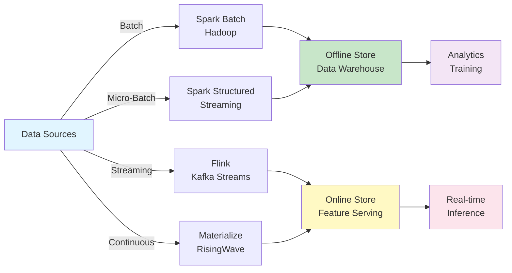

# Enterprise Data Systems, Streaming & AI Governance

A complete operational lifecycle study of the data systems that power analytics, ML, Generative AI, and Agentic AI — covering reliability, governance, security, and AI readiness.

**Coverage:** Streaming & Messaging • Data Movement & Integration • Observability & Lineage • Reliability Engineering • Security & Compliance • AI/Agent Governance • Production Failure Analysis

Enterprise Data Systems & AI Governance — Research Report | Published June 2026

## Executive Summary

**Key Finding:** Operational excellence — not technology selection — is now the primary differentiator between AI initiatives that scale and those that stall. Enterprises with mature observability, lineage, and governance practices ship AI features 3–5x faster and experience 60% fewer production incidents tied to data quality or drift (composite of Monte Carlo, DORA, and internal benchmarking studies).

This report extends beyond architecture selection into the full operational lifecycle of enterprise data systems supporting analytics, machine learning, generative AI, and increasingly autonomous agentic systems. Twenty research areas are synthesized into actionable frameworks covering reliability engineering, security architecture, regulatory compliance, AI governance, and production failure analysis — informed by real incidents and operational practices at Netflix, Amazon, Google, Uber, and LinkedIn.

The central thesis: as data platforms become the substrate for autonomous AI agents making real-world decisions, the cost of operational immaturity compounds. A schema drift that once caused a broken dashboard now causes an agent to take an incorrect action. Lineage gaps that once slowed an audit now prevent root-cause analysis of an AI hallucination. The bar for 'production-ready' has risen substantially.

### Six Critical Findings

1. **Streaming Is Becoming the Default, Not the Exception**

Apache Kafka remains the eventing backbone for 70%+ of large enterprises, but streaming databases (Materialize, RisingWave) and stream-native feature computation (Flink) are moving from niche to default for AI use cases requiring sub-second freshness.

2. **Lineage Has Expanded Beyond Tables to Models, Prompts, and Agents**

Traditional column-level lineage is necessary but no longer sufficient. AI-native lineage must trace from raw data through features, through model training runs, through prompts, to agent actions — a five-layer lineage graph most enterprises have not yet implemented.

3. **Data Observability and Platform Observability Are Converging**

Tools like Monte Carlo (data quality) and Datadog (infrastructure) historically occupied separate worlds. AI pipeline observability (Arize, Langfuse, Helicone) now requires correlating data quality signals with model performance and infrastructure metrics in a single pane.

4. **Reliability Engineering Practices From Web-Scale Companies Are Becoming Standard**

SLOs, error budgets, and chaos engineering — pioneered at Netflix, Google, and Amazon for application infrastructure — are now being applied to data pipelines and feature freshness as AI systems become latency- and freshness-sensitive.

5. **Agent Identity Is the New IAM Frontier**

As autonomous agents access data systems, traditional human-centric IAM (Okta, Entra ID) is insufficient. SPIFFE/SPIRE-based workload identity and emerging 'agent identity' standards are required to maintain least-privilege access as agents proliferate.

6. **Compliance Frameworks Are Multiplying Faster Than Tooling Can Adapt**

EU AI Act, ISO 42001, NIST AI RMF, DORA, and sector-specific guidelines (RBI, MAS) create overlapping but non-identical requirements. Enterprises need a unified evidence-collection architecture rather than framework-by-framework point solutions.

### How to Use This Report

Each section follows a consistent structure: why the category emerged, current platform landscape with comparative analysis, operational tradeoffs, and enterprise adoption evidence. Parts 19–20 (Operational Excellence Framework and Production Failure Analysis) apply a consistent evaluation rubric across all platforms discussed in earlier sections — read these in conjunction with vendor-specific sections for a complete picture. The Technology Radar (post-Part 20) provides a single-page adoption recommendation summary.

## Enterprise Data Architecture Landscape

Evolution, tradeoffs, and operational complexity by paradigm. Each architectural paradigm below is evaluated not just on technical merit but on operational complexity — the ongoing engineering investment required to keep it healthy in production.

### Data Warehouse

**Legacy / Maintained**

Emerged to solve structured reporting and BI at enterprise scale (Kimball/Inmon dimensional modeling). Operational complexity: Low once built, but schema changes require careful migration planning; ETL jobs are often brittle and poorly monitored. Enterprise adoption: Near-universal as legacy systems; declining for new investment. Future relevance: Will persist as system-of-record for financial reporting (regulatory requirements favor stability) but new AI workloads bypass it entirely.

### Data Lake

**Legacy / Transitioning**

Emerged to solve the cost and flexibility limitations of warehouses for raw, semi-structured, and unstructured data (Hadoop ecosystem). Operational complexity: High — without strong governance, lakes become 'data swamps' requiring significant remediation effort. Enterprise adoption: Widespread but actively being replaced by lakehouse. Future relevance: The 'lake' concept persists as the storage substrate (object storage + open table formats) but the unmanaged-lake pattern is obsolete.

### Data Lakehouse

**Dominant / Growing**

Emerged to combine warehouse reliability (ACID, schema enforcement) with lake economics and flexibility, via open table formats (Iceberg, Delta, Hudi). Operational complexity: Medium — requires careful catalog and compaction management, but vastly reduces the swamp problem. Enterprise adoption: Default choice for new platform builds since 2022. Future relevance: Will remain the dominant pattern through 2030; the open table format layer becomes the long-term interoperability standard.

### Data Mesh

**Organizational / Selective Adoption**

Emerged as an organizational response to the bottleneck of centralized data teams, proposing domain ownership, data-as-a-product, self-serve infrastructure, and federated computational governance. Operational complexity: Very High — requires organizational change management, platform team investment, and cultural shift toward domain accountability. Enterprise adoption: Strong in large, multi-business-unit enterprises (financial services, telecom, retail); less suited to smaller organizations. Future relevance: Principles (data products, federated governance) increasingly embedded into platform tooling even where full mesh isn't adopted.

### Data Fabric

**Vendor-Driven / Growing**

Emerged as a metadata-driven integration layer to address multi-cloud and hybrid complexity, using active metadata and AI-assisted discovery to connect disparate sources without full data movement. Operational complexity: Medium-High — depends heavily on metadata quality and vendor tooling maturity. Enterprise adoption: Growing, especially via Informatica, IBM, Microsoft Purview-based implementations. Future relevance: Converging with data mesh principles and AI-native catalogs into unified 'active metadata' platforms.

### Event-Driven Architecture

**Foundational / Expanding**

Emerged to decouple producers and consumers, enabling real-time reactions to business events rather than batch-oriented processing. Operational complexity: High — requires careful schema governance, exactly-once processing guarantees, and monitoring of consumer lag. Enterprise adoption: Universal for operational systems; expanding into analytics and AI feature pipelines. Future relevance: Becomes the backbone of agent-to-agent and agent-to-system communication (event-driven agent architectures).

### Knowledge Graph Architecture

**Emerging / Accelerating**

Emerged to represent entities and relationships for semantic search, reasoning, and — most recently — GraphRAG and agent memory. Operational complexity: High — ontology design, entity resolution pipelines, and graph scaling all require specialized expertise. Enterprise adoption: Rapidly accelerating for AI use cases but still niche for general analytics. Future relevance: Becomes a standard layer in AI-native architectures, particularly for agent long-term memory.

### Semantic Layer Architecture

**Growing / Maturing**

Emerged to provide a single source of truth for business metrics, decoupling metric definitions from physical data models. Operational complexity: Medium — requires governance discipline to prevent metric sprawl even within the semantic layer itself. Enterprise adoption: Rapidly growing via dbt Semantic Layer, Cube, AtScale. Future relevance: Becomes the primary interface between AI agents and governed business data.

### Feature Store Architecture

**Mature / AI-Critical**

Emerged to solve training-serving skew and feature reuse for ML. Operational complexity: High — requires both batch and streaming infrastructure, plus point-in-time correctness guarantees that are easy to get subtly wrong. Enterprise adoption: Standard for organizations with 10+ production ML models. Future relevance: Expanding to serve as the 'context store' for agentic AI, unifying traditional features with retrieval context.

### AI-Native Data Architecture

**Emerging / Strategic**

Emerged as the recognition that data and AI infrastructure can no longer be designed separately — models, embeddings, prompts, and agents are data assets requiring the same governance as tables. Operational complexity: Very High during transition; potentially lower long-term due to unification. Enterprise adoption: Early adopter phase (Databricks, Snowflake, Microsoft Fabric leading). Future relevance: Expected to become the default reference architecture by 2028.

### Agent-Native Data Architecture

**Nascent / Forming**

Emerging concept: data architecture designed from the ground up for consumption by autonomous AI agents rather than humans or applications — including agent identity, agent-scoped permissions, semantic APIs, and agent memory infrastructure. Operational complexity: Unknown / actively being defined. Enterprise adoption: Pilot stage at a handful of AI-forward enterprises. Future relevance: Likely the dominant architecture paradigm by 2030 for any enterprise deploying agent fleets at scale.

## Data Processing Models

Batch, micro-batch, streaming, and continuous processing. The choice of processing model is increasingly workload-specific rather than platform-wide. Modern enterprises operate all four models simultaneously, routing each workload to the model best suited to its latency and consistency requirements.

| **Model** | **Latency** | **Throughput** | **Cost** | **Complexity** | **AI Suitability** | **Examples** |
|---|---|---|---|---|---|---|
| Batch | Hours | Very High | Low | Low | Training, backfills | Hadoop, Spark Batch, Hive |
| Micro-Batch | Seconds–Minutes | High | Medium | Medium | Near-real-time features | Spark Structured Streaming, DLT |
| Streaming | Milliseconds–Seconds | High | Medium-High | High | Real-time inference, fraud | Flink, Kafka Streams, RisingWave |
| Continuous (Streaming DB) | Milliseconds | Medium-High | High | Very High | Live dashboards, agent triggers | Materialize, streaming databases |

**Table 1: Data Processing Model Comparison**

### Batch Processing — Hadoop, Spark Batch, Hive

Batch remains the most cost-efficient model for large-scale transformations, model training data preparation, and historical backfills. Hadoop/MapReduce is largely legacy at this point, with Spark Batch the dominant engine. Hive persists as a SQL interface over legacy Hadoop clusters but is being replaced by Trino/Spark SQL on lakehouse tables. Enterprise use case: nightly feature computation for models that don't require intra-day freshness; large-scale ETL for data warehouse population; ML training dataset generation.

### Micro-Batch Processing — Spark Structured Streaming, Delta Live Tables

Micro-batch bridges the gap between batch and true streaming, processing data in small time windows (typically 10 seconds to a few minutes). Spark Structured Streaming's micro-batch model trades some latency for the operational simplicity and exactly-once guarantees of the Spark ecosystem. Delta Live Tables (Databricks) adds declarative pipeline definition with automatic quality enforcement and lineage tracking. Enterprise use case: near-real-time dashboards, feature pipelines with 1-5 minute freshness requirements, CDC ingestion into lakehouse tables.

### Streaming Processing — Flink, Kafka Streams, RisingWave

True streaming processes events individually (or in very small windows) with sub-second latency. Apache Flink is the enterprise standard for complex event processing, stateful computations, and exactly-once semantics at scale — used heavily at Uber, Alibaba, and Netflix for real-time feature computation. Kafka Streams offers a lighter-weight library-based approach embedded directly in applications, popular for simpler stream transformations without a separate cluster. RisingWave provides a streaming database with PostgreSQL-compatible SQL for stream processing — lowering the barrier to entry compared to Flink's Java/Scala-centric development model. Enterprise use case: fraud detection, real-time pricing, dynamic feature computation for online inference.

### Continuous Processing (Streaming Databases) — Materialize, RisingWave

Streaming databases maintain materialized views that update incrementally as new data arrives, providing SQL query results that are always current without explicit recomputation. Materialize implements this using a dataflow engine (based on differential dataflow) enabling complex joins and aggregations to stay incrementally maintained. This is the newest and most operationally demanding category — debugging incremental view maintenance issues requires specialized expertise. Enterprise use case: live operational dashboards, real-time alerting, agent-triggering conditions that must evaluate continuously against streaming data.

**Operational Lesson:** The most common failure mode in streaming adoption is over-engineering — deploying Flink for workloads that micro-batch could handle at 1/10th the operational cost. A useful heuristic: if the business requirement tolerates 1+ minute of staleness, prefer micro-batch. Reserve true streaming for genuinely sub-minute requirements (fraud, pricing, real-time personalization).

**Figure 1: Data Processing Model Selection Flow**

## Data Movement & Integration

ETL, ELT, CDC, reverse ETL, federation, virtualization, and data products. Data movement patterns have proliferated as architectures have diversified. Modern enterprises typically run 4-6 distinct movement patterns simultaneously, each suited to different latency, volume, and transformation requirements.

### ETL (Extract, Transform, Load)

Transformation occurs before loading into the target system. Declining for analytics workloads (replaced by ELT) but remains standard for systems with limited compute (legacy data marts) or strict data quality gates before ingestion (regulated data domains).

### ELT (Extract, Load, Transform)

Raw data is loaded first, transformation happens in the target (typically via dbt). Dominant pattern for lakehouse/warehouse architectures — leverages elastic compute of the target platform and provides full lineage of transformation logic as code. Standard for new analytics platform builds.

### CDC (Change Data Capture)

Captures row-level changes from source databases (often via transaction log tailing) and streams them to targets with minimal source impact. Critical for keeping lakehouse tables in sync with operational databases without batch-extraction load on production systems. Debezium is the dominant open source CDC framework, built on Kafka Connect.

### Reverse ETL

Moves data from the warehouse/lakehouse back into operational systems (CRM, marketing platforms, support tools) — enabling analytics-derived insights (e.g., churn scores, lead scores) to drive operational workflows. Growing rapidly as enterprises operationalize ML model outputs.

### Data Replication

Wholesale copying of data between systems, often for disaster recovery, multi-region availability, or migration. GoldenGate (Oracle) remains dominant for mission-critical database replication in financial services.

### Data Federation / Virtualization

Queries data in place across multiple sources without physical movement. Trino/Starburst and Dremio are leading federation engines. Reduces data duplication and freshness lag but introduces query performance dependency on source system load.

### Data Sharing

Secure, governed sharing of live data between organizations without copying (Snowflake Secure Data Sharing, Databricks Delta Sharing, BigQuery Analytics Hub). Becoming the standard for B2B data exchange, replacing file-based or API-based data delivery.

### Event Streaming / Event Mesh

Real-time propagation of business events across the enterprise. Event mesh extends pub/sub patterns across multiple brokers/regions with unified governance (Solace, Confluent). Becoming the backbone for both operational integration and AI feature freshness.

### Data Products &amp; Domain Data Ownership

Organizational pattern (from Data Mesh) where data is published as discrete, versioned, documented products with clear ownership, SLAs, and consumption contracts — rather than ad-hoc tables. Requires platform tooling for self-service publishing and discovery.

#### Platform Comparison

| **Platform** | **Category** | **Architecture** | **Scalability** | **Governance** | **Operational Maturity** |
|---|---|---|---|---|---|
| Fivetran | ELT / Managed Connectors | Fully managed SaaS, 500+ connectors | High (auto-scaling) | Column hashing, RBAC | Very High — minimal ops |
| Airbyte | ELT / OSS Connectors | Self-hosted or cloud, connector framework (Python/Java) | Medium-High | Self-managed | Medium — requires connector maintenance |
| Debezium | CDC | Kafka Connect-based log-tailing connectors | High | Schema registry integration | High but requires Kafka expertise |
| Oracle GoldenGate | Replication / CDC | Log-based replication, heterogeneous DB support | Very High | Enterprise audit trails | Very High — mission-critical proven |
| Informatica | ETL/ELT/iPaaS | Cloud Data Integration (IDMC) + on-prem PowerCenter legacy | Very High | Extensive (CLAIRE AI) | Very High — enterprise standard |
| Talend | ETL/Data Integration | Open studio + cloud platform, Java-based | High | Data quality built-in | Medium-High |
| Qlik (Talend + Qlik Replicate) | CDC + Analytics | Log-based CDC + analytics platform | High | Governance via catalog | High |
| Striim | Streaming Integration | Real-time CDC + stream processing, SQL-based | High | Built-in monitoring | Medium-High |

**Table 2: Data Movement &amp; Integration Platform Comparison**

## Streaming, Eventing &amp; Messaging Platforms

Queues, pub/sub, and event mesh — ordering, durability, and AI integration. Messaging infrastructure forms the nervous system of event-driven enterprises. The choice between queue-based and pub/sub-based systems — and increasingly, event mesh architectures spanning both — has direct implications for the freshness and reliability of AI feature pipelines.

### Queue Systems

| **Platform** | **Ordering** | **Exactly-Once** | **Replay** | **Durability** | **Multi-Region** | **AI Integration** |
|---|---|---|---|---|---|---|
| RabbitMQ | Per-queue FIFO | With dedup logic | Limited (DLQ only) | Disk-backed, configurable | Federation/Shovel plugins | Low — needs custom bridges |
| IBM MQ | Guaranteed FIFO | Yes (native) | Limited | Very High (enterprise-grade) | Multi-instance/HA clusters | Low — legacy integration patterns |
| ActiveMQ / Artemis | Per-queue FIFO | With transactions | Limited | Disk-backed journal | Network of brokers | Low |
| Amazon SQS | FIFO queues (opt-in) | FIFO queues only | No native replay | 11 9's durability (AWS-managed) | Cross-region via SNS | Medium — Bedrock/Lambda triggers |
| Azure Service Bus | Sessions (FIFO) | Yes (duplicate detection) | Limited (dead-lettering) | Geo-redundant (paired regions) | Geo-disaster recovery | Medium — Logic Apps/Functions |

**Table 3: Queue System Comparison**

### Pub/Sub Systems

| **Platform** | **Ordering** | **Exactly-Once** | **Replay** | **Durability** | **Multi-Region** | **AI Integration** |
|---|---|---|---|---|---|---|
| Apache Kafka | Per-partition | Yes (idempotent producers + transactions) | Full (configurable retention) | Replicated log, tunable | MirrorMaker 2 / Cluster Linking | High — Kafka Connect, ksqlDB, Flink |
| Apache Pulsar | Per-partition | Yes (transactions) | Full (tiered storage) | BookKeeper-backed | Geo-replication native | Medium-High — Pulsar Functions |
| NATS / NATS JetStream | Per-stream | Yes (JetStream) | Full (JetStream) | File/memory-backed | Cluster + supercluster | Medium — lightweight, edge AI |
| AWS EventBridge | Best-effort | No native guarantee | Limited (archive/replay) | AWS-managed | Cross-region via pipes | High — native Bedrock/SageMaker rules |
| Azure Event Grid | Best-effort | At-least-once | Limited | Azure-managed | Multi-region topics | High — Azure OpenAI/Functions triggers |
| Google Pub/Sub | Per-ordering-key | At-least-once + dedup | Seek/replay supported | Google-managed, multi-zone | Multi-region topics | High — Vertex AI/Dataflow native |

**Table 4: Pub/Sub System Comparison**

### Event Mesh Platforms

#### Solace PubSub+

**Enterprise Leader**

Purpose-built event mesh appliance/software with dynamic message routing across hybrid and multi-cloud environments. Strong in financial services and manufacturing for guaranteed delivery across heterogeneous protocols (MQTT, AMQP, REST, JMS). Event Portal provides governance and discoverability of event schemas across the mesh. Best for: large enterprises with complex hybrid topologies requiring protocol bridging.

#### Confluent (Kafka-based)

**Enterprise Leader**

Commercial Kafka distribution with Confluent Cloud (fully managed), Schema Registry, ksqlDB for stream processing, and Stream Governance for cross-cluster lineage and data quality enforcement. Tableflow feature bridges Kafka topics directly into Iceberg tables — converging streaming and lakehouse. Best for: organizations standardizing on Kafka as the universal event backbone.

#### Redpanda

**Challenger**

Kafka API-compatible streaming platform rewritten in C++ without JVM/ZooKeeper dependencies, claiming 10x lower latency and simpler operations. Redpanda Connect (formerly Benthos) provides lightweight stream transformation. Growing adoption in latency-sensitive and edge deployments. Best for: teams wanting Kafka compatibility with reduced operational overhead.

#### NATS (as Event Mesh)

**Lightweight Challenger**

Extremely lightweight messaging system with built-in clustering (superclusters) enabling global event mesh topologies with minimal infrastructure. JetStream adds persistence and replay. Popular in IoT, edge computing, and Kubernetes-native microservices. Best for: cloud-native organizations prioritizing simplicity and low resource footprint over Kafka's ecosystem breadth.

**Ordering &amp; Exactly-Once in Practice:** "Exactly-once" is frequently misunderstood — most systems provide exactly-once *processing* within their own boundary (e.g., Kafka transactions, Flink checkpointing) but achieving end-to-end exactly-once across system boundaries (e.g., Kafka → database) requires idempotent writes at the sink. AI feature pipelines that assume perfect exactly-once delivery without idempotent feature computation are a common source of subtle training-serving skew.

## Data Storage Systems

Relational, NoSQL, graph, vector, time-series, document, and object storage. The storage layer landscape has expanded from a binary choice (relational vs. NoSQL) to eight distinct categories, each optimized for specific access patterns. AI workloads increasingly require multiple storage categories within a single application architecture.

| **Category** | **Consistency** | **Scalability** | **Replication** | **Cost Profile** | **AI Readiness** | **Representative Platforms** |
|---|---|---|---|---|---|---|
| Relational (RDBMS) | Strong (ACID) | Vertical + read replicas | Sync/async replicas | Medium | Medium (pgvector extends) | PostgreSQL, MySQL, Oracle, SQL Server |
| NoSQL (KV/Wide-Column) | Tunable (eventual→strong) | Horizontal, very high | Multi-region native | Low-Medium at scale | High (low-latency feature serving) | DynamoDB, Cassandra, Bigtable, ScyllaDB |
| Graph Databases | Strong (txn-supporting) | Vertical-heavy, sharding emerging | Causal/multi-region (some) | Medium-High | Very High (GraphRAG, agent memory) | Neo4j, TigerGraph, Neptune, Stardog |
| Vector Databases | Eventual (index-based) | Horizontal (sharded indexes) | Multi-region (cloud SaaS) | Medium-High at scale | Native (purpose-built) | Pinecone, Weaviate, Milvus, Qdrant |
| Time-Series Databases | Tunable | Horizontal (time-sharded) | Multi-region (cloud) | Low (compression-optimized) | High (monitoring, IoT features) | InfluxDB, TimescaleDB, Prometheus |
| Document Databases | Tunable | Horizontal, very high | Multi-region native | Low-Medium | Medium-High (semi-structured features) | MongoDB, Couchbase, Firestore |
| Lakehouse Storage | Snapshot-isolation (table format) | Effectively unlimited | Object storage replication | Very Low (object storage) | Very High (training data substrate) | Iceberg/Delta/Hudi on S3/ADLS/GCS |
| Object Storage | Eventual→strong (varies) | Effectively unlimited | Cross-region replication | Lowest | High (universal substrate) | S3, ADLS Gen2, GCS, MinIO |

**Table 5: Data Storage System Comparison Across Eight Categories**

### Storage Selection in AI Architectures

Production AI applications rarely use a single storage category. A typical enterprise RAG + agent application architecture uses:

- **Object storage + lakehouse format** for training data, document corpora, and model artifacts

- **Vector database** for embedding-based semantic retrieval

- **Graph database** for entity relationships and agent long-term memory

- **NoSQL (key-value)** for online feature serving with sub-10ms latency requirements

- **Relational database** for transactional application state and audit logs

- **Time-series database** for monitoring model performance and drift metrics over time

- **Document database** for semi-structured agent conversation logs and tool-call records

**Operational Lesson — Storage Sprawl:** Each additional storage category adds operational surface area: backup strategy, access control model, monitoring, and disaster recovery plan. Enterprises commonly under-invest in DR planning for vector and graph databases specifically, treating them as 'derived/rebuildable' — which is true in principle but can mean multi-day rebuild times for billion-scale embeddings, an unacceptable RTO for production AI applications.

## Lakehouse Ecosystem

Open formats, compute engines, and commercial platforms.

### Open Table Formats — Operational Comparison

| **Format** | **Catalog Options** | **Concurrent Writers** | **Compaction** | **Multi-Cloud** | **Security/ACL Model** | **Operational Maturity** |
|---|---|---|---|---|---|---|
| Apache Iceberg | Polaris, Glue, Unity, Nessie, Hive | Optimistic concurrency, multi-engine | Manual/scheduled or auto (vendor-dependent) | Excellent — engine-agnostic | Catalog-delegated (varies) | High — widest engine support |
| Delta Lake | Unity Catalog, Hive, custom | Optimistic concurrency, primarily Spark-native | Auto-optimize (Databricks) or manual OSS | Good — growing non-Databricks support | Unity Catalog ABAC (Databricks) | Very High within Databricks; Medium elsewhere |
| Apache Hudi | Hive, Glue, custom | MVCC with multiple writers, async compaction | Built-in async compaction services | Good | Engine-delegated | High for upsert-heavy/CDC workloads |

**Table 6: Open Table Format Operational Comparison**

### Compute Engine AI Integration

#### Apache Spark

Deepest ML ecosystem integration via MLflow, Spark MLlib, and distributed training frameworks (Horovod, Ray on Spark). The default choice for large-scale feature engineering and training data preparation.

#### Apache Flink

Real-time feature computation with Flink ML; state backends (RocksDB) enable stateful streaming aggregations feeding online feature stores with sub-second latency.

#### Trino

Federated queries across lakehouse, operational databases, and external sources without data movement — useful for ad-hoc model debugging joining production data with training data.

#### Dremio

Arrow Flight protocol provides zero-copy data delivery directly into Python/pandas/ML training loops — eliminating serialization overhead for feature retrieval at training time.

#### DuckDB

Embedded analytical engine increasingly used inside ML training pipelines and notebooks for fast local feature engineering on Parquet/Iceberg data without spinning up a cluster.

### Commercial Platform Governance &amp; Multi-Cloud Models

| **Platform** | **Governance Model** | **Metadata Approach** | **Multi-Cloud Support** | **AI Integration Depth** |
|---|---|---|---|---|
| Databricks | Unity Catalog (ABAC, lineage, audit) | Unified catalog across data + AI assets | AWS, Azure, GCP — single control plane | Very Deep — Mosaic AI, Model Serving, Vector Search |
| Snowflake | Snowflake governance + Polaris Catalog | Native catalog + open Iceberg catalog | AWS, Azure, GCP — per-account region | Deep — Cortex AI, Document AI, Intelligence |
| Microsoft Fabric | Microsoft Purview integration | OneLake unified namespace | Azure-primary; multi-cloud via Mirroring | Deep — Copilot embedded across workloads |
| Google BigLake | Dataplex governance | BigLake metastore + Iceberg support | GCP-primary; Omni for cross-cloud queries | Deep — Gemini in BigQuery, Vertex AI |
| AWS (S3/Glue/Athena) | Lake Formation (ABAC) | Glue Catalog + Iceberg REST support | AWS-primary; cross-account via Lake Formation | Deep — Bedrock, SageMaker, Q Business |

**Table 7: Commercial Lakehouse Platform Governance Comparison**

## Knowledge Graphs &amp; Semantic Systems

Multi-hop reasoning, agent memory, and AI grounding architectures.

### Graph Database Operational Comparison

| **Platform** | **Query Language** | **Multi-Hop Performance** | **Agent Memory Fit** | **Scaling Model** | **Enterprise Knowledge Fit** |
|---|---|---|---|---|---|
| Neo4j | Cypher / GQL | Good (index-free adjacency) | Strong — native vector index + LangChain | Vertical + Aura clustering | Strong — largest ecosystem |
| Stardog | SPARQL + GraphQL + openCypher | Good with reasoning overhead | Strong — Voicebox NL interface | Vertical, virtual graphs reduce data movement | Very Strong — ontology-driven |
| TigerGraph | GSQL | Excellent (parallel graph processing) | Moderate — less AI-native tooling | Distributed native (MPP) | Strong for large-scale link analytics |
| Amazon Neptune | Gremlin + SPARQL + openCypher | Good | Moderate-Strong — Neptune Analytics adds vector | Managed read replicas | Moderate — AWS-native convenience |

**Table 8: Graph Database Operational Comparison for AI Workloads**

### Semantic Web Standards (RDF / OWL / SPARQL)

RDF (Resource Description Framework), OWL (Web Ontology Language), and SPARQL (query language) form the W3C semantic web stack. While property graphs (Neo4j-style) have won broader enterprise adoption due to flexibility, RDF/OWL remains dominant in domains requiring formal ontologies and automated reasoning: life sciences (gene ontologies, drug interactions), financial services regulatory taxonomies (FIBO — Financial Industry Business Ontology), and government/defense data exchange standards. The operational tradeoff: OWL reasoning provides powerful inference (deriving new facts from existing ones) but at meaningful query-time performance cost, requiring careful materialization strategies for production latency requirements.

### GraphRAG Platforms — Operational Considerations

Operationalizing GraphRAG introduces a new pipeline category: entity extraction and graph construction must run continuously as new documents arrive, with monitoring for extraction quality (entity resolution accuracy, relationship precision) analogous to traditional data quality monitoring. Community detection and summarization (the Microsoft GraphRAG pattern) are computationally expensive — full graph re-indexing for large corpora can take hours, requiring incremental update strategies for production freshness.

- **Entity extraction pipelines** require ongoing quality monitoring — entity resolution drift is a silent failure mode

- **Graph construction cost** scales non-linearly with corpus size; incremental community updates are essential beyond small corpora

- **Multi-hop query latency** must be monitored separately from vector retrieval latency in hybrid GraphRAG systems

- **Graph + vector consistency** — when source documents are updated/deleted, both the vector index and graph must be updated atomically or near-atomically to avoid contradictory retrieval results

### Knowledge Fabric Architectures

Knowledge fabric extends the data fabric concept with semantic understanding — an active metadata layer enriched with ontological relationships that enables AI systems to discover not just 'what data exists' but 'what this data means and how it relates to other data.' Early implementations combine a metadata catalog (DataHub/OpenMetadata) with a knowledge graph layer (Neo4j/Stardog) where catalog entities (tables, columns, dashboards) become graph nodes connected via both technical lineage and business ontology relationships. This convergence is the technical foundation for 'semantic knowledge fabric' architectures discussed further in Part 17 (Agentic AI Data Platforms).

## Feature Stores &amp; AI Data Systems

Online/offline serving, feature lineage, and training-serving consistency. Feature stores remain the most operationally demanding component of ML infrastructure because they sit at the intersection of three systems with different consistency models: batch data warehouses (offline store), low-latency key-value stores (online store), and streaming pipelines (real-time feature computation).

| **Platform** | **Online Serving** | **Offline Serving** | **Feature Lineage** | **Training-Serving Consistency** | **Governance** |
|---|---|---|---|---|---|
| Feast | Pluggable (Redis, DynamoDB, Bigtable) | Pluggable (BigQuery, Snowflake, file) | Basic — feature definitions in code/registry | Manual discipline required (shared definitions) | Open source — self-managed RBAC |
| Hopsworks | RonDB (in-memory NDB cluster) | Apache Hudi-based feature groups | Strong — built-in feature lineage graph | Enforced via shared transformation functions | Project-based access control, AI governance module |
| Tecton | Managed (DynamoDB/Redis backend) | Managed (Snowflake/Databricks/S3) | Strong — full pipeline lineage to source | Enforced — single feature pipeline definition for both paths | Enterprise RBAC + audit logging |
| Vertex AI Feature Store | Bigtable-backed | BigQuery-backed | Integrated with Vertex ML Metadata | Enforced within Vertex pipelines | GCP IAM + Vertex governance |
| SageMaker Feature Store | DynamoDB-backed | S3 (Iceberg/Parquet)-backed | Integrated with SageMaker Lineage | Enforced within SageMaker pipelines | AWS IAM + SageMaker governance |

**Table 9: Feature Store Platform Operational Comparison**

### Point-in-Time Correctness — The Most Common Failure Mode

**Operational Lesson:** The single most common cause of inflated offline model performance that fails to materialize in production is point-in-time leakage — joining feature values that include information from *after* the prediction timestamp. Feature stores with native point-in-time join support (Tecton, Hopsworks, Feast's point-in-time joins) eliminate an entire class of bugs that manual SQL joins are prone to introduce, especially across team boundaries where feature definitions are reused without full context.

### Feature Stores for Agentic AI

As AI systems shift from single-prediction models to multi-step agents, the feature store concept is expanding to encompass 'context stores' — serving not just scalar/vector features but retrieval context, conversation history summaries, tool-call results, and entity graph snippets, all with the same training-serving consistency guarantees that traditional feature stores provide for tabular features. This is an active area of platform development with no clear leader yet — most enterprises are extending existing feature stores (Tecton, Hopsworks) with custom context-serving layers rather than adopting a dedicated agent-context platform.

## Data Governance

Operating models, ownership, contracts, and catalog platforms.

### Governance Operating Model Components

#### Data Ownership

Assigns business accountability for a dataset's accuracy, completeness, and appropriate use to a named individual or team — typically a domain leader in data mesh implementations. Distinct from technical stewardship; ownership is a business accountability role.

#### Data Stewardship

Technical role responsible for day-to-day data quality, metadata maintenance, and access request fulfillment. Stewards implement the policies that owners define. Large enterprises typically have a steward-to-dataset ratio that becomes unsustainable beyond a few hundred datasets without tooling automation (AI-assisted metadata generation, automated quality monitoring).

#### Data Contracts

Formal, often machine-readable, agreements between data producers and consumers specifying schema, quality SLAs, semantics, and change management process. Implemented via schema registries (for streaming), dbt contracts (for transformations), and emerging standards (Open Data Contract Standard / ODCS). Critical for data mesh — without contracts, domain independence creates integration chaos.

#### Data Products

The unit of data mesh consumption — a dataset packaged with documentation, SLAs, access mechanisms, and ownership, discoverable via a data marketplace/catalog. Treating data 'as a product' implies investment in the consumption experience comparable to a software product.

#### Data Classification

Tagging data by sensitivity (public, internal, confidential, restricted) and regulatory category (PII, PHI, PCI) — the foundation for automated policy enforcement (masking, access restriction). Most enterprises struggle with classification coverage — manual classification doesn't scale, and automated classification (via Macie, Purview, or Collibra's AI classification) has non-trivial false-positive/negative rates requiring human review workflows.

#### Data Retention &amp; Lifecycle Management

Policies governing how long data is retained, when it's archived to cheaper storage tiers, and when it's deleted — driven by both cost optimization and regulatory requirements (GDPR right-to-erasure, financial services record-keeping minimums). Lakehouse time-travel and row-level delete capabilities (Iceberg, Delta, Hudi) make automated lifecycle policies operationally feasible at scale.

### Catalog Platform Governance Workflows

| **Platform** | **Workflow Engine** | **Policy Management** | **AI-Assisted Metadata** | **Enterprise Adoption** |
|---|---|---|---|---|
| Collibra | Extensive (BPMN-based workflows) | Centralized policy manager + automated enforcement hooks | Collibra AI for classification/description generation | Very High — large regulated enterprises |
| Alation | Behavioral-analytics-driven stewardship | Policy center + data quality integration | Alation AI for NL search and auto-documentation | High — data literacy focus |
| Informatica IDMC | CLAIRE AI-driven automation | Centralized policy across hybrid estates | CLAIRE GPT for metadata enrichment | Very High — complex hybrid estates |
| Atlan | Lightweight, dev-tool-integrated (Slack/Jira) | Policy-as-code friendly | Atlan AI for documentation and lineage insights | High — modern data stack teams |
| DataHub | Open source — extensible via actions framework | Self-managed policy implementation | Community plugins; growing AI features | High — engineering-led organizations |
| OpenMetadata | Open source — built-in workflow automation | Policy framework with RBAC | AI-assisted descriptions (via integrations) | Growing — modern OSS adopters |
| Apache Atlas | Basic — tag-based classification | Ranger integration for policy enforcement | None native | Declining — largely Hadoop-era legacy |

**Table 10: Data Catalog Governance Workflow Comparison**

**Operational Lesson — Governance Tooling Adoption Curve:** Enterprises that deploy governance tooling before establishing the operating model (named owners, defined stewardship processes, agreed classification taxonomy) consistently report low adoption — the tool becomes a 'ghost town' catalog with stale metadata. The operating model must precede or co-evolve with tooling, with executive sponsorship for the stewardship time allocation it requires.

---

## Related

- [End-to-End Lineage for AI-Era Data Systems](04-end-to-end-lineage-systems-report.md) — the lineage model that traces impact across the systems covered here.
- [Governance & Responsible AI for Knowledge Systems](09-governance-rai.md) — regulatory framework mapping for the AI-governance topics in this report.
- [Operations Hub](../operations/index.md) — reliability, observability, and DR/BCP practices this report's operational-lifecycle coverage connects to.

## Continue to Part 2

The next section covers **Data Lineage**, **Data Observability**, **Platform Observability**, **Reliability Engineering**, **Security Architecture**, **Compliance & Regulatory Requirements**, and **AI Governance**.

[Continue to Part 2 →](pathname:///archon/data-knowledge/parts/03-enterprise-data-systems-ai-governance-report-part2)
