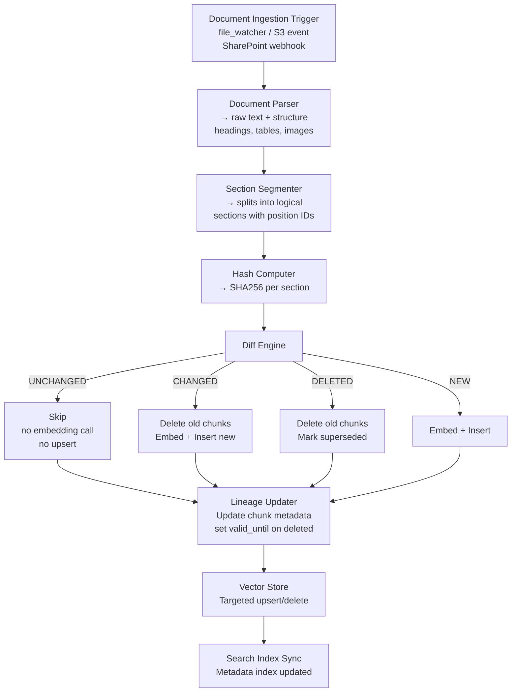
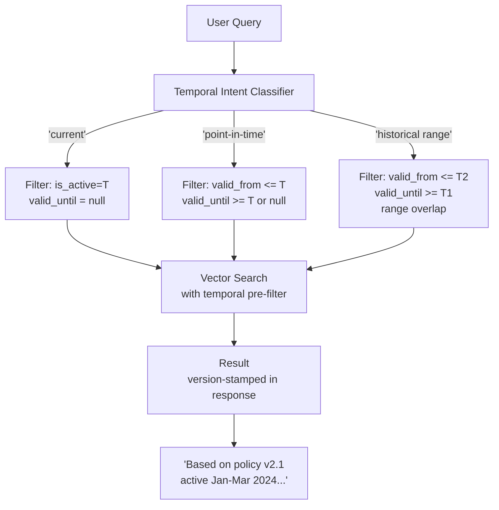
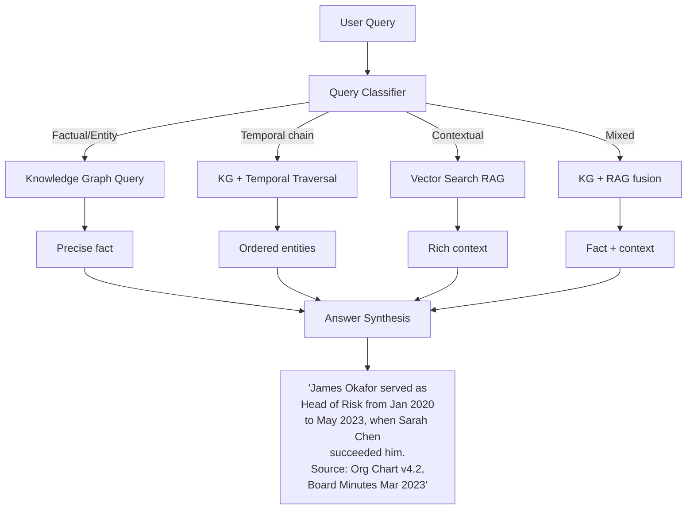
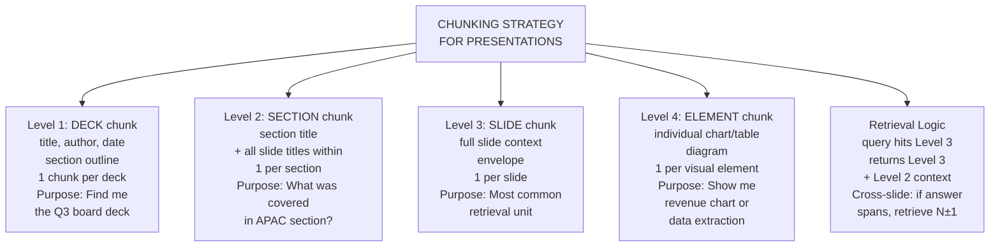
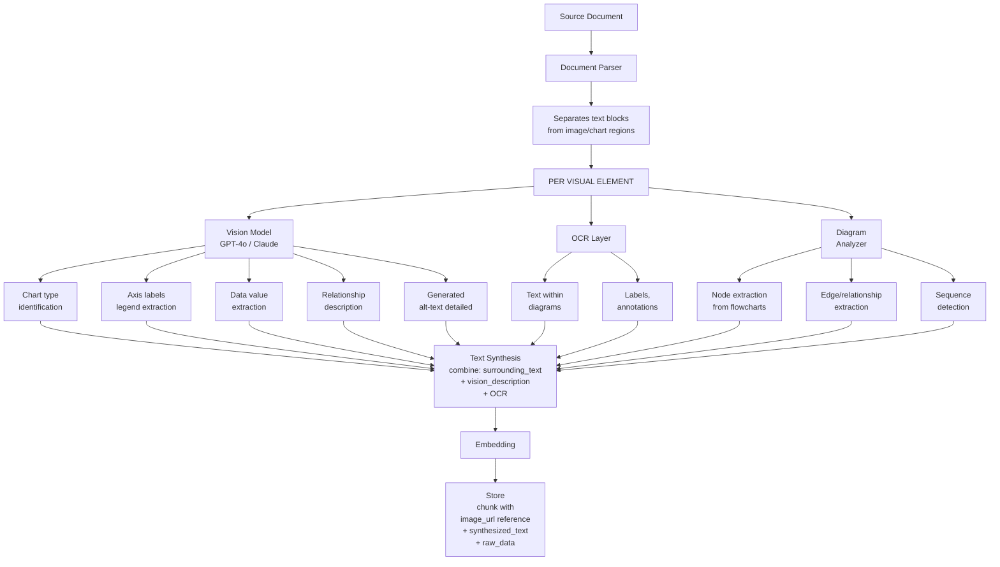
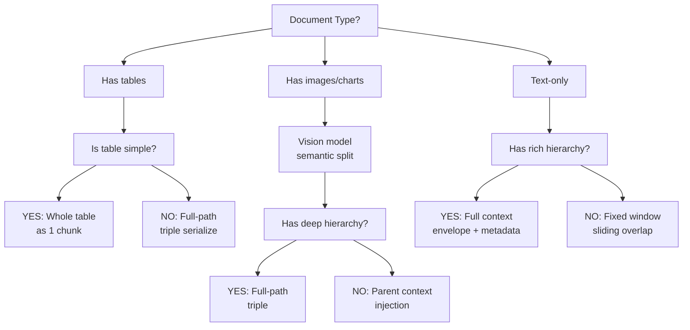

# Complex RAG Systems: Deep Technical Guide

*Delta Indexing · Document Versioning · Multi-Modal · Complex Tables · Temporal QnA · Knowledge Links*

This guide covers every major complexity in production-grade RAG systems: how to index only what changed, how to handle documents with images and slides, how tables with grouped headers break naive chunking, how temporal/historical knowledge must be modeled, and how knowledge links span across filenames, sections, and document hierarchies — with concrete strategies for each.

## 1. Delta Indexing — Only Re-Index What Changed

:::note
Naive RAG re-indexes the entire corpus on every document update. At enterprise scale (millions of documents), this is computationally catastrophic. Delta indexing is the architecture that makes RAG systems production-feasible.
:::

### 1.1  The Core Problem with Full Re-Indexing

Every time a policy document changes by one paragraph, a naive system re-chunks, re-embeds, and re-upserts the entire document. At scale: 100,000 documents × 500 chunks × embedding API cost = financial and latency catastrophe. The goal of delta indexing is surgical precision: identify exactly what changed, retire only the affected chunks, and insert only the new chunks.

### 1.2  Document Fingerprinting Strategy

**THE MECHANISM**

```python
# Document-level fingerprint
doc_fingerprint = SHA256(raw_bytes)   # Detects ANY change

# Section-level fingerprint (more granular)
for section in parsed_sections:
    section_hash = SHA256(section.text + section.position_id)
    store(doc_id, section_id, section_hash, embedding_id)

# On update: 
new_hashes = compute_section_hashes(new_version)
old_hashes = retrieve_stored_hashes(doc_id)
to_delete = old_hashes - new_hashes   # Removed or changed sections
to_insert = new_hashes - old_hashes   # New or changed sections
unchanged = old_hashes & new_hashes   # Do nothing — embeddings still valid
```

**What counts as a 'section' for hashing?**

- **Structural boundary:** Heading-based sections (H1, H2, H3) — most reliable for documents with clear structure
- **Semantic boundary:** Paragraph clusters separated by topic shift — requires a topic segmentation model
- **Fixed-position boundary:** Page + paragraph index — brittle if document reflows, but fast
- **Sentence-level:** Maximum granularity, maximum overhead — use only for high-churn, high-value documents

### 1.3  The Chunk Lineage Graph — The Critical Data Structure

Every chunk in the vector store must carry a complete lineage record. Without this, you cannot perform targeted deletion, version rollback, or audit trail queries.

```python
# Chunk metadata schema (stored alongside the embedding)
{
    chunk_id:          'uuid-v4',
    doc_id:            'policy-manual-v2.3',
    doc_version:       '2.3',
    section_id:        'section-4.2-data-retention',
    section_hash:      'sha256:a3f9...',
    chunk_index:       3,           # Position within section
    total_chunks:      7,           # Total chunks in section
    parent_heading:    'Data Retention Policy',
    grandparent_heading: '4. Compliance Requirements',
    doc_title:         'Information Security Policy',
    filename:          'ISP-v2.3-2025-01.pdf',
    created_at:        '2025-01-15T09:00:00Z',
    valid_from:        '2025-01-15',
    valid_until:       None,         # null = currently active
    superseded_by:     None,         # chunk_id of replacement
    source_type:       'pdf',
    page_numbers:      [14, 15],
    contains_table:    False,
    contains_image:    False,
}
```

### 1.4  The Delta Pipeline Architecture



### 1.5  What Can Go Wrong — Delta Indexing Failure Modes

| Failure Mode | Mitigation Strategy |
| --- | --- |
| Section boundary shift: a doc restructures headings — same text, different section_id → false re-index of entire doc | Normalize text before hashing: strip whitespace, lowercase, remove formatting artifacts |
| Whitespace-only changes trigger re-embedding unnecessarily | Two-level hash: coarse (section-level) gates fine (paragraph-level) diff |
| Table reformatting: column reordered → hash changes but semantic content unchanged | Table-specific hasher: hash on cell content, not positional layout |
| Image replacement: binary hash changes even if image is visually identical | Image semantic hash: perceptual hash (pHash) not byte hash for images |
| Race condition: two versions processed concurrently → chunk lineage corrupted | Document-level processing lock: mutex per doc_id in the pipeline |

## 2. Versioned Documents — The Temporal Knowledge Problem

:::note
This is one of the hardest problems in enterprise RAG. When a policy changes, which version applies to a query? When a user asks 'what was the data retention policy in Q3 2024?' the system must retrieve the correct version — not the latest. Naive RAG has no concept of time.
:::

### 2.1  Version Taxonomy — Four Different Problems

| Version Type | Example | Query Pattern | Key Challenge |
| --- | --- | --- | --- |
| Point-in-Time | Policy v2.1 active Jan–Mar 2025 | What was the policy in Feb 2025? | Retrieve by validity date range |
| Superseded Knowledge | CEO changed from A to B in March | Who was CEO in 2023? | Temporal entity resolution |
| Incremental Update | Section 4.2 changed; rest unchanged | What does section 4 say? | Mixed-version retrieval risk |
| Branching Versions | Region-specific variants of same doc | EU vs. US policy for X? | Version disambiguation from query |
| Retracted Content | Recall notice supersedes product spec | Is product X approved? | Must surface retraction, not original |

### 2.2  Bi-Temporal Data Model for Chunks

A production RAG system needs TWO time axes for every chunk — not one. This is borrowed from bi-temporal database design.

```python
# Bi-temporal chunk model
{
    # VALID TIME: when this fact was true in the real world
    valid_from:       '2024-01-01',  # When the policy took effect
    valid_until:      '2024-12-31',  # When it was replaced (null = still active)
    
    # TRANSACTION TIME: when we recorded this in our system
    recorded_at:      '2024-01-03',  # When we indexed it (may lag valid_from)
    deleted_at:       None,          # When we removed it from index (audit trail)
    
    # VERSION CHAIN
    version:          '3.2',
    previous_version: '3.1',
    superseded_by:    'chunk-uuid-789',  # Pointer to replacement chunk
    supersedes:       'chunk-uuid-456',  # Pointer to what this replaced
    
    # RETRIEVAL BEHAVIOR FLAGS
    is_active:        True,   # False = soft-deleted, not returned in default queries
    is_retraction:    False,  # True = this chunk explicitly overrides prior content
    retraction_scope: None,   # If retraction: which doc_id/section_id is retracted
}
```

### 2.3  Temporal Query Routing



### 2.4  The 'Who Preceded Whom' Problem — Temporal Entity Chains

This is a specific class of temporal query that breaks standard RAG entirely. When a user asks 'who was the Head of Risk before Sarah Chen?' the system must traverse a temporal entity chain — not just retrieve a document.

:::note
**Standard RAG failure:** retrieves the most recent 'Head of Risk' document (Sarah Chen) and returns her name. Does not understand the query is asking for a predecessor.

**Solution:** Temporal Entity Graph Overlay — Store leadership/role transitions as a graph, not just documents
:::

```python
# Store leadership/role transitions as a graph, not just documents
ENTITY_NODE = {
    entity_id:    'role:head-of-risk',
    entity_type:  'ROLE',
    occupant:     'Sarah Chen',
    valid_from:   '2023-06-01',
    valid_until:  None,          # Current
    predecessor:  {
        occupant: 'James Okafor',
        from: '2020-01',
        until: '2023-05'
    },
    successor:    None
}

# Query decomposition for 'who preceded Sarah Chen as Head of Risk?'
# Step 1: Entity extraction → (Sarah Chen, Head of Risk)
# Step 2: Graph lookup → find entity_id where occupant='Sarah Chen'
# Step 3: Traverse → return predecessor.occupant = 'James Okafor'
# Step 4: Augment with doc chunks for context if needed

# Hybrid answer: graph gives the fact, RAG gives the context
```

**Knowledge Graph + RAG Hybrid Architecture**



## 3. Multi-Modal Documents — Images, PPTs, Charts

:::note
A PowerPoint slide with a chart is not a text document with an image attached. The chart IS the content. A process diagram in a PDF contains knowledge that cannot be extracted by any text parser. Multi-modal RAG is fundamentally different from text RAG.
:::

### 3.1  The Multi-Modal Knowledge Map — Where Knowledge Lives in Non-Text Documents

| Document Type | Text Content | Visual Content | Structural Content | Hidden Knowledge |
| --- | --- | --- | --- | --- |
| PowerPoint | Slide text, notes | Charts, diagrams, photos | Slide sequence, section breaks | Animation order implies causality; hidden slides; speaker notes context |
| PDF with charts | Body text, captions | Charts, infographics | Page layout, columns | Chart axes/legends not in text; data values in chart not in prose |
| Word with diagrams | Body text, alt-text | Flow diagrams, org charts | Heading hierarchy | Relationships in diagram (arrows, connections) lost in text extraction |
| Excel/Sheets | Cell text, labels | Embedded charts | Row/column structure | Formulas encode relationships; conditional formatting encodes meaning |
| Scanned PDF | None (OCR only) | Everything | None | Table structure, form fields, handwritten annotations all lost |

### 3.2  The PPT Complexity — Slide Knowledge is Contextual

A PowerPoint slide rarely makes sense without its surrounding context. Slide 7 that shows a bar chart labeled 'Revenue by Region' is meaningless without: the deck title (Q3 2024 Board Review), the section (APAC Performance), and the previous slide (sets up the baseline). Chunking slide 7 in isolation loses all of this.

**Slide Chunk Metadata — The Full Context Envelope**

```python
# Every slide chunk carries its full presentational context
{
    chunk_id:           'ppt-q3board-slide7-chunk1',
    source_file:        'Q3_2024_Board_Review_FINAL.pptx',
    deck_title:         'Q3 2024 Board Review',
    deck_author:        'Finance Team',
    deck_date:          '2024-10-15',
    slide_number:       7,
    total_slides:       42,
    slide_title:        'APAC Revenue — Q3 Performance',
    section_name:       'Regional Performance',
    section_slide_start:5,
    preceding_slide_title:  'APAC — Context and Targets',   # Slide 6
    following_slide_title:  'APAC — Key Drivers',           # Slide 8
    content_types:      ['text', 'bar_chart', 'table'],
    chart_description:  'Bar chart: Revenue by sub-region Q3 vs Q2. Y-axis: USD millions. X-axis: AU, JP, SG, IN, KR.',
    extracted_data:     { AU: 142.3, JP: 89.1, SG: 67.4 },  # From chart via vision model
    speaker_notes:      'Highlight AU outperformance. JP decline driven by FX headwinds.',
    is_hidden_slide:    False,
    slide_layout:       'Two Content',
}
```

**The Slide-to-Chunk Hierarchy**



### 3.3  Image and Chart Extraction — The Pipeline



**Cross-Slide Knowledge Links — The Hard Case**

A diagram on slide 3 shows a process. Slide 11 shows performance metrics for that process. Slide 19 shows an exception to the process. These three slides are deeply linked but nothing in their text says so. This is a knowledge link that can only be discovered through semantic understanding.

```python
# CROSS-SLIDE LINK DISCOVERY (post-indexing)
for pair in slide_pairs:
    slide_i, slide_j = pair
    similarity = cosine_similarity(embed(slide_i), embed(slide_j))
    if similarity > THRESHOLD:
        create_link(slide_i, slide_j, type='semantic_related')

# Entity co-reference detection
entities_slide_i = extract_entities(slide_i)  # e.g., 'APAC Revenue'
entities_slide_j = extract_entities(slide_j)
shared = entities_slide_i ∩ entities_slide_j
if shared:
    create_link(slide_i, slide_j, type='entity_shared', entities=shared)

# At retrieval time
retrieved_slide → follow links → return linked slides as supporting context
```

## 4. Complex Table Structures — The Hardest Chunking Problem

:::note
Tables are the most frequently broken content in enterprise RAG. A cell in row 7, column 4 of a merged-header table has NO meaning without its row header, its column header, its column group header, and potentially the document section header that contextualizes the entire table. Standard text chunking destroys all of this.
:::

### 4.1  Table Complexity Taxonomy

**C1: Simple Table — Single row header, single column header (Low Complexity)**

The only table that naive chunking handles acceptably. Still loses context if the table caption or document section context is not attached to the chunk.

**C2: Multi-Level Column Headers — Grouped/Nested Column Headers (High Complexity)**

Example: A financial table where columns are grouped as `[Q1: Jan, Feb, Mar] [Q2: Apr, May, Jun]`. The cell in row 'Revenue', column 'Feb' only makes sense as 'Revenue — Q1 — February'. Standard chunking sees 'Feb' as the column header, losing the 'Q1' grouping.

```python
# Multi-level column header serialization strategy
# Original table structure:
# |          | Q1                  | Q2                  |
# |          | Jan   | Feb   | Mar | Apr   | May   | Jun |
# | Revenue  | 142   | 156   | 171 | 188   | 195   | 203 |
# | COGS     | 89    | 94    | 102 | 113   | 118   | 124 |

# WRONG: Flat serialization loses hierarchy
# 'Jan Feb Mar Apr May Jun Revenue 142 156 171 188 195 203'

# CORRECT: Full path serialization
# Generate one statement per data cell:
rows = []
for row_header in ['Revenue', 'COGS']:
    for col_group in ['Q1', 'Q2']:
        for col in table.get_children(col_group):  # Jan, Feb, Mar
            value = table.get_cell(row_header, col)
            rows.append(f'{row_header} | {col_group} | {col} = {value}')

# Output:
# Revenue | Q1 | January = 142
# Revenue | Q1 | February = 156
# Revenue | Q2 | April = 188
# (each row is a complete, retrievable fact)
```

**C3: Multi-Level Row Headers — Grouped/Nested Row Headers (High Complexity)**

Example: A risk register where rows are grouped as `[Credit Risk: Default Risk, Counterparty Risk] [Market Risk: FX Risk, Interest Rate Risk]`. The cell value only makes sense with its full row path: 'Credit Risk &gt; Counterparty Risk &gt; Likelihood'.

**C4: Bidirectional Headers — Both Row AND Column are Multi-Level (Very High Complexity)**

Common in financial reports, actuarial tables, and medical data. Every cell has a compound address on BOTH axes. The cell value needs a 4-part address to be meaningful: `[Row Group > Row Sub] [Col Group > Col Sub] = Value`.

```python
# Bidirectional header resolution algorithm
def serialize_cell(table, row_path, col_path, value):
    # row_path = ['Credit Risk', 'Counterparty Risk']
    # col_path = ['Q3 2024', 'Likelihood']
    row_label = ' > '.join(row_path)
    col_label = ' > '.join(col_path)
    return f'{row_label} | {col_label} = {value}'

# Output: 'Credit Risk > Counterparty Risk | Q3 2024 > Likelihood = High'
# This is a complete, standalone retrievable fact
```

**C5: Document-Context Tables — Table Meaning Requires Document Context (Extreme Complexity)**

Example: A table titled simply 'Performance Metrics' inside a document section called 'APAC Region — FY2024 Review' under a document called 'Annual Report FY2024.pdf'. None of the table's cells mention APAC, FY2024, or that this is a performance review. The context is entirely in the hierarchy above the table.

```python
# Full document context injection into table chunks
# Document hierarchy for a table cell chunk:
{
    filename:         'Annual_Report_FY2024.pdf',
    document_title:   'FY2024 Annual Report',
    chapter:          '4. Regional Performance',
    section:          '4.3 Asia Pacific Region',
    subsection:       'FY2024 Review',
    table_caption:    'Performance Metrics',   # or None if untitled table
    table_number:     'Table 4.3.2',           # or None
    preceding_para:   'The following table summarizes APAC performance against targets.',
    
    # The chunk text is PREFIXED with this full context:
    chunk_text: '''
[Document: FY2024 Annual Report > Chapter 4: Regional Performance > Section 4.3: Asia Pacific > Table: Performance Metrics]
Revenue Target | FY2024 Actual = 1.24B
Revenue Target | FY2024 Target = 1.18B
Revenue Target | FY2024 vs Target = +5.1%
'''
}
```

**C6: Filename as Context — The Implicit Document Header (High Complexity)**

The filename itself is a knowledge source. 'ISP-APAC-v3.2-APPROVED-2025-01.pdf' tells you: Information Security Policy, APAC region, version 3.2, approved status, January 2025. This metadata is completely lost if the filename is not parsed and attached to every chunk from this document.

```python
# Filename parser — extract structured metadata from filename
def parse_filename_metadata(filename: str) -> dict:
    # Pattern: {DOC_TYPE}-{REGION}-{VERSION}-{STATUS}-{DATE}.{EXT}
    patterns = {
        'doc_type':  r'(ISP|HR-POL|FIN-RPT|PROD-SPEC|RISK-REG)',
        'region':    r'(APAC|EMEA|AMER|GLOBAL)',
        'version':   r'v(\d+\.\d+)',
        'status':    r'(DRAFT|APPROVED|ARCHIVED|SUPERSEDED)',
        'date':      r'(\d{4}-\d{2})',
    }
    
    # Extract and attach to ALL chunks from this document
    return {
        'doc_type': 'Information Security Policy',
        'region': 'Asia Pacific',
        'version': '3.2',
        'status': 'APPROVED',
        'effective_month': '2025-01',
    }
    
    # These fields become filterable metadata on every chunk from this file
    # Query: 'latest approved APAC security policy' → filter: doc_type=ISP, region=APAC,
    #         status=APPROVED, sort by version desc → returns correct document
```

### 4.2  Table Chunking Strategies — Decision Framework

| Table Type | Recommended Chunking Strategy | Chunk Granularity | Context Injection |
| --- | --- | --- | --- |
| Simple lookup table (&lt;20 rows) | Whole table as single chunk | 1 chunk per table | Caption + section heading |
| Wide table (many columns) | Row-per-chunk with full column path | 1 chunk per row | Full column hierarchy prefix on every row |
| Tall table (many rows) | Semantic grouping by row category | 1 chunk per row group | Document + section + table caption |
| Multi-level column header | Full-path cell serialization | 1 chunk per data section | Column hierarchy resolved per chunk |
| Bidirectional headers | Cell-level fact triples | 1 triple per cell (high-value) or row (balanced) | Both row and column full paths |
| Continuation table (spans pages) | Detect and merge before chunking | Treat as single logical table | Document context + all page numbers |
| Dynamic/pivot table | Store raw data + multiple serializations | Multiple views of same data | Query-time view selection |

### 4.3  Table Serialization Patterns — The Complete Set

```python
# PATTERN 1: MARKDOWN (good for simple tables, fails on merged cells)
# | Region | Q1  | Q2  |
# | APAC   | 142 | 188 |

# PATTERN 2: TRIPLE SERIALIZATION (best for complex tables)
# <row_header> | <col_header> = <value>
# APAC | Q1 Revenue = 142
# APAC | Q2 Revenue = 188

# PATTERN 3: NATURAL LANGUAGE SENTENCES (most retrievable, least dense)
# 'APAC region generated revenue of 142M in Q1 and 188M in Q2.'
# Best for: lookup queries, human-readable answers
# Worst for: precise data extraction, calculation queries

# PATTERN 4: JSON STRUCTURED (best for downstream processing)
# { row: 'APAC', col_group: 'Q1', col: 'Revenue', value: 142, unit: 'USD_M' }

# PATTERN 5: HYBRID (embed NL, store JSON as metadata)
# Embed: 'APAC region Q1 revenue was 142 million USD'
# Metadata: { row: 'APAC', col_group: 'Q1', value: 142, unit: 'USD_M' }
# Retrieval: semantic search finds it, metadata enables exact computation

# RECOMMENDATION: Use Pattern 5 (Hybrid) for enterprise RAG.
# Never rely on a single serialization for complex tables.
```

## 5. Cross-Document Knowledge Links

:::note
In an enterprise knowledge base, no document is an island. A risk register references a control framework. An API spec references a data dictionary. A contract references a policy. A product manual references a safety bulletin. RAG systems that treat documents in isolation break all of these links.
:::

### 5.1  Types of Knowledge Links in Enterprise Documents

| Link Type | Example | Where Link Lives | Challenge |
| --- | --- | --- | --- |
| Explicit Reference | 'See Section 4.2 of the Data Policy' | In-text citation | Must resolve reference to actual chunk, not just document |
| Implicit Semantic Link | Two docs describe same process differently | No explicit mention | Only discoverable through semantic similarity |
| Entity Co-occurrence | Same product code appears in spec, test report, and support ticket | Shared named entity | Entity disambiguation (same name, different entity?) |
| Hierarchical Link | Policy → Standard → Procedure → Work Instruction | Document structure/naming | Must model the hierarchy, not just the documents |
| Temporal Supersession | New circular supersedes old bulletin | Usually in header/title only | Must link old to new AND propagate in retrieval |
| Filename/Title Link | Table column header says 'see ISP-v3.pdf' | Inside table cell | Must extract and resolve in-cell document references |
| Visual Link | Diagram in doc A is explained in doc B | No text link — visual only | Requires image fingerprinting or visual embedding match |

### 5.2  The Knowledge Graph Layer — The Solution

Cross-document links cannot be handled by a pure vector store. They require a graph data structure that sits alongside the vector index and models relationships between chunks, documents, and entities.

```
KNOWLEDGE GRAPH SCHEMA (property graph — Neo4j / Amazon Neptune style):

NODES:
  (:Document  { doc_id, title, version, type, status, valid_from, valid_until })
  (:Section   { section_id, doc_id, heading, level, position })
  (:Chunk     { chunk_id, section_id, text_preview, embedding_id })
  (:Entity    { entity_id, name, type: PERSON|ORG|PRODUCT|POLICY|ROLE })
  (:Table     { table_id, doc_id, caption, structure_type })
  (:Image     { image_id, doc_id, phash, vision_description })

RELATIONSHIPS:
  (:Document)-[:SUPERSEDES]->(:Document)
  (:Document)-[:REFERENCES]->(:Section)    # Explicit cross-doc reference
  (:Document)-[:GOVERNED_BY]->(:Document)  # Policy hierarchy
  (:Chunk)-[:CONTAINS]->(:Entity)
  (:Entity)-[:SUCCEEDED_BY { from, until }]->(:Entity)  # Temporal chain
  (:Chunk)-[:SEMANTICALLY_RELATED { score }]->(:Chunk)  # Cross-doc similarity
  (:Table)-[:REQUIRES_CONTEXT]->(:Section)  # Table needs section for meaning
  (:Image)-[:EXPLAINED_BY]->(:Chunk)         # Cross-doc image explanation
```

### 5.3  Graph-Augmented Retrieval — The Full Flow

```
GRAPH-AUGMENTED RAG RETRIEVAL:

Query: 'What controls apply to third-party data access?'

Step 1: Vector search → top-5 chunks
  → Chunk A: 'Third-party access requirements' (from Data Policy v3.1)
  → Chunk B: 'Vendor management controls' (from Risk Framework v2.0)

Step 2: Graph traversal from retrieved chunks
  → Chunk A → [:REFERENCES] → Section 7 of 'Third Party Agreement Template'
  → Chunk A → [:GOVERNED_BY] → ISO27001 Control A.15 (external doc)
  → Chunk B → [:SUPERSEDES] → Chunk C (old version — exclude from results)
  → Chunk B → [:CONTAINS] → Entity 'Third-party data access' (same as query)

Step 3: Expand context
  → Add referenced Section 7 chunk (not in top-5 but graph says relevant)
  → Add superseded flag to any old chunks that appear

Step 4: Synthesize answer
  → 'Based on Data Policy v3.1 (Section 4) and Risk Framework v2.0 (Section 7),
     third-party data access requires: [1] ... [2] ...
     See also: Third Party Agreement Template Section 7 for contractual controls.'
```

## 6. Strategies for Keeping Information Latest and Greatest

:::note
A RAG system that retrieves stale information is worse than no RAG system — it confidently returns wrong answers. The index freshness problem is not just a technical pipeline problem. It is an architectural problem that spans detection, processing, validation, and retrieval-time filtering.
:::

### 6.1  The Freshness Strategy Matrix

| Strategy | Best For | Latency | Cost | Completeness |
| --- | --- | --- | --- | --- |
| Real-time webhook trigger | High-churn, high-value docs (policies, product specs) | Seconds | High | Near-perfect |
| Scheduled crawl + diff | Medium-churn corpora (reports, manuals) | Minutes to hours | Medium | High |
| Event-driven (S3/SharePoint events) | Cloud-stored enterprise docs | Seconds to minutes | Low-Medium | High |
| User-triggered (on first access) | Long-tail, rarely-accessed docs | First access delay | Low | Eventual |
| Batch nightly reindex (full) | Small, high-value corpus only | Hours | High | Perfect |
| Hybrid: hash diff + schedule | Most enterprise use cases | Hours max | Medium | High |

### 6.2  Retrieval-Time Freshness Enforcement

Even with the best update pipeline, the retrieval layer must enforce freshness as a hard constraint — not just a preference. A stale chunk that happens to be semantically very similar to the query will score higher than a fresh but less similar chunk. This is the silent freshness bug.

```python
# Retrieval-time freshness enforcement strategies

# Strategy 1: Hard temporal filter (pre-filter before vector search)
results = vector_store.search(
    query_embedding=embed(query),
    filter={
        'is_active': True,              # Hard filter: never return superseded
        'valid_until': None,            # Hard filter: only currently valid
        # For temporal queries:
        'valid_from': {'$lte': query_date},
        'valid_until': {'$gte': query_date, '$or': None},
    },
    top_k=20
)

# Strategy 2: Recency score boost (post-retrieval re-ranking)
for chunk in results:
    age_days = (today - chunk.valid_from).days
    recency_score = 1.0 / (1.0 + log(1 + age_days / 365))
    chunk.final_score = (0.7 * chunk.semantic_score) + (0.3 * recency_score)

# Strategy 3: Conflict detection (multiple versions returned)
def detect_version_conflict(results):
    by_section = group_by(results, 'section_id')
    conflicts = [g for g in by_section if len(g) > 1]
    if conflicts:
        # Return only highest version, flag conflict in response
        return max(g, key=lambda c: c.doc_version), flag_conflict=True
```

### 6.3  The Version Conflict Response — What to Tell the User

```python
# When the system detects conflicting versions of the same content:
response = {
    'answer': 'Based on the current approved version (v3.2, effective Jan 2025)...',
    'version_used': 'ISP-v3.2-APPROVED-2025-01.pdf',
    'conflict_detected': True,
    'conflict_note': 'An earlier version (v3.1, valid until Dec 2024) exists.',
    'If you need the historical version, ask with a specific date.',
    'sources': [
        {
            'doc': 'ISP-v3.2-APPROVED-2025-01.pdf',
            'section': '4.2',
            'status': 'ACTIVE'
        },
        {
            'doc': 'ISP-v3.1-APPROVED-2024-01.pdf',
            'section': '4.2',
            'status': 'SUPERSEDED'
        }
    ]
}

# The user ALWAYS knows which version answered their question.
# The system NEVER silently serves a superseded version.
```

### 6.4  The Retraction Problem — When Content Must Be Un-Known

A product recall notice doesn't just add new information — it invalidates existing information. When a product spec is recalled, every chunk from that spec must either be deleted or flagged so that retrieval surfaces the retraction, not the original content. This is the hardest freshness case.

```python
# Retraction propagation architecture

# Step 1: Detect retraction document
# Trigger: filename contains 'RECALL', 'RETRACTION', 'SUPERSEDES'
# OR: document text contains 'this document supersedes', 'hereby retracted'

# Step 2: Extract scope of retraction
retraction = {
    'retracted_doc_id': 'PROD-SPEC-X200-v2.1',
    'retracted_sections': ['all'],  # or ['Section 3', 'Appendix B']
    'effective_date': '2025-02-01',
    'reason': 'Safety defect identified — see bulletin SB-2025-047',
    'replacement_doc_id': 'PROD-SPEC-X200-v2.2',  # or None
}

# Step 3: Mark all affected chunks
affected = vector_store.filter({ 'doc_id': retracted_doc_id })
for chunk in affected:
    chunk.is_active = False
    chunk.retracted_by = retraction_doc_id
    chunk.valid_until = retraction.effective_date

# Step 4: Insert retraction notice as its own chunk
insert_chunk({
    'text': f'RETRACTION NOTICE: {retracted_doc_id} was retracted on {date}. Reason: {reason}. See: {replacement_doc_id}',
    'is_retraction_notice': True,
    'retraction_scope': retracted_doc_id,
    'is_active': True,  # This chunk IS active — it's the notice
})

# Step 5: Retrieval logic — surface retraction when original would have been returned
# If query matches retracted content: return retraction notice + replacement, not original
```

## 7. The Complete Complexity Map — All Known Hard Problems

This section catalogs every significant complexity in enterprise RAG, categorized by layer. Use this as a checklist when designing or auditing a RAG system.

### 7.1  Document Parsing Layer Complexities

| P1 | PDF structure loss: multi-column layouts parsed as single column, mixing content from separate columns into the same text stream |
| --- | --- |
| P2 | Continuation tables: a table that spans multiple pages — parsers produce two separate tables with no connection |
| P3 | Merged cells: a cell that spans 3 rows is repeated 3 times in naive parsing, producing duplicate and incorrect data |
| P4 | Footnote displacement: footnotes appear at bottom of page, breaking away from the in-text reference — must be re-joined |
| P5 | Header/footer contamination: page numbers, company name, document title repeated on every page pollute every chunk |
| P6 | Scanned document quality: low-DPI scans produce OCR errors that corrupt facts (1 vs I, 0 vs O, 5 vs S in numbers) |
| P7 | Watermarks and track changes: DRAFT watermarks, red-line changes, and comments included in text extraction |
| P8 | Embedded document-in-document: a PDF embedded inside a Word doc, or a Word table pasted as an image in a PPT |
| P9 | Right-to-left and mixed-direction text: Arabic or Hebrew mixed with English — parsing order is often incorrect |
| P10 | Password-protected or DRM-restricted content: cannot be parsed — must detect and handle gracefully, not silently fail |

### 7.2  Chunking Layer Complexities

| C1 | Chunk boundary mid-sentence: fixed-size chunking cuts sentences in half — the second chunk loses the subject of the sentence |
| --- | --- |
| C2 | Context orphaning: a chunk contains pronouns ('it', 'this', 'the policy') whose referent is in the previous chunk — retrieval returns unresolvable references |
| C3 | List item splitting: a numbered list with 10 items split across two chunks — retrieval may return incomplete list without items 6-10 |
| C4 | Table cell without headers: retrieving a single table row chunk that lacks column header context — numbers with no meaning |
| C5 | Caption-less figures: an image or chart chunk with no surrounding caption or explanation text — vision description only |
| C6 | Code block splitting: a code sample split mid-function — the second chunk is syntactically invalid and semantically incomplete |
| C7 | Dense numeric sections: actuarial tables, financial schedules — high information density but low semantic signal for embedding similarity |
| C8 | Duplicate content: the same policy appears in multiple documents — retrieval returns duplicates, inflates confidence |
| C9 | Boilerplate contamination: legal disclaimers, standard footers, repeated executive summaries dilute embedding space |
| C10 | Optimal chunk size mismatch: best chunk size for precise retrieval ≠ best chunk size for complete answer generation |

### 7.3  Embedding and Retrieval Layer Complexities

| E1 | Vocabulary mismatch: query uses 'headcount reduction', document says 'workforce rightsizing' — low cosine similarity, missed retrieval |
| --- | --- |
| E2 | Numerical precision: '142.3 million' vs '142,300,000' — same fact, different embedding representation, may not retrieve as match |
| E3 | Abbreviation ambiguity: 'ISP' = Information Security Policy or Internet Service Provider — embeddings may conflate them |
| E4 | Multilingual: document in English, query in Spanish — cross-lingual embedding models required; monolingual models fail |
| E5 | Long document retrieval: a query whose answer spans 3+ sections — top-K retrieval returns partial answer from any single chunk |
| E6 | Needle in haystack: a very specific, rare fact in a large corpus — may not score in top-K despite being the only correct answer |
| E7 | Semantic similarity ≠ relevance: two chunks can be semantically similar but one is a question and one is an answer to a different question |
| E8 | Embedding model drift: if you update the embedding model, ALL existing embeddings are incompatible — requires full re-embedding of the corpus |
| E9 | Hybrid search calibration: the weight between keyword (BM25) and semantic search must be tuned per domain — wrong weights degrade both |
| E10 | Cold start: new documents not yet embedded but already referenced in queries — must handle 'document exists but not indexed yet' state |

### 7.4  Answer Generation Layer Complexities

| G1 | Multi-hop reasoning: answer requires combining facts from 3 retrieved chunks — LLM may fail to synthesize or may hallucinate a bridge |
| --- | --- |
| G2 | Conflicting sources: two retrieved chunks give different values for the same fact (v1 policy vs v2 policy) — LLM must choose, may choose wrong one |
| G3 | Tabular computation: user asks for a sum or average across table rows — LLM is unreliable for arithmetic on retrieved data |
| G4 | Negative space: the corpus does not contain information about X — LLM may hallucinate an answer rather than admitting absence |
| G5 | Attribution faithfulness: LLM cites source A but the answer actually came from source B — citation hallucination |
| G6 | Temporal confusion: LLM loses track of which version/date a retrieved chunk belongs to — synthesizes answer mixing multiple time periods |
| G7 | Over-retrieval injection: 20 chunks injected into context — LLM 'lost in the middle' effect: ignores chunks in the middle of the context window |
| G8 | Instruction following in context: system prompt says 'only answer from provided context' but LLM uses training knowledge — no hard enforcement |
| G9 | Answer length calibration: short fact query returns essay; complex analysis query returns one sentence — misalignment with query intent |
| G10 | Sensitive content in retrieved context: a retrieved chunk contains PII or confidential data — LLM may include it verbatim in the answer |

## 8. Architecture Decision Guide — Strategy Selection

### 8.1  Chunking Strategy Decision Tree



### 8.2  When to Use Each Architecture Pattern

| Pattern | Use When | Don't Use When |
| --- | --- | --- |
| Pure Vector RAG | Simple, uniform text corpus; queries are topical/conceptual; no versioning needed | Tables are complex; temporal queries; documents reference each other; strict freshness required |
| Hybrid BM25 + Vector | Domain-specific terminology; exact product codes or IDs must match; multilingual corpus | Pure semantic queries; concept-level questions where keywords don't appear in docs |
| Graph + RAG Hybrid | Cross-document references; entity chains; temporal predecessor/successor queries; hierarchy matters | Small corpus (&lt;1000 docs); no relationship structure in documents; simple Q&amp;A use case |
| Multi-level Indexing | Documents have meaningful hierarchy (deck &gt; section &gt; slide &gt; element); queries can be at any level | Flat document structure; all queries are at the same granularity |
| Bi-temporal Model | Regulated industry; historical queries required; documents are versioned and superseded over time | Static corpus; documents never change; only current state needed |
| Agent-based RAG | Multi-step reasoning required; answer requires calling tools or computing over retrieved data; iterative refinement needed | Single-hop factual lookup; latency-sensitive; cost-constrained |

### 8.3  The Production RAG Quality Evaluation Framework

You cannot improve what you do not measure. Every production RAG system must have a continuous evaluation framework across these dimensions:

| Metric | What It Measures | Target | How to Measure |
| --- | --- | --- | --- |
| Retrieval Recall@K | Are the correct chunks in the top-K results? | &gt;0.85 @ K=10 | Human-labeled eval set with ground-truth chunks |
| Retrieval Precision@K | Of the top-K results, how many are relevant? | &gt;0.70 @ K=5 | Human eval or LLM-as-judge on retrieved chunks |
| Answer Faithfulness | Is the answer grounded in retrieved context? | &gt;0.90 | LLM judge: does answer contradict any retrieved chunk? |
| Citation Accuracy | Does the cited source actually contain the cited claim? | &gt;0.95 | Automated: verify claim appears in cited chunk |
| Freshness Score | Are retrieved chunks from the correct version/date? | 100% (hard constraint) | Compare chunk valid_from/until vs. query date |
| Temporal Accuracy | For date-specific queries, is the correct version returned? | &gt;0.90 | Eval set of historical queries with known-correct versions |
| Table Accuracy | For table queries, is the correct cell value returned? | &gt;0.85 | Eval set of table queries with ground truth values |
| Hallucination Rate | Does the answer contain facts not in any retrieved chunk? | &lt;0.05 | LLM judge: fact-check every claim against context |

*Complex RAG Systems — Deep Technical Guide | Enterprise Architect Interview Prep | March 2026*

## Related

- [Grounding Architectures](10-grounding.md) — the production grounding patterns this deep-dive's indexing and retrieval techniques support.
- [Data Architecture for AI: Foundations & Infrastructure](03-data-architecture-for-ai-report.md) — the vector-DB and semantic-layer foundations these RAG techniques run on.
- [Enterprise Knowledge Architectures Report](14-enterprise-knowledge-architectures-report.md) — knowledge-graph-based alternatives to the chunking/indexing approaches covered here.
